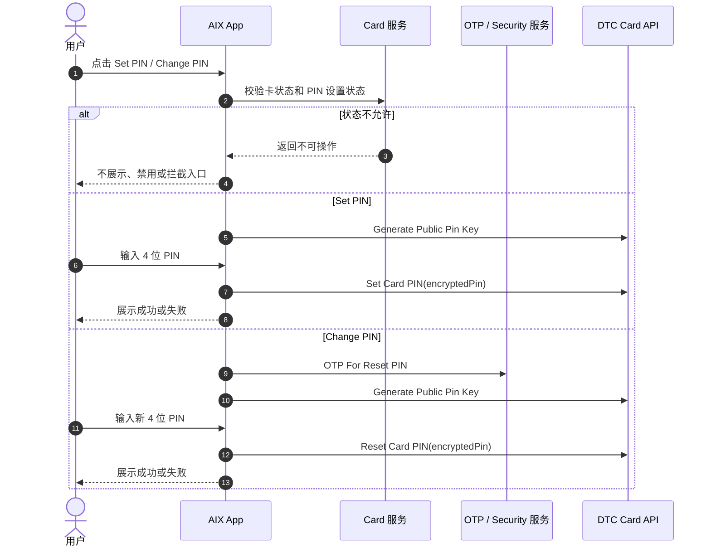
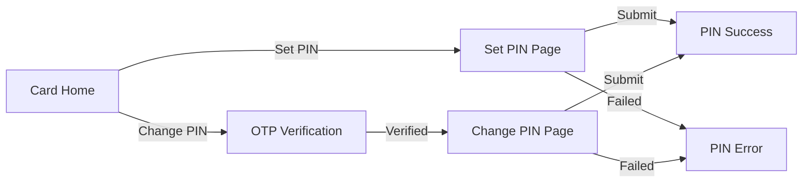

# Card PIN 设置与重置

## 1. 文档信息

| 项目 | 内容 |
|---|---|
| 功能名称 | Card PIN 设置与重置 |
| 所属模块 | Card |
| Owner | 吴忆锋 |
| 版本 | 1.3 |
| 状态 | Review |
| 更新时间 | 2026-05-04 |
| 来源文档 | AIX Card Manage、DTC Card Issuing API、Standard PRD Template v1.3 |

---

## 2. 需求背景、目标与范围

### 2.1 需求背景

Physical Card 激活后，用户需要设置或修改 4 位 PIN。PIN 操作依赖卡状态、PIN 是否已设置、DTC PIN 公钥与 Reset PIN OTP 能力。

### 2.2 用户问题 / 业务问题

如果 PIN 操作状态限制、加密字段、Set / Change / Reset 的命名关系和 OTP 规则不明确，可能导致错误状态下设置 PIN、接口字段错误或 PIN 修改流程无法验收。

### 2.3 需求目标

明确 Set PIN、Change PIN、Reset PIN 的入口条件、业务流程、页面规则、DTC 接口字段、异常处理、待确认事项和验收标准。

### 2.4 涉及功能清单

| 功能点 | 本期范围 | 优先级 | 状态 | 说明 |
|---|---|---|---|---|
| Set PIN 入口 | In Scope | P0 | Confirmed | ACTIVE 实体卡且未设置 PIN |
| Change PIN 入口 | In Scope | P0 | Confirmed | ACTIVE 实体卡且已设置 PIN |
| PIN 状态限制 | In Scope | P0 | Confirmed | 引用 Manage 6.4 操作矩阵 |
| Generate Public Pin Key | In Scope | P0 | Open | 获取 PIN 加密公钥，字段细节待确认 |
| Set Card PIN | In Scope | P0 | Open | 使用 `encryptedPin` 提交首次 PIN |
| OTP For Reset PIN | In Scope | P0 | Open | 修改 PIN 前 OTP 规则引用 Security |
| Reset Card PIN | In Scope | P0 | Open | 前端显示 Change PIN，接口命名为 Reset |

---

## 3. 业务流程与规则

### 3.1 业务主流程说明

系统根据卡状态和 PIN 设置状态决定展示 Set PIN 或 Change PIN。首次设置 PIN 时，用户进入 Set PIN 流程，系统获取 Public Pin Key，加密 4 位 PIN 后调用 Set Card PIN。修改 PIN 时，用户从 Change PIN 入口进入，系统先触发 OTP For Reset PIN，再用新的 `encryptedPin` 调用 Reset Card PIN。

### 3.2 业务时序图

### 3.3 流程步骤与业务规则

| 步骤 | 场景 / 规则 | 触发条件 | 责任方 | 系统处理 | 成功结果 | 失败 / 分支结果 | 来源 |
|---|---|---|---|---|---|---|---|
| 1 | 判断入口 | 用户进入 Card Home | App / Card | 按 ACTIVE + pinSetStatus 判断 | 展示 Set / Change PIN | 其他状态不展示或禁用 | Manage / 6.4 |
| 2 | 获取公钥 | 进入 PIN 提交流程 | App / DTC | 调用 Generate Public Pin Key | 返回公钥 | 失败不可提交 PIN | DTC API |
| 3 | 输入 PIN | 用户输入 PIN | App | 校验 4 位数字 | 可提交 | 格式错误不可提交 | Manage / 7.3 |
| 4 | Set PIN | 首次设置 | App / DTC | 加密后提交 `encryptedPin` | 设置成功，小红点消失 | 保持未设置 | DTC API |
| 5 | OTP 校验 | Change PIN | App / Security | 发送并校验 OTP | 可 Reset PIN | OTP 失败按 Security 规则 | Manage / 7.3 |
| 6 | Reset PIN | OTP 通过 | App / DTC | 加密后提交 `encryptedPin` | 重置成功 | 保持原 PIN 状态 | DTC API |

### 3.4 状态规则

| 状态 | 含义 | 触发条件 | 用户可见表现 | 系统处理 | 可迁移到 | 是否终态 | 来源 |
|---|---|---|---|---|---|---|---|
| ACTIVE + 未设置 PIN | 可首次设置 | 实体卡已激活且未设置 PIN | 展示 Set PIN 和小红点 | 允许 Set Card PIN | ACTIVE + 已设置 PIN | 否 | Manage / 6.4 |
| ACTIVE + 已设置 PIN | 可修改 PIN | 实体卡已设置 PIN | 展示 Change PIN | 允许 Reset Card PIN | ACTIVE + 已设置 PIN | 否 | Manage / 6.4 |
| 非 ACTIVE | 不允许 PIN 操作 | 待激活、SUSPENDED、CANCELLED、BLOCKED、PENDING | 不展示或禁用 PIN 入口 | 不调用 PIN 接口 | 不适用 | 否 | Manage / 6.4 |

### 3.5 业务级异常与失败处理

| 异常场景 | 触发条件 | 错误来源 | 错误码 / 原因 | 用户表现 | 系统处理 | 是否可重试 | 最终状态 |
|---|---|---|---|---|---|---|---|
| 状态不允许 PIN | 非 ACTIVE 或 PIN 状态不匹配 | Backend | 状态限制 | 不展示或禁用入口 | 不调用接口 | 否 | 原状态 |
| Public Key 获取失败 | DTC 返回失败或网络异常 | DTC / Network | 接口失败 | 展示失败提示 | 不允许提交 PIN | 是 | 原状态 |
| PIN 格式错误 | 非 4 位数字 | App | 校验失败 | 按页面提示 | 不提交 | 是 | 当前页 |
| Set PIN 失败 | DTC 返回失败 | DTC | 接口失败 | 展示失败承接 | 保持未设置 | 是 | 未设置 |
| OTP 失败 | Reset PIN OTP 失败或锁定 | Security | OTP error | 按 Security 规则 | 不提交 Reset PIN | 视规则 | 原状态 |
| Reset PIN 失败 | DTC 返回失败 | DTC | 接口失败 | 展示失败承接 | 保持原 PIN | 是 | 已设置 |

---

## 4. 页面与交互说明

### 4.1 页面关系总览图

### 4.2 Set / Change PIN Page

| 区块 | 内容 |
|---|---|
| 页面类型 | 主页面 / 表单页面 |
| 页面目标 | 设置或修改实体卡 PIN |
| 入口 / 触发 | ACTIVE 实体卡点击 Set PIN 或 Change PIN |
| 展示内容 | PIN 输入框、提交按钮、必要安全提示；Change PIN 前需 OTP |
| 用户动作 | 输入 4 位 PIN 并提交 |
| 系统处理 / 责任方 | 获取 Public Pin Key，加密后调用 Set / Reset Card PIN |
| 元素 / 状态 / 提示规则 | 仅 4 位数字可提交；提交中禁止重复提交 |
| 成功流转 | 返回 Card Home，PIN 状态更新 |
| 失败 / 异常流转 | 公钥、OTP、Set / Reset 失败时停留当前流程 |
| 备注 / 边界 | 当前事实未说明是否需要旧 PIN，不得补写 |

---

## 5. 字段、接口与数据

| 类型 | 名称 | 所属系统 | 来源 | 用途 | 规则 / 输入输出 | 异常处理 |
|---|---|---|---|---|---|---|
| 字段 | pinSetStatus | AIX | Application / Home | 判断 Set 或 Change PIN | 字段名为产品占位，真实字段待确认 | 字段缺失时进入待确认 |
| 字段 | encryptedPin | DTC | DTC API | 提交加密 PIN | 使用 `encryptedPin`，不得使用旧字段 `encryptPin` | 字段错误会导致接口失败 |
| 接口 | Generate Public Pin Key | DTC | DTC API | 获取 PIN 加密公钥 | 进入 Set / Reset 前调用 | 失败不可提交 |
| 接口 | Set Card PIN | DTC | DTC API | 首次设置 PIN | 提交 `encryptedPin` | 失败保持未设置 |
| 接口 | OTP For Reset PIN | DTC / Security | DTC API / Manage | Reset PIN 前 OTP | 按 Security OTP 规则 | 失败不继续 |
| 接口 | Reset Card PIN | DTC | DTC API | 重置 PIN | 提交 `encryptedPin` | 失败保持原 PIN |

---

## 6. 通知规则（如适用）

不适用。当前事实文件未定义 PIN 设置或重置的 Push / In-app 通知。

| 触发事件 | 通知渠道 | 通知对象 | 文案 / 模板 | 跳转目标 | 失败 / 补发规则 |
|---|---|---|---|---|---|
| 不适用 | 不适用 | 不适用 | 不适用 | 不适用 | 不适用 |

---

## 7. 权限 / 合规 / 风控（如适用）

| 类型 | 规则 | 影响 | 来源 |
|---|---|---|---|
| 状态权限 | 仅 ACTIVE 实体卡允许 Set / Change PIN | 防止非可用卡操作 PIN | Manage / 6.4 |
| 安全 | PIN 必须加密后提交 | 防止 PIN 明文泄露 | DTC API |
| 认证 | Change PIN 需 OTP For Reset PIN | 防止非本人重置 | Manage / 7.3 |
| 隐私 | PIN 不得在前端持久化明文 | 防止敏感信息泄露 | Security / DTC |

---

## 8. 待确认事项

| 问题 | 影响范围 | 当前处理 | 是否阻塞验收 | 建议确认人 |
|---|---|---|---|---|
| 激活成功后 Set PIN 是否强制，用户是否可跳过 | Activation / PIN / Home | 阻塞 | 是 | PM / Design / BE |
| `pinSetStatus` 的真实后端字段名和刷新机制 | Home / PIN | 不阻塞 / Deferred | 否 | BE / QA |
| Public Pin Key 响应字段、加密算法、`encryptedPin` 结构 | FE / BE / DTC | 阻塞 | 是 | BE / DTC / Security |
| PIN 失败提示文案、尝试次数、锁定规则 | PIN / Security | 不阻塞 / Deferred | 否 | PM / Security |
| Change PIN 是否需要旧 PIN | PIN | 不阻塞 / Deferred | 否 | PM / BE |

---

## 9. 验收标准 / 测试场景

### 9.1 验收标准

| 验收场景 | 验收标准 |
|---|---|
| 正常流程 | ACTIVE 实体卡可按 PIN 状态进入 Set 或 Change PIN，并成功提交 |
| 异常流程 | 非 ACTIVE、格式错误、公钥失败、OTP 失败、接口失败均不可错误更新 PIN 状态 |
| 页面展示 | 未设置 PIN 展示 Set PIN 和小红点；已设置展示 Change PIN |
| 系统交互 | Set / Reset 均使用 `encryptedPin`，Reset 前需要 OTP |
| 通知 | 不适用 |
| 数据 / 埋点 | PIN 状态刷新后 Home 入口正确变化 |

### 9.2 测试场景矩阵

| 场景 | 前置条件 | 用户操作 | 预期页面表现 | 预期系统结果 | 是否必测 |
|---|---|---|---|---|---|
| 首次 Set PIN | ACTIVE 且未设置 PIN | 点击 Set PIN 并提交 4 位数字 | 设置成功，小红点消失 | Set Card PIN 成功 | 是 |
| Change PIN | ACTIVE 且已设置 PIN | 点击 Change PIN，通过 OTP，提交新 PIN | 修改成功 | Reset Card PIN 成功 | 是 |
| 非 ACTIVE 卡 | SUSPENDED / PENDING | 查看 PIN 入口 | 不展示或禁用 | 不调用 PIN 接口 | 是 |
| PIN 格式错误 | ACTIVE | 输入非 4 位数字 | 不可提交 | 不调用接口 | 是 |
| 公钥失败 | ACTIVE | 进入 PIN 页面 | 展示失败提示 | 不提交 PIN | 是 |
| OTP 失败 | 已设置 PIN | Change PIN OTP 失败 | 按 Security 规则提示 | 不调用 Reset PIN | 是 |

---

## 10. 来源引用

- (Ref: 历史prd/AIX Card manage模块需求V1.0.docx / 6.4 / 7.3 / 8.1 / V1.0)
- (Ref: DTC Card Issuing API Document_20260310 (1).pdf / Generate Public Pin Key / Set Card PIN / OTP For Reset PIN / Reset Card PIN)
- (Ref: knowledge-base/card/card-status-and-fields.md)
- (Ref: knowledge-base/card/activation.md)
- (Ref: prd-template/standard-prd-template.md / v1.3)
