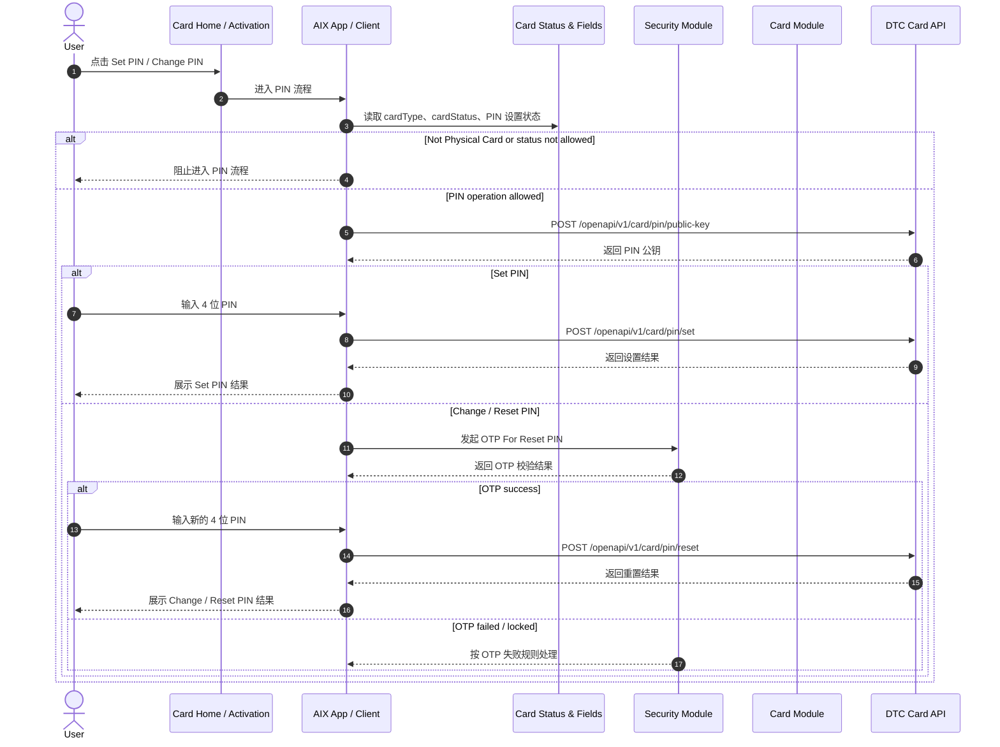
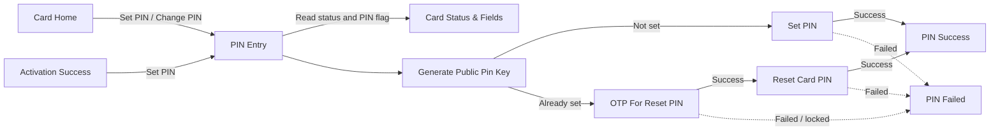

# Card PIN 设置与重置

## 1. 功能定位

Card PIN 用于实体卡的 Set PIN、Change PIN / Reset PIN 操作。

本文件只沉淀 PIN 设置入口、4 位 PIN 规则、PIN 公钥接口、Set Card PIN、OTP For Reset PIN、Reset Card PIN、认证依赖和异常边界。实体卡激活见 `activation.md`，Lock / Unlock 见 `card-management.md`，交易与资金回退见 `card-transaction-flow.md`。

## 2. 适用范围

| 维度 | 规则 | 来源 | 备注 |
|---|---|---|---|
| 卡类型 | Physical Card | Manage / 名词解释 PIN；Manage / 7.3 | PIN 用于实体卡 |
| PIN 长度 | 4 位数字 | Manage / 名词解释 PIN；Manage / 7.3 | 原文明确 PIN 为 4 位数字 |
| 设置入口 | 激活成功后或 Card Home 操作区 | Manage / 7.2；Application / 5.2 | Card Home 只展示入口 |
| Set PIN | 实体卡已激活且未设置 PIN | Application / 5.2；Manage / 7.3 | 未设置时入口显示小红点 |
| Change PIN | 实体卡已激活且已设置 PIN | Application / 5.2；Manage / 7.3 | 已设置后小红点消失 |
| Reset PIN | 外部接口清单存在 Reset Card PIN | Manage / 8.1 | 与 Change PIN 的关系待确认 |

## 3. 前置条件

| 条件 | 说明 | 来源 |
|---|---|---|
| 用户持有 Physical Card | Virtual Card 不适用 PIN | Manage / 名词解释 PIN；Application / 5.2 |
| 卡已激活或完成激活流程 | Set PIN 入口可由激活成功承接 | Manage / 7.2；activation.md |
| 卡状态允许 PIN 操作 | 状态允许范围引用 `card-status-and-fields.md` | Card Status & Fields |
| PIN 加密能力可用 | Generate Public Pin Key 用于 PIN 相关接口 | Manage / 8.1 |
| Reset PIN 需要 OTP | 外部接口清单存在 OTP For Reset PIN | Manage / 8.1 |

## 4. 业务流程

### 4.1 主链路

```text
Card Home / Activation Success → PIN Entry → Generate Public Pin Key → Set PIN / OTP For Reset PIN → Reset PIN → PIN Result
```

### 4.2 业务流程与系统交互时序图



### 4.3 业务逻辑矩阵

| 阶段 | 触发条件 | 系统动作 | 成功结果 | 失败 / 拦截结果 |
|---|---|---|---|---|
| PIN 入口 | 用户点击 Set PIN / Change PIN | 判断卡类型、卡状态、PIN 设置状态 | 进入对应 PIN 流程 | 非实体卡或状态不允许时阻止 |
| 获取公钥 | 进入 PIN 流程 | 调用 Generate Public Pin Key | 获得 PIN 加密公钥 | 接口失败则阻止提交 |
| Set PIN | 未设置 PIN 的实体卡 | 用户输入 4 位 PIN，调用 Set Card PIN | PIN 设置成功 | 接口失败进入失败承接 |
| Change / Reset PIN | 已设置 PIN 的实体卡 | 先进行 OTP For Reset PIN，再提交 Reset Card PIN | PIN 重置成功 | OTP 失败或接口失败进入失败承接 |
| 结果更新 | PIN 设置或重置成功 | 更新 PIN 设置状态与入口展示 | Set PIN 小红点消失；显示 Change PIN | 状态回写机制待确认 |

## 5. 页面关系总览



## 6. 页面卡片与交互规则

### 6.1 PIN 入口

| 入口 | 展示条件 | 点击结果 | 来源 |
|---|---|---|---|
| Set PIN | 实体卡已激活且未设置 PIN | 跳转设置 PIN 页面 | Application / 5.2；Manage / 7.2 / 7.3 |
| Change PIN | 实体卡已激活且已设置 PIN | 跳转重置 PIN 页面 | Application / 5.2；Manage / 7.3 |
| 小红点 | 未设置 PIN 时访问当前卡页面展示 | 提醒用户设置 PIN | Application / 5.2 |
| 小红点消失 | PIN 已设置 | 不再展示 Set PIN 红点 | Application / 5.2 |

### 6.2 PIN 输入规则

| 规则 | 来源 | 备注 |
|---|---|---|
| PIN 为 4 位数字 | Manage / 名词解释 PIN；Manage / 7.3 | 原文明确 |
| PIN 设置时需要调用 PIN 公钥接口 | Manage / 8.1 | 具体加密算法未展开 |
| PIN 失败提示文案 | 原文未明确 | 记录缺口 |
| PIN 可尝试次数 / 锁定规则 | 原文未明确 | 记录缺口 |

### 6.3 Set PIN

| 步骤 | 系统动作 | 来源 |
|---|---|---|
| 进入 Set PIN | 用户从激活成功或 Card Home 点击 Set PIN | Manage / 7.2 / 7.3；Application / 5.2 |
| 获取公钥 | 调用 `POST /openapi/v1/card/pin/public-key` | Manage / 8.1 |
| 提交 PIN | 调用 `POST /openapi/v1/card/pin/set` | Manage / 8.1 |
| 成功后 | 更新 PIN 设置状态，Card Home 展示 Change PIN | Application / 5.2 |

### 6.4 Change / Reset PIN

| 步骤 | 系统动作 | 来源 |
|---|---|---|
| 进入 Change PIN | 用户从 Card Home 点击 Change PIN | Application / 5.2；Manage / 7.3 |
| 发起 OTP | 调用 `POST /openapi/v1/card/otp/reset-pin` | Manage / 8.1 |
| 校验 OTP | 复用 Security OTP 失败处理规则 | Security / OTP Verification |
| 获取公钥 | 调用 `POST /openapi/v1/card/pin/public-key` | Manage / 8.1 |
| 提交新 PIN | 调用 `POST /openapi/v1/card/pin/reset` | Manage / 8.1 |
| 成功后 | 保持已设置 PIN 状态 | Application / 5.2 |

## 7. 字段与接口依赖

| 字段 / 接口 / 能力 | 用途 | 来源 | 备注 |
|---|---|---|---|
| `cardType` | 判断是否 Physical Card | Card Status & Fields | Virtual Card 不适用 PIN |
| `cardStatus` | 判断是否允许 PIN 操作 | Card Status & Fields | 具体状态允许范围受操作限制表缺口影响 |
| `pinSetStatus` | 判断显示 Set PIN 或 Change PIN | Application / 5.2 | 字段名为产品占位，原文未给字段名 |
| `Generate Public Pin Key` | 获取 PIN 公钥 | Manage / 8.1 | `POST /openapi/v1/card/pin/public-key` |
| `Set Card PIN` | 首次设置 PIN | Manage / 8.1 | `POST /openapi/v1/card/pin/set` |
| `OTP For Reset PIN` | Change / Reset PIN 前的 OTP | Manage / 8.1 | `POST /openapi/v1/card/otp/reset-pin` |
| `Reset Card PIN` | 重置 PIN | Manage / 8.1 | `POST /openapi/v1/card/pin/reset` |
| `Security OTP` | OTP 验证失败、锁定、重发规则 | Security / OTP Verification | 不在本文重复定义 |

## 8. 异常与失败处理

| 场景 | 触发条件 | 用户提示 / 系统动作 | 最终状态 | 来源 |
|---|---|---|---|---|
| 非实体卡进入 PIN | cardType 不是 Physical Card | 阻止进入 PIN 流程 | 留在原流程 | Card Status & Fields |
| 状态不允许 PIN | cardStatus 不允许 PIN 操作 | 阻止进入 PIN 流程 | 留在原流程 | Card Status & Fields |
| PIN 格式错误 | 输入不是 4 位数字 | 阻止提交 | 留在 PIN 输入页 | Manage / 7.3 |
| 公钥获取失败 | Generate Public Pin Key 失败 | 阻止提交 PIN | 留在当前流程 | Manage / 8.1 |
| Set PIN 失败 | Set Card PIN 接口失败 | 展示失败承接或错误提示 | PIN 未设置 | Manage / 8.1 |
| OTP 失败 | OTP For Reset PIN 失败或锁定 | 按 Security OTP 规则处理 | 阻止 Reset PIN | Security / OTP Verification |
| Reset PIN 失败 | Reset Card PIN 接口失败 | 展示失败承接或错误提示 | PIN 未更新 | Manage / 8.1 |
| PIN 状态回写不一致 | 接口成功但入口仍显示 Set PIN | 记录缺口，需状态查询或回写确认 | 待确认 | Application / 5.2 |

## 9. 风控 / 合规边界

| 边界 | 规则 | 影响 | 来源 |
|---|---|---|---|
| 实体卡限定 | PIN 仅适用于 Physical Card | 防止虚拟卡误入 PIN 流程 | Manage / 名词解释 PIN |
| PIN 加密 | PIN 相关提交前需获取 Public Pin Key | 防止明文 PIN 传输 | Manage / 8.1 |
| Reset PIN 认证 | Reset PIN 前需 OTP | 防止非本人重置 PIN | Manage / 8.1；Security / OTP Verification |
| 状态引用 | PIN 操作状态限制引用 `card-status-and-fields.md` | 防止状态重复定义 | IMPLEMENTATION_PLAN.md / v2.5 |
| 边界隔离 | PIN 不承接 Lock / Unlock、Transaction Flow | 防止功能边界混乱 | IMPLEMENTATION_PLAN.md / v2.5 |

## 10. 来源引用

- (Ref: 历史prd/AIX Card manage模块需求V1.0.docx / 名词解释 PIN / V1.0)
- (Ref: 历史prd/AIX Card manage模块需求V1.0.docx / 7.2 卡激活 / V1.0)
- (Ref: 历史prd/AIX Card manage模块需求V1.0.docx / 7.3 Set PIN / Change PIN / V1.0)
- (Ref: 历史prd/AIX Card manage模块需求V1.0.docx / 8.1 外部接口清单 / V1.0)
- (Ref: 历史prd/AIX Card V1.0【Application】.pdf / 5.2 卡片首页 / V1.0)
- (Ref: knowledge-base/card/card-status-and-fields.md)
- (Ref: knowledge-base/card/card-home.md)
- (Ref: knowledge-base/card/activation.md)
- (Ref: knowledge-base/security/otp-verification.md)
