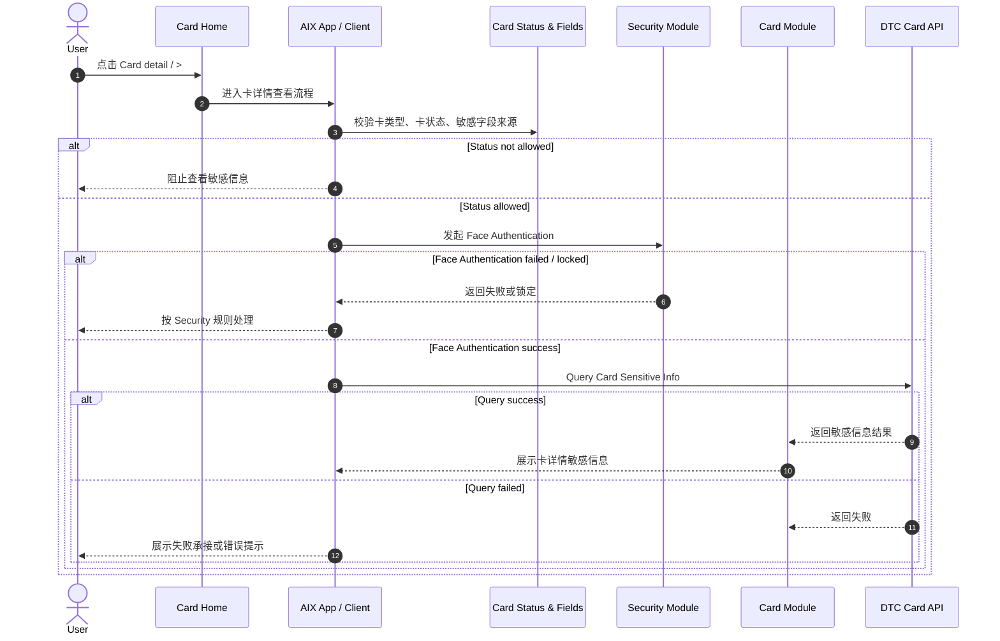
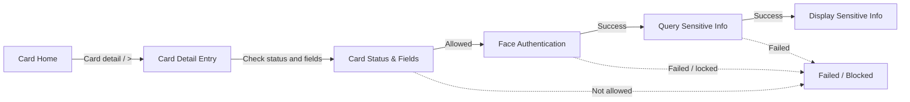

# Card Sensitive Info 卡敏感信息查看

## 0. 文档信息

| 项 | 内容 |
|---|---|
| 文档类型 | Card Sensitive Info 标准 PRD / 知识库事实文件 |
| 当前版本 | 1.1 |
| 文档状态 | active |
| 目标读者 | Product、Design、FE、BE、QA、Risk、Compliance |
| 本次修订 | 收拢评审意见：补齐 Card detail popup 字段、复制规则、失败 Toast、操作状态限制、Sensitive Info 主路径与验收标准 |
| 维护原则 | 敏感字段集合引用 `card-status-and-fields.md`；认证规则引用 Security；不在 Card Home 直接展示完整 PAN / EXP / CVV |

## 1. 功能定位

Card Sensitive Info 用于用户从 Card Home / Card Detail 入口查看卡片敏感信息。

本文只沉淀敏感信息查看流程、认证边界、展示规则、接口依赖与失败处理。卡状态和字段来源引用 `card-status-and-fields.md`，Face Authentication 引用 Security 模块，Lock / Unlock 与交易流程不在本文展开。

## 2. 适用范围

| 维度 | 规则 | 来源 | 备注 |
|---|---|---|---|
| 卡类型 | Virtual Card / Physical Card | Manage / 7.1；Application / 5.2 | 两类卡均可进入 Card Detail |
| 入口 | Card Home 的 `Card detail` / `>` | Application / 5.2；Home / 6.1 | Home 只展示脱敏信息 |
| 认证方式 | Face Authentication | Security / 7.2；Manage / 7.1 | 不在本文重复定义认证规则 |
| 敏感字段 | 由 Card Status & Fields 统一维护 | Card Status & Fields / 7.3 | 本文不重新定义字段集合 |
| 展示边界 | 仅认证通过后展示 | Manage / 7.1；Security / 7.2 | 未通过认证不得展示 |

## 3. 前置条件

| 条件 | 说明 | 来源 |
|---|---|---|
| 用户已持有卡 | 从已激活 / 已冻结卡片或卡详情入口进入 | Card Home / 6.5 / 6.6 |
| 卡状态允许查看 | ACTIVE 允许查看敏感信息；BLOCKED 仅允许查看脱敏卡信息，不允许敏感信息；待激活、SUSPENDED、CANCELLED、PENDING 均不允许 | Manage / 6.4；Card Status & Fields |
| 需完成 Face Authentication | 查看敏感信息属于高强度认证场景 | Security / 7.2；Manage / 7.1 |
| Sensitive Info 接口可用 | 需调用 DTC 敏感信息查询接口 | Manage / 8.1；Application / 2.2 |

## 4. 业务流程

### 4.1 主链路

```text
Card Home → Card Detail Entry → Face Authentication → Query Sensitive Info → Display Sensitive Info / Failed
```

### 4.2 业务流程与系统交互时序图



### 4.3 业务逻辑矩阵

| 阶段 | 触发条件 | 系统动作 | 成功结果 | 失败 / 拦截结果 |
|---|---|---|---|---|
| 入口 | 用户点击 Card detail / `>` | 进入卡详情查看流程 | 校验卡状态与类型 | 状态不允许时阻止 |
| 认证 | 状态允许查看 | 发起 Face Authentication | 进入接口查询 | 认证失败或锁定按 Security 处理 |
| 查询 | 认证通过 | 调用敏感信息查询接口 | 返回并展示卡详情敏感信息 | 接口失败则展示失败承接 |
| 退出 | 用户离开页面 | 关闭敏感信息展示 | 返回 Card Home | 无 |

## 5. 页面关系总览



## 6. 页面卡片与交互规则

### 6.0 查看权限与状态限制

| 状态 / 展示组 | 查看卡信息 | 查看敏感信息 | 处理规则 | 来源 |
|---|---|---|---|---|
| ACTIVE / Active | 是 | 是 | 允许进入 Card detail 并在认证通过后展示敏感字段 | Manage / 6.4 |
| BLOCKED | 是 | 否 | 仅允许脱敏查看，不允许 PAN / EXP / CVV | Manage / 6.4 |
| 待激活 | 否 | 否 | 不允许进入敏感信息查看流程 | Manage / 6.4 |
| SUSPENDED / Suspended | 否 | 否 | 不允许进入敏感信息查看流程 | Manage / 6.4 |
| CANCELLED / Cancelled | 否 | 否 | 不允许进入敏感信息查看流程 | Manage / 6.4 |
| PENDING / Pending / Processing | 否 | 否 | 不允许进入敏感信息查看流程 | Manage / 6.4 |

### 6.1 Card Home 脱敏展示

| 元素 | 规则 | 来源 |
|---|---|---|
| 卡号展示 | Card Home 默认只展示截断卡号 | Home / 6.1 |
| `Card detail` | 点击进入卡详情查看流程 | Application / 5.2；Home / 6.1 |
| `>` | 点击进入卡详情查看流程 | Home / 6.1 |
| Sensitive Info | 不在 Card Home 直接展示 | Home / 6.1；Card Status & Fields |

### 6.2 Card Detail 查看规则

| 元素 / 能力 | 规则 | 来源 |
|---|---|---|
| Popup 关闭 | 右上角关闭按钮，点击关闭 Card detail popup | Manage / 7.1 |
| Card type | 展示卡类型，来源于 AIX 申卡时储存 | Manage / 7.1 |
| Default currency | 展示默认币种，来源 `Get Card Basic Info.currency` | Manage / 7.1 |
| Name on card | Physical Card / Virtual Card 均展示，来源 `Get Card Basic Info.cardHolderName` | Manage / 7.1 |
| Card number | 认证通过后展示完整卡号，来源 `Get Card Sensitive Info.cardNumber` | Manage / 7.1 |
| EXP | 认证通过后展示有效期，来源 `Get Card Sensitive Info.expiryDate` | Manage / 7.1 |
| CVV / CVC | 认证通过后展示安全码，来源 `Get Card Sensitive Info.cvc` | Manage / 7.1 |
| 认证前 | 不展示敏感信息 | Manage / 7.1；Security / 7.2 |
| 认证方式 | Face Authentication | Security / 7.2；Manage / 7.1 |
| 认证通过 | 调用敏感信息查询接口 | Manage / 8.1；Application / 2.2 |
| 认证失败 | 按 Security Face Authentication 失败规则承接 | Security / Face Authentication |
| 接口失败 | 展示失败承接或错误提示 | Manage / 8.1 |

### 6.3 复制规则

| 字段 | 是否可复制 | 复制内容 | 成功提示 | 来源 |
|---|---|---|---|---|
| Name on card | 是 | 完整 Name on card | `The information has been copied.` | Manage / 7.1 |
| Card number | 是 | 完整 PAN | `The information has been copied.` | Manage / 7.1 |
| EXP | 是 | 完整 expiryDate | `The information has been copied.` | Manage / 7.1 |
| CVV / CVC | 是 | 完整 cvc | `The information has been copied.` | Manage / 7.1 |

### 6.4 字段展示边界

| 字段类别 | 规则 | 来源 |
|---|---|---|
| 脱敏字段 | 可在 Card Home / Basic Info 中展示 | Card Status & Fields / 7.2 |
| 敏感字段 | 仅认证通过后展示 | Card Status & Fields / 7.3；Manage / 7.1 |
| 字段集合 | 统一引用 `card-status-and-fields.md` | Card Status & Fields |
| 展示样例 | 不在知识库中写真实样例值 | Writing Standard |

## 7. 字段与接口依赖

| 字段 / 接口 / 能力 | 用途 | 来源 | 备注 |
|---|---|---|---|
| `cardStatus` | 判断是否允许查看 | Card Status & Fields | 不在本文重新定义状态 |
| `cardType` | 判断卡类型 | Card Status & Fields | Virtual / Physical |
| `Card Basic Info` | Card Home / Detail 脱敏展示 | Card Status & Fields / 7.2 | 路径冲突待确认 |
| `Card Sensitive Info` | 认证通过后查询敏感信息 | Card Status & Fields / 7.3 / 7.6；DTC Card Issuing API | 当前有效主路径为 `[POST] /openapi/v1/card/inquiry-card-sensitive-info`；旧 GET 路径仅作为历史冲突记录 |
| `Face Authentication` | 查看前认证 | Security / 7.2 | 具体规则见 Security |
| `requestId / token` | 认证结果查询与回跳 | Security API Reference | 不在本文重复定义 |

## 8. 异常与失败处理

| 场景 | 触发条件 | 用户提示 / 系统动作 | 最终状态 | 来源 |
|---|---|---|---|---|
| 状态不允许查看 | cardStatus 不允许查看 | 阻止进入查看流程 | 留在原流程 | Card Status & Fields |
| Face Authentication 失败 | 活体认证失败或锁定 | 按 Security 规则处理 | 阻止查看 | Security / Face Authentication |
| Face Authentication 过期 | 认证结果失效 | 重新发起认证 | 阻止查看直到认证通过 | Security / Global Rules |
| Sensitive Info 查询失败 | DTC 查询接口失败 | Toast `Failed to get card info. Please try again later`；不展示敏感信息 | 不展示敏感信息 | Manage / 7.1 / 8.1 |
| 接口路径冲突 | Application 与 Manage 路径不一致 | 保留缺口，不强行统一 | 待确认 | Card Status & Fields / KG-CARD-STATUS-009 |
| 页面停留超时 | 原文未明确 | 不补规则，记录缺口 | 待确认 | 文档缺口 |

## 9. 风控 / 合规边界

| 边界 | 规则 | 影响 | 来源 |
|---|---|---|---|
| 最小展示 | Card Home 只展示脱敏字段 | 降低敏感信息泄露风险 | Home / 6.1 |
| 高强度认证 | 查看敏感信息前必须 Face Authentication | 防止非本人查看 | Security / 7.2；Manage / 7.1 |
| 不缓存明文 | 原文未给缓存策略，知识库不得补缓存规则 | 需后续确认 | 文档缺口 |
| 接口失败不展示 | Basic Info 或 Sensitive Info 查询失败时不得展示敏感信息，并提示 `Failed to get card info. Please try again later` | 防止错误展示 | Manage / 7.1 / 8.1 |
| 字段来源单一 | 敏感字段集合引用 `card-status-and-fields.md` | 防止字段重复定义 | IMPLEMENTATION_PLAN.md / v2.6 |
| 功能边界 | Lock / Unlock、交易流程不在本文处理 | 防止功能混写 | IMPLEMENTATION_PLAN.md / v2.6 |

## 10. 待确认事项

| 编号 | 问题 | 影响 | 优先级 |
|---|---|---|---|
| CARD-SENS-Q001 | Basic Info 与 Sensitive Info 任一接口失败时是否均使用同一 Toast：`Failed to get card info. Please try again later` | 页面异常体验 | P1 |
| CARD-SENS-Q002 | 旧 GET Sensitive Info 路径是否正式废弃 | 接口接入 | P1 |
| CARD-SENS-Q003 | 认证通过后的敏感信息页面停留超时、后台切换、截屏防护、缓存策略 | 安全合规 | P1 |
| CARD-SENS-Q004 | BLOCKED 状态“可查看卡信息但不可查看敏感信息”的页面入口是隐藏、置灰还是弹提示 | Home、Sensitive Info | P1 |

## 11. 验收标准 / 测试场景

| 场景 | 验收标准 |
|---|---|
| 状态限制 | ACTIVE 可查看敏感信息；BLOCKED 仅可查看脱敏信息；待激活、SUSPENDED、CANCELLED、PENDING 均不可查看 |
| 认证前 | 进入敏感信息查看前不得展示完整 PAN / EXP / CVV |
| 认证成功 | 展示 Card detail popup，包含 Card type、Default currency、Name on card、Card number、EXP、CVV / CVC |
| 字段来源 | Name on card 来源 Basic Info `cardHolderName`，Virtual / Physical 均展示；敏感字段来源 Sensitive Info |
| 复制 | Name on card、Card number、EXP、CVV 均可复制，复制成功 Toast 为 `The information has been copied.` |
| 接口失败 | Basic / Sensitive 查询失败时不展示敏感字段，并提示 `Failed to get card info. Please try again later` |
| 安全边界 | Card Home 只展示截断卡号，不展示完整 PAN / EXP / CVV |

## 12. 来源引用

- (Ref: 历史prd/AIX Card manage模块需求V1.0.docx / 7.1 查看卡信息 / V1.0)
- (Ref: 历史prd/AIX Card manage模块需求V1.0.docx / 8.1 外部接口清单 / V1.0)
- (Ref: 历史prd/AIX Card V1.0【Application】.pdf / 2.2 接口范围 / V1.0)
- (Ref: 历史prd/AIX Card V1.0【Application】.pdf / 5.2 卡片首页 / V1.0)
- (Ref: 历史prd/AIX APP V1.0【Home】.pdf / 6.1 APP主页 / V1.0)
- (Ref: knowledge-base/card/card-status-and-fields.md)
- (Ref: knowledge-base/card/card-home.md)
- (Ref: knowledge-base/security/face-authentication.md)
