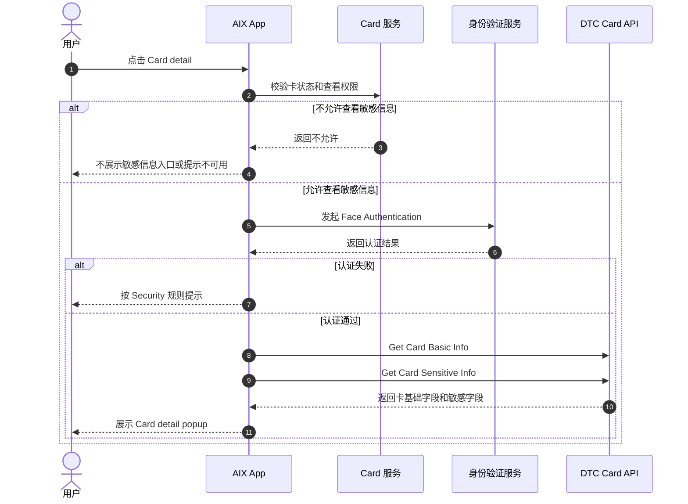
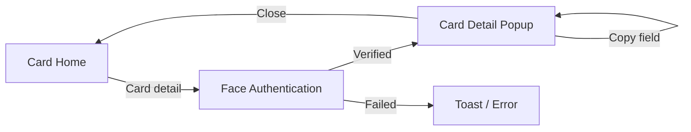

# Card Sensitive Info 卡敏感信息查看

## 1. 文档信息

| 项目 | 内容 |
|---|---|
| 功能名称 | Card Sensitive Info 卡敏感信息查看 |
| 所属模块 | Card |
| Owner | 吴忆锋 |
| 版本 | 1.3 |
| 状态 | Review |
| 更新时间 | 2026-05-04 |
| 来源文档 | AIX Card Manage、DTC Card Issuing API、Standard PRD Template v1.3 |

---

## 2. 需求背景、目标与范围

### 2.1 需求背景

用户需要在安全认证后查看卡片完整信息，例如 PAN、EXP、CVV / CVC 和 Name on card。由于这些属于敏感信息，必须明确查看权限、认证要求、字段来源、复制规则和失败处理。

### 2.2 用户问题 / 业务问题

如果敏感信息查看与卡基础信息、卡状态、认证规则和接口失败处理未统一，可能造成 PAN / CVC 泄露、不可用状态仍可查看敏感信息，或接口失败时展示不完整敏感数据。

### 2.3 需求目标

定义 Card detail popup 的展示字段、敏感信息认证流程、复制规则、接口路径和失败提示，确保只有符合状态和认证条件的用户可查看完整卡信息。

### 2.4 涉及功能清单

| 功能点 | 本期范围 | 优先级 | 状态 | 说明 |
|---|---|---|---|---|
| Card detail 入口 | In Scope | P0 | Confirmed | ACTIVE 卡可查看敏感信息；BLOCKED 仅可查看卡信息 |
| Face Authentication | In Scope | P0 | Confirmed | 查看敏感信息前认证 |
| Basic Info 查询 | In Scope | P0 | Confirmed | 查询卡类型、币种、Name on card |
| Sensitive Info 查询 | In Scope | P0 | Confirmed | 查询 PAN、EXP、CVV / CVC |
| 复制规则 | In Scope | P1 | Confirmed | 复制后 Toast |
| 旧 GET 路径 | Deferred | P0 | Open | 是否废弃待确认 |
| 防截屏 / 超时 | Deferred | P1 | Open | 当前事实未定义 |

---

## 3. 业务流程与规则

### 3.1 业务主流程说明

用户从 Card Home 点击 Card detail。系统先判断卡状态是否允许查看卡信息和敏感信息。若允许查看敏感信息，则触发 Face Authentication。认证通过后，系统调用 Card Basic Info 和 Card Sensitive Info，成功后展示 Card detail popup；任一接口失败时，不展示敏感信息并提示失败。

### 3.2 业务时序图

### 3.3 流程步骤与业务规则

| 步骤 | 场景 / 规则 | 触发条件 | 责任方 | 系统处理 | 成功结果 | 失败 / 分支结果 | 来源 |
|---|---|---|---|---|---|---|---|
| 1 | 判断状态 | 用户点击 Card detail | App / Card | 引用 Manage 6.4 | ACTIVE 允许敏感信息 | BLOCKED 仅卡信息，其他状态不允许 | Manage / 6.4 |
| 2 | 身份验证 | 允许敏感信息 | App / Security | Face Authentication | 进入查询 | 失败按 Security 规则 | Manage / 7.1 |
| 3 | 查询 Basic Info | 认证通过 | App / DTC | 调用 Basic Info | 返回 Card type、currency、cardHolderName | 失败 Toast | Manage / 7.1 |
| 4 | 查询 Sensitive Info | 认证通过 | App / DTC | 调用 Sensitive Info | 返回 PAN、EXP、CVC | 失败 Toast，不展示敏感信息 | Manage / 7.1 |
| 5 | 展示 popup | 两类接口成功 | App | 渲染字段 | 用户可复制字段 | 关闭后隐藏敏感信息 | Manage / 7.1 |

### 3.4 状态规则

| 状态 | 含义 | 触发条件 | 用户可见表现 | 系统处理 | 可迁移到 | 是否终态 | 来源 |
|---|---|---|---|---|---|---|---|
| ACTIVE | 可查看卡信息和敏感信息 | 卡处于可用状态 | Card detail 可打开，认证后展示敏感字段 | 调用 Basic + Sensitive Info | SUSPENDED / CANCELLED | 否 | Manage / 6.4 |
| BLOCKED | 仅可查看卡信息 | 卡被阻断 | 不允许查看敏感信息 | 只允许脱敏 / 基础信息，具体字段待确认 | 待确认 | 否 | Manage / 6.4 |
| 其他状态 | 不允许查看 | 待激活、SUSPENDED、CANCELLED、PENDING | 不展示或禁用入口 | 不调用 Sensitive Info | 不适用 | 否 | Manage / 6.4 |

### 3.5 业务级异常与失败处理

| 异常场景 | 触发条件 | 错误来源 | 错误码 / 原因 | 用户表现 | 系统处理 | 是否可重试 | 最终状态 |
|---|---|---|---|---|---|---|---|
| 状态不允许 | 非 ACTIVE 查看敏感信息 | Backend | 状态限制 | 不展示或拦截 | 不调用接口 | 否 | 原状态 |
| 认证失败 | Face Authentication 失败 | Security | 认证失败 | 按 Security 规则 | 不查询敏感信息 | 是 / 视规则 | 原状态 |
| Basic Info 失败 | 接口失败 | DTC / Network | 查询失败 | `Failed to get card info. Please try again later` | 不展示 popup | 是 | 原状态 |
| Sensitive Info 失败 | 接口失败 | DTC / Network | 查询失败 | `Failed to get card info. Please try again later` | 不展示敏感信息 | 是 | 原状态 |
| 复制失败 | 设备剪贴板失败 | OS | Copy failed | 当前事实未定义 | 不影响字段展示 | 是 | popup |

---

## 4. 页面与交互说明

### 4.1 页面关系总览图

### 4.2 Card Detail Popup

| 区块 | 内容 |
|---|---|
| 页面类型 | Popup |
| 页面目标 | 展示认证后的完整卡片信息 |
| 入口 / 触发 | Card Home 点击 Card detail 且认证通过 |
| 展示内容 | Card type、Default currency、Name on card、Card number、EXP、CVV / CVC |
| 用户动作 | 复制字段、关闭 popup |
| 系统处理 / 责任方 | App 渲染 Basic Info 和 Sensitive Info 字段 |
| 元素 / 状态 / 提示规则 | Name on card / Card number / EXP / CVV 可复制，复制成功 Toast：`The information has been copied.` |
| 成功流转 | 用户查看或复制信息 |
| 失败 / 异常流转 | 查询失败 Toast：`Failed to get card info. Please try again later` |
| 备注 / 边界 | Virtual / Physical 均展示 Name on card；关闭 popup 后不得继续展示敏感信息 |

---

## 5. 字段、接口与数据

| 类型 | 名称 | 所属系统 | 来源 | 用途 | 规则 / 输入输出 | 异常处理 |
|---|---|---|---|---|---|---|
| 接口 | Get Card Basic Info | DTC | DTC API / Status & Fields | 查询基础卡信息 | 优先 `[POST] /openapi/v1/card/inquiry-card-info` | 失败 Toast |
| 接口 | Get Card Sensitive Info | DTC | DTC API / Status & Fields | 查询敏感卡信息 | 优先 `[POST] /openapi/v1/card/inquiry-card-sensitive-info` | 失败 Toast，不展示敏感信息 |
| 字段 | cardType | AIX / DTC | Application / Manage | 展示 Card type | Virtual / Physical | 查询失败不展示 |
| 字段 | currency | DTC | Basic Info | 展示 Default currency | 来自 Basic Info | 查询失败不展示 |
| 字段 | cardHolderName | DTC | Basic Info | 展示 Name on card | Virtual / Physical 均展示 | 查询失败不展示 |
| 字段 | cardNumber | DTC | Sensitive Info | 展示完整 PAN | 仅认证后展示 | 查询失败不展示 |
| 字段 | expiryDate | DTC | Sensitive Info | 展示 EXP | 仅认证后展示 | 查询失败不展示 |
| 字段 | cvc | DTC | Sensitive Info | 展示 CVV / CVC | 仅认证后展示 | 查询失败不展示 |

---

## 6. 通知规则（如适用）

不适用。敏感信息查看不触发用户通知。

| 触发事件 | 通知渠道 | 通知对象 | 文案 / 模板 | 跳转目标 | 失败 / 补发规则 |
|---|---|---|---|---|---|
| 不适用 | 不适用 | 不适用 | 不适用 | 不适用 | 不适用 |

---

## 7. 权限 / 合规 / 风控（如适用）

| 类型 | 规则 | 影响 | 来源 |
|---|---|---|---|
| 用户权限 | 仅 ACTIVE 卡允许查看敏感信息 | 防止错误状态暴露敏感信息 | Manage / 6.4 |
| 身份验证 | 查看敏感信息前必须 Face Authentication | 防止非本人查看 PAN / CVC | Manage / 7.1 |
| 隐私 | Home 不展示完整 PAN / CVC / EXP | 防止卡敏感信息泄露 | Manage / 7.1 |
| 数据安全 | 查询失败时不得展示部分敏感字段 | 防止脏数据或半成功泄露 | Manage / 7.1 |

---

## 8. 待确认事项

| 问题 | 影响范围 | 当前处理 | 是否阻塞验收 | 建议确认人 |
|---|---|---|---|---|
| Basic Info 与 Sensitive Info 旧 GET 路径是否废弃 | FE / BE / DTC | 阻塞 | 是 | BE / DTC |
| Basic Info 或 Sensitive Info 任一失败是否统一同一 Toast | FE / QA | 不阻塞 | 否 | PM / QA |
| Card detail popup 是否需要超时隐藏、切后台隐藏、防截屏 | Security / Compliance | 不阻塞 / Deferred | 否 | Security / Compliance |
| BLOCKED 状态仅可查看卡信息时具体可见字段 | Status / Sensitive Info | 不阻塞 / Deferred | 否 | PM / BE |

---

## 9. 验收标准 / 测试场景

### 9.1 验收标准

| 验收场景 | 验收标准 |
|---|---|
| 正常流程 | ACTIVE 卡认证通过后可查看完整卡信息 |
| 异常流程 | 非 ACTIVE、认证失败、接口失败均不展示敏感信息 |
| 页面展示 | Popup 展示 Card type、Default currency、Name on card、Card number、EXP、CVV / CVC |
| 系统交互 | Basic / Sensitive Info 均优先使用 POST 路径 |
| 通知 | 不适用 |
| 数据 / 埋点 | 复制字段内容正确，关闭后隐藏敏感信息 |

### 9.2 测试场景矩阵

| 场景 | 前置条件 | 用户操作 | 预期页面表现 | 预期系统结果 | 是否必测 |
|---|---|---|---|---|---|
| ACTIVE 查看敏感信息 | ACTIVE 卡，认证通过 | 点击 Card detail | 展示 popup | 调用 Basic + Sensitive 成功 | 是 |
| BLOCKED 查看敏感信息 | BLOCKED 卡 | 点击 Card detail | 不展示敏感字段 | 不调用 Sensitive 或拦截 | 是 |
| 认证失败 | ACTIVE 卡 | Face Auth 失败 | 按 Security 提示 | 不调用 Sensitive | 是 |
| Sensitive 查询失败 | ACTIVE 卡，认证通过 | 查询失败 | Toast 失败文案 | 不展示敏感信息 | 是 |
| 复制卡号 | popup 已展示 | 点击 Card number | Toast 已复制 | 剪贴板写入完整 PAN | 是 |
| 关闭 popup | popup 已展示 | 点击关闭 | 返回 Card Home | 敏感信息隐藏 | 是 |

---

## 10. 来源引用

- (Ref: 历史prd/AIX Card manage模块需求V1.0.docx / 6.4 / 7.1 / 8.1 / V1.0)
- (Ref: DTC Card Issuing API Document_20260310 (1).pdf / Inquiry Card Basic Info / Inquiry Card Sensitive Info)
- (Ref: knowledge-base/card/card-status-and-fields.md)
- (Ref: knowledge-base/security/face-authentication.md)
- (Ref: prd-template/standard-prd-template.md / v1.3)
