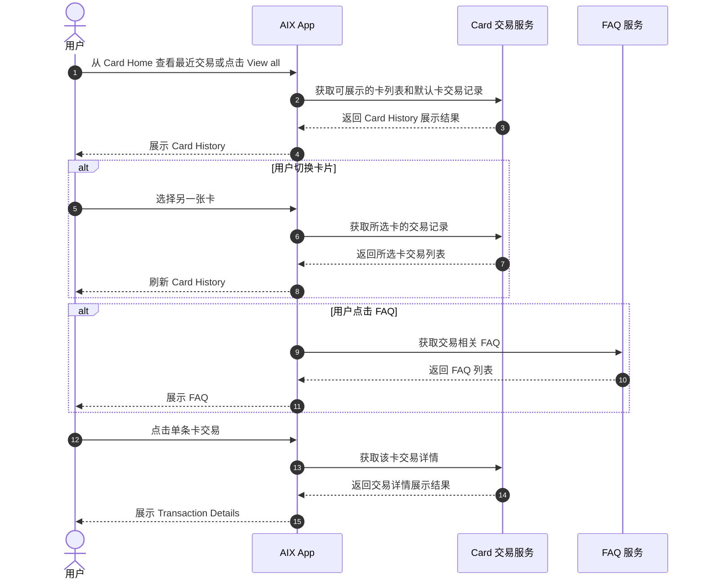
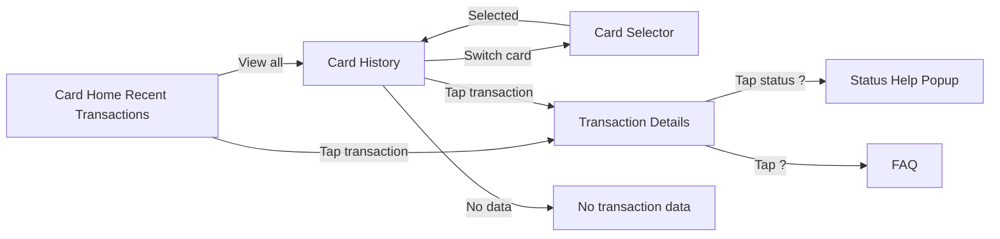

# Card Transaction Detail 卡交易列表与详情

## 1. 文档信息

| 项目 | 内容 |
|---|---|
| 功能名称 | Card Transaction Detail 卡交易列表与详情 |
| 所属模块 | Card |
| Owner | 吴忆锋 |
| 版本 | 1.0 |
| 状态 | Review |
| 更新时间 | 2026-05-05 |
| 来源文档 | AIX APP V1.0【Transaction & History】、Standard PRD Template v1.3 |

---

## 2. 需求背景、目标与范围

### 2.1 需求背景

用户在使用 AIX Card 进行交易后，需要在 Card Home、Card History 和 Transaction Details 中查看卡交易记录、交易状态、交易金额、商户信息和单笔交易详情。

原文中同时包含全量交易记录、卡交易列表和卡交易详情。本文只承接 Card 场景下的列表和详情展示；全量交易聚合、Wallet 交易、Swap 交易和统一状态模型由 `transaction/` 模块维护。

### 2.2 用户问题 / 业务问题

如果 Card 交易列表和交易详情缺少统一规则，用户会无法准确追踪卡消费、退款、现金取款等交易状态；同时 Card Home、Card History 和全量 Transaction 之间可能出现展示字段、交易类型和状态口径不一致。

### 2.3 需求目标

本文定义 Card 交易展示相关需求，包括：

1. Card Home Recent Transactions 入口边界。
2. Card History 页面入口、卡片选择、时间范围、筛选和排序规则。
3. Card Transaction Details 页面入口、概览区、详情区、状态说明、FAQ 和复制交互。
4. Card 交易列表和详情中对客展示字段。
5. Card 交易列表 / 详情与全局 Transaction 模块的边界。

本文不定义 Card Transaction Notification 后的资金回退流程；该流程由 `card/transaction.md` 维护。

### 2.4 涉及功能清单

| 功能点 | 本期范围 | 优先级 | 状态 | 说明 |
|---|---|---|---|---|
| Card Home Recent Transactions | In Scope | P1 | Confirmed | Card Home 展示最近卡交易入口，具体 Home 卡片由 `card-home.md` 承接 |
| Card History 入口 | In Scope | P0 | Confirmed | Card 首页点击 View all |
| Card History 卡片选择区 | In Scope | P0 | Confirmed | 显示 Active / Suspended 卡，支持多卡切换 |
| Card History 交易列表 | In Scope | P0 | Confirmed | 展示最近 1 年卡交易数据，单次最多查询 6 个月 |
| Card 交易类型过滤 | In Scope | P0 | Confirmed | PURCHASE / CASH_WITHDRAWAL / REFUND / INCREMENTAL_AUTH；REVERSAL 也展示为 refund |
| Card Transaction Details 入口 | In Scope | P0 | Confirmed | Card Home 或 Card History 点击任意交易记录 |
| Card Transaction Details 概览区 | In Scope | P0 | Confirmed | 展示金额、方向、类型、状态、Crypto、Amount、Exchange rate 等 |
| Card Transaction Details 详情区 | In Scope | P0 | Confirmed | Date、Card number、Merchant name、Merchant city、MCC、Transaction ID |
| FAQ 入口 | In Scope | P2 | Confirmed | 根据 Transactions / Transaction Details 场景读取 FAQ |
| 全量交易聚合 | Out of Scope | P0 | Confirmed | 由 `transaction/history.md` 维护 |
| Card 资金回退 Wallet | Out of Scope | P0 | Confirmed | 由 `card/transaction.md` 维护 |
| 状态和类型映射图片表格 | Partial | P0 | Open | 原文为图片 / 电子表格，当前文本提取未展开，需后续核表 |

---

## 3. 业务流程与规则

### 3.1 业务主流程说明

用户可从 Card Home 的 Recent Transactions 区域点击 More 进入 Card History，也可点击单条卡交易进入 Transaction Details。Card History 页面展示当前用户所有状态为 Active、Suspended 的卡片，用户可切换不同卡片并查看对应卡交易列表。

用户进入 Card History 时，系统静默刷新获取近 1 年交易数据。单次最多查询 6 个月。列表只展示原始交易类型为 PURCHASE、CASH_WITHDRAWAL、REFUND、INCREMENTAL_AUTH 的记录；DTC 反馈部分退款会使用 REVERSAL，因此 REVERSAL 类型也需要展示，前端与 REFUND 一样显示为 `{refund-商户名称}`。

用户点击任意一条交易记录后进入 Transaction Details。详情页根据 Transaction ID 获取最新卡交易记录，展示交易概览区、状态说明和交易详情区。

### 3.2 业务时序图

### 3.3 流程步骤与业务规则

| 步骤 | 场景 / 规则 | 触发条件 | 责任方 | 系统处理 | 成功结果 | 失败 / 分支结果 | 来源 |
|---|---|---|---|---|---|---|---|
| 1 | Card Home 最近交易 | 用户进入 Card Home | App / Card | 展示最近卡交易入口和最近交易 | 用户可查看 More 或点击交易 | 查询失败处理见 Card Home / Transaction | 7.2 / card-home |
| 2 | 进入 Card History | Card 首页点击 View all | App / Card | 打开 Card History 页面 | 展示当前卡交易列表 | 查询失败显示缺省页 | 7.2.4 |
| 3 | 卡片选择区 | 用户有 Active / Suspended 卡 | App / Card | 显示脱敏卡号和币种，例如 `****2053 (USDT)` | 用户可切换卡片 | 单卡时是否展示下拉待确认 | 7.2.4 |
| 4 | 多卡切换 | 用户持有多张卡 | App / Card | 按申请时间降序展示，点击下拉箭头切换 | 列表加载所选卡交易 | 查询失败显示缺省页 | 7.2.4 |
| 5 | 交易列表查询 | 用户进入 Card History | App / Card | 静默刷新获取近 1 年交易数据；单次最多 6 个月 | 展示列表 | 无数据展示 `No transaction data` | 7.2.1 / 7.2.4 |
| 6 | 交易类型过滤 | 获取卡交易记录 | App / Card | 仅展示 PURCHASE / CASH_WITHDRAWAL / REFUND / INCREMENTAL_AUTH / REVERSAL | 展示符合规则的卡交易 | 其他类型不展示 | 7.2.4 / v2.2 |
| 7 | 列表排序 | 有交易数据 | App | 按分区和时间降序展示 | 用户看到按时间分组列表 | 无数据为空态 | 7.1.4 / 7.2.4 |
| 8 | 点击交易详情 | 用户点击任意卡交易 | App / Card | 根据 Transaction ID 获取最新交易详情 | 展示 Transaction Details | 查询失败处理待确认 | 7.3.4 |
| 9 | 状态说明 | 用户点击状态说明问号 | App | 展示状态说明弹窗 | 点击 Got it 关闭 | 状态文案缺失待确认 | 7.3.4 |
| 10 | FAQ | 用户点击顶部问号 | App / FAQ | 根据 Transactions / Transactions Details 场景读取 FAQ | 展示 FAQ 列表 | FAQ 配置缺失待确认 | 7.1.4 / 7.3.4 |
| 11 | 复制 Transaction ID | 用户点击复制按钮 | App | 复制 Transaction ID | Toast：`The information has been copied.` | 复制失败文案待确认 | 7.3.4 |

### 3.4 状态规则

| 状态 | 含义 | 触发条件 | 用户可见表现 | 系统处理 | 可迁移到 | 是否终态 | 来源 |
|---|---|---|---|---|---|---|---|
| Pending | 处理中 | 卡交易状态映射 | Pending / 处理中 | 展示状态 | Success / Declined / Cancelled / Refunded | 否 | 7.2.4 / 7.3.4 |
| Success | 交易成功 | 卡交易完成 | Success / 交易成功 | 展示状态 | 不适用 | 是 | 7.2.4 / 7.3.4 |
| Refunded | 已退款 | 商户退款或退款类交易 | Refunded / 已退款 | 展示状态 | 不适用 | 是 | 7.2.4 / 7.3.4 |
| Declined / Denied | 拒绝 / 已拒绝 | 交易被拒绝 | Declined / Denied | 展示状态 | 不适用 | 是 | 7.2.4 / 7.3.4 |
| Cancelled | 已取消 | 订单取消 | Cancelled / 已取消 | 展示状态 | 不适用 | 是 | 7.2.4 / 7.3.4 |

备注：原文同时出现 `Declined` 与详情页 `Denied`，二者展示口径是否统一需确认。

### 3.5 业务级异常与失败处理

| 异常场景 | 触发条件 | 错误来源 | 错误码 / 原因 | 用户表现 | 系统处理 | 是否可重试 | 最终状态 |
|---|---|---|---|---|---|---|---|
| 卡交易列表接口失败 | 查询 Card History 或 Card Home 交易失败 | DTC / Backend | 00006、31005、31006 或服务端异常 | 数据异常：`Data error. Please refresh and try again.` | 服务端区分 code 排查 | 是 | 缺省页 |
| 网络异常 | 用户查询列表或详情时网络异常 | Network | No internet | `No internet connection. Please retry` | 用户重试 | 是 | 缺省页 |
| 无交易数据 | Card History 无交易记录 | Card / DTC | 空数据 | `No transaction data` | 展示空态 | 是 | 空态 |
| 详情查询失败 | Card Transaction Detail 查询失败 | DTC / Backend | 错误码表在原文图片中，当前未展开 | 处理方式待确认 | 服务端排查 | 是 | 待确认 |
| FAQ 配置缺失 | FAQ 场景无配置 | FAQ | 配置缺失 | 是否隐藏 FAQ 待确认 | 不影响交易主流程 | 是 | 待确认 |
| 可选字段为空 | Merchant city / MCC 等非必填字段为空 | DTC | 字段缺失 | 不显示该 item | 不影响其他字段展示 | 否 | 正常展示 |

---

## 4. 页面与交互说明

### 4.1 页面关系总览图

### 4.2 Card History Page

| 区块 | 内容 |
|---|---|
| 页面类型 | 列表页面 |
| 页面目标 | 用户查看最近 1 年内卡交易数据 |
| 入口 / 触发 | Card 卡首页点击 `View all` |
| 展示内容 | 标题 `Card History`；返回；卡片选择区；交易列表区 |
| 用户动作 | 返回、切换卡片、滚动加载更多、点击交易进入详情 |
| 系统处理 / 责任方 | 查询所选卡交易记录；只展示指定卡交易类型；按时间分组和降序展示 |
| 元素 / 状态 / 提示规则 | 无数据展示 `No transaction data`；MVP 不做分页，滑动加载更多 |
| 成功流转 | 点击单条交易进入 Transaction Details |
| 失败 / 异常流转 | DTC / 服务端异常展示 Data error；网络异常展示 No internet connection |
| 备注 / 边界 | 卡冻结时也可以获取交易记录；Card 状态范围为 Active、Suspended |

### 4.3 Card Selector 卡片选择区

| 区块 | 内容 |
|---|---|
| 页面类型 | 选择组件 |
| 页面目标 | 选择查看哪张卡的交易记录 |
| 入口 / 触发 | Card History 页面顶部卡片选择区 |
| 展示内容 | 当前用户所有状态为 Active、Suspended 的脱敏卡号与币种，例如 `****2053 (USDT)` |
| 用户动作 | 点击下拉箭头 `V` 切换卡片 |
| 系统处理 / 责任方 | 多张卡按申请时间降序排列；选择后列表同步加载该卡交易记录 |
| 元素 / 状态 / 提示规则 | 单卡时是否展示下拉待确认 |
| 成功流转 | 刷新 Card History 列表 |
| 失败 / 异常流转 | 查询失败展示缺省页 |
| 备注 / 边界 | 原文只明确 Active、Suspended 卡可展示 |

### 4.4 Card Transaction List Item

| 区块 | 内容 |
|---|---|
| 页面类型 | 列表项 |
| 页面目标 | 展示单笔卡交易摘要 |
| 入口 / 触发 | Card History 或全量 Transaction 中展示卡交易 |
| 展示内容 | Merchant name、Indicator、requestAmount & requestCurrency、Transaction time、State |
| 用户动作 | 点击单条记录进入 Transaction Details |
| 系统处理 / 责任方 | 仅展示指定原始交易类型；REVERSAL 按 REFUND 一样显示 `{refund-商户名称}` |
| 元素 / 状态 / 提示规则 | 单笔卡交易不显示交易类型，但要返给前端 |
| 成功流转 | Transaction Details |
| 失败 / 异常流转 | 列表查询失败按缺省页处理 |
| 备注 / 边界 | 全量交易列表中的卡交易展示也应遵循该卡交易展示逻辑 |

### 4.5 Transaction Details Page

| 区块 | 内容 |
|---|---|
| 页面类型 | 详情页面 |
| 页面目标 | 展示单笔卡交易详情 |
| 入口 / 触发 | Card Home 交易区域点击任意记录；Card History 点击任意记录 |
| 展示内容 | 标题 `Transaction Details`；返回；FAQ；交易概览区；状态说明；交易详情区 |
| 用户动作 | 返回、点击 FAQ、查看状态说明、复制 Transaction ID |
| 系统处理 / 责任方 | 根据 Transaction ID 获取最新交易记录展示给用户 |
| 元素 / 状态 / 提示规则 | 点击 `Got it` 关闭状态说明弹窗返回当前页面 |
| 成功流转 | 留在详情页或返回上一级 |
| 失败 / 异常流转 | 详情查询失败处理待确认 |
| 备注 / 边界 | 原文接口请求 / 响应表为图片，当前未展开字段细节 |

### 4.6 Transaction Details 概览区

| 区块 | 内容 |
|---|---|
| 页面目标 | 展示交易核心信息 |
| 展示字段 | requestAmount & requestCurrency、Indicator、Type、Status、Crypto、Amount、Exchange rate |
| Indicator | Credit 卡借记【+】；Debit 卡贷记【-】 |
| Type | Payment 消费；Cash withdrawal 现金取款；Refund 退款 |
| Status | Pending、Success、Cancelled、Refunded、Denied |
| Crypto | USDT、USDC、WUSD、FDUSD |
| Exchange rate | 3/31 需求：改成半弹层；显示小数点后 6 位，向上取整 |
| 备注 | 详情页收起 Exchange rate |

### 4.7 Transaction Details 详情区

| 字段 | 展示规则 |
|---|---|
| Date | 创建时间 |
| Card number | 截断卡号，脱敏展示 |
| Merchant name | 商户名称 |
| Merchant city | 非必填项；没有则不显示该 item |
| MCC | 商户类别码；非必填项；没有则不显示该 item |
| Transaction ID | 交易单号；点击复制按钮复制，并提示 `The information has been copied.` |

### 4.8 状态说明弹窗

| 状态 | 原文说明 |
|---|---|
| Pending | `The order has been received and is currently under authorization confirmation or review.` |
| Success | `The order transaction is completed and the fund transfer is also finished.` |
| Refunded | `The order has been refunded by the merchant, and the funds will be returned to the payment account.` |
| Declined | `It is rejected due to insufficient balance, abnormal account, or exceeding the transaction amount limit.` |
| Cancelled | `Orders are cancelled due to reasons such as unconfirmed orders or failure to pay within the time limit.` |

---

## 5. 字段、接口与数据

| 类型 | 名称 | 所属系统 | 来源 | 用途 | 规则 / 输入输出 | 异常处理 |
|---|---|---|---|---|---|---|
| 接口 | Transaction History of Card | DTC | 原文 2.1 / 8.1 | 查询卡交易列表 | `[POST] /openapi/v1/card/inquiry-card-transaction` | 00006、31005、31006；其他错误需报警通知 |
| 接口 | Card Transaction Detail Inquiry | DTC | 原文 2.1 / 8.2 | 查询卡交易详情 | `[POST] /open api/v1/card/inquiry card transaction detail` | 错误码在原文图片表格中，当前未展开 |
| 字段 | Merchant name | DTC / Card | 原文 7.1 / 7.2 | 卡交易名称展示 | 对客显示为交易名称 | 缺失展示规则待确认 |
| 字段 | Indicator | DTC / Card | 原文 7.1 / 7.2 / 7.3 | 交易方向 | Credit【+】；Debit【-】 | 缺失待确认 |
| 字段 | requestAmount & requestCurrency | DTC / Card | 原文 7.1 / 7.2 / 7.3 | 法币交易金额 | 展示交易金额和币种 | 缺失待确认 |
| 字段 | Transaction time | DTC / Card | 原文 7.1 / 7.2 | 交易时间 | 月份缩写-日期-年份，如 `Feb-25-2026 10:23:30` | 缺失待确认 |
| 字段 | State / Status | DTC / Card | 原文 7.1 / 7.2 / 7.3 | 交易状态展示 | Pending / Success / Refunded / Declined / Cancelled；详情页出现 Denied | 映射待确认 |
| 字段 | Type | DTC / Card | 原文 7.3 | 详情页交易类型 | Payment / Cash withdrawal / Refund | REVERSAL 前端与 REFUND 一样显示 |
| 字段 | Crypto | DTC / Card | 原文 7.3 | 加密币类型 | USDT / USDC / WUSD / FDUSD | 缺失待确认 |
| 字段 | Amount | DTC / Card | 原文 7.3 | 加密币金额 | 展示具体金额 | 缺失待确认 |
| 字段 | Exchange rate | DTC / Card | 原文 v2.1 / 7.3 | 交易汇率 | 半弹层；小数点后 6 位，向上取整；详情页收起 | 计算来源待确认 |
| 字段 | Card number | DTC / Card | 原文 7.3 | 详情区卡号 | 截断卡号，脱敏展示 | 缺失待确认 |
| 字段 | Merchant city | DTC / Card | 原文 7.3 | 商户城市 | 非必填；没有则不显示 | 不显示该 item |
| 字段 | MCC | DTC / Card | 原文 7.3 | 商户类别码 | 非必填；没有则不显示 | 不显示该 item |
| 字段 | Transaction ID | DTC / Card | 原文 7.3 | 交易单号 | 可复制；Toast `The information has been copied.` | 复制失败文案待确认 |

---

## 6. 通知规则（如适用）

本文不定义新的用户通知模板。

| 触发事件 | 通知渠道 | 通知对象 | 文案 / 模板 | 跳转目标 | 失败 / 补发规则 |
|---|---|---|---|---|---|
| 卡交易成功 / 退款成功 | Push / In-app | 持卡用户 | 由 `common/notification.md` 维护 | Card Transaction Details | 本文只维护页面展示，不维护通知模板 |
| FAQ | 页面入口 | 当前用户 | 根据 Transactions / Transactions Details 场景读取 FAQ | FAQ 页面 | FAQ 配置缺失待确认 |

---

## 7. 权限 / 合规 / 风控（如适用）

| 类型 | 规则 | 影响 | 来源 |
|---|---|---|---|
| 卡状态范围 | Card History 卡片选择区显示 Active、Suspended 卡 | 冻结卡也可获取交易记录 | 7.2.1 / 7.2.4 |
| 时间范围 | 用户可查看最近 1 年内卡交易数据 | 控制查询范围和性能 | 7.2.1 |
| 单次查询限制 | 单次最多查询 6 个月 | 控制接口和数据量 | 7.2.1 |
| 展示类型过滤 | 只展示指定卡交易类型 | 防止展示不应对客类型 | 7.2.4 |
| REVERSAL 展示规则 | REVERSAL 类型也展示，前端与 REFUND 一样显示 `{refund-商户名称}` | 保证退款类交易可见 | v2.2 |
| 错误报警 | DTC 返回当前错误码之外的其他错误，直接 Lark 报警通知 | 便于产品和渠道确定后续处理 | 8.1.6 / 8.2.6 |

---

## 8. 待确认事项

| 问题 | 影响范围 | 当前处理 | 是否阻塞验收 | 建议确认人 |
|---|---|---|---|---|
| 原文图片 / 电子表格中的完整 Type 映射、Status 映射、接口请求 / 响应字段尚未展开 | FE / BE / QA | 阻塞 | 是 | PM / BE / QA |
| 详情页 `Denied` 与列表页 `Declined` 是否同一状态展示 | FE / QA | 阻塞 | 是 | PM / BE |
| Card Transaction Detail Inquiry 的错误码和失败页展示 | FE / BE / QA | 阻塞 | 是 | PM / BE / QA |
| Card Home Recent Transactions 查询失败时隐藏模块、展示空态还是 Toast | Card Home / QA | 不阻塞 | 否 | PM / QA |
| 单卡时 Card Selector 是否展示下拉箭头 | FE / Design | 不阻塞 | 否 | PM / Design |
| Merchant name 缺失时列表 / 详情页展示规则 | FE / QA | 不阻塞 | 否 | PM / QA |
| Exchange rate 的具体来源和向上取整实现归属 | FE / BE / QA | 阻塞 | 是 | PM / BE |
| FAQ 配置缺失时是否隐藏问号入口 | FE / QA | 不阻塞 | 否 | PM / QA |
| 全量交易中的 Card 交易展示与 Card History 是否完全复用同一套展示规则 | Transaction / Card | 不阻塞 | 否 | PM / BE |

---

## 9. 验收标准 / 测试场景

### 9.1 验收标准

| 验收场景 | 验收标准 |
|---|---|
| 正常流程 | 用户可从 Card Home 进入 Card History，并点击任意卡交易进入 Transaction Details |
| 异常流程 | 列表接口异常、网络异常、无数据、详情查询失败均按原文或待确认边界处理 |
| 页面展示 | Card History、Card Selector、交易列表项、Transaction Details 展示原文要求字段 |
| 系统交互 | Card 交易列表和详情分别使用对应 DTC 查询能力 |
| 通知 | 不新增通知模板；交易通知由 Notification 模块维护 |
| 数据 / 埋点 | 交易类型、状态、金额、时间、Transaction ID、Exchange rate 等字段可追踪 |

### 9.2 测试场景矩阵

| 场景 | 前置条件 | 用户操作 | 预期页面表现 | 预期系统结果 | 是否必测 |
|---|---|---|---|---|---|
| 进入 Card History | 用户有 Active 卡 | Card Home 点击 View all | 展示 Card History | 查询并展示默认卡交易 | 是 |
| 冻结卡查看交易 | 用户有 Suspended 卡 | 进入 Card History | 可选择冻结卡 | 可获取交易记录 | 是 |
| 多卡切换 | 用户有多张 Active / Suspended 卡 | 切换卡片 | 列表刷新 | 查询所选卡交易 | 是 |
| 无交易数据 | 当前卡无交易 | 进入 Card History | 展示 `No transaction data` | 不报错 | 是 |
| PURCHASE 列表展示 | 有 PURCHASE 交易 | 查看列表 | 展示 Merchant name、金额、时间、状态 | 记录可进入详情 | 是 |
| REVERSAL 展示 | 有 REVERSAL 交易 | 查看列表 | 与 REFUND 一样显示 `{refund-商户名称}` | 记录可进入详情 | 是 |
| 点击交易详情 | 列表有交易 | 点击交易 | 展示 Transaction Details | 根据 Transaction ID 查询详情 | 是 |
| 状态说明弹窗 | 详情页有状态 | 点击状态问号 | 展示状态说明 | Got it 可关闭 | 是 |
| 复制 Transaction ID | 详情页展示 Transaction ID | 点击复制 | Toast `The information has been copied.` | 复制成功 | 是 |
| Merchant city 缺失 | 详情返回无 Merchant city | 查看详情 | 不显示该 item | 页面正常展示 | 是 |
| MCC 缺失 | 详情返回无 MCC | 查看详情 | 不显示该 item | 页面正常展示 | 是 |
| 列表数据异常 | DTC 或服务端异常 | 进入列表 | `Data error. Please refresh and try again.` | 可重试 | 是 |
| 网络异常 | 网络断开 | 进入列表 / 详情 | `No internet connection. Please retry` | 可重试 | 是 |

---

## 10. 来源引用

- (Ref: 历史prd/AIX APP V1.0【Transaction & History】 (1).docx / 1.2 / 2.1 / 3 / 4.2 / 5 / 7.1 / 7.2 / 7.3 / 8.1 / 8.2)
- (Ref: knowledge-base/card/card-home.md)
- (Ref: knowledge-base/card/transaction.md)
- (Ref: knowledge-base/transaction/history.md)
- (Ref: knowledge-base/transaction/detail.md)
- (Ref: knowledge-base/transaction/status-model.md)
- (Ref: knowledge-base/changelog/knowledge-gaps.md)
- (Ref: prd-template/standard-prd-template.md / v1.3)
