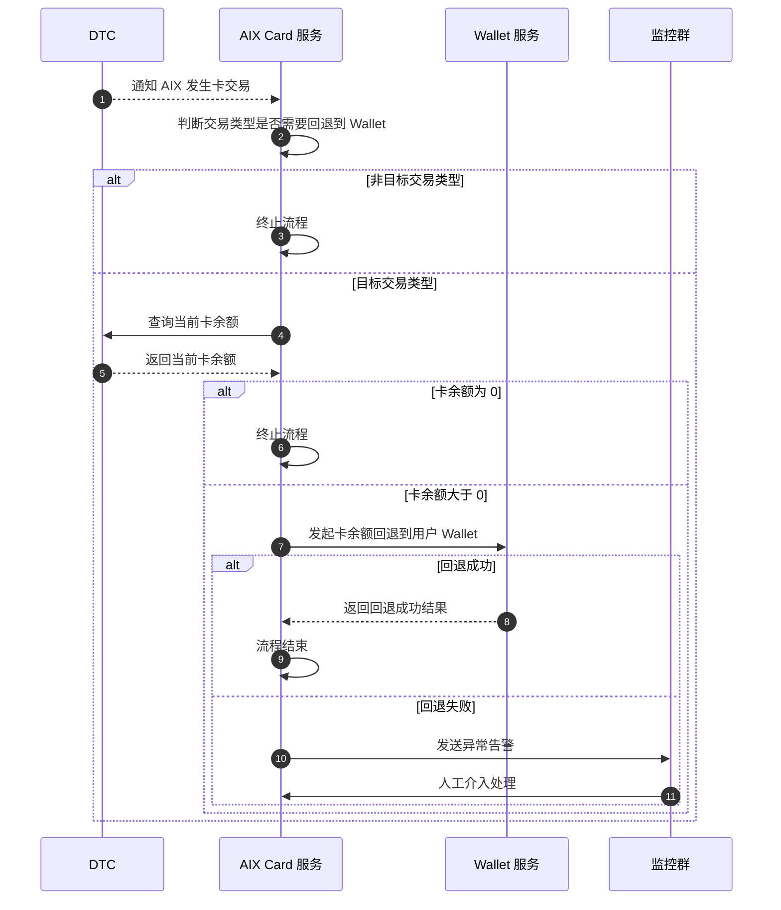
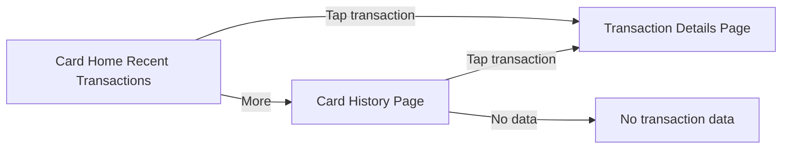

# Card Transaction 卡交易

## 1. 文档信息

| 项目 | 内容 |
|---|---|
| 功能名称 | Card Transaction 卡交易 |
| 所属模块 | Card |
| Owner | 吴忆锋 |
| 版本 | 1.1 |
| 状态 | Review |
| 更新时间 | 2026-05-05 |
| 来源文档 | AIX Card交易【transaction】、DTC Card Issuing API、DTC Wallet OpenAPI、Standard PRD Template v1.3 |

---

## 2. 需求背景、目标与范围

### 2.1 需求背景

原始 PRD 目标是：当卡收到特定类型资金时，AIX 自动将卡余额回退 / 归集到用户 Wallet 账户。

原文背景中的 DTC 知识点说明：退款交易会退回到卡余额；退款时会根据交易发生时汇率将 USD 金额转换为 USDT 等值金额后退回；退款仅退还净商品金额，不包含 FX 费用和 Transaction Fee；退款过程中不收取额外手续费。

### 2.2 用户问题 / 业务问题

如果卡收到退款、冲正、Top-up 或 deposit 后资金停留在卡余额中，用户在 AIX 对外展示的 Wallet 账户中可能无法看到对应资金。因此 AIX 需要在收到 DTC 卡交易通知后，按原文规则判断是否需要将卡余额回退到 Wallet。

### 2.3 需求目标

本文定义 Card 侧交易通知后的资金回退流程，包括：DTC 卡交易通知、交易类型判断、主动查询卡余额、余额大于 0 时回退到 Wallet、回退结果校验、失败告警和人工介入。

本文不定义全局交易历史、交易详情、统一状态模型和对账规则；这些由 `transaction/` 模块承接。

### 2.4 涉及功能清单

| 功能点 | 本期范围 | 优先级 | 状态 | 说明 |
|---|---|---|---|---|
| Card Transaction Notification | In Scope | P0 | Confirmed | DTC 检测发生交易后向 AIX 发送交易通知 |
| 交易类型判断 | In Scope | P0 | Confirmed | AIX 校验 type 是否为 refund / reversal / Top-up / deposit |
| 主动查询卡余额 | In Scope | P0 | Confirmed | 命中目标类型后调用 Inquiry Card Basic Info 查询当前卡 balance |
| 余额判断 | In Scope | P0 | Confirmed | balance > 0 时回退钱包；balance = 0 时终止流程 |
| Transfer Balance to Wallet | In Scope | P0 | Confirmed | 请求将卡内余额归集到用户 Wallet，amount = balance |
| 回退结果校验 | In Scope | P0 | Confirmed | 成功则资金已转入用户 Wallet；失败则告警并人工介入 |
| 异常告警 | In Scope | P0 | Confirmed | 失败发送异常告警至监控群，人工介入处理 |
| Card Home Recent Transactions | In Scope | P1 | Confirmed | Card Home 展示最近交易入口；页面规则在 `card-home.md` |
| Card History / Details | Out of Scope | P1 | Open | 由 Transaction 模块维护 |
| 对账字段 | Out of Scope | P0 | Open | 由 `transaction/reconciliation.md` 与 ALL-GAP 承接 |
| 幂等 / 去重机制 | Out of Scope | P1 | Open | 原文未说明，不写入主流程；如需实现，需技术方案确认 |

---

## 3. 业务流程与规则

### 3.1 业务主流程说明

DTC 检测发生卡交易后，通过 Card Transaction Notification 向 AIX 发送交易通知。AIX 收到交易通知后，校验交易类型是否为 refund / reversal / Top-up / deposit。

若不是目标类型，则终止流程。若命中目标类型，AIX 主动查询当前卡余额，DTC 返回最新卡 balance。若 balance = 0，则终止流程；若 balance > 0，则 AIX 调用 Transfer Balance to Wallet，请求将卡内余额归集到用户 Wallet，入参 amount = balance。

AIX 校验回退接口返回结果。若成功，资金已转入用户 Wallet，流程结束；若失败，则发送异常告警至监控群，人工介入处理。

### 3.2 业务时序图

### 3.3 流程步骤与业务规则

| 步骤 | 场景 / 规则 | 触发条件 | 责任方 | 系统处理 | 成功结果 | 失败 / 分支结果 | 来源 |
|---|---|---|---|---|---|---|---|
| 1 | 触发通知 | DTC 检测发生卡交易 | DTC | 通过 Card Transaction Notification 向 AIX 发送交易通知 | AIX 收到交易通知 | 通知字段取值待 DTC 确认 | 原文 7.3 |
| 2 | 类型判断 | AIX 收到交易通知 | AIX Card | 校验 type 是否为 refund / reversal / Top-up / deposit | 命中则查询卡余额 | 未命中则终止流程 | 原文 7.3 |
| 3 | 主动查询卡余额 | 命中目标交易类型 | AIX Card / DTC | 调用 Inquiry Card Basic Info 主动查询当前卡余额 | DTC 返回最新 balance | 查询失败处理待确认 | 原文 7.3 |
| 4 | 余额判断 | 获取 balance | AIX Card | 判断 balance 是否大于 0 | balance > 0 时回退 Wallet | balance = 0 时终止流程 | 原文 7.3 |
| 5 | 请求资金回退 Wallet | balance > 0 | AIX Card / Wallet | 调用 Transfer Balance to Wallet，amount = balance | 回退请求成功提交 | 回退失败进入告警 | 原文 7.3 |
| 6 | 回退结果校验 | 回退接口返回 | AIX Card | 校验回退接口返回结果 | 成功则资金转入用户 Wallet，流程结束 | 失败则发送告警并人工介入 | 原文 7.3 |
| 7 | 失败人工处理 | 回退失败 | AIX / 监控群 / 人工处理人 | 发送异常告警至监控群 | 人工介入跟进 | 系统原因由开发跟进；交易金额大于卡余额由 PM 跟进 | 原文 7.3 |
| 8 | Card Home 交易展示 | 用户进入 Card Home | App / Card | 展示最近卡交易入口和数据 | 展示最近交易 | 查询失败处理待确认 | Card Home / Transaction 边界 |
| 9 | 历史与详情 | 用户进入交易历史 / 详情 | Transaction | 由 Transaction 模块承接 | 展示历史 / 详情 | 按 Transaction 规则处理 | Transaction & History |

### 3.4 状态规则

| 状态 | 含义 | 触发条件 | 用户可见表现 | 系统处理 | 可迁移到 | 是否终态 | 来源 |
|---|---|---|---|---|---|---|---|
| 已收到交易通知 | DTC 已通知 AIX 发生卡交易 | Card Transaction Notification | 用户不可见 | 进入交易类型判断 | 目标类型 / 非目标类型 | 否 | 原文 7.3 |
| 非目标交易类型 | type 不是 refund / reversal / Top-up / deposit | 交易类型判断 | 用户不可见 | 终止流程，不回退 Wallet | 不适用 | 是 | 原文 7.3 |
| 目标交易类型 | type 是 refund / reversal / Top-up / deposit | 交易类型判断 | 用户不可见 | 主动查询当前卡余额 | balance = 0 / balance > 0 | 否 | 原文 7.3 |
| balance = 0 | 当前卡余额为 0 | 查询卡余额后 | 用户不可见 | 终止流程，不回退 Wallet | 不适用 | 是 | 原文 7.3 |
| balance > 0 | 当前卡余额大于 0 | 查询卡余额后 | 用户不可见 | 发起资金回退 Wallet | 回退成功 / 回退失败 | 否 | 原文 7.3 |
| 回退成功 | Transfer Balance to Wallet 成功 | 回退接口成功返回 | 用户 Wallet 资金更新 | 流程结束 | 对账 | 是 | 原文 7.3 |
| 回退失败 | Transfer Balance to Wallet 失败 | 回退接口失败返回 | 用户可能不可见资金 | 告警并人工介入 | 人工处理 | 否 | 原文 7.3 |

### 3.5 业务级异常与失败处理

| 异常场景 | 触发条件 | 错误来源 | 错误码 / 原因 | 用户表现 | 系统处理 | 是否可重试 | 最终状态 |
|---|---|---|---|---|---|---|---|
| 非目标交易类型 | type 非 refund / reversal / Top-up / deposit | DTC | type 不匹配 | 用户不可见 | 终止流程，不回退 Wallet | 否 | 不回退 |
| 查询余额失败 | Inquiry Card Basic Info 失败 | DTC / Network | 接口失败 | 用户不可见 | 原文未说明，待确认 | 待确认 | 待处理 |
| balance = 0 | 查询卡余额为 0 | DTC | 余额为 0 | 用户不可见 | 终止流程，不回退 Wallet | 否 | 不回退 |
| 回退失败：系统原因 | Transfer Balance to Wallet 失败 | AIX / DTC / Wallet | 系统原因 | 用户可能不可见资金 | 发送告警，开发跟进处理 | 人工 | 待人工处理 |
| 回退失败：交易金额大于卡余额 | Transfer Balance to Wallet 失败 | AIX / DTC / Wallet | 金额大于卡余额 | 用户可能不可见资金 | 发送告警，由 PM 跟进处理 | 人工 | 待人工处理 |
| 回退成功但交易 / 对账不可见 | 回退成功后关联记录不可追踪 | Transaction / Reconciliation | 关联规则缺失 | 用户可能咨询 | 由 Transaction / Reconciliation 模块承接 | 待确认 | 待确认 |
| Card Home 无交易数据 | Card Home 查询无数据 | Card / Transaction | 空数据 | `No transaction data` | 展示空态 | 是 | 空态 |
| Card History / Details 查询失败 | 交易历史或详情接口失败 | Transaction / DTC | 接口失败 | 待确认 | 由 Transaction 模块处理 | 是 | 待确认 |

---

## 4. 页面与交互说明

### 4.1 页面关系总览图

### 4.2 Card Home Recent Transactions

| 区块 | 内容 |
|---|---|
| 页面类型 | 列表区块 |
| 页面目标 | Card Home 展示最近卡交易 |
| 入口 / 触发 | 用户进入 Card Home |
| 展示内容 | 最近 3 条交易、Merchant name、Crypto & Amount、Status、Created Date、Indicator |
| 用户动作 | 点击 More 或交易记录 |
| 系统处理 / 责任方 | 查询 Card 最近交易展示数据；具体接口字段由 Transaction / Card 接口承接 |
| 元素 / 状态 / 提示规则 | 无交易数据展示占位；按交易时间降序 |
| 成功流转 | Card History 或 Transaction Details |
| 失败 / 异常流转 | 查询失败处理待确认 |
| 备注 / 边界 | Home 不维护交易状态机；交易历史、详情和状态由 Transaction 模块承接 |

### 4.3 Card History / Details 边界

| 区块 | 内容 |
|---|---|
| 页面类型 | 列表页面 / 详情页面 |
| 页面目标 | 查看卡交易历史和详情 |
| 入口 / 触发 | Card Home 点击 More 或单条交易 |
| 展示内容 | 历史列表、筛选、详情字段 |
| 用户动作 | 筛选、加载更多、点击详情、复制 Transaction ID |
| 系统处理 / 责任方 | Transaction 模块维护历史、详情、状态模型和对账 |
| 元素 / 状态 / 提示规则 | 详见 `transaction/history.md`、`transaction/detail.md`、`transaction/status-model.md` |
| 成功流转 | 留在 Transaction 页面 |
| 失败 / 异常流转 | 按 Transaction 模块规则处理 |
| 备注 / 边界 | 本文只维护 Card 侧交易通知、卡余额回退和 Card Home 交易入口边界 |

---

## 5. 字段、接口与数据

| 类型 | 名称 | 所属系统 | 来源 | 用途 | 规则 / 输入输出 | 异常处理 |
|---|---|---|---|---|---|---|
| 接口 | Card Transaction Notification | DTC | 原文 7.3 / 8.1 | DTC 通知 AIX 发生卡交易 | 通知字段、取值和落库规则待 DTC 确认 | 通知失败处理待确认 |
| 字段 | type | DTC | 原文 7.3 | 判断是否需要回退 Wallet | refund / reversal / Top-up / deposit 触发后续查询余额 | 非目标类型终止流程 |
| 接口 | Inquiry Card Basic Info | DTC | 原文 7.3 | 主动查询当前卡余额 | 返回最新卡 balance | 查询失败处理待确认 |
| 字段 | balance | DTC | 原文 7.3 | 判断是否需要回退 Wallet，也作为回退金额来源 | balance > 0 时回退；balance = 0 时终止；amount = balance | 缺失或异常待确认 |
| 接口 | Transfer Balance to Wallet | DTC / Wallet | 原文 7.3 / 8.1 | 将卡内余额回退到用户 Wallet | 入参 amount = balance | 失败发送异常告警并人工介入 |
| 接口 | Card Balance History Inquiry | DTC / Transaction | 原文 8.1 | 卡余额历史查询 | 与 Card History / Transaction 模块边界待确认 | 查询失败待确认 |
| 接口 | Card Transaction History / Detail | DTC / Transaction | Transaction 边界来源 | 查询卡交易列表或详情 | 由 Transaction 模块承接 | 失败页待确认 |
| 字段 | Wallet transactionId / relatedId | Wallet | DTC Wallet OpenAPI / ALL-GAP | 对账关联 | 与 Card 交易或回退记录的关联规则待确认 | ALL-GAP |

---

## 6. 通知规则（如适用）

| 触发事件 | 通知渠道 | 通知对象 | 文案 / 模板 | 跳转目标 | 失败 / 补发规则 |
|---|---|---|---|---|---|
| 卡交易成功 | Push / In-app | 持卡用户 | Notification 模块维护 | Card Transaction Details | 本文不定义 |
| 卡退款成功 | Push / In-app | 持卡用户 | Notification 模块维护 | Card Transaction Details | 本文不定义 |
| 回退失败告警 | Monitor / 内部群 | 内部运营 / 技术 / PM | 告警模板待确认 | 内部处理台 | 原文要求人工介入；补发规则待确认 |

---

## 7. 权限 / 合规 / 风控（如适用）

| 类型 | 规则 | 影响 | 来源 |
|---|---|---|---|
| 资金回退范围 | 仅 refund / reversal / Top-up / deposit 触发余额查询与 Wallet 回退 | 防止非目标交易误回退 | 原文 7.3 |
| 金额来源 | 回退金额取查询得到的卡 balance，amount = balance | 防止按通知金额错误回退 | 原文 7.3 |
| 失败可观测 | 回退失败必须发送异常告警并人工介入 | 防止资金悬挂 | 原文 7.3 |
| 用户展示边界 | 全局交易历史、详情、状态和对账由 Transaction 模块维护 | 防止 Card 侧覆盖全局交易模型 | Transaction 边界 |
| 退款费用规则 | 退款仅退还净商品金额，不含 FX 费用和 Transaction Fee；退款过程不额外收费 | 明确用户退款金额预期 | 原文 DTC 知识点 |

---

## 8. 待确认事项

| 问题 | 影响范围 | 当前处理 | 是否阻塞验收 | 建议确认人 |
|---|---|---|---|---|
| Card Transaction Notification 的完整字段、type 枚举和取值大小写 | BE / DTC / QA | 阻塞 | 是 | BE / DTC |
| 原文 `Top-up` 与 DTC 实际 type 枚举如何拼写和映射 | BE / DTC / QA | 阻塞 | 是 | BE / DTC / PM |
| Inquiry Card Basic Info 查询失败时是否告警、是否重试、是否人工介入 | BE / Ops | 阻塞 | 是 | BE / Ops / PM |
| 回退失败告警监控群、告警字段、责任分派和人工补偿入口 | Ops / Finance / BE | 阻塞 | 是 | PM / Ops / BE |
| 失败原因为系统原因和交易金额大于卡余额时的判断来源 | Ops / BE / PM | 阻塞 | 是 | BE / Ops / PM |
| Card Balance History Inquiry 与 Card History / Transaction 模块的关系 | FE / BE / QA / Transaction | 不阻塞 | 否 | PM / BE |
| Card 交易、Wallet 回退记录和全局 Transaction 记录之间的关联字段 | 对账 / 故障追踪 | 阻塞 | 是 | BE / Finance |
| Card Transaction Notification 是否需要幂等 / 去重机制，以及去重字段是什么 | BE / Audit | 不阻塞 / 技术方案待定 | 否 | BE / Audit |
| Card Home / Card History / Details 的交易状态映射是否统一由交易模块收口 | FE / QA / Transaction | 不阻塞 | 否 | PM / BE |
| 详情查询失败页文案与错误码映射 | FE / QA | 不阻塞 | 否 | PM / QA |

---

## 9. 验收标准 / 测试场景

### 9.1 验收标准

| 验收场景 | 验收标准 |
|---|---|
| 正常流程 | DTC 通知目标交易类型且 balance > 0 时，AIX 发起 Transfer Balance to Wallet，amount = balance |
| 异常流程 | 非目标类型、balance = 0、查询余额失败、回退失败均有明确处理或待确认边界 |
| 页面展示 | Card Home 展示最近 3 条，Card History / Details 入口可用 |
| 系统交互 | Card Transaction Notification、Inquiry Card Basic Info、Transfer Balance to Wallet 的边界明确 |
| 通知 | 用户交易通知由 Notification 模块维护；回退失败走内部告警和人工介入 |
| 数据 / 埋点 | type、balance、回退结果、告警原因和交易关联字段可追踪或进入待确认 |

### 9.2 测试场景矩阵

| 场景 | 前置条件 | 用户操作 | 预期页面表现 | 预期系统结果 | 是否必测 |
|---|---|---|---|---|---|
| refund 回退成功 | 收到 refund，balance > 0 | 无用户操作 | 用户 Wallet 资金更新 | 调用 Transfer Balance to Wallet，amount = balance | 是 |
| reversal 回退成功 | 收到 reversal，balance > 0 | 无用户操作 | 用户 Wallet 资金更新 | 调用 Transfer Balance to Wallet，amount = balance | 是 |
| Top-up 回退成功 | 收到 Top-up，balance > 0 | 无用户操作 | 用户 Wallet 资金更新 | 调用 Transfer Balance to Wallet，amount = balance | 是 |
| deposit 回退成功 | 收到 deposit，balance > 0 | 无用户操作 | 用户 Wallet 资金更新 | 调用 Transfer Balance to Wallet，amount = balance | 是 |
| 非目标类型 | 收到非目标 type | 无用户操作 | 用户不可见 | 终止流程，不查询或不回退 | 是 |
| balance = 0 | 目标类型，卡余额为 0 | 无用户操作 | 用户不可见 | 终止流程，不调用 Transfer | 是 |
| 查询余额失败 | 目标类型，查询余额失败 | 无用户操作 | 用户不可见 | 处理方式待确认 | 是 |
| 回退失败 | 目标类型，balance > 0，Transfer 失败 | 无用户操作 | 用户可能不可见资金 | 发送异常告警，人工介入 | 是 |
| Home 交易展示 | 有 3 条以上卡交易 | 进入 Card Home | 展示最近 3 条 | 查询交易列表 | 是 |
| History 无数据 | 无交易 | 进入 Card History | 展示 No transaction data | 不报错 | 是 |
| Details 查询失败 | 交易详情接口失败 | 点击交易 | 错误页待确认 | 不展示错误详情 | 是 |

---

## 10. 来源引用

- (Ref: 历史prd/AIX Card交易【transaction】.docx / 7.1 / 7.2 / 7.3 / 8.1 / 9)
- (Ref: 历史prd/AIX APP V1.0【Transaction & History】 (1).docx / 5.2 / 5.3 / V1.1，仅作为 Transaction 模块边界来源)
- (Ref: DTC Card Issuing API Document_20260310 / Card Transaction Notification / Inquiry Card Basic Info)
- (Ref: DTC Wallet OpenAPI Documentation / Transfer Balance to Wallet)
- (Ref: knowledge-base/transaction/history.md)
- (Ref: knowledge-base/transaction/detail.md)
- (Ref: knowledge-base/transaction/reconciliation.md)
- (Ref: knowledge-base/changelog/knowledge-gaps.md)
- (Ref: prd-template/standard-prd-template.md / v1.3)
