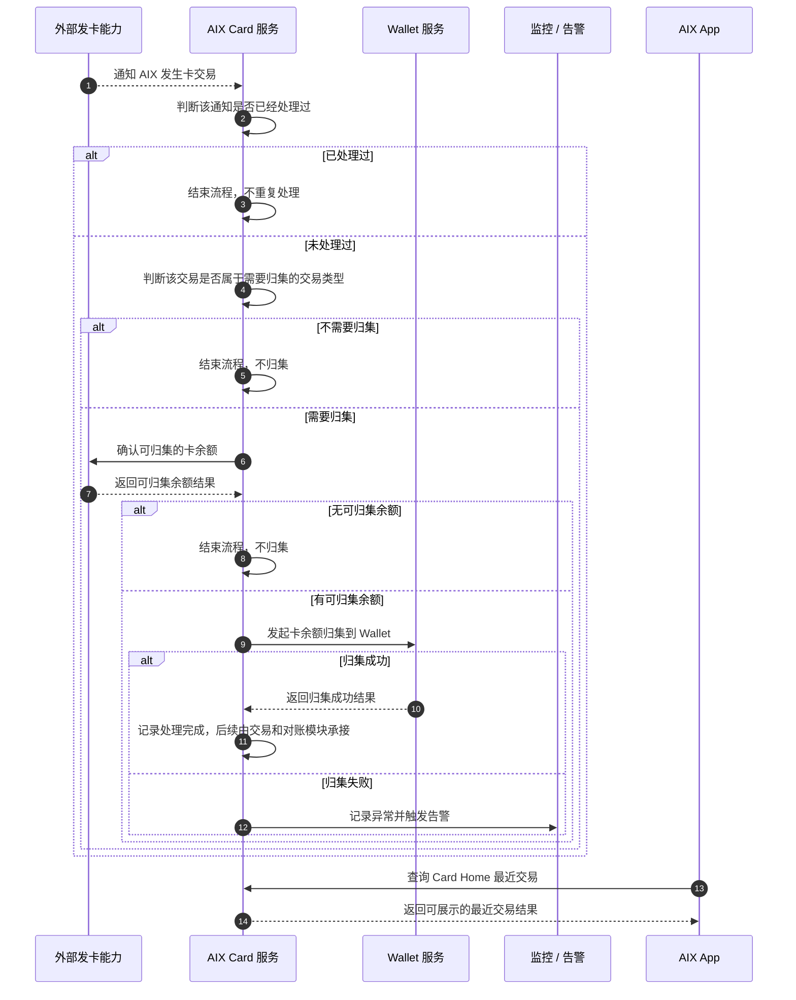
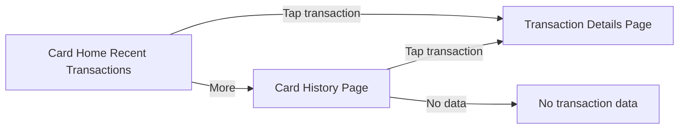

# Card Transaction 卡交易

## 1. 文档信息

| 项目 | 内容 |
|---|---|
| 功能名称 | Card Transaction 卡交易 |
| 所属模块 | Card |
| Owner | 吴忆锋 |
| 版本 | 1.0 |
| 状态 | Review |
| 更新时间 | 2026-05-05 |
| 来源文档 | AIX Card交易【transaction】、DTC Card Issuing API、DTC Wallet OpenAPI、Standard PRD Template v1.3 |

---

## 2. 需求背景、目标与范围

### 2.1 需求背景

DTC 卡交易发生后，AIX 需要接收 Card Transaction Notify，并根据交易类型判断是否触发卡余额归集到 Wallet。同时，Card Home 需要展示 Card 最近交易入口，交易历史、交易详情、状态模型和对账需要由 Transaction 模块统一承接。

### 2.2 用户问题 / 业务问题

如果卡交易通知、自动归集、交易展示和全局交易模块边界不清，可能造成重复归集、资金悬挂、用户资金不可见、交易展示和账务状态不一致。

### 2.3 需求目标

定义 Card 侧交易通知、去重、目标类型判断、查询卡余额、Transfer Balance to Wallet、Card Home 最近交易入口和 Transaction 模块边界。

### 2.4 涉及功能清单

| 功能点 | 本期范围 | 优先级 | 状态 | 说明 |
|---|---|---|---|---|
| Card Transaction Notify | In Scope | P0 | Open | DTC 通知 AIX 卡交易发生，原始报文落库待确认 |
| 通知去重 | In Scope | P0 | Open | 可按 event + data.id，具体实现待确认 |
| 归集触发类型 | In Scope | P0 | Confirmed | refund / reversal / deposit |
| 查询卡余额 | In Scope | P0 | Confirmed | Inquiry Card Basic Info 获取 balance |
| Transfer Balance to Wallet | In Scope | P0 | Confirmed | balance > 0 时归集 |
| 失败告警 | In Scope | P0 | Open | 不自动重试，告警和补偿入口待确认 |
| Card Home Recent Transactions | In Scope | P1 | Confirmed | 首页最近 3 条展示，页面规则在 card-home.md |
| Card History / Details | Out of Scope | P1 | Open | 由 Transaction 模块维护 |
| 对账字段 | Out of Scope | P0 | Open | 由 transaction/reconciliation.md 与 ALL-GAP 承接 |

---

## 3. 业务流程与规则

### 3.1 业务主流程说明

DTC 通过 Card Transaction Notify 通知 AIX。AIX 接收通知后按 event + data.id 去重，再判断交易类型是否为 refund / reversal / deposit。若不是目标类型，则流程终止；若命中目标类型，AIX 查询当前卡 balance。balance=0 时终止；balance>0 时调用 Transfer Balance to Wallet，amount=balance。归集失败不自动重试，需要告警和人工处理。

### 3.2 业务时序图

### 3.3 流程步骤与业务规则

| 步骤 | 场景 / 规则 | 触发条件 | 责任方 | 系统处理 | 成功结果 | 失败 / 分支结果 | 来源 |
|---|---|---|---|---|---|---|---|
| 1 | 接收通知 | DTC 发生卡交易 | DTC / Card | 接收 Card Transaction Notify | 进入去重 | 原始报文落库待确认 | DTC / ALL-GAP |
| 2 | 通知去重 | 收到 Webhook | Card | 按 event + data.id 判断 | 非重复进入类型判断 | 重复通知不重复处理 | 用户确认 / ALL-GAP |
| 3 | 类型判断 | 非重复通知 | Card | 判断 type 是否 refund / reversal / deposit | 命中则查询余额 | 未命中终止，不归集 | 用户确认 |
| 4 | 查询余额 | 命中目标类型 | Card / DTC | Inquiry Card Basic Info | 返回 balance | 查询失败处理待确认 | DTC / ALL-GAP |
| 5 | 金额判断 | 拿到 balance | Card | 判断 balance 是否大于 0 | 大于 0 归集 | 等于 0 终止 | AIX Card Transaction |
| 6 | 归集钱包 | balance > 0 | Card / DTC / Wallet | Transfer Balance to Wallet，amount=balance | 归集成功 | 失败不自动重试，告警 | 用户确认 |
| 7 | Card Home 展示 | 用户进入 Card Home | App / Card | 查询最近卡交易 | 展示最近 3 条 | 查询失败处理待确认 | Card Transaction / Card Home |
| 8 | 历史与详情 | 用户进入交易历史 / 详情 | Transaction | 由 Transaction 模块承接 | 展示历史 / 详情 | 按 Transaction 规则处理 | Transaction & History |

### 3.4 状态规则

| 状态 | 含义 | 触发条件 | 用户可见表现 | 系统处理 | 可迁移到 | 是否终态 | 来源 |
|---|---|---|---|---|---|---|---|
| 通知已接收 | 收到 DTC 通知 | Card Transaction Notify | 用户不可见 | 落库 / 去重 | 已去重 / 已忽略 | 否 | DTC / ALL-GAP |
| 重复通知 | event + data.id 已处理 | 重复推送 | 用户不可见 | 忽略，不重复归集 | 已忽略 | 是 | 用户确认 |
| 非目标类型 | type 不在目标范围 | 通知类型判断 | 用户不可见 | 不归集 | 终止 | 是 | 用户确认 |
| balance=0 | 卡余额为 0 | 查询 Basic Info | 用户不可见 | 不归集 | 终止 | 是 | AIX Card Transaction |
| 待归集 | balance > 0 | 查询余额成功 | 用户不可见 | 调用 Transfer | 归集成功 / 失败 | 否 | AIX Card Transaction |
| 归集成功 | Transfer 成功 | DTC 返回成功 | 用户看 Wallet 资金 | 结束流程 | 对账 | 是 | 用户确认 |
| 归集失败 | Transfer 失败 | DTC 返回失败 | 用户可能不可见资金 | 告警，不自动重试 | 人工处理 | 否 | 用户确认 |

### 3.5 业务级异常与失败处理

| 异常场景 | 触发条件 | 错误来源 | 错误码 / 原因 | 用户表现 | 系统处理 | 是否可重试 | 最终状态 |
|---|---|---|---|---|---|---|---|
| 重复通知 | DTC 重复推送 | DTC | event + data.id 相同 | 用户不可见 | 不重复归集 | 否 | 已忽略 |
| 非目标交易类型 | type 非 refund / reversal / deposit | DTC | type 不匹配 | 用户不可见 | 终止 | 否 | 不归集 |
| 查询余额失败 | Inquiry Basic Info 失败 | DTC / Network | 接口失败 | 用户不可见 | 待确认 | 待确认 | 待处理 |
| balance=0 | 查询余额为 0 | DTC | 余额为 0 | 用户不可见 | 终止 | 否 | 不归集 |
| Transfer 失败 | Transfer Balance to Wallet 失败 | DTC | 接口失败 | 极端情况下用户不可见资金 | 告警，不自动重试 | 人工 | 待人工处理 |
| DTC transfer 成功但 Wallet 未到账 | 极端异常 | Wallet / DTC | 对账缺失 | 用户可能反馈 | 当前自动发现和关联规则待确认 | 待确认 | 待人工处理 |
| 交易查询无数据 | Card Home 无交易数据 | Card / Transaction | 空数据 | `No transaction data` | 展示空态 | 是 | 空态 |
| 详情查询失败 | Transaction Detail 查询失败 | Transaction / DTC | 接口失败 | 待确认 | 由 Transaction 模块处理 | 是 | 待确认 |

---

## 4. 页面与交互说明

### 4.1 页面关系总览图

### 4.2 Card Home Recent Transactions

| 区块 | 内容 |
|---|---|
| 页面类型 | 列表区块 |
| 页面目标 | Card Home 展示最近卡交易 |
| 入口 / 触发 | 用户进入 Card Home |
| 展示内容 | 最近 3 条交易、Merchant name、Crypto & Amount、Status、Created Date、Indicator |
| 用户动作 | 点击 More 或交易记录 |
| 系统处理 / 责任方 | 调用 Card Transaction Inquiry 或交易模块接口 |
| 元素 / 状态 / 提示规则 | 无交易数据展示占位；按交易时间降序 |
| 成功流转 | Card History 或 Transaction Details |
| 失败 / 异常流转 | 查询失败处理待确认 |
| 备注 / 边界 | Home 不维护交易状态机；交易历史、详情和状态由 Transaction 模块承接 |

### 4.3 Card History / Details 边界

| 区块 | 内容 |
|---|---|
| 页面类型 | 列表页面 / 详情页面 |
| 页面目标 | 查看卡交易历史和详情 |
| 入口 / 触发 | Card Home 点击 More 或单条交易 |
| 展示内容 | 历史列表、筛选、详情字段 |
| 用户动作 | 筛选、加载更多、点击详情、复制 Transaction ID |
| 系统处理 / 责任方 | Transaction 模块维护历史、详情、状态模型和对账 |
| 元素 / 状态 / 提示规则 | 详见 `transaction/history.md`、`transaction/detail.md`、`transaction/status-model.md` |
| 成功流转 | 留在 Transaction 页面 |
| 失败 / 异常流转 | 按 Transaction 模块规则处理 |
| 备注 / 边界 | 本文只维护 Card 侧入口和 Card 交易触发边界 |

---

## 5. 字段、接口与数据

| 类型 | 名称 | 所属系统 | 来源 | 用途 | 规则 / 输入输出 | 异常处理 |
|---|---|---|---|---|---|---|
| 接口 | Card Transaction Notify | DTC | DTC Card Issuing | 接收卡交易通知 | event、data.id、type 等 | 原始报文落库待确认 |
| 字段 | event | DTC | DTC API | 通知事件类型 | 如 CARD_TRANSACTION | 缺失待确认 |
| 字段 | data.id | DTC | DTC API | DTC Transaction ID | 与 event 组合去重 | 与 Wallet ID 关系待确认 |
| 字段 | type | DTC | DTC API / 用户确认 | 判断是否归集 | refund / reversal / deposit | 非目标类型终止 |
| 字段 | balance | DTC | Inquiry Card Basic Info | 归集金额依据 | amount = balance | 查询失败待确认 |
| 接口 | Inquiry Card Basic Info | DTC | DTC API | 查询 card balance | `[POST] /openapi/v1/card/inquiry-card-info` | 查询失败待确认 |
| 接口 | Transfer Balance to Wallet | DTC | DTC Wallet API | 归集卡余额到 Wallet | amount=balance | 失败告警，不自动重试 |
| Header | D-REQUEST-ID | DTC | DTC API | 请求唯一标识 | 幂等语义待确认 | ALL-GAP |
| 接口 | Transaction History of Card | DTC / Transaction | DTC API / Transaction | 查询卡交易列表 | 由 Transaction 模块承接 | 查询失败待确认 |
| 接口 | Card Transaction Detail Inquiry | DTC / Transaction | DTC API / Transaction | 查询卡交易详情 | 由 Transaction 模块承接 | 失败页待确认 |
| 字段 | Wallet transactionId / relatedId | Wallet | DTC Wallet OpenAPI | 对账关联 | 与 Card data.id 关系待确认 | ALL-GAP |

---

## 6. 通知规则（如适用）

| 触发事件 | 通知渠道 | 通知对象 | 文案 / 模板 | 跳转目标 | 失败 / 补发规则 |
|---|---|---|---|---|---|
| 卡交易成功 | Push / In-app | 持卡用户 | Notification 模块维护 | Card Transaction Details | 本文不定义 |
| 卡退款成功 | Push / In-app | 持卡用户 | Notification 模块维护 | Card Transaction Details | 本文不定义 |
| 归集失败告警 | Monitor / 内部群 | 内部运营 / 技术 | 告警模板待确认 | 内部处理台 | 不自动重试，人工处理 |

---

## 7. 权限 / 合规 / 风控（如适用）

| 类型 | 规则 | 影响 | 来源 |
|---|---|---|---|
| 资金风控 | 仅 refund / reversal / deposit 触发自动归集 | 防止非目标交易误归集 | 用户确认 |
| 金额来源 | 归集金额只取查询得到的 card balance | 防止按通知金额错误归集 | AIX Card Transaction |
| 失败可观测 | 归集失败必须告警并人工介入 | 防止资金悬挂 | 用户确认 / ALL-GAP |
| 用户展示边界 | AIX 对外只展示 Wallet 资金，不展示卡资金 | 钱包未到账时用户不可见卡内资金 | 用户确认 |
| 可追溯性 | 交易 ID、请求 ID、Wallet 关联字段需明确 | 影响对账和故障追踪 | ALL-GAP |

---

## 8. 待确认事项

| 问题 | 影响范围 | 当前处理 | 是否阻塞验收 | 建议确认人 |
|---|---|---|---|---|
| Card Transaction Notify 原始报文落库、去重、重放规则 | BE / Audit | 阻塞 | 是 | BE / Audit |
| 自动归集失败告警监控群、告警字段、责任分派和人工补偿入口 | Ops / Finance / BE | 阻塞 | 是 | PM / Ops / BE |
| Card data.id、D-REQUEST-ID、Wallet transactionId、Wallet relatedId 的最终关联规则 | 对账 / 故障追踪 | 阻塞 | 是 | BE / Finance |
| Card Home / Card History / Details 的交易状态映射是否统一由交易模块收口 | FE / QA / Transaction | 不阻塞 | 否 | PM / BE |
| 详情查询失败页文案与错误码映射 | FE / QA | 不阻塞 | 否 | PM / QA |

---

## 9. 验收标准 / 测试场景

### 9.1 验收标准

| 验收场景 | 验收标准 |
|---|---|
| 正常流程 | refund / reversal / deposit 且 balance>0 时发起 Transfer Balance to Wallet |
| 异常流程 | 重复通知、非目标类型、balance=0、查询失败、Transfer 失败均有明确处理 |
| 页面展示 | Card Home 展示最近 3 条，Card History / Details 入口可用 |
| 系统交互 | 通知去重、查询余额、归集接口、交易查询接口边界明确 |
| 通知 | 用户通知由 Notification 模块维护，内部告警规则待确认 |
| 数据 / 埋点 | 交易 ID、请求 ID、Wallet 关联字段缺口进入 ALL-GAP |

### 9.2 测试场景矩阵

| 场景 | 前置条件 | 用户操作 | 预期页面表现 | 预期系统结果 | 是否必测 |
|---|---|---|---|---|---|
| 目标类型归集 | 收到 refund / reversal / deposit，balance>0 | 无用户操作 | 用户不可见 | 调用 Transfer amount=balance | 是 |
| 非目标类型 | 收到非目标 type | 无用户操作 | 用户不可见 | 不查询余额或不归集 | 是 |
| balance=0 | 目标类型，余额为 0 | 无用户操作 | 用户不可见 | 不调用 Transfer | 是 |
| Transfer 失败 | 目标类型，balance>0 | 无用户操作 | 用户可能不可见资金 | 告警，不自动重试 | 是 |
| Home 交易展示 | 有 3 条以上卡交易 | 进入 Card Home | 展示最近 3 条 | 查询交易列表 | 是 |
| History 无数据 | 无交易 | 进入 Card History | 展示 No transaction data | 不报错 | 是 |
| Details 查询失败 | 交易详情接口失败 | 点击交易 | 错误页待确认 | 不展示错误详情 | 是 |

---

## 10. 来源引用

- (Ref: 历史prd/AIX Card交易【transaction】.docx / V1.0)
- (Ref: 历史prd/AIX APP V1.0【Transaction & History】 (1).docx / 5.2 / 5.3 / V1.1，仅作为 Transaction 模块边界来源)
- (Ref: DTC Card Issuing API Document_20260310 / Card Transaction Notify / Inquiry Card Basic Info)
- (Ref: DTC Wallet OpenAPI Documentation / Transfer Balance to Wallet)
- (Ref: knowledge-base/transaction/history.md)
- (Ref: knowledge-base/transaction/detail.md)
- (Ref: knowledge-base/transaction/reconciliation.md)
- (Ref: knowledge-base/changelog/knowledge-gaps.md)
- (Ref: prd-template/standard-prd-template.md / v1.3)
