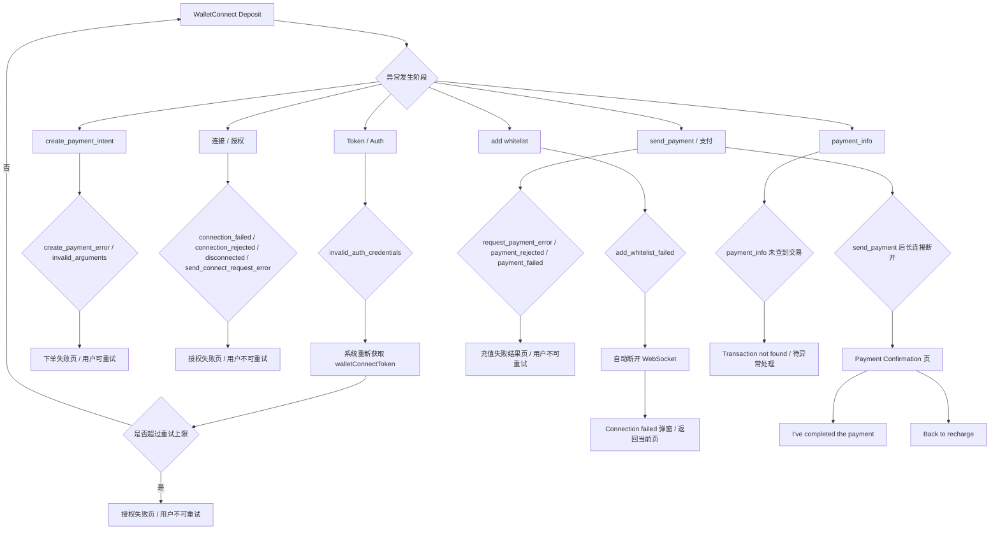

# Common Errors 错误处理公共能力

## 1. 功能定位

Common Errors 用于沉淀 AIX 跨模块错误处理边界，包括 DTC 错误码、系统异常、网络异常、风控 / on-hold、告警、人工处理和用户提示。

本文只记录已确认的错误处理事实和边界，不补写未确认错误码、用户文案或自动补偿策略。

## 2. 已确认错误处理事实

| 场景 | 当前结论 | 来源 | 备注 |
|---|---|---|---|
| Card 归集失败 | 不自动重试，发送异常告警至监控群 | Card Transaction Flow | 已确认 |
| DTC transfer 成功但 Wallet 未到账 | 当前无法系统自动发现，主要依赖用户反馈 | Card Transaction Flow | 已确认 |
| Crypto Deposit 未加白 | 未加 senderAddress whitelist 时，交易会被设为 risky transaction，`status=102 Risk Withheld` | DTC Wallet OpenAPI / 3.4 Crypto Deposit | 可作为 Deposit on-hold / review 来源 |
| Crypto Deposit 加白后 | 用户继续加白并 enable 后，交易会自动变为 success | DTC Wallet OpenAPI / 3.4 Crypto Deposit | AIX 是否刷新 / 通知待补 |
| WalletConnect add whitelist failed | 返回 `add_whitelist_failed`，WebSocket 自动断开 | AIX Wallet PRD / 6.4.5；DTC WalletConnect / 3.2.13、3.3 | AIX 弹窗提示连接失败 |
| WalletConnect invalid_auth_credentials | 系统自动重新获取 token；超过上限进入授权失败页 | AIX Wallet PRD / 6.4.5；DTC WalletConnect / 3.2.11 | 重新获取次数以 PRD 为准 |
| WalletConnect create_payment_error / invalid_arguments | 进入下单失败页，用户可重试 | AIX Wallet PRD / 6.4.5；DTC WalletConnect / 3.2.12、3.2.14 | 属于 create_payment_intent 阶段 |
| WalletConnect connection_failed / connection_rejected / disconnected / send_connect_request_error | 进入授权失败页，用户不可重试 | AIX Wallet PRD / 6.4.5；DTC WalletConnect / 3.2.8-3.2.10、3.2.15 | 属于连接 / 授权阶段 |
| WalletConnect request_payment_error / payment_rejected / payment_failed | 进入充值失败结果页，用户不可重试 | AIX Wallet PRD / 6.4.5；DTC WalletConnect / 3.2.2、3.2.6、3.2.7 | 属于 send_payment / 支付阶段 |
| Deposit under review 通知 | `event=CRYPTO_TXN`、`type=DEPOSIT`、`state=RISK_WITHHELD` | Notification PRD / Deposit row | 具体 webhook 逻辑待定义 |
| Card balance 查询失败 | 处理规则未确认 | Card / knowledge-gaps | deferred |
| Send / Swap 错误处理 | 不归档 active | Wallet Stage Review | 功能 deferred |

## 3. Deposit 错误边界

Deposit 当前 active，包含 GTR 与 WalletConnect。错误处理必须按子路径拆开，不得默认共用。

| 错误 / 异常场景 | GTR / Exchange 地址充值 | WalletConnect | 当前处理 |
|---|---|---|---|
| 入金发起失败 | 待补 | 下单失败页，可重试 | GTR 不补，WC 按 PRD 写 |
| 入金处理中失败 | 待补 | payment_info / 长连接异常存在待处理分支 | 不写自动补偿 |
| 未加白 | GTR 路径不校验地址白名单 | WC Approved 后自动 add whitelist；失败则 add_whitelist_failed | 不写成所有 Deposit 均适用 |
| Risk Withheld / under review | 可引用 DTC / Notification 边界，但 GTR 页面处理待确认 | 可引用 DTC / Notification 边界，WC 结果页映射待确认 | 不强行等同 Wallet state |
| 加白后恢复 success | GTR 不适用地址白名单规则 | DTC Crypto Deposit 有加白后 success，WC add whitelist 是连接 / 支付前置 | 不写余额立即可用 |
| Declare / Travel Rule 异常 | GTR 自动交易报备，不需要交易声明 | PRD 口径为自动交易报备，不需要交易声明 | 不新增 Declare 通知 |
| Wallet balance 未更新 | 待补 | 待补 | 不写自动发现 / 自动补偿 |
| 通知失败 | 待补 | 待补 | 不写补发策略 |

## 4. WalletConnect 异常分流

## 5. WalletConnect 事件处理表

| 阶段 | 事件 | DTC 事件含义 | AIX 处理 |
|---|---|---|---|
| Token | `invalid_auth_credentials` | walletConnectToken invalid or missing | 自动重新获取 token；超过上限进入授权失败页 |
| create_payment_intent | `invalid_arguments` | create_payment_intent 参数错误 | 下单失败页，可重试 |
| create_payment_intent | `create_payment_error` | Failed to create payment | 下单失败页，可重试 |
| 连接 / 授权 | `connection_failed` | 连接失败 | 授权失败页，不可重试 |
| 连接 / 授权 | `connection_rejected` | 用户拒绝连接 | 授权失败页，不可重试 |
| 连接 / 授权 | `disconnected` | 连接断开 | 授权失败页，不可重试，具体取决于断开发生阶段 |
| 连接 / 授权 | `send_connect_request_error` | Failed to send connect request | 授权失败页，不可重试 |
| 白名单 | `add_whitelist_failed` | 添加白名单失败 | WebSocket 自动断开；弹窗提示连接失败 |
| 支付请求 | `request_payment_error` | Failed to request payment | 充值失败结果页，不可重试 |
| 支付请求 | `payment_rejected` | 用户取消支付请求 | 充值失败结果页，不可重试 |
| 支付请求 | `payment_failed` | 用户点击支付后支付未成功 | 充值失败结果页，不可重试 |
| 支付广播 | `payment_broadcasted` | 交易已提交到区块链 | 继续等待 payment_info |
| 结果查询 | `payment_info` false / `25001 Transaction not found` | DTC 未收到付款 | 待异常处理，不写到账 |

## 6. 告警与人工处理边界

| 场景 | 当前结论 | 未确认项 |
|---|---|---|
| Card 归集失败 | 告警至监控群，不自动重试 | 是否有后台人工补偿入口未确认 |
| DTC transfer 成功但 Wallet 未到账 | 依赖用户反馈发现 | 人工处理路径未确认 |
| GTR 地址充值异常 | 非 Binance、非本人账户、错误网络、错误地址、低于最小充值金额存在风险 | 后台处理 / 客服处理未确认 |
| WalletConnect add whitelist failed | AIX 弹窗提示连接失败，用户返回当前页 | 是否告警待确认 |
| WalletConnect 授权失败 | 进入授权失败页，用户不可重试 | 是否记录失败原因 / 告警待确认 |
| WalletConnect 支付状态不明 | send_payment 后长连接断开进入 Payment Confirmation 页 | 后续对账 / 查询机制待确认 |
| Crypto Deposit Risk Withheld | DTC 规则为用户加白后自动 success | AIX 是否告警、是否人工介入、是否用户自助处理待补 |
| Deposit 余额未更新 | 待确认 | 是否告警、是否自动对账、是否人工补偿未确认 |

## 7. 用户提示边界

| 场景 | 当前处理 |
|---|---|
| GTR unsupported network | FAQ / PRD 可写永久损失风险提示，不补找回机制 |
| GTR wrong address | FAQ 可写无法接收、通常无法追回，不补人工找回 |
| GTR 非本人账户 | PRD 提示必须本人 Binance 账户，不补后台校验字段 |
| WalletConnect 无可用钱包 | toast：`No wallets available. Please install a supported wallet app.` |
| WalletConnect add whitelist failed | 弹窗：`Connection failed，Unable to send connect request, Please try again.` |
| WalletConnect 下单失败 | 下单失败页，用户可重试 |
| WalletConnect 授权失败 | 授权失败页，用户不可重试 |
| WalletConnect 支付失败 | 充值失败结果页，用户不可重试 |
| WalletConnect 支付状态不明 | Payment Confirmation 页，引导用户完成或返回充值 |
| Deposit Risk Withheld / under review | Notification PRD 有 under review 通知，但页面提示和客服口径待补 |

## 8. 不写入事实的内容

以下内容不得写成事实：

1. Card 归集失败会自动重试。
2. Card 归集失败一定有后台补偿入口。
3. DTC transfer 成功但 Wallet 未到账可被系统自动发现。
4. Deposit 余额未更新可被系统自动发现。
5. 所有 DTC 错误码都已完成映射。
6. `Risk Withheld` 等同所有 risk rejected / on-hold 场景。
7. Risk Withheld 等同 Wallet `REJECTED / PENDING / PROCESSING`。
8. GTR / WalletConnect 使用同一套错误码和提示。
9. Send / Swap 的错误处理属于当前 active 范围。
10. 通用错误页文案已确认。
11. 未来源确认的错误码与用户提示映射。
12. payment_info success 等同 Wallet balance 立即可用。
13. WalletConnect 7 天免连接规则与 PRD 1 天授权规则已统一。

## 9. 待补项

| 编号 | 待补项 | 来源建议 | 当前处理 |
|---|---|---|---|
| ERR-GAP-001 | DTC 通用错误码完整表 | DTC 接口文档 | 待补 |
| ERR-GAP-002 | Transfer Balance to Wallet 错误码映射 | DTC Card Issuing / Card PRD | 待补 |
| ERR-GAP-003 | WalletConnect 失败原因和用户提示是否需要进一步产品化 | WC PRD / UX | 部分已补，完整展示待补 |
| ERR-GAP-004 | GTR Deposit 错误码与失败原因 | GTR PRD / DTC Wallet OpenAPI | 待补 |
| ERR-GAP-005 | Deposit Risk Withheld 页面提示和处理路径 | Wallet PRD / Notification / 客服口径 | 待补 |
| ERR-GAP-006 | 告警规则、监控群、责任分派 | 后端 / 运维 / 产品确认 | 待补 |
| ERR-GAP-007 | 人工补偿入口与操作边界 | 后台 PRD / 后端确认 | 待补 |
| ERR-GAP-008 | 用户提示与错误码映射 | PRD / UX / 客服口径 | 待补 |
| ERR-GAP-009 | Deposit 余额未更新发现机制 | 后端 / 账务 / 产品确认 | 待补 |

## 10. 来源引用

- (Ref: 历史prd/AIX Wallet V1.0【Deposit & Send & Swap 】.docx / 6.4.5 异常处理)
- (Ref: DTC接口文档/Documentation dtc-nodejs-wallet-connect (ARCHIVE).docx / 3 Server-Emitted Events)
- (Ref: DTC接口文档/Documentation dtc-nodejs-wallet-connect (ARCHIVE).docx / 3.3 Websocket disconnect)
- (Ref: DTC Wallet OpenAPI Document20260126 / 3.4 Crypto Deposit)
- (Ref: [2025-11-25] AIX+Notification / Deposit under review row)
- (Ref: knowledge-base/common/dtc.md / v1.4)
- (Ref: knowledge-base/common/walletconnect.md / v1.3)
- (Ref: knowledge-base/common/notification.md / v1.2)
- (Ref: knowledge-base/wallet/deposit.md / v1.5)
- (Ref: knowledge-base/changelog/knowledge-gaps.md / deferred gaps)
