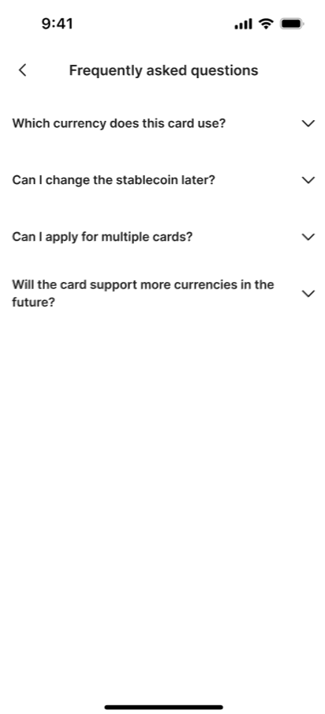
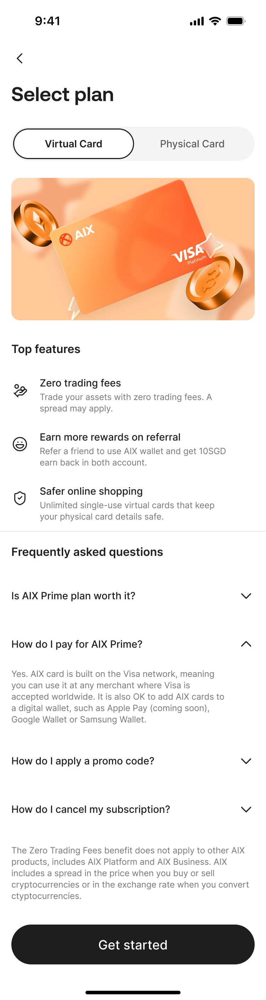
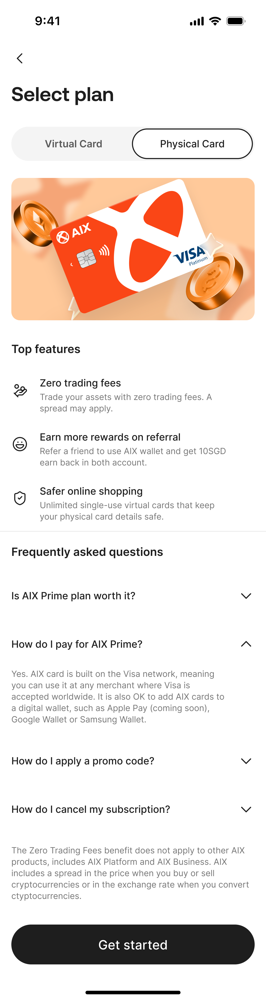
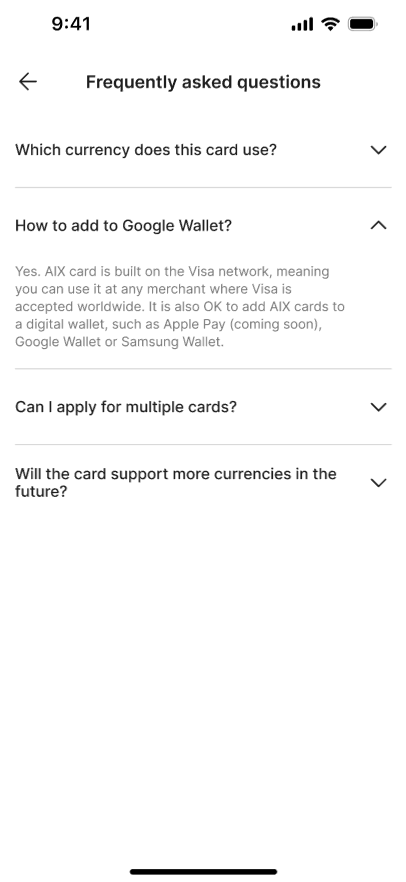
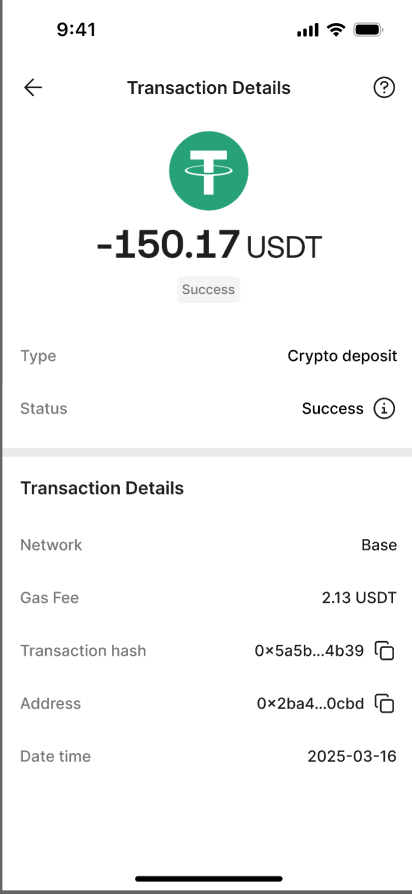
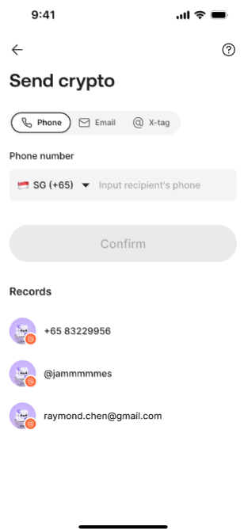
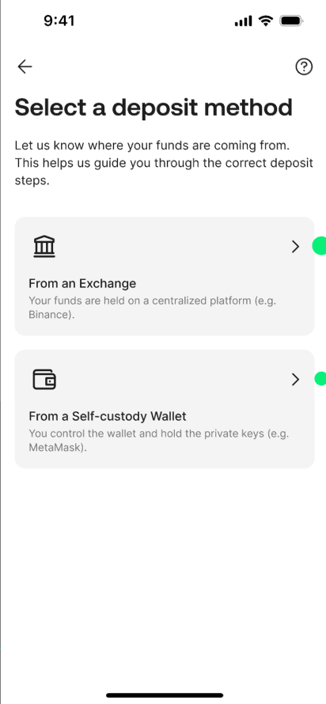
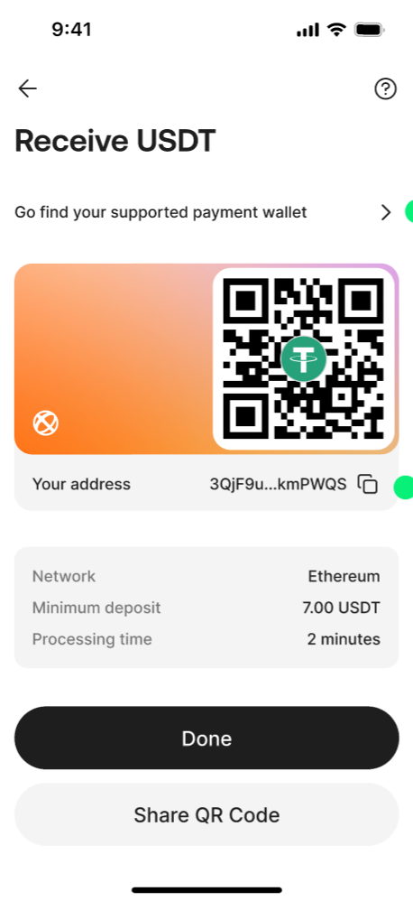
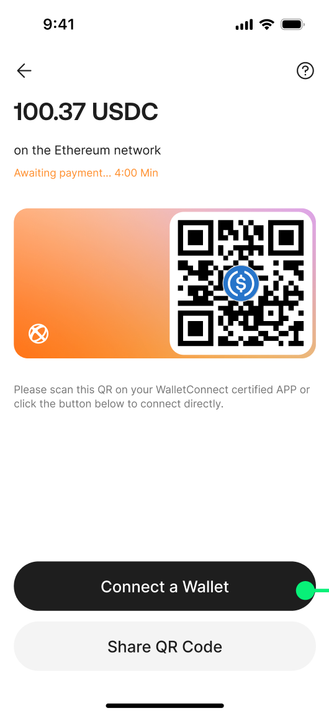

# FAQ 公共问答

## 1. 文档定位

本文沉淀 AIX App 内 FAQ 展示、场景配置、入口、Zendesk Section 和已在 converted-prd 中明确给出的 FAQ 内容。

本文件不再以旧 `reference-data/faq/phase-1-faq.xlsx` 作为主事实来源；本轮以 `archive/legacy-prd/app/faq/README.md` 为准。

## 2. Source alignment status

本文件已按 `archive/legacy-prd/app/faq/README.md` 重写，原 `SOURCE_GAP` 已收口。

需要注意：FAQ PRD 中部分“关联场景 / 类型 / Chat with us”等字段带删除线，这些不沉淀为 confirmed fact。当前 confirmed fact 仅包括：服务端配置展示、最近 3 条 / 仅入口、more / Zendesk Section 链接、首页 3 条 FAQ、申卡虚拟卡 / 实体卡 3 条 FAQ，以及若干场景入口映射。

## 3. 全局规则

| 规则 | 结论 | 来源 |
|---|---|---|
| FAQ 展示来源 | FAQ 由服务端配置文件控制 | FAQ / 3 功能需求 |
| 首页 FAQ | 首页展示最近 3 条 FAQ | FAQ / 首页；Home / FAQ 区域 |
| FAQ 展示形式 | FAQ 默认只展示问题折叠答案，点击任意问题只显示当前这条答案 | Home / FAQ 区域 |
| more 入口 | 链接配置到服务端；没有链接则不显示 `more` 入口 | FAQ / 多处场景配置 |
| Zendesk Section | 不同场景可配置跳转不同 Zendesk Section | FAQ / 3 功能需求 |
| 仅有入口 | 若源文档标“仅有入口”，表示当前页面只展示 FAQ 入口，不沉淀具体 3 条问答 | FAQ / 3 功能需求 |
| 当前类型排序 | 当前类型 FAQ 按时间排序，滑动不翻页 | FAQ / 选择币种等场景 |
| Chat with us | 章节整体为删除线，不作为 confirmed runtime fact | FAQ / 4 Chat with us |
| OBoss 可视化编辑 | “由于没有做 OBoss 可视化编辑……”为删除线内容，不作为 confirmed runtime fact | FAQ / 全局说明 |
| FAQ 数据库字段 | 问题 ID、标题、描述、关联场景、类型、超链接、创建时间等表头为删除线，不沉淀为当前字段模型 | FAQ / 3 功能需求 |

## 4. Zendesk Section 映射

| Section | URL |
|---|---|
| AIX Account Opening & Cards Application | `https://help.aixpay.co/hc/en-gb/sections/15087268806159` |
| Card Delivery & Activation | `https://help.aixpay.co/hc/en-gb/sections/15087280899855` |
| Card Features & Management | `https://help.aixpay.co/hc/en-gb/sections/15087293091215` |
| Security & Support | `https://help.aixpay.co/hc/en-gb/sections/15087277600911` |
| Account & Balance | `https://help.aixpay.co/hc/en-gb/sections/15087278683663` |

## 5. 场景配置矩阵

| 场景 | 类型 / 页面 | 展示规则 | Zendesk Section | 备注 |
|---|---|---|---|---|
| 首页 | AIX 首页 | 最近 3 条；展示三个，服务端配置文件 | AIX Account Opening & Cards Application | 没有链接则不显示 `more` 入口 |
| 申卡 | 选择卡类型-虚拟卡 | 最近 3 条；展示三个，服务端配置文件 | Card Delivery & Activation | 虚拟卡费用 / 激活 / 付费失败 FAQ |
| 申卡 | 选择卡类型-实体卡 | 最近 3 条；展示三个，服务端配置文件 | Card Delivery & Activation | 实体卡费用 / 到达时间 / 地址变更 FAQ |
| 申卡 | 选择币种 | 仅有入口；当前类型按时间排序，滑动不翻页 | Card Delivery & Activation | 没有链接则不显示入口 |
| 卡管 | 卡首页 | 仅有入口 | Card Features & Management | 没有链接则不显示入口 |
| 卡管 | 绑谷歌钱包 | 仅有入口 | Card Features & Management | 没有链接则不显示入口 |
| Update Phone | Update Phone | 仅有入口 | Security & Support | 源文档关联场景 / 类型为删除线，仅保留入口和 Section |
| 交易 | 全量交易 | 仅有入口 | Account & Balance | 没有链接则不显示入口 |
| 交易 | 交易详情 | 仅有入口 | Account & Balance | 没有链接则不显示入口 |
| 交易 | Crypto Send | 仅有入口 | Account & Balance | 没有链接则不显示入口 |
| 交易 | Crypto Swap | 仅有入口 | Account & Balance | 没有链接则不显示入口 |
| Deposit | Deposit method | 仅有入口 | Account & Balance | 没有链接则不显示入口 |
| Deposit | Receive Crypto | 仅有入口 | Account & Balance | 没有链接则不显示入口 |
| Deposit | Deposit Crypto | 仅有入口 | Account & Balance | 没有链接则不显示入口 |

## 6. 首页 3 条 FAQ

### Q1. What types of cards does AIX Pay offer?

AIX Pay offers two card types: a Physical Card for everyday in-store use and a Virtual Card for online and digital payments. Each card has its own unique number and works just like a debit card, letting users spend directly from their stablecoin balance.

Getting started is simple: apply for an AIX Pay card, deposit the preferred stablecoin into the AIX Pay account, and then the user is ready to spend.

Users can also add their card to Google Pay or Apple Pay for tap-to-pay transactions where supported.

### Q2. Who is eligible to open an AIX Pay account?

A user is eligible as long as they can provide a valid passport and a proof of address document that matches their country of residence.

### Q3. How do I apply for a AIX Pay card?

For a Virtual Card:

1. Download the AIX Pay app and create an account.
2. Go to the “AIX Pay Card” tab and tap “Get Card”.
3. Select Virtual Card and choose a design.
4. Link the preferred stablecoin and tap “Apply Card”.
5. Review account details, tap “Checkout”, and pay the USD 5 application fee.
6. The virtual card is ready to use in a few minutes.

For a Physical Card:

1. Download the AIX Pay app and create an account.
2. Go to the “AIX Pay Card” tab and tap “Get Card”.
3. Select Physical Card and choose a design.
4. Link the preferred stablecoin and tap “Apply Card”.
5. Review mailing address, tap “Checkout”, and pay the USD 10 application fee.
6. The physical card can be expected within a few days.

Tips from the source PRD:

- Users can add virtual and physical cards to digital wallets like Google Pay, Apple Pay, or Samsung Pay for tap-to-pay purchases.
- Users should make sure they have enough balance in the card’s default currency.

## 7. 申卡：虚拟卡 FAQ

### Q1. Is there a fee to apply for the card?

Yes. The source PRD states a small application fee of USD 5 for a virtual card. Promotional card fee offers may occasionally apply.

### Q2. How do I activate my card once I receive it?

A virtual card does not need activation. Once the application is approved, it is automatically active and ready to use.

Tip from the source PRD: users can add virtual cards to digital wallets like Google Pay, Apple Pay, or Samsung Pay for tap-to-pay purchases.

### Q3. Why can't I pay the card fee even though I have enough balance?

The card fee can only be paid using the stablecoin that matches the card’s default currency. Payments with other stablecoins are not supported in the source FAQ wording for this question.

The source FAQ suggests:

- top up the stablecoin that matches the card’s default currency; or
- update the card’s default currency to match the stablecoin balance the user wants to use.

## 8. 申卡：实体卡 FAQ

### Q1. Is there a fee to apply for the card?

Yes. The source PRD states a small application fee of USD 10 for a physical card. Promotional card fee offers may occasionally apply.

### Q2. When can I expect my card to arrive?

Delivery time is 3–15 business days. Once the card arrives, the user can activate it and start using it. Delivery may sometimes take longer due to customs, courier delays, or unforeseen circumstances.

### Q3. Can I change the card delivery address once the card has been approved?

Once the card is approved, the delivery address cannot be changed. The user should make sure the details are correct when applying. The courier will attempt delivery three times. If all attempts fail, the card will be destroyed and the user will need to order a new one.

## 9. 与其他模块的边界

| 问题 | 本文件处理 | 事实源 |
|---|---|---|
| 申卡费用 | FAQ 可展示用户解释；实际费用、fee waiver、多币种支付以 Card Application 为准 | `card/application.md` |
| 虚拟卡自动激活 / 实体卡激活 | FAQ 可展示解释；实际激活流程以 Card Manage 为准 | `card/manage/activation.md` |
| Deposit / Send / Swap FAQ 入口 | 本文件记录 FAQ Section 与入口；实际流程以 Wallet 文件为准 | `wallet/deposit.md`、`wallet/send.md`、`wallet/swap.md` |
| 交易详情 FAQ 入口 | 本文件记录 FAQ 入口；实际交易详情以 Transaction 文件为准 | `transaction/detail.md` |
| Google Pay / Apple Pay / Samsung Pay | FAQ 中作为用户解释出现；实际产品支持范围需以 Card Manage / Card Application 当前 confirmed fact 为准 | `card/card-home.md`、`card/application.md` |

## 10. 不写入事实的内容

1. Chat with us 章节为删除线，不作为 confirmed runtime fact。
2. FAQ 数据库字段表头为删除线，不沉淀为当前字段模型。
3. 旧 xlsx FAQ 与 converted FAQ 不一致时，以 converted FAQ 为准。
4. FAQ 文案不能反推业务规则；业务规则以对应模块 PRD 为准。
5. FAQ 中 “Samsung Pay” 只作为原 FAQ 文案保留，不代表当前钱包支持范围已确认。

## 11. Sources

- (Ref: archive/legacy-prd/app/faq/README.md / 3 功能需求)
- (Ref: archive/legacy-prd/app/faq/README.md / 4 Chat with us，删除线)
- (Ref: archive/legacy-prd/app/home/README.md / FAQ 首页展示)

## Page Visuals 页面图索引

> 本节绑定 converted-prd 中与本文件页面规则相关的页面截图 / 页面组图片，方便查看规则时同步查看页面长什么样。图片仍引用 `archive/legacy-prd` 原始资产，避免重复复制。

### 3. 功能需求

_Source: archive/legacy-prd/app/faq/README.md:91_

_Source: archive/legacy-prd/app/faq/README.md:92_

_Source: archive/legacy-prd/app/faq/README.md:142_

### Virtual Card

_Source: archive/legacy-prd/app/faq/README.md:175_

### Physical Card

_Source: archive/legacy-prd/app/faq/README.md:209_

_Source: archive/legacy-prd/app/faq/README.md:211_

_Source: archive/legacy-prd/app/faq/README.md:212_

### Select Crypto

_Source: archive/legacy-prd/app/faq/README.md:231_

_Source: archive/legacy-prd/app/faq/README.md:232_

### Card home

_Source: archive/legacy-prd/app/faq/README.md:251_

_Source: archive/legacy-prd/app/faq/README.md:252_

### Bind Google Wallet

_Source: archive/legacy-prd/app/faq/README.md:272_

_Source: archive/legacy-prd/app/faq/README.md:273_

### Update Phone

_Source: archive/legacy-prd/app/faq/README.md:291_

_Source: archive/legacy-prd/app/faq/README.md:292_

### All Transactions

_Source: archive/legacy-prd/app/faq/README.md:310_

_Source: archive/legacy-prd/app/faq/README.md:311_

### Transaction Details

_Source: archive/legacy-prd/app/faq/README.md:329_

_Source: archive/legacy-prd/app/faq/README.md:330_

### Crypto Send

_Source: archive/legacy-prd/app/faq/README.md:348_

_Source: archive/legacy-prd/app/faq/README.md:349_

### Crypto Swap

_Source: archive/legacy-prd/app/faq/README.md:367_

_Source: archive/legacy-prd/app/faq/README.md:368_

### Deposit method

_Source: archive/legacy-prd/app/faq/README.md:387_

_Source: archive/legacy-prd/app/faq/README.md:388_

### Receive Crypto

_Source: archive/legacy-prd/app/faq/README.md:406_
