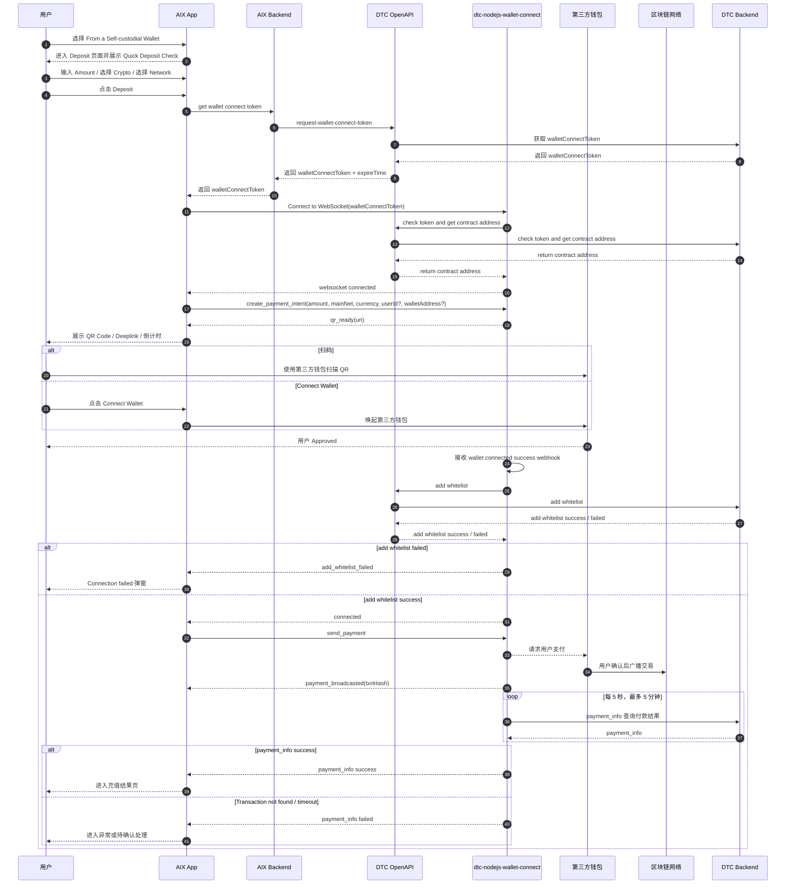

# WalletConnect Integration 公共集成边界

## 1. 功能定位

WalletConnect Integration 用于沉淀 AIX WalletConnect 充值相关的公共集成边界，包括 WalletConnect token、WebSocket、create_payment_intent、qr_ready、connected、自动加白、send_payment、payment_broadcasted、payment_info 和异常事件。

本文只记录影响 AIX 页面、状态、按钮、异常处理和用户路径的集成事实，不维护 DTC WalletConnect 的完整 SDK 文档或供应商内部实现。

所有未确认问题统一引用 `knowledge-base/changelog/knowledge-gaps.md` 的 ALL-GAP 编号；本文不维护独立 checklist / gaps。

## 2. 当前已确认事实

| 项目 | 结论 | 来源 | 备注 |
|---|---|---|---|
| WalletConnect 当前归属 | Wallet Deposit 子路径 | Wallet Deposit v1.6 | 不属于 Send / Swap |
| 充值方式 | `From a Self-custodial Wallet` | AIX Wallet PRD / 6.4 | 适用于用户自己掌握私钥的钱包 |
| 页面主链路 | Deposit → Deposit confirmation → Result | AIX Wallet PRD / 6.4.5 | 与 GTR 地址充值不同 |
| Token | 进入 Deposit 页面获取 walletConnectToken | AIX Wallet PRD / 6.4.5；DTC / 1.2 | token response 包含 expireTime |
| WebSocket | 使用 walletConnectToken 连接 WalletConnect WebSocket | AIX Wallet PRD / 6.4.5；DTC / 2 | 使用 socket.io |
| create_payment_intent | 创建支付意图；传 amount 时为支付 / top-up；不传 amount 时仅连接并加白 | DTC / 4.1 | AIX Deposit 场景传 amount |
| qr_ready | create_payment_intent 后返回 uri | DTC / 3.2.3 | 用于生成 QR / deeplink |
| connected | 用户连接成功，且 add whitelist 成功后返回 | DTC / 3.2.4；5 | 下一步 send_payment |
| add whitelist | 用户 Approved 后，DTC 自动 add whitelist | AIX Wallet PRD / 6.4.5；DTC / 5 | WalletConnect 核心逻辑 |
| send_payment | connected 后 AIX emit send_payment | DTC / 4.2 | 无需 data |
| payment_broadcasted | 交易已提交到区块链，返回 txnHash | DTC / 3.2.5 | 代表链上广播，不等同最终到账 |
| payment_info | payment_broadcasted 后每 5 秒检查一次，最多 5 分钟 | DTC / 3.2.1 | success 后 WebSocket disconnect；后续异常见 ALL-GAP-012 |
| 自动断开 | 多类错误事件会导致 WebSocket 自动断开 | DTC / 3.3 | 见异常表 |

## 3. WalletConnect 主流程时序图

## 4. 页面与交互边界

| 节点 | 已确认规则 | 来源 |
|---|---|---|
| Deposit 页面 | 进入页面调用 get wallet connect token，并连接 WebSocket | AIX Wallet PRD / 6.4.5 |
| Quick Deposit Check | 设备维度弹窗，提示链、币种和 Gas | AIX Wallet PRD / 6.4.5 |
| Amount | 必填，最小值 ≥ 0.01，最大值按币种配置 | AIX Wallet PRD / 6.4.5 |
| Crypto | USDT、USDC、WUSD、FDUSD；默认 USDC | AIX Wallet PRD / 6.4.5 |
| Network | 按币种筛选；默认 BSC；币种不支持 BSC 时默认 ETH | AIX Wallet PRD / 6.4.5 |
| Deposit confirmation | create_payment_intent 后生成 QR / deeplink | AIX Wallet PRD / 6.4.5；DTC / 3.2.3 |
| Connect Wallet | 无可用钱包时提示 `No wallets available. Please install a supported wallet app.` | AIX Wallet PRD / 6.4.5 |
| Complete Payment | 已授权未付款回到 AIX，按钮从 `Connect a Wallet` 更新为 `Complete Payment` | AIX Wallet PRD / 6.4.5 |
| iOS | 默认唤起支持 WC 的第一个已安装 App | AIX Wallet PRD / 6.4.5 |
| Android | Native 唤起系统应用选择器 | AIX Wallet PRD / 6.4.5 |

## 5. 白名单与授权边界

| 规则 | 已确认事实 | 来源 | 边界 |
|---|---|---|---|
| Deeplink 有效期 | 5 分钟 | AIX Wallet PRD / 6.4 知识点 | UI 倒计时为 `Awaiting payment... 4:00 Min` 可配置 |
| WalletConnect 授权有效期 | AIX 对客按 1 天 | AIX Wallet PRD / 6.4 知识点；用户确认 2026-05-02 | 不再作为待确认项 |
| userId + walletAddress 免重新连接 | DTC 文档存在 7 天内不需要再次连接钱包的内部逻辑 | DTC / 4.1；用户确认 2026-05-02 | 用户确认 DTC 7 天为内部逻辑，不作为 AIX 对客有效期 |
| 自动加白 | Approved 后 DTC 自动 add whitelist | AIX Wallet PRD / 6.4.5；DTC / 5 | WalletConnect 与 GTR 的关键差异 |
| add whitelist 成功 | 返回 connected，下一步 send_payment | DTC / 3.2.4；5 | connected 不等同付款完成 |
| add whitelist 失败 | 返回 add_whitelist_failed，WebSocket 自动断开 | DTC / 3.2.13；3.3 | AIX 弹窗提示连接失败；是否告警见 ALL-GAP-013 |

## 6. 异常事件与页面处理

| 分组 | 事件 | 页面处理 | 来源 |
|---|---|---|---|
| Token | `invalid_auth_credentials` | 自动重取 token；超过上限进入授权失败 | AIX Wallet PRD / 6.4.5；DTC / 3.2.11 |
| 下单 | `create_payment_error`、`invalid_arguments` | 下单失败页，可重试 | AIX Wallet PRD / 6.4.5；DTC / 3.2.12、3.2.14 |
| 连接 / 授权 | `connection_failed`、`connection_rejected`、`disconnected`、`send_connect_request_error` | 授权失败页，不可重试 | AIX Wallet PRD / 6.4.5；DTC / 3.2.8-3.2.10、3.2.15 |
| 白名单 | `add_whitelist_failed` | 自动断开 WebSocket，提示 Connection failed | AIX Wallet PRD / 6.4.5；DTC / 3.2.13、3.3 |
| 支付 | `request_payment_error`、`payment_rejected`、`payment_failed` | 充值失败结果页，用户不可重试 | AIX Wallet PRD / 6.4.5；DTC / 3.2.2、3.2.6、3.2.7 |
| 支付后长连接断开 | send_payment 后长连接断开 | Payment Confirmation 页 | AIX Wallet PRD / 6.4.5 |
| 付款结果查询 | `payment_info` false / Transaction not found | 待异常处理 | DTC / 3.2.1；见 ALL-GAP-012 |

## 7. 结果状态边界

| 条件 | AIX 展示 | 操作 | 来源 |
|---|---|---|---|
| `success=true` + `Completed` | `Deposit successful!` | `View Order Details` | AIX Wallet PRD / 6.4.5 |
| `success=true` + `PENDING / PROCESSING / AUTHORIZED` | `Deposit progressing` | `View Order Details` | AIX Wallet PRD / 6.4.5 |
| `success=false` | `Deposit failed` | `Back to Wallet` | AIX Wallet PRD / 6.4.5 |
| `REJECTED / CLOSED` | `Deposit failed` | `Back to Wallet` | AIX Wallet PRD / 6.4.5 |

Risk Withheld 是异步返回，不触发充值结果页；用户查询交易详情时状态为 under review。该结论来自用户确认，后续与 Wallet `state` / 余额关系仍见 ALL-GAP-008。

## 8. 与 GTR 的差异

| 维度 | WalletConnect | GTR / Exchange |
|---|---|---|
| 钱包类型 | 自托管钱包 | 托管钱包 / 交易所 |
| 入口 | From a Self-custodial Wallet | From an Exchange |
| 地址 / 支付生成 | create_payment_intent → qr_ready / deeplink | Get Deposit Address |
| 白名单 | Approved 后自动 add whitelist | 不校验地址白名单 |
| 金额 | Deposit 页面输入 amount | 地址充值页主要选择币种 / 网络 / 地址 |
| 结果页 | PRD 明确 success / progressing / failed；Risk Withheld 不触发结果页 | PRD 未像 WC 一样明确结果页 |

## 9. 不写入事实的内容

以下内容不得写成事实：

1. WalletConnect 等同 `CRYPTO_DEPOSIT=10`。
2. WalletConnect 入金成功一定立即增加可用余额。
3. payment_info success 等同 Wallet `COMPLETED`。
4. WalletConnect 的 `transactionId`、`id`、`relatedId` 关联规则已确认。
5. DTC 的 7 天免连接内部逻辑是 AIX 对客授权有效期。
6. WalletConnect 与 GTR 使用同一套错误码和结果页。
7. WalletConnect 属于 Send 或 Swap。

## 10. ALL-GAP 引用

本文不维护独立待确认表。WalletConnect 相关不确定项统一引用 ALL-GAP：

| 编号 | 主题 |
|---|---|
| ALL-GAP-002 | WalletConnect 是否使用 `CRYPTO_DEPOSIT=10` |
| ALL-GAP-007 | `relatedId / transactionId / id` 如何串联 GTR / WalletConnect 入金 |
| ALL-GAP-008 | Risk Withheld 与 Wallet `state` / 余额关系 |
| ALL-GAP-012 | WalletConnect `payment_info false / Transaction not found` 的后续处理 |
| ALL-GAP-013 | WalletConnect 失败是否需要告警 |
| ALL-GAP-014 | Wallet `relatedId` 在 Card / GTR / WC 场景取值 |
| ALL-GAP-016 | Deposit success 与 Wallet `state=COMPLETED` 的映射 |
| ALL-GAP-044 | WalletConnect Declare / Travel Rule / 白名单规则边界 |

## 11. 来源引用

- (Ref: 历史prd/AIX Wallet V1.0【Deposit & Send & Swap 】.docx / 6.4 钱包链接充值 Deposit（WalletConnect）)
- (Ref: 历史prd/AIX Wallet V1.0【Deposit & Send & Swap 】.docx / 7.4 钱包充值 Wallet Connect)
- (Ref: DTC接口文档/Documentation dtc-nodejs-wallet-connect (ARCHIVE).docx / 1 Request Wallet Connect Token)
- (Ref: DTC接口文档/Documentation dtc-nodejs-wallet-connect (ARCHIVE).docx / 3 Server-Emitted Events)
- (Ref: DTC接口文档/Documentation dtc-nodejs-wallet-connect (ARCHIVE).docx / 4 Client-Emitted Events)
- (Ref: DTC接口文档/Documentation dtc-nodejs-wallet-connect (ARCHIVE).docx / 5 sequence diagram)
- (Ref: knowledge-base/wallet/deposit.md / v1.6)
- (Ref: knowledge-base/changelog/knowledge-gaps.md / ALL-GAP 总表)
- (Ref: 用户确认结论 / 2026-05-02 / WalletConnect 授权有效期、Risk Withheld 结果页边界)
