# App Home 首页

## 1. 文档定位

本文是 AIX App 首页的运行态事实源，用于承接 App 内首页整体结构、模块入口、首页卡片、首页区块、展示条件和跨模块跳转边界。

本文不承接官网首页、Web Marketing 页面、外部投放落地页、OBoss 后台首页，也不维护 Popup / Banner 运营配置系统的完整后台能力；首页只记录它们在 App Home 的展示入口或承接边界。

## 2. Source alignment status

本文件已按 `archive/legacy-prd/app/home/README.md` 做 Evidence → KB 反向补齐。此前 Home KB 只保留边界，缺少源 PRD 中的首页钱包状态、申卡入口、卡片展示、FAQ、核心交易操作等 runtime 规则；本版已补入。

## 3. 首页整体能力

| 首页能力 | Home 负责内容 | 具体业务事实源 |
|---|---|---|
| 钱包区域 | 首页钱包状态面板、KYC 状态对应展示、资产入口、刷新规则 | `wallet/`、`kyc/` |
| 申卡入口 | 首页申卡入口是否展示、可点击、置灰、跳转 | `card/application.md` |
| 卡片展示 | 首页展示哪些卡、展示顺序、点击跳转 | `card/card-home.md`、`card/manage/` |
| Banner / Popup | 首页展示位和边界 | `common/popup-banner` 或后续运营配置文档 |
| FAQ / Help | 首页 FAQ 展示规则、more 入口边界 | `common/faq.md` |
| 核心交易操作 | Deposit / Swap / Send / Transaction 四个首页快捷入口 | `wallet/`、`transaction/` |
| 全局刷新 | 下拉刷新和局部静默刷新 | Home 维护触发条件；业务数据来源由各模块维护 |

## 4. 刷新规则

| 场景 | 行为 | 来源 |
|---|---|---|
| 用户手动下拉首页 | 全局刷新，获取最新钱包状态、卡状态和钱包资产余额 | Home / 6.1.4 |
| KYC 结果页返回首页 | 钱包区域局部静默刷新，获取最新钱包状态 | Home / 钱包区域 |
| 钱包审核中用户进入首页 | 钱包区域局部静默刷新，获取最新钱包状态 | Home / 钱包区域 |
| 卡状态存在审核中或待激活 | 卡片区域局部静默刷新，获取最新卡状态 | Home / 当前卡片展示逻辑 |

## 5. Waitlist 面板

| 规则 | 说明 |
|---|---|
| App 渠道 Waitlist 用户 | 首页可展示 Waitlist 面板 |
| 钱包操作限制 | 这类用户无法操作申请开通钱包 |
| 范围边界 | Waitlist 外部投放和官网 waitlist 不进入 Home runtime KB；只记录 App Home 面板展示边界 |

## 6. 钱包区域展示规则

Home 读取最近一笔钱包开通记录判断钱包区域展示。

| 钱包 / KYC 状态 | 首页展示 | 主要规则 |
|---|---|---|
| 无开户记录 / KYC Pending | 显示未申请开通钱包面板 | KYC 为空即无开户记录时不显示 Pending Tips；用户可点击 `Activate wallet` 进入钱包开通页面 |
| Under Review | 显示开通钱包审核中面板 | 进度展示为 `3 Steps Finished`；进入首页时局部静默刷新钱包状态 |
| Failed | 显示开通钱包审核失败面板 | passport / face / POA 失败时展示对应前端提示；任一验证项失败可点击 `Reactivate Now` 重新开户 |
| Rejected | 显示开通钱包审核拒绝面板 | 因高风险规则被拒绝的用户会被拦截开户，隐藏激活钱包入口 |
| Approved | 显示开通钱包审核通过 / 资产面板 | 获取全量钱包余额并展示稳定币资产；点击 `>` 进入 Wallet 首页 |

### 6.1 Approved 状态资产展示

| 项目 | 规则 |
|---|---|
| 余额来源 | 后端调用 `[GET] /openapi/v1/wallet/balances` 获取全量币种钱包账户余额 |
| 稳定币筛选 | 首页筛选并展示 USDC、USDT、WUSD、FDUSD |
| 总资产估算 | `USDT余额*Rate1 + USDC余额*Rate2 + WUSD余额*Rate3 + FDUSD余额*Rate4`，试算结果四舍五入并保留 2 位小数 |
| 币种排序 | 按 USDC、USDT、WUSD、FDUSD 固定排序；暂不按余额降序；后端可配置展示币种 |
| 单币种点击 | MVP 不做单币种首页，点击单个币种跳转逻辑先去掉 |
| 提现入口 | 暂不支持钱包提现，入口隐藏，由用户联系 CS 处理 |

## 7. 申卡入口展示规则

首页申卡入口仅在钱包已开通且审核通过时展示，即 KYC 状态为 Approved。

卡数量计算口径：待激活、已激活、审核中、已冻结之和。限制为 5 张，可配置。

| 条件 | 首页申卡入口 |
|---|---|
| 卡数量 ≥ 5 | 不显示申卡入口 |
| 卡数量 < 5 且存在审核中卡 | 申卡入口置灰不可点击 |
| 卡数量 < 5 且无审核中卡 | 申卡入口高亮可点击 |

### 7.1 Banner 申卡入口

| 条件 | 行为 |
|---|---|
| 待激活 + 已激活 + 审核中 + 已冻结之和 X < 5，且无审核中卡 | 显示 Banner 入口 |
| 点击 `Apply Now` | 校验用户是否首次申卡 |
| 首次申卡 | 跳转新用户选择卡片页面 `Select plan` |
| 非首次申卡 | 跳转老用户选择卡片页面 `Pick your card` |

### 7.2 卡片申卡入口

| 条件 | 行为 |
|---|---|
| X = 0，即未申请或申请失败 | 显示卡片入口 |
| 点击 `Get card` | 校验用户是否首次申卡 |
| 首次申卡 | 跳转 `Select plan` |
| 非首次申卡 | 跳转 `Pick your card` |

### 7.3 常驻申卡入口

| 条件 | 行为 |
|---|---|
| 1 ≤ X < 5 且无审核中卡 | 显示可点击申卡入口 |
| 点击高亮 `⊕` | 直接跳转老用户选择卡片页面 `Pick your card` |
| 1 ≤ X < 5 且有审核中卡 | 显示不可点击申卡入口 |

## 8. 首页卡片展示规则

| 卡状态 | 首页展示 / 点击 |
|---|---|
| Processing / 审核中 | 显示该卡片；点击跳转当前卡片审核中页面 `My Card` |
| Pending activation / 待激活 | 显示该卡片；点击跳转当前卡片待激活页面 `My Card` |
| Active 且未设置 PIN | 显示该卡片；点击跳转当前卡片首页 `My Card` |
| Active 且已设置 PIN | 显示该卡片；点击跳转当前卡片首页 `Card` |
| Frozen / 已冻结 | 显示该卡片；点击跳转当前卡片首页 `Card` |

卡片展示字段：Card Type 可为 Virtual Card、Physical Card；Card Number 显示脱敏卡号后四位；审核中无卡号时显示 `······`。

### 8.1 多张卡展示

| 条件 | 展示 |
|---|---|
| 用户有多张卡，且卡数量 < 5 | 按申请时间降序展示所有卡片，最右侧显示申卡入口 `+` |
| 用户有多张卡，且卡数量 = 5 | 按申请时间降序展示所有卡片，屏蔽申卡入口 `+` |

## 9. FAQ / Help 规则

| 项目 | 规则 |
|---|---|
| 首页 FAQ 展示 | FAQ 默认只显示问题折叠答案，点击任意一个问题只显示当前这条答案 |
| FAQ 来源 | FAQ 配置来自 `archive/legacy-prd/app/faq/README.md`，业务人员提供常见 QA list |
| `more>` 入口 | 点击 `more>` 可查看更多 FAQ，跳转 Zendesk 链接 |
| `more>` 显示条件 | 链接由服务端配置；没有链接则不显示 `more` 入口 |
| Chat with us | converted-prd 中 `Chat with us` 章节为删除线，不沉淀为 confirmed runtime fact |

## 10. 核心交易操作入口

已完成开通钱包的用户才显示核心交易操作入口。

| 入口 | 首页点击后跳转 |
|---|---|
| Deposit | 进入充值的选择钱包页 `Select Wallet` |
| Swap | 进入兑换页 `Swap` |
| Send | 进入钱包转账页 `Send` |
| Transaction | 进入全量交易页 `Transaction` |

具体充值、兑换、转账、交易记录规则由 `wallet/` 和 `transaction/` 维护。

## 11. Banner / Popup 边界

| 项目 | Home 处理 |
|---|---|
| 首页固定 Banner | Home 记录存在首页固定 Banner 展示位；具体运营配置由 Popup / Banner 需求维护 |
| 首页弹窗 | Home 记录存在首页弹窗承接位；具体配置、触发、人群、频控由 Popup / Banner 需求维护 |
| MGM / 外部投放 | 不从 Home 推导 MGM 或外部投放事实 |

## 12. 不得推导的内容

1. 不得把 App Home 等同官网 Home。
2. 不得把首页 Card 区块等同 Card 模块完整首页。
3. 不得在 Home 中维护 Card 管理全量状态矩阵、PIN、敏感信息、卡交易详情。
4. 不得在 Home 中维护 Wallet Deposit / Send / Swap 的完整流程。
5. 不得把 Popup / Banner / MGM 运营配置能力写入 Home；Home 只记录首页承接位。
6. 不得把删除线内容沉淀为 confirmed fact。

## 13. Sources

- (Ref: archive/legacy-prd/app/home/README.md / 6.1 AIX Home)
- (Ref: archive/legacy-prd/app/faq/README.md / FAQ 首页展示与 Zendesk more 规则)
- (Ref: archive/legacy-prd/common/popup-banner/README.md / 首页 Banner / Popup 配置能力，待后续 common 审计)

## Page Visuals 页面图索引

> 本节绑定 converted-prd 中与本文件页面规则相关的页面截图 / 页面组图片，方便查看规则时同步查看页面长什么样。图片仍引用 `archive/legacy-prd` 原始资产，避免重复复制。

### 4. 整体流程

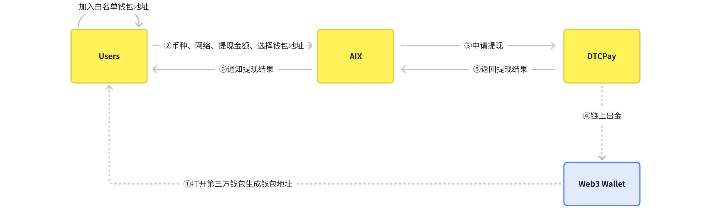

_Source: archive/legacy-prd/app/home/README.md:167_

_Source: archive/legacy-prd/app/home/README.md:171_

_Source: archive/legacy-prd/app/home/README.md:175_

### Set Pin

_Source: archive/legacy-prd/app/home/README.md:205_

### 申卡入口

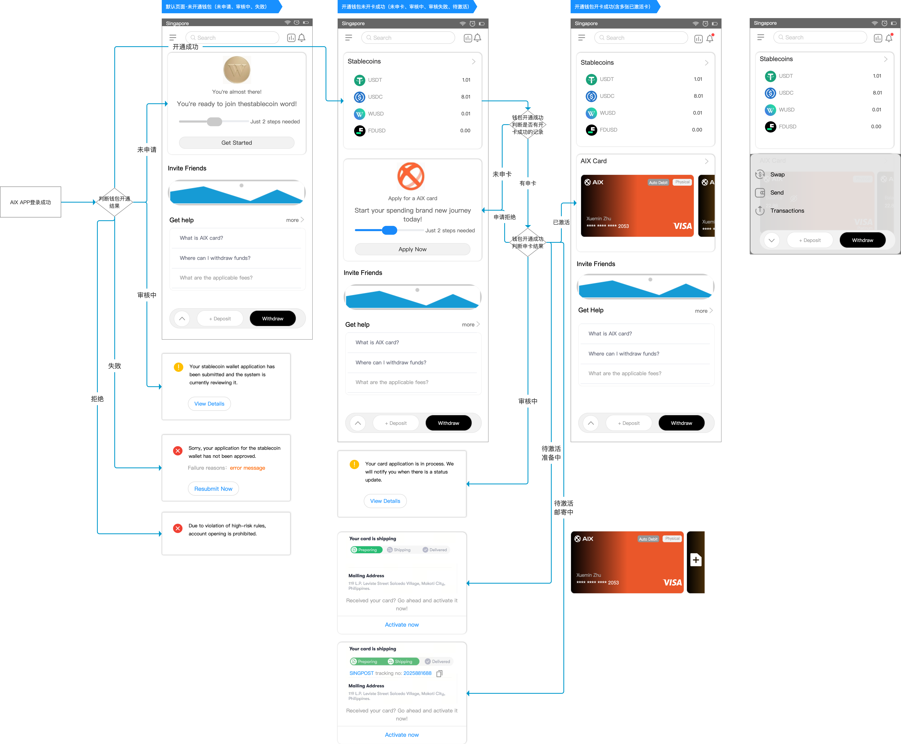

_Source: archive/legacy-prd/app/home/README.md:260_

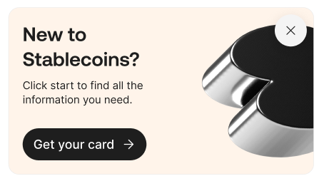

_Source: archive/legacy-prd/app/home/README.md:397_

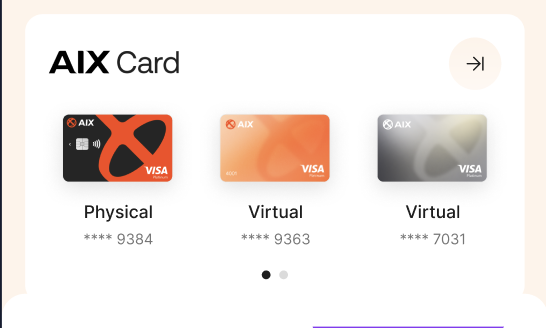

_Source: archive/legacy-prd/app/home/README.md:408_

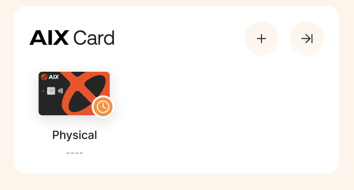

_Source: archive/legacy-prd/app/home/README.md:439_

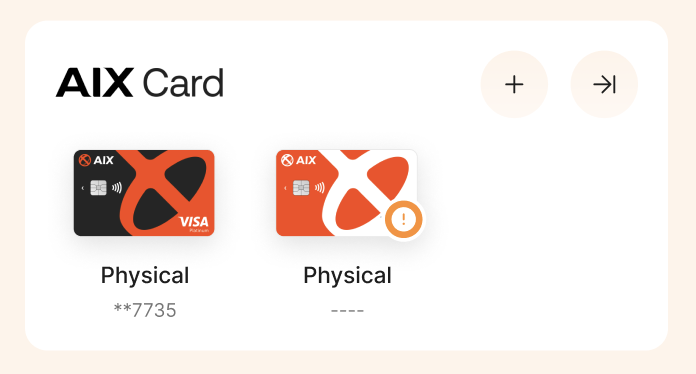

_Source: archive/legacy-prd/app/home/README.md:441_

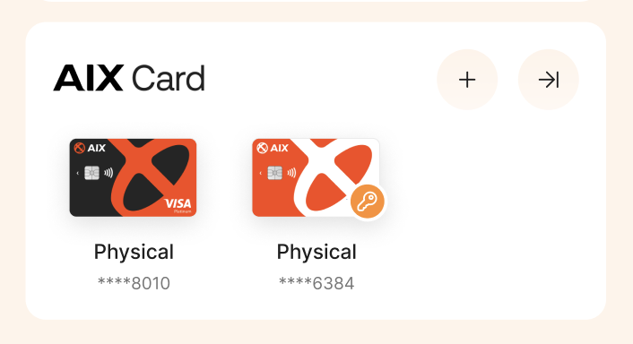

_Source: archive/legacy-prd/app/home/README.md:443_

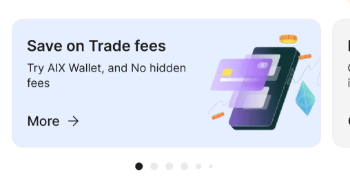

_Source: archive/legacy-prd/app/home/README.md:471_

_Source: archive/legacy-prd/app/home/README.md:477_

### 未申请开通钱包

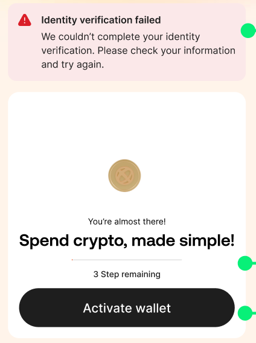

_Source: archive/legacy-prd/app/home/README.md:321_

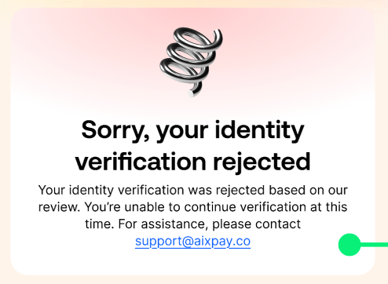

_Source: archive/legacy-prd/app/home/README.md:323_

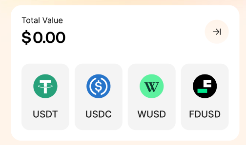

_Source: archive/legacy-prd/app/home/README.md:325_

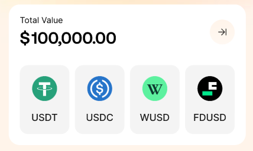

_Source: archive/legacy-prd/app/home/README.md:326_

### 当前卡片展示

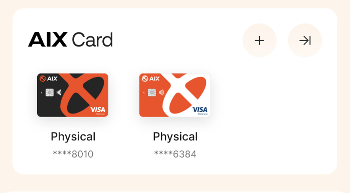

_Source: archive/legacy-prd/app/home/README.md:445_

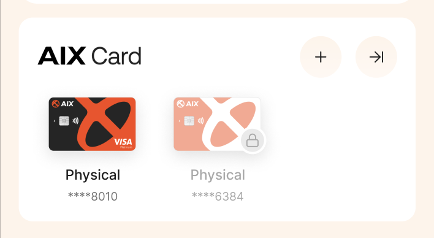

_Source: archive/legacy-prd/app/home/README.md:447_

### Select Wallet

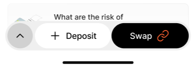

_Source: archive/legacy-prd/app/home/README.md:512_

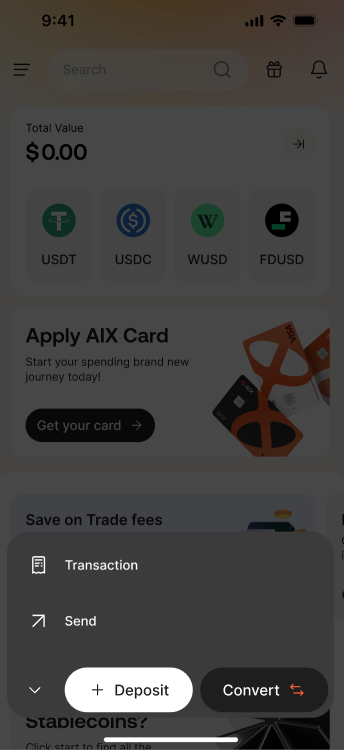

_Source: archive/legacy-prd/app/home/README.md:513_

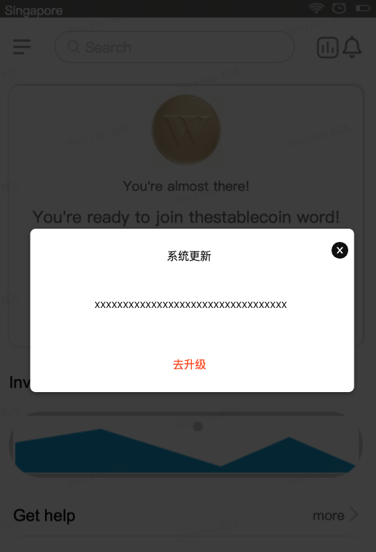

_Source: archive/legacy-prd/app/home/README.md:528_
