# Account Opening / KYC 开户与身份认证准入 PRD

> Source alignment note: 本文件已按 `archive/converted-prd/kyc/wallet-opening/README.md` 做双向覆盖校验，并同步核对 Home 钱包面板、Card Application 申卡前置和 Security 身份认证支撑证据。


## 1. 文档信息

| 项目 | 内容 |
|---|---|
| 功能名称 | Account Opening / KYC 开户与身份认证准入 |
| 所属模块 | KYC |
| Owner | 吴忆锋 |
| 版本 | 1.2 |
| 状态 | Review |
| 更新时间 | 2026-05-04 |
| 来源文档 | AIX WALLET 钱包开户KYC需求V1.0；Master sub account 设计方案；DTC Wallet OpenAPI Document20260126（本轮未核验）；KYC 知识库评审意见；标准 PRD 模板 |
| 适用读者 | Product / UI / Dev / QA / Business / AI |
| 文档定位 | 本文既作为 KYC 运行时事实源，也按标准 PRD 模板沉淀产品范围、流程、页面、接口、异常、待确认事项、验收标准与测试场景。 |

---

## 2. 需求背景、目标与范围

> 页面图：截图已复制到 `_assets/account-opening/`，阅读页面规则时可直接看到页面样式。
> 功能结构与账户结构图。


### 2.1 需求背景

AIX 钱包开户需要完成用户身份认证、居住国家判断、协议确认、证件识别、人脸验证、地址证明上传及后续审核，以满足合规准入、账户创建和后续钱包能力开通的基础要求。

KYC 能力不是单一 Wallet 页面能力，而是影响 Account、Wallet、Deposit、WalletConnect、Receive、Notification、外部 DTC 账户体系以及 AAI 身份验证链路的基础准入能力。

### 2.2 用户问题 / 业务问题

| 问题类型 | 当前问题 |
|---|---|
| 用户问题 | 用户需要知道是否可以开户、如何完成身份认证、失败后如何重试、被 waitlist 或锁定时如何处理。 |
| 业务问题 | AIX 需要基于国家线、KYC 状态、外部身份认证结果控制用户能否继续开户及后续钱包能力。 |
| 合规问题 | KYC 需要保存协议同意时间、Reverse Solicitation Declaration 内容与快照，并根据国家配置传递 DTC 反向招揽参数。 |
| 系统问题 | KYC 依赖 AIX App / Backend、DTC、AAI、KUN 等多方系统，需要明确状态、接口、webhook、错误码和责任边界。 |
| QA 问题 | KYC 涉及多页面、多状态、多异常、多外部依赖，必须提供验收标准和测试场景矩阵。 |

### 2.3 需求目标

1. 建立 AIX 钱包开户 / KYC 的标准产品流程。
2. 明确 KYC 主流程、分支、异常、锁定、waitlist、POA 和提交审核规则。
3. 明确 AIX 页面状态、DTC `clientStatus`、DTC `EKycFileVerifyStatus` 的边界。
4. 明确 DTC / AAI 相关接口、webhook、字段和错误码映射。
5. 明确权限、合规、风控、通知、数据保存和待确认事项。
6. 提供 QA 可验收的验收标准和测试场景矩阵。
7. 防止 AI 或后续文档错误推导 Wallet / Card / Sub Account / Notification 等跨模块事实。

### 2.4 涉及功能清单

| 功能点 | 本期范围 | 优先级 | 状态 | 说明 |
|---|---|---|---|---|
| KYC Loading 状态分流 | In Scope | P0 | Confirmed | 根据 KYC 状态、waitlist、异常和超时分流。 |
| KYC Start | In Scope | P0 | Confirmed | 展示认证入口、居住国家、协议和立即认证按钮。 |
| Select Residence Country | In Scope | P0 | Confirmed / Open | 国家线存在版本口径冲突，见 GAP-KYC-COUNTRY-001。 |
| Waitlist | In Scope | P0 | Confirmed | waitlist 为页面级拦截，提交后用户无法继续 KYC。 |
| 协议与 Reverse Solicitation | In Scope | P0 | Confirmed | 保存同意时间、协议内容、快照，并影响 DTC 入参。 |
| Identity Verify / Passport OCR | In Scope | P0 | Confirmed | 调用外部 H5 完成护照扫描。 |
| Face Guide / Face Scan / Face Loading | In Scope | P0 | Confirmed | 包含活体采集、人脸比对、锁定、超时和失败处理。 |
| Address Upload / POA | In Scope | P0 | Confirmed / Open | 文件上传、国家二次判断、POA 审核；有效期和跳转冲突见 Gap。 |
| KYC Submission Success | In Scope | P1 | Confirmed | 提交成功后关闭当前 KYC 流程并返回入口。 |
| DTC KYC API / webhook | In Scope | P0 | Confirmed | 包含 URL、结果查询、webhook、OCR info、POA upload。 |
| 错误码映射 | In Scope | P0 | Confirmed / Open | PRD 已有映射；部分 DTC 原始码差异见 Gap。 |
| DTC Sub Account 创建边界 | In Scope | P1 | Confirmed / Open | 设计流程包含 POA success 后 create sub account；等价关系待确认。 |
| KYC 通知 | Deferred | P1 | Open | 历史记录存在通知规则，本轮附件未完整核验模板。 |
| Wallet / Deposit / WalletConnect 准入 | Deferred | P1 | Open | 只记录依赖边界，不在本文补完整钱包规则。 |
| Card KYC 复用关系 | Out of Scope | P2 | Open | 是否复用 Wallet / Account Opening KYC 未确认。 |
| Send / Swap | Out of Scope | P2 | Deferred | 当前不纳入 active KYC 准入范围。 |

---

## 3. 业务流程与规则

> 页面图：截图已复制到 `_assets/account-opening/`，阅读页面规则时可直接看到页面样式。
> 开户业务流程总图。


### 3.1 业务主流程说明

KYC 主流程按业务阶段可归纳为：

```text
准入状态判断
→ 居住国家与协议确认
→ 证件认证
→ 人脸验证
→ 地址证明上传
→ 提交审核
→ 结果通知 / 入口状态感知
```

页面路径为：

```text
KYC Loading
→ KYC Start
→ Select Residence Country
→ Agreement
→ Identity Verify
→ Identity Scan
→ Face Guide
→ Face Scan
→ Face Loading
→ Address Upload
→ KYC Submission Success
```

关键分支包括：waitlist、Verification unavailable、Network Error、Server Error、Loading Failed、Face Failed、POA 错误、DTC API 错误、国家线冲突和外部状态延迟。

### 3.2 业务时序图

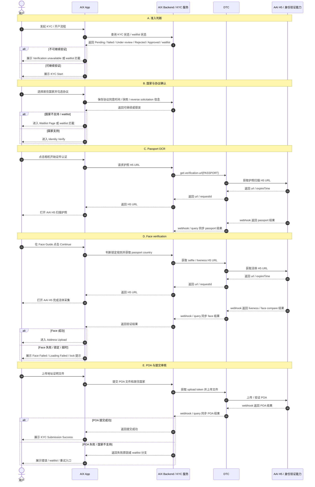

### 3.3 流程步骤与业务规则

| 步骤 | 场景 / 规则 | 触发条件 | 责任方 | 系统处理 | 成功结果 | 失败 / 分支结果 | 来源 |
|---|---|---|---|---|---|---|---|
| 1 | KYC Loading 状态判断 | 用户进入 KYC | App / Backend | 查询 KYC 状态和 waitlist 状态 | Pending / failed 进入后续流程 | Under review / Rejected / Approved / APP 来源 waitlist 展示状态 2；网络 / 系统 / 超时走错误页 | AIX KYC PRD 7.2.2 |
| 2 | KYC Start | 状态允许继续 KYC | App | 展示标题、副标题、居住国家、协议、认证按钮 | 用户可选择国家和勾选协议 | 手机号未绑定处理待确认 | AIX KYC PRD 7.2.3 |
| 3 | 国家选择 | 用户点击居住国家 | App / Backend / 配置 | 展示国家列表、搜索、排序、Type 判断 | Phase 1 国家可继续 | phase 2-waitlist 进入 waitlist；Forbiden 隐藏 | AIX KYC PRD 7.2.3.1 |
| 4 | 协议确认 | 用户勾选协议 | App / Backend | 保存同意时间、Declaration 内容和快照 | 按钮可点击，继续 Identity Verify | 获取协议失败 toast；Reverse Solicitation 缺失可触发 DTC 50013 | AIX KYC PRD 7.2.3；Master sub account |
| 5 | Waitlist | 国家不支持或用户被识别为 waitlist | App / Backend | 校验 email，按 userId 加入 waitlist，记录邮箱、国家、来源、设备指纹等 | 返回流程入口，用户无法继续申请 KYC | email 非空 / 格式 / 网络 / 服务器错误 | AIX KYC PRD 7.2.3.2 |
| 6 | Identity Verify | 用户点击相机 | App / Backend / DTC | 判断相机权限，生成 Passport H5 URL | 进入 Identity Scan H5 | 未授权 / 永久拒绝 / DTC 01009 / 01005 | AIX KYC PRD 7.2.4；Master sub account |
| 7 | Identity Scan | 用户扫描护照 | AAI / DTC | AAI H5 完成 Passport OCR，DTC 接收结果 | 成功进入 Face Guide | 失败返回 Identity Verify | AIX KYC PRD 7.2.5 |
| 8 | Face Guide | 用户点击 Continue | App / Backend | 判断 face 锁定规则，获取 passport country，生成 selfie H5 URL | 未锁定进入 Face Scan | 锁定弹窗；网络 / 服务器错误 toast | AIX KYC PRD 7.2.6 |
| 9 | Face Scan | 用户完成活体采集 | AAI / DTC | 外部 H5 完成 Liveness / Face capture | 进入 Face Loading | AAI signatureId 3 次后需重新生成 URL | AIX KYC PRD 7.2.7 |
| 10 | Face Loading | 活体采集结束 | App / Backend / DTC / AAI | 轮询或接收验证结果 | 成功进入 Address Upload | 失败进入 Face Failed；30 秒超时进入 Loading Failed；网络 / 系统错误页 | AIX KYC PRD 7.2.8 |
| 11 | Loading Failed | Face Loading 超过 30 秒无结果 | App | 展示超时失败页 | Retry 后进入 Face Loading 重新提交 | Leave 返回入口 | AIX KYC PRD 7.2.9 |
| 12 | Face Failed | Face / passport / POA 失败 | App / Backend | 按失败原因优先级展示文案 | Try again 重新触发 KYC 流程 | 锁定态展示安全锁弹窗 | AIX KYC PRD 7.2.10 / 9 |
| 13 | Address Upload / POA | Face 成功 | App / Backend / DTC / AAI | 上传 POA 文件，二次判断国家，提交审核 | 成功进入 Submission Success | 文件格式 / 大小 / 服务器 / 国家不支持 / POA 失败 | AIX KYC PRD 7.2.11；Master sub account |
| 14 | KYC Submission Success | POA 提交成功 | App / Backend | 展示提交成功状态 | 用户返回入口，等待审核 | 后续状态通过通知或入口感知 | AIX KYC PRD 7.2.12 |

### 3.4 状态规则

> 页面图：截图已复制到 `_assets/account-opening/`，阅读页面规则时可直接看到页面样式。
> KYC 状态机图。


#### 3.4.1 AIX 页面状态

| 状态 | 含义 | 触发条件 | 用户可见表现 | 系统处理 | 可迁移到 | 是否终态 | 来源 |
|---|---|---|---|---|---|---|---|
| `Pending` | 用户仍可继续或重新进入 KYC | 后端返回可继续状态 | Loading 后进入后续流程 | 继续 KYC 流程 | failed / Under review / Approved / Rejected | 否 | AIX KYC PRD |
| `failed` | 上次流程失败，但允许按规则继续 | 上次 KYC 流程失败 | Loading 后进入后续流程 | 根据最新认证结果判断起始页 | Pending / Under review / Approved / Rejected | 否 | AIX KYC PRD |
| `Under review` | 已提交，等待审核 | 用户提交 KYC 成功 | Verification unavailable | 不允许重复提交当前流程 | Approved / Rejected / failed（具体映射待确认） | 否 | AIX KYC PRD |
| `Rejected` | 审核被拒绝 | KYC 审核拒绝 | Verification unavailable | 不允许继续当前 KYC 流程 | 待确认 | 是 / 待确认 | AIX KYC PRD |
| `Approved` | KYC 审核通过 | KYC 审核通过 | Verification unavailable | 不允许重复提交 KYC | 后续 Wallet 能力准入需另行判断 | 是 | AIX KYC PRD |
| `waitlist` | 用户被加入 waitlist | 国家不支持或来源渠道 APP 命中 waitlist | KYC Loading 状态 2 / Waitlist Page | 用户无法继续申请 KYC | 待国家线或运营策略变化 | 否 | AIX KYC PRD |

#### 3.4.2 DTC clientStatus

| Name | ID | Descriptor | AIX 映射边界 |
|---|---:|---|---|
| SUSPENDED | 0 | Suspended | 具体页面映射待确认 |
| PENDING_KYC | 1 | Pending KYC | 可能对应 KYC 未完成或审核中，需后端映射确认 |
| DORMANT | 2 | Dormant | 待确认 |
| REGISTERED | 3 | Self Registered | 待确认 |
| REJECTED | 4 | Rejected | 可能对应 AIX `Rejected`，需确认 |
| OFF_BOARD | 5 | Off Board | 待确认 |
| REFERRER | 8 | Referrer | 待确认 |
| TERMINATED | 9 | Terminated | 待确认 |
| DEACTIVATED | 10 | Deactivated | 待确认 |
| RESTRICTED | 11 | Restricted | 待确认 |
| DELETED | 12 | Deleted | 待确认 |
| FROZEN | 13 | Frozen | 待确认 |
| DROP | 14 | Drop | 待确认 |
| ACTIVATED | 99 | Activated | 可能对应开户完成 / 激活，不能自动等同所有 Wallet 能力可用 |

#### 3.4.3 DTC EKycFileVerifyStatus

适用于 `passportVerifyStatus`、`faceIdVerifyStatus`、`proofOfAddressVerifyStatus`。

| Name | ID | Descriptor | AIX 使用边界 |
|---|---:|---|---|
| UNVERIFIED | 1 | Document verification is not completed | 可作为未完成状态引用 |
| VERIFYING | 2 | Document verification is in progress | 可作为处理中状态引用 |
| VERIFY_SUCCESS | 3 | Document verification succeeded | 表示对应文件 / 认证项成功 |
| VERIFY_FAILURE | 4 | Document verification failed | 表示对应文件 / 认证项失败，失败文案按错误码映射 |

#### 3.4.4 状态生命周期规则

1. 申请单自创建后长期有效。
2. 一旦 OCR、Face 等核心认证在 DTC 侧成功通过，其认证结果长期有效，不因时间推移失效。
3. 只要 passport、face 认证通过，不会再变为失败状态。
4. KYC 人工审核如果 OCR 的 name 等有问题，人工审核可直接修改，不影响 passport / face 状态。
5. 如果 ID 有问题，可直接 KYC reject；passport、face 认证状态也不会变。
6. AIX 页面状态不等同于 DTC clientStatus 或 EKycFileVerifyStatus；映射关系需由后端实现或接口确认。

#### 3.4.5 异步依赖规则

DTC 支持在护照上传还没有验证结果但已有 OCR 信息时继续进行人脸比对。

| 护照最终结果 | 人脸结果处理 |
|---|---|
| 护照通过 | 人脸通过 |
| 护照失败 | 人脸失败 |

### 3.5 业务级异常与失败处理

| 异常场景 | 触发条件 | 错误来源 | 错误码 / 原因 | 用户表现 | 系统处理 | 是否可重试 | 最终状态 |
|---|---|---|---|---|---|---|---|
| KYC 状态不可继续 | 状态为 Under review / Rejected / Approved | Backend | KYC 状态 | Verification unavailable | 阻止继续提交 | 否 | 保持当前状态 |
| APP 来源 waitlist 拦截 | 用户在 waitlist 中 | Backend | waitlist | Verification unavailable / Waitlist Page | 阻止继续 KYC | 否 | waitlist |
| KYC Loading 网络异常 | 查询状态网络异常 | App / Network | 网络异常 | Network Error Page | 停留错误页 | 是 | 未变更 |
| KYC Loading 系统异常 | 后端系统异常 | Backend | 系统异常 | Server Error Page | 停留错误页 | 是 | 未变更 |
| KYC Loading 超时 | 30 秒无结果 | Backend / Network | Timeout | Loading Failed Page | 用户可 Retry | 是 | 未变更 |
| 协议获取失败 | 后端无法获取协议 | Backend | 获取协议失败 | Toast | 阻止继续 | 是 | 未变更 |
| Reverse Solicitation 缺失 | 国家要求反向招揽声明但未传 | DTC | 50013 | 按接口错误处理 | 阻止生成验证 URL | 是 | 未变更 |
| Passport URL 生成失败 | DTC 返回错误 | DTC | 01009 / 01005 / 其他 | Toast 或错误提示 | 阻止进入 H5 | 是 / 视错误而定 | 未变更 |
| Passport OCR 失败 | AAI / DTC 返回失败 | AAI / DTC | passport error code | 回 Identity Verify 或 Face Failed 原因 | 记录失败原因 | 是 | failed / 待映射 |
| Face 失败 | DTC 返回 face result=fail | DTC / AAI | face error code | Face Failed Page | 计入 face 失败次数 | 是，未锁定时 | failed |
| Face 失败 5 次 | 24 小时内 face fail 5 次 | Backend / DTC | 安全限制 | Too many attempts | 锁 20 分钟 | 否，锁定期不可重试 | lock |
| Face 失败 10 次 | 24 小时内 face fail 10 次 | Backend / DTC | 安全限制 | Too many attempts | 锁 24 小时 | 否，锁定期不可重试 | lock |
| Face 接口连续发起 20 次 | 24 小时内接口层连续发起 20 次 | Backend | 风控限制 | Too many attempts | 锁 20 分钟 | 否，锁定期不可重试 | lock |
| Face Loading 超时 | 30 秒无结果 | Backend / DTC / AAI | Timeout | Loading Failed Page | Retry 后重新提交 | 是 | 未变更 |
| POA 文件格式错误 | 上传非 JPG/JPEG/PNG/PDF | App | 文件格式 | Toast | 阻止上传 | 是 | 未变更 |
| POA 文件过大 | 单文件超 16MB | App | 文件大小 | Toast | 阻止上传 | 是 | 未变更 |
| POA 上传失败 | 服务器或 DTC 上传失败 | Backend / DTC | 14004 / 14005 / Server error | Toast | 阻止继续 | 是 | 未变更 |
| POA 国家不匹配 / 不支持 | POA 国家或居住国家不符合规则 | DTC / AAI | POA error code | Face Failed / POA 错误文案 | 记录失败原因 | 是 / 视状态 | failed |
| webhook 延迟或未返回 | 外部验证结果未及时到达 | DTC / AAI | 异步延迟 | Loading 或超时页 | query 兜底 / 轮询 | 是 | 未变更 |

---

## 4. 页面与交互说明

### 4.1 页面关系总览图

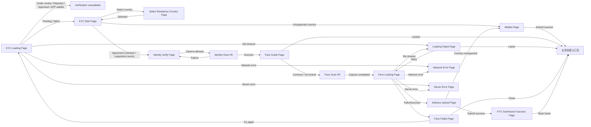

### 4.2 KYC Loading Page

#### Page Snapshot


| 项目 | 说明 |
| --- | --- |
| 页面类型 | 状态页。 |
| 页面目标 | 在进入 KYC 时判断用户是否可继续流程。 |
| 入口 / 触发 | 用户从业务入口发起 KYC。 |
| 成功流转 | 可继续时进入 KYC Start 或后续流程。 |
| 异常流转 | Network Error、Server Error、Loading Failed。 |

#### Rule Anchors

| Rule ID | Scope | Rule |
| --- | --- | --- |
| KYC-LOADING-001 | 页面类型 | 状态页。 |
| KYC-LOADING-002 | 页面目标 | 在进入 KYC 时判断用户是否可继续流程。 |
| KYC-LOADING-003 | 入口 / 触发 | 用户从业务入口发起 KYC。 |
| KYC-LOADING-004 | 展示内容 | 状态 1：loading...；状态 2：Verification unavailable 及说明文案。 |
| KYC-LOADING-005 | 用户动作 | 可点击关闭按钮；状态 2 可点击 Back。 |
| KYC-LOADING-006 | 系统处理 / 责任方 | AIX Backend 查询 KYC 状态与 waitlist 状态；AIX App 展示分流结果。 |
| KYC-LOADING-007 | 状态规则 | Under review / Rejected / Approved 或 APP 来源 waitlist 展示状态 2；Pending / failed 进入后续流程。 |
| KYC-LOADING-008 | 成功流转 | 可继续时进入 KYC Start 或后续流程。 |
| KYC-LOADING-009 | 失败 / 异常流转 | Network Error、Server Error、Loading Failed。 |
| KYC-LOADING-010 | 边界 | waitlist 是页面级拦截，不是弹窗继续。 |

#### UX Mapping

| 图中位置 | Element ID | 页面元素 | 展示 / 交互 | Rule Ref |
| --- | --- | --- | --- | --- |
| 顶部导航区 | close_button | 关闭按钮 | 点击关闭当前 KYC 流程。 | KYC-LOADING-005 |
| 主体状态区 | loading_state | loading 状态 | 展示 loading 状态；等待后端判断 KYC / waitlist 状态。 | KYC-LOADING-004、KYC-LOADING-006 |
| 主体状态区 | unavailable_state | Verification unavailable 状态 | 当状态命中拦截条件时展示不可用说明。 | KYC-LOADING-004、KYC-LOADING-007 |
| 底部操作区 | back_button | Back 按钮 | 状态 2 可点击 Back。 | KYC-LOADING-005 |

#### Navigation / Behavior

| Action / State | Result | Rule Ref |
| --- | --- | --- |
| 状态允许继续 | 进入 KYC Start 或后续流程。 | KYC-LOADING-008 |
| Under review / Rejected / Approved / APP waitlist | 展示 Verification unavailable。 | KYC-LOADING-007 |
| Pending / failed | 进入后续流程。 | KYC-LOADING-007 |

#### System / Edge Cases

| Case | Handling | Rule Ref |
| --- | --- | --- |
| 网络 / 服务异常 | 进入 Network Error、Server Error 或 Loading Failed。 | KYC-LOADING-009 |
| Waitlist | 页面级拦截。 | KYC-LOADING-010 |

### 4.3 KYC Start Page

#### Product Review Summary

| 项目 | 说明 |
| --- | --- |
| 页面目标 | 让用户完成 KYC 前置确认：确认身份验证、选择居住国家、同意协议。 |
| 用户状态 | 用户已通过 KYC Loading 分流，允许进入 KYC 申请流程。 |
| 主动作 | 点击立即认证 / Continue / Verify。 |
| 次要动作 | 返回 / 关闭、选择居住国家、阅读并勾选协议。 |
| 关键产品判断 | 国家是否支持、协议是否已完成、手机号未绑定边界是否需要阻断。 |
| 依赖规则 | KYC-START-003、KYC-START-006、KYC-START-007、KYC-START-008、KYC-START-009、KYC-START-010 |

#### Page States / Snapshot

##### State A：KYC Start 主页面


| 项目 | 说明 |
| --- | --- |
| 状态含义 | 用户进入 KYC 起始页，准备选择国家并完成协议。 |
| 触发条件 | KYC Loading 判断用户可继续。 |
| 页面重点 | 国家选择、协议勾选、主按钮状态。 |
| 用户下一步 | 选择国家、阅读协议并点击主按钮。 |
| Rule Ref | KYC-START-001、KYC-START-003、KYC-START-004、KYC-START-005、KYC-START-007 |

##### State B：Declaration 阅读状态


| 项目 | 说明 |
| --- | --- |
| 状态含义 | 用户查看 Declaration of Reverse Solicitation。 |
| 触发条件 | 用户点击 Declaration 链接或协议项。 |
| 页面重点 | 强制阅读后才能完成协议前置条件。 |
| 用户下一步 | 完成阅读 / 同意后返回 KYC Start Page。 |
| Rule Ref | KYC-START-006、KYC-START-007、4.3.1 |

##### State C：不支持国家 / waitlist 拦截

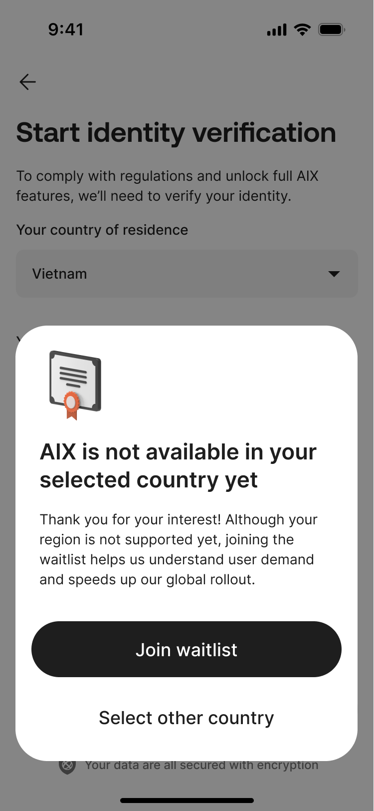

| 项目 | 说明 |
| --- | --- |
| 状态含义 | 国家不支持时，用户不能继续 KYC。 |
| 触发条件 | 用户点击主按钮后，后端判断国家不支持。 |
| 页面重点 | 阻止继续 KYC，并进入 waitlist 处理。 |
| 用户下一步 | 进入 Waitlist Page 或返回。 |
| Rule Ref | KYC-START-009 |

#### UX Mapping

| 图中位置 | Element ID | 页面元素 | 展示规则 | 交互规则 | Rule Ref |
| --- | --- | --- | --- | --- | --- |
| 顶部导航区 | close_button | 关闭 / 返回入口 | 展示关闭或返回入口。 | 点击返回或关闭当前 KYC 流程。 | KYC-START-005 |
| 标题说明区 | page_title_subtitle | Title / Subtitle | 展示 KYC 开始说明。 | 不可点击。 | KYC-START-004 |
| 中部国家区 | residence_country_selector | 居住国家 / 地区 | 展示当前选择的居住国家。 | 点击进入 Select Residence Country Page。 | KYC-START-005 |
| 协议区 | terms_privacy_checkbox | Terms / Privacy 协议勾选 | 展示协议勾选项。 | 未满足协议条件时主按钮禁用。 | KYC-START-007 |
| 协议区 | reverse_solicitation_link | Declaration of Reverse Solicitation | 展示 Declaration 协议入口。 | 需阅读后完成协议前置条件；细则见 4.3.1。 | KYC-START-006、KYC-START-007 |
| 底部主按钮 | start_verify_button | 立即认证按钮 | 根据协议状态展示禁用 / 启用。 | 点击后判断国家是否支持。 | KYC-START-007、KYC-START-008、KYC-START-009 |
| 弹窗 / 拦截区 | waitlist_intercept_message | waitlist 拦截说明 | 国家不支持时展示。 | 进入 waitlist 处理，不继续后续 KYC。 | KYC-START-009 |

#### Navigation / Behavior

| Action / State | Result | Rule Ref |
| --- | --- | --- |
| 点击居住国家 | 进入 Select Residence Country Page。 | KYC-START-005 |
| 点击主按钮且国家支持 | 进入 Identity Verify。 | KYC-START-008 |
| 点击主按钮但国家不支持 | 进入 Waitlist。 | KYC-START-009 |
| 协议未完成时点击主按钮 | 按钮不可用，不能继续。 | KYC-START-007 |

#### System / Edge Cases

| Case | Handling | Rule Ref |
| --- | --- | --- |
| 协议保存 | Backend 保存协议同意、协议快照、Reverse Solicitation 信息。 | KYC-START-006 |
| 协议获取失败 | 展示 toast。 | KYC-START-009 |
| 手机号未绑定 | 见 GAP-KYC-PHONE-001。 | KYC-START-010 |

#### Product Decisions / Open Gaps

| Gap ID | 问题 | 当前处理 | 影响 |
| --- | --- | --- | --- |
| GAP-KYC-PHONE-001 | 手机号未绑定时的处理边界。 | 不在本页面自行裁决；仅引用边界。 | 影响是否允许继续 KYC Start 后续流程。 |

#### Rule Anchors

| Rule ID | Scope | Rule |
| --- | --- | --- |
| KYC-START-001 | 页面类型 | 主页面。 |
| KYC-START-002 | 页面目标 | 让用户确认开始身份验证、选择居住国家并同意协议。 |
| KYC-START-003 | 入口 / 触发 | KYC Loading 判断可继续后进入。 |
| KYC-START-004 | 展示内容 | title、subtitle、居住国家、协议、立即认证按钮。 |
| KYC-START-005 | 用户动作 | 选择国家、勾选协议、点击立即认证、返回。 |
| KYC-START-006 | 系统处理 / 责任方 | App 展示国家和协议；Backend 保存协议同意、快照、Reverse Solicitation 信息。 |
| KYC-START-007 | 协议按钮规则 | 协议未勾选按钮禁用；已勾选按钮可点；已绑定手机号不展示额外 toast。 |
| KYC-START-008 | 成功流转 | 支持国家进入 Identity Verify。 |
| KYC-START-009 | 失败 / 异常流转 | 不支持国家进入 waitlist；协议获取失败 toast。 |
| KYC-START-010 | 边界 | 手机号未绑定处理见 GAP-KYC-PHONE-001。 |

#### 4.3.1 协议元素明细

| 元素 / 状态 / 提示 | 类型 | 触发 / 展示条件 | 交互 / 校验规则 | 成功结果 | 失败 / 提示 | 后续流转 | 文案来源 |
|---|---|---|---|---|---|---|---|
| Terms of service | Link / Checkbox | 页面展示 | 单击可勾选，无需强制阅读；链接至 DTC Terms | 保存同意时间 | 获取协议失败 toast | 可继续 | PRD / DTC 链接 |
| Privacy Policy | Link / Checkbox | 页面展示 | 单击可勾选，无需强制阅读；链接至 DTC Privacy | 保存同意时间 | 获取协议失败 toast | 可继续 | PRD / DTC 链接 |
| Declaration of Reverse Solicitation | Popup / Checkbox | 用户点击协议 | 需强制阅读；点击 `I agree` 后勾选；关闭则不同意 | 保存协议内容和同意时间 | 未同意不可继续 | 影响 DTC reverseSolicitation 入参 | PRD / Master sub account |
| 立即认证按钮 | Button | 协议状态变化 | 未勾选禁用；勾选后启用 | 进入国家判断 | 不支持国家 waitlist | Identity Verify / Waitlist | PRD |

### 4.4 Select Residence Country Page

#### Page Snapshot


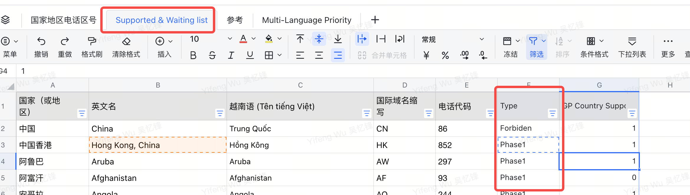

| 项目 | 说明 |
| --- | --- |
| 页面类型 | 选择页。 |
| 页面目标 | 让用户选择居住国家 / 地区。 |
| 入口 / 触发 | KYC Start 或 Address Upload 点击 Residence。 |
| 成功流转 | 选择国家后返回上一级页面。 |
| 边界 | 国家线存在版本口径冲突，见 GAP-KYC-COUNTRY-001。 |

#### Rule Anchors

| Rule ID | Scope | Rule |
| --- | --- | --- |
| KYC-COUNTRY-001 | 页面类型 | 选择页。 |
| KYC-COUNTRY-002 | 页面目标 | 让用户选择居住国家 / 地区。 |
| KYC-COUNTRY-003 | 入口 / 触发 | KYC Start 或 Address Upload 点击 Residence。 |
| KYC-COUNTRY-004 | 展示内容 | 国家列表、搜索、支持国家和不可支持国家。 |
| KYC-COUNTRY-005 | 用户动作 | 搜索、选择国家、关闭返回。 |
| KYC-COUNTRY-006 | 系统处理 / 责任方 | App 根据配置展示国家；禁止国家隐藏。 |
| KYC-COUNTRY-007 | 元素 / 状态 / 提示规则 | 默认 IP 检测国家；检测不到默认 SG；按首字母排序。 |
| KYC-COUNTRY-008 | 成功流转 | 选择国家后返回上一级页面。 |
| KYC-COUNTRY-009 | 边界 | 国家线存在版本口径冲突，见 GAP-KYC-COUNTRY-001。 |

#### UX Mapping

| 图中位置 | Element ID | 页面元素 | 展示 / 交互 | Rule Ref |
| --- | --- | --- | --- | --- |
| 顶部导航区 | close_button | 关闭入口 | 点击关闭并返回上一级页面。 | KYC-COUNTRY-005、KYC-COUNTRY-008 |
| 搜索区 | country_search_input | 国家搜索输入框 | 用户可输入关键词搜索。 | KYC-COUNTRY-005 |
| 国家列表区 | country_list | 国家列表 | 展示支持国家和不可支持国家。 | KYC-COUNTRY-004 |
| 国家列表区 | country_item | 国家项 | 点击选择国家。 | KYC-COUNTRY-005、KYC-COUNTRY-008 |
| 搜索结果区 | search_result_list | 搜索结果列表 | 根据搜索词展示匹配国家。 | KYC-COUNTRY-005 |

#### System / Edge Cases

| Case | Handling | Rule Ref |
| --- | --- | --- |
| 国家展示 | App 根据配置展示国家；禁止国家隐藏。 | KYC-COUNTRY-006 |
| 默认值 | 默认 IP 检测国家；检测不到默认 SG；按首字母排序。 | KYC-COUNTRY-007 |
| 国家线冲突 | 见 GAP-KYC-COUNTRY-001。 | KYC-COUNTRY-009 |

### 4.5 Waitlist Page

#### Page Snapshot

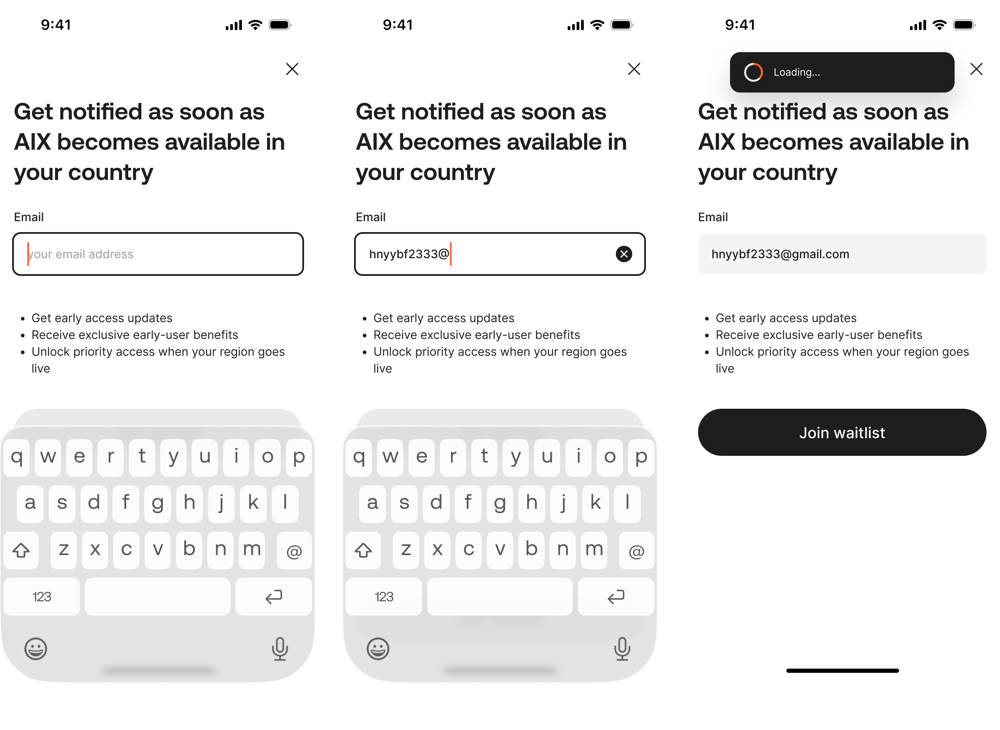

| 项目 | 说明 |
| --- | --- |
| 页面类型 | 拦截 / 提交页。 |
| 页面目标 | 对不支持国家或 waitlist 用户收集邮箱，并阻止继续 KYC。 |
| 入口 / 触发 | 国家为 phase 2-waitlist，或 KYC Loading 命中 waitlist。 |
| 成功流转 | 提交成功后返回业务入口页，用户无法继续申请 KYC。 |
| 异常流转 | 网络异常 / 后端服务器错误 toast。 |

#### Rule Anchors

| Rule ID | Scope | Rule |
| --- | --- | --- |
| KYC-WAITLIST-001 | 页面类型 | 拦截 / 提交页。 |
| KYC-WAITLIST-002 | 页面目标 | 对不支持国家或 waitlist 用户收集邮箱，并阻止继续 KYC。 |
| KYC-WAITLIST-003 | 入口 / 触发 | 国家为 phase 2-waitlist，或 KYC Loading 命中 waitlist。 |
| KYC-WAITLIST-004 | 展示内容 | email 输入框、Join waitlist 按钮、关闭按钮。 |
| KYC-WAITLIST-005 | 用户动作 | 输入 email、提交、关闭。 |
| KYC-WAITLIST-006 | 系统处理 / 责任方 | Backend 按 userId 加入 waitlist，记录 email、国家、来源、提交时间、设备指纹，并推送数仓。 |
| KYC-WAITLIST-007 | 元素 / 状态 / 提示规则 | email 最长 103 字符；空值和格式校验；按钮根据输入状态禁用 / 启用。 |
| KYC-WAITLIST-008 | 成功流转 | 提交成功后返回业务入口页，用户无法继续申请 KYC。 |
| KYC-WAITLIST-009 | 失败 / 异常流转 | 网络异常 / 后端服务器错误 toast。 |
| KYC-WAITLIST-010 | 边界 | waitlist 是页面级拦截。 |

#### UX Mapping

| 图中位置 | Element ID | 页面元素 | 展示 / 交互 | Rule Ref |
| --- | --- | --- | --- | --- |
| 顶部导航区 | close_button | 关闭按钮 | 点击关闭 waitlist 页面。 | KYC-WAITLIST-005 |
| 说明区 | waitlist_message | waitlist 说明文案 | 提示当前国家或用户无法继续 KYC。 | KYC-WAITLIST-002、KYC-WAITLIST-010 |
| 表单区 | email_input | Email 输入框 | 输入 email；校验空值、格式、长度。 | KYC-WAITLIST-004、KYC-WAITLIST-007 |
| 底部操作区 | join_waitlist_button | Join waitlist 按钮 | 根据输入状态禁用 / 启用；点击提交。 | KYC-WAITLIST-005、KYC-WAITLIST-007 |

#### System / Edge Cases

| Case | Handling | Rule Ref |
| --- | --- | --- |
| 加入 waitlist | Backend 按 userId 记录 email、国家、来源、提交时间、设备指纹，并推送数仓。 | KYC-WAITLIST-006 |
| 提交成功 | 返回业务入口页，用户无法继续申请 KYC。 | KYC-WAITLIST-008 |
| 提交失败 | 网络异常 / 后端服务器错误 toast。 | KYC-WAITLIST-009 |

### 4.6 Identity Verify Page / Identity Scan H5

#### Page Snapshot


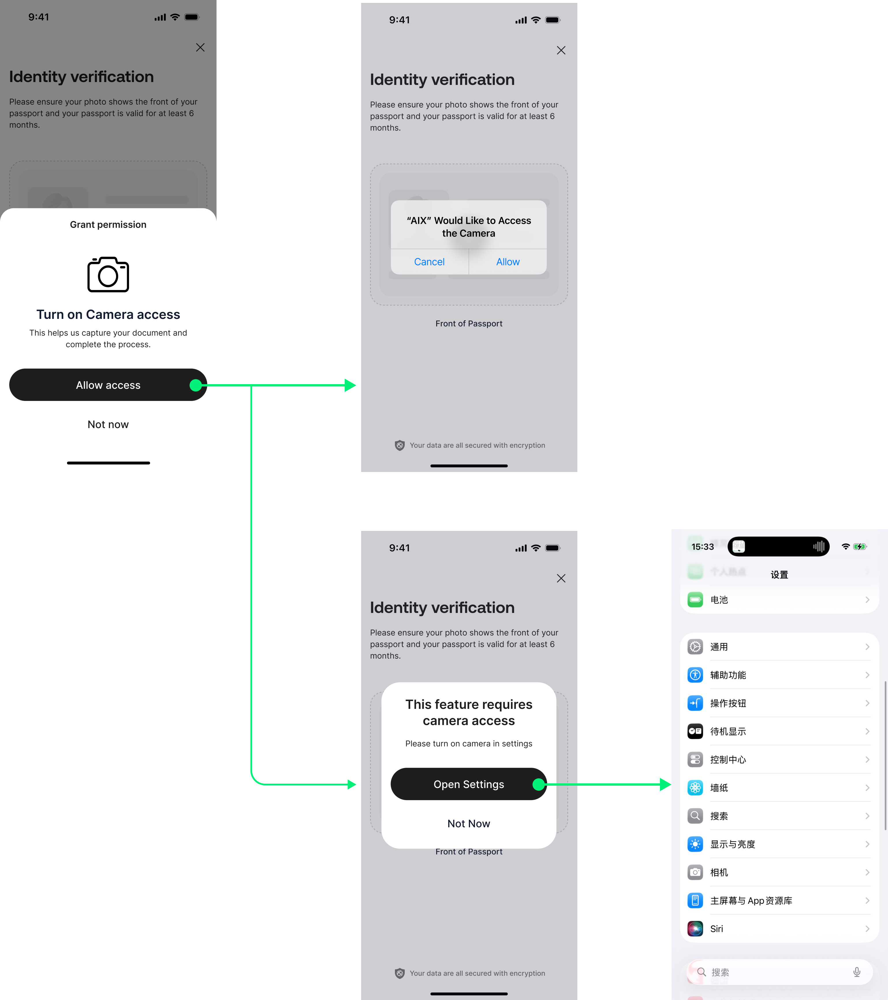

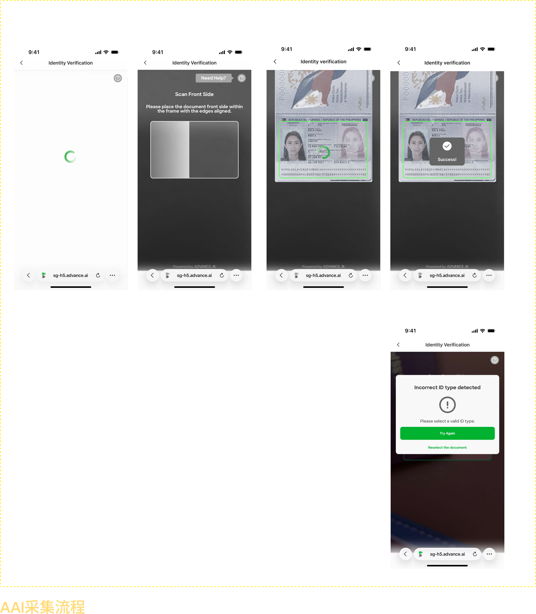

| 项目 | 说明 |
| --- | --- |
| 页面类型 | 主页面 + 外部 H5。 |
| 页面目标 | 引导用户上传 / 扫描护照完成 Passport OCR。 |
| 入口 / 触发 | KYC Start 支持国家且协议已同意。 |
| 成功流转 | Identity Scan 成功进入 Face Guide。 |
| 异常流转 | Identity Scan 失败返回 Identity Verify。 |

#### Rule Anchors

| Rule ID | Scope | Rule |
| --- | --- | --- |
| KYC-IDV-001 | 页面类型 | 主页面 + 外部 H5。 |
| KYC-IDV-002 | 页面目标 | 引导用户上传 / 扫描护照完成 Passport OCR。 |
| KYC-IDV-003 | 入口 / 触发 | KYC Start 支持国家且协议已同意。 |
| KYC-IDV-004 | 展示内容 | 标题、副标题、上传 / 相机按钮、权限弹窗。 |
| KYC-IDV-005 | 用户动作 | 点击相机、授权、进入 H5 扫描护照。 |
| KYC-IDV-006 | 系统处理 / 责任方 | App 判断相机权限；Backend / DTC 生成 Passport H5 URL；AAI 完成 OCR。 |
| KYC-IDV-007 | 元素 / 状态 / 提示规则 | 未授权弹窗；永久拒绝 open settings；DTC 01009 / 01005 toast。 |
| KYC-IDV-008 | 成功流转 | Identity Scan 成功进入 Face Guide。 |
| KYC-IDV-009 | 失败 / 异常流转 | Identity Scan 失败返回 Identity Verify。 |
| KYC-IDV-010 | 边界 | App 不判断 AAI 内部识别逻辑。 |

#### UX Mapping

| 图中位置 | Element ID | 页面元素 | 展示 / 交互 | Rule Ref |
| --- | --- | --- | --- | --- |
| 顶部导航区 | back_or_close_button | 返回 / 关闭入口 | 点击返回或关闭当前验证流程。 | KYC-IDV-005 |
| 标题说明区 | identity_verify_title | 标题 / 副标题 | 展示护照验证说明。 | KYC-IDV-004 |
| 主体操作区 | camera_button | 相机按钮 | 点击后判断相机权限并进入扫描流程。 | KYC-IDV-005、KYC-IDV-006 |
| 主体操作区 | upload_button | 上传入口 | 点击后进入上传 / 扫描流程。 | KYC-IDV-005 |
| 弹窗标题区 | permission_title | 相机权限标题 | 提示需要相机权限。 | KYC-IDV-007 |
| 弹窗操作区 | not_now_button | Not now | 关闭弹窗并停留当前页。 | KYC-IDV-007 |
| 弹窗操作区 | allow_access_button | Allow access | 触发系统授权或引导 open settings。 | KYC-IDV-007 |
| H5 区域 | identity_scan_h5 | 外部 H5 扫描页 | 由 AAI H5 完成 Passport OCR。 | KYC-IDV-006 |

#### Navigation / Behavior

| Action / State | Result | Rule Ref |
| --- | --- | --- |
| 授权成功并进入 H5 | 完成 OCR 后进入 Face Guide。 | KYC-IDV-008 |
| Identity Scan 失败 | 返回 Identity Verify。 | KYC-IDV-009 |

#### System / Edge Cases

| Case | Handling | Rule Ref |
| --- | --- | --- |
| DTC toast | DTC 01009 / 01005 toast。 | KYC-IDV-007 |
| AAI 逻辑 | App 不判断 AAI 内部识别逻辑。 | KYC-IDV-010 |

### 4.7 Face Guide / Face Scan / Face Loading

#### Page Snapshot

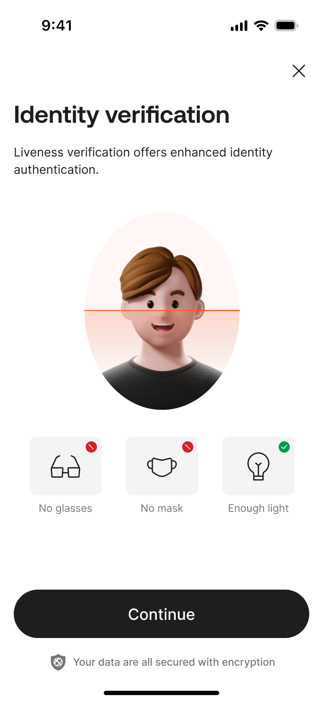


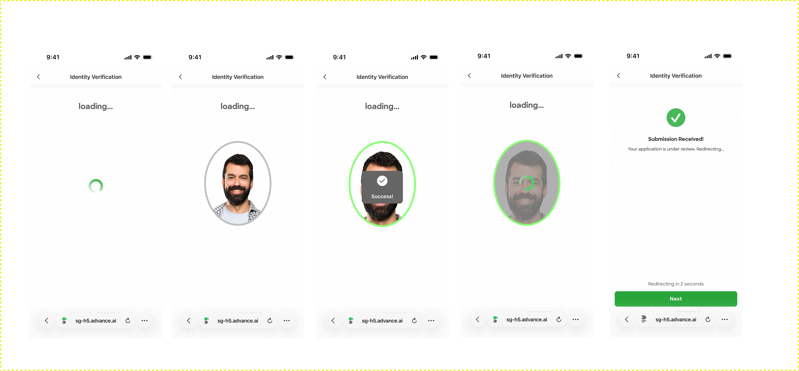


| 项目 | 说明 |
| --- | --- |
| 页面类型 | 主页面 + 外部 H5 + 状态页。 |
| 页面目标 | 完成活体采集和人脸比对。 |
| 入口 / 触发 | Passport OCR 成功后进入。 |
| 成功流转 | Face 成功进入 Address Upload。 |
| 异常流转 | Face Failed、Loading Failed、Network Error、Server Error。 |

#### Rule Anchors

| Rule ID | Scope | Rule |
| --- | --- | --- |
| KYC-FACE-001 | 页面类型 | 主页面 + 外部 H5 + 状态页。 |
| KYC-FACE-002 | 页面目标 | 完成活体采集和人脸比对。 |
| KYC-FACE-003 | 入口 / 触发 | Passport OCR 成功后进入。 |
| KYC-FACE-004 | 展示内容 | Face Guide 说明、Continue 按钮、锁定弹窗、Face Loading。 |
| KYC-FACE-005 | 用户动作 | 点击 Continue、完成 H5 活体采集、等待结果。 |
| KYC-FACE-006 | 系统处理 / 责任方 | Backend 判断锁定、获取 passport country、生成 selfie H5 URL、轮询或接收结果。 |
| KYC-FACE-007 | 锁定 / 超时规则 | 5 次锁 20 分钟；10 次锁 24 小时；接口连续 20 次锁 20 分钟；30 秒超时进入 Loading Failed。 |
| KYC-FACE-008 | 成功流转 | Face 成功进入 Address Upload。 |
| KYC-FACE-009 | 失败 / 异常流转 | Face Failed、Loading Failed、Network Error、Server Error。 |
| KYC-FACE-010 | 边界 | 同一 signatureId 最多重试 3 次，重来需重新 generate-url。 |

#### UX Mapping

| 图中位置 | Element ID | 页面元素 | 展示 / 交互 | Rule Ref |
| --- | --- | --- | --- | --- |
| 顶部导航区 | close_button | 关闭入口 | 点击关闭当前 Face 流程。 | KYC-FACE-005 |
| 标题说明区 | face_guide_message | Face Guide 说明 | 展示活体采集前说明。 | KYC-FACE-004 |
| 底部操作区 | continue_button | Continue 按钮 | 点击后进入 H5 活体采集。 | KYC-FACE-005 |
| 弹窗区域 | face_lock_popup | Face 锁定弹窗 | 达到锁定阈值时展示，阻止继续发起 Face 流程。 | KYC-FACE-007 |
| H5 区域 | face_scan_h5 | 外部 H5 活体采集 | 由 AAI H5 进行活体采集。 | KYC-FACE-005 |
| 主体状态区 | face_loading_state | Face Loading | 等待人脸比对结果。 | KYC-FACE-006 |

#### Navigation / Behavior

| Action / State | Result | Rule Ref |
| --- | --- | --- |
| Face 成功 | 进入 Address Upload。 | KYC-FACE-008 |
| Face 失败 / 超时 / 异常 | 进入 Face Failed、Loading Failed、Network Error、Server Error。 | KYC-FACE-009 |

#### System / Edge Cases

| Case | Handling | Rule Ref |
| --- | --- | --- |
| 进入前判断 | Backend 判断锁定、获取 passport country、生成 selfie H5 URL。 | KYC-FACE-006 |
| 重试边界 | 同一 signatureId 最多重试 3 次，重来需重新 generate-url。 | KYC-FACE-010 |
| 30 秒超时 | 进入 Loading Failed。 | KYC-FACE-007 |

### 4.8 Loading Failed Page

#### Page Snapshot


| 项目 | 说明 |
| --- | --- |
| 页面类型 | 错误页。 |
| 页面目标 | 处理 Face Loading 超过 30 秒无结果。 |
| 入口 / 触发 | Face Loading 等待超过 30 秒。 |
| 成功流转 | Retry 进入 Face Loading。 |
| 异常流转 | Leave 返回入口。 |

#### Rule Anchors

| Rule ID | Scope | Rule |
| --- | --- | --- |
| KYC-LOADFAIL-001 | 页面类型 | 错误页。 |
| KYC-LOADFAIL-002 | 页面目标 | 处理 Face Loading 超过 30 秒无结果。 |
| KYC-LOADFAIL-003 | 入口 / 触发 | Face Loading 等待超过 30 秒。 |
| KYC-LOADFAIL-004 | 展示内容 | 加载失败提示、Retry、返回。 |
| KYC-LOADFAIL-005 | 用户动作 | Retry 或 Leave。 |
| KYC-LOADFAIL-006 | 系统处理 / 责任方 | App 重新进入 Face Loading 并重新提交。 |
| KYC-LOADFAIL-007 | 元素 / 状态 / 提示规则 | 返回按钮使用通用挽留弹窗。 |
| KYC-LOADFAIL-008 | 成功流转 | Retry 进入 Face Loading。 |
| KYC-LOADFAIL-009 | 失败 / 异常流转 | Leave 返回入口。 |
| KYC-LOADFAIL-010 | 边界 | Retry 不是返回 Face Scan。 |

#### UX Mapping

| 图中位置 | Element ID | 页面元素 | 展示 / 交互 | Rule Ref |
| --- | --- | --- | --- | --- |
| 顶部导航区 | back_or_close_button | 返回 / 关闭入口 | 点击触发通用挽留弹窗。 | KYC-LOADFAIL-007 |
| 中部状态区 | failed_icon | 加载失败状态图标 | 展示加载失败视觉状态。 | KYC-LOADFAIL-004 |
| 中部标题区 | failed_title | 加载失败提示 | 展示加载失败提示。 | KYC-LOADFAIL-004 |
| 底部操作区 | retry_button | Retry 按钮 | 点击重新进入 Face Loading。 | KYC-LOADFAIL-005、KYC-LOADFAIL-008、KYC-LOADFAIL-010 |
| 底部操作区 | leave_button | Leave / Back 操作 | 返回入口。 | KYC-LOADFAIL-005、KYC-LOADFAIL-009 |

#### System / Edge Cases

| Case | Handling | Rule Ref |
| --- | --- | --- |
| 重新提交 | App 重新进入 Face Loading 并重新提交。 | KYC-LOADFAIL-006 |
| Retry 边界 | Retry 不是返回 Face Scan。 | KYC-LOADFAIL-010 |

### 4.9 Face Failed Page

#### Product Review Summary

| 项目 | 说明 |
| --- | --- |
| 页面目标 | 展示 KYC 失败原因，并提供重试或退出路径。 |
| 用户状态 | 用户已完成某一步验证，但当前验证失败。 |
| 主动作 | Try again。 |
| 次要动作 | 关闭 / 返回入口。 |
| 关键产品判断 | 失败原因优先级、是否允许重试、是否进入锁定。 |
| 依赖规则 | KYC-FACEFAIL-006、KYC-FACEFAIL-007、KYC-FACEFAIL-008、KYC-FACEFAIL-009、KYC-FACEFAIL-010 |

#### Page States / Snapshot

##### State A：正常失败态


| 项目 | 说明 |
| --- | --- |
| 状态含义 | Face / Passport / POA 相关校验失败，用户仍可处理。 |
| 触发条件 | Face Loading 验证失败、Face Scan 失败、POA 失败等。 |
| 页面重点 | 固定主文案、动态失败原因、Try again、关闭按钮。 |
| 用户下一步 | 点击 Try again 重新触发 KYC 流程，或关闭返回入口。 |
| Rule Ref | KYC-FACEFAIL-003、KYC-FACEFAIL-004、KYC-FACEFAIL-005、KYC-FACEFAIL-008 |

##### State B：锁定态

| 项目 | 说明 |
| --- | --- |
| 状态含义 | 失败次数达到锁定条件，用户不能继续重试。 |
| 触发条件 | 锁定态由失败次数 / 安全规则触发。 |
| 页面重点 | 展示安全锁定弹窗。 |
| 用户下一步 | 确认后返回入口。 |
| Rule Ref | KYC-FACEFAIL-007、KYC-FACEFAIL-009 |

#### UX Mapping

| 图中位置 | Element ID | 页面元素 | 展示规则 | 交互规则 | Rule Ref |
| --- | --- | --- | --- | --- | --- |
| 顶部导航区 | close_button | 关闭按钮 | 展示关闭按钮。 | 点击关闭失败页 / 返回入口。 | KYC-FACEFAIL-005 |
| 中部状态区 | failed_status_icon | 失败状态图标 | 展示失败视觉状态。 | 不可点击。 | KYC-FACEFAIL-004 |
| 中部标题区 | failure_title | 固定主文案 | 展示固定失败主文案。 | 不可点击。 | KYC-FACEFAIL-004 |
| 中部说明区 | failure_reason | 动态原因文案 | 根据 passport / face / POA error code 展示失败原因。 | 不可点击。 | KYC-FACEFAIL-006、KYC-FACEFAIL-007、KYC-FACEFAIL-010 |
| 底部操作区 | try_again_button | Try again 按钮 | 正常失败态展示。 | 点击重新触发 KYC 流程。 | KYC-FACEFAIL-005、KYC-FACEFAIL-008 |
| 锁定弹窗 | lock_popup | 安全锁定弹窗 | 锁定态展示。 | 确认后返回入口。 | KYC-FACEFAIL-007、KYC-FACEFAIL-009 |

#### Navigation / Behavior

| Action / State | Result | Rule Ref |
| --- | --- | --- |
| 点击 Try again | 正常态重新触发 KYC 流程。 | KYC-FACEFAIL-008 |
| 锁定态确认 | 返回入口。 | KYC-FACEFAIL-009 |
| 点击关闭按钮 | 关闭失败页 / 返回入口。 | KYC-FACEFAIL-005 |

#### System / Edge Cases

| Case | Handling | Rule Ref |
| --- | --- | --- |
| 失败原因优先级 | passport 与 face 均失败时优先 passport。 | KYC-FACEFAIL-007 |
| 文案映射来源 | 错误文案来源为 PRD 第 9 章映射表。 | KYC-FACEFAIL-010 |
| 失败原因来源 | Backend 返回失败原因；App 按优先级展示映射文案。 | KYC-FACEFAIL-006 |

#### Product Decisions / Open Gaps

| Gap ID | 问题 | 当前处理 | 影响 |
| --- | --- | --- | --- |
| - | 本页暂无新的产品裁决项。 | 按 Rule Anchors 执行。 | - |

#### Rule Anchors

| Rule ID | Scope | Rule |
| --- | --- | --- |
| KYC-FACEFAIL-001 | 页面类型 | 失败页。 |
| KYC-FACEFAIL-002 | 页面目标 | 展示人脸 / 护照 / POA 失败原因，并提供重试入口。 |
| KYC-FACEFAIL-003 | 入口 / 触发 | Face Loading 验证失败、Face Scan 失败、POA 失败等。 |
| KYC-FACEFAIL-004 | 展示内容 | 固定主文案、动态原因文案、Try again、关闭按钮。 |
| KYC-FACEFAIL-005 | 用户动作 | Try again 或关闭。 |
| KYC-FACEFAIL-006 | 系统处理 / 责任方 | Backend 返回失败原因；App 按优先级展示映射文案。 |
| KYC-FACEFAIL-007 | 元素 / 状态 / 提示规则 | passport 与 face 均失败时优先 passport；锁定态展示安全弹窗。 |
| KYC-FACEFAIL-008 | 成功流转 | 正常态 Try again 重新触发 KYC 流程。 |
| KYC-FACEFAIL-009 | 失败 / 异常流转 | 锁定态确认后返回入口。 |
| KYC-FACEFAIL-010 | 边界 | 错误文案来源为 PRD 第 9 章映射表。 |

### 4.10 Address Upload Page

#### Product Review Summary

| 项目 | 说明 |
| --- | --- |
| 页面目标 | 收集用户地址证明文件并提交 POA 审核。 |
| 用户状态 | 用户已完成 Face 验证，进入 POA 补充材料阶段。 |
| 主动作 | 上传地址证明文件并点击 Continue。 |
| 次要动作 | 修改 Residence、删除文件、预览文件、返回 / 关闭。 |
| 关键产品判断 | 文件规则、POA 国家校验、Continue 后跳转冲突。 |
| 依赖规则 | KYC-POA-005、KYC-POA-006、KYC-POA-FILE-001、KYC-POA-008、KYC-POA-009、KYC-POA-010 |

#### Page States / Snapshot

##### State A：Address Upload 主页面


| 项目 | 说明 |
| --- | --- |
| 状态含义 | 用户进入 POA 地址证明上传主页面。 |
| 触发条件 | Face 验证成功。 |
| 页面重点 | Residence、文件上传区、Continue 按钮。 |
| 用户下一步 | 选择 / 上传地址证明文件。 |
| Rule Ref | KYC-POA-001、KYC-POA-003、KYC-POA-004、KYC-POA-005 |

##### State B：未上传状态


| 项目 | 说明 |
| --- | --- |
| 状态含义 | 用户尚未上传 POA 文件。 |
| 触发条件 | 进入 Address Upload 后未选择文件。 |
| 页面重点 | 上传入口、Continue 禁用。 |
| 用户下一步 | 点击上传区选择文件。 |
| Rule Ref | KYC-POA-004、KYC-POA-FILE-001 |

##### State C：上传中状态


| 项目 | 说明 |
| --- | --- |
| 状态含义 | 文件正在上传。 |
| 触发条件 | 用户选择文件后开始上传。 |
| 页面重点 | 上传进度、取消 / 删除操作。 |
| 用户下一步 | 等待上传完成，或点击删除 / 取消。 |
| Rule Ref | KYC-POA-005、KYC-POA-FILE-001 |

##### State D：已上传状态

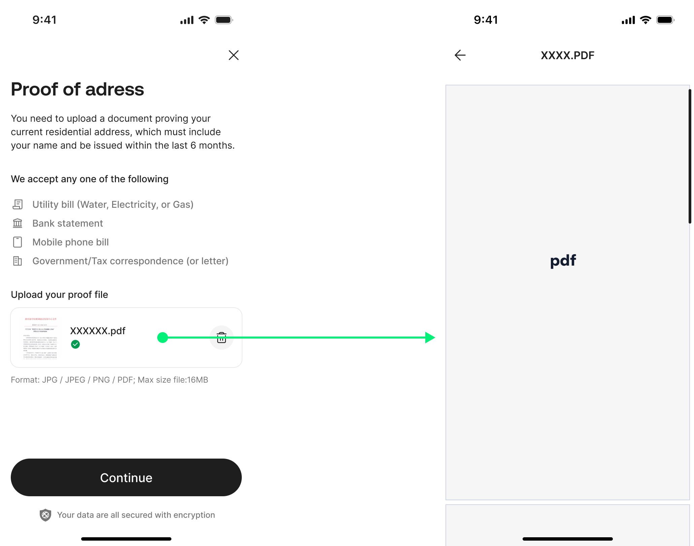

| 项目 | 说明 |
| --- | --- |
| 状态含义 | 文件已上传成功。 |
| 触发条件 | 文件上传完成。 |
| 页面重点 | 已上传文件、删除、预览、Continue。 |
| 用户下一步 | 点击 Continue 提交 POA。 |
| Rule Ref | KYC-POA-005、KYC-POA-008、KYC-POA-FILE-001 |

##### State E：国家线拦截 / waitlist 状态

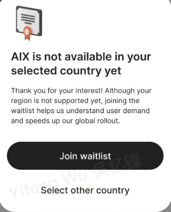

| 项目 | 说明 |
| --- | --- |
| 状态含义 | POA 提交后再次校验国家线，命中不支持国家。 |
| 触发条件 | 后端判断国家不属于支持范围。 |
| 页面重点 | 国家线 / waitlist 拦截说明。 |
| 用户下一步 | 进入拦截处理或 waitlist。 |
| Rule Ref | KYC-POA-009、KYC-POA-010 |

#### UX Mapping

| 图中位置 | Element ID | 页面元素 | 展示规则 | 交互规则 | Rule Ref |
| --- | --- | --- | --- | --- | --- |
| 顶部导航区 | back_or_close_button | 返回 / 关闭入口 | 展示返回或关闭入口。 | 点击触发离开当前 KYC 流程相关处理。 | KYC-POA-005 |
| 标题说明区 | poa_title_subtitle | Title / Subtitle | 展示上传地址证明说明。 | 不可点击。 | KYC-POA-004 |
| Residence 区 | residence_selector | 居住国家 / 地区 | 展示当前 Residence。 | 点击可修改 Residence，进入 Select Residence Country Page。 | KYC-POA-005 |
| 上传区 | file_upload_area | 文件上传区 | 展示上传入口和文件状态；不重复写文件事实。 | 上传、删除、预览均按引用规则处理。 | KYC-POA-004、KYC-POA-FILE-001 |
| 上传区 | empty_upload_state | 未上传空状态 | 展示文件上传入口；Continue 禁用。 | 点击上传区选择文件。 | KYC-POA-004、KYC-POA-FILE-001 |
| 文件状态区 | upload_progress | 上传进度 | 展示上传进度。 | 点击删除按钮取消上传。 | KYC-POA-005、KYC-POA-FILE-001 |
| 文件状态区 | uploaded_file_item | 已上传文件 | 展示已上传文件状态。 | 支持删除和预览。 | KYC-POA-005、KYC-POA-FILE-001 |
| 底部操作区 | continue_button | Continue 按钮 | 满足提交条件后启用。 | 点击提交 POA 审核。 | KYC-POA-005、KYC-POA-008、KYC-POA-010 |
| 拦截区 | country_block_message | 国家线 / waitlist 拦截说明 | 国家不支持时展示。 | 按拦截处理返回或进入 waitlist。 | KYC-POA-009、KYC-POA-010 |

#### Navigation / Behavior

| Action / State | Result | Rule Ref |
| --- | --- | --- |
| 点击 Residence | 进入 Select Residence Country Page。 | KYC-POA-005 |
| 选择文件 | 进入上传中状态。 | KYC-POA-005、KYC-POA-FILE-001 |
| 上传中点击删除 | 取消上传。 | KYC-POA-005 |
| 已上传点击文件 | 预览图片或 PDF。 | KYC-POA-005 |
| 已上传点击删除 | 删除已上传文件。 | KYC-POA-005 |
| 点击 Continue | 提交 POA 审核。 | KYC-POA-005、KYC-POA-008、KYC-POA-010 |

#### System / Edge Cases

| Case | Handling | Rule Ref |
| --- | --- | --- |
| 文件校验 | 见 KYC-POA-FILE-001。 | KYC-POA-FILE-001 |
| 后端上传 | App 校验文件；Backend 获取 DTC upload token 并上传 POA；DTC / AAI 审核。 | KYC-POA-006 |
| 异常处理 | 见 KYC-POA-009。 | KYC-POA-009 |
| 跳转冲突 | 见 GAP-KYC-POA-002。 | KYC-POA-010 |

#### Product Decisions / Open Gaps

| Gap ID | 问题 | 当前处理 | 影响 |
| --- | --- | --- | --- |
| GAP-KYC-POA-002 | POA continue 后跳转存在源文档冲突。 | 不自行裁决；当前只记录冲突边界。 | 影响 Continue 后进入 Submission Success、Waitlist 或其他状态的最终跳转。 |

#### Rule Anchors

| Rule ID | Scope | Rule |
| --- | --- | --- |
| KYC-POA-001 | 页面类型 | 主页面。 |
| KYC-POA-002 | 页面目标 | 收集用户地址证明文件并提交 POA 审核。 |
| KYC-POA-003 | 入口 / 触发 | Face 验证成功。 |
| KYC-POA-004 | 展示内容 | Residence、文件上传区、Continue 按钮、文件状态。 |
| KYC-POA-005 | 用户动作 | 修改 Residence、上传 / 删除 / 预览文件、点击 Continue。 |
| KYC-POA-006 | 系统处理 / 责任方 | App 校验文件；Backend 获取 DTC upload token 并上传 POA；DTC / AAI 审核。 |
| KYC-POA-FILE-001 | 文件规则 | JPG/JPEG/PNG/PDF；16MB；只能上传一份；上传中 / 已上传状态。 |
| KYC-POA-008 | 成功流转 | 提交成功进入 KYC Submission Success。 |
| KYC-POA-009 | 失败 / 异常流转 | 文件错误、上传失败、国家不支持、服务器错误、POA 失败。 |
| KYC-POA-010 | 边界 | POA continue 后跳转存在源文档冲突，见 GAP-KYC-POA-002。 |

### 4.11 KYC Submission Success Page

#### Page Snapshot

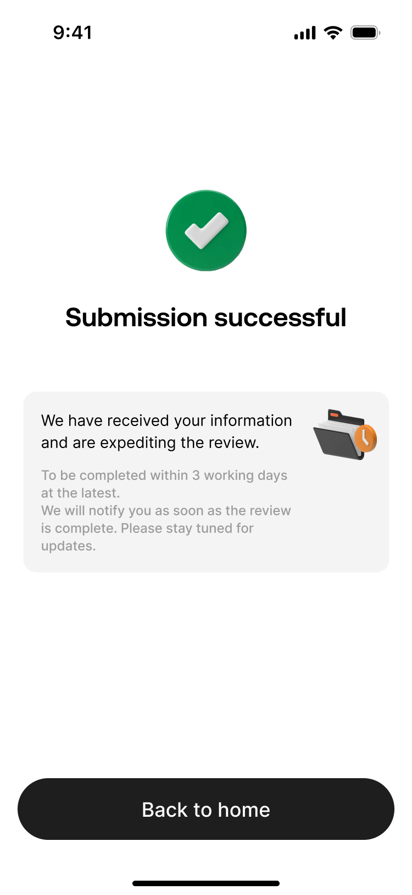

| 项目 | 说明 |
| --- | --- |
| 页面类型 | 成功页。 |
| 页面目标 | 告知用户 KYC 资料已提交，等待审核结果。 |
| 入口 / 触发 | POA 提交成功。 |
| 成功流转 | 返回入口，后续通过状态或通知感知结果。 |
| 边界 | 通知规则待 Notification 来源核验。 |

#### Rule Anchors

| Rule ID | Scope | Rule |
| --- | --- | --- |
| KYC-SUBMIT-001 | 页面类型 | 成功页。 |
| KYC-SUBMIT-002 | 页面目标 | 告知用户 KYC 资料已提交，等待审核结果。 |
| KYC-SUBMIT-003 | 入口 / 触发 | POA 提交成功。 |
| KYC-SUBMIT-004 | 展示内容 | 固定成功文案、返回首页按钮。 |
| KYC-SUBMIT-005 | 用户动作 | 点击返回首页。 |
| KYC-SUBMIT-006 | 系统处理 / 责任方 | App 关闭当前 KYC 流程。 |
| KYC-SUBMIT-007 | 元素 / 状态 / 提示规则 | 返回首页按钮返回业务流程入口页。 |
| KYC-SUBMIT-008 | 成功流转 | 返回入口，后续通过状态或通知感知结果。 |
| KYC-SUBMIT-009 | 边界 | 通知规则待 Notification 来源核验。 |

#### UX Mapping

| 图中位置 | Element ID | 页面元素 | 展示 / 交互 | Rule Ref |
| --- | --- | --- | --- | --- |
| 顶部 / 状态区 | success_icon | 成功状态图标 | 展示提交成功视觉状态。 | KYC-SUBMIT-004 |
| 中部标题区 | success_message | 固定成功文案 | 告知用户资料已提交，等待审核结果。 | KYC-SUBMIT-002、KYC-SUBMIT-004 |
| 底部操作区 | back_home_button | 返回首页按钮 | 点击返回业务流程入口页。 | KYC-SUBMIT-005、KYC-SUBMIT-007、KYC-SUBMIT-008 |

#### System / Edge Cases

| Case | Handling | Rule Ref |
| --- | --- | --- |
| 关闭流程 | App 关闭当前 KYC 流程。 | KYC-SUBMIT-006 |
| 通知边界 | 通知规则待 Notification 来源核验。 | KYC-SUBMIT-009 |

---

---

---

---|---|
| 页面类型 | 成功页 |
| 页面目标 | 告知用户 KYC 资料已提交，等待审核结果。 |
| 入口 / 触发 | POA 提交成功。 |
| 展示内容 | 固定成功文案、返回首页按钮。 |
| 用户动作 | 点击返回首页。 |
| 系统处理 / 责任方 | App 关闭当前 KYC 流程。 |
| 元素 / 状态 / 提示规则 | 返回首页按钮返回业务流程入口页。 |
| 成功流转 | 返回入口，后续通过状态或通知感知结果。 |
| 失败 / 异常流转 | 不适用。 |
| 备注 / 边界 | 通知规则待 Notification 来源核验。 |

---

## 5. 字段、接口与数据

### 5.1 字段 / 接口 / 数据总表

| 类型 | 名称 | 所属系统 | 来源 | 用途 | 规则 / 输入输出 | 异常处理 |
|---|---|---|---|---|---|---|
| 字段 | `externalId` | AIX / DTC | AIX 生成 / DTC 接口 | 关联用户 KYC 结果 | URL 生成、结果查询、OCR info、POA upload 均使用 | 格式错误返回 DTC `50004` |
| 字段 | `requestId` | DTC | DTC 返回 | 追踪单次认证请求 | URL 生成、webhook、POA upload 返回 | 缺失时无法定位请求，需后端处理 |
| 字段 | `clientStatus` | DTC | 查询结果 / webhook | 表示 DTC 客户状态 | 枚举见 3.4.2 | 与 AIX 页面状态映射待确认 |
| 字段 | `passportVerifyStatus` | DTC | 查询结果 / webhook | 表示护照认证状态 | 使用 EKycFileVerifyStatus | 失败时看 `passportVerifyCode` |
| 字段 | `faceIdVerifyStatus` | DTC | 查询结果 / webhook | 表示人脸认证状态 | 使用 EKycFileVerifyStatus | 失败时看 `faceIdVerifyCode` |
| 字段 | `proofOfAddressVerifyStatus` | DTC | 查询结果 / webhook | 表示 POA 审核状态 | 使用 EKycFileVerifyStatus | 失败时看 `proofOfAddressVerifyCode` |
| 字段 | `reverseSolicitation` | AIX / DTC | 协议确认 / DTC 接口 | 标记反向招揽声明 | 需要时传 `T`，否则空或 `F` | 缺失可能返回 `50013` |
| 数据 | 协议同意时间 | AIX | 用户勾选协议 | 合规留痕 | ToS / Privacy / Declaration 均需保存同意并提交时间 | 保存失败应阻止继续 |
| 数据 | Declaration 协议内容 | AIX | 用户强制阅读并同意 | 合规留痕 | 需要保存协议内容和同意时间 | 保存失败应阻止继续 |
| 数据 | 协议快照 | AIX | 提交成功 | 合规留痕 | 生成不可更改快照并与用户账户绑定 | 保存失败待后端确认 |
| 数据 | waitlist email | AIX | 用户输入 | waitlist 运营与通知 | 最长 103 字符，格式校验 | 空 / 格式错误提示 |
| 数据 | 设备指纹 ID | AIX | App / 设备 | waitlist 落库和数仓分析 | 与 userId、email、国家、来源、提交时间一并记录 | 获取失败策略待确认 |
| 接口 | `POST /openapi/v1/ekyc/get-verification-url` | DTC | Master sub account | 获取 Passport / Selfie H5 URL | 入参含 redirectUrl、externalId、type、country、language、email、mobile、reverseSolicitation | 错误码见 5.2 |
| 接口 | `GET /openapi/v1/ekyc/verification-result/{externalId}` | DTC | Master sub account | 查询 KYC 结果 | 返回 clientStatus、nationality、country、三类 verifyStatus/code | 查询失败按系统异常处理 |
| 接口 | `KYC_VERIFICATION` webhook | DTC | Master sub account | 异步同步 KYC 结果 | 返回 externalId、clientStatus、三类状态和 code、requestId | webhook 延迟时 query 兜底 |
| 接口 | `GET /openapi/v1/ekyc/passport-info/{externalId}` | DTC | Master sub account | 查询护照 OCR 信息 | 返回 fullName、idNumber、DOB、gender、nationality | 查询失败待后端处理 |
| 接口 | `GET /openapi/v1/ekyc/poa-info/{externalId}` | DTC | Master sub account | 查询 POA OCR 信息 | 返回 address、country、state、city、postal | 查询失败待后端处理 |
| 接口 | `POST /openapi/v1/file/get-upload-token` | DTC | Master sub account | 获取 POA 上传 token | documentType=3，externalId，需要签名 | token 5 分钟有效，只能用一次 |
| 接口 | `POST /openapi/v1/ekyc/upload-file` | DTC | Master sub account | 上传 POA 文件 | token、fileContent、countryOfResidence | 14004 / 14005 |
| 日志 / 埋点 | KYC 页面曝光与错误 | AIX | 当前文档未明确 | QA / 运营 / 风控分析 | 待确认是否需要埋点 | GAP 待补 |

### 5.2 `get-verification-url` 错误码

| errCode | 含义 | 处理建议 |
|---|---|---|
| `00010` | Invalid parameters | 参数错误，阻止继续 |
| `00025` | Services unavailable in country or region | 国家 / 地区不可用，进入 waitlist 或提示 |
| `01009` | Mobile number already exists | Toast：`Mobile number already exists.` |
| `01005` | The email address is in use | Toast：`The email address is in use.` |
| `01049` | Account is invalid | 展示账户不可用提示，具体页面待确认 |
| `50001` | Mobile number format invalid | 参数错误 |
| `50002` | Email format invalid | 参数错误 |
| `50003` | Country of residence format invalid | 参数错误 |
| `50004` | externalId format invalid | 参数错误 |
| `50005` | targetKycLevel format invalid | 参数错误 |
| `50006` | Mobile number exists | 参数 / 账户冲突 |
| `50007` | Applicant currently undergoing verification | 用户正在认证中，应进入不可重复提交或状态页 |
| `50008` | Email exists | 邮箱冲突 |
| `50013` | Reverse solicitation not declared by end user | 反向招揽未声明，应阻止继续并要求补声明 |
| `59999` | Internal error | 系统错误 |

### 5.3 错误码与前端文案映射

#### Passport / Document Verification

| code | AIX 前端提示文案 |
|---|---|
| `ID_FORGERY_DETECTED` | We couldn't verify this document. Please upload a valid document. |
| `NO_SUPPORTED_CARD` | This document type isn't supported. Please upload a valid document. |
| `CARD_TYPE_MISMATCH` | Document type doesn't match your selection. Please upload a valid document. |
| `CARD_LOW_QUALITY_IMAGE` | Image is too blurry or dark. Please upload a well-lit, clear photo. |
| `INCOMPLETED_CARD` | Document appears incomplete. Please ensure the full document is visible. |
| `CARD_INFO_MISMATCH` | Document doesn't match your submitted details. Please upload a valid document. |
| `TOO_MANY_CARDS` | Multiple documents detected. Please upload one at a time. |
| `CARD_NOT_FOUND` | No document detected. Please upload a clear image of your document. |
| `OCR_NO_RESULT` | Couldn't read your document. Please upload a clear image of your document. |
| `PARAMETER_ERROR` | Something went wrong. Please try again. |
| `USER_TIMEOUT` | Your session timed out. Please try again. |
| `ERROR` | Something went wrong. Please try again. |
| `NO_SUPPORTED_CARD_CUSTOMIZED` | This document type isn't supported. Please upload a valid document. |
| `NO_FACE_DETECTED` | No face detected on document. Please upload a clear image of your document. |
| `Duplicated` | This ID number has already been used. Please upload a different document. |
| `DEFAULT` | We couldn't verify this document. Please upload a clear image of your document. |

#### Face Comparison

| code | AIX 前端提示文案 |
|---|---|
| `NO_FACE_DETECTED_FROM_PASSPORT` | No face was detected in the passport image. Please upload a clear passport photo. |
| `NO_FACE_DETECTED_FROM_LIVENESS_DETECTION` | No face was detected during facial verification. Please ensure your face is clearly visible and try again. |
| `LOW_QUALITY_FACE_FROM_PASSPORT` | The face in the passport image is unclear. Please upload a clearer photo. |
| `LOW_QUALITY_FACE_FROM_LIVENESS_DETECTION` | The facial image quality is low. Please ensure good lighting and avoid movement. |
| `FACE_NOT_MATCH` | The facial scan does not match the passport photo. Please try again. |
| `ERROR` | The facial verification could not be completed at this time. Please try again later. |
| `DEFAULT` | The facial verification could not be completed. Please try again. |

#### POA

| code | AIX 前端提示文案 |
|---|---|
| `The identity document could not be verified` | The name on your proof of address does not match your submitted details. Please review and upload again. |
| `NOT_WITHIN_6_MONTHS` | Your proof of address must be issued within the last 6 months. Please upload a valid document. |
| `WRONG_DOCUMENT_TYPE` | This proof of address type is not accepted. Please upload a valid proof of address. |
| `OTHERS` | Your proof of address could not be verified. Please review and upload again. |
| `NOT_REQUIRED_NOT_RELEVANT` | The uploaded document is not a valid proof of address. Please upload an acceptable document. |
| `DUPLICATED` | A duplicate proof of address was detected. Please upload a different document. |
| `NOT_ACCEPTED` | Your proof of address was not accepted. Please upload a valid document. |
| `EXPIRED` | Your proof of address has expired. Please upload a valid and recent document. |
| `COUNTRY_OF_RESIDENCE_MISMATCH` | The country on your proof of address does not match your submitted details. Please review and upload again. |
| `DOCUMENT_UNCLEAR` | Your proof of address image is unclear. Please upload a clearer copy. |
| `EDITED_SCREENSHOT_NOT_ACCEPTED` | Edited or altered proof of address documents are not accepted. Please upload the original document. |
| `NOT_SUPPORTED_COUNTRY` | Proof of address documents from this country are not supported. Please upload a valid document. |
| `DUPLICATED_ID_NUMBER` | The identification number on your proof of address has already been used. Please review and upload a valid document. |
| `FRAUD_RISK` | Your proof of address could not be verified. Please ensure the information is accurate and upload again. |
| `PROOF_DOCUMENT_MATCHING_FAILED` | The information on your proof of address could not be matched. Please review and upload again. |
| `DATA_VERIFICATION_FAILED` | The details on your proof of address could not be verified. Please review and try again. |
| `DOCUMENT_INCOMPLETE` | Your proof of address is incomplete. Please ensure the full document is visible and upload again. |
| `POOR_IMAGE_QUALITY` | The image quality of your proof of address is too low. Please upload a clearer photo. |
| `DOCUMENT_EXPIRED` | Your proof of address has expired. Please upload a valid and recent document. |
| `DOCUMENT_UNSUPPORTED_OR_INVALID` | This proof of address document is not supported. Please upload a valid document. |
| `USER_SUBMISSION_FAILED` | Your proof of address submission could not be completed. Please try again. |
| `PROCESS_INCOMPLETE` | The proof of address verification process was not completed. Please try again. |
| `ADDRESS_NOT_FOUND` | The address on your proof of address could not be verified. Please upload a valid document. |
| `DEFAULT` | Your proof of address could not be verified. Please ensure it is clear and valid, then try again. |

---

## 6. 通知规则

历史文档中记录 KYC Approved / Rejected / Failed 可能触发 Email / in-app notification / push，但本轮附件未完整提供 Notification 模板、参数、跳转目标和失败补发策略。

| 触发事件 | 通知渠道 | 通知对象 | 文案 / 模板 | 跳转目标 | 失败 / 补发规则 |
|---|---|---|---|---|---|
| KYC Approved | Email / Push / In-app | KYC 用户 | 待 `common/notification.md` 或 Notification 原文确认 | 待确认 | ALL-GAP-045 / GAP-KYC-NOTIFICATION-001 |
| KYC Rejected | Email / Push / In-app | KYC 用户 | 待 `common/notification.md` 或 Notification 原文确认 | 待确认 | ALL-GAP-045 / GAP-KYC-NOTIFICATION-001 |
| KYC Failed | Email / Push / In-app | KYC 用户 | 待 `common/notification.md` 或 Notification 原文确认 | 待确认 | ALL-GAP-045 / GAP-KYC-NOTIFICATION-001 |

边界：KYC Approved 通知不等同于 DTC Sub Account 一定已创建成功，也不自动代表所有 Wallet 能力均可用。

---

## 7. 权限 / 合规 / 风控

| 类型 | 规则 | 影响 | 来源 |
|---|---|---|---|
| 系统权限 | Identity Verify 点击相机前判断相机权限；未授权弹窗；永久拒绝 open settings | 影响是否进入 AAI H5 护照扫描 | AIX KYC PRD 7.2.4 |
| 合规 | ToS / Privacy 保存用户同意并提交时间 | 合规留痕 | AIX KYC PRD 7.2.3 |
| 合规 | Reverse Solicitation Declaration 需强制阅读，保存协议内容和同意时间 | 合规留痕，并影响 DTC `reverseSolicitation` 入参 | AIX KYC PRD 7.2.3；Master sub account |
| 合规 | 提交成功后生成不可更改协议快照并绑定账户 | 合规留痕 | AIX KYC PRD 7.2.3 |
| 国家合规 | Phase 1 / phase 2-waitlist / Forbiden 控制国家展示和流程准入 | 决定是否允许 KYC 或进入 waitlist | AIX KYC PRD 7.2.3.1 |
| 风控 | 24 小时内 face 失败 5 次锁 20 分钟 | 限制频繁失败重试 | AIX KYC PRD 7.2.6 |
| 风控 | 24 小时内 face 失败 10 次锁 24 小时 | 限制高风险重试 | AIX KYC PRD 7.2.6 |
| 风控 | 24 小时内接口层连续发起 20 次锁 20 分钟 | 限制接口滥用 | AIX KYC PRD 7.2.6 |
| 风控 | AAI 同一 `signatureId` 最多重试 3 次 | 控制活体 H5 重试 | AIX KYC PRD 7.2.7 |
| 合规 / 风控 | POA 文件真实性、篡改、有效期、国家白名单、姓名一致性审核 | 决定 POA 是否通过 | AIX KYC PRD 7.2.11 |
| 隐私 / 数据 | waitlist 记录 userId、email、国家、来源、提交时间、设备指纹并推送数仓 | 运营分析与后续准入 | AIX KYC PRD 7.2.3.2 |
| 账户边界 | POA success 设计流程包含 create sub account | 影响后续 DTC Sub Account 上下文 | Master sub account |

---

## 8. 待确认事项

| 问题 | 影响范围 | 当前处理 | 是否阻塞验收 | 建议确认人 |
|---|---|---|---|---|
| GAP-KYC-COUNTRY-001：VN/PH/AU、PH+SG、PH/AU/VN/SG 三种国家线口径如何对应最终线上版本 | 国家选择、waitlist、POA、验收测试 | 带版本上下文记录，不写死单一口径 | 是 | 产品 Owner / 合规 / 后端 |
| GAP-KYC-SG-001：SG 是否支持 DTC POA upload-file 的 `countryOfResidence` | SG 用户 POA 提交 | 前端版本口径包含 SG，DTC 示例未包含 SGP | 是 | DTC / 后端 / 产品 |
| GAP-KYC-PHONE-001：手机号未绑定时完整处理流程 | KYC Start 入口 | 当前只确认已绑定直接进入 Start，未绑定流程引用 Account / Security 待确认 | 是 | Account / Security PM / 后端 |
| GAP-KYC-POA-001：POA 有效期是 3 个月还是 6 个月 | POA 审核、QA 验收、错误文案 | PRD POA 知识点写 3 个月，错误文案写 6 个月 | 是 | 合规 / DTC / 产品 |
| GAP-KYC-POA-002：POA continue 后支持国家是进入 Submission Success 还是 Identity Verify | Address Upload 流转 | 当前按提交成功进入 Submission Success，保留源文档冲突 | 是 | 产品 Owner / UI / QA |
| GAP-KYC-POA-003：POA failed 时 DTC 更新 passportVerifyStatus 还是 proofOfAddressVerifyStatus | 状态更新、失败展示 | Master 方案文本疑似笔误 | 是 | DTC / 后端 |
| GAP-KYC-ERROR-001：PRD `Duplicated` 与 DTC `DUPLICATED_ID_NUMBER` / `DUPLICATED_USER` 的映射关系 | 错误码映射 | 保留 PRD 映射，原始码映射待确认 | 否 | 后端 / DTC |
| GAP-KYC-KUN-001：KUN 在 AIX → DTC → AAI 链路中的实际位置 | 系统责任边界 | PRD 提到 KUN，Master 方案主要为 AIX → DTC → AAI | 否 | 架构 / 后端 |
| GAP-KYC-NOTIFICATION-001：KYC 通知规则来源与模板细节 | 通知验收 | 保留历史提示，模板待 Notification 模块确认 | 否 | Notification PM / QA |
| GAP-KYC-WALLET-001：WalletAccount / WalletConnect 相关字段与准入 | Wallet 能力准入 | 依赖本轮未上传 DTC Wallet OpenAPI 文档，暂不扩写 | 否 | Wallet PM / DTC / 后端 |
| GAP-KYC-TRACKING-001：是否需要 KYC 埋点、日志、审计事件 | QA / 运营 / 风控分析 | 当前 PRD 未明确 | 否 | 数据 / 风控 / 产品 |

---

## 9. 验收标准 / 测试场景

### 9.1 验收标准

| 验收场景 | 验收标准 |
|---|---|
| 正常流程 | 支持国家用户可从 KYC Loading 进入 Start，选择国家、勾选协议，完成 Passport、Face、POA，并进入 Submission Success。 |
| KYC Loading 状态分流 | Pending / failed 可继续；Under review / Rejected / Approved 展示 Verification unavailable；APP 来源 waitlist 命中时不可继续。 |
| 国家选择 | IP 检测默认国家；检测不到默认 SG；国家可搜索、排序；Forbiden 国家隐藏；phase 2-waitlist 进入 waitlist。 |
| 协议 | 未勾选协议按钮禁用；ToS / Privacy 保存同意时间；Declaration 强制阅读并保存内容与同意时间；提交成功生成快照。 |
| Reverse Solicitation | 需要反向招揽声明的国家，DTC URL 生成入参应传 `reverseSolicitation=T`；缺失时能处理 `50013`。 |
| Waitlist | email 空 / 格式错误 / 超长均按规则处理；提交成功后 userId 加入 waitlist，记录 email、国家、来源、提交时间、设备指纹。 |
| 相机权限 | 已授权进入 AAI H5；未授权弹窗；永久拒绝可 open settings。 |
| Passport OCR | 扫描成功进入 Face Guide；扫描失败返回 Identity Verify；DTC 01009 / 01005 显示对应 toast。 |
| Face Guide | 5 次失败锁 20 分钟，10 次失败锁 24 小时，接口连续 20 次锁 20 分钟；人脸通过后清零。 |
| Face country 参数 | Continue 时后端获取 passport country；存在则使用，不存在默认 `sg`；前端调用 AAI H5 时传入 country。 |
| Face Scan | 同一 `signatureId` 最多重试 3 次；需要重来时重新 generate-url。 |
| Face Loading | 成功进入 Address Upload；失败进入 Face Failed；30 秒无结果进入 Loading Failed；网络 / 系统异常进入对应错误页。 |
| Loading Failed | Retry 后进入 Face Loading 重新提交；Leave 返回业务入口。 |
| Face Failed | 按 passport、face、POA 错误码映射展示文案；passport 与 face 均失败时优先展示 passport 原因。 |
| Address Upload | 支持 JPG/JPEG/PNG/PDF，单文件 16MB，只能上传一份；上传中可取消；已上传可删除和预览。 |
| POA 提交 | 支持国家提交成功后进入 Submission Success；不支持国家进入 waitlist；网络 / 服务器异常展示对应 toast。 |
| KYC Submission Success | 点击返回首页后关闭当前 KYC 流程并返回业务入口。 |
| DTC API | get-verification-url、verification-result、webhook、passport-info、poa-info、POA upload token / upload-file 字段与错误处理符合文档。 |
| 状态模型 | AIX 页面状态、DTC clientStatus、EKycFileVerifyStatus 不混用；未确认映射不写死。 |
| 通知 | 若启用通知，Approved / Rejected / Failed 的渠道、模板、跳转和补发规则需以 Notification 模块确认。 |
| 数据 / 埋点 | 协议、waitlist、requestId、externalId、verifyStatus / verifyCode 保存和使用规则需可测试；埋点待确认。 |

### 9.2 测试场景矩阵

| 场景 | 前置条件 | 用户操作 | 预期页面表现 | 预期系统结果 | 是否必测 |
|---|---|---|---|---|---|
| 支持国家完整 KYC 成功 | 用户状态 Pending，国家为支持国家 | 完成 Start、Passport、Face、POA | 进入 Submission Success | 产生 KYC 结果，等待审核 | 是 |
| Under review 不可继续 | 用户状态 Under review | 进入 KYC | Verification unavailable | 不发起新 KYC | 是 |
| Rejected 不可继续 | 用户状态 Rejected | 进入 KYC | Verification unavailable | 不发起新 KYC | 是 |
| Approved 不可继续 | 用户状态 Approved | 进入 KYC | Verification unavailable | 不发起新 KYC | 是 |
| APP waitlist 拦截 | 用户在 waitlist 且来源 APP | 进入 KYC | Loading 状态 2 / 不可继续 | 不进入 Start | 是 |
| 国家 phase 2-waitlist | 用户选择不支持国家 | 点击立即认证 | waitlist 拦截 | 可进入 Waitlist Page | 是 |
| Forbidden 国家 | 国家配置为 Forbiden | 打开国家列表 | 不展示该国家 | 用户不可选择 | 是 |
| 协议未勾选 | Start Page | 不勾选协议 | 按钮禁用 | 不可继续 | 是 |
| Declaration 未强制阅读 | Start Page | 尝试直接勾选 Declaration | 弹出强制阅读 | 不保存同意 | 是 |
| Reverse Solicitation 50013 | 国家要求反向招揽但未传 T | 点击认证 | 错误提示 / 阻止继续 | DTC 返回 50013 被处理 | 是 |
| Waitlist email 空 | Waitlist Page | 不输入 email | 提示空值 / 按钮禁用 | 不提交 | 是 |
| Waitlist email 格式错误 | Waitlist Page | 输入错误 email | 提示格式错误 | 不提交 | 是 |
| 相机未授权 | Identity Verify | 点击相机 | 权限弹窗 | 不进入 H5 | 是 |
| 相机永久拒绝 | OS 权限永久拒绝 | 点击 Allow access | 引导 open settings | 不进入 H5 | 是 |
| DTC 01009 | DTC 返回手机号重复 | 点击相机 | Toast：Mobile number already exists. | 不进入 H5 | 是 |
| Passport 失败 | AAI / DTC 返回 passport fail | 扫描护照 | 返回 Identity Verify 或展示失败原因 | 记录失败 code | 是 |
| Face 成功 | Passport 成功且 face 通过 | 完成活体 | 进入 Address Upload | face 失败计数清零 | 是 |
| Face 失败 5 次 | 24 小时内 face fail 4 次 | 再次失败 | 锁 20 分钟 | 记录 lock | 是 |
| Face 失败 10 次 | 24 小时内 face fail 9 次 | 再次失败 | 锁 24 小时 | 记录 lock | 是 |
| Face 接口连续 20 次 | 24 小时内连续发起 19 次 | 再发起一次 | 锁 20 分钟 | 拦截后续发起 | 是 |
| Face Loading 超时 | Face 采集完成后无结果 | 等待 30 秒 | Loading Failed | 可 Retry | 是 |
| Loading Failed Retry | Loading Failed Page | 点击 Retry | 进入 Face Loading | 重新提交 | 是 |
| passport 与 face 均失败 | 后端返回两者失败 | 进入 Face Failed | 优先展示 passport 原因 | 展示映射文案 | 是 |
| POA 格式错误 | 上传非支持格式 | 选择文件 | Toast Unsupported file type | 不上传 | 是 |
| POA 超 16MB | 上传大文件 | 选择文件 | Toast File size exceeds | 不上传 | 是 |
| POA 上传失败 | DTC 返回 14004 | 点击 Continue | 上传失败 Toast | 不进入 Success | 是 |
| POA 国家不支持 | countryOfResidence 不支持 | 点击 Continue | waitlist 或错误 | 不提交成功 | 是 |
| POA 成功 | 文件合法且国家支持 | 点击 Continue | Submission Success | DTC 返回 requestId | 是 |
| webhook 延迟 | 外部 webhook 未及时返回 | 等待结果 | 按 Loading / 超时处理 | query 或轮询兜底 | 是 |
| 通知触发 | KYC 结果 Approved / Rejected / Failed | 后端状态变化 | 待 Notification 规则确认 | 触发对应渠道 | 否，待确认 |
| 数据保存 | 用户提交协议 / waitlist / POA | 完成对应动作 | 页面正常流转 | 保存同意时间、快照、waitlist 信息、requestId | 是 |

---

## 10. DTC Master / Sub Account / Wallet 能力边界

### 10.1 DTC 账户对象

| 对象 | 当前理解 | 来源 / 备注 |
|---|---|---|
| Master Account | DTC 账户体系中的主账户；Sub Account 注册在 Master Account 下 | Master sub account 方案 |
| Sub Account | 注册在 Master Account 下的子账户 | Master sub account 方案 |
| `D-SUB-ACCOUNT-ID` | DTC 请求头，表示 master account 下注册的 sub account id | DTC API / WalletConnect token 历史来源 |
| clientId | DTC 客户标识；与 sub account / WalletAccount 字段关系需确认 | Master sub account 方案 / 历史 DTC Wallet OpenAPI 来源 |
| Wallet Account | DTC 钱包账户对象；字段来自历史 DTC Wallet OpenAPI，当前附件未核验 | GAP-KYC-WALLET-001 |

### 10.2 POA success 与 Sub Account 创建

Master sub account 方案的 POA success 分支写明：

```text
poa success
→ create sub account [countryOfResidence]
→ upload s3
→ update status
→ webhook poa success & verify success
```

当前处理：

1. 可以记录“设计流程中 POA success 包含 create sub account”。
2. 不能推导 “KYC Approved 通知一定代表 Sub Account 创建成功”。
3. 不能推导 “AIX user 与 DTC Sub Account 一定一一对应”。
4. 不能推导 “Sub Account 创建失败时 AIX 一定有自动补偿”。

### 10.3 Wallet 能力准入边界

| 能力 | 与 KYC / 开户的关系 | 当前处理 |
|---|---|---|
| Wallet 首页 / Balance | 可能依赖 Wallet Account / Sub Account 是否已创建、状态是否可用 | 字段和准入细节见 Wallet Balance；本文不补余额规则 |
| GTR / Exchange Deposit | 是否要求 KYC Approved / Sub Account 已创建，需按产品入口和后端规则确认 | 见 ALL-GAP-031 |
| WalletConnect Deposit | 技术链路可能依赖 `D-SUB-ACCOUNT-ID`；是否作为 App 入口前置拦截需确认 | 见 ALL-GAP-031 / GAP-KYC-WALLET-001 |
| Receive | 是否要求 KYC Approved / Sub Account 已创建未确认 | 见 Receive 相关 ALL-GAP |
| Send / Swap | 当前 deferred | 不纳入 active KYC 准入范围 |
| Card | Card KYC 与 Wallet / Account Opening KYC 是否复用未确认 | 见 ALL-GAP-030 |

---

## 11. 不得推导的内容

以下内容不得在没有来源时写成事实：

1. Wallet KYC 与 Card KYC 完全相同。
2. Account Opening / KYC 与 AAI 内部 KYC 完全相同。
3. AIX user 与 DTC Sub Account 一定一一对应。
4. `D-SUB-ACCOUNT-ID` 与 WalletAccount.clientId 一定完全等价。
5. KYC Approved 通知一定代表 DTC Sub Account 创建成功。
6. KYC Approved 一定代表 Wallet / Deposit / WalletConnect / Receive 全部可用。
7. DTC Sub Account 创建失败时 AIX 一定有自动补偿。
8. KYC Failed / Rejected 的所有失败原因已完整覆盖供应商内部全部可能性。
9. AAI OCR / Face / POA 原始内部错误码已完整转译。
10. WalletConnect / GTR Deposit 的产品入口一定以 KYC Approved 为前置。
11. Notification 成功代表用户一定收到消息。
12. Send / Swap 是当前 active 能力。
13. 未上传的 DTC Wallet OpenAPI 文档中的 WalletAccount / WalletConnect 细节。

---

## Source alignment additions

### A. KYC source rules confirmed

| 规则 | 结论 | 来源 |
|---|---|---|
| Waitlist | Waitlist 场景由弹窗提示调整为页面级拦截；被识别为 Waitlist 时停留在 Waitlist Page，不允许继续后续流程 | KYC changelog / Waitlist 处理方式 |
| Face Loading 超时 | Face Loading Page 等待超过 30 秒仍未收到检测结果，自动跳转 Face Loading Failed / Loading Failed Page | KYC changelog / 7.2.8 / 7.2.9 |
| Loading Failed Retry | 点击 Retry 后进入 Face Loading Page 重新提交，不返回 Face Scan | KYC / 7.2.9 |
| 申请单长期有效 | 申请单自创建后即长期有效；OCR、Face 等核心认证通过后，在 DTC 侧认证结果永久有效，不因时间推移失效 | KYC / 6.2 KYC状态机 |
| Passport / Face 成功不回退 | 只要 passport、face 认证通过，不会再变为失败状态 | KYC / 6.2 KYC状态机 |
| Face 失败锁定 | 24 小时内累计失败 5 次锁 20 分钟；累计失败 10 次锁 24 小时；接口层面连续发起 20 次锁 20 分钟，验证成功后清零 | KYC / 7.2.6 |
| Face 失败计数口径 | DTC 返回 face result=fail 才算失败，其他结果不算失败 | KYC / 7.2.6 |
| Face Failed 原因优先级 | passport 与 face 均失败时优先展示 passport 失败原因；POA 失败展示 POA error code 映射 | KYC / 7.2.10 |
| POA | AAI 机审提取 POA 资料，验证真实性、有效期，并校验 POA 国家与用户填报居住国是否匹配、申请国家是否白名单 | KYC / 7.2.11 |

### B. Home wallet panel mapping

| KYC 状态 | Home 钱包区域展示 | 行为 | 来源 |
|---|---|---|---|
| 无开户记录 / Pending | 显示未申请开通钱包面板；KYC 为空无 Tips，Pending 显示剩余步骤 | 点击 Activate wallet 进入钱包开通页面 | Home / 钱包区域 |
| Under Review | 显示审核中面板，Tips title 为 Verification is under reviewing，进度为 3 Steps Finished | 首页进入时局部静默刷新 | Home / 钱包区域 |
| Failed | 显示审核失败面板，后端 passport / face / POA 失败按对应错误码映射展示；任一验证项失败可重新开户 | 点击 Reactivate Now 进入钱包开通页面 | Home / 钱包区域 |
| Rejected | 显示审核拒绝面板；因风险被 DTC 拒绝的用户会被拦截开户且隐藏激活钱包入口 | 不允许再次提交 | Home / 钱包区域 |
| Approved | 显示审核通过 / 资产面板，后端获取全量钱包余额并展示稳定币资产 | 进入 Wallet 资产页 | Home / 钱包区域 |

### C. Card prerequisite mapping

| 规则 | 结论 | 来源 |
|---|---|---|
| 申卡前置 | 仅完成钱包开通、DTC 渠道开户、KYC 验证通过、刷脸 Token 有效、申卡 5 张以内的用户才能申请卡 | Card Application / 2.1 |
| KYC 与 Card 边界 | KYC 只维护开户 / 身份认证事实；卡申请、制卡费、卡类型和结果页由 card/application.md 维护 | Card Application |

### D. Source boundaries

- Security 身份认证 PRD 是 KYC 的支撑证据，但 KYC 钱包开户流程中的 Passport / Face / POA 页面和错误码以 KYC 主 PRD 为准。
- 删除线内容不沉淀为 confirmed fact，例如部分旧 Face 空值文案和锁定弹窗历史文案。

## 12. 来源引用

- (Ref: archive/converted-prd/kyc/wallet-opening/README.md / 需求变更日志 / 国家线 / 6.2 KYC 状态机 / 7.2 开户页面逻辑 / 8 外部接口依赖 / 9 接口错误码映射 / 10 待确认事项)
- (Ref: archive/converted-prd/app/home/README.md / Home 钱包区域展示逻辑)
- (Ref: archive/converted-prd/card/application/README.md / 申卡前置条件)
- (Ref: archive/converted-prd/security/identity-verification/README.md / 身份认证支撑能力)
- (Ref: external-docs/dtc/Master sub account 设计方案 (2).docx / KYC 流程 / DTC API / Master Account / Sub Account / D-SUB-ACCOUNT-ID / POA 文件上传流程 / 失败原因)
- (Ref: DTC Wallet OpenAPI Document20260126 / WalletConnect Token / D-SUB-ACCOUNT-ID / WalletAccount：本轮未上传，相关内容仅保留历史来源提示，不作为本轮核验事实)
- (Ref: prd-template/standard-prd-template.md / 标准 PRD 模板)
- (Ref: knowledge-base/integrations/aai/_index.md)
- (Ref: knowledge-base/integrations/dtc/_index.md)
- (Ref: knowledge-base/common/notification.md：Notification 规则待核验)
- (Ref: knowledge-base/changelog/knowledge-gaps.md / ALL-GAP-030 ~ ALL-GAP-035 / ALL-GAP-045 / ALL-GAP-046)
- (Ref: 用户确认结论 / 2026-05-02 / KYC 文件名不应带 wallet；新主事实源改为 account-opening.md)
