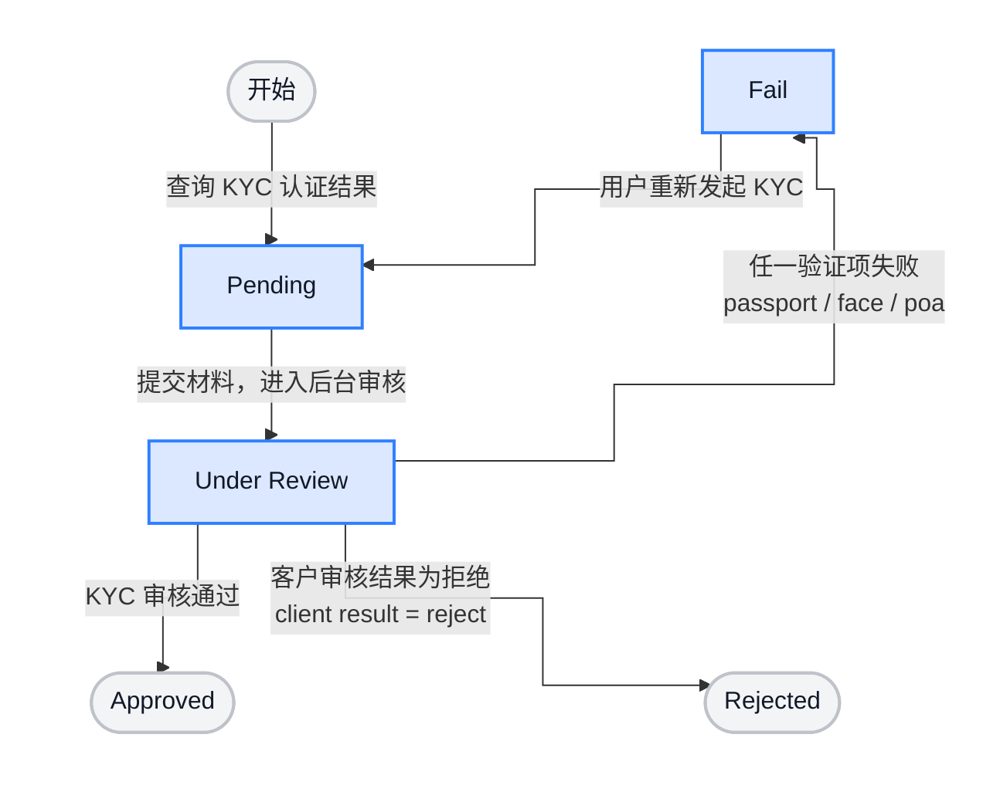
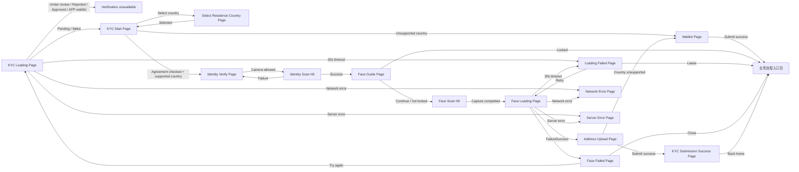

# Account Opening / KYC 开户与身份认证准入 PRD

> Source alignment note: 本文件已按 `archive/legacy-prd/kyc/wallet-opening/README.md` 做双向覆盖校验，并同步核对 Home 钱包面板、Card Application 申卡前置和 Security 身份认证支撑证据。

## 1. 文档信息

| 项目 | 内容 |
|---|---|
| 功能名称 | Account Opening / KYC 开户与身份认证准入 |
| 所属模块 | KYC |
| Owner | 吴忆锋 |
| 版本 | 1.2 |
| 状态 | Review |
| 更新时间 | 2026-05-04 |
| 来源文档 | AIX WALLET 钱包开户KYC需求V1.0；Master sub account 设计方案；DTC Wallet OpenAPI Document20260126（本轮未核验）；KYC 知识库评审意见；标准 PRD 模板 |
| 适用读者 | Product / UI / Dev / QA / Business / AI |
| 文档定位 | 本文既作为 KYC 运行时事实源，也按标准 PRD 模板沉淀产品范围、流程、页面、接口、异常、待确认事项、验收标准与测试场景。 |

---

## 2. 需求背景、目标与范围

### 2.1 背景

AIX 钱包要接入发卡、法币出入金、支付网络和托管账户等金融能力，必须通过 KYC 确认用户身份、居住地和地址证明符合准入要求。

### 2.2 目标

KYC 的核心目标是帮助 AIX 获得传统金融体系的接入许可，例如发卡机构、法币出入金通道、托管账户和支付网络等，并规避身份不明、地区限制、协议缺失、地址证明不完整等系统性合规风险。

本需求用于建立 AIX 钱包开户的 KYC 准入机制，为 Wallet、Deposit、Card、法币出入金等后续金融能力提供统一的合规准入基础。

### 2.3 涉及系统与模块范围

本节只说明范围边界；具体流程、页面、接口和异常规则见后续章节。

#### 2.3.1 涉及系统

KYC 由 AIX 客户端、AIX 服务端、DTC、AAI 协作完成。

| 系统 | 主要职责 |
|---|---|
| AIX 客户端 | 负责用户侧页面和交互。  主要包括：KYC 入口、国家选择、协议确认、证件识别入口、人脸验证入口、POA 上传、结果页和异常页。 |
| AIX 服务端 | 负责 KYC 流程编排和状态判断。  主要包括：国家准入、waitlist、外部接口调用、状态保存、错误码转换和结果返回。 |
| DTC | 提供外部开户和 KYC 结果能力。  主要包括：verification URL、`clientStatus`、POA 审核结果和 Sub Account 相关能力。 |
| AAI | 提供身份识别能力。  主要包括：Passport OCR、人脸识别 / 人脸比对、POA OCR 等识别结果。 |

#### 2.3.2 按用户开户链路拆分的模块

模块按用户完成开户 KYC 的顺序拆分，用来说明本文覆盖哪些产品能力。

| 模块 | 主要说明 |
|---|---|
| 入口与状态分流 | 用户进入 KYC 后，系统判断用户下一步去向。  可能结果包括：继续认证、展示结果、进入 waitlist、阻止继续。 |
| 居住国家与准入判断 | 用户选择或确认居住国家。  系统判断该国家是否支持开户。 |
| 协议确认 | 用户确认开户协议和 Reverse Solicitation Declaration。  系统保存确认结果，并用于后续开户入参。 |
| 证件识别 | 用户完成 Passport OCR。  系统根据识别结果决定继续流程，或返回失败原因。 |
| 人脸验证 | 用户完成活体采集和人脸比对。  系统处理成功、失败、重试、锁定和超时。 |
| 地址证明 | 用户上传 POA。  系统校验文件、识别地址信息，并判断居住国家是否匹配。 |
| 提交审核与结果处理 | 用户提交 KYC 后，系统同步外部审核结果。  系统维护 AIX / DTC 状态和最终 KYC 结果。 |
| 失败与异常处理 | 统一处理 KYC 过程中的异常结果。  主要包括：认证失败、网络异常、服务异常、超时、锁定和错误码文案。 |
| 结果通知边界 | 本文仅记录通知规则的待确认边界。  具体模板、渠道和补发策略不在本文展开。 |

---

## 3. 业务流程

本章只描述跨系统流程、状态流转与关键业务规则；页面展示、按钮、弹窗、toast、跳转等页面级交互统一见第 4 章。

### 3.1 业务时序图

```mermaid
sequenceDiagram
    autonumber
    participant APP as AIX 客户端
    participant BE as AIX 中后台
    participant DTC as DTCPay 服务端
    participant AAI as AAI 服务

    APP->>BE: 查询手机号绑定状态
    BE-->>APP: 返回手机号绑定状态

    alt 未绑定手机号
        APP->>APP: 跳转到绑定手机号页面
        APP->>APP: 用户完成绑定手机号流程
        APP->>APP: 展示 KYC Start Page
    else 已绑定手机号
        APP->>APP: 展示 KYC Start Page
    end

    APP->>BE: 查询用户当前 KYC 状态
    BE->>DTC: 查询 DTC KYC 认证结果
    Note over BE,DTC: GET /openapi/v1/ekyc/verification-result/{externalId}
    DTC-->>BE: 返回 clientStatus、Passport、Face、POA result
    BE->>BE: 更新 KYC 状态机

    alt KYC 状态为 Under review / Rejected / Approved
        BE-->>APP: 返回不可继续 KYC
        APP->>APP: 展示 Verification unavailable
    else KYC 状态为 pending / failed
        BE-->>APP: 返回可继续 KYC
        APP->>APP: 展示 KYC Start Page
        APP->>APP: 用户填写居住国家，点击下一步
    end

    APP->>BE: 请求 Passport 扫描地址
    BE->>DTC: 请求生成 Passport H5 URL
    Note over BE,DTC: POST /openapi/v1/ekyc/get-verification-url；verifyType = 1
    DTC->>AAI: 请求生成 Passport 扫描 H5 URL
    AAI-->>DTC: 返回 Passport 扫描 H5 URL
    DTC-->>BE: 返回 Passport H5 URL
    BE-->>APP: 返回 Passport H5 URL
    APP->>APP: 打开 H5 扫描页并扫描

    APP->>AAI: H5 内完成 Passport OCR
    AAI-->>DTC: 回传 OCR 信息 / Passport 信息
    DTC-->>BE: 同步 OCR 信息 / Passport 信息

    alt OCR 失败
        BE-->>APP: 返回 OCR 失败
        APP->>APP: 按 OCR 失败结果进入对应页面
    else OCR 完成
        BE->>BE: 按 Passport / Face 状态分流
    end

    alt passport = SUCCESS 且 face = UNVERIFIED / FAILURE
        BE-->>APP: 返回下一步为 Face Guide
        APP->>APP: 展示 Face Guide Page
        APP->>BE: 请求活体识别地址
        BE->>DTC: 请求生成活体 H5 URL
        Note over BE,DTC: POST /openapi/v1/ekyc/get-verification-url；verifyType = 4
        DTC->>AAI: 请求生成活体识别 H5 URL
        AAI-->>DTC: 返回活体识别 H5 URL
        DTC-->>BE: 返回活体 H5 URL
        BE-->>APP: 返回活体 H5 URL
        APP->>APP: 打开活体 H5，进入活体识别页
        APP->>AAI: 用户完成活体识别 / 人脸比对
        AAI-->>APP: 活体流程结束，返回 AIX 客户端
        APP->>APP: 展示 Loading Page
        AAI-->>DTC: 异步回传 Face result
        DTC-->>BE: 同步 Face result / webhook 结果
    else passport = VERIFYING 且 face = SUCCESS / FAILURE / VERIFYING
        BE-->>APP: 返回下一步为 Loading
        APP->>APP: 展示 Loading Page
    else passport = SUCCESS 且 face = VERIFYING
        BE-->>APP: 返回下一步为 Loading
        APP->>APP: 展示 Loading Page
    else Face 比对失败
        BE-->>APP: 返回人脸比对失败结果
        APP->>APP: 展示人脸比对失败页和失败信息
    end

    APP->>BE: Loading 中查询验证结果
    BE->>DTC: 查询 DTC KYC 认证结果
    Note over BE,DTC: GET /openapi/v1/ekyc/verification-result/{externalId}
    DTC-->>BE: 返回 Passport / Face 验证结果
    BE-->>APP: 返回验证结果

    alt passport result = VERIFY_SUCCESS 且 face result = VERIFY_SUCCESS
        APP->>APP: 展示 Address Upload Page
        APP->>APP: 上传 POA 文件
    else Face result = VERIFYING / 未返回
        APP->>APP: 继续展示 Loading Page
    else Face result = VERIFY_FAILURE / FAIL / EXPIRED / incomplete
        APP->>APP: 展示人脸比对失败页和失败信息
    else face = UNVERIFIED / 其他 result
        BE-->>APP: 返回失败或未完成结果
        APP->>APP: 按失败结果进入对应页面
    end

    APP->>BE: 上传 POA 文件
    Note over APP,BE: POST /openapi/v1/ekyc/upload
    BE->>DTC: 提交 POA 文件与居住地信息
    DTC->>AAI: 处理 POA 文件 / POA OCR
    AAI-->>DTC: 返回 POA OCR 结果
    DTC-->>BE: 返回 POA 处理结果
    BE-->>APP: 返回提交结果
    APP->>APP: 展示 Under review Page

    APP->>BE: 定时查询 KYC 结果
    BE->>DTC: 查询 DTC KYC 审核结果
    Note over BE,DTC: GET /openapi/v1/ekyc/verification-result/{externalId}
    DTC-->>BE: 返回 KYC 审核结果

    alt clientStatus = ACTIVATED
        BE->>BE: KYC 状态变更为 approved
        BE-->>APP: 返回 Approved
        BE->>BE: 触发 SMS / 邮件通知用户
    else clientStatus = REJECTED
        BE->>BE: KYC 状态变更为 rejected
        BE-->>APP: 返回 Rejected
        BE->>BE: 触发 SMS / 邮件通知用户
    else passportVerifyStatus = VERIFY_FAILURE 或 faceIdVerifyStatus = VERIFY_FAILURE 或 proofOfAddressVerifyStatus = VERIFY_FAILURE
        BE->>BE: KYC 状态变更为 failed
        BE->>DTC: 查询护照 OCR 信息
        Note over BE,DTC: GET /openapi/v1/ekyc/passport-info/{externalId}
        BE->>DTC: 查询 POA OCR 信息
        Note over BE,DTC: GET /openapi/v1/ekyc/poa-info/{externalId}
        DTC-->>BE: 返回护照 OCR 信息 / POA OCR 信息
        BE-->>APP: 返回 failed
    end
```

### 3.2 状态流转说明

> KYC 状态机图。

| AIX 状态 | DTC 来源 | 触发条件 | 用户表现 |
|---|---|---|---|
| `Pending` | - | 未完成或中断后可继续 | 进入对应节点 |
| `Under review` | `clientStatus = PENDING_KYC` | 已提交审核 | 等待结果，不可重复提交 |
| `Approved` | `clientStatus = ACTIVATED` | 审核通过 | 开户完成 |
| `Rejected` | `clientStatus = REJECTED` | 审核拒绝 | 流程终止 |
| `failed` | `verifyStatus = VERIFY_FAILURE` | Passport/Face/POA 任一失败 | 展示原因，可重试 |

## 4. 页面与交互说明

### 4.1 页面关系总览图

### 4.2 KYC Loading Page

进入 KYC 时先做状态判断。该页只负责分流，不承载资料填写。

<table>
  <tr>
    <th width="48%">页面</th>
    <th width="52%">说明</th>
  </tr>
  <tr>
    <td valign="top">
      
    </td>
    <td valign="top">
      
<strong>Loading 状态</strong>

      <ul>
        <li><strong>进入前提</strong>：用户从业务入口发起 KYC。</li>
        <li><strong>展示内容</strong>：展示 <code>loading...</code>。</li>
        <li><strong>系统处理</strong>：查询 KYC 状态和 waitlist 状态。
          <ul>
            <li>KYC 状态为 Pending / failed：进入 KYC Start 或后续未完成节点。</li>
            <li>KYC 状态为 Under review / Rejected / Approved：进入本页的 Verification unavailable 状态。</li>
            <li>用户在 waitlist 中，且来源渠道为 APP：进入本页的 Verification unavailable 状态，阻止继续 KYC。</li>
          </ul>
        </li>
      </ul>

      
<strong>Verification unavailable 状态</strong>

      <ul>
        <li><strong>触发前提</strong>：后端返回 KYC 状态机为 Under review / Rejected / Approved，或用户在 waitlist 中且来源渠道是 APP。</li>
        <li><strong>展示内容</strong>：展示不可继续认证说明和 <code>Back</code> 按钮。</li>
        <li><strong>用户操作</strong>：
          <ul>
            <li>点击 Back：返回业务入口。</li>
            <li>点击关闭：关闭当前 KYC 流程。</li>
          </ul>
        </li>
      </ul>

      
<strong>Loading 异常</strong>

      <ul>
        <li>网络异常：进入 Network Error Page。</li>
        <li>服务异常：进入 Server Error Page。</li>
        <li>30 秒无结果：进入 Loading Failed Page；细则见 <a href="#49-loading-failed-page">4.9 Loading Failed Page</a>。</li>
      </ul>
    </td>
  </tr>
</table>

关联：`KYC-LOADING-001 ~ KYC-LOADING-010`；Source：AIX KYC PRD 7.2.2。

---

### 4.3 KYC Start Page

用户在本页选择居住国家、确认协议，并通过底部认证按钮进入身份认证流程。

<table>
  <tr>
    <th width="48%">页面</th>
    <th width="52%">说明</th>
  </tr>
  <tr>
    <td valign="top">
      
    </td>
    <td valign="top">
      
<strong>居住国家 / 地区</strong>

      <ul>
        <li><strong>默认展示</strong>：默认值来自 IP 检测；检测不到时默认 SG。</li>
        <li><strong>点击国家区域</strong>：进入 Select Residence Country Page；国家选择细则见 <a href="#44-select-residence-country-page">4.4 Select Residence Country Page</a>。
          <ul>
            <li><strong>选择结果按国家 Type 判断</strong>：</li>
            <li>Type = Phase 1：返回本页；协议完成后可继续 KYC。</li>
            <li>Type = phase 2 - waitlist：返回本页；点击底部认证按钮后触发本页 Waitlist 拦截；拦截展示见 <a href="#432-拦截waitlist">4.3.2 拦截：Waitlist</a>，提交页细则见 <a href="#45-waitlist-page">4.5 Waitlist Page</a>。</li>
            <li>Type = Forbiden：国家列表隐藏，不可选择。</li>
          </ul>
        </li>
      </ul>
      
国家线存在版本口径冲突，见 <code>GAP-KYC-COUNTRY-001</code>。

      
<strong>协议区</strong>

      <ul>
        <li>Terms / Privacy：可直接勾选，无需强制阅读；需保存用户同意并提交的时间。</li>
        <li>Declaration：点击后打开 Declaration 弹窗 / 阅读页；完成规则见 <a href="#431-弹窗declaration-of-reverse-solicitation">4.3.1 弹窗：Declaration of Reverse Solicitation</a>。</li>
        <li>任一必选协议未完成：底部认证按钮灰色，不可点击。</li>
        <li>所有必选协议完成：底部认证按钮高亮，可点击。</li>
        <li>无法获取协议：Toast <code>Something went wrong. Please try again later</code>，不允许继续。</li>
      </ul>
      
<strong>底部认证按钮</strong>

      
原 PRD 中称 <code>立即认证 / Continue / Verify</code>，具体文案以 UI 为准。

      <ul>
        <li><strong>点击前提</strong>：所有必选协议完成。</li>
        <li><strong>点击后处理</strong>：
          <ul>
            <li>协议完成 + 国家 Type = Phase 1：保存协议相关信息，进入 Identity Verify；后续细则见 <a href="#46-identity-verify-page">4.6 Identity Verify Page</a>。</li>
            <li>协议完成 + 国家 Type = phase 2 - waitlist：不进入 Identity Verify，触发 waitlist 拦截；见 <a href="#432-拦截waitlist">4.3.2 拦截：Waitlist</a>。</li>
            <li>协议保存失败：不推进流程，应阻止继续；源文档未明确“勾选即保存”还是“点击底部认证按钮统一保存”，实现时需以后端接口约定为准。</li>
          </ul>
        </li>
      </ul>
      
<strong>入口边界</strong>

      <ul>
        <li>手机号已绑定：直接进入 Start Page，不展示额外绑定成功 toast。</li>
        <li>手机号未绑定：本页流程未确认，见 <code>GAP-KYC-PHONE-001</code>。</li>
      </ul>
    </td>
  </tr>
</table>

#### 4.3.1 弹窗：Declaration of Reverse Solicitation

<table>
  <tr>
    <th width="48%">页面</th>
    <th width="52%">说明</th>
  </tr>
  <tr>
    <td valign="top">
      
    </td>
    <td valign="top">
      
<strong>触发方式</strong>

      
用户在 KYC Start Page 点击 Declaration 协议项后展示。

      
<strong>弹窗内操作</strong>

      <ul>
        <li>点击 <code>I agree</code>：关闭弹窗，Declaration 变为已完成。</li>
        <li>关闭 / 返回：关闭弹窗，Declaration 不算完成，底部认证按钮仍按协议未完成处理。</li>
      </ul>
      
<strong>保存要求与边界</strong>

      <ul>
        <li>保存 Declaration 内容。</li>
        <li>保存用户同意时间。</li>
        <li>影响 DTC <code>reverseSolicitation</code> 入参。</li>
        <li>需要反向招揽声明的国家，应传 <code>reverseSolicitation=T</code>；缺失时 DTC 可能返回 <code>50013</code>。</li>
        <li>Reverse Solicitation 缺失：阻止生成验证 URL，需补声明后再继续；错误码细则见 <a href="#52-get-verification-url-错误码">5.2 get-verification-url 错误码</a>。</li>
      </ul>
    </td>
  </tr>
</table>

#### 4.3.2 拦截：Waitlist

<table>
  <tr>
    <th width="48%">页面</th>
    <th width="52%">说明</th>
  </tr>
  <tr>
    <td valign="top">
      
    </td>
    <td valign="top">
      
<strong>触发方式</strong>

      
用户在 KYC Start Page 点击底部认证按钮后，后端判断所选国家不支持继续 KYC。

      
<strong>拦截状态</strong>

      <ul>
        <li><strong>处理结果</strong>：不允许进入 Identity Verify。</li>
        <li><strong>用户操作</strong>：
          <ul>
            <li>点击 Join waitlist：进入 Waitlist Page；提交细则见 <a href="#45-waitlist-page">4.5 Waitlist Page</a>。</li>
            <li>返回：源文档未明确返回目标。当前仅确认用户不能进入 Identity Verify；返回 KYC Start 还是业务流程入口需以最新 UI / 产品确认为准。</li>
          </ul>
        </li>
      </ul>
      
<strong>展示边界</strong>

      
源文档同时出现“弹窗拦截”描述和“waitlist 调整为页面级拦截”的变更记录。当前文档只确认结果：用户不能继续 KYC，并可进入 Waitlist Page；具体展示形态以最新 UI 为准。

    </td>
  </tr>
</table>

协议快照需在提交成功后生成并与用户账户绑定。关联：`KYC-START-001 ~ KYC-START-010`；Source：AIX KYC PRD 7.2.3、Master sub account。

---

### 4.4 Select Residence Country Page

用于选择或修改居住国家。来源可能是 KYC Start，也可能是 Address Upload。

<table>
  <tr>
    <th width="48%">页面</th>
    <th width="52%">说明</th>
  </tr>
  <tr>
    <td valign="top">
      
        
      
    </td>
    <td valign="top">
      
<strong>默认国家列表状态</strong>

      <ul>
        <li><strong>进入前提</strong>：用户从 KYC Start 或 Address Upload 点击国家 / Residence 区域进入本页。</li>
        <li><strong>默认展示</strong>：
          <ul>
            <li>IP 可识别国家：默认展示 IP 国家。</li>
            <li>IP 不可识别国家：默认展示 SG。</li>
          </ul>
        </li>
        <li><strong>列表规则</strong>：
          <ul>
            <li>国家 / 地区按首字母排序。</li>
            <li>Type = Phase 1：展示，可选择。</li>
            <li>Type = phase 2 - waitlist：展示，可选择；后续进入 waitlist 判断。</li>
            <li>Type = Forbiden：隐藏。</li>
          </ul>
        </li>
      </ul>

      
<strong>搜索状态</strong>

      <ul>
        <li><strong>触发方式</strong>：用户输入关键词。</li>
        <li><strong>展示结果</strong>：展示匹配国家。</li>
        <li><strong>清空关键词</strong>：恢复默认国家列表。</li>
      </ul>

      
<strong>选择返回</strong>

      <ul>
        <li>从 KYC Start 进入：点击国家项后返回 KYC Start，并带回选择结果。</li>
        <li>从 Address Upload 进入：点击国家项后返回 Address Upload，并带回选择结果。</li>
        <li>点击关闭 / 返回：返回来源页面，不推进流程。</li>
      </ul>

      
国家线冲突见 <code>GAP-KYC-COUNTRY-001</code>。

    </td>
  </tr>
</table>

关联：`KYC-COUNTRY-001 ~ KYC-COUNTRY-009`；Source：AIX KYC PRD 7.2.3.1。

---

### 4.5 Waitlist Page

国家暂不支持开户时进入本页。用户不能继续 KYC，只能提交 waitlist 或返回。

<table>
  <tr>
    <th width="48%">页面</th>
    <th width="52%">说明</th>
  </tr>
  <tr>
    <td valign="top">
      
    </td>
    <td valign="top">
      
<strong>Email 输入区域</strong>

      <ul>
        <li><strong>输入校验</strong>：
          <ul>
            <li>邮箱为空：展示校验提示，不提交。</li>
            <li>邮箱格式错误：展示校验提示，不提交。</li>
            <li>邮箱长度超过 103 字符：展示校验提示，不提交。</li>
            <li>邮箱格式正确：可提交。</li>
          </ul>
        </li>
      </ul>

      
<strong>提交按钮</strong>

      <ul>
        <li><strong>点击前提</strong>：邮箱格式正确。</li>
        <li><strong>提交成功</strong>：按 userId 加入 waitlist，记录邮箱、国家、来源、提交时间、设备指纹，并推送数仓。</li>
        <li><strong>提交失败</strong>：
          <ul>
            <li>网络异常：Toast <code>Please check your internet connection and try again.</code></li>
            <li>后端服务器错误：Toast <code>Something went wrong. Please try again later</code></li>
          </ul>
        </li>
      </ul>

      
<strong>退出</strong>

      <ul>
        <li>点击关闭 / 返回：历史原文为“返回到业务流程入口页”。若用户从 KYC Start 的 waitlist 拦截进入本页，是否返回 KYC Start 还是业务流程入口，需以最新 UI / 产品确认为准。</li>
      </ul>

      
设备指纹获取失败策略源文档未确认，见 waitlist 数据边界。

    </td>
  </tr>
</table>

关联：`KYC-WAITLIST-001 ~ KYC-WAITLIST-010`；Source：AIX KYC PRD 7.2.3.2。

---

### 4.6 Identity Verify Page

证件认证入口页。App 负责引导和权限处理，外部 H5 负责护照扫描和 OCR。

<table>
  <tr>
    <th width="48%">页面</th>
    <th width="52%">说明</th>
  </tr>
  <tr>
    <td valign="top">
      
        
      
    </td>
    <td valign="top">
      
<strong>证件扫描入口</strong>

      <ul>
        <li><strong>点击相机 / 开始扫描</strong>：
          <ul>
            <li>有权限：请求 Passport H5 URL。</li>
            <li>相机未授权 / 永久拒绝：展示权限提示或引导开启权限。</li>
          </ul>
        </li>
        <li><strong>请求 H5 URL 失败</strong>：
          <ul>
            <li>DTC 返回 <code>01009</code>：Toast <code>Mobile number already exists.</code>，不进入 H5。</li>
            <li>DTC 返回 <code>01005</code>：Toast <code>The email address is in use.</code>，不进入 H5。</li>
            <li>DTC 返回其他 get-verification-url 错误：不进入 H5；错误码含义和已确认前端表现见 <a href="#52-get-verification-url-错误码">5.2 get-verification-url 错误码</a>，未明确前端文案的错误码需后端 / 产品确认。</li>
          </ul>
        </li>
      </ul>

      
<strong>后续流转</strong>

      <ul>
        <li>成功获取 H5 URL：进入 Identity Scan H5；细则见 <a href="#461-h5identity-scan-page">4.6.1 H5：Identity Scan Page</a>。</li>
        <li>Passport OCR 成功：进入 Face Guide Page；细则见 <a href="#47-face-guide-page">4.7 Face Guide Page</a>。</li>
        <li>Passport OCR 失败：源文档 7.2.5 明确“扫描失败：跳转至 Identity Verify Page”；如后端同时返回 Passport / Document Verification 错误原因，前端文案映射见 <a href="#53-错误码与前端文案映射">5.3 错误码与前端文案映射</a>。</li>
      </ul>
    </td>
  </tr>
</table>

#### 4.6.1 H5：Identity Scan Page

<table>
  <tr>
    <th width="48%">页面</th>
    <th width="52%">说明</th>
  </tr>
  <tr>
    <td valign="top">
      
    </td>
    <td valign="top">
      
<strong>H5 扫描状态</strong>

      <ul>
        <li><strong>进入前提</strong>：Identity Verify Page 成功获取 Passport H5 URL。</li>
        <li><strong>用户操作</strong>：在外部 H5 完成护照扫描和 Passport OCR。</li>
        <li><strong>处理结果</strong>：
          <ul>
            <li>用户完成护照扫描：等待 AAI / DTC 返回 OCR 结果。</li>
            <li>用户取消或返回 H5：返回 Identity Verify Page。</li>
            <li>Passport OCR 成功：进入 Face Guide Page；细则见 <a href="#47-face-guide-page">4.7 Face Guide Page</a>。</li>
            <li>Passport OCR 失败：返回 Identity Verify Page；如后端返回 Passport / Document Verification 错误原因，前端文案映射见 <a href="#53-错误码与前端文案映射">5.3 错误码与前端文案映射</a>。</li>
            <li>H5 URL 过期或不可用：源文档未明确自动重试策略。当前仅确认不能继续使用该 URL；是否重新请求 <code>get-verification-url</code> 或展示接口错误，需要以后端接口约定为准。</li>
          </ul>
        </li>
      </ul>
    </td>
  </tr>
</table>

关联：`get-verification-url(PASSPORT)`、`passportVerifyStatus`、`requestId`、`url`、`expireTime`；Source：AIX KYC PRD 7.2.4、7.2.5。

---

### 4.7 Face Guide Page

Passport OCR 成功后进入本页，用户从这里发起人脸活体认证。

<table>
  <tr>
    <th width="48%">页面</th>
    <th width="52%">说明</th>
  </tr>
  <tr>
    <td valign="top">
      
        
      
    </td>
    <td valign="top">
      
<strong>Continue 按钮</strong>

      <ul>
        <li><strong>点击前提</strong>：用户在 Face Guide Page 点击 Continue。</li>
        <li><strong>点击后判断</strong>：
          <ul>
            <li>未锁定：获取 passport country，请求 selfie / liveness H5 URL，并进入 Face Scan H5；细则见 <a href="#471-h5face-scan-page">4.7.1 H5：Face Scan Page</a>。</li>
            <li>已锁定：展示 Too many attempts，不进入 H5。</li>
          </ul>
        </li>
        <li><strong>异常</strong>：
          <ul>
            <li>网络异常：Toast <code>Please check your internet connection and try again.</code></li>
            <li>后端服务器错误：Toast <code>Something went wrong. Please try again later</code></li>
          </ul>
        </li>
      </ul>

      
<strong>锁定规则</strong>

      <ul>
        <li>24 小时内 face fail 5 次：锁 20 分钟。</li>
        <li>24 小时内 face fail 10 次：锁 24 小时。</li>
        <li>24 小时内接口层连续发起 20 次：锁 20 分钟。</li>
        <li>Face 验证成功：清零重新计算。</li>
      </ul>
    </td>
  </tr>
</table>

#### 4.7.1 H5：Face Scan Page

<table>
  <tr>
    <th width="48%">页面</th>
    <th width="52%">说明</th>
  </tr>
  <tr>
    <td valign="top">
      
    </td>
    <td valign="top">
      
<strong>H5 活体采集状态</strong>

      <ul>
        <li><strong>进入前提</strong>：Face Guide Page 成功获取 selfie / liveness H5 URL。</li>
        <li><strong>用户操作</strong>：在外部 H5 完成活体采集。</li>
        <li><strong>处理结果</strong>：
          <ul>
            <li>用户完成活体采集：返回 App，进入 Face Loading Page；细则见 <a href="#48-face-loading-page">4.8 Face Loading Page</a>。</li>
            <li>用户中断或返回 H5：源文档未明确 App 侧目标页。当前仅确认未完成活体采集时不能进入 Face Loading Page；返回 Face Guide Page、停留 H5 还是关闭流程，需以 AAI H5 返回协议和最新 UI 为准。</li>
            <li>AAI 同一 <code>signatureId</code> 重试 3 次后失效：重新 generate-url，生成新的 <code>signatureId</code>。</li>
            <li>网络 / 服务异常：源文档未明确 Face Scan H5 内异常的 App 展示形态。当前不能写死为错误页或 toast；需以 AAI H5 返回协议和 App 统一错误处理为准。</li>
          </ul>
        </li>
      </ul>
    </td>
  </tr>
</table>

关联：`get-verification-url(SELFIE / LIVENESS)`、face fail count、lock 状态；Source：AIX KYC PRD 7.2.6、7.2.7。

---

### 4.8 Face Loading Page

活体采集结束后进入本页，等待 face verification / face compare 结果。

<table>
  <tr>
    <th width="48%">页面</th>
    <th width="52%">说明</th>
  </tr>
  <tr>
    <td valign="top">
      
    </td>
    <td valign="top">
      
<strong>等待状态</strong>

      <ul>
        <li><strong>进入前提</strong>：Face Scan H5 完成活体采集并返回 App。</li>
        <li><strong>系统处理</strong>：等待 face verification / face compare 结果。</li>
        <li><strong>结果返回后</strong>：
          <ul>
            <li>Face 成功：进入 Address Upload Page；细则见 <a href="#411-address-upload-page">4.11 Address Upload Page</a>。</li>
            <li>Face 失败：进入 Face Failed Page；细则见 <a href="#410-face-failed-page">4.10 Face Failed Page</a>。</li>
            <li>30 秒无结果：进入 Loading Failed Page；细则见 <a href="#49-loading-failed-page">4.9 Loading Failed Page</a>。</li>
            <li>网络异常：进入 Network Error Page。</li>
            <li>系统异常：进入 Server Error Page。</li>
          </ul>
        </li>
      </ul>
    </td>
  </tr>
</table>

关联：`faceIdVerifyStatus`；Source：AIX KYC PRD 7.2.8。

---

### 4.9 Loading Failed Page

Face Loading 超过 30 秒仍无结果时展示。

<table>
  <tr>
    <th width="48%">页面</th>
    <th width="52%">说明</th>
  </tr>
  <tr>
    <td valign="top">
      
    </td>
    <td valign="top">
      
<strong>超时状态</strong>

      <ul>
        <li><strong>进入前提</strong>：Face Loading Page 超过 30 秒仍未收到结果。</li>
        <li><strong>展示内容</strong>：展示 Loading Failed 状态，并提供 Retry / Leave 操作。</li>
        <li><strong>用户操作</strong>：
          <ul>
            <li>点击 Retry：重新提交或重新查询 Face 结果，进入 Face Loading Page；细则见 <a href="#48-face-loading-page">4.8 Face Loading Page</a>。</li>
            <li>点击 Leave：返回业务入口，不继续等待。</li>
          </ul>
        </li>
        <li><strong>重试后结果</strong>：
          <ul>
            <li>重试后仍无结果：继续展示 Loading Failed。</li>
            <li>查询返回 Face 失败：进入 Face Failed Page；细则见 <a href="#410-face-failed-page">4.10 Face Failed Page</a>。</li>
            <li>查询返回网络 / 系统异常：源文档未明确 Loading Failed Retry 后的异常展示形态；需按 App 统一网络 / 系统错误处理确认。</li>
          </ul>
        </li>
      </ul>
    </td>
  </tr>
</table>

关联：`KYC-LOADING-FAILED-001 ~ KYC-LOADING-FAILED-010`；Source：AIX KYC PRD 7.2.9。

---

### 4.10 Face Failed Page

认证失败后的说明页，覆盖 Passport、Face、POA 的失败展示和重试限制。

<table>
  <tr>
    <th width="48%">页面</th>
    <th width="52%">说明</th>
  </tr>
  <tr>
    <td valign="top">
      
    </td>
    <td valign="top">
      
<strong>失败展示状态</strong>

      <ul>
        <li><strong>进入前提</strong>：Face / Passport / POA 返回失败结果。</li>
        <li><strong>展示规则</strong>：
          <ul>
            <li>Face result 为 FAIL / EXPIRED / incomplete：展示 Face Comparison 错误码映射中的前端提示文案；映射见 <a href="#face-comparison">5.3 Face Comparison</a>。</li>
            <li>POA 失败：展示 POA error code 映射中的前端提示文案；映射见 <a href="#poa">5.3 POA</a>。</li>
            <li>Passport / Document Verification 失败：展示 Passport / Document Verification 错误码映射中的前端提示文案；映射见 <a href="#passport--document-verification">5.3 Passport / Document Verification</a>。</li>
            <li>Passport 与 Face 均失败：验收标准要求优先展示 Passport 原因。</li>
            <li>多个失败原因同时存在但不属于上述明确优先级：优先级源文档未完全明确，需产品 / 后端确认。</li>
          </ul>
        </li>
      </ul>
      
<strong>用户操作</strong>

      <ul>
        <li>点击 Try again 且未锁定：重新触发 KYC 流程；当前流程图为 FaceFailed → Loading。</li>
        <li>点击 Try again 但已锁定：展示锁定提示，不允许重试。</li>
        <li>点击返回 / 关闭：历史原文为“返回到业务流程入口页”。是否存在返回上一流程节点的其他入口，源文档未明确。</li>
      </ul>
      
<strong>锁定说明</strong>

      <ul>
        <li>命中 5 次限制：展示 Too many attempts / 安全锁提示。</li>
        <li>命中 10 次限制：展示 Too many attempts / 安全锁提示。</li>
        <li>命中接口层 20 次限制：展示锁定提示。</li>
      </ul>
    </td>
  </tr>
</table>

关联：错误码映射见 5.3；`KYC-FACE-FAILED-001 ~ KYC-FACE-FAILED-010`；Source：AIX KYC PRD 7.2.10 / 9。

---

### 4.11 Address Upload Page

Face 成功后进入本页，用户确认居住国家并上传地址证明。

<table>
  <tr>
    <th width="48%">页面</th>
    <th width="52%">说明</th>
  </tr>
  <tr>
    <td valign="top">
      
        
      
        
      
        
      
    </td>
    <td valign="top">
      
<strong>Residence</strong>

      <ul>
        <li><strong>默认展示</strong>：回填 KYC 流程中已选择的居住国家。</li>
        <li><strong>点击 Residence</strong>：进入 Select Residence Country Page；选择国家后返回本页。</li>
        <li><strong>国家二次判断</strong>：
          <ul>
            <li>所选国家属于支持国家：继续 POA 提交流程。</li>
            <li>所选国家属于 phase 2 - waitlist / 不支持国家：展示本页 waitlist 拦截；见 <a href="#4111-拦截waitlist">4.11.1 拦截：Waitlist</a>。</li>
            <li>POA OCR 国家与用户填报居住国家不匹配：按 POA error code 映射展示文案；映射见 <a href="#poa">5.3 POA</a>。</li>
          </ul>
        </li>
      </ul>
      
<strong>文件上传区域</strong>

      <ul>
        <li><strong>选择文件</strong>：支持 JPG / JPEG / PNG / PDF，单文件不超过 16MB。</li>
        <li><strong>本地校验失败</strong>：
          <ul>
            <li>文件格式错误：Toast <code>Unsupported file type. Please upload a JPG, JPEG, PNG, or PDF file.</code></li>
            <li>文件超过 16MB：Toast <code>File size exceeds the 16MB limit. Please choose a smaller file.</code></li>
          </ul>
        </li>
        <li><strong>上传结果</strong>：
          <ul>
            <li>上传成功：文件进入待提交状态。</li>
            <li>上传服务器报错：Toast <code>Server busy. Upload failed. Please try again.</code></li>
          </ul>
        </li>
        <li>当前验收标准要求只能上传一份，上传中可取消，已上传可删除和预览。</li>
      </ul>
      
<strong>POA 提交</strong>

      <ul>
        <li><strong>点击提交前提</strong>：已上传合法 POA 文件，并完成居住国家确认。</li>
        <li><strong>提交成功</strong>：POA 文件和国家信息提交成功后，进入 KYC Submission Success Page；细则见 <a href="#412-kyc-submission-success-page">4.12 KYC Submission Success Page</a>。</li>
        <li><strong>提交失败 / 不可继续</strong>：
          <ul>
            <li>POA OCR 国家与用户填报居住国家不匹配：按 POA error code 映射展示文案；映射见 <a href="#poa">5.3 POA</a>。</li>
            <li>申请国家不属于支持国家 / 白名单：展示 waitlist 拦截；见 <a href="#4111-拦截waitlist">4.11.1 拦截：Waitlist</a>。</li>
            <li>POA 审核失败：记录失败原因，并按 POA error code 映射展示前端提示文案；映射见 <a href="#poa">5.3 POA</a>。</li>
            <li>POA 上传服务器报错：Toast <code>Server busy. Upload failed. Please try again.</code>，不进入 Success。</li>
            <li>POA 提交阶段网络 / 服务器异常：源文档未给出独立文案；需按 App 统一网络 / 系统错误处理确认。</li>
          </ul>
        </li>
      </ul>
      
POA 机审会 OCR 提取 POA 国家信息，核验其与用户填报居住国是否匹配，并校验申请国家是否属于白名单。

    </td>
  </tr>
</table>

#### 4.11.1 拦截：Waitlist

<table>
  <tr>
    <th width="48%">页面</th>
    <th width="52%">说明</th>
  </tr>
  <tr>
    <td valign="top">
      
    </td>
    <td valign="top">
      
<strong>触发方式</strong>

      
Address Upload 阶段二次判断国家不支持时展示。

      
<strong>拦截状态</strong>

      <ul>
        <li><strong>处理结果</strong>：用户不能继续提交当前国家的 POA。</li>
        <li><strong>用户操作</strong>：
          <ul>
            <li>点击 Join waitlist：进入 Waitlist Page；提交细则见 <a href="#45-waitlist-page">4.5 Waitlist Page</a>。</li>
            <li>点击 Select other country：进入 Select Residence Country Page；细则见 <a href="#44-select-residence-country-page">4.4 Select Residence Country Page</a>。</li>
          </ul>
        </li>
      </ul>
    </td>
  </tr>
</table>

关联：POA upload token、POA 文件上传、`proofOfAddressVerifyStatus`；文件限制：JPG / JPEG / PNG / PDF，单文件 16MB；Source：AIX KYC PRD 7.2.11。

---

### 4.12 KYC Submission Success Page

POA 提交成功后的完成页，只表示资料已提交，不代表 KYC 已审核通过。

<table>
  <tr>
    <th width="48%">页面</th>
    <th width="52%">说明</th>
  </tr>
  <tr>
    <td valign="top">
      
    </td>
    <td valign="top">
      
<strong>提交成功状态</strong>

      <ul>
        <li><strong>进入前提</strong>：Address Upload Page 的 POA 文件和国家信息提交成功。</li>
        <li><strong>展示内容</strong>：告知用户资料已提交，等待审核结果。</li>
        <li><strong>用户操作</strong>：
          <ul>
            <li>点击完成 / 返回入口：关闭 KYC 流程并返回业务入口。</li>
            <li>关闭页面：返回入口，等待审核结果。</li>
          </ul>
        </li>
      </ul>

      
<strong>状态边界</strong>

      <ul>
        <li>成功页不等同于 KYC Approved。</li>
        <li>成功页不代表 Wallet 能力全部可用。</li>
        <li>后续审核状态通过通知或业务入口状态感知；通知模板和触达规则当前未明确，见 <code>GAP-KYC-NOTIFICATION-001</code>。</li>
      </ul>
    </td>
  </tr>
</table>

关联：Under review、Approved、Rejected、failed；`KYC-SUCCESS-001 ~ KYC-SUCCESS-009`；Source：AIX KYC PRD 7.2.12。

## 5. 字段、接口与数据

### 5.1 字段 / 接口 / 数据总表

| 类型 | 名称 | 所属系统 | 来源 | 用途 | 规则 / 输入输出 | 异常处理 |
|---|---|---|---|---|---|---|
| 字段 | `externalId` | AIX / DTC | AIX 生成 / DTC 接口 | 关联用户 KYC 结果 | URL 生成、结果查询、OCR info、POA upload 均使用 | 格式错误返回 DTC `50004` |
| 字段 | `requestId` | DTC | DTC 返回 | 追踪单次认证请求 | URL 生成、webhook、POA upload 返回 | 缺失时无法定位请求，需后端处理 |
| 字段 | `clientStatus` | DTC | 查询结果 / webhook | 表示 DTC 客户状态 | 枚举见 3.4.2 | 与 AIX 页面状态映射待确认 |
| 字段 | `passportVerifyStatus` | DTC | 查询结果 / webhook | 表示护照认证状态 | 使用 EKycFileVerifyStatus | 失败时看 `passportVerifyCode` |
| 字段 | `faceIdVerifyStatus` | DTC | 查询结果 / webhook | 表示人脸认证状态 | 使用 EKycFileVerifyStatus | 失败时看 `faceIdVerifyCode` |
| 字段 | `proofOfAddressVerifyStatus` | DTC | 查询结果 / webhook | 表示 POA 审核状态 | 使用 EKycFileVerifyStatus | 失败时看 `proofOfAddressVerifyCode` |
| 字段 | `reverseSolicitation` | AIX / DTC | 协议确认 / DTC 接口 | 标记反向招揽声明 | 需要时传 `T`，否则空或 `F` | 缺失可能返回 `50013` |
| 数据 | 协议同意时间 | AIX | 用户勾选协议 | 合规留痕 | ToS / Privacy / Declaration 均需保存同意并提交时间 | 保存失败应阻止继续 |
| 数据 | Declaration 协议内容 | AIX | 用户强制阅读并同意 | 合规留痕 | 需要保存协议内容和同意时间 | 保存失败应阻止继续 |
| 数据 | 协议快照 | AIX | 提交成功 | 合规留痕 | 生成不可更改快照并与用户账户绑定 | 保存失败待后端确认 |
| 数据 | waitlist email | AIX | 用户输入 | waitlist 运营与通知 | 最长 103 字符，格式校验 | 空 / 格式错误提示 |
| 数据 | 设备指纹 ID | AIX | App / 设备 | waitlist 落库和数仓分析 | 与 userId、email、国家、来源、提交时间一并记录 | 获取失败策略待确认 |
| 接口 | `POST /openapi/v1/ekyc/get-verification-url` | DTC | Master sub account | 获取 Passport / Selfie H5 URL | 入参含 redirectUrl、externalId、type、country、language、email、mobile、reverseSolicitation | 错误码见 5.2 |
| 接口 | `GET /openapi/v1/ekyc/verification-result/{externalId}` | DTC | Master sub account | 查询 KYC 结果 | 返回 clientStatus、nationality、country、三类 verifyStatus/code | 查询失败按系统异常处理 |
| 接口 | `KYC_VERIFICATION` webhook | DTC | Master sub account | 异步同步 KYC 结果 | 返回 externalId、clientStatus、三类状态和 code、requestId | webhook 延迟时 query 兜底 |
| 接口 | `GET /openapi/v1/ekyc/passport-info/{externalId}` | DTC | Master sub account | 查询护照 OCR 信息 | 返回 fullName、idNumber、DOB、gender、nationality | 查询失败待后端处理 |
| 接口 | `GET /openapi/v1/ekyc/poa-info/{externalId}` | DTC | Master sub account | 查询 POA OCR 信息 | 返回 address、country、state、city、postal | 查询失败待后端处理 |
| 接口 | `POST /openapi/v1/file/get-upload-token` | DTC | Master sub account | 获取 POA 上传 token | documentType=3，externalId，需要签名 | token 5 分钟有效，只能用一次 |
| 接口 | `POST /openapi/v1/ekyc/upload-file` | DTC | Master sub account | 上传 POA 文件 | token、fileContent、countryOfResidence | 14004 / 14005 |
| 日志 / 埋点 | KYC 页面曝光与错误 | AIX | 当前文档未明确 | QA / 运营 / 风控分析 | 待确认是否需要埋点 | GAP 待补 |

### 5.2 `get-verification-url` 错误码

| errCode | 含义 | 处理建议 |
|---|---|---|
| `00010` | Invalid parameters | 参数错误，阻止继续 |
| `00025` | Services unavailable in country or region | 国家 / 地区不可用，进入 waitlist 或提示 |
| `01009` | Mobile number already exists | Toast：`Mobile number already exists.` |
| `01005` | The email address is in use | Toast：`The email address is in use.` |
| `01049` | Account is invalid | 展示账户不可用提示，具体页面待确认 |
| `50001` | Mobile number format invalid | 参数错误 |
| `50002` | Email format invalid | 参数错误 |
| `50003` | Country of residence format invalid | 参数错误 |
| `50004` | externalId format invalid | 参数错误 |
| `50005` | targetKycLevel format invalid | 参数错误 |
| `50006` | Mobile number exists | 参数 / 账户冲突 |
| `50007` | Applicant currently undergoing verification | 用户正在认证中，应进入不可重复提交或状态页 |
| `50008` | Email exists | 邮箱冲突 |
| `50013` | Reverse solicitation not declared by end user | 反向招揽未声明，应阻止继续并要求补声明 |
| `59999` | Internal error | 系统错误 |

### 5.3 错误码与前端文案映射

#### Passport / Document Verification

| code | AIX 前端提示文案 |
|---|---|
| `ID_FORGERY_DETECTED` | We couldn't verify this document. Please upload a valid document. |
| `NO_SUPPORTED_CARD` | This document type isn't supported. Please upload a valid document. |
| `CARD_TYPE_MISMATCH` | Document type doesn't match your selection. Please upload a valid document. |
| `CARD_LOW_QUALITY_IMAGE` | Image is too blurry or dark. Please upload a well-lit, clear photo. |
| `INCOMPLETED_CARD` | Document appears incomplete. Please ensure the full document is visible. |
| `CARD_INFO_MISMATCH` | Document doesn't match your submitted details. Please upload a valid document. |
| `TOO_MANY_CARDS` | Multiple documents detected. Please upload one at a time. |
| `CARD_NOT_FOUND` | No document detected. Please upload a clear image of your document. |
| `OCR_NO_RESULT` | Couldn't read your document. Please upload a clear image of your document. |
| `PARAMETER_ERROR` | Something went wrong. Please try again. |
| `USER_TIMEOUT` | Your session timed out. Please try again. |
| `ERROR` | Something went wrong. Please try again. |
| `NO_SUPPORTED_CARD_CUSTOMIZED` | This document type isn't supported. Please upload a valid document. |
| `NO_FACE_DETECTED` | No face detected on document. Please upload a clear image of your document. |
| `Duplicated` | This ID number has already been used. Please upload a different document. |
| `DEFAULT` | We couldn't verify this document. Please upload a clear image of your document. |

#### Face Comparison

| code | AIX 前端提示文案 |
|---|---|
| `NO_FACE_DETECTED_FROM_PASSPORT` | No face was detected in the passport image. Please upload a clear passport photo. |
| `NO_FACE_DETECTED_FROM_LIVENESS_DETECTION` | No face was detected during facial verification. Please ensure your face is clearly visible and try again. |
| `LOW_QUALITY_FACE_FROM_PASSPORT` | The face in the passport image is unclear. Please upload a clearer photo. |
| `LOW_QUALITY_FACE_FROM_LIVENESS_DETECTION` | The facial image quality is low. Please ensure good lighting and avoid movement. |
| `FACE_NOT_MATCH` | The facial scan does not match the passport photo. Please try again. |
| `ERROR` | The facial verification could not be completed at this time. Please try again later. |
| `DEFAULT` | The facial verification could not be completed. Please try again. |

#### POA

| code | AIX 前端提示文案 |
|---|---|
| `The identity document could not be verified` | The name on your proof of address does not match your submitted details. Please review and upload again. |
| `NOT_WITHIN_6_MONTHS` | Your proof of address must be issued within the last 6 months. Please upload a valid document. |
| `WRONG_DOCUMENT_TYPE` | This proof of address type is not accepted. Please upload a valid proof of address. |
| `OTHERS` | Your proof of address could not be verified. Please review and upload again. |
| `NOT_REQUIRED_NOT_RELEVANT` | The uploaded document is not a valid proof of address. Please upload an acceptable document. |
| `DUPLICATED` | A duplicate proof of address was detected. Please upload a different document. |
| `NOT_ACCEPTED` | Your proof of address was not accepted. Please upload a valid document. |
| `EXPIRED` | Your proof of address has expired. Please upload a valid and recent document. |
| `COUNTRY_OF_RESIDENCE_MISMATCH` | The country on your proof of address does not match your submitted details. Please review and upload again. |
| `DOCUMENT_UNCLEAR` | Your proof of address image is unclear. Please upload a clearer copy. |
| `EDITED_SCREENSHOT_NOT_ACCEPTED` | Edited or altered proof of address documents are not accepted. Please upload the original document. |
| `NOT_SUPPORTED_COUNTRY` | Proof of address documents from this country are not supported. Please upload a valid document. |
| `DUPLICATED_ID_NUMBER` | The identification number on your proof of address has already been used. Please review and upload a valid document. |
| `FRAUD_RISK` | Your proof of address could not be verified. Please ensure the information is accurate and upload again. |
| `PROOF_DOCUMENT_MATCHING_FAILED` | The information on your proof of address could not be matched. Please review and upload again. |
| `DATA_VERIFICATION_FAILED` | The details on your proof of address could not be verified. Please review and try again. |
| `DOCUMENT_INCOMPLETE` | Your proof of address is incomplete. Please ensure the full document is visible and upload again. |
| `POOR_IMAGE_QUALITY` | The image quality of your proof of address is too low. Please upload a clearer photo. |
| `DOCUMENT_EXPIRED` | Your proof of address has expired. Please upload a valid and recent document. |
| `DOCUMENT_UNSUPPORTED_OR_INVALID` | This proof of address document is not supported. Please upload a valid document. |
| `USER_SUBMISSION_FAILED` | Your proof of address submission could not be completed. Please try again. |
| `PROCESS_INCOMPLETE` | The proof of address verification process was not completed. Please try again. |
| `ADDRESS_NOT_FOUND` | The address on your proof of address could not be verified. Please upload a valid document. |
| `DEFAULT` | Your proof of address could not be verified. Please ensure it is clear and valid, then try again. |

---

## 6. 通知规则

历史文档中记录 KYC Approved / Rejected / Failed 可能触发 Email / in-app notification / push，但本轮附件未完整提供 Notification 模板、参数、跳转目标和失败补发策略。

| 触发事件 | 通知渠道 | 通知对象 | 文案 / 模板 | 跳转目标 | 失败 / 补发规则 |
|---|---|---|---|---|---|
| KYC Approved | Email / Push / In-app | KYC 用户 | 待 `common/notification.md` 或 Notification 原文确认 | 待确认 | ALL-GAP-045 / GAP-KYC-NOTIFICATION-001 |
| KYC Rejected | Email / Push / In-app | KYC 用户 | 待 `common/notification.md` 或 Notification 原文确认 | 待确认 | ALL-GAP-045 / GAP-KYC-NOTIFICATION-001 |
| KYC Failed | Email / Push / In-app | KYC 用户 | 待 `common/notification.md` 或 Notification 原文确认 | 待确认 | ALL-GAP-045 / GAP-KYC-NOTIFICATION-001 |

边界：KYC Approved 通知不等同于 DTC Sub Account 一定已创建成功，也不自动代表所有 Wallet 能力均可用。

---

---

## 12. Source alignment additions

### 12.1 KYC source rules confirmed

| 规则 | 结论 | 来源 |
|---|---|---|
| Waitlist | Waitlist 场景由弹窗提示调整为页面级拦截；被识别为 Waitlist 时停留在 Waitlist Page，不允许继续后续流程 | KYC changelog / Waitlist 处理方式 |
| Face Loading 超时 | Face Loading Page 等待超过 30 秒仍未收到检测结果，自动跳转 Face Loading Failed / Loading Failed Page | KYC changelog / 7.2.8 / 7.2.9 |
| Loading Failed Retry | 点击 Retry 后进入 Face Loading Page 重新提交，不返回 Face Scan | KYC / 7.2.9 |
| 申请单长期有效 | 申请单自创建后即长期有效；OCR、Face 等核心认证通过后，在 DTC 侧认证结果永久有效，不因时间推移失效 | KYC / 6.2 KYC状态机 |
| Passport / Face 成功不回退 | 只要 passport、face 认证通过，不会再变为失败状态 | KYC / 6.2 KYC状态机 |
| Face 失败锁定 | 24 小时内累计失败 5 次锁 20 分钟；累计失败 10 次锁 24 小时；接口层面连续发起 20 次锁 20 分钟，验证成功后清零 | KYC / 7.2.6 |
| Face 失败计数口径 | DTC 返回 face result=fail 才算失败，其他结果不算失败 | KYC / 7.2.6 |
| Face Failed 原因优先级 | passport 与 face 均失败时优先展示 passport 失败原因；POA 失败展示 POA error code 映射 | KYC / 7.2.10 |
| POA | AAI 机审提取 POA 资料，验证真实性、有效期，并校验 POA 国家与用户填报居住国是否匹配、申请国家是否白名单 | KYC / 7.2.11 |

### 12.2 Home wallet panel mapping

| KYC 状态 | Home 钱包区域展示 | 行为 | 来源 |
|---|---|---|---|
| 无开户记录 / Pending | 显示未申请开通钱包面板；KYC 为空无 Tips，Pending 显示剩余步骤 | 点击 Activate wallet 进入钱包开通页面 | Home / 钱包区域 |
| Under Review | 显示审核中面板，Tips title 为 Verification is under reviewing，进度为 3 Steps Finished | 首页进入时局部静默刷新 | Home / 钱包区域 |
| Failed | 显示审核失败面板，后端 passport / face / POA 失败按对应错误码映射展示；任一验证项失败可重新开户 | 点击 Reactivate Now 进入钱包开通页面 | Home / 钱包区域 |
| Rejected | 显示审核拒绝面板；因风险被 DTC 拒绝的用户会被拦截开户且隐藏激活钱包入口 | 不允许再次提交 | Home / 钱包区域 |
| Approved | 显示审核通过 / 资产面板，后端获取全量钱包余额并展示稳定币资产 | 进入 Wallet 资产页 | Home / 钱包区域 |

### 12.3 Card prerequisite mapping

| 规则 | 结论 | 来源 |
|---|---|---|
| 申卡前置 | 仅完成钱包开通、DTC 渠道开户、KYC 验证通过、刷脸 Token 有效、申卡 5 张以内的用户才能申请卡 | Card Application / 2.1 |
| KYC 与 Card 边界 | KYC 只维护开户 / 身份认证事实；卡申请、制卡费、卡类型和结果页由 card/application.md 维护 | Card Application |

### 12.4 Source boundaries

- Security 身份认证 PRD 是 KYC 的支撑证据，但 KYC 钱包开户流程中的 Passport / Face / POA 页面和错误码以 KYC 主 PRD 为准。
- 删除线内容不沉淀为 confirmed fact，例如部分旧 Face 空值文案和锁定弹窗历史文案。

## 13. 来源引用

- (Ref: archive/legacy-prd/kyc/wallet-opening/README.md / 需求变更日志 / 国家线 / 6.2 KYC 状态机 / 7.2 开户页面逻辑 / 8 外部接口依赖 / 9 接口错误码映射 / 10 待确认事项)
- (Ref: archive/legacy-prd/app/home/README.md / Home 钱包区域展示逻辑)
- (Ref: archive/legacy-prd/card/application/README.md / 申卡前置条件)
- (Ref: archive/legacy-prd/security/identity-verification/README.md / 身份认证支撑能力)
- (Ref: external-docs/dtc/Master sub account 设计方案 (2).docx / KYC 流程 / DTC API / Master Account / Sub Account / D-SUB-ACCOUNT-ID / POA 文件上传流程 / 失败原因)
- (Ref: DTC Wallet OpenAPI Document20260126 / WalletConnect Token / D-SUB-ACCOUNT-ID / WalletAccount：本轮未上传，相关内容仅保留历史来源提示，不作为本轮核验事实)
- (Ref: prd-template/standard-prd-template.md / 标准 PRD 模板)
- (Ref: knowledge-base/integrations/aai/_index.md)
- (Ref: knowledge-base/integrations/dtc/_index.md)
- (Ref: knowledge-base/common/notification.md：Notification 规则待核验)
- (Ref: knowledge-base/changelog/knowledge-gaps.md / ALL-GAP-030 ~ ALL-GAP-035 / ALL-GAP-045 / ALL-GAP-046)
- (Ref: 用户确认结论 / 2026-05-02 / KYC 文件名不应带 wallet；新主事实源改为 account-opening.md)
