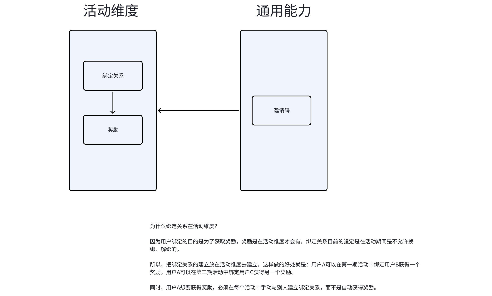
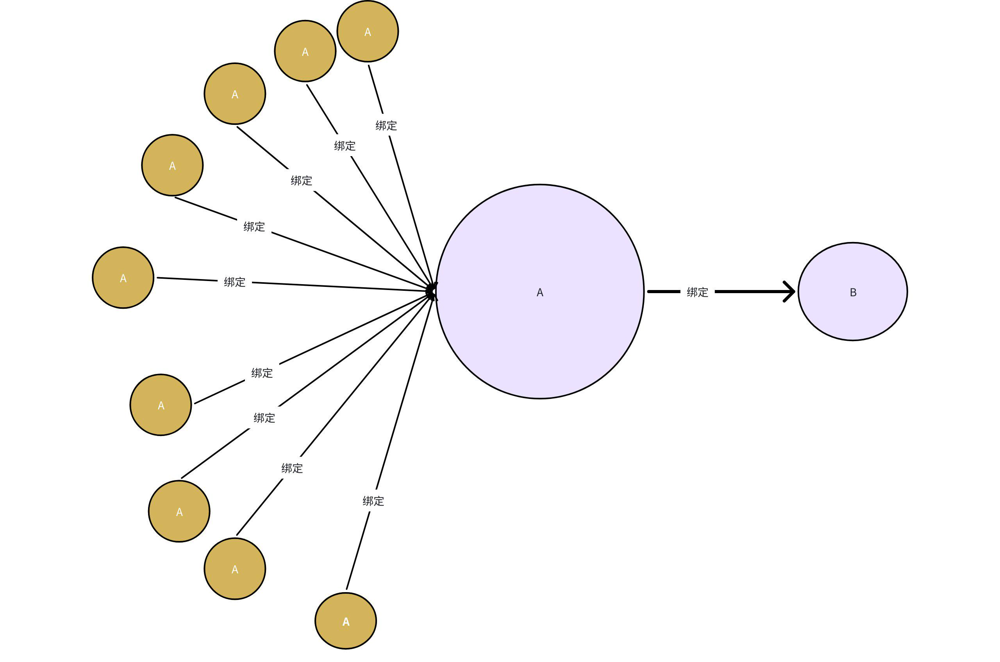
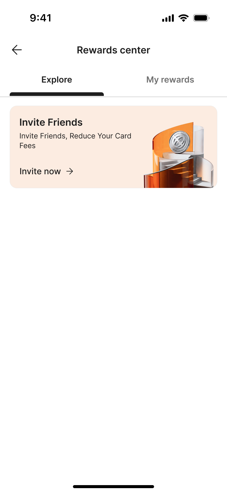
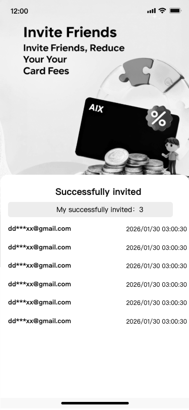
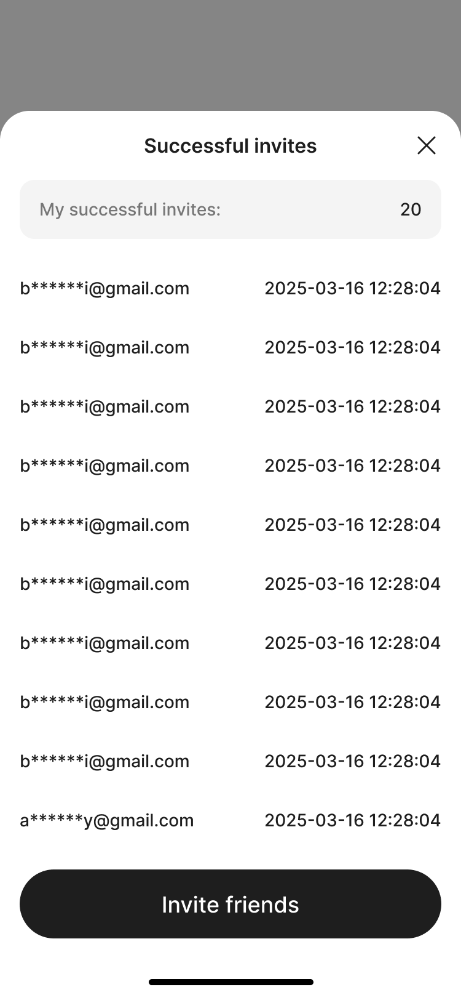
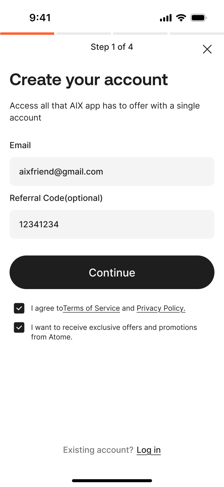
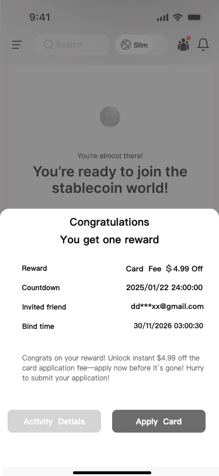
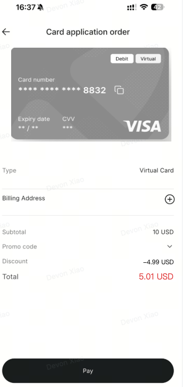

# MGM Referral Invite Code 页面图

## 1. 文档定位

本文件仅承接页面视觉素材，状态为 `visual_only`。这些内容不属于当前 runtime knowledge-base，不应作为 App runtime 业务事实直接引用。

## 2. Page Visuals 页面图

### 5. 整体框架

_Source: archive/legacy-prd/mgm/referral-invite-code/assets/media/image1.jpeg_

### 5. 整体框架

_Source: archive/legacy-prd/mgm/referral-invite-code/assets/media/image2.jpeg_

### 12. 需求描述

_Source: archive/legacy-prd/mgm/referral-invite-code/assets/media/image4.png_

### 12. 需求描述

_Source: archive/legacy-prd/mgm/referral-invite-code/assets/media/image5.png_

### 12. 需求描述

_Source: archive/legacy-prd/mgm/referral-invite-code/assets/media/image6.png_

### 12. 需求描述

_Source: archive/legacy-prd/mgm/referral-invite-code/assets/media/image7.png_

### 12. 需求描述

_Source: archive/legacy-prd/mgm/referral-invite-code/assets/media/image8.png_

### 12. 需求描述

_Source: archive/legacy-prd/mgm/referral-invite-code/assets/media/image9.png_

### 12. 需求描述

_Source: archive/legacy-prd/mgm/referral-invite-code/assets/media/image10.png_

### 12. 需求描述

_Source: archive/legacy-prd/mgm/referral-invite-code/assets/media/image11.png_

### 12. 需求描述

_Source: archive/legacy-prd/mgm/referral-invite-code/assets/media/image12.png_

### 12. 需求描述

_Source: archive/legacy-prd/mgm/referral-invite-code/assets/media/image13.png_

### 12. 需求描述

_Source: archive/legacy-prd/mgm/referral-invite-code/assets/media/image14.png_

### 12. 需求描述

_Source: archive/legacy-prd/mgm/referral-invite-code/assets/media/image15.png_

### 12. 需求描述

_Source: archive/legacy-prd/mgm/referral-invite-code/assets/media/image16.png_

### 12. 需求描述

_Source: archive/legacy-prd/mgm/referral-invite-code/assets/media/image17.png_

### 12. 需求描述

_Source: archive/legacy-prd/mgm/referral-invite-code/assets/media/image18.png_

### 12. 需求描述

_Source: archive/legacy-prd/mgm/referral-invite-code/assets/media/image19.png_

### 12. 需求描述

_Source: archive/legacy-prd/mgm/referral-invite-code/assets/media/image20.png_

### 12. 需求描述

_Source: archive/legacy-prd/mgm/referral-invite-code/assets/media/image21.png_

### 12. 需求描述

_Source: archive/legacy-prd/mgm/referral-invite-code/assets/media/image22.png_

### 12. 需求描述

_Source: archive/legacy-prd/mgm/referral-invite-code/assets/media/image23.png_

### 12. 需求描述

_Source: archive/legacy-prd/mgm/referral-invite-code/assets/media/image24.png_

### 12. 需求描述

_Source: archive/legacy-prd/mgm/referral-invite-code/assets/media/image25.png_

### 12. 需求描述

_Source: archive/legacy-prd/mgm/referral-invite-code/assets/media/image26.png_

### 12. 需求描述

_Source: archive/legacy-prd/mgm/referral-invite-code/assets/media/image27.png_

### 12. 需求描述

_Source: archive/legacy-prd/mgm/referral-invite-code/assets/media/image28.png_

### 12. 需求描述

_Source: archive/legacy-prd/mgm/referral-invite-code/assets/media/image29.png_

### 12. 需求描述

_Source: archive/legacy-prd/mgm/referral-invite-code/assets/media/image30.png_

### 12. 需求描述

_Source: archive/legacy-prd/mgm/referral-invite-code/assets/media/image31.png_

## 3. 使用规则

1. 这些图只用于查看非 runtime 页面长什么样。
2. 不得把本文件中的页面图反推为 App runtime 已确认业务规则。
3. 若未来这些模块纳入 runtime KB，应单独建立事实文档和规则校准任务。