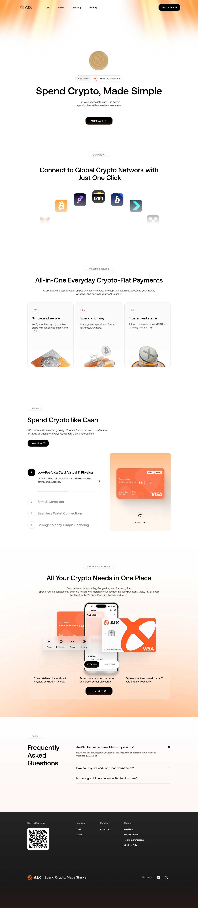
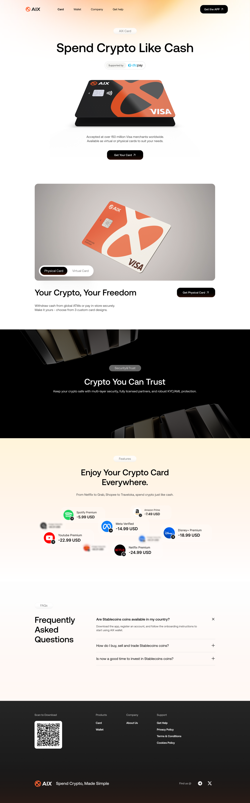
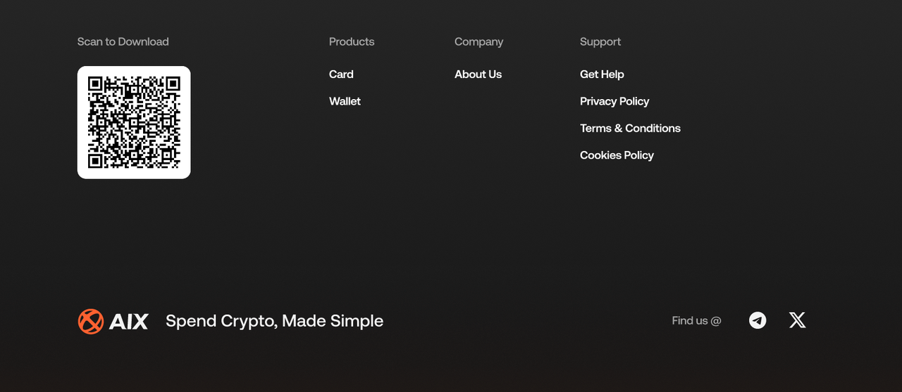
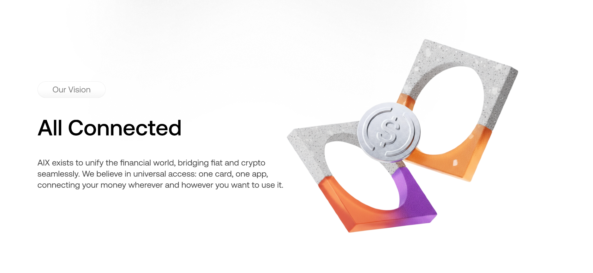

# OBoss Capabilities 页面图

## 1. 文档定位

本文件仅承接页面视觉素材，状态为 `visual_only`。这些内容不属于当前 runtime knowledge-base，不应作为 App runtime 业务事实直接引用。

## 2. Page Visuals 页面图

### 4. 需求描述

_Source: archive/converted-prd/oboss/capabilities/assets/media/image1.jpg_

### 4. 需求描述

_Source: archive/converted-prd/oboss/capabilities/assets/media/image2.png_

### 4. 需求描述

_Source: archive/converted-prd/oboss/capabilities/assets/media/image3.png_

### 4. 需求描述

_Source: archive/converted-prd/oboss/capabilities/assets/media/image4.png_

### 4. 需求描述

_Source: archive/converted-prd/oboss/capabilities/assets/media/image5.png_

### 4. 需求描述

_Source: archive/converted-prd/oboss/capabilities/assets/media/image6.png_

### 4. 需求描述

_Source: archive/converted-prd/oboss/capabilities/assets/media/image7.png_

### 4. 需求描述

_Source: archive/converted-prd/oboss/capabilities/assets/media/image8.png_

### 4. 需求描述

_Source: archive/converted-prd/oboss/capabilities/assets/media/image9.png_

### 4. 需求描述

_Source: archive/converted-prd/oboss/capabilities/assets/media/image10.png_

### 4. 需求描述

_Source: archive/converted-prd/oboss/capabilities/assets/media/image22.png_

### 4. 需求描述

_Source: archive/converted-prd/oboss/capabilities/assets/media/image23.png_

### 4. 需求描述

_Source: archive/converted-prd/oboss/capabilities/assets/media/image24.png_

### 4. 需求描述

_Source: archive/converted-prd/oboss/capabilities/assets/media/image25.png_

### 4. 需求描述

_Source: archive/converted-prd/oboss/capabilities/assets/media/image26.png_

### 4. 需求描述

_Source: archive/converted-prd/oboss/capabilities/assets/media/image27.png_

### 4. 需求描述

_Source: archive/converted-prd/oboss/capabilities/assets/media/image28.png_

### 4. 需求描述

_Source: archive/converted-prd/oboss/capabilities/assets/media/image29.png_

### 4. 需求描述

_Source: archive/converted-prd/oboss/capabilities/assets/media/image30.jpg_

### 4. 需求描述

_Source: archive/converted-prd/oboss/capabilities/assets/media/image31.png_

### 4. 需求描述

_Source: archive/converted-prd/oboss/capabilities/assets/media/image3.png_

### 4. 需求描述

_Source: archive/converted-prd/oboss/capabilities/assets/media/image32.png_

### 4. 需求描述

_Source: archive/converted-prd/oboss/capabilities/assets/media/image33.png_

### 4. 需求描述

_Source: archive/converted-prd/oboss/capabilities/assets/media/image34.png_

### 4. 需求描述

_Source: archive/converted-prd/oboss/capabilities/assets/media/image35.png_

### 4. 需求描述

_Source: archive/converted-prd/oboss/capabilities/assets/media/image36.png_

### 4. 需求描述

_Source: archive/converted-prd/oboss/capabilities/assets/media/image28.png_

### 4. 需求描述

_Source: archive/converted-prd/oboss/capabilities/assets/media/image37.jpg_

### 4. 需求描述

_Source: archive/converted-prd/oboss/capabilities/assets/media/image31.png_

### 4. 需求描述

_Source: archive/converted-prd/oboss/capabilities/assets/media/image3.png_

### 4. 需求描述

_Source: archive/converted-prd/oboss/capabilities/assets/media/image38.png_

### 4. 需求描述

_Source: archive/converted-prd/oboss/capabilities/assets/media/image39.png_

### Swap

_Source: archive/converted-prd/oboss/capabilities/assets/media/image40.png_

### 4. 需求描述

_Source: archive/converted-prd/oboss/capabilities/assets/media/image41.png_

### 4. 需求描述

_Source: archive/converted-prd/oboss/capabilities/assets/media/image42.png_

### 4. 需求描述

_Source: archive/converted-prd/oboss/capabilities/assets/media/image43.png_

### 4. 需求描述

_Source: archive/converted-prd/oboss/capabilities/assets/media/image44.png_

### 4. 需求描述

_Source: archive/converted-prd/oboss/capabilities/assets/media/image45.png_

### 4. 需求描述

_Source: archive/converted-prd/oboss/capabilities/assets/media/image46.png_

### 4. 需求描述

_Source: archive/converted-prd/oboss/capabilities/assets/media/image47.png_

### 4. 需求描述

_Source: archive/converted-prd/oboss/capabilities/assets/media/image48.png_

### 4. 需求描述

_Source: archive/converted-prd/oboss/capabilities/assets/media/image49.png_

### 4. 需求描述

_Source: archive/converted-prd/oboss/capabilities/assets/media/image50.png_

### 4. 需求描述

_Source: archive/converted-prd/oboss/capabilities/assets/media/image43.png_

## 3. 使用规则

1. 这些图只用于查看非 runtime 页面长什么样。
2. 不得把本文件中的页面图反推为 App runtime 已确认业务规则。
3. 若未来这些模块纳入 runtime KB，应单独建立事实文档和规则校准任务。