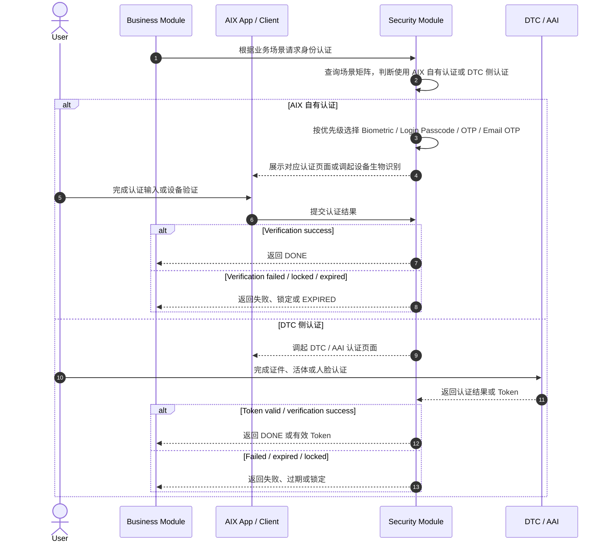

# Security 身份认证模块

## 1. 模块定位

Security 模块是 AIX 的身份认证公共能力层，用于沉淀 AIX 自有认证、设备生物识别、DTC / AAI 侧活体认证、认证场景矩阵、认证优先级、认证有效期和认证状态机。

Account、Wallet、Card、Transaction 等业务模块不得重复定义认证方式、认证优先级、认证失败次数、锁定规则和有效期；应引用本模块或其子文件。

## 2. 适用范围

| 维度 | 规则 | 来源 | 备注 |
|---|---|---|---|
| 国家线 | VN / PH / AU | AIX Security 身份认证需求V1.0 / 国家线 | 与 AIX 项目国家线一致 |
| 客户端接入 | AIX 客户端通过 H5 内嵌 WebView 接入身份认证服务与 DTC 身份核验服务 | AIX Security 身份认证需求V1.0 / 6 客户端对接方式 | 覆盖 AIX 自有认证与 DTC 身份核验 |
| AIX 自有认证 | OTP / Email OTP / Login Passcode / Biometric | AIX Security 身份认证需求V1.0 / 7.1 认证方式&限制 | 用于登录、BIO 授权、钱包地址、兑换、转账等场景 |
| DTC 侧认证 | Document Verification / Liveness Detection / Face Comparison / Face Authentication | AIX Security 身份认证需求V1.0 / 7.2 不同场景的验证方式 | 用于 KYC、提现、申卡、查看敏感卡信息、激活卡、PIN 等场景 |
| 认证状态 | INITIAL / VALIDATING / DONE / EXPIRED | AIX Security 身份认证需求V1.0 / 7.5 身份认证状态机 | DONE / EXPIRED 为终态 |

## 3. 前置条件

| 条件 | 说明 | 来源 |
|---|---|---|
| 业务场景已定义 | 调用认证前必须知道当前业务场景，例如登录、转账、申卡、查看敏感卡信息 | AIX Security 身份认证需求V1.0 / 7.2 |
| 认证方式按场景匹配 | 不同场景对应 DTC 或 AIX 自有认证方式 | AIX Security 身份认证需求V1.0 / 7.2 |
| 多选一场景按优先级选择 | 当前认证方式不满足条件时，系统自动跳过并进入下一优先级方式 | AIX Security 身份认证需求V1.0 / 7.3 |
| DTC 活体 Token 按 5 分钟窗口校验 | DTC 后端实际有效期 10 分钟，AIX 按返回的 5 分钟窗口校验 | AIX Security 身份认证需求V1.0 / 7.4 |

## 4. 功能清单

| 功能 | 文件 | 状态 | 说明 | 来源 |
|---|---|---|---|---|
| Security Global Rules | [global-rules.md](./global-rules.md) | 待重构 | 客户端接入方式、认证方式、场景矩阵、优先级、有效期、状态机、通用页面 | AIX Security 身份认证需求V1.0 / 6-7 |
| OTP Verification | [otp-verification.md](./otp-verification.md) | 待重构 | 短信 OTP Verify Page、输入规则、失败锁定、重发规则 | AIX Security 身份认证需求V1.0 / 8.2 |
| Email OTP Verification | [email-otp-verification.md](./email-otp-verification.md) | 待重构 | Email OTP Verify Page、邮箱掩码、输入规则、失败锁定、重发规则 | AIX Security 身份认证需求V1.0 / 8.3 |
| Login Passcode Verification | [login-passcode-verification.md](./login-passcode-verification.md) | 待重构 | 登录密码验证页、密码输入规则、失败锁定 | AIX Security 身份认证需求V1.0 / 8.4 |
| Biometric Verification | [biometric-verification.md](./biometric-verification.md) | 待重构 | iOS / Android 设备生物识别、Quick Login、BIO 失败处理 | AIX Security 身份认证需求V1.0 / 8.5 |
| Face Authentication | [face-authentication.md](./face-authentication.md) | 待重构 | DTC / AAI 侧活体识别、人脸比对、锁定、失败页 | AIX Security 身份认证需求V1.0 / 8.6 |
| API Reference | [api-reference.md](./api-reference.md) | 待重构 | 接口依赖、错误码映射 | AIX Security 身份认证需求V1.0 / 接口与错误码 |

## 5. 业务流程

### 5.1 主链路

```text
Business Scenario → Security Scenario Matrix → Authentication Method Selection → Challenge Created → Verification → DONE / EXPIRED
```

### 5.2 业务流程与系统交互时序图



### 5.3 业务逻辑矩阵

| 阶段 | 触发条件 | 系统动作 | 成功结果 | 失败结果 |
|---|---|---|---|---|
| 场景识别 | 业务模块发起认证 | 根据场景矩阵判断 DTC / AIX 认证方式 | 进入认证选择 | 场景未定义时记录缺口 |
| 方式选择 | AIX 自有认证场景 | 按优先级选择认证方式 | 展示或触发对应认证 | 条件不满足则跳过至下一优先级 |
| Challenge 创建 | 进入认证流程 | 生成验证挑战 | 状态进入 INITIAL / VALIDATING | 超时后 EXPIRED |
| 用户验证 | 用户输入验证码、密码或完成设备验证 | 校验认证结果 | DONE | 失败、锁定或过期 |
| Token 校验 | DTC 活体识别相关场景 | 按 5 分钟窗口判断是否免重认证 | 可复用 DTC Token | 过期后重新认证 |

## 6. 场景矩阵总览

| 场景 | DTC | AIX | 来源 |
|---|---|---|---|
| 注册 | ❌ | EMAIL_OTP | 7.2 不同场景的验证方式 |
| 登录 | ❌ | OTP / EMAIL_OTP / Login_PASSCODE / BIO | 7.2 不同场景的验证方式 |
| Biometric 授权 | ❌ | Login_PASSCODE | 7.2 不同场景的验证方式 |
| 绑定 / 更换手机号 | ❌ | OTP | 7.2 不同场景的验证方式 |
| 修改密码 | ❌ | Login_PASSCODE / OTP / IVS_DEVICE_BIOMETRICS | 7.2 不同场景的验证方式 |
| 忘记密码 | ❌ | OTP / EMAIL_OTP | 7.2 不同场景的验证方式 |
| 开户 + KYC | Document Verification / Liveness Detection / Face Comparison | ❌ | 7.2 不同场景的验证方式 |
| 钱包地址 | ❌ | OTP / EMAIL_OTP / IVS_DEVICE_BIOMETRICS | 7.2 不同场景的验证方式 |
| 充值 | ❌ | ❌ | 7.2 不同场景的验证方式 |
| 兑换 / 转账 | ❌ | OTP / EMAIL_OTP / IVS_DEVICE_BIOMETRICS | 7.2 不同场景的验证方式 |
| Crypto / Fiat Withdraw | Face Authentication | ❌ | 7.2 不同场景的验证方式 |
| 卡申请 / 激活卡 / 设置 PIN / 重置 PIN / 查看卡敏感信息 | Face Authentication | ❌ | 7.2 不同场景的验证方式 |
| 冻结卡 / 注销卡 | ❌ | ❌ | 7.2 不同场景的验证方式 |
| 解冻卡 | ❌ | OTP / IVS_DEVICE_BIOMETRICS | 7.2 不同场景的验证方式 |

## 7. 字段与接口依赖

| 字段 / 能力 | 用途 | 读/写 | 来源 | 备注 |
|---|---|---|---|---|
| authenticationType | 当前认证方式 | 读 | 7.1 认证方式&限制 | OTP / EMAIL_OTP / Login_PASSCODE / BIOMETRICS / Face Authentication |
| businessScenario | 当前业务场景 | 读 | 7.2 不同场景的验证方式 | 决定认证方式 |
| priority | 认证优先级 | 读 | 7.3 验证优先级 | Biometric → Login Passcode → OTP → Email OTP |
| challengeStatus | 验证状态 | 读 / 写 | 7.5 身份认证状态机 | INITIAL / VALIDATING / DONE / EXPIRED |
| challengeExpiresAt | Challenge 会话有效期 | 读 / 写 | 7.4 验证有效期说明 | 10 分钟 |
| credentialExpiresAt | 验证成功后凭证有效期 | 读 / 写 | 7.4 验证有效期说明 | 10 分钟 |
| dtcFaceToken | DTC 活体 Token | 读 / 写 | 7.4 验证有效期说明 | AIX 按 5 分钟窗口校验 |
| biometricLocalKey | 本地生物识别凭证 | 读 / 写 | 7.1 / 7.3 / 8.5 | BIO 可用性前置 |

## 8. 异常与失败处理

| 场景 | 触发条件 | 用户提示 / 系统动作 | 最终状态 | 来源 |
|---|---|---|---|---|
| AIX 自有认证失败 | OTP / Email OTP / Passcode 验证失败 | 按对应认证子文件处理失败、剩余次数、锁定 | 继续尝试 / 锁定 / 退出 | 8.2 / 8.3 / 8.4 |
| BIO 设备失败 | 设备端生物识别失败 | 前端按 BIO 子文件处理；可能清除本地 BIO 信息并关闭 BIO 开关 | BIO 不可用或回到登录页 | 8.5 |
| DTC 认证失败 | 活体、人脸或相关认证失败 | 进入对应失败页或返回业务流程入口 | 失败 / 可重试 / 锁定 | 8.6 |
| Challenge 过期 | 10 分钟内未完成验证 | Challenge 自动失效，需重新发起认证 | EXPIRED | 7.4 / 7.5 |
| DTC Token 过期 | 超过 AIX 5 分钟校验窗口 | 需重新活体认证 | 重新认证 | 7.4 |
| 账户被拦截 | 账户 Banned，无法发起身份认证流程 | Account interception popup，关闭后留在当前页 | 阻止认证 | 7.6.3 |

## 9. 风控 / 合规边界

| 边界 | 规则 | 影响 | 来源 |
|---|---|---|---|
| 认证方式不可重复定义 | 业务模块只能引用 Security，不得自行定义认证方式 | 防止规则分裂 | IMPLEMENTATION_PLAN.md / 阶段 3 |
| 失败锁定 | OTP / Email OTP / Login Passcode / Face Authentication 均有失败次数和锁定规则 | 防暴力破解与风险控制 | 7.1 认证方式&限制 |
| 场景矩阵 | 不同业务场景使用不同认证方式 | 决定 Card / Wallet / Account 的认证入口 | 7.2 不同场景的验证方式 |
| DTC 活体有效期 | AIX 按 5 分钟窗口校验 DTC Token | 影响申卡、提现、卡敏感信息、PIN 等场景免重认证 | 7.4 验证有效期说明 |
| AIX 自有认证无缓存 | 每次操作均需重新认证 | 影响钱包地址、兑换、转账、解冻卡等场景 | 7.4 验证有效期说明 |
| Challenge 状态闭环 | INITIAL / VALIDATING / DONE / EXPIRED 必须闭环 | 防止认证状态不可追踪 | 7.5 身份认证状态机 |

## 10. 来源引用

- (Ref: 历史prd/AIX Security 身份认证需求V1.0 (1).docx / 6 客户端对接方式 / V1.0)
- (Ref: 历史prd/AIX Security 身份认证需求V1.0 (1).docx / 7.1 认证方式&限制 / V1.0)
- (Ref: 历史prd/AIX Security 身份认证需求V1.0 (1).docx / 7.2 不同场景的验证方式 / V1.0)
- (Ref: 历史prd/AIX Security 身份认证需求V1.0 (1).docx / 7.3 验证优先级 / V1.0)
- (Ref: 历史prd/AIX Security 身份认证需求V1.0 (1).docx / 7.4 验证有效期说明 / V1.0)
- (Ref: 历史prd/AIX Security 身份认证需求V1.0 (1).docx / 7.5 身份认证状态机 / V1.0)
- (Ref: 历史prd/AIX Security 身份认证需求V1.0 (1).docx / 7.6 通用页面 / V1.0)
- (Ref: knowledge-base/security/global-rules.md)
- (Ref: knowledge-base/security/otp-verification.md)
- (Ref: knowledge-base/security/email-otp-verification.md)
- (Ref: knowledge-base/security/login-passcode-verification.md)
- (Ref: knowledge-base/security/biometric-verification.md)
- (Ref: knowledge-base/security/face-authentication.md)
