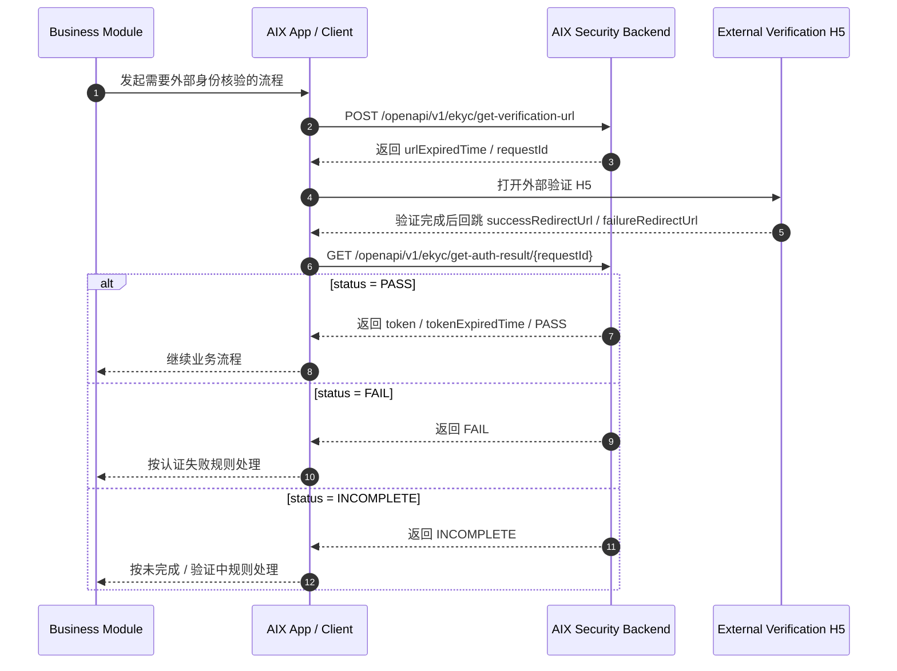
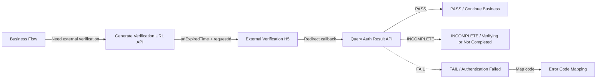

# Security API Reference 外部接口依赖与错误码映射

## 1. 功能定位

Security API Reference 用于沉淀 AIX Security 模块当前已明确的外部接口、请求字段、响应字段、认证结果状态和错误码映射。

本文件只整理原始 PRD 已明确的信息，不补充未给出的接口字段、接口地址、错误码或系统实现。未明确内容统一记录到 `knowledge-base/changelog/knowledge-gaps.md`。

## 2. 适用范围

| 维度 | 规则 | 来源 | 备注 |
|---|---|---|---|
| 模块 | Security 身份认证 | AIX Security 身份认证需求V1.0 / 9-10 | 仅覆盖 Security 接口引用 |
| 接口类型 | 生成验证 URL、查询验证结果 | AIX Security 身份认证需求V1.0 / 9.1 | 用于 DTC / AAI 侧身份核验链路 |
| 错误码 | PRD 已列出的错误码映射 | AIX Security 身份认证需求V1.0 / 10.1 | 原文标题为 passport error code，但错误码内容包含活体 / 人脸相关码 |
| 不覆盖 | OTP / Email OTP / Login Passcode 的具体发送与验证接口 | AIX Security 身份认证需求V1.0 / 9-10 | 原文未列出，不补写 |

## 3. 前置条件

| 条件 | 说明 | 来源 |
|---|---|---|
| 业务场景需要 DTC / AAI 侧身份核验 | 例如 Face Authentication 或 KYC 类流程 | AIX Security 身份认证需求V1.0 / 7.2 / 8.6 |
| 客户端需要拿到验证 URL | 调用生成 URL 接口后打开对应 H5 页面 | AIX Security 身份认证需求V1.0 / 9.1.1 |
| 客户端或后端需要按 requestId 查询结果 | 查询验证结果接口使用 requestId | AIX Security 身份认证需求V1.0 / 9.1.2 |
| 接口缺口需单独记录 | 原文未明确的字段含义、接口地址或错误码不在正文补全 | knowledge-gaps.md / Security API Reference |

## 4. 业务流程

### 4.1 主链路

```text
Business Flow → Generate Verification URL → External Verification H5 → Query Auth Result by requestId → PASS / FAIL / INCOMPLETE
```

### 4.2 业务流程与系统交互时序图



### 4.3 业务逻辑矩阵

| 阶段 | 触发条件 | 接口 / 系统动作 | 成功结果 | 失败 / 未完成结果 |
|---|---|---|---|---|
| 生成 URL | 业务进入外部身份核验 | 调用 `[POST] /openapi/v1/ekyc/get-verification-url` | 返回 `urlExpiredTime` 与 `requestId` | 原文未列出失败字段 |
| 外部验证 | 客户端打开验证 H5 | 使用 success / failure redirect URL 承接回跳 | 回跳后可查询结果 | 原文未列出回跳错误码 |
| 查询结果 | 按 `requestId` 查询 | 调用 `[GET] /openapi/v1/ekyc/get-auth-result/{requestId}` | `PASS` 时返回 `token` | `INCOMPLETE` / `FAIL` 按认证失败或未完成处理 |
| 错误码映射 | 外部验证返回错误码 | 前端展示 AIX 映射文案 | 用户理解失败原因 | 未列出的错误码走兜底文案 |

## 5. 页面关系总览

本文件不定义独立页面，只表达接口与外部 H5 / 业务流程的关系。



## 6. 页面卡片与交互规则

### 6.1 API 触发点

| 接口 | 触发点 | 交互结果 | 来源 |
|---|---|---|---|
| Generate Verification URL | 业务流程需要外部身份核验 | 客户端获取验证 URL 并打开外部 H5 | 9.1.1 |
| Query Auth Result | 外部验证回跳或业务需要查询认证结果 | 通过 `requestId` 查询认证结果状态 | 9.1.2 |

### 6.2 错误文案展示

| 场景 | 展示规则 | 来源 |
|---|---|---|
| 命中已配置错误码 | 展示 AIX 映射前端提示文案 | 10.1 |
| 未命中错误码 | 展示 DEFAULT 兜底文案 | 10.1 |

## 7. 字段与接口依赖

### 7.1 Generate Verification URL

| 项 | 内容 |
|---|---|
| Method | POST |
| Path | `/openapi/v1/ekyc/get-verification-url` |
| 来源 | AIX Security 身份认证需求V1.0 / 9.1.1 |

请求参数：

| 字段 | 类型 | 必填 | 说明 | 来源 |
|---|---|---|---|---|
| `query.successRedirectUrl` | string | 是 | 验证成功后跳转的回调 URL | 9.1.1 |
| `query.failureRedirectUrl` | string | 是 | 验证失败后跳转的回调 URL | 9.1.1 |
| `tokenAuthType` | string | 是 | 原文未给出说明 | 9.1.1 |

响应字段：

| 字段 | 类型 | 必填 | 说明 | 来源 |
|---|---|---|---|---|
| `urlExpiredTime` | string | 是 | URL 过期时间 | 9.1.1 |
| `requestId` | string | 是 | 用于获取验证结果 | 9.1.1 |

### 7.2 Query Auth Result

| 项 | 内容 |
|---|---|
| Method | GET |
| Path | `/openapi/v1/ekyc/get-auth-result/{requestId}` |
| 来源 | AIX Security 身份认证需求V1.0 / 9.1.2 |

请求参数：

| 字段 | 类型 | 必填 | 说明 | 来源 |
|---|---|---|---|---|
| `requestId` | string | 是 | 用于查询验证结果 | 9.1.2 |

响应字段：

| 字段 | 类型 | 说明 | 来源 |
|---|---|---|---|
| `token` | string | 验证成功时才会返回 | 9.1.2 |
| `tokenExpiredTime` | string | token 过期时间 | 9.1.2 |
| `status` | string | INCOMPLETE / PASS / FAIL | 9.1.2 |

认证状态：

| 状态 | 含义 | 来源 |
|---|---|---|
| `INCOMPLETE` | 包含未验证和验证中 | 9.1.2 |
| `PASS` | 成功 | 9.1.2 |
| `FAIL` | 失败，需要重新生成 URL | 9.1.2 |

### 7.3 外部接口地址

原文仅写明：`Master sub account 设计方案`。未给出可结构化接口地址或字段。

## 8. 异常与失败处理

| 场景 | 触发条件 | 用户提示 / 系统动作 | 最终状态 | 来源 |
|---|---|---|---|---|
| 查询结果为 INCOMPLETE | `status = INCOMPLETE` | 按调用业务的未完成 / 验证中规则处理 | 认证未完成 | 9.1.2 |
| 查询结果为 PASS | `status = PASS` | 返回 token，继续业务流程 | 认证成功 | 9.1.2 |
| 查询结果为 FAIL | `status = FAIL` | 失败，需要重新生成 URL | 认证失败 | 9.1.2 |
| 命中错误码 | 外部验证返回已配置错误码 | 展示 AIX 映射前端提示文案 | 失败可解释 | 10.1 |
| 未命中错误码 | 错误码未配置或无法识别 | 展示 DEFAULT 兜底文案 | 失败可解释 | 10.1 |

## 9. 风控 / 合规边界

| 边界 | 规则 | 影响 | 来源 |
|---|---|---|---|
| requestId 可追溯 | 查询验证结果依赖 `requestId` | 认证结果可查询、可追踪 | 9.1.1 / 9.1.2 |
| token 仅成功返回 | `token` 仅在验证成功时返回 | 防止失败或未完成场景继续业务 | 9.1.2 |
| FAIL 需重新生成 URL | `FAIL` 状态说明需要重新生成 URL | 防止复用失败会话 | 9.1.2 |
| 错误码映射 | 已知错误码必须映射为前端提示文案 | 提升失败可解释性 | 10.1 |
| 接口缺口不可补写 | 原文未明确的字段、错误码、接口地址不得作为事实写入 | 防止工程实现误导 | IMPLEMENTATION_PLAN.md / writing-standard.md |

### 9.1 错误码映射

| API 错误码 | 解释 | AIX 映射前端提示文案 | 来源 |
|---|---|---|---|
| `LIVENESS_ATTACK` | 检测到活体攻击风险 / 疑似非真人操作 | `Liveness verification failed. Please try again in a well-lit environment.` | 10.1 |
| `SIMILARITY_FAILED` | 人脸比对失败 / 与证件照不一致 | `Face verification failed. Please make sure your face matches your ID photo.` | 10.1 |
| `UNABLE_GET_IMAGE` | 未获取到有效人脸图片 | `Unable to capture a clear face image. Please try again.` | 10.1 |
| `PARAMETER_ERROR` | 请求参数异常 | `Face verification could not be completed at this time. Please try again later.` | 10.1 |
| `USER_TIMEOUT` | 用户超时 | `Face verification timed out. Please try again.` | 10.1 |
| `RETRY_COUNT_REACH_MAX` | 重试次数已达上限 | `You have reached the maximum number of attempts. Please try again later.` | 10.1 |
| `FACE_QUALITY_TOO_POOR` | 人脸图片质量过低 | `Face image quality is too poor. Please try again in better lighting.` | 10.1 |
| `ERROR` | 通用错误 | `Face verification could not be completed at this time. Please try again later.` | 10.1 |
| `DEFAULT` | 兜底文案 | `The identity document could not be verified. Please ensure it is valid and try again.` | 10.1 |

## 10. 来源引用

- (Ref: 历史prd/AIX Security 身份认证需求V1.0 (1).docx / 9.1 外部接口清单 / V1.0)
- (Ref: 历史prd/AIX Security 身份认证需求V1.0 (1).docx / 9.1.1 生成url / V1.0)
- (Ref: 历史prd/AIX Security 身份认证需求V1.0 (1).docx / 9.1.2 查询验证结果 / V1.0)
- (Ref: 历史prd/AIX Security 身份认证需求V1.0 (1).docx / 9.2 外部接口地址 / V1.0)
- (Ref: 历史prd/AIX Security 身份认证需求V1.0 (1).docx / 10.1 passport error code / V1.0)
- (Ref: knowledge-base/security/_index.md)
- (Ref: knowledge-base/security/face-authentication.md)
- (Ref: knowledge-base/changelog/knowledge-gaps.md / Security API Reference / 2026-05-01)
