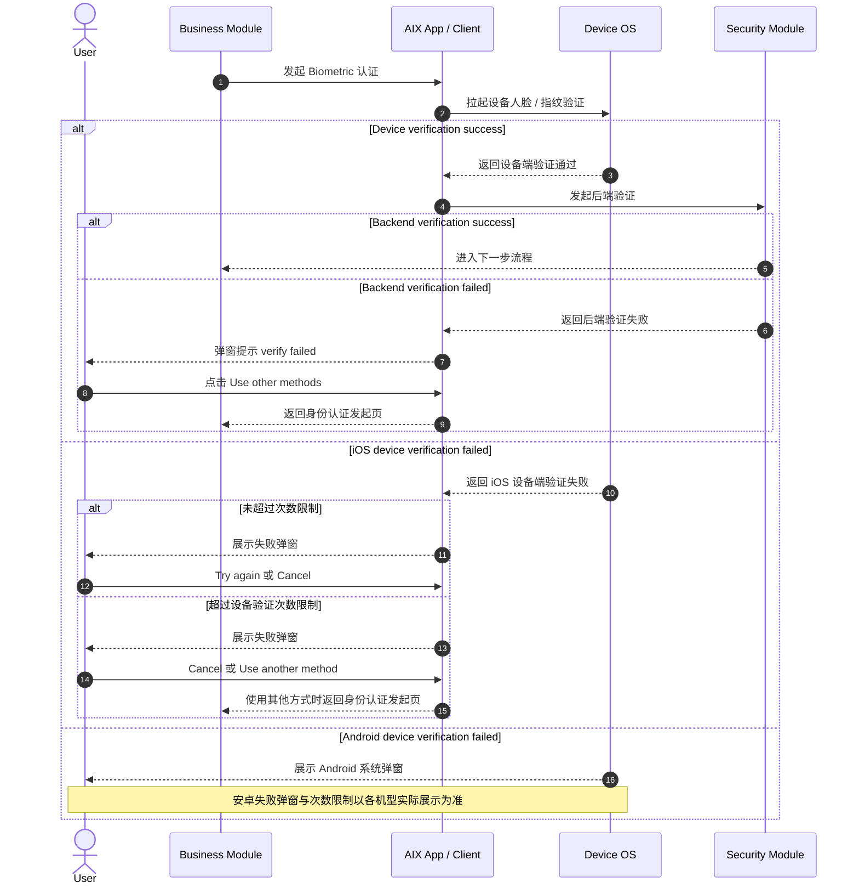
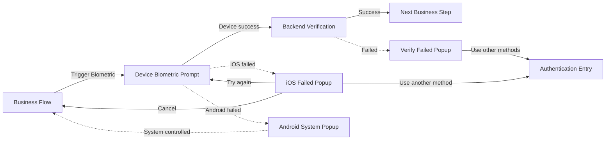

# Biometric Verification 设备生物识别认证

## 1. 功能定位

Biometric Verification 用于拉起用户设备侧的人脸、指纹等系统生物识别能力，并在设备端验证通过后继续进行后端验证。

本文件只沉淀设备生物识别认证流程、iOS / Android 平台差异、失败处理和返回身份认证发起页规则。DTC / AAI 侧活体识别、人脸比对与 Face Authentication 不在本文定义。

## 2. 适用范围

| 维度 | 规则 | 来源 | 备注 |
|---|---|---|---|
| 认证方式 | Biometric | AIX Security 身份认证需求V1.0 / 7.1 | 设备生物识别 |
| 安全类型 | 你本人的 | AIX Security 身份认证需求V1.0 / 7.1 | Possession / inherence 类能力 |
| 设备能力 | 设备人脸 / 指纹等 | AIX Security 身份认证需求V1.0 / 7.1 / 8.5 | 由用户设备系统能力决定 |
| 失败次数 | 无统一失败次数限制 | AIX Security 身份认证需求V1.0 / 7.1 / 8.5 | iOS 可控制；Android 依据系统 |
| 失败后处理 | 前端返回失败后，禁用该功能至用户重新授权 | AIX Security 身份认证需求V1.0 / 7.1 | Global Rules 公共限制 |
| 平台差异 | iOS 可控制校验次数；Android 可尝试次数依据系统 | AIX Security 身份认证需求V1.0 / 8.5 | Android 弹窗以机型实际展示为准 |

## 3. 前置条件

| 条件 | 说明 | 来源 |
|---|---|---|
| 当前业务场景允许 Biometric | 是否使用 Biometric 由 Security 场景矩阵和认证优先级决定 | AIX Security 身份认证需求V1.0 / 7.2 / 7.3 |
| 本地生物识别凭证未被清除 | Biometric 优先级条件要求前端未清除本地生物识别凭证 | AIX Security 身份认证需求V1.0 / 7.3 |
| 设备支持并已授权生物识别 | 设备端需能够拉起人脸 / 指纹验证 | AIX Security 身份认证需求V1.0 / 7.1 / 8.5 |

## 4. 业务流程

### 4.1 主链路

```text
Business Flow → Biometric Trigger → Device Biometric Verification → Backend Verification → Success / Failed / Use Other Methods
```

### 4.2 业务流程与系统交互时序图



### 4.3 业务逻辑矩阵

| 阶段 | 触发条件 | 客户端 / 设备动作 | 后端 / Security 动作 | 成功结果 | 失败结果 |
|---|---|---|---|---|---|
| 发起 Biometric | 业务模块选择 Biometric | 拉起设备人脸 / 指纹验证 | 无 | 进入设备端验证 | 设备能力异常按系统处理 |
| 设备端验证 | 用户完成设备验证 | 设备返回通过 / 失败 | 无 | 进入后端验证 | iOS / Android 按平台规则处理 |
| 后端验证 | 设备端验证通过 | 提交后端验证 | 校验 Biometric 结果 | 进入下一步流程 | verify failed 弹窗 |
| 使用其他方式 | 用户点击 Use other methods / Use another method | 返回身份认证发起页 | 无 | 切换认证方式 | 无 |

## 5. 页面关系总览

本节只表达 Biometric Verification 涉及的页面节点、系统弹窗和回退节点。



## 6. 页面卡片与交互规则

### 6.1 Biometric Flow Overview


### 6.2 Device Biometric Prompt

| 维度 | 内容 |
|---|---|
| 页面目的 | 拉起设备人脸 / 指纹验证 |
| 入口 | 业务模块发起 Biometric 认证 |
| 出口 | 设备端验证通过 → 后端验证；设备端失败 → 平台失败处理 |
| 关键规则 | iOS 可控制校验次数；Android 失败弹窗与次数依据系统 |

| 元素 / 能力 | 类型 | 展示条件 | 交互规则 | 来源 |
|---|---|---|---|---|
| Device biometric | OS Prompt | 发起 Biometric 时 | 调起设备人脸 / 指纹等验证 | 8.5 |
| Try again | Button | iOS 未超过次数限制时 | 点击后再次验证 | 8.5 |
| Cancel | Button | iOS 设备端失败弹窗 | 点击关闭弹窗 | 8.5 |
| Use another method | Button | iOS 超过设备验证次数限制时 | 返回身份认证发起页 | 8.5 |
| Android system popup | OS Popup | Android 设备端验证失败 | 以各机型实际展示为准 | 8.5 |

### 6.3 Backend Verify Failed Popup

| 元素 | 文案 / 规则 | 来源 |
|---|---|---|
| Popup | 后端验证失败时，系统弹窗提示 `verify failed` | 8.5 |
| Use other methods | 点击后返回身份认证发起页 | 8.5 |

## 7. 字段与接口依赖

| 字段 / 能力 | 用途 | 读/写 | 来源 | 备注 |
|---|---|---|---|---|
| biometricLocalCredential | 本地生物识别凭证 | 读 / 写 | 7.1 / 7.3 | 前端未清除本地凭证时可作为优先方式 |
| deviceBiometricResult | 设备端验证结果 | 读 | 8.5 | 设备端通过后进入后端验证 |
| backendBiometricResult | 后端验证结果 | 读 | 8.5 | 成功进入下一步，失败弹窗 |
| platform | 平台类型 | 读 | 8.5 | iOS / Android 处理不同 |
| biometricEnabled | Biometric 功能状态 | 写 | 7.1 | 前端返回失败后禁用至重新授权 |

## 8. 异常与失败处理

| 场景 | 触发条件 | 用户提示 / 展示 | 系统动作 | 最终状态 | 来源 |
|---|---|---|---|---|---|
| 后端验证失败 | 设备端验证通过，但后端验证失败 | `verify failed` 弹窗 | 点击 Use other methods 返回身份认证发起页 | 返回认证入口 | 8.5 |
| iOS 失败未超过次数 | iOS 设备端验证失败，未超过次数限制 | iOS 失败弹窗 | Try again 可再次验证；Cancel 关闭弹窗 | 当前流程 / 重试 | 8.5 |
| iOS 失败超过次数 | iOS 设备端验证失败，超过设备验证次数限制 | iOS 失败弹窗 | Cancel 关闭弹窗；Use another method 返回身份认证发起页 | 当前流程 / 认证入口 | 8.5 |
| Android 失败 | Android 设备端验证失败 | Android 系统弹窗 | 以各机型实际展示与限制为准 | 系统控制 | 8.5 |
| 前端返回失败 | Biometric 前端返回失败 | 原文未定义统一文案 | 禁用该功能至用户重新授权 | Biometric 不可用 | 7.1 |

## 9. 风控 / 合规边界

| 边界 | 规则 | 影响 | 来源 |
|---|---|---|---|
| 设备端验证不等于最终成功 | 设备端验证通过后仍需后端验证 | 防止只依赖本地结果 | 8.5 |
| 后端验证失败需回认证入口 | 后端失败后点击 Use other methods 返回身份认证发起页 | 允许用户切换其他认证方式 | 8.5 |
| 平台差异 | iOS 可控制校验次数；Android 依据系统 | 测试用例需区分平台 | 8.5 |
| 失败后禁用 | 前端返回失败后，禁用该功能至用户重新授权 | 防止异常状态下继续使用 BIO | 7.1 |
| 与 Face Authentication 分离 | Biometric 是设备生物识别，不等同于 DTC / AAI 活体识别 | 防止认证能力混用 | 7.1 / 8.5 / 8.6 |

## 10. 来源引用

- (Ref: 历史prd/AIX Security 身份认证需求V1.0 (1).docx / 7.1 认证方式&限制 / V1.0)
- (Ref: 历史prd/AIX Security 身份认证需求V1.0 (1).docx / 7.3 验证优先级 / V1.0)
- (Ref: 历史prd/AIX Security 身份认证需求V1.0 (1).docx / 8.5 Biometric认证 / V1.0)
- (Ref: knowledge-base/security/_index.md)
- (Ref: knowledge-base/security/global-rules.md)
