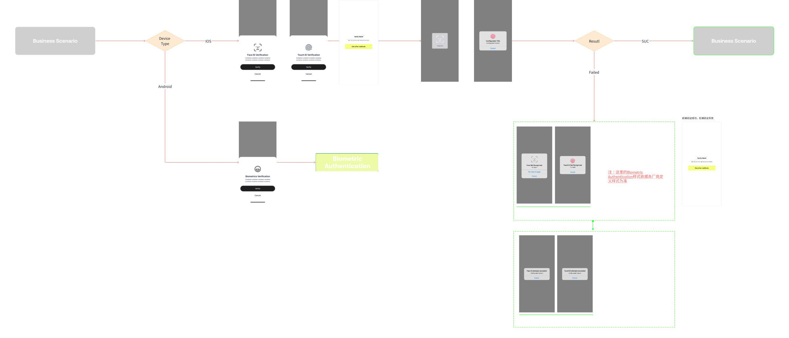

# 8.5 Biometric认证

## 流程概览

## 需求说明

发起Biometric，拉起设备人脸验证。

判断是否验证通过：

- 设备端验证通过，则进行后端验证
  - 后端验证成功，进入下一步流程；
  - 后端验证失败，则系统弹窗提示verify failed，点击use other methods按钮，返回身份认证发起页；

### iOS 设备端验证失败

弹窗提示：

**未超过次数限制：**
- 用户点击Try again后可再次验证；
- 点击「Cancel」，关闭弹窗；

**超过设备验证次数限制：**
- 点击「Cancel」，关闭弹窗；
- 点击「Use another method」，返回身份认证发起页；

### Android 设备端验证失败

- 安卓失败弹窗为系统弹窗，以各机型实际展示为准；
- 不限制失败次数，以各机型实际限制为准；

### 平台差异备注

- iOS可以控制校验次数；
- 安卓可尝试次数则依据系统；
