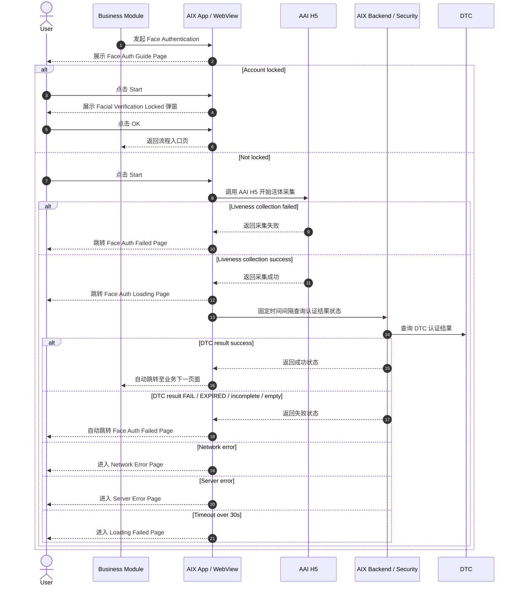
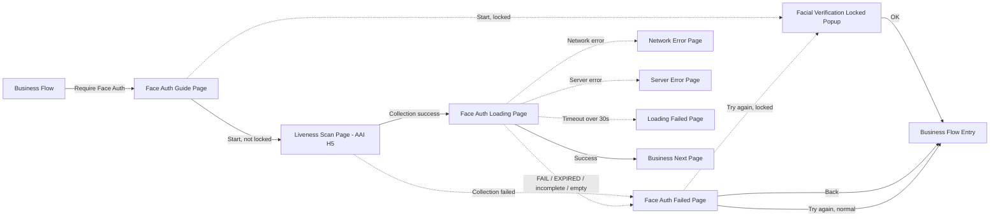
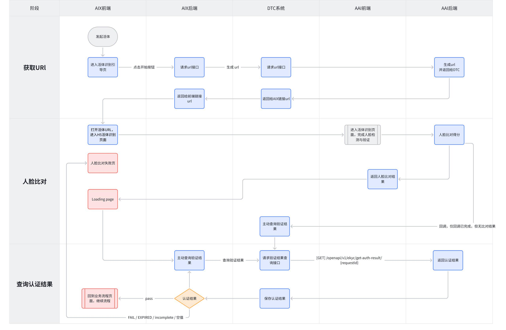
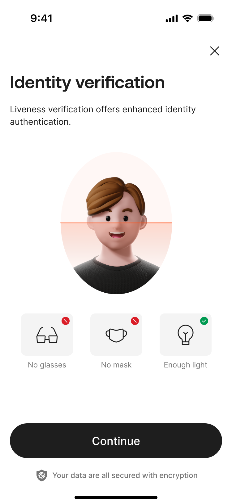
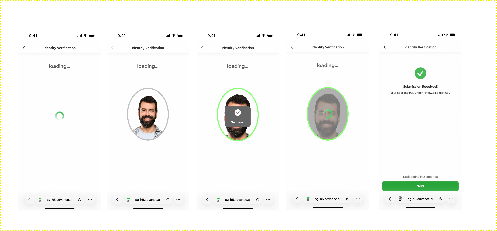
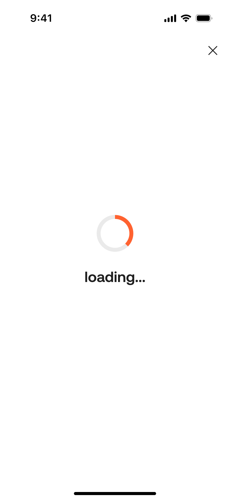
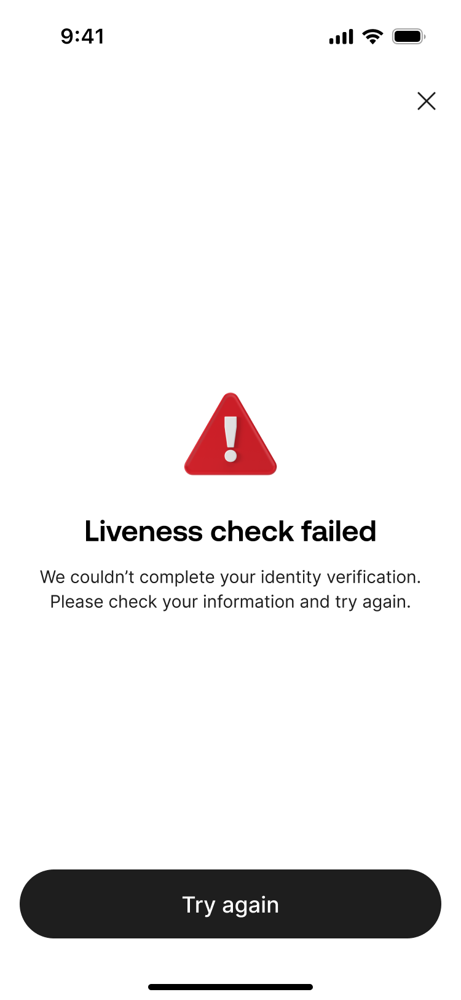

# Face Authentication 活体识别认证

## 1. 功能定位

Face Authentication 用于 DTC / AAI 侧活体识别认证，是卡申请、卡激活、设置 PIN、重置 PIN、查看卡敏感信息、Crypto Withdraw、Fiat Withdraw 等敏感业务场景的高强度身份认证能力。

本文件只沉淀 8.6 活体识别认证的页面、流程、失败处理、锁定规则、计费触发点和业务回流规则。设备本地 Face ID / 指纹等 Biometric 能力不在本文定义，统一见 `biometric-verification.md`。

## 2. 适用范围

| 维度 | 规则 | 来源 | 备注 |
|---|---|---|---|
| 认证方式 | Face Authentication / 人脸识别（DTC 侧提供） | AIX Security 身份认证需求V1.0 / 7.1 | DTC / AAI 侧活体识别 |
| 安全类型 | 你本人的 | AIX Security 身份认证需求V1.0 / 7.1 | 高安全认证方式 |
| 阈值 | 活体验证 90；人脸相似度验证 70 | AIX Security 身份认证需求V1.0 / 7.1 | 原文写明当前对比通过分数 |
| 适用场景 | Crypto Withdraw、Fiat Withdraw、卡申请、激活卡、设置 PIN、重置 PIN、查看卡敏感信息 | AIX Security 身份认证需求V1.0 / 7.2 | 由场景矩阵决定 |
| 采集页面 | AAI H5 页面 | AIX Security 身份认证需求V1.0 / 8.6.3 / 8.6.4 | 由 AAI 提供活体采集页 |
| 失败锁定 | 24 小时内累计失败 5 次锁 20 分钟；10 次锁 24 小时 | AIX Security 身份认证需求V1.0 / 7.1 / 8.6.3 | 基于用户账户维度 |
| 接口发起限制 | 24 小时内接口层面连续发起 20 次锁 20 分钟 | AIX Security 身份认证需求V1.0 / 8.6.3 | 验证成功后清零 |

## 3. 前置条件

| 条件 | 说明 | 来源 |
|---|---|---|
| 当前业务场景要求 DTC 侧活体识别 | 是否使用 Face Authentication 由 Security 场景矩阵决定 | AIX Security 身份认证需求V1.0 / 7.2 |
| 用户进入 Face Auth Guide Page | 该页面为活体识别流程入口引导页 | AIX Security 身份认证需求V1.0 / 8.6.3 |
| 当前账户未被 Face Authentication 锁定 | 锁定状态下点击 Start 需弹窗拦截 | AIX Security 身份认证需求V1.0 / 8.6.3 |
| 客户端可打开 AAI H5 | 未锁定时点击 Start，系统调用 AAI H5 开始活体采集 | AIX Security 身份认证需求V1.0 / 8.6.3 / 8.6.4 |

## 4. 业务流程

### 4.1 主链路

```text
Business Flow → Face Auth Guide Page → AAI Liveness Scan Page → Face Auth Loading Page → Business Next Step / Face Auth Failed Page
```

### 4.2 业务流程与系统交互时序图



### 4.3 业务逻辑矩阵

| 阶段 | 触发条件 | 客户端 / 页面动作 | 后端 / DTC / AAI 动作 | 成功结果 | 失败结果 |
|---|---|---|---|---|---|
| 进入引导页 | 业务模块发起 Face Authentication | 展示 Face Auth Guide Page | 无 | 用户可点击 Start | 无 |
| Start 校验 | 用户点击 Start | 判断是否锁定 | 锁定状态由后端返回 | 未锁定则调用 AAI H5 | 已锁定则弹窗拦截 |
| 活体采集 | 未锁定且点击 Start | 打开 AAI H5 | AAI 执行活体采集 | 采集成功进入 Loading | 采集失败进入 Failed |
| 结果查询 | AAI 采集成功 | 展示 Face Auth Loading Page | 固定时间间隔查询后台认证状态 | 成功进入业务下一页 | 失败 / 异常 / 超时进入对应页面 |
| 失败处理 | AAI 或 DTC 返回失败 | 展示 Face Auth Failed Page | 根据失败结果展示文案 | Try again 返回认证入口 | 锁定时弹窗返回入口 |

## 5. 页面关系总览

本节只表达 Face Authentication 涉及的页面节点、弹窗节点和异常承接页。



## 6. 页面卡片与交互规则

### 6.1 Flow Overview



### 6.2 Page Overview


计费规则：liveness 采集失败不会计费，采集成功才会计费。

### 6.3 Face Auth Guide Page



| 元素 / 能力 | 类型 | 展示条件 | 交互规则 | 来源 |
|---|---|---|---|---|
| Guide Page | Page | 进入活体识别流程 | 展示识别前注意事项 | 8.6.3 |
| Back | Button | 页面展示时 | 点击返回上一级页面，中断当前识别流程 | 8.6.3 |
| Start | Button | 未锁定状态 | 点击后调用 AAI H5 开始活体采集 | 8.6.3 |
| Start | Button | 锁定状态 | 点击后展示 Facial Verification Locked 弹窗 | 8.6.3 |

锁定弹窗：

| 元素 | 文案 / 规则 | 来源 |
|---|---|---|
| Title | `Facial Verification Locked` | 8.6.3 |
| Content | `You've reached the maximum attempts for facial verification. Please try again after [MM-DD hh:mm].` | 8.6.3 |
| Time | `[MM-DD hh:mm]` 为解锁时间 | 8.6.3 |
| OK | 点击返回流程入口页 | 8.6.3 |

### 6.4 Liveness Scan Page（AAI H5）



| 元素 / 能力 | 类型 | 展示条件 | 交互规则 | 来源 |
|---|---|---|---|---|
| AAI H5 | External H5 | 点击 Start 且未锁定 | 开始活体采集 | 8.6.4 |
| Submission received | AAI Page | 用户进入 submission received 页面时 | AAI 已有 face 比对结果 | 8.6.4 |
| Continue Button | Button | AAI 页面展示时 | 点击跳转 Face Auth Loading Page | 8.6.4 |

### 6.5 Face Auth Loading Page



| 元素 / 能力 | 类型 | 展示条件 | 交互规则 | 来源 |
|---|---|---|---|---|
| Loading Page | Page | AAI 返回活体识别成功 | 固定时间间隔查询后台认证结果状态 | 8.6.5 |
| Back | Button | 页面展示时 | 点击弹出 Confirm Exit 弹窗 | 8.6.5 |
| Success result | System action | 后端返回成功 | 自动跳转至业务流程下一页面 | 8.6.5 |
| Failed result | System action | DTC 返回 FAIL / EXPIRED / incomplete / 空值 | 自动跳转 Face Auth Failed Page | 8.6.5 |
| Network Error | Error handling | 网络异常 | 进入 Network Error Page | 8.6.5 |
| Server Error | Error handling | 系统异常 | 进入 Server Error Page | 8.6.5 |
| Timeout | Error handling | 超过 30 秒仍未收到结果 | 进入 Loading Failed Page | 8.6.5 |

Confirm Exit 弹窗：

| 元素 | 文案 / 规则 | 来源 |
|---|---|---|
| Title | `Confirm Exit?` | 8.6.5 |
| Content | `Are you sure you want to leave before verification is complete?` | 8.6.5 |
| Stay and continue | 关闭弹窗，停留当前页 | 8.6.5 |
| Leave | 关闭弹窗，返回业务流程入口页 | 8.6.5 |

### 6.6 Face Auth Failed Page



| 元素 / 能力 | 类型 | 展示条件 | 交互规则 | 来源 |
|---|---|---|---|---|
| Failed Page | Page | AAI 或后端认证失败 | 用户可重试或退出流程 | 8.6.6 |
| Back | Button | 页面展示时 | 点击返回业务流程入口页 | 8.6.6 |
| Main message | Text | 页面展示时 | 固定显示 `Verification failed.` | 8.6.6 |
| Empty face result message | Text | 后端返回 face result 为空值 | `Liveness check failed. Please try again.` | 8.6.6 |
| Failure reason | Text | face result 为 FAIL / EXPIRED / incomplete | 展示 Face Comparison API 错误码映射中的前端提示文案 | 8.6.6 |
| Try again | Button | 正常状态 | 点击返回身份认证入口页 | 8.6.6 |
| Try again | Button | 锁定状态 | 展示锁定提示，确认后返回流程入口页 | 8.6.6 |

锁定状态 Try again 弹窗：

| 元素 | 文案 / 规则 | 来源 |
|---|---|---|
| Content | `For your account security, facial verification is temporarily unavailable. Please try again after [解锁时间].` | 8.6.6 |
| Confirm | 点击直接返回至流程入口页 | 8.6.6 |

## 7. 字段与接口依赖

| 字段 / 能力 | 用途 | 读/写 | 来源 | 备注 |
|---|---|---|---|---|
| faceResult | DTC / 后端人脸结果 | 读 | 8.6.5 / 8.6.6 | FAIL / EXPIRED / incomplete / 空值按失败处理 |
| failureCount24h | 24 小时累计 face 失败次数 | 读 / 写 | 8.6.3 | 5 次、10 次锁定判断 |
| interfaceRequestCount24h | 24 小时接口层面连续发起次数 | 读 / 写 | 8.6.3 | 连续 20 次锁 20 分钟 |
| lockUntil | 解锁时间 | 读 / 写 | 8.6.3 / 8.6.6 | 用于锁定弹窗展示 |
| dtcFaceToken | DTC 活体 Token | 读 / 写 | 7.4 | AIX 按 5 分钟窗口校验 |
| faceComparisonErrorMessage | Face Comparison API 前端提示文案 | 读 | 8.6.6 | 由错误码映射提供 |
| businessScenario | 当前业务场景 | 读 | 7.2 | 决定是否需要 Face Authentication |

## 8. 异常与失败处理

| 场景 | 触发条件 | 用户提示 / 展示 | 系统动作 | 最终状态 | 来源 |
|---|---|---|---|---|---|
| Start 时已锁定 | 用户失败次数过多，后端返回被锁定 | Facial Verification Locked 弹窗 | 点击 OK 返回流程入口页 | 阻止发起采集 | 8.6.3 |
| AAI 采集失败 | Liveness Scan Page 采集失败 | Face Auth Failed Page | 用户可 Try again 或返回 | 认证失败 | 8.6.4 / 8.6.6 |
| DTC 结果失败 | DTC 返回 FAIL / EXPIRED / incomplete / 空值 | Face Auth Failed Page | 根据失败原因展示文案 | 认证失败 | 8.6.5 / 8.6.6 |
| face result 为空 | 后端返回 face result 为空值 | `Liveness check failed. Please try again.` | 停留失败页 | 可重试 | 8.6.6 |
| face result 为 FAIL / EXPIRED / incomplete | 后端返回对应结果 | 展示 Face Comparison API 错误码映射前端提示 | 停留失败页 | 可重试 | 8.6.6 |
| Loading 网络异常 | 查询认证结果时网络异常 | Network Error Page | 按通用错误页处理 | 流程异常承接 | 8.6.5 |
| Loading 系统异常 | 查询认证结果时系统异常 | Server Error Page | 按通用错误页处理 | 流程异常承接 | 8.6.5 |
| Loading 超时 | 超过 30 秒仍未收到结果 | Loading Failed Page | 承接超时 | 流程异常承接 | 8.6.5 |
| Try again 时已锁定 | 失败页点击 Try again 且触发安全锁 | 锁定提示 | 确认后返回流程入口页 | 阻止继续认证 | 8.6.6 |

## 9. 风控 / 合规边界

| 边界 | 规则 | 影响 | 来源 |
|---|---|---|---|
| DTC / AAI 与设备 Biometric 分离 | Face Authentication 是 DTC / AAI 侧活体识别；Biometric 是设备本地识别 | 防止认证能力混用 | 7.1 / 8.5 / 8.6 |
| 活体阈值 | 活体验证 90；人脸相似度验证 70 | 决定 DTC 侧通过标准 | 7.1 |
| 失败锁定 | 24 小时内累计失败 5 次锁 20 分钟；10 次锁 24 小时 | 防止高风险认证暴力尝试 | 7.1 / 8.6.3 |
| 接口频控 | 24 小时内接口层面连续发起 20 次锁 20 分钟 | 防止频繁发起认证 | 8.6.3 |
| 失败计数范围 | DTC 返回 face result=fail 才算失败，其他结果不算失败 | 避免错误计数 | 8.6.3 |
| 清零规则 | 人脸验证通过后清零；接口层面连续发起次数验证成功后清零 | 保证用户通过后恢复尝试能力 | 8.6.3 |
| 计费边界 | liveness 采集失败不会计费，采集成功才会计费 | 影响成本与对账 | 8.6.2 |
| DTC 活体有效期 | DTC 后端实际有效期 10 分钟，AIX 按 5 分钟窗口校验 | 影响跨业务场景免重认证 | 7.4 |

## 10. 来源引用

- (Ref: 历史prd/AIX Security 身份认证需求V1.0 (1).docx / 7.1 认证方式&限制 / V1.0)
- (Ref: 历史prd/AIX Security 身份认证需求V1.0 (1).docx / 7.2 不同场景的验证方式 / V1.0)
- (Ref: 历史prd/AIX Security 身份认证需求V1.0 (1).docx / 7.4 活体有效期说明 / V1.0)
- (Ref: 历史prd/AIX Security 身份认证需求V1.0 (1).docx / 8.6 活体识别认证 / V1.0)
- (Ref: knowledge-base/security/_index.md)
- (Ref: knowledge-base/security/global-rules.md)
- (Ref: knowledge-base/security/biometric-verification.md)
- (Ref: knowledge-base/common/common-error-pages.md)
