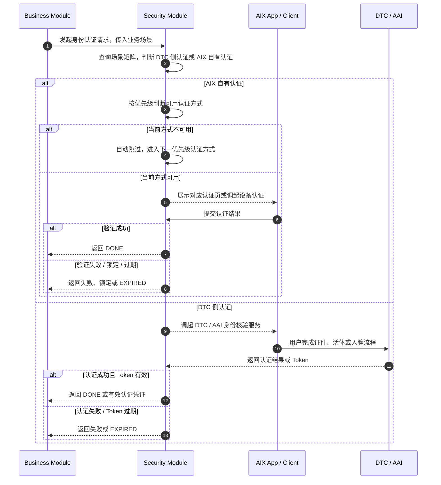
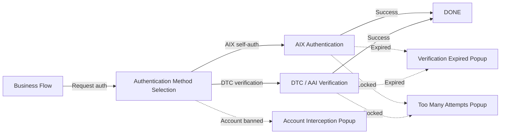
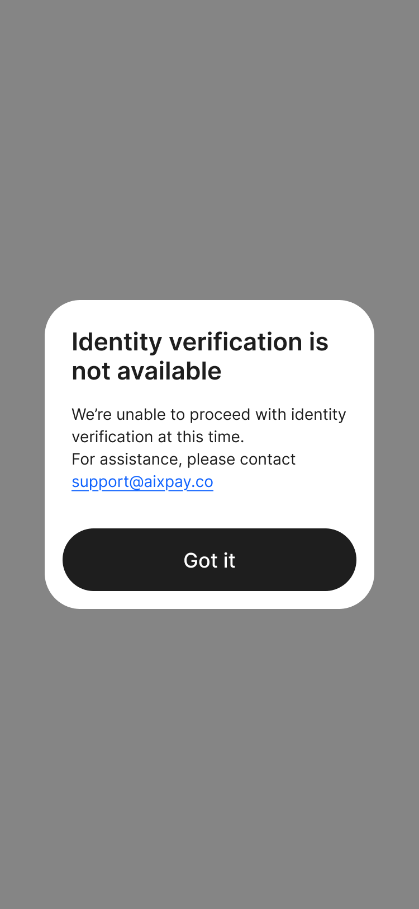

# Security Global Rules 全局认证规则

## 1. 功能定位

Security Global Rules 用于沉淀 AIX 身份认证的公共规则，包括客户端接入方式、认证方式与限制、业务场景认证矩阵、认证优先级、认证有效期、身份认证状态机和通用认证拦截页面。

本文件是 Security 子能力文件的公共规则源。OTP、Email OTP、Login Passcode、Biometric、Face Authentication 等文件不得重复定义本文件已经明确的公共规则。

## 2. 适用范围

| 维度 | 规则 | 来源 | 备注 |
|---|---|---|---|
| 国家线 | VN / PH / AU | AIX Security 身份认证需求V1.0 / 国家线 | 与 AIX 项目国家线一致 |
| 接入方式 | AIX 客户端通过 H5 内嵌 WebView 接入身份认证服务 | AIX Security 身份认证需求V1.0 / 6 客户端对接方式 | AIX 自有认证 |
| DTC 身份核验 | AIX 客户端通过 H5 内嵌 WebView 接入 DTC 身份核验服务 | AIX Security 身份认证需求V1.0 / 6 客户端对接方式 | 活体、人脸、KYC 等 |
| AIX 自有认证 | OTP / Email OTP / Login Passcode / Biometric | AIX Security 身份认证需求V1.0 / 7.1 | 业务场景按矩阵引用 |
| DTC 侧认证 | Document Verification / Liveness Detection / Face Comparison / Face Authentication | AIX Security 身份认证需求V1.0 / 7.2 | 用于 KYC、提现、申卡、卡敏感信息、PIN 等场景 |

## 3. 前置条件

| 条件 | 说明 | 来源 |
|---|---|---|
| 业务场景明确 | 业务模块调用 Security 前必须明确当前业务场景 | AIX Security 身份认证需求V1.0 / 7.2 |
| 用户或账户维度明确 | 锁定维度可能基于 UID、手机号或邮箱地址 | AIX Security 身份认证需求V1.0 / 7.1 |
| 认证方式可用性明确 | 多选一场景需按认证优先级判断当前方式是否满足条件 | AIX Security 身份认证需求V1.0 / 7.3 |
| Token / Challenge 有效期需校验 | DTC 活体、Challenge 会话、认证成功凭证均有有效期规则 | AIX Security 身份认证需求V1.0 / 7.4 / 7.5 |

## 4. 业务流程

### 4.1 主链路

```text
Business Scenario → Scenario Matrix → Authentication Method → Challenge → Verification → DONE / EXPIRED
```

### 4.2 业务流程与系统交互时序图



### 4.3 业务逻辑矩阵

| 阶段 | 触发条件 | 系统动作 | 成功结果 | 失败结果 |
|---|---|---|---|---|
| 场景识别 | 业务模块发起认证 | 查询 7.2 场景矩阵 | 确定认证方式范围 | 未定义场景需记录缺口 |
| AIX 方式选择 | 场景支持多种 AIX 自有认证 | 按优先级选择可用方式 | 进入对应认证流程 | 条件不满足则跳过 |
| DTC 认证调用 | 场景要求 DTC 侧认证 | 调起 DTC / AAI 服务 | 返回认证结果或 Token | 失败或过期 |
| Challenge 管理 | 用户发起认证 | 生成 Challenge，会话 10 分钟有效 | 进入 VALIDATING | 超时后 EXPIRED |
| 认证完成 | 验证成功 | 生成短期认证凭证，10 分钟有效 | DONE | 失败、锁定或过期 |

## 5. 页面关系总览

本文件不定义单一业务页面，只定义认证公共页面和认证拦截节点。



## 6. 页面卡片与交互规则

### 6.1 IVS Verification Expired Popup


| 元素 | 类型 | 展示条件 | 交互规则 | 来源 |
|---|---|---|---|---|
| Popup | Modal | 用户完成 IVS 后返回业务流程，提交时认证已过期 | 拦截提交 | 7.6.1 |
| Title | Text | Popup 展示时 | `Verification Expired` | 7.6.1 |
| Content | Text | Popup 展示时 | `Your identity verification has expired. Please complete it again before submitting.` | 7.6.1 |
| Try Again | Button | Popup 展示时 | 点击后重新进行认证 | 7.6.1 |

### 6.2 Too Many Attempts Popup


| 场景 | 触发条件 | Title | Content | Button | 来源 |
|---|---|---|---|---|---|
| 通用场景 | 后端识别对应挑战被锁 | `Too Many Attempts` | `You've reached the maximum number of attempts. Please try again in {time} minutes.` | `Try again later` | 7.6.2 |
| BIO 场景 | 前端识别设备生物识别被锁 | `Too Many Attempts` | `Biometric authentication has been temporarily disabled by your device. Please unlock your device using your passcode and try again.` | `Try again later` | 7.6.2 |

`Try again later` 点击后退出登录并返回到业务流程发起页。

### 6.3 Account Interception Popup



| 元素 | 类型 | 展示条件 | 交互规则 | 来源 |
|---|---|---|---|---|
| Popup | Modal | 账户被 Banned，无法发起身份认证流程 | 点击按钮关闭弹窗，留在当前页 | 7.6.3 |

## 7. 字段与接口依赖

| 字段 / 能力 | 用途 | 读/写 | 来源 | 备注 |
|---|---|---|---|---|
| businessScenario | 业务场景 | 读 | 7.2 | 决定认证方式 |
| authenticationType | 认证方式 | 读 | 7.1 | OTP / EMAIL_OTP / Login_PASSCODE / BIOMETRICS / Face Authentication |
| lockDimension | 锁定维度 | 读 / 写 | 7.1 | UID / 手机号 / 邮箱地址 |
| failureCount | 失败次数 | 读 / 写 | 7.1 | 用于 5 次、10 次锁定判断 |
| challengeStatus | 身份认证状态 | 读 / 写 | 7.5 | INITIAL / VALIDATING / DONE / EXPIRED |
| challengeExpiresAt | Challenge 会话有效期 | 读 / 写 | 7.4 | 10 分钟 |
| credentialExpiresAt | 认证成功后凭证有效期 | 读 / 写 | 7.4 | 10 分钟 |
| dtcTokenExpiresAt | DTC 活体 Token 有效期 | 读 | 7.4 | AIX 按 5 分钟窗口校验 |
| biometricLocalCredential | 本地生物识别凭证 | 读 / 写 | 7.1 / 7.3 | BIO 优先级前置 |

## 8. 异常与失败处理

| 场景 | 触发条件 | 系统动作 | 用户落点 | 来源 |
|---|---|---|---|---|
| AIX 自有认证失败 | OTP / Email OTP / Login Passcode 校验失败 | 按子文件处理失败次数、剩余次数、锁定 | 对应认证页或锁定弹窗 | 7.1 / 8.2 / 8.3 / 8.4 |
| BIO 不可用 | 前端清除本地生物识别凭证或设备验证失败 | 禁用 BIO 至重新授权 | 回到登录页或其他方式 | 7.1 / 7.3 |
| DTC Token 过期 | 超过 AIX 5 分钟窗口 | 拦截业务提交，要求重新认证 | Verification Expired Popup | 7.4 / 7.6.1 |
| Challenge 过期 | 10 分钟内未完成验证 | Challenge 失效 | EXPIRED | 7.4 / 7.5 |
| 认证被锁 | 失败次数达到锁定阈值 | 弹出 Too Many Attempts | 返回业务流程发起页 | 7.1 / 7.6.2 |
| 账户被 Banned | 账户无法发起身份认证流程 | 弹出 Account Interception Popup | 留在当前页 | 7.6.3 |

## 9. 风控 / 合规边界

### 9.1 认证方式与锁定规则

| 认证方式 | 类型 | 安全程度 | 限制规则 | 锁定方式 | 来源 |
|---|---|---|---|---|---|
| OTP | 你拥有的 | 高 | 24 小时内失败 5 次锁定 20 分钟；10 次锁定 24 小时 | 全局共享锁定 | 7.1 |
| Email OTP | 你拥有的 | 中 | 24 小时内失败 5 次锁定 20 分钟；10 次锁定 24 小时 | 场景隔离锁定 | 7.1 |
| Login Passcode | 你知道的 | 高 | 24 小时内失败 5 次锁定 20 分钟；10 次锁定 24 小时 | 场景隔离锁定 | 7.1 |
| Biometric | 你本人的 | 中 | 无失败次数限制；前端返回失败后禁用至重新授权 | 设备失败禁用至重新授权 | 7.1 |
| Face Authentication | 你本人的 | 高 | 24 小时内失败 5 次锁定 20 分钟；10 次锁定 24 小时 | 场景隔离锁定 | 7.1 |

### 9.2 场景矩阵

| 场景 | DTC | AIX | 来源 |
|---|---|---|---|
| 注册 | ❌ | EMAIL_OTP | 7.2 |
| 登录 | ❌ | OTP / EMAIL_OTP / Login_PASSCODE / BIO | 7.2 |
| Biometric 授权 | ❌ | Login_PASSCODE | 7.2 |
| 首次绑定手机号 / 更换手机号 | ❌ | OTP | 7.2 |
| 修改密码 | ❌ | Login_PASSCODE / OTP / IVS_DEVICE_BIOMETRICS | 7.2 |
| 忘记密码 | ❌ | OTP / EMAIL_OTP | 7.2 |
| 开户 + KYC | Document Verification / Liveness Detection / Face Comparison | ❌ | 7.2 |
| 钱包地址 | ❌ | OTP / EMAIL_OTP / IVS_DEVICE_BIOMETRICS | 7.2 |
| 充值 | ❌ | ❌ | 7.2 |
| 兑换 / 转账 | ❌ | OTP / EMAIL_OTP / IVS_DEVICE_BIOMETRICS | 7.2 |
| Crypto Withdraw / Fiat Withdraw | Face Authentication | ❌ | 7.2 |
| 卡申请 / 查看卡敏感信息 / 激活卡 / 设置 PIN / 重置 PIN | Face Authentication | ❌ | 7.2 |
| 冻结卡 / 注销卡 | ❌ | ❌ | 7.2 |
| 解冻卡 | ❌ | OTP / IVS_DEVICE_BIOMETRICS | 7.2 |

### 9.3 认证优先级

| 优先级 | 认证方式 | 条件说明 | 来源 |
|---|---|---|---|
| 1 | Biometric | 必须满足：前端未清除本地生物识别凭证 | 7.3 |
| 2 | Login Passcode | 原文未补充额外条件 | 7.3 |
| 3 | OTP | 用户已绑定手机号 | 7.3 |
| 4 | Email OTP | 原文未补充额外条件 | 7.3 |

若当前认证方式不满足使用条件，系统将自动跳过，并进入下一优先级的认证方式。

### 9.4 有效期与状态机

| 类型 | 规则 | 来源 |
|---|---|---|
| DTC 活体识别 | DTC 后端实际有效期 10 分钟，向 AIX 返回 5 分钟，AIX 按 5 分钟窗口校验 | 7.4 |
| DTC 免重认证 | 5 分钟内重复调用免再次活体，支持跨不同业务场景 | 7.4 |
| AIX 自有认证 | 无缓存，每次操作均需重新认证 | 7.4 |
| Challenge 会话 | 用户发起身份验证请求后 10 分钟内有效 | 7.4 |
| 认证成功凭证 | 身份验证成功后生成短期凭证，10 分钟有效 | 7.4 |

| 状态值 | 说明 | 是否终态 | 来源 |
|---|---|---|---|
| INITIAL | 发起挑战初始化，create challenge | 否 | 7.5 |
| VALIDATING | 验证中 | 否 | 7.5 |
| DONE | 验证成功完成 | 是 | 7.5 |
| EXPIRED | 已过期，流程终止 | 是 | 7.5 |

## 10. 来源引用

- (Ref: 历史prd/AIX Security 身份认证需求V1.0 (1).docx / 6 客户端对接方式 / V1.0)
- (Ref: 历史prd/AIX Security 身份认证需求V1.0 (1).docx / 7.1 认证方式&限制 / V1.0)
- (Ref: 历史prd/AIX Security 身份认证需求V1.0 (1).docx / 7.2 不同场景的验证方式 / V1.0)
- (Ref: 历史prd/AIX Security 身份认证需求V1.0 (1).docx / 7.3 验证优先级 / V1.0)
- (Ref: 历史prd/AIX Security 身份认证需求V1.0 (1).docx / 7.4 验证有效期说明 / V1.0)
- (Ref: 历史prd/AIX Security 身份认证需求V1.0 (1).docx / 7.5 身份认证状态机 / V1.0)
- (Ref: 历史prd/AIX Security 身份认证需求V1.0 (1).docx / 7.6 通用页面 / V1.0)
- (Ref: knowledge-base/security/_index.md)
- (Ref: knowledge-base/security/otp-verification.md)
- (Ref: knowledge-base/security/email-otp-verification.md)
- (Ref: knowledge-base/security/login-passcode-verification.md)
- (Ref: knowledge-base/security/biometric-verification.md)
- (Ref: knowledge-base/security/face-authentication.md)
