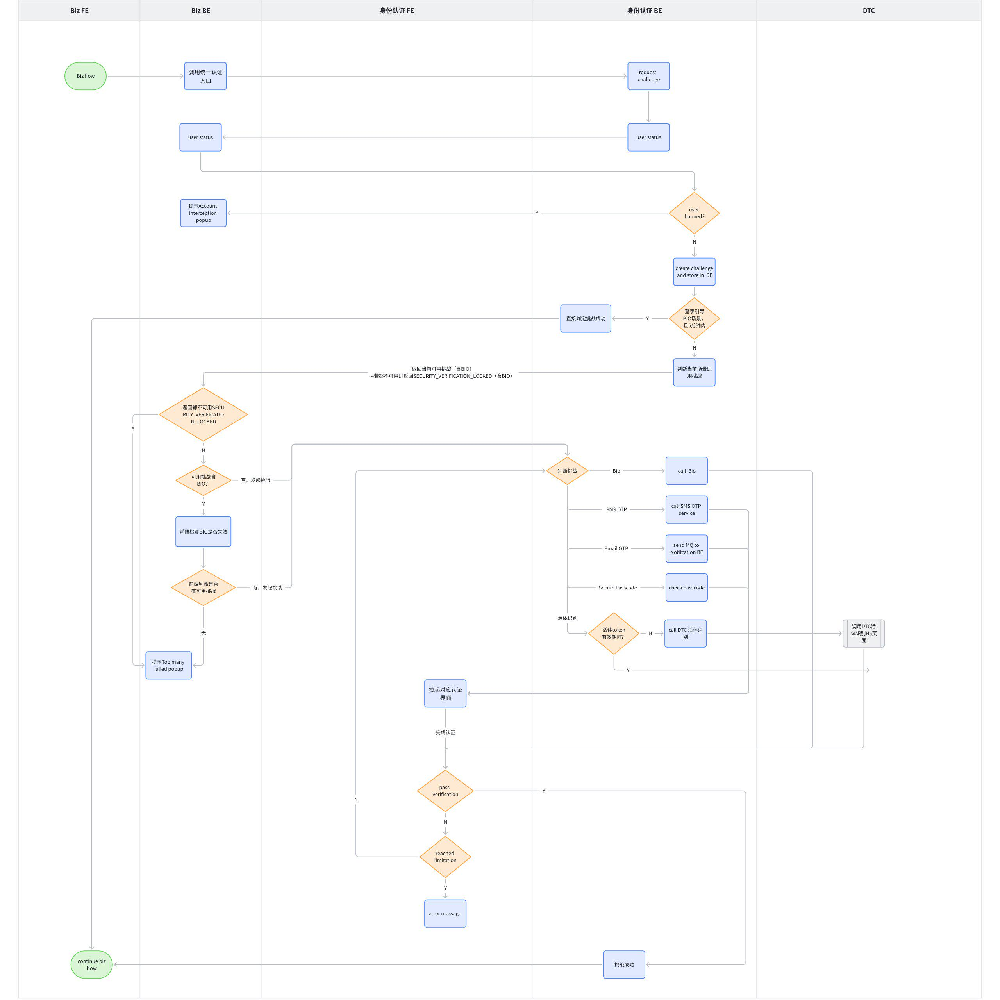

# 全局规则

## 6. 客户端对接方式

AIX 客户端需通过 H5 内嵌 WebView 的方式接入以下两类服务：

1. AIX 身份认证服务（如 OTP、邮箱验证、登录密码等）
2. DTC 身份核验服务（如活体人脸识别、KYC 等）

## 7.1 认证方式 & 限制

| Factor Authentication | Type | 安全程度 | 定义 | 限制规则 | 锁定方式 |
|---|---|---|---|---|---|
| OTP | 你拥有的 | 高 | 4 位数字密码，通过短信发送默认当前用户账户绑定的手机号码发送。MVP仅接入SMS模式，后续迭代版本再接入Whatsapp、语音等模式 | 24小时内失败5次 → 锁定20分钟；24小时内失败10次 → 锁定24小时 | 全局共享锁定。适用范围：短信OTP、语音OTP等基于手机号的验证方式。锁定维度：若用户已登录（存在 UID），以 UID 为锁定维度。 |
| 邮箱OTP | 你拥有的 | 中 | 4位数字密码，通过邮件发送 | 24小时内失败5次 → 锁定20分钟；24小时内失败10次 → 锁定24小时 | 场景隔离锁定。适用范围：邮箱验证码（如注册、登录、找回密码等）。锁定维度：若用户已登录（存在 UID），以 (UID) 为锁定维度。 |
| Login Passcode | 你知道的 | 高 | 大小写英文+数字+符号 | 24小时内失败5次 → 锁定20分钟；24小时内失败10次 → 锁定24小时 | 同「场景隔离锁定」方式 |
| BIOMETRICS | 你本人的 | 中 | 会根据用户自己本身设备中的人脸/指纹等验证用户 | 无失败次数限制。前端返回失败 → 禁用该功能至用户重新授权 | 设备失败 → 禁用至重新授权 |
| 人脸识别（DTC侧提供） | 你本人的 | 高 | 活体验证人脸相似度验证。目前对比通过的分数为：活体验证: 90，人脸相似度验证: 70 | 24小时内失败5次 → 锁定20分钟；24小时内失败10次 → 锁定24小时 | 同「场景隔离锁定」方式 |

## 7.2 不同场景的验证方式

| 场景 | DTC | AIX | 备注 |
|------|-----|-----|------|
| 注册 | ❌ | ✅ EMAIL_OTP | |
| 登录 | ❌ | 用户选择登录方式1：✅ OTP / ✅ EMAIL_OTP / ✅ Login_PASSCODE；用户选择登录方式2：✅ BIO | Bio登录：如果是Bio登录，目前可直接跳过 |
| Biometric授权 | ❌ | ✅ Login_PASSCODE | 支持免身份认证：用户在完成手动登录后的5分钟内，无需再次进行身份验证 |
| 首次绑定手机号 | ❌ | ✅ OTP | |
| 更换手机号 | ❌ | ✅ OTP | |
| 修改密码 | ❌ | ✅ Login_PASSCODE / ✅ OTP / ✅ IVS_DEVICE_BIOMETRICS | |
| 忘记密码 | ❌ | ✅ OTP / ✅ EMAIL_OTP | |
| 开户+KYC | Document Verification / Liveness Detection / Face Comparison | ❌ | |
| 钱包地址 | ❌ | ✅ OTP / ✅ EMAIL_OTP / ✅ IVS_DEVICE_BIOMETRICS | |
| 充值 | ❌ | ❌ | |
| 兑换 | ❌ | ✅ OTP / ✅ EMAIL_OTP / ✅ IVS_DEVICE_BIOMETRICS | |
| 转账 | ❌ | ✅ OTP / ✅ EMAIL_OTP / ✅ IVS_DEVICE_BIOMETRICS | |
| Crypto Withdraw | Face Authentication | ❌ | |
| Fiat Withdraw | Face Authentication | ❌ | |
| 卡申请 | Face Authentication | ❌ | |
| 查看卡敏感信息 | Face Authentication | ❌ | |
| 激活卡 | Face Authentication | ❌ | |
| 设置pin | Face Authentication | ❌ | |
| 重置pin | Face Authentication | ❌ | |
| 冻结卡 | ❌ | ❌ | |
| 解冻卡 | ❌ | ✅ OTP / ✅ IVS_DEVICE_BIOMETRICS | |
| 注销卡 | ❌ | ❌ | |

## 7.3 验证优先级（多选一场景）

认证方式优先级列表：

| 优先级 | 认证方式 | 条件说明 |
|--------|----------|----------|
| 1 | Biometric（设备生物识别） | 必须满足：• 前端未清除本地生物识别凭证 |
| 2 | Login Passcode（密码） | |
| 3 | OTP（短信验证码） | 用户已绑定手机号 |
| 4 | EMAIL_OTP（邮箱验证码） | |

> 💡 注：若当前认证方式不满足使用条件，系统将自动跳过，并进入下一优先级的认证方式。

## 7.4 验证有效期说明

> **知识点**
> 为提升用户体验，避免因网络延迟或流程耗时导致提交失败，DTC 后端将 Token 实际有效期设为 10 分钟，但向 AIX 返回的有效期标记为 5 分钟。AIX 按此 5 分钟窗口进行校验，形成缓冲机制，保障用户在合理时间内完成操作。

| 类型 | 有效期 | 免重认证逻辑 |
|------|--------|--------------|
| DTC 活体识别 | 5分钟 | 根据DTC返回的token有效期判断。5分钟内重复调用 → 免再次活体。该5分钟有效期的免重认证逻辑支持跨不同业务场景生效 |
| AIX 自有认证 | 无缓存 | 每次操作均需重新认证 |

### 验证挑战中有效期

用户发起身份验证请求后，系统生成的验证挑战（Challenge）会话在 10 分钟内有效。在此期间，用户需完成指定的认证方式（如 OTP、Email OTP、生物识别等）以通过验证。若超时未完成，则该验证挑战失效。

### 验证挑战后有效期

身份验证成功后，系统将生成一个短期有效的认证凭证，用于后续业务操作。该凭证仅在规定时间内（10分钟）有效。

## 7.5 身份认证状态机

| 状态值 | 说明 | 是否终态 |
|--------|------|----------|
| INITIAL | 发起挑战初始化，create challenge | ❌ 非终态 |
| VALIDATING | 验证中 | ❌ 非终态 |
| DONE | 验证成功完成 | ✅ 终态 |
| EXPIRED | 已过期，流程终止 | ✅ 终态 |

## 7.6 通用页面

### 7.6.1 IVS Verification Expired Popup

**页面规则：**

认证的业务流程中（如申卡、交易确认等），用户完成 IVS 后返回业务流程页面。由于 IVS 会话存在有效期，若用户未在有效期内完成业务提交，则在点击「提交」时需进行校验并拦截。

**弹窗：**

- Title：Verification Expired
- Content：Your identity verification has expired. Please complete it again before submitting.
- Button：Try Again

### 7.6.2 Too many failed popup

**通用场景（后端识别锁定）：**

1. 页面规则：在业务流程发起身份认证，对应挑战若被锁，后端识别出则弹窗提示被锁；
2. 按钮：
   - Title：Too Many Attempts
   - Content：You've reached the maximum number of attempts. Please try again in {time} minutes.
   - "Try again later"按钮，点击后退出登录并返回到业务流程发起页。

**BIO 场景（前端识别锁定）：**

1. 页面规则：在业务流程发起身份认证，对应挑战若被锁，前端识别出则弹窗提示被锁；
2. 按钮：
   - Title：Too Many Attempts
   - Content：Biometric authentication has been temporarily disabled by your device. Please unlock your device using your passcode and try again.
   - "Try again later"按钮，点击后退出登录并返回到业务流程发起页。

### 7.6.3 Account interception popup

**页面规则：**

账户被banned，无法发起身份认证流程。

**按钮：**

点击按钮关闭弹窗，留在当前页。

## 8.1 身份认证功能

### 8.1.1 流程说明

