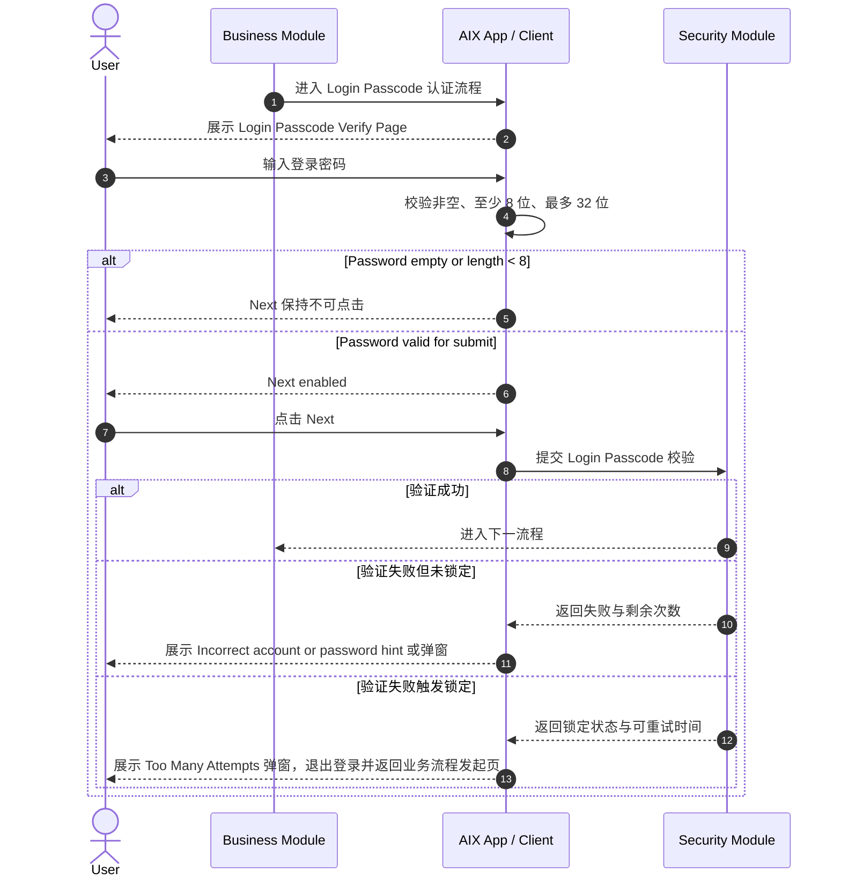
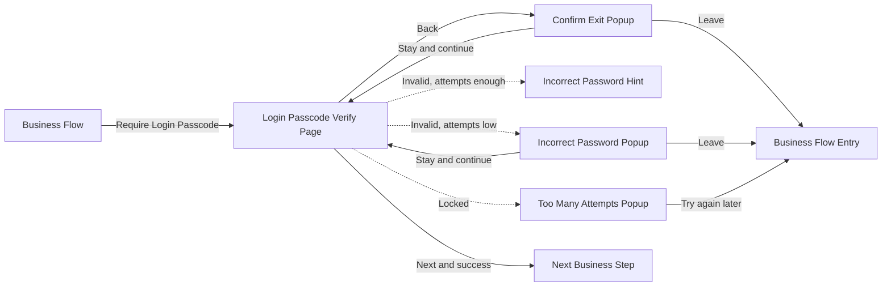

# Login Passcode Verification 登录密码认证

## 1. 功能定位

Login Passcode Verification 用于用户输入登录密码，完成 AIX 自有 Login Passcode 身份认证。

本文件只沉淀 Login Passcode Verify Page、密码输入规则、Next 按钮规则、验证失败处理和锁定规则。OTP、Email OTP、Biometric、Face Authentication 不在本文重复定义。

## 2. 适用范围

| 维度 | 规则 | 来源 | 备注 |
|---|---|---|---|
| 认证方式 | Login Passcode | AIX Security 身份认证需求V1.0 / 7.1 | 密码验证 |
| 安全类型 | 你知道的 | AIX Security 身份认证需求V1.0 / 7.1 | Knowledge factor |
| 密码长度 | 8–32 字符 | AIX Security 身份认证需求V1.0 / 8.4.2 | Next 启用至少 8 位；输入最多 32 位 |
| 支持字符 | 大小写字母、数字、常见符号 | AIX Security 身份认证需求V1.0 / 8.4.2 | 具体字符见页面规则 |
| 锁定方式 | 场景隔离锁定 | AIX Security 身份认证需求V1.0 / 7.1 | 同 Global Rules |

## 3. 前置条件

| 条件 | 说明 | 来源 |
|---|---|---|
| 当前业务场景允许 Login Passcode | 是否使用 Login Passcode 由 Security 场景矩阵决定 | AIX Security 身份认证需求V1.0 / 7.2 |
| 用户可输入登录密码 | 页面提供密码输入框 | AIX Security 身份认证需求V1.0 / 8.4.2 |
| 认证未触发锁定 | 达到失败次数上限时不可继续 | AIX Security 身份认证需求V1.0 / 8.4.2 |

## 4. 业务流程

### 4.1 主链路

```text
Business Flow → Login Passcode Verify Page → User Inputs Password → Next → Success / Failed / Locked
```

### 4.2 业务流程与系统交互时序图



### 4.3 业务逻辑矩阵

| 阶段 | 触发条件 | 前端 / 页面行为 | Security 动作 | 成功结果 | 失败结果 |
|---|---|---|---|---|---|
| 进入页面 | 业务模块进入密码认证 | 展示 Login Passcode Verify Page | 无 | 用户可输入密码 | 无 |
| 密码输入 | 用户输入密码 | 最多 32 字符；默认密文；可切换明文 | 无 | 满足条件后可提交 | Next 不可点击 |
| 点击 Next | 密码非空且不少于 8 位 | 提交密码 | 校验 Login Passcode | 进入下一流程 | Incorrect account or password / 锁定 |
| 失败提醒 | 验证失败未触发锁定 | 展示 hint 或剩余次数弹窗 | 返回剩余次数 | 可继续尝试 | 可退出流程 |
| 失败锁定 | 24 小时内失败达到阈值 | 展示 Too Many Attempts 弹窗 | 锁定 20 分钟或 24 小时 | 无 | 返回业务流程发起页 |

## 5. 页面关系总览

本节只表达 Login Passcode Verification 涉及的页面节点和弹窗节点。



## 6. 页面卡片与交互规则

### 6.1 Page Overview


### 6.2 Login Passcode Verify Page


| 维度 | 内容 |
|---|---|
| 页面目的 | 用户输入登录密码完成身份认证 |
| 入口 | 业务模块根据场景矩阵进入 Login Passcode 认证 |
| 出口 | 验证成功进入下一业务流程；失败按次数展示 hint / popup / lock |
| 关键规则 | 密码非空且不少于 8 位后 Next 可点击 |

| 元素 | 类型 | 展示条件 | 交互规则 | 来源 |
|---|---|---|---|---|
| Back | Button | 页面展示时 | 点击弹出 Confirm Exit 弹窗 | 8.4.2 |
| Password Input | Input | 页面展示时 | 最长 32 字符；默认密文；支持眼睛图标切换 | 8.4.2 |
| Eye Icon | Button | 输入框右侧 | 闭眼为密文；点击后明文显示 | 8.4.2 |
| Next | Button | 非空且不少于 8 位 | 点击后提交 Login Passcode 校验 | 8.4.2 |

支持字符：

| 类型 | 范围 | 来源 |
|---|---|---|
| 小写字母 | `a-z` | 8.4.2 |
| 大写字母 | `A-Z` | 8.4.2 |
| 数字 | `0-9` | 8.4.2 |
| 符号 | 常见标点和特殊字符 | 8.4.2 |

### 6.3 Confirm Exit Popup

| 元素 | 文案 / 规则 | 来源 |
|---|---|---|
| Title | `Confirm Exit?` | 8.4.2 |
| Content | `Are you sure you want to leave before verification is complete?` | 8.4.2 |
| Stay and continue | 关闭弹窗，停留当前页 | 8.4.2 |
| Leave | 关闭弹窗，返回业务流程发起页 | 8.4.2 |

### 6.4 验证失败处理

| 触发条件 | 展示方式 | 文案 | 用户动作 | 来源 |
|---|---|---|---|---|
| 失败，剩余可尝试次数大于 2 次 | 红字错误 hint | `Incorrect account or password` | 继续尝试 | 8.4.2 |
| 失败，剩余次数 ≤ 2，未触发锁定 | Popup | `Incorrect account or password` | Stay and continue / Leave | 8.4.2 |

剩余次数弹窗内容：

| 区间 | Content | 来源 |
|---|---|---|
| 失败次数在 0–5 区间且剩余次数 ≤ 2 | `You have {times} attempts left before a {time} lock.` | 8.4.2 |
| 失败次数在 5–10 区间且剩余次数 ≤ 2 | `You have {times} attempts left before being locked out for 24 hours.` | 8.4.2 |

### 6.5 锁定弹窗

| 触发条件 | Title | Content | Button | 用户落点 | 来源 |
|---|---|---|---|---|---|
| 24 小时内连续失败达到 5 次 | `Too Many Attempts` | `You've reached the maximum number of attempts. Please try again in {time}.` | `Try again later` | 退出登录并返回业务流程发起页 | 8.4.2 / 7.6.2 |
| 24 小时内连续失败达到 10 次 | `Too Many Attempts` | `You've reached the maximum number of attempts. Please try again in {time}.` | `Try again later` | 退出登录并返回业务流程发起页 | 8.4.2 |

## 7. 字段与接口依赖

| 字段 / 能力 | 用途 | 读/写 | 来源 | 备注 |
|---|---|---|---|---|
| loginPasscode | 用户输入密码 | 读 | 8.4.2 | 最长 32 字符 |
| passwordVisible | 明文 / 密文状态 | 读 / 写 | 8.4.2 | 眼睛图标切换 |
| failureCount24h | 24 小时失败次数 | 读 / 写 | 7.1 / 8.4.2 | 5 次、10 次锁定判断 |
| remainingAttempts | 剩余可尝试次数 | 读 | 8.4.2 | 用于低次数提醒 |
| lockUntil | 锁定结束时间 | 读 / 写 | 7.1 / 8.4.2 | 20 分钟或 24 小时 |

## 8. 异常与失败处理

| 场景 | 触发条件 | 用户提示 | 系统动作 | 最终状态 | 来源 |
|---|---|---|---|---|---|
| 密码为空 | 未输入密码 | 无明确文案 | Next 不可点击 | 留在当前页 | 8.4.2 |
| 密码少于 8 位 | 字符数不足 | 无明确文案 | Next 不可点击 | 留在当前页 | 8.4.2 |
| 密码超过 32 位 | 输入超过上限 | 无明确文案 | 前端禁止继续输入 | 留在当前页 | 8.4.2 |
| 验证失败，剩余次数 > 2 | 验证失败未触发锁定 | `Incorrect account or password` | 允许继续尝试 | 留在当前页 | 8.4.2 |
| 验证失败，剩余次数 ≤ 2 | 验证失败未触发锁定 | Incorrect account or password 弹窗 | 继续尝试或退出 | 当前页 / 业务流程发起页 | 8.4.2 |
| 24 小时内失败 5 次 | 达到第一次锁定阈值 | Too Many Attempts | 锁定 20 分钟 | 返回业务流程发起页 | 7.1 / 8.4.2 |
| 24 小时内失败 10 次 | 达到第二次锁定阈值 | Too Many Attempts | 锁定 24 小时 | 返回业务流程发起页 | 7.1 / 8.4.2 |

## 9. 风控 / 合规边界

| 边界 | 规则 | 影响 | 来源 |
|---|---|---|---|
| 密码提交条件 | 非空且不少于 8 位 | 控制 Next 可点击 | 8.4.2 |
| 长度上限 | 最多 32 字符 | 防止超长输入 | 8.4.2 |
| 显示控制 | 默认密文，可切换明文 | 保护用户输入 | 8.4.2 |
| 失败锁定 | 24 小时内失败 5 次锁定 20 分钟；10 次锁定 24 小时 | 防暴力破解 | 7.1 / 8.4.2 |
| 场景隔离锁定 | Login Passcode 使用场景隔离锁定 | 避免全局手机号类锁定混用 | 7.1 |

## 10. 来源引用

- (Ref: 历史prd/AIX Security 身份认证需求V1.0 (1).docx / 7.1 认证方式&限制 / V1.0)
- (Ref: 历史prd/AIX Security 身份认证需求V1.0 (1).docx / 7.2 不同场景的验证方式 / V1.0)
- (Ref: 历史prd/AIX Security 身份认证需求V1.0 (1).docx / 7.6.2 Too many failed popup / V1.0)
- (Ref: 历史prd/AIX Security 身份认证需求V1.0 (1).docx / 8.4 Login Passcode认证 / V1.0)
- (Ref: knowledge-base/security/_index.md)
- (Ref: knowledge-base/security/global-rules.md)
