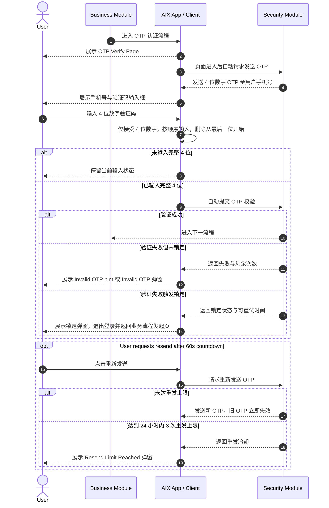
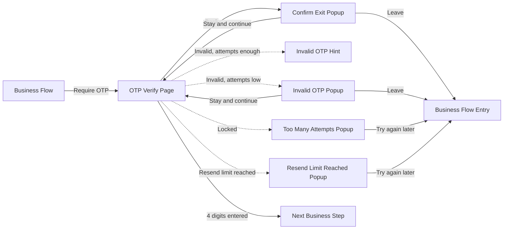

# OTP Verification 短信验证码认证

## 1. 功能定位

OTP Verification 用于通过用户手机号接收并输入 4 位数字验证码，完成 AIX 自有短信 OTP 身份认证。

本文件只沉淀短信 OTP 页面、输入规则、失败处理、锁定规则、重新发送规则和安全限制。Email OTP、Login Passcode、Biometric、Face Authentication 不在本文重复定义。

## 2. 适用范围

| 维度 | 规则 | 来源 | 备注 |
|---|---|---|---|
| 认证方式 | OTP | AIX Security 身份认证需求V1.0 / 7.1 认证方式&限制 | 短信验证码 |
| 验证码位数 | 4 位数字 | AIX Security 身份认证需求V1.0 / 8.2.1 OTP Verify Page | 用户需输入完整 4 位 |
| 验证码有效期 | 5 分钟 | AIX Security 身份认证需求V1.0 / 8.2.1 OTP Verify Page | 过期后需重新获取 |
| 发送方式 | 默认发送至当前用户账户绑定的手机号码 | AIX Security 身份认证需求V1.0 / 7.1 认证方式&限制 | MVP 仅接入 SMS 模式 |
| 后续模式 | Whatsapp、语音等模式后续迭代接入 | AIX Security 身份认证需求V1.0 / 7.1 认证方式&限制 | 当前不作为 MVP 事实能力 |
| 锁定方式 | 全局共享锁定 | AIX Security 身份认证需求V1.0 / 7.1 认证方式&限制 | 适用于基于手机号的验证方式 |
| 锁定维度 | 已登录存在 UID 时，以 UID 为锁定维度 | AIX Security 身份认证需求V1.0 / 7.1 认证方式&限制 | 未登录场景维度原文未进一步展开 |

## 3. 前置条件

| 条件 | 说明 | 来源 |
|---|---|---|
| 用户存在可接收短信的手机号 | OTP 通过短信发送到手机号 | AIX Security 身份认证需求V1.0 / 7.1 |
| 当前业务场景允许 OTP | 是否使用 OTP 由 Security 场景矩阵决定 | AIX Security 身份认证需求V1.0 / 7.2 |
| 账户未触发 OTP 锁定 | 达到失败次数或重发次数上限时不可继续 | AIX Security 身份认证需求V1.0 / 8.2.1 |
| 用户停留在 OTP Verify Page | 进入页面后自动触发发送 OTP 请求 | AIX Security 身份认证需求V1.0 / 8.2.1 |

## 4. 业务流程

### 4.1 主链路

```text
Business Flow → OTP Verify Page → Auto Send OTP → User Inputs 4-digit Code → Auto Submit → Success / Failed / Locked
```

### 4.2 业务流程与系统交互时序图



### 4.3 业务逻辑矩阵

| 阶段 | 触发条件 | 前端 / 页面行为 | Security 动作 | 成功结果 | 失败结果 |
|---|---|---|---|---|---|
| 进入页面 | 业务模块进入 OTP 认证 | 展示 OTP Verify Page | 自动发送 OTP 请求 | 用户接收验证码 | 发送失败规则原文未展开 |
| 手机号展示 | OTP Verify Page 展示 | 登录注册场景和非登录场景展示规则不同 | 无 | 用户识别接收手机号 | 无 |
| 验证码输入 | 用户输入验证码 | 仅接受 4 位数字；按顺序输入；删除从最后一位开始 | 无 | 输入满 4 位后自动提交 | 非数字无效 |
| OTP 校验 | 输入满 4 位 | 自动提交，无需确认按钮 | 校验最新一次 OTP | 进入下一流程 | Invalid OTP / 剩余次数提示 / 锁定 |
| 重新发送 | 60s 倒数结束 | 用户可请求重新发送 | 发送新 OTP，旧 OTP 立即失效 | 用户使用新验证码 | 达到重发上限后冷却 |

## 5. 页面关系总览

本节只表达 OTP Verification 涉及的页面节点和弹窗节点。



## 6. 页面卡片与交互规则

### 6.1 OTP Verify Page


| 维度 | 内容 |
|---|---|
| 页面目的 | 用户输入短信 OTP 完成身份认证 |
| 入口 | 业务模块根据场景矩阵进入 OTP 认证 |
| 出口 | 验证成功进入下一业务流程；失败按次数展示 hint / popup / lock |
| 关键规则 | 页面进入后自动发送 OTP；输入完整 4 位后自动提交 |

| 元素 | 类型 | 展示条件 | 交互规则 | 来源 |
|---|---|---|---|---|
| Back | Button | 页面展示时 | 点击弹出 Confirm Exit 弹窗 | 8.2.1 |
| Title | Text | 页面展示时 | `Verify Mobile Number` | 8.2.1 |
| Subtitle | Text | 页面展示时 | `We will send a 4-digit verification to you on {mobile number}` | 8.2.1 |
| Mobile Number | Text | 页面展示时 | 登录注册场景明文展示用户填写手机号；非登录场景掩码展示 | 8.2.1 |
| OTP Input | Input | 页面展示时 | 仅接受 4 位数字；按顺序输入；删除从最后一位开始 | 8.2.1 |
| Auto Submit | System action | 输入满 4 位 | 自动提交验证请求，无需确认按钮 | 8.2.1 |
| Resend | Action | 60s 倒数结束 | 用户可请求重新发送验证码 | 8.2.1 |

手机号展示规则：

| 场景 | 展示规则 | 示例 | 来源 |
|---|---|---|---|
| 登录注册场景 | 明文展示用户填写的手机号码 | `+638****2412` | 8.2.1 |
| 非登录场景 | 掩码处理：国际区号 + 手机号前 N 位掩码 + 最后三位明文 | `+63******412` | 8.2.1 |

### 6.2 Confirm Exit Popup

| 元素 | 文案 / 规则 | 来源 |
|---|---|---|
| Title | `Confirm Exit?` | 8.2.1 |
| Content | `Are you sure you want to leave before verification is complete?` | 8.2.1 |
| Stay and continue | 关闭弹窗，停留当前页 | 8.2.1 |
| Leave | 关闭弹窗，返回业务流程发起页 | 8.2.1 |

### 6.3 Invalid OTP 处理

| 触发条件 | 展示方式 | 文案 | 用户动作 | 来源 |
|---|---|---|---|---|
| 验证失败，剩余可尝试次数大于 2 次 | 红字错误 hint | `Invalid OTP` | 继续尝试 | 8.2.1 |
| 验证失败，剩余可尝试次数等于或小于 2 次，且未触发锁定 | Popup | `Invalid OTP` + 剩余次数提示 | Stay and continue / Leave | 8.2.1 |

剩余次数弹窗内容：

| 区间 | Content | 来源 |
|---|---|---|
| 失败次数在 0–5 区间且剩余次数 ≤ 2 | `You have {times} attempts left before being locked out for 20 minutes.` | 8.2.1 |
| 失败次数在 5–10 区间且剩余次数 ≤ 2 | `You have {times} attempts left before being locked out for 24 hours.` | 8.2.1 |

### 6.4 锁定弹窗

| 触发条件 | Title | Content | Button | 用户落点 | 来源 |
|---|---|---|---|---|---|
| 24 小时内连续失败达到 5 次 | `Too Many Attempts` | `You've reached the maximum number of attempts. Please try again in {time}.` | `Try again later` | 退出登录并返回业务流程发起页 | 8.2.1 / 7.6.2 |
| 24 小时内连续失败达到 10 次 | `Too Many requests` | `You've requested new codes too frequently. Please try again in {time}.` | `Try again later` | 退出登录并返回业务流程发起页 | 8.2.1 / 7.6.2 |

### 6.5 Resend Limit Reached Popup

| 触发条件 | Title | Content | Button | 用户落点 | 来源 |
|---|---|---|---|---|---|
| 24 小时内重新发送验证码达到 3 次 | `Resend Limit Reached` | `You've reached the resend limit. Please try again in {time}.` | `Try again later` | 退出登录并返回业务流程发起页 | 8.2.1 |

## 7. 字段与接口依赖

| 字段 / 能力 | 用途 | 读/写 | 来源 | 备注 |
|---|---|---|---|---|
| mobileNumber | OTP 接收手机号 | 读 | 7.1 / 8.2.1 | 当前用户绑定手机号或业务场景手机号 |
| otpCode | 用户输入验证码 | 读 | 8.2.1 | 4 位数字 |
| otpExpiresAt | OTP 有效期 | 读 / 写 | 8.2.1 | 5 分钟 |
| latestOtp | 最新一次发送的 OTP | 写 | 8.2.1 | 旧验证码立即失效，仅最后一次有效 |
| failureCount24h | 24 小时失败次数 | 读 / 写 | 7.1 / 8.2.1 | 5 次、10 次锁定判断 |
| remainingAttempts | 剩余可尝试次数 | 读 | 8.2.1 | 用于低次数提醒 |
| resendCount24h | 24 小时重发次数 | 读 / 写 | 8.2.1 | 最多 3 次 |
| lockUntil | 锁定结束时间 | 读 / 写 | 7.1 / 8.2.1 | 20 分钟或 24 小时 |
| requestDevice | 发起请求设备 | 读 | 8.2.1 | 验证码仅限发起请求设备使用 |

## 8. 异常与失败处理

| 场景 | 触发条件 | 用户提示 | 系统动作 | 最终状态 | 来源 |
|---|---|---|---|---|---|
| 非数字输入 | 用户输入非数字字符 | 无明确文案 | 非数字字符无效 | 留在 OTP Verify Page | 8.2.1 |
| 未输入完整 4 位 | 用户未完成 4 位输入 | 无明确文案 | 不提交 | 留在 OTP Verify Page | 8.2.1 |
| OTP 验证失败，剩余次数 > 2 | 验证失败未触发锁定 | `Invalid OTP` | 允许继续尝试 | 留在 OTP Verify Page | 8.2.1 |
| OTP 验证失败，剩余次数 ≤ 2 | 验证失败未触发锁定 | Invalid OTP 弹窗 | 允许继续尝试或退出 | 当前页 / 业务流程发起页 | 8.2.1 |
| 24 小时内失败 5 次 | 达到第一次锁定阈值 | Too Many Attempts | 锁定 20 分钟 | 返回业务流程发起页 | 7.1 / 8.2.1 |
| 24 小时内失败 10 次 | 达到第二次锁定阈值 | Too Many requests | 锁定 24 小时 | 返回业务流程发起页 | 7.1 / 8.2.1 |
| 重新发送达到上限 | 24 小时内重发 3 次 | Resend Limit Reached | 触发 20 分钟冷却 | 返回业务流程发起页 | 8.2.1 |
| 旧 OTP 被替换 | 用户重新发送 OTP | 无 | 旧验证码立即失效 | 仅最新 OTP 有效 | 8.2.1 |
| 更换设备验证 | 非发起请求设备使用验证码 | 原文未明确提示 | 验证码无效 | 阻止通过 | 8.2.1 |

## 9. 风控 / 合规边界

| 边界 | 规则 | 影响 | 来源 |
|---|---|---|---|
| 验证码位数 | OTP 为 4 位数字 | 控制输入与自动提交条件 | 8.2.1 |
| 验证码有效期 | 5 分钟有效 | 过期后不可继续使用 | 8.2.1 |
| 最新验证码有效 | 每次重新发送生成新随机 OTP，旧 OTP 立即失效 | 防止旧验证码复用 | 8.2.1 |
| 设备限制 | 验证码仅限发起请求设备使用，更换设备无效 | 防止跨设备复用 | 8.2.1 |
| 失败锁定 | 24 小时内失败 5 次锁定 20 分钟；10 次锁定 24 小时 | 防暴力破解 | 7.1 / 8.2.1 |
| 重发冷却 | 24 小时内最多 3 次重发，达到上限后冷却 20 分钟 | 防短信轰炸与滥用 | 8.2.1 |
| 全局共享锁定 | OTP 使用全局共享锁定 | 影响所有手机号类 OTP 验证方式 | 7.1 |

## 10. 来源引用

- (Ref: 历史prd/AIX Security 身份认证需求V1.0 (1).docx / 7.1 认证方式&限制 / V1.0)
- (Ref: 历史prd/AIX Security 身份认证需求V1.0 (1).docx / 7.2 不同场景的验证方式 / V1.0)
- (Ref: 历史prd/AIX Security 身份认证需求V1.0 (1).docx / 7.6.2 Too many failed popup / V1.0)
- (Ref: 历史prd/AIX Security 身份认证需求V1.0 (1).docx / 8.2 OTP认证 / V1.0)
- (Ref: knowledge-base/security/_index.md)
- (Ref: knowledge-base/security/global-rules.md)
- (Ref: knowledge-base/changelog/knowledge-gaps.md / Security OTP / 2026-05-01)
