# app / home 支撑图

## 1. 文档定位

本文件承接流程图、接口图、数据字典、状态图等支撑视觉素材。它们用于辅助理解，不替代页面规则或字段事实。

## 2. Supporting Visuals

### 1. 3. 全局说明

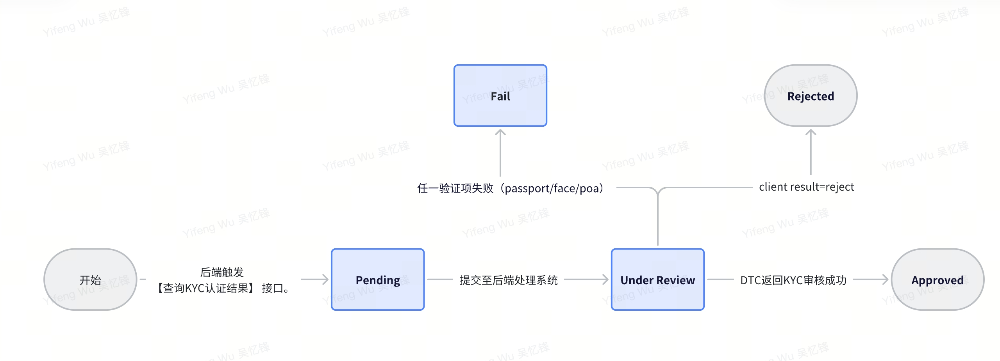

_Source: archive/converted-prd/app/home/assets/media/image1.jpeg_

### 2. 4. 整体流程

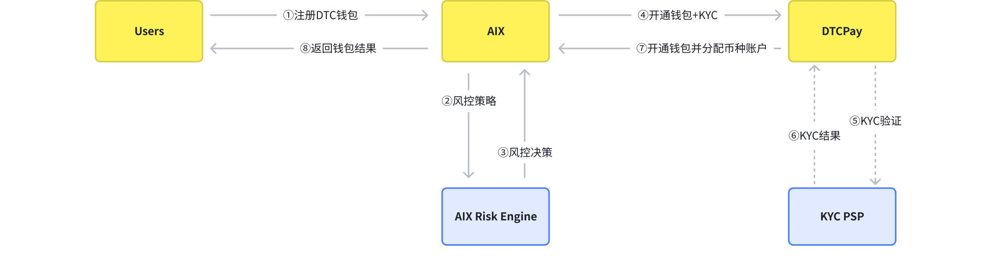

_Source: archive/converted-prd/app/home/assets/media/image2.jpeg_

### 3. 4. 整体流程

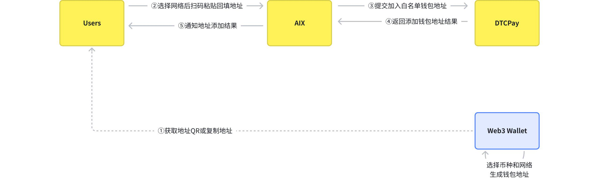

_Source: archive/converted-prd/app/home/assets/media/image3.jpeg_

### 4. 4. 整体流程

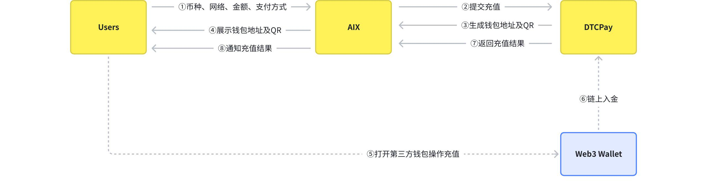

_Source: archive/converted-prd/app/home/assets/media/image4.jpeg_

### 5. 4. 整体流程

_Source: archive/converted-prd/app/home/assets/media/image8.jpeg_

### 6. 4. 整体流程

_Source: archive/converted-prd/app/home/assets/media/image9.jpeg_

### 7. Set Pin

_Source: archive/converted-prd/app/home/assets/media/image10.jpeg_

### 8. Set Pin

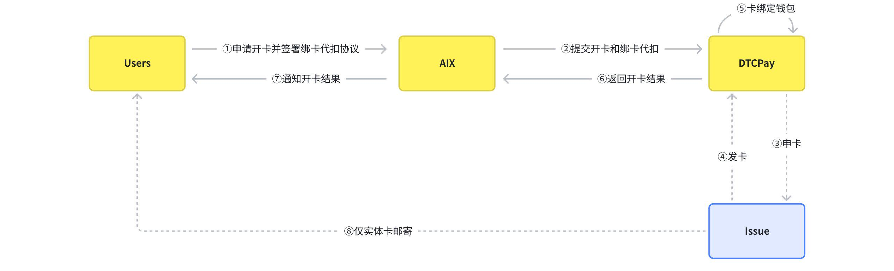

_Source: archive/converted-prd/app/home/assets/media/image11.jpeg_

### 9. Set Pin

_Source: archive/converted-prd/app/home/assets/media/image12.jpeg_

### 10. Set Pin

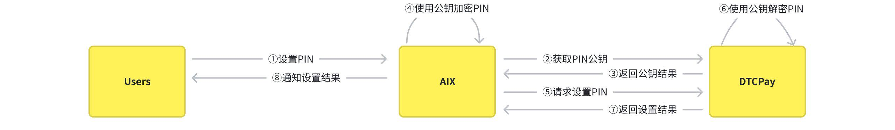

_Source: archive/converted-prd/app/home/assets/media/image13.jpeg_

### 11. Set Pin

_Source: archive/converted-prd/app/home/assets/media/image15.jpeg_

### 12. 4. 整体流程

_Source: archive/converted-prd/app/home/assets/media/image16.jpeg_

### 13. 4. 整体流程

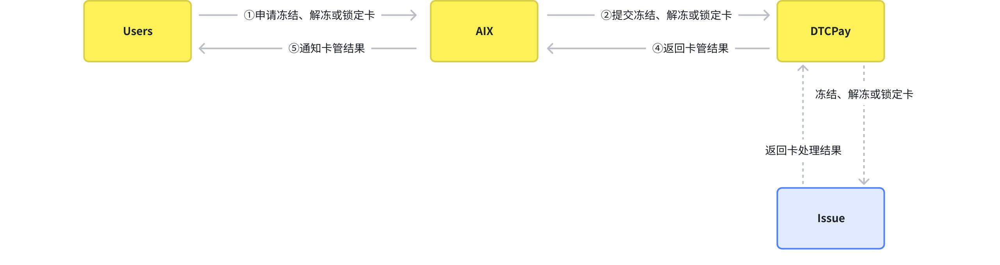

_Source: archive/converted-prd/app/home/assets/media/image17.jpeg_

### 14. 4. 整体流程

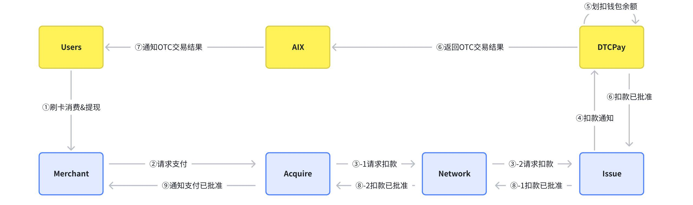

_Source: archive/converted-prd/app/home/assets/media/image18.jpeg_

### 15. 4. 整体流程

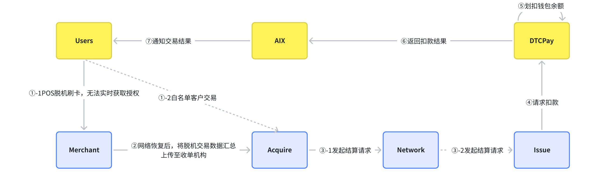

_Source: archive/converted-prd/app/home/assets/media/image19.jpeg_

### 16. 4. 整体流程

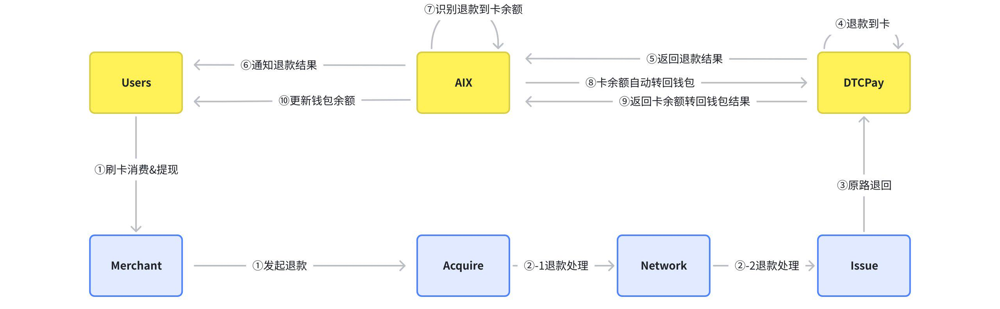

_Source: archive/converted-prd/app/home/assets/media/image20.jpeg_

### 17. 6. AIX功能需求

_Source: archive/converted-prd/app/home/assets/media/image22.png_

### 18. Waitlist

_Source: archive/converted-prd/app/home/assets/media/image23.png_

### 19. Waitlist

_Source: archive/converted-prd/app/home/assets/media/image24.png_

### 20. Waitlist

_Source: archive/converted-prd/app/home/assets/media/image25.png_

### 21. 未申请开通钱包

_Source: archive/converted-prd/app/home/assets/media/image26.png_

### 22. 申卡入口

_Source: archive/converted-prd/app/home/assets/media/image32.png_

### 23. 申卡入口

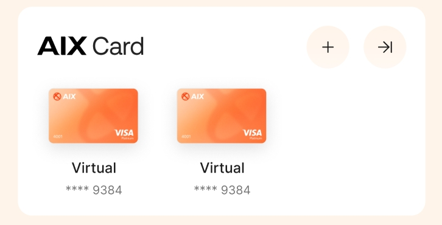

_Source: archive/converted-prd/app/home/assets/media/image33.jpeg_

### 24. 申卡入口

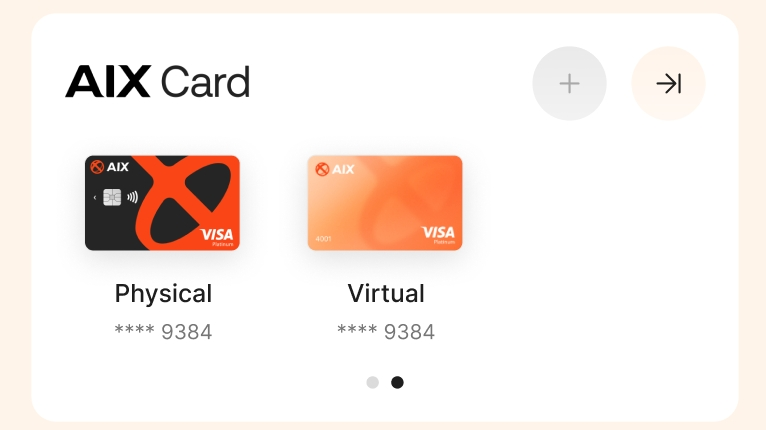

_Source: archive/converted-prd/app/home/assets/media/image34.jpeg_

### 25. 7. DTC渠道接口需求

_Source: archive/converted-prd/app/home/assets/media/image46.jpeg_

### 26. 7. DTC渠道接口需求

_Source: archive/converted-prd/app/home/assets/media/image47.jpeg_

## 3. 使用规则

1. 支撑图仅用于理解源 PRD。
2. 若图中内容与已校准 KB 文本冲突，以已校准 KB 文本或产品裁决为准。
3. 不得从支撑图截图单独推导未写入 KB 的 runtime 事实。