# app / transaction history 支撑图

## 1. 文档定位

本文件承接流程图、接口图、数据字典、状态图等支撑视觉素材。它们用于辅助理解，不替代页面规则或字段事实。

## 2. Supporting Visuals

### 1. 2. 全局说明

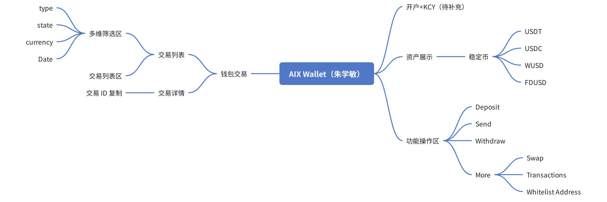

_Source: archive/legacy-prd/app/transaction-history/assets/media/image1.jpeg_

### 2. 3. 状态及类型处理

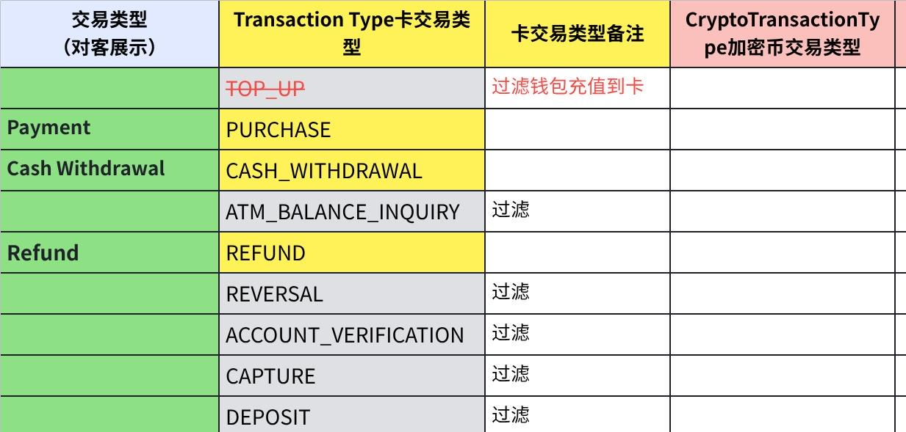

_Source: archive/legacy-prd/app/transaction-history/assets/media/image2.png_

### 3. 3. 状态及类型处理

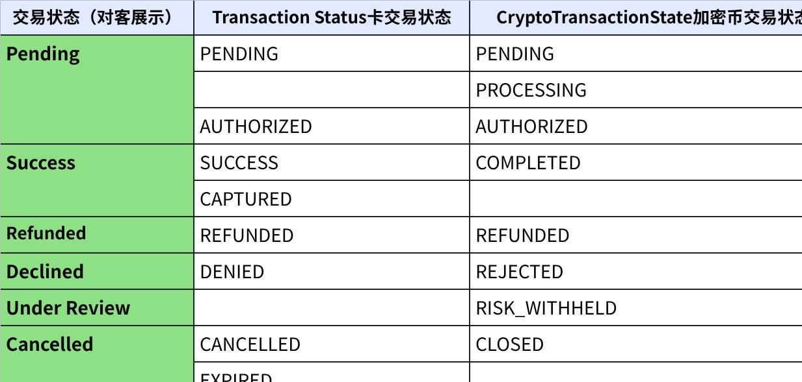

_Source: archive/legacy-prd/app/transaction-history/assets/media/image3.png_

### 4. 3. 状态及类型处理

_Source: archive/legacy-prd/app/transaction-history/assets/media/image4.jpeg_

### 5. 4. 数据字典

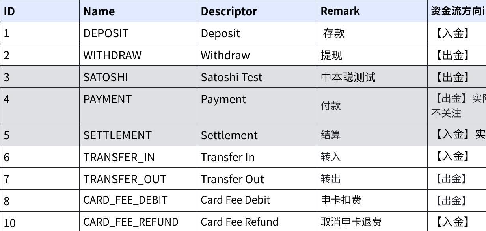

_Source: archive/legacy-prd/app/transaction-history/assets/media/image5.png_

### 6. 4. 数据字典

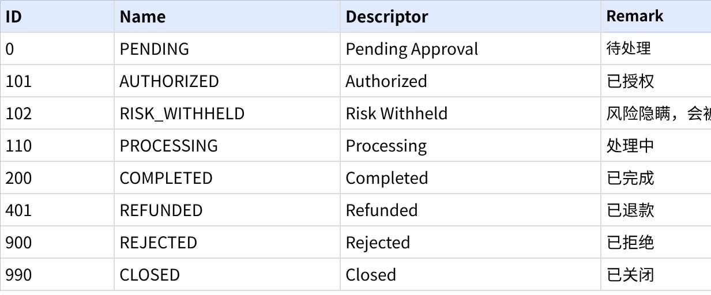

_Source: archive/legacy-prd/app/transaction-history/assets/media/image6.png_

### 7. 4. 数据字典

_Source: archive/legacy-prd/app/transaction-history/assets/media/image7.png_

### 8. 4. 数据字典

_Source: archive/legacy-prd/app/transaction-history/assets/media/image8.png_

### 9. 4. 数据字典

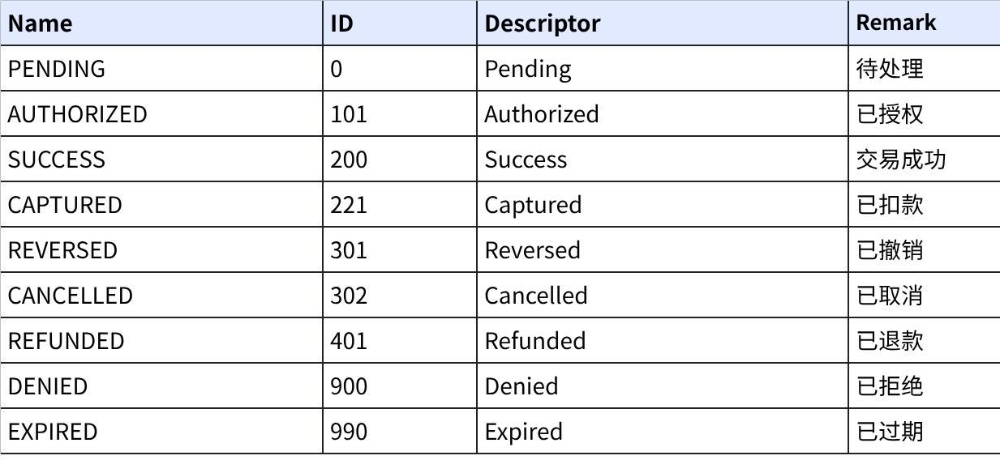

_Source: archive/legacy-prd/app/transaction-history/assets/media/image9.png_

### 10. 4. 数据字典

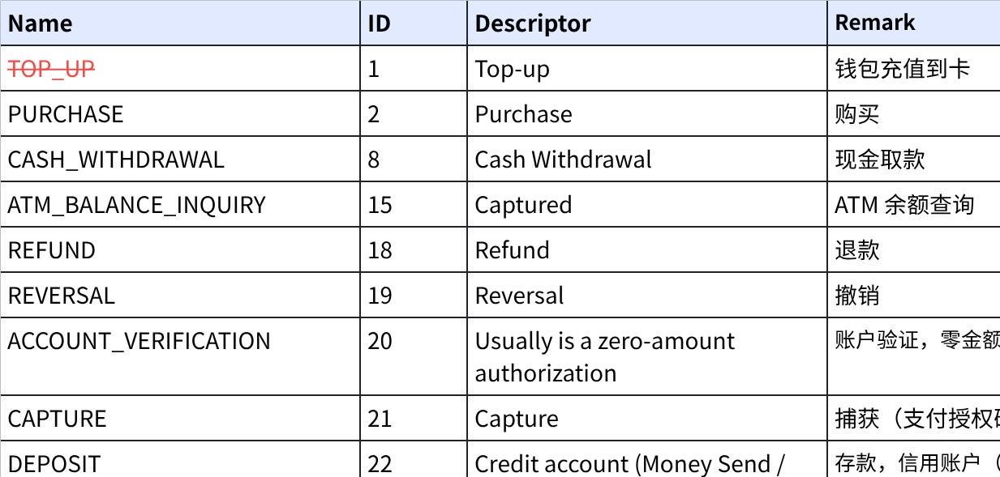

_Source: archive/legacy-prd/app/transaction-history/assets/media/image10.png_

### 11. Swap

_Source: archive/legacy-prd/app/transaction-history/assets/media/image40.png_

### 12. Swap

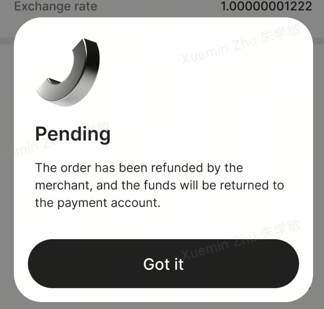

_Source: archive/legacy-prd/app/transaction-history/assets/media/image36.png_

### 13. 8. DTC渠道接口需求

_Source: archive/legacy-prd/app/transaction-history/assets/media/image41.jpeg_

### 14. 8. DTC渠道接口需求

_Source: archive/legacy-prd/app/transaction-history/assets/media/image42.png_

### 15. 8. DTC渠道接口需求

_Source: archive/legacy-prd/app/transaction-history/assets/media/image43.png_

### 16. 8. DTC渠道接口需求

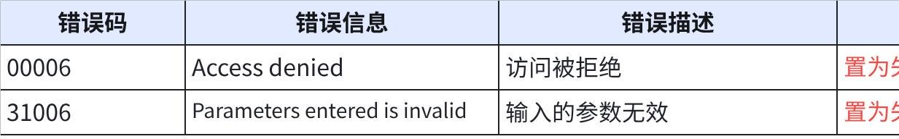

_Source: archive/legacy-prd/app/transaction-history/assets/media/image44.png_

### 17. 8. DTC渠道接口需求

_Source: archive/legacy-prd/app/transaction-history/assets/media/image45.jpeg_

### 18. 8. DTC渠道接口需求

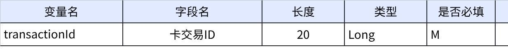

_Source: archive/legacy-prd/app/transaction-history/assets/media/image46.png_

### 19. 8. DTC渠道接口需求

_Source: archive/legacy-prd/app/transaction-history/assets/media/image43.png_

### 20. 8. DTC渠道接口需求

_Source: archive/legacy-prd/app/transaction-history/assets/media/image47.png_

### 21. 8. DTC渠道接口需求

_Source: archive/legacy-prd/app/transaction-history/assets/media/image43.png_

### 22. 8. DTC渠道接口需求

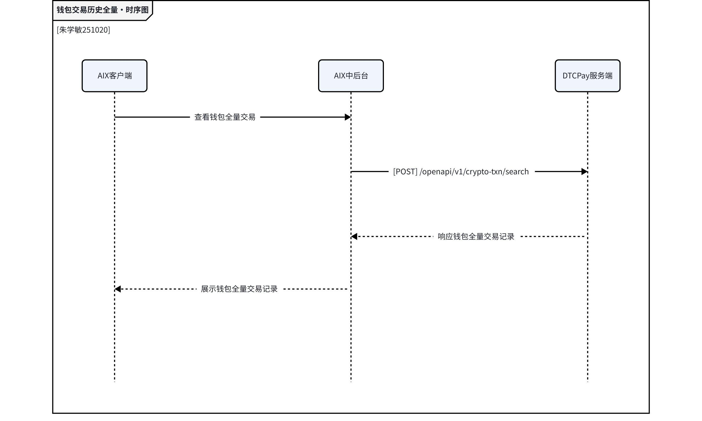

_Source: archive/legacy-prd/app/transaction-history/assets/media/image48.jpeg_

### 23. 8. DTC渠道接口需求

_Source: archive/legacy-prd/app/transaction-history/assets/media/image49.png_

### 24. 8. DTC渠道接口需求

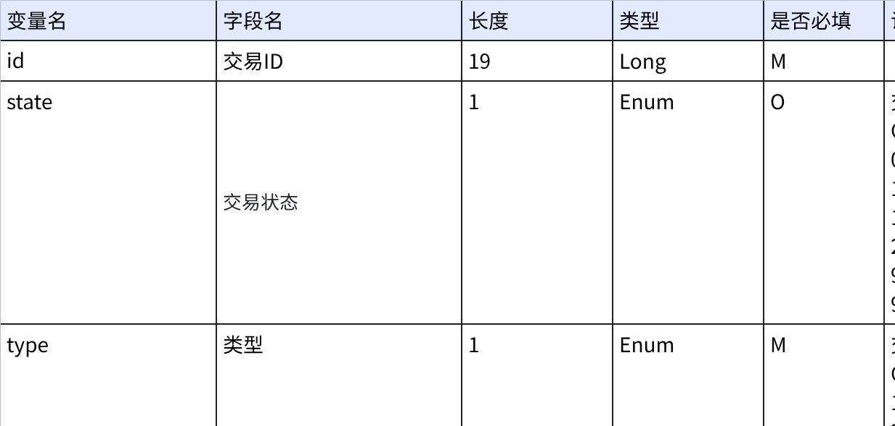

_Source: archive/legacy-prd/app/transaction-history/assets/media/image50.png_

### 25. 8. DTC渠道接口需求

_Source: archive/legacy-prd/app/transaction-history/assets/media/image51.png_

### 26. 8. DTC渠道接口需求

_Source: archive/legacy-prd/app/transaction-history/assets/media/image52.jpeg_

### 27. 8. DTC渠道接口需求

_Source: archive/legacy-prd/app/transaction-history/assets/media/image53.png_

### 28. 8. DTC渠道接口需求

_Source: archive/legacy-prd/app/transaction-history/assets/media/image54.png_

### 29. 8. DTC渠道接口需求

_Source: archive/legacy-prd/app/transaction-history/assets/media/image55.png_

### 30. 8. DTC渠道接口需求

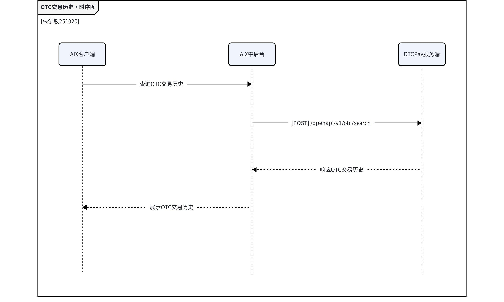

_Source: archive/legacy-prd/app/transaction-history/assets/media/image56.jpeg_

### 31. 8. DTC渠道接口需求

_Source: archive/legacy-prd/app/transaction-history/assets/media/image57.png_

### 32. 8. DTC渠道接口需求

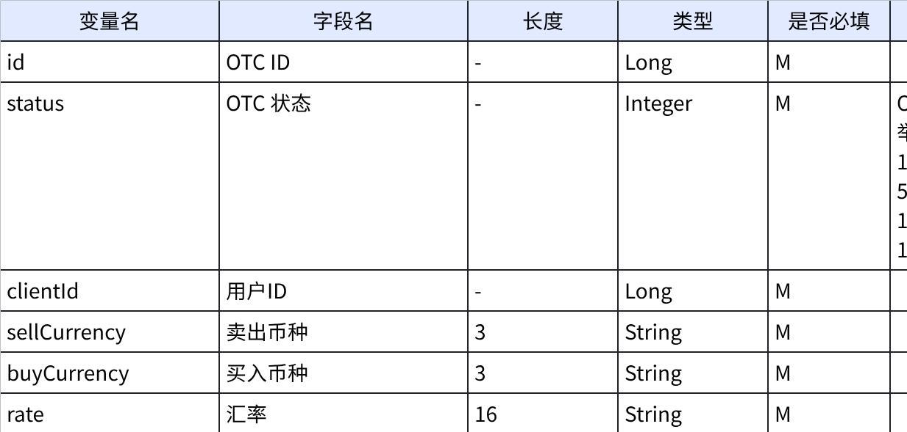

_Source: archive/legacy-prd/app/transaction-history/assets/media/image58.png_

### 33. 8. DTC渠道接口需求

_Source: archive/legacy-prd/app/transaction-history/assets/media/image59.png_

### 34. 8. DTC渠道接口需求

_Source: archive/legacy-prd/app/transaction-history/assets/media/image60.jpeg_

### 35. 8. DTC渠道接口需求

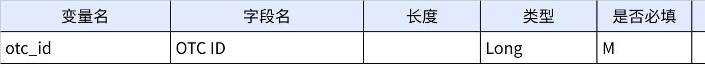

_Source: archive/legacy-prd/app/transaction-history/assets/media/image61.png_

### 36. 8. DTC渠道接口需求

_Source: archive/legacy-prd/app/transaction-history/assets/media/image62.png_

### 37. 8. DTC渠道接口需求

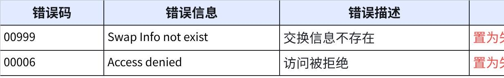

_Source: archive/legacy-prd/app/transaction-history/assets/media/image63.png_

## 3. 使用规则

1. 支撑图仅用于理解源 PRD。
2. 若图中内容与已校准 KB 文本冲突，以已校准 KB 文本或产品裁决为准。
3. 不得从支撑图截图单独推导未写入 KB 的 runtime 事实。