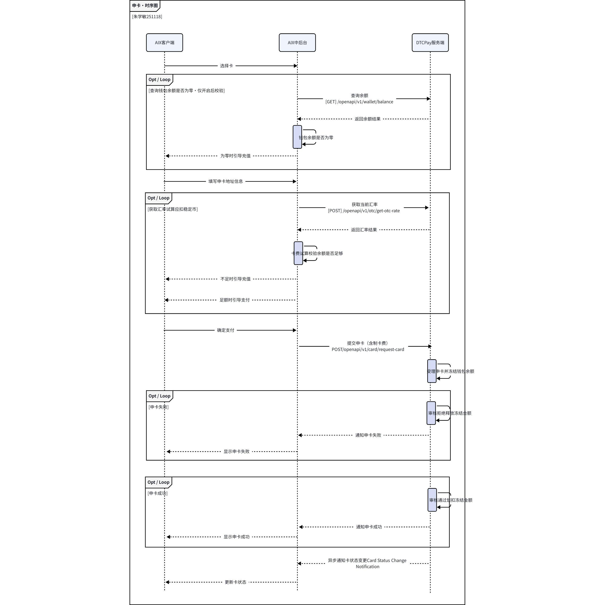
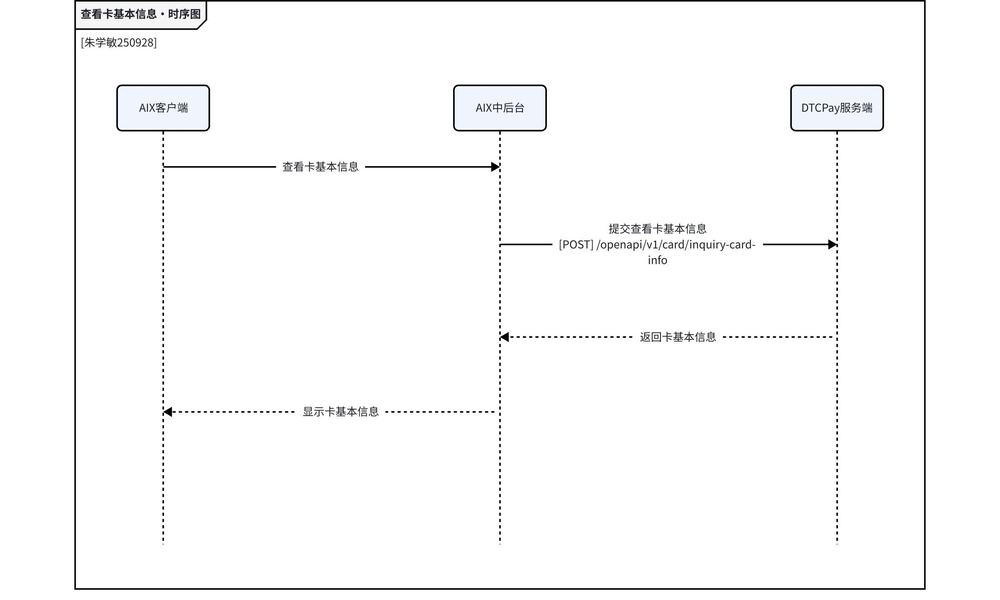
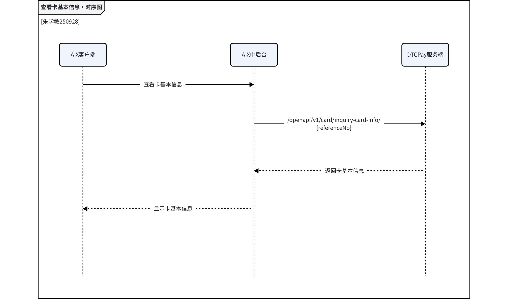
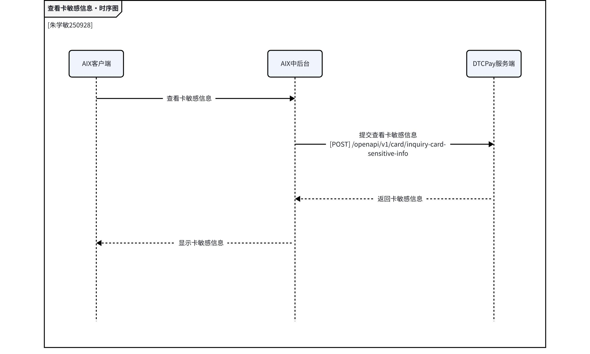
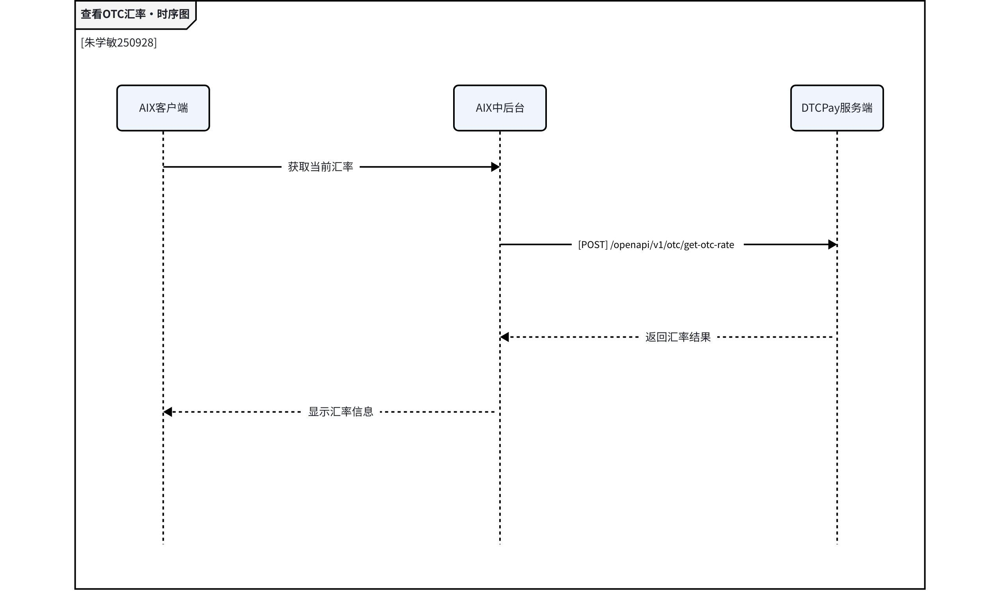

# card / application 支撑图

## 1. 文档定位

本文件承接流程图、接口图、数据字典、状态图等支撑视觉素材。它们用于辅助理解，不替代页面规则或字段事实。

## 2. Supporting Visuals

### 1. 4. Card申请单状态

_Source: archive/legacy-prd/card/application/assets/media/image1.jpeg_

### 2. 6. AIX前端功能需求

_Source: archive/legacy-prd/card/application/assets/media/image37.png_

### 3. 6. AIX前端功能需求

_Source: archive/legacy-prd/card/application/assets/media/image38.png_

### 4. 6. AIX前端功能需求

_Source: archive/legacy-prd/card/application/assets/media/image39.png_

### 5. Activate card

_Source: archive/legacy-prd/card/application/assets/media/image54.png_

### 6. 7. DTC渠道接口需求

_Source: archive/legacy-prd/card/application/assets/media/image55.jpeg_

### 7. 7. DTC渠道接口需求

_Source: archive/legacy-prd/card/application/assets/media/image56.jpeg_

### 8. 7. DTC渠道接口需求

_Source: archive/legacy-prd/card/application/assets/media/image57.jpeg_

### 9. 7. DTC渠道接口需求

_Source: archive/legacy-prd/card/application/assets/media/image58.jpeg_

### 10. 7. DTC渠道接口需求

_Source: archive/legacy-prd/card/application/assets/media/image59.jpeg_

### 11. 7. DTC渠道接口需求

_Source: archive/legacy-prd/card/application/assets/media/image60.jpeg_

### 12. 7. DTC渠道接口需求

_Source: archive/legacy-prd/card/application/assets/media/image61.jpeg_

## 3. 使用规则

1. 支撑图仅用于理解源 PRD。
2. 若图中内容与已校准 KB 文本冲突，以已校准 KB 文本或产品裁决为准。
3. 不得从支撑图截图单独推导未写入 KB 的 runtime 事实。