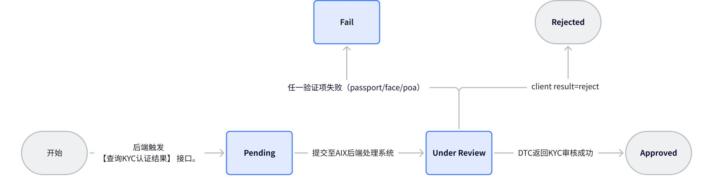
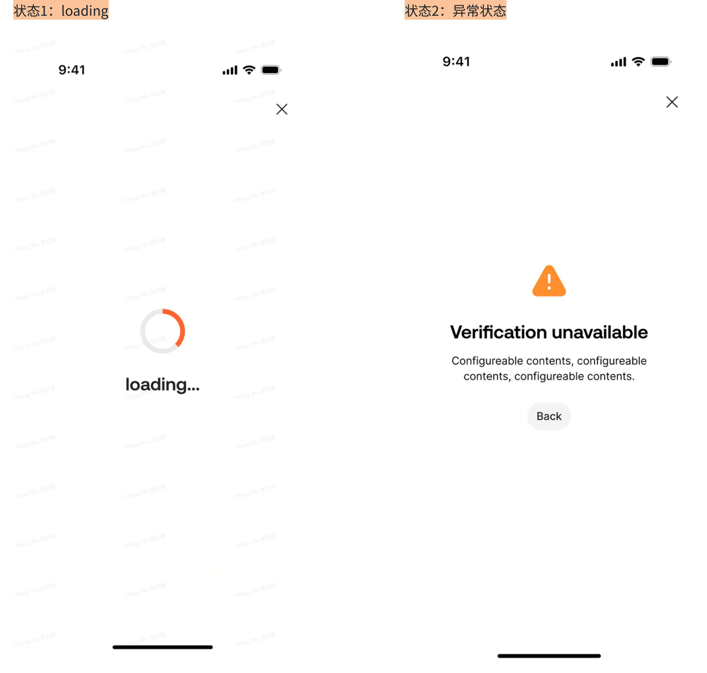

# kyc / wallet opening 支撑图

## 1. 文档定位

本文件承接流程图、接口图、数据字典、状态图等支撑视觉素材。它们用于辅助理解，不替代页面规则或字段事实。

## 2. Supporting Visuals

### 1. 4. 功能结构

_Source: archive/legacy-prd/kyc/wallet-opening/assets/media/image1.jpeg_

### 2. 6. 统一规则

_Source: archive/legacy-prd/kyc/wallet-opening/assets/media/image2.jpeg_

### 3. 6. 统一规则

_Source: archive/legacy-prd/kyc/wallet-opening/assets/media/image3.jpeg_

### 4. 7. 需求描述

_Source: archive/legacy-prd/kyc/wallet-opening/assets/media/image6.jpeg_

### 5. 7. 需求描述

_Source: archive/legacy-prd/kyc/wallet-opening/assets/media/image6.jpeg_

### 6. 7. 需求描述

_Source: archive/legacy-prd/kyc/wallet-opening/assets/media/image21.png_

## 3. 使用规则

1. 支撑图仅用于理解源 PRD。
2. 若图中内容与已校准 KB 文本冲突，以已校准 KB 文本或产品裁决为准。
3. 不得从支撑图截图单独推导未写入 KB 的 runtime 事实。