# notification / push inbox 支撑图

## 1. 文档定位

本文件承接流程图、接口图、数据字典、状态图等支撑视觉素材。它们用于辅助理解，不替代页面规则或字段事实。

## 2. Supporting Visuals

### 1. 1. 修订记录

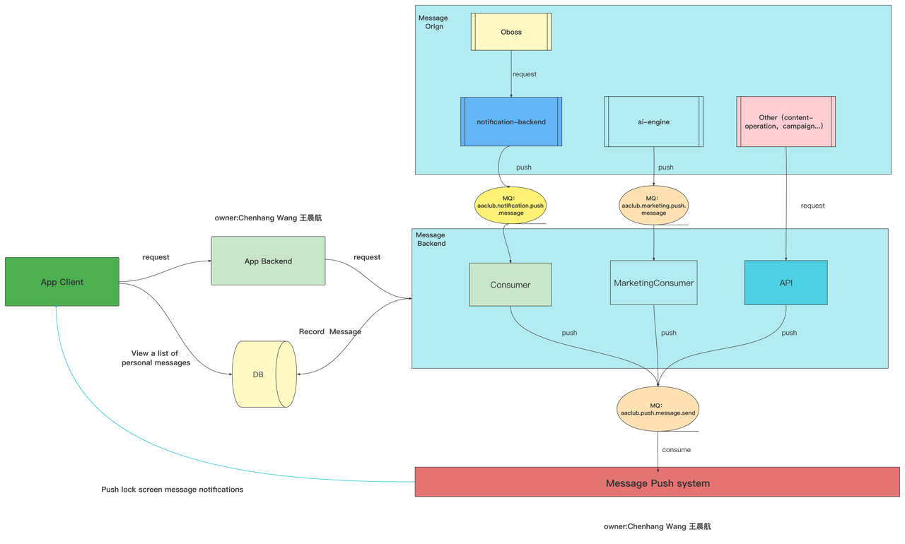

_Source: archive/converted-prd/notification/push-inbox/assets/media/image1.png_

### 2. 1. 修订记录

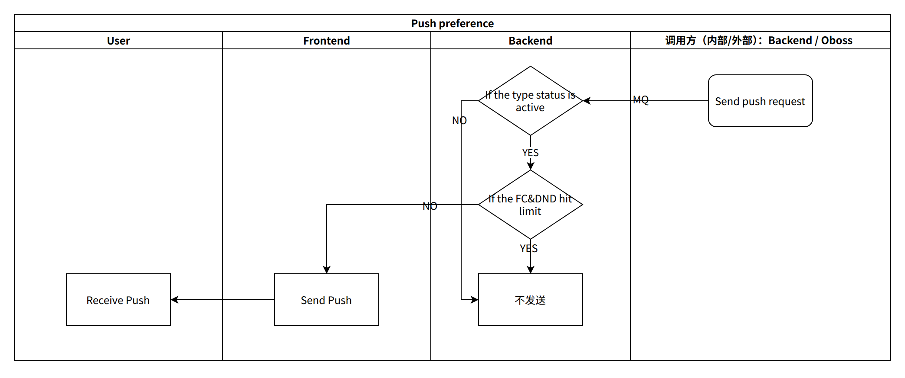

_Source: archive/converted-prd/notification/push-inbox/assets/media/image2.png_

### 3. 1. 修订记录

_Source: archive/converted-prd/notification/push-inbox/assets/media/image3.png_

### 4. 1. 修订记录

_Source: archive/converted-prd/notification/push-inbox/assets/media/image4.png_

### 5. 1. 修订记录

_Source: archive/converted-prd/notification/push-inbox/assets/media/image5.png_

### 6. 1. 修订记录

_Source: archive/converted-prd/notification/push-inbox/assets/media/image6.png_

### 7. 1. 修订记录

_Source: archive/converted-prd/notification/push-inbox/assets/media/image7.png_

### 8. 1. 修订记录

_Source: archive/converted-prd/notification/push-inbox/assets/media/image8.png_

### 9. 1. 修订记录

_Source: archive/converted-prd/notification/push-inbox/assets/media/image9.png_

### 10. 1. 修订记录

_Source: archive/converted-prd/notification/push-inbox/assets/media/image10.png_

### 11. 1. 修订记录

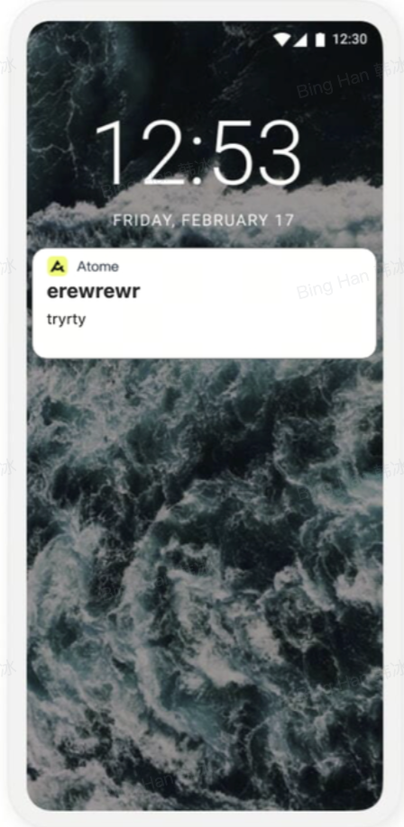

_Source: archive/converted-prd/notification/push-inbox/assets/media/image14.png_

### 12. 1. 修订记录

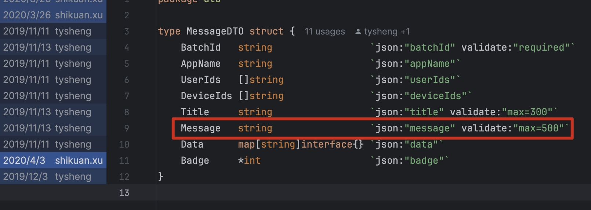

_Source: archive/converted-prd/notification/push-inbox/assets/media/image15.jpeg_

### 13. 1. 修订记录

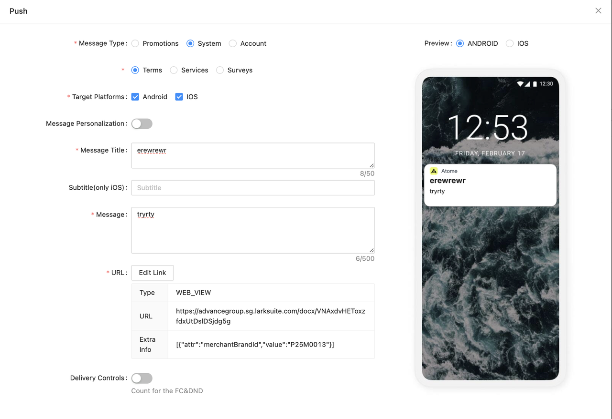

_Source: archive/converted-prd/notification/push-inbox/assets/media/image16.png_

### 14. 1. 修订记录

_Source: archive/converted-prd/notification/push-inbox/assets/media/image17.png_

### 15. 1. 修订记录

_Source: archive/converted-prd/notification/push-inbox/assets/media/image18.png_

### 16. 1. 修订记录

_Source: archive/converted-prd/notification/push-inbox/assets/media/image19.png_

### 17. 1. 修订记录

_Source: archive/converted-prd/notification/push-inbox/assets/media/image24.png_

### 18. 1. 修订记录

_Source: archive/converted-prd/notification/push-inbox/assets/media/image25.png_

### 19. 1. 修订记录

_Source: archive/converted-prd/notification/push-inbox/assets/media/image27.png_

### 20. 1. 修订记录

_Source: archive/converted-prd/notification/push-inbox/assets/media/image27.png_

### 21. 1. 修订记录

_Source: archive/converted-prd/notification/push-inbox/assets/media/image28.png_

### 22. 1. 修订记录

_Source: archive/converted-prd/notification/push-inbox/assets/media/image29.png_

### 23. 1. 修订记录

_Source: archive/converted-prd/notification/push-inbox/assets/media/image30.png_

### 24. 1. 修订记录

_Source: archive/converted-prd/notification/push-inbox/assets/media/image31.png_

### 25. 1. 修订记录

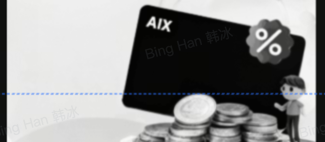

_Source: archive/converted-prd/notification/push-inbox/assets/media/image32.png_

### 26. 1. 修订记录

_Source: archive/converted-prd/notification/push-inbox/assets/media/image33.png_

### 27. 1. 修订记录

_Source: archive/converted-prd/notification/push-inbox/assets/media/image34.png_

### 28. 1. 修订记录

_Source: archive/converted-prd/notification/push-inbox/assets/media/image35.png_

### 29. 1. 修订记录

_Source: archive/converted-prd/notification/push-inbox/assets/media/image36.png_

### 30. 1. 修订记录

_Source: archive/converted-prd/notification/push-inbox/assets/media/image37.png_

### 31. 1. 修订记录

_Source: archive/converted-prd/notification/push-inbox/assets/media/image39.png_

### 32. 1. 修订记录

_Source: archive/converted-prd/notification/push-inbox/assets/media/image41.png_

### 33. 1. 修订记录

_Source: archive/converted-prd/notification/push-inbox/assets/media/image41.png_

### 34. 1. 修订记录

_Source: archive/converted-prd/notification/push-inbox/assets/media/image42.png_

### 35. 1. 修订记录

_Source: archive/converted-prd/notification/push-inbox/assets/media/image29.png_

### 36. 1. 修订记录

_Source: archive/converted-prd/notification/push-inbox/assets/media/image30.png_

### 37. 1. 修订记录

_Source: archive/converted-prd/notification/push-inbox/assets/media/image31.png_

### 38. 1. 修订记录

_Source: archive/converted-prd/notification/push-inbox/assets/media/image32.png_

### 39. 1. 修订记录

_Source: archive/converted-prd/notification/push-inbox/assets/media/image33.png_

### 40. 1. 修订记录

_Source: archive/converted-prd/notification/push-inbox/assets/media/image34.png_

### 41. 1. 修订记录

_Source: archive/converted-prd/notification/push-inbox/assets/media/image35.png_

### 42. 1. 修订记录

_Source: archive/converted-prd/notification/push-inbox/assets/media/image36.png_

### 43. 1. 修订记录

_Source: archive/converted-prd/notification/push-inbox/assets/media/image37.png_

### 44. 1. 修订记录

_Source: archive/converted-prd/notification/push-inbox/assets/media/image43.png_

### 45. 1. 修订记录

_Source: archive/converted-prd/notification/push-inbox/assets/media/image41.png_

### 46. 1. 修订记录

_Source: archive/converted-prd/notification/push-inbox/assets/media/image41.png_

### 47. 1. 修订记录

_Source: archive/converted-prd/notification/push-inbox/assets/media/image45.png_

### 48. 1. 修订记录

_Source: archive/converted-prd/notification/push-inbox/assets/media/image29.png_

### 49. 1. 修订记录

_Source: archive/converted-prd/notification/push-inbox/assets/media/image46.png_

### 50. 1. 修订记录

_Source: archive/converted-prd/notification/push-inbox/assets/media/image31.png_

### 51. 1. 修订记录

_Source: archive/converted-prd/notification/push-inbox/assets/media/image32.png_

### 52. 1. 修订记录

_Source: archive/converted-prd/notification/push-inbox/assets/media/image33.png_

### 53. 1. 修订记录

_Source: archive/converted-prd/notification/push-inbox/assets/media/image34.png_

### 54. 1. 修订记录

_Source: archive/converted-prd/notification/push-inbox/assets/media/image35.png_

### 55. 1. 修订记录

_Source: archive/converted-prd/notification/push-inbox/assets/media/image36.png_

### 56. 1. 修订记录

_Source: archive/converted-prd/notification/push-inbox/assets/media/image37.png_

### 57. 1. 修订记录

_Source: archive/converted-prd/notification/push-inbox/assets/media/image47.png_

### 58. 1. 修订记录

_Source: archive/converted-prd/notification/push-inbox/assets/media/image41.png_

### 59. 1. 修订记录

_Source: archive/converted-prd/notification/push-inbox/assets/media/image41.png_

### 60. 1. 修订记录

_Source: archive/converted-prd/notification/push-inbox/assets/media/image28.png_

### 61. 1. 修订记录

_Source: archive/converted-prd/notification/push-inbox/assets/media/image29.png_

### 62. 1. 修订记录

_Source: archive/converted-prd/notification/push-inbox/assets/media/image30.png_

### 63. 1. 修订记录

_Source: archive/converted-prd/notification/push-inbox/assets/media/image31.png_

### 64. 1. 修订记录

_Source: archive/converted-prd/notification/push-inbox/assets/media/image35.png_

### 65. 1. 修订记录

_Source: archive/converted-prd/notification/push-inbox/assets/media/image36.png_

### 66. 1. 修订记录

_Source: archive/converted-prd/notification/push-inbox/assets/media/image37.png_

### 67. 1. 修订记录

_Source: archive/converted-prd/notification/push-inbox/assets/media/image49.png_

### 68. 1. 修订记录

_Source: archive/converted-prd/notification/push-inbox/assets/media/image50.png_

### 69. 1. 修订记录

_Source: archive/converted-prd/notification/push-inbox/assets/media/image50.png_

### 70. 1. 修订记录

_Source: archive/converted-prd/notification/push-inbox/assets/media/image28.png_

### 71. 1. 修订记录

_Source: archive/converted-prd/notification/push-inbox/assets/media/image29.png_

### 72. 1. 修订记录

_Source: archive/converted-prd/notification/push-inbox/assets/media/image30.png_

### 73. 1. 修订记录

_Source: archive/converted-prd/notification/push-inbox/assets/media/image31.png_

### 74. 1. 修订记录

_Source: archive/converted-prd/notification/push-inbox/assets/media/image35.png_

### 75. 1. 修订记录

_Source: archive/converted-prd/notification/push-inbox/assets/media/image36.png_

### 76. 1. 修订记录

_Source: archive/converted-prd/notification/push-inbox/assets/media/image37.png_

### 77. 1. 修订记录

_Source: archive/converted-prd/notification/push-inbox/assets/media/image51.png_

### 78. 1. 修订记录

_Source: archive/converted-prd/notification/push-inbox/assets/media/image53.png_

### 79. 1. 修订记录

_Source: archive/converted-prd/notification/push-inbox/assets/media/image53.png_

### 80. 1. 修订记录

_Source: archive/converted-prd/notification/push-inbox/assets/media/image28.png_

### 81. 1. 修订记录

_Source: archive/converted-prd/notification/push-inbox/assets/media/image29.png_

### 82. 1. 修订记录

_Source: archive/converted-prd/notification/push-inbox/assets/media/image30.png_

### 83. 1. 修订记录

_Source: archive/converted-prd/notification/push-inbox/assets/media/image31.png_

### 84. 1. 修订记录

_Source: archive/converted-prd/notification/push-inbox/assets/media/image32.png_

### 85. 1. 修订记录

_Source: archive/converted-prd/notification/push-inbox/assets/media/image33.png_

### 86. 1. 修订记录

_Source: archive/converted-prd/notification/push-inbox/assets/media/image34.png_

### 87. 1. 修订记录

_Source: archive/converted-prd/notification/push-inbox/assets/media/image35.png_

### 88. 1. 修订记录

_Source: archive/converted-prd/notification/push-inbox/assets/media/image36.png_

### 89. 1. 修订记录

_Source: archive/converted-prd/notification/push-inbox/assets/media/image37.png_

### 90. 1. 修订记录

_Source: archive/converted-prd/notification/push-inbox/assets/media/image54.png_

### 91. 1. 修订记录

_Source: archive/converted-prd/notification/push-inbox/assets/media/image55.png_

### 92. 1. 修订记录

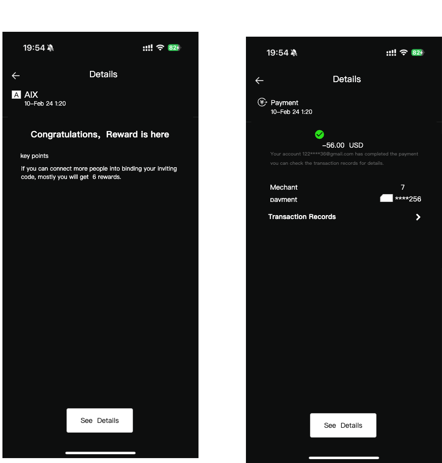

_Source: archive/converted-prd/notification/push-inbox/assets/media/image56.png_

### 93. 1. 修订记录

_Source: archive/converted-prd/notification/push-inbox/assets/media/image57.png_

### 94. 1. 修订记录

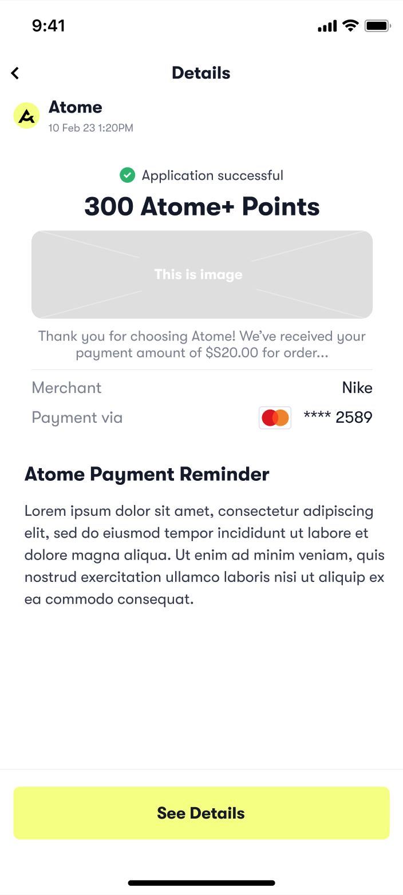

_Source: archive/converted-prd/notification/push-inbox/assets/media/image58.png_

### 95. 1. 修订记录

_Source: archive/converted-prd/notification/push-inbox/assets/media/image59.png_

### 96. 1. 修订记录

_Source: archive/converted-prd/notification/push-inbox/assets/media/image60.png_

### 97. 1. 修订记录

_Source: archive/converted-prd/notification/push-inbox/assets/media/image61.png_

### 98. 1. 修订记录

_Source: archive/converted-prd/notification/push-inbox/assets/media/image30.png_

### 99. 1. 修订记录

_Source: archive/converted-prd/notification/push-inbox/assets/media/image62.png_

### 100. 1. 修订记录

_Source: archive/converted-prd/notification/push-inbox/assets/media/image63.png_

### 101. 1. 加密钱包交易类webhook

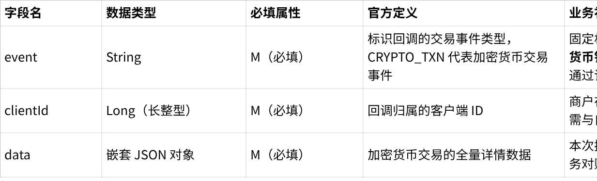

_Source: archive/converted-prd/notification/push-inbox/assets/media/image71.png_

### 102. 1. 加密钱包交易类webhook

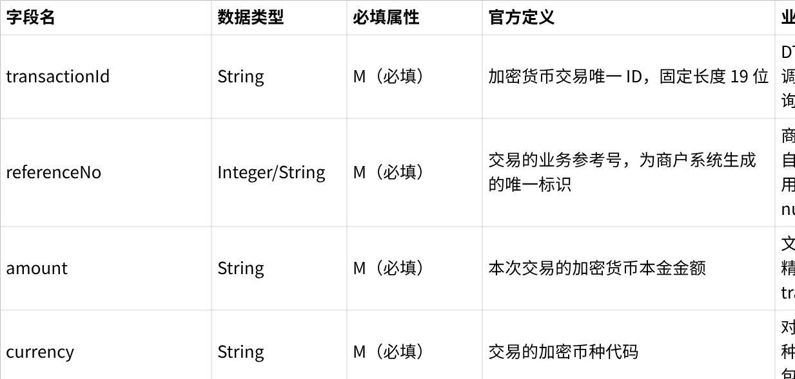

_Source: archive/converted-prd/notification/push-inbox/assets/media/image72.png_

### 103. 2. 卡交易类webhook

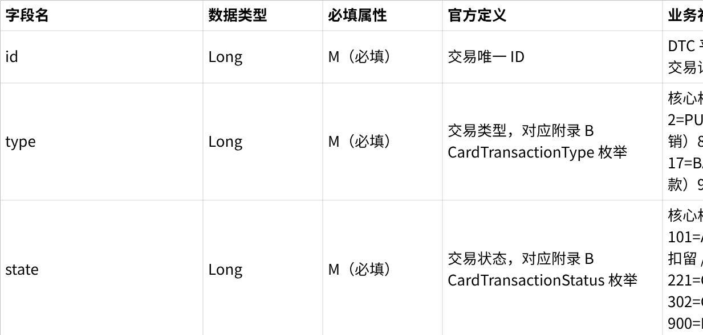

_Source: archive/converted-prd/notification/push-inbox/assets/media/image73.png_

### 104. 3. 卡状态变更

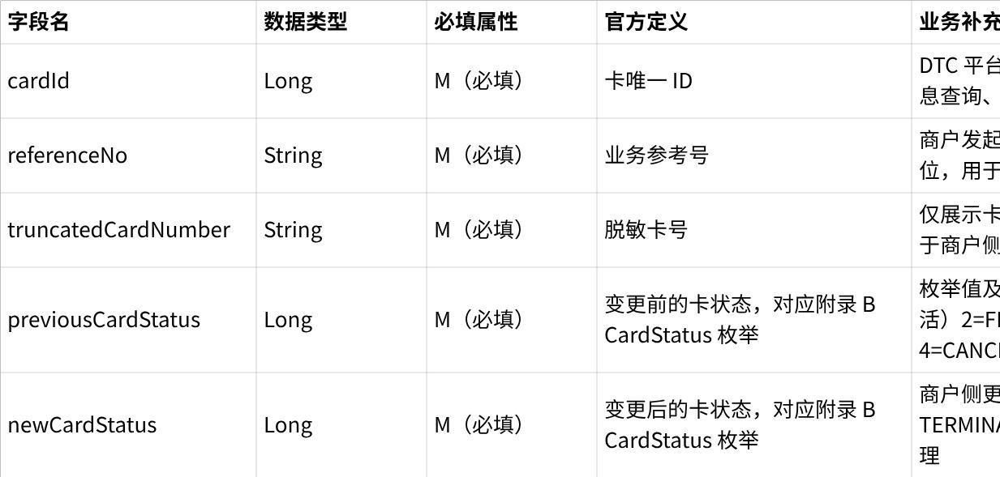

_Source: archive/converted-prd/notification/push-inbox/assets/media/image74.png_

### 105. 4. 其他可见

_Source: archive/converted-prd/notification/push-inbox/assets/media/image76.png_

### 106. 4. 其他可见

_Source: archive/converted-prd/notification/push-inbox/assets/media/image77.png_

### 107. 4. 其他可见

_Source: archive/converted-prd/notification/push-inbox/assets/media/image78.png_

### 108. 4. 其他可见

_Source: archive/converted-prd/notification/push-inbox/assets/media/image79.png_

### 109. 4. 其他可见

_Source: archive/converted-prd/notification/push-inbox/assets/media/image80.png_

### 110. 4. 其他可见

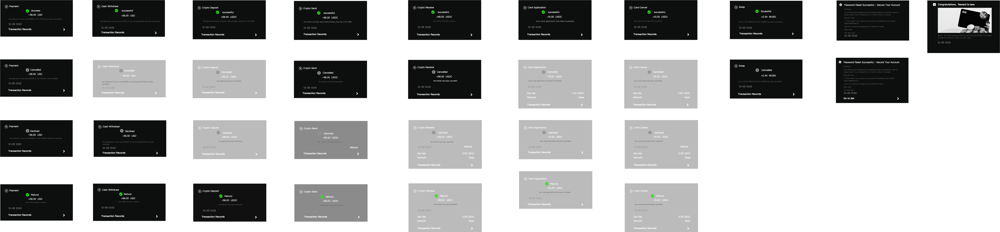

_Source: archive/converted-prd/notification/push-inbox/assets/media/image81.png_

### 111. 4. 其他可见

_Source: archive/converted-prd/notification/push-inbox/assets/media/image82.png_

### 112. 4. 其他可见

_Source: archive/converted-prd/notification/push-inbox/assets/media/image83.png_

### 113. 4. 其他可见

_Source: archive/converted-prd/notification/push-inbox/assets/media/image29.png_

### 114. 4. 其他可见

_Source: archive/converted-prd/notification/push-inbox/assets/media/image31.png_

### 115. 4. 其他可见

_Source: archive/converted-prd/notification/push-inbox/assets/media/image32.png_

### 116. 4. 其他可见

_Source: archive/converted-prd/notification/push-inbox/assets/media/image33.png_

### 117. 4. 其他可见

_Source: archive/converted-prd/notification/push-inbox/assets/media/image35.png_

### 118. 4. 其他可见

_Source: archive/converted-prd/notification/push-inbox/assets/media/image36.png_

### 119. 4. 其他可见

_Source: archive/converted-prd/notification/push-inbox/assets/media/image37.png_

## 3. 使用规则

1. 支撑图仅用于理解源 PRD。
2. 若图中内容与已校准 KB 文本冲突，以已校准 KB 文本或产品裁决为准。
3. 不得从支撑图截图单独推导未写入 KB 的 runtime 事实。