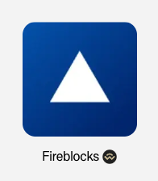

# oboss / capabilities 支撑图

## 1. 文档定位

本文件承接流程图、接口图、数据字典、状态图等支撑视觉素材。它们用于辅助理解，不替代页面规则或字段事实。

## 2. Supporting Visuals

### 1. 4. 需求描述

_Source: archive/legacy-prd/oboss/capabilities/assets/media/image11.png_

### 2. 4. 需求描述

_Source: archive/legacy-prd/oboss/capabilities/assets/media/image12.png_

### 3. 4. 需求描述

_Source: archive/legacy-prd/oboss/capabilities/assets/media/image13.png_

### 4. 4. 需求描述

_Source: archive/legacy-prd/oboss/capabilities/assets/media/image14.png_

### 5. 4. 需求描述

_Source: archive/legacy-prd/oboss/capabilities/assets/media/image15.png_

### 6. 4. 需求描述

_Source: archive/legacy-prd/oboss/capabilities/assets/media/image16.png_

### 7. 4. 需求描述

_Source: archive/legacy-prd/oboss/capabilities/assets/media/image17.png_

### 8. 4. 需求描述

_Source: archive/legacy-prd/oboss/capabilities/assets/media/image18.png_

### 9. 4. 需求描述

_Source: archive/legacy-prd/oboss/capabilities/assets/media/image19.png_

### 10. 4. 需求描述

_Source: archive/legacy-prd/oboss/capabilities/assets/media/image20.png_

### 11. 4. 需求描述

_Source: archive/legacy-prd/oboss/capabilities/assets/media/image21.png_

## 3. 使用规则

1. 支撑图仅用于理解源 PRD。
2. 若图中内容与已校准 KB 文本冲突，以已校准 KB 文本或产品裁决为准。
3. 不得从支撑图截图单独推导未写入 KB 的 runtime 事实。