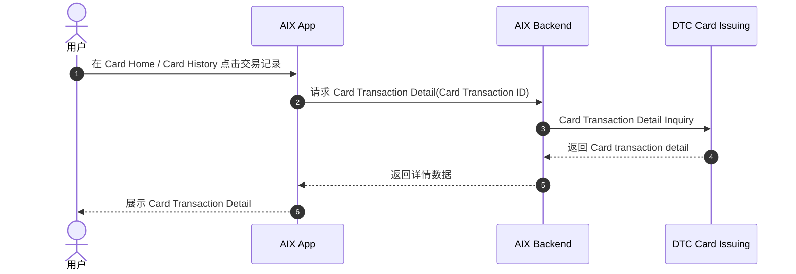
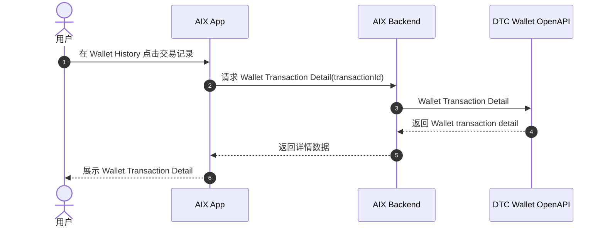
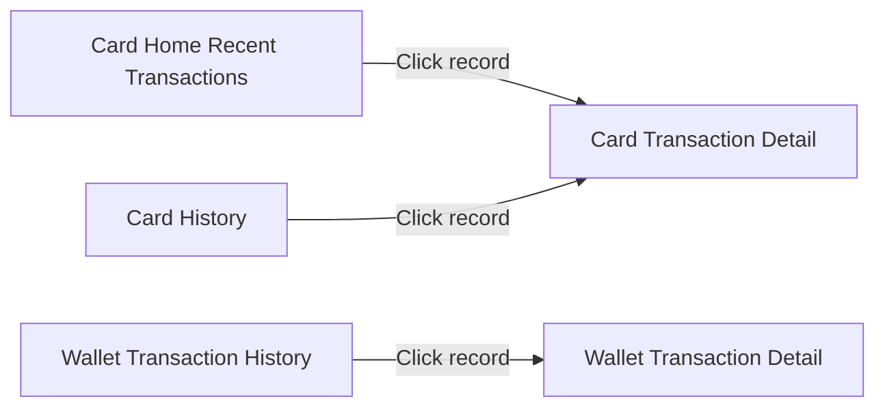

# Transaction Detail 交易详情

> 本文件是对 Card Transaction Detail、Wallet Transaction Detail、Deposit Transaction Detail 相关历史 PRD / DTC 文档内容的 AI-readable 结构化转译稿。  
> 本文件定位为单笔交易详情事实中心，承接 Transaction History 的点击详情场景。  
> 本文件不合并 Card / Wallet 的详情接口，不将两个模块中的 `transactionId` 视为同一业务字段，不补写未确认的关联关系。

---

## 1. 文档信息

| 项目 | 内容 |
|---|---|
| 功能名称 | Transaction Detail 交易详情 |
| 所属模块 | Transaction |
| Owner | 吴忆锋 |
| 版本 | 2.0 |
| 状态 | active |
| 更新时间 | 2026-05-04 |
| 文档类型 | AI-readable PRD translation |
| 来源文档 | DTC Wallet OpenAPI Document20260126；Transaction History；Transaction Status Model；Card Transaction Flow；Wallet Deposit；ALL-GAP |

---

## 2. 需求背景、目标与范围

### 2.1 需求背景

AIX 中 Card History 与 Wallet Transaction History 都存在点击单条记录进入交易详情的能力。Card 与 Wallet 的详情入口、查询入参、交易 ID、状态来源、字段边界和复制规则并不相同，需要分开记录。

### 2.2 用户问题 / 业务问题

产品、开发、QA、业务和 AI 读取交易详情时，需要避免以下混淆：

1. Card Transaction ID 与 Wallet `transactionId`。
2. Card `data.id` 与 Wallet `id`。
3. Wallet `relatedId` 与 Card、GTR、WalletConnect、AIX 归集请求 ID。
4. Card DTC status、Wallet `state`、Deposit success / Risk Withheld。
5. Card Detail 字段与 Wallet Detail 字段。

### 2.3 需求目标

将单笔交易详情相关原始事实整理成 AI 可读取的结构化 Markdown，作为 Card / Wallet / Deposit 详情查询的事实中心。

### 2.4 涉及功能清单

| 功能点 | 本期范围 | 优先级 | 状态 | 说明 |
|---|---|---|---|---|
| Card Transaction Detail | In Scope | P0 | Confirmed / Referenced | 可引用 Card Transaction Flow 中已确认入口、查询接口和字段 |
| Wallet Transaction Detail | In Scope | P0 | Confirmed / Partial | 详情能力、`transactionId` 入参、`id` 出参、`state` 已确认；完整字段见 ALL-GAP-048 |
| Deposit Transaction Detail | In Scope | P1 | Partial | 只记录 Deposit success、Risk Withheld、ActivityType 边界 |
| Send Transaction Detail | Out of Scope | - | Deferred | Send 未上线，不纳入 active 详情模型 |
| Swap Transaction Detail | Out of Scope | - | Deferred | Swap 未上线 / 需重做，不纳入 active 详情模型 |
| Reconciliation / 对账详情 | Out of Scope | - | Referenced | 字段关联和对账组合进入 ALL-GAP / Reconciliation |

---

## 3. 业务流程与规则

### 3.1 业务主流程说明

Transaction Detail 承接 Transaction History 中的单条记录点击动作：

- Card 记录点击后进入 Card Transaction Detail，使用 Card Transaction ID 查询。
- Wallet 记录点击后进入 Wallet Transaction Detail，使用 Wallet `transactionId` 查询。
- Deposit 相关详情只引用 Wallet Deposit、Wallet History 和 DTC Crypto Deposit 中已确认边界，不补完整状态机。

本文不建立跨 Card / Wallet 的统一详情模型。

### 3.2 业务时序图

#### 3.2.1 Card Transaction Detail

#### 3.2.2 Wallet Transaction Detail

### 3.3 流程步骤与业务规则

| 步骤 | 场景 / 规则 | 触发条件 | 责任方 | 系统处理 | 成功结果 | 失败 / 分支结果 | 来源 |
|---|---|---|---|---|---|---|---|
| 1 | Card 详情入口 | 用户点击 Card Home 交易区域或 Card History 记录 | App | 进入 Card Transaction Detail | 发起 Card detail 查询 | 原文未完整整理 | Card Transaction Flow |
| 2 | Card 详情查询 | 已有 Card Transaction ID | App / Backend / DTC | Card Transaction Detail Inquiry | 返回 Card 详情 | 原文未完整整理 | Card Transaction Flow / DTC Card Issuing |
| 3 | Wallet 详情入口 | 用户点击 Wallet History 记录 | App | 进入 Wallet Transaction Detail | 发起 Wallet detail 查询 | 原文未完整整理 | Transaction History |
| 4 | Wallet 详情查询 | 已有 Wallet `transactionId` | App / Backend / DTC | 使用 `transactionId` 查询详情 | 返回 Wallet 详情 | 完整请求 / 响应见 ALL-GAP-048 | DTC Wallet OpenAPI / Transaction History |
| 5 | Deposit 详情边界 | Deposit success / Risk Withheld / ActivityType 进入详情语境 | App / Backend / DTC | 引用 Deposit 与 History 事实 | 展示已确认边界 | 状态映射和余额影响见 ALL-GAP | Wallet Deposit；DTC Crypto Deposit |

### 3.4 状态规则

Transaction Detail 不创建新的统一状态机，只引用各来源中的详情状态。

| 状态 | 含义 | 触发条件 | 用户可见表现 | 系统处理 | 可迁移到 | 是否终态 | 来源 |
|---|---|---|---|---|---|---|---|
| Wallet `state` | Wallet 交易状态字段 | Wallet Transaction Detail / History 返回 | 前端文案见 ALL-GAP-051 | 枚举引用 Status Model | 进入 / 退出条件见 ALL-GAP-050 | 未确认 | Transaction History；Status Model |
| Card DTC status / state | Card 交易状态来源 | Card Transaction Detail 返回 | AIX 前端展示状态映射见 ALL-GAP-053 | 不与 Wallet `state` 合并 | 不适用 | 未确认 | Card Transaction Flow |
| Deposit `success` | Deposit 成功来源 | Notification / payment_info success | 不得直接等同 Wallet `COMPLETED` | 仅作为 Deposit success 来源引用 | Wallet state 映射见 ALL-GAP-016 | 未确认 | Wallet Deposit；Notification |
| Risk Withheld | DTC Crypto Deposit 外部状态 | DTC 异步返回 Risk Withheld / `status=102` | 详情展示 under review；不触发充值结果页 | 不得等同 Wallet `REJECTED / PENDING / PROCESSING` | 余额影响见 ALL-GAP-008 | 未确认 | DTC Crypto Deposit；用户确认 |

### 3.5 业务级异常与失败处理

| 异常场景 | 触发条件 | 错误来源 | 错误码 / 原因 | 用户表现 | 系统处理 | 是否可重试 | 最终状态 |
|---|---|---|---|---|---|---|---|
| Card Detail 查询失败 | Card Transaction Detail Inquiry 失败 | App / Backend / DTC | 原文未提供 | 原文未提供 | 原文未完整整理 | 未确认 | 未确认 |
| Wallet Detail 查询失败 | Wallet Transaction Detail 查询失败 | App / Backend / DTC | 原文未提供 | 原文未提供 | 见 ALL-GAP-048 | 未确认 | 未确认 |
| Risk Withheld 详情展示 | DTC 异步返回 Risk Withheld | DTC Crypto Deposit | `status=102` | under review | 不触发充值结果页；余额关系见 ALL-GAP-008 | 不适用 | 未确认 |

---

## 4. 页面与交互说明

### 4.1 页面关系总览图

### 4.2 Card Transaction Detail

| 区块 | 内容 |
|---|---|
| 页面类型 | 交易详情页 |
| 页面目标 | 展示单笔 Card transaction detail |
| 入口 / 触发 | Card Home 交易区域、Card History 记录 |
| 展示内容 | Card detail 字段；完整前端展示字段见 ALL-GAP-049 |
| 用户动作 | 查看详情；复制 Transaction ID |
| 系统处理 / 责任方 | 使用 Card Transaction ID 查询 Card Transaction Detail Inquiry |
| 元素 / 状态 / 提示规则 | DTC 异步通知结果需同步更新并展示 |
| 成功流转 | 展示 Card Transaction Detail |
| 失败 / 异常流转 | 原文未完整整理 |
| 备注 / 边界 | Card Transaction ID 不等同 Wallet `transactionId` |

### 4.3 Wallet Transaction Detail

| 区块 | 内容 |
|---|---|
| 页面类型 | 交易详情页 |
| 页面目标 | 展示单笔 Wallet transaction detail |
| 入口 / 触发 | 用户点击 Wallet Transaction History 记录 |
| 展示内容 | Wallet Transaction Detail；完整页面展示字段见 ALL-GAP-048 |
| 用户动作 | 查看详情；是否支持复制交易 ID 见 ALL-GAP-048 |
| 系统处理 / 责任方 | 使用 `transactionId` 查询 Wallet 交易详情 |
| 元素 / 状态 / 提示规则 | `state` 枚举引用 Status Model；`relatedId` 关联规则见 ALL-GAP-014 |
| 成功流转 | 展示 Wallet Transaction Detail |
| 失败 / 异常流转 | 原文未提供 |
| 备注 / 边界 | Wallet `transactionId`、`id`、`relatedId` 关系未完全确认 |

### 4.4 Deposit Transaction Detail 引用

| 区块 | 内容 |
|---|---|
| 页面类型 | Wallet 交易详情引用场景 |
| 页面目标 | 展示 Deposit 相关详情边界 |
| 入口 / 触发 | 用户从 Wallet History / Deposit 相关入口查看详情 |
| 展示内容 | Deposit success、Risk Withheld、ActivityType 相关信息 |
| 用户动作 | 查看详情 |
| 系统处理 / 责任方 | 引用 Wallet Deposit、Wallet History、DTC Crypto Deposit 事实 |
| 元素 / 状态 / 提示规则 | Risk Withheld 详情展示 under review；不触发充值结果页 |
| 成功流转 | 展示详情 |
| 失败 / 异常流转 | 原文未完整整理 |
| 备注 / 边界 | Deposit success 不等同 Wallet `COMPLETED`；Risk Withheld 不等同 Wallet `REJECTED` |

---

## 5. 字段、接口与数据

### 5.1 Card Detail 可引用字段

| 类型 | 名称 | 所属系统 | 来源 | 用途 | 规则 / 输入输出 | 异常处理 |
|---|---|---|---|---|---|---|
| 接口 | Card Transaction Detail Inquiry | DTC Card Issuing | Card Transaction Flow | 查询 Card 交易详情 | 入参为 Card Transaction ID | 原文未完整整理 |
| 字段 | `id` / `data.id` | Card / DTC | Card Transaction Flow | DTC Card Transaction ID | 可引用 | 不等同 Wallet `transactionId` |
| 字段 | `originalId` | Card / DTC | Card Transaction Flow | Original Transaction ID | 选填 | 原文未完整整理 |
| 字段 | `cardId` | Card / DTC | Card Transaction Flow | Card 关联字段 | 可引用 | 原文未完整整理 |
| 字段 | `processorTransactionId` | Card / DTC | Card Transaction Flow | Card 交易关联字段 | 可引用 | 原文未完整整理 |
| 字段 | `referenceNo` | Card / DTC | Card Transaction Flow | Card 交易关联字段 | 可引用 | 原文未完整整理 |
| 字段 | `amount` / `currency` | Card / DTC | Card Transaction Flow | Card 交易金额与币种 | 可引用 | 原文未完整整理 |
| 字段 | `requestAmount` / `requestCurrency` | Card / DTC | Card Transaction Flow | 请求金额与请求币种 | 可引用 | 原文未完整整理 |
| 字段 | `indicator` | Card / DTC | Card Transaction Flow | 交易方向 | 可引用 | 原文未完整整理 |
| 字段 | `transactionDate` / `transactionTime` / `confirmedTime` / `createdDate` | Card / DTC | Card Transaction Flow | Card 交易时间 | 可引用 | 原文未完整整理 |
| 字段 | `merchantName` | Card / DTC | Card Transaction Flow | 商户字段 | 可引用 | 原文未完整整理 |
| 能力 | Copy Transaction ID | Card | Card Transaction Flow | 复制交易 ID | Card Transaction ID 支持复制 | 不套用到 Wallet |

Card Detail 前端展示字段完整列表仍需确认，见 ALL-GAP-049。

### 5.2 Wallet Detail 可引用字段

| 类型 | 名称 | 所属系统 | 来源 | 用途 | 规则 / 输入输出 | 异常处理 |
|---|---|---|---|---|---|---|
| 能力 | Wallet Transaction Detail | DTC Wallet OpenAPI | Transaction History | 查询 Wallet 交易详情 | 存在 Wallet 交易详情能力 | 完整请求 / 响应见 ALL-GAP-048 |
| 字段 | `transactionId` | Wallet / DTC | Transaction History | 详情查询入参 | Unique transaction ID from DTC | 与 Wallet `id` 关系见 ALL-GAP-015 |
| 字段 | `id` | Wallet / DTC | Transaction History | Wallet 交易记录 / 详情出参 | Long，交易 id | 与 `transactionId`、`relatedId` 关系见 ALL-GAP |
| 字段 | `state` | Wallet / DTC | Transaction History / Status Model | Wallet 交易状态字段 | 枚举已确认 | 进入 / 退出条件见 ALL-GAP-050 |
| 字段 | `activityType` | Wallet / DTC | Search Balance History / ActivityType | 交易分类字段 | 已确认部分枚举 | 前端展示映射见 ALL-GAP-037 |
| 字段 | `relatedId` | Wallet / DTC | Search Balance History | 关联 ID | Card / GTR / WC 场景取值见 ALL-GAP-014 | 未确认 |
| 字段 | `time` | Wallet / DTC | Search Balance History | 交易 / 历史时间 | 时间格式待补 | 未确认 |
| 能力 | Copy Transaction ID | Wallet | Transaction History / ALL-GAP | 是否支持复制交易 ID | 见 ALL-GAP-048 | 未确认 |

### 5.3 ActivityType 对详情的影响

| 枚举 | 值 | 含义 | Detail 处理 |
|---|---:|---|---|
| `FIAT_DEPOSIT` | 6 | Fiat Deposit | 可作为法币入金详情分类引用；是否对应 GTR 见 ALL-GAP-001 |
| `CRYPTO_DEPOSIT` | 10 | Stablecoin Deposit | 可作为 Crypto / WalletConnect 入金详情分类引用；是否对应 WalletConnect 见 ALL-GAP-002 |
| `DTC_WALLET` | 13 | DTC Wallet Payment | 可作为 DTC Wallet Payment 详情分类引用 |
| `CARD_PAYMENT_REFUND` | 20 | Card Payment Refund | 可作为 Card refund 入 Wallet 相关详情分类引用；与 Card 归集链路关联见 ALL-GAP-017、ALL-GAP-018 |

---

## 6. 通知规则

Transaction Detail 本身不新增通知规则，只引用 Deposit / Card / Wallet 相关状态来源。

| 触发事件 | 通知渠道 | 通知对象 | 文案 / 模板 | 跳转目标 | 失败 / 补发规则 |
|---|---|---|---|---|---|
| Deposit success | Notification PRD 有 Deposit success | 用户 | Deposit success | 是否跳转详情未完整确认 | 见 ALL-GAP-010、ALL-GAP-016 |
| Risk Withheld / under review | DTC Crypto Deposit / Notification 口径 | 用户 | under review | 用户查询交易详情时可见 under review | 见 ALL-GAP-008 |
| Card 异步通知 | DTC Card 异步通知 | 用户 / 系统 | 原文未完整整理 | 详情需同步更新展示 | Card Transaction Flow |

---

## 7. 权限 / 合规 / 风控

| 类型 | 规则 | 影响 | 来源 |
|---|---|---|---|
| 数据边界 | Card Detail 与 Wallet Detail 不合并接口、字段或复制规则 | 避免错误套用字段 | Card Transaction Flow；DTC Wallet OpenAPI |
| 状态边界 | Card DTC status、Wallet `state`、Deposit `success` / Risk Withheld 并列引用 | 避免错误状态映射 | Status Model；ALL-GAP |
| 风控 | Risk Withheld 是 DTC Crypto Deposit 外部状态 | 详情展示 under review；不得等同 Wallet `REJECTED` | DTC Crypto Deposit；用户确认 |
| 对账 | `id`、`transactionId`、`relatedId` 只记录来源，不补关联规则 | 具体关联进入 ALL-GAP / Reconciliation | ALL-GAP-014、015、018 |

---

## 8. 待确认事项

| 问题 | 影响范围 | 当前处理 | 是否阻塞验收 | 建议确认人 |
|---|---|---|---|---|
| Wallet Transaction Detail 完整请求字段 | Wallet 详情联调 | 引用 ALL-GAP-048 | 否 | Backend / DTC |
| Wallet Transaction Detail 完整响应字段 | Wallet 详情展示 / QA | 引用 ALL-GAP-048 | 否 | Backend / DTC / Product |
| Wallet Detail 页面展示字段 | UI / QA | 引用 ALL-GAP-048 | 否 | Product / UI |
| Wallet Detail 是否支持复制交易 ID | 交互 / UI | 引用 ALL-GAP-048 | 否 | Product / UI |
| Wallet `transactionId` 与 Wallet `id` 的关系 | 详情 / 对账 | 引用 ALL-GAP-015 | 否 | Backend / DTC |
| Wallet `relatedId` 关联规则 | Card / GTR / WC / 对账 | 引用 ALL-GAP-014 | 否 | Backend / DTC / Finance |
| Card Detail 前端展示字段完整列表 | Card 详情展示 | 引用 ALL-GAP-049 | 否 | Product / UI |
| GTR 与 FIAT_DEPOSIT 映射 | Deposit 详情分类 | 引用 ALL-GAP-001 | 否 | Backend / DTC / Product |
| WalletConnect 与 CRYPTO_DEPOSIT 映射 | Deposit 详情分类 | 引用 ALL-GAP-002 | 否 | Backend / DTC / Product |
| Risk Withheld 在详情页的展示和余额影响 | 详情 / 状态 / 余额 | 引用 ALL-GAP-008 | 否 | Product / Backend / DTC |

---

## 9. 验收标准 / 测试场景

### 9.1 验收标准

本文是历史 PRD / DTC 文档的 AI-readable 转译稿，不作为新迭代 PRD 直接验收依据。当前验收标准仅用于检查转译质量：

| 验收场景 | 验收标准 |
|---|---|
| 范围边界 | 只覆盖 Card / Wallet / Deposit Detail 已确认事实；Send / Swap 不纳入 active 范围 |
| 来源一致性 | 所有接口、字段、状态、ActivityType 均可追溯到原文档、已有主事实文件或 ALL-GAP |
| 未确认项处理 | 未确认内容进入 ALL-GAP，不写成已确认事实 |
| ID 边界 | Card Transaction ID、Wallet `transactionId`、Wallet `id`、`relatedId` 不混写 |
| 状态处理 | 不新增统一状态机；只引用 Status Model 和原文状态来源 |

### 9.2 测试场景矩阵

本文不生成新产品测试用例。若基于本文发起新迭代，应另建符合 `standard-prd-template.md` 的 PRD，并补充真实验收场景。当前仅保留转译检查矩阵：

| 场景 | 前置条件 | 用户操作 | 预期页面表现 | 预期系统结果 | 是否必测 |
|---|---|---|---|---|---|
| Card Detail 事实检查 | Card Transaction Flow 可查 | 核对入口、查询接口、可引用字段 | 与原文一致 | 不套用 Wallet 字段 | 是 |
| Wallet Detail 事实检查 | DTC Wallet OpenAPI / Transaction History 可查 | 核对 transactionId、id、state、activityType、relatedId | 与原文一致 | 不补完整字段表 | 是 |
| Deposit Detail 边界检查 | Deposit / DTC Crypto Deposit 可查 | 核对 success、Risk Withheld、ActivityType | 与原文和用户确认一致 | 未确认映射进入 ALL-GAP | 是 |
| ID 边界检查 | Card / Wallet 来源均可查 | 核对 Card ID 与 Wallet ID 关系 | 不混写 | 正确引用 ALL-GAP | 是 |

---

## 10. 不写入事实的内容

以下内容当前不得写成事实：

1. Card Transaction ID 等同于 Wallet `transactionId`。
2. Wallet `transactionId` 等同于 Card `data.id`。
3. Wallet `id` 等同于 Card `data.id`。
4. Wallet `relatedId` 等同于 Card `data.id`。
5. Wallet `relatedId` 等同于 AIX 归集请求 ID。
6. Card Detail 与 Wallet Detail 使用同一个详情接口。
7. Wallet Detail 字段与 Card Detail 字段完全一致。
8. Wallet Detail 的复制规则与 Card Detail 一致。
9. Send / Swap Detail 属于当前 active 范围。
10. Card balance 转 Wallet 的资金追踪链路已闭环。
11. `FIAT_DEPOSIT` 必然等同 GTR。
12. `CRYPTO_DEPOSIT` 必然等同 WalletConnect。
13. Deposit success 必然等同 Wallet `COMPLETED`。
14. Risk Withheld 必然等同 Wallet `REJECTED`。

---

## 11. 来源引用

- (Ref: DTC Wallet OpenAPI Document20260126 / 4.2.4 Search Balance History)
- (Ref: DTC Wallet OpenAPI Document20260126 / Appendix ActivityType)
- (Ref: DTC Wallet OpenAPI Document20260126 / 3.4 Crypto Deposit)
- (Ref: knowledge-base/transaction/status-model.md / Wallet state)
- (Ref: knowledge-base/transaction/history.md / Transaction History)
- (Ref: knowledge-base/wallet/deposit.md / Wallet Deposit)
- (Ref: knowledge-base/card/card-transaction-flow.md / Card Transaction Detail)
- (Ref: knowledge-base/changelog/knowledge-gaps.md / ALL-GAP 总表)
