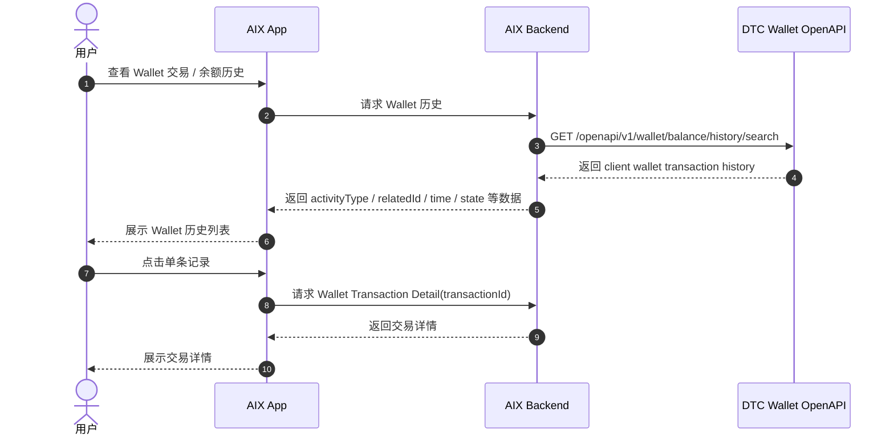
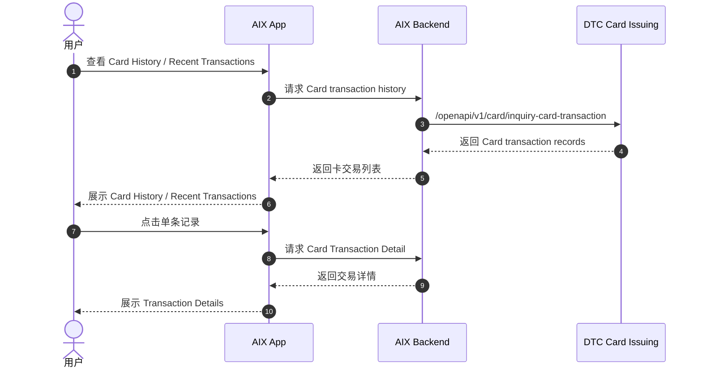
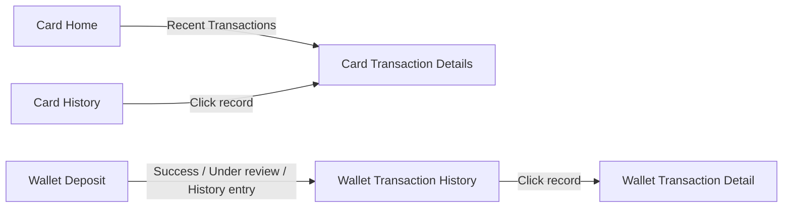

# Transaction History 交易历史

> 本文件是对 Card History、Wallet Transaction History、Deposit History 相关历史 PRD / DTC 文档内容的 AI-readable 结构化转译稿。  
> 本文件定位为交易历史事实载体，不是新的全局交易流水设计，不合并 Card / Wallet 字段来源，不补写未确认状态机。  
> 原 `wallet/transaction-history.md` 已合并至本文件；Wallet 交易历史主事实源以本文为准。

---

## 1. 文档信息

| 项目 | 内容 |
|---|---|
| 功能名称 | Transaction History 交易历史 |
| 所属模块 | Transaction |
| Owner | 吴忆锋 |
| 版本 | 2.0 |
| 状态 | active |
| 更新时间 | 2026-05-04 |
| 文档类型 | AI-readable PRD translation |
| 来源文档 | DTC Wallet OpenAPI Document20260126；Card Transaction Flow；Transaction Detail；Wallet Balance；Wallet Deposit；ALL-GAP |

---

## 2. 需求背景、目标与范围

### 2.1 需求背景

AIX 中存在多类交易历史能力，包括 Card History、Card Home Recent Transactions、Card Transaction Details、Wallet Transaction History、Search Balance History 与 Deposit History。历史 PRD 和 DTC 文档中对这些能力的接口、字段、筛选、状态和展示边界存在不同来源。

### 2.2 用户问题 / 业务问题

产品、开发、QA、业务和 AI 读取交易历史时，需要区分：

1. Card History 与 Wallet History。
2. Card Transaction ID 与 Wallet `id` / `transactionId`。
3. Wallet Search Balance History 与 Wallet Transaction Detail。
4. ActivityType 与交易状态。
5. Deposit success / Risk Withheld 与 Wallet `state`。
6. 交易历史与对账字段关系。

### 2.3 需求目标

将交易历史相关原始事实整理成 AI 可读取的结构化 Markdown，作为 Card / Wallet / Deposit 历史查询的中间层事实源。

### 2.4 涉及功能清单

| 功能点 | 本期范围 | 优先级 | 状态 | 说明 |
|---|---|---|---|---|
| Card History | In Scope | P0 | Confirmed | 可引用 Card Transaction Flow 中已确认规则 |
| Card Home Recent Transactions | In Scope | P1 | Confirmed | Card 首页最近 3 条交易摘要入口 |
| Card Transaction Details | In Scope | P1 | Referenced | 详情字段汇总见 `transaction/detail.md` |
| Wallet Transaction History | In Scope | P0 | Confirmed / Partial | Wallet 交易记录与详情能力存在；完整字段见 ALL-GAP |
| Wallet Search Balance History | In Scope | P0 | Confirmed / Partial | `[GET] /openapi/v1/wallet/balance/history/search` 已确认 |
| Deposit History | In Scope | P1 | Partial | 只记录可引用事实，不补完整状态机 |
| Send / Swap History | Out of Scope | - | Deferred | 当前不纳入 active Transaction History |
| Reconciliation / 对账 | Out of Scope | - | Referenced | 进入 `transaction/reconciliation.md` 与 ALL-GAP |

---

## 3. 业务流程与规则

### 3.1 业务主流程说明

Transaction History 作为交易历史事实载体，承接三类读取路径：

1. Card History：从 Card Transaction Flow 读取卡交易历史、首页最近交易和卡交易详情入口。
2. Wallet History：从 DTC Wallet OpenAPI 读取 Wallet 交易记录、交易详情和 Search Balance History。
3. Deposit History：从 Wallet Deposit、Wallet Balance、DTC Crypto Deposit 与 Notification 中引用入金成功、Risk Withheld、ActivityType 等边界。

本文只整理已确认来源，不把 Card / Wallet / Deposit 合并成一个统一交易模型。

### 3.2 业务时序图

#### 3.2.1 Wallet Search Balance History

#### 3.2.2 Card History

### 3.3 流程步骤与业务规则

| 步骤 | 场景 / 规则 | 触发条件 | 责任方 | 系统处理 | 成功结果 | 失败 / 分支结果 | 来源 |
|---|---|---|---|---|---|---|---|
| 1 | Card History 查询 | 用户查看 Card History | App / Backend / DTC | 查询卡交易历史 | 返回卡交易记录 | 原文未完整整理 | Card Transaction Flow |
| 2 | Card Home 最近交易 | 用户进入 Card Home | App / Backend / DTC | 调用 `/openapi/v1/card/inquiry-card-transaction` | 展示最近 3 条卡交易记录 | 无交易数据展示占位符 | Card Transaction Flow / Application PRD |
| 3 | Card Transaction Details | 用户点击卡交易记录 | App / Backend / DTC | 查询卡交易详情 | 展示详情 | 详情完整字段见 ALL-GAP-049 | Card Transaction Flow / Transaction Detail |
| 4 | Wallet History 查询 | 用户查看 Wallet 历史 | App / Backend / DTC | 调用 Search Balance History | 返回 Wallet 历史 | 完整字段表见 ALL-GAP-058 | DTC Wallet OpenAPI / 4.2.4 |
| 5 | Wallet Transaction Detail | 用户点击 Wallet 历史记录 | App / Backend / DTC | 使用 `transactionId` 查询详情 | 展示详情 | 完整请求 / 响应 / 页面展示见 ALL-GAP-048 | DTC Wallet OpenAPI；Transaction Detail |
| 6 | Deposit 历史引用 | Deposit 产生结果或状态 | Wallet / DTC / Notification | 引用 Deposit success、Risk Withheld、ActivityType | 可进入历史或详情展示 | 状态映射和余额关系见 ALL-GAP | Wallet Deposit；DTC Crypto Deposit |

### 3.4 状态规则

Transaction History 不创建新的统一状态机，只引用各模块已确认状态来源。

| 状态 | 含义 | 触发条件 | 用户可见表现 | 系统处理 | 可迁移到 | 是否终态 | 来源 |
|---|---|---|---|---|---|---|---|
| Wallet `state` | Wallet 交易状态字段 | Wallet 交易记录 / 详情返回 | 前端文案见 ALL-GAP-051 | 引用 `transaction/status-model.md` | 进入 / 退出条件见 ALL-GAP-050 | 未确认 | DTC Wallet OpenAPI；Status Model |
| Deposit `success` | Deposit 成功来源 | Notification / payment_info success | 不得直接等同 Wallet `COMPLETED` | 仅作为 Deposit success 来源引用 | Wallet state 映射见 ALL-GAP-016 | 未确认 | Wallet Deposit；Notification |
| Risk Withheld | DTC Crypto Deposit 外部状态 | DTC 异步返回 Risk Withheld / `status=102` | 交易详情 under review；不触发充值结果页 | 不得等同 Wallet `REJECTED / PENDING / PROCESSING` | 余额影响见 ALL-GAP-008 | 未确认 | DTC Crypto Deposit；用户确认 |
| Card DTC status / state | Card 交易状态来源 | Card transaction records / details | AIX 前端展示状态映射见 ALL-GAP-053 | 不与 Wallet `state` 合并 | 不适用 | 未确认 | Card Transaction Flow |

### 3.5 业务级异常与失败处理

| 异常场景 | 触发条件 | 错误来源 | 错误码 / 原因 | 用户表现 | 系统处理 | 是否可重试 | 最终状态 |
|---|---|---|---|---|---|---|---|
| Wallet History 查询失败 | Search Balance History 失败 | App / Backend / DTC | 原文未提供 | 原文未提供 | 见 ALL-GAP-058 | 未确认 | 未确认 |
| Wallet Detail 查询失败 | Wallet Transaction Detail 查询失败 | App / Backend / DTC | 原文未提供 | 原文未提供 | 见 ALL-GAP-048 | 未确认 | 未确认 |
| Card History 查询失败 | Card transaction history 查询失败 | App / Backend / DTC | 原文未提供 | 原文未提供 | 原文未完整整理 | 未确认 | 未确认 |
| Deposit Risk Withheld | DTC 异步返回 Risk Withheld | DTC Crypto Deposit | `status=102` | under review；不触发充值结果页 | 与 Wallet state / 余额关系见 ALL-GAP-008 | 不适用 | 未确认 |

---

## 4. 页面与交互说明

### 4.1 页面关系总览图

### 4.2 Card History

| 区块 | 内容 |
|---|---|
| 页面类型 | 交易历史列表 |
| 页面目标 | 展示 Card 交易历史 |
| 入口 / 触发 | 用户进入 Card History |
| 展示内容 | 最近 1 年内卡交易数据；默认当前月份；默认最新 10 条 |
| 用户动作 | 筛选、滑动加载、点击记录进入详情 |
| 系统处理 / 责任方 | 每页 10 条，滑动加载更多；支持 Type、Crypto、Date 组合筛选 |
| 元素 / 状态 / 提示规则 | 需过滤 TOP_UP 和 REVERSAL_TO_ACCOUNT 类型 |
| 成功流转 | Transaction Details |
| 失败 / 异常流转 | 原文未完整整理 |
| 备注 / 边界 | Card Detail 完整展示字段见 ALL-GAP-049 |

### 4.3 Card Home Recent Transactions

| 区块 | 内容 |
|---|---|
| 页面类型 | 首页交易摘要 |
| 页面目标 | 在 Card Home 展示最近 3 条卡交易 |
| 入口 / 触发 | 用户进入 Card Home |
| 展示内容 | Merchant name、Crypto & Amount、Status、Created Date、Indicator |
| 用户动作 | 点击单条记录进入详情 |
| 系统处理 / 责任方 | 进入页面调用 `/openapi/v1/card/inquiry-card-transaction` |
| 元素 / 状态 / 提示规则 | 无交易数据时展示占位符；有交易数据按交易时间降序排列 |
| 成功流转 | Card Transaction Details |
| 失败 / 异常流转 | 原文未完整整理 |
| 备注 / 边界 | 不套用到 Wallet History |

### 4.4 Wallet Transaction History

| 区块 | 内容 |
|---|---|
| 页面类型 | Wallet 交易 / 余额历史列表 |
| 页面目标 | 展示 Wallet client wallet transaction history |
| 入口 / 触发 | 用户查看 Wallet 历史 |
| 展示内容 | Search Balance History 返回的历史数据；包含 `activityType`、`relatedId`、`time`、`state` 等字段 |
| 用户动作 | 查看历史列表，点击记录进入详情 |
| 系统处理 / 责任方 | 调用 `[GET] /openapi/v1/wallet/balance/history/search` |
| 元素 / 状态 / 提示规则 | 完整字段表见 ALL-GAP-058；前端类型映射见 ALL-GAP-037 |
| 成功流转 | Wallet Transaction Detail |
| 失败 / 异常流转 | 原文未提供 |
| 备注 / 边界 | 不套用 Card History 的时间范围、筛选规则或展示字段 |

### 4.5 Wallet Transaction Detail

| 区块 | 内容 |
|---|---|
| 页面类型 | 交易详情页 |
| 页面目标 | 展示单笔 Wallet 交易详情 |
| 入口 / 触发 | 用户点击 Wallet 历史记录 |
| 展示内容 | Wallet Transaction Detail；完整展示字段见 ALL-GAP-048 |
| 用户动作 | 查看详情；复制规则未完整确认 |
| 系统处理 / 责任方 | 入参为 `transactionId` |
| 元素 / 状态 / 提示规则 | Wallet `state` 枚举引用 Status Model |
| 成功流转 | 展示详情 |
| 失败 / 异常流转 | 原文未提供 |
| 备注 / 边界 | `transactionId` 与 Wallet `id`、Card `data.id` 关系见 ALL-GAP-015、ALL-GAP-018 |

---

## 5. 字段、接口与数据

### 5.1 Card History 已确认规则

| 类型 | 名称 | 所属系统 | 来源 | 用途 | 规则 / 输入输出 | 异常处理 |
|---|---|---|---|---|---|---|
| 数据范围 | 最近 1 年内卡交易数据 | Card | Card Transaction Flow / Transaction & History PRD | Card History 查询 | 单次最多查询 6 个月 | 原文未完整整理 |
| 查询规则 | 默认查询 | Card | Card Transaction Flow / Transaction & History PRD | Card History 默认展示 | 默认当前月份，默认最新 10 条 | 原文未完整整理 |
| 分页 | 每页 10 条 | Card | Card Transaction Flow | 列表分页 | 滑动加载更多 | 原文未完整整理 |
| 筛选 | Type / Crypto / Date | Card | Card Transaction Flow | Card History 筛选 | 支持组合筛选 | 原文未完整整理 |
| 过滤 | TOP_UP / REVERSAL_TO_ACCOUNT | Card | Card Transaction Flow | Card History 过滤 | 需过滤这两类 | 原文未完整整理 |
| 接口 | `/openapi/v1/card/inquiry-card-transaction` | DTC Card Issuing | Card Transaction Flow | Card Home / Card History 查询 | Card 交易查询 | 原文未完整整理 |

### 5.2 Wallet History 已确认规则

| 类型 | 名称 | 所属系统 | 来源 | 用途 | 规则 / 输入输出 | 异常处理 |
|---|---|---|---|---|---|---|
| 能力 | Wallet 交易记录能力 | DTC Wallet OpenAPI | DTC Wallet OpenAPI；用户确认 2026-05-01 | Wallet 历史记录 | 存在 Wallet 交易记录能力 | 完整请求 / 响应字段见 ALL-GAP-048 |
| 能力 | Wallet 交易详情能力 | DTC Wallet OpenAPI | DTC Wallet OpenAPI；用户确认 2026-05-01 | Wallet 交易详情 | 入参为 `transactionId` | 完整展示字段见 ALL-GAP-048 |
| 数据 | `id` | Wallet | DTC Wallet OpenAPI；用户确认 2026-05-01 | Wallet 交易基础 ID | Long，交易 id | 与相关字段关系见 ALL-GAP-014、ALL-GAP-018 |
| 数据 | `transactionId` | Wallet | DTC Wallet OpenAPI；用户确认 2026-05-01 | 单笔 Wallet 交易详情入参 | Unique transaction ID from DTC | 与 Wallet `id` 关系见 ALL-GAP-015 |
| 数据 | `state` | Wallet | DTC Wallet OpenAPI；用户确认 2026-05-01 | Wallet 交易状态字段 | 枚举引用 `transaction/status-model.md` | 进入 / 退出条件见 ALL-GAP-050 |
| 接口 | Search Balance History | DTC Wallet OpenAPI | DTC Wallet OpenAPI / 4.2.4 | 查询 client wallet transaction history | `[GET] /openapi/v1/wallet/balance/history/search` | 完整字段表见 ALL-GAP-058 |
| 请求字段 | `currency` | DTC Wallet OpenAPI | DTC Wallet OpenAPI / 4.2.4 | 查询条件 | 前端是否暴露待补 | 未确认 |
| 请求字段 | `type` | DTC Wallet OpenAPI | DTC Wallet OpenAPI / 4.2.4 | 查询条件，引用 ActivityType | 前端展示映射见 ALL-GAP-037 | 未确认 |
| 请求字段 | `yearMonth` / `createTimeStart` | DTC Wallet OpenAPI | DTC Wallet OpenAPI / 4.2.4 | 查询时间条件 | 完整时间规则待补 | 未确认 |
| 返回字段 | `activityType` | DTC Wallet OpenAPI | DTC Wallet OpenAPI / Appendix ActivityType | 交易分类字段 | 已确认部分枚举 | 前端映射见 ALL-GAP-037 |
| 返回字段 | `relatedId` | DTC Wallet OpenAPI | DTC Wallet OpenAPI / 4.2.4 | 关联 ID | Card / GTR / WC 场景取值见 ALL-GAP-014 | 未确认 |
| 返回字段 | `time` | DTC Wallet OpenAPI | DTC Wallet OpenAPI / 4.2.4 | 交易 / 历史时间 | 时间格式待补 | 未确认 |

### 5.3 ActivityType 已确认枚举

| 枚举 | 值 | 含义 | Transaction History 处理 |
|---|---:|---|---|
| `FIAT_DEPOSIT` | 6 | Fiat Deposit | 可作为法币入金历史分类引用；是否对应 GTR 见 ALL-GAP-001 |
| `CRYPTO_DEPOSIT` | 10 | Stablecoin Deposit | 可作为 Crypto / WalletConnect 入金历史分类引用；是否对应 WalletConnect 见 ALL-GAP-002 |
| `DTC_WALLET` | 13 | DTC Wallet Payment | 可作为 DTC Wallet Payment 历史分类引用；前端展示映射见 ALL-GAP-037 |
| `CARD_PAYMENT_REFUND` | 20 | Card Payment Refund | 可作为 Card refund 入 Wallet 相关分类引用；与 Card 归集链路关联见 ALL-GAP-017、ALL-GAP-018 |

---

## 6. 通知规则

Transaction History 本身不新增通知规则，只引用 Deposit / Notification 相关事实。

| 触发事件 | 通知渠道 | 通知对象 | 文案 / 模板 | 跳转目标 | 失败 / 补发规则 |
|---|---|---|---|---|---|
| Deposit success | Notification PRD 有 `event=CRYPTO_TXN`、`type=DEPOSIT`、`state=success` 通知 | 用户 | Deposit success | 是否进入交易历史 / 详情由原文未完整确认 | 见 ALL-GAP-010、ALL-GAP-016 |
| Risk Withheld | DTC Crypto Deposit / Notification 有 under review 口径 | 用户 | under review | 用户查询交易详情时状态为 under review | 见 ALL-GAP-008 |
| Card History 通知 | 不适用 | 不适用 | 原文未在本文件范围提供 | 不适用 | 不适用 |

---

## 7. 权限 / 合规 / 风控

| 类型 | 规则 | 影响 | 来源 |
|---|---|---|---|
| 数据边界 | Card History 与 Wallet History 不合并字段来源 | 避免把 Card 字段、筛选、时间范围套用到 Wallet | Card Transaction Flow；DTC Wallet OpenAPI |
| 状态边界 | Card DTC status、Wallet `state`、Deposit `success` / Risk Withheld 并列引用，不合并 | 避免错误状态映射 | Status Model；ALL-GAP |
| 风控 | Risk Withheld 是 DTC Crypto Deposit 外部状态 | 不得直接等同 Wallet `REJECTED`；余额影响见 ALL-GAP-008 | DTC Crypto Deposit |
| 对账 | 交易 ID、`relatedId`、`transactionId` 等只记录来源，不补关联规则 | 具体对账字段组合进入 Reconciliation / ALL-GAP | ALL-GAP-014、015、018、029 |

---

## 8. 待确认事项

| 问题 | 影响范围 | 当前处理 | 是否阻塞验收 | 建议确认人 |
|---|---|---|---|---|
| GTR 是否使用 `FIAT_DEPOSIT=6` | Deposit / Wallet History 分类 | 引用 ALL-GAP-001 | 否 | Backend / DTC / Product |
| WalletConnect 是否使用 `CRYPTO_DEPOSIT=10` | Deposit / Wallet History 分类 | 引用 ALL-GAP-002 | 否 | Backend / DTC / Product |
| `relatedId / transactionId / id` 如何串联 GTR / WC 入金 | 交易详情 / 对账 | 引用 ALL-GAP-007、014、015 | 否 | Backend / DTC / Finance |
| Risk Withheld 与 Wallet `state` / 余额关系 | 状态 / 详情 / 余额 | 引用 ALL-GAP-008 | 否 | Backend / DTC / Product |
| Deposit success 与 Wallet `state=COMPLETED` 映射 | 状态展示 | 引用 ALL-GAP-016 | 否 | Backend / DTC |
| ActivityType 到 AIX 前端交易类型映射 | 历史列表展示 | 引用 ALL-GAP-037 | 否 | Product / UI / Backend |
| Wallet Transaction Detail 完整字段 | 交易详情 | 引用 ALL-GAP-048 | 否 | Backend / Product |
| Card Detail 前端展示字段 | 卡交易详情 | 引用 ALL-GAP-049 | 否 | Product / UI |
| Wallet `state` 进入 / 退出条件 | 状态展示 | 引用 ALL-GAP-050 | 否 | Backend / DTC |
| Wallet 状态与前端文案映射 | 历史列表 / 详情 | 引用 ALL-GAP-051 | 否 | Product / UI |
| Card DTC 状态与 AIX 前端展示状态映射 | Card History | 引用 ALL-GAP-053 | 否 | Product / UI / Backend |

---

## 9. 验收标准 / 测试场景

### 9.1 验收标准

本文是历史 PRD / DTC 文档的 AI-readable 转译稿，不作为新迭代 PRD 直接验收依据。当前验收标准仅用于检查转译质量：

| 验收场景 | 验收标准 |
|---|---|
| 范围边界 | Card / Wallet / Deposit 历史均按来源区分，不合并为新模型 |
| 来源一致性 | 所有接口、字段、规则、状态均可追溯到原文档、已有主事实文件或 ALL-GAP |
| 未确认项处理 | 未确认内容进入 ALL-GAP，不写成已确认事实 |
| 状态处理 | 不新增统一状态机；只引用 Status Model 和原文状态来源 |
| 跨模块边界 | Card History 规则不套用到 Wallet History；Deposit success 不等同 Wallet COMPLETED |

### 9.2 测试场景矩阵

本文不生成新产品测试用例。若基于本文发起新迭代，应另建符合 `standard-prd-template.md` 的 PRD，并补充真实验收场景。当前仅保留转译检查矩阵：

| 场景 | 前置条件 | 用户操作 | 预期页面表现 | 预期系统结果 | 是否必测 |
|---|---|---|---|---|---|
| Card History 事实检查 | Card Transaction Flow 可查 | 核对数据范围、分页、筛选、过滤 | 与原文一致 | 不新增字段 | 是 |
| Wallet Search Balance History 检查 | DTC Wallet OpenAPI 可查 | 核对 endpoint、请求字段、返回字段 | 与原文一致 | 不补完整字段表 | 是 |
| ActivityType 检查 | DTC Appendix 可查 | 核对 ActivityType 枚举 | 与原文一致 | 不直接映射具体产品路径 | 是 |
| Deposit History 边界检查 | Deposit / Notification / DTC 文档可查 | 核对 success、Risk Withheld、Refunded | 与原文和用户确认一致 | 未确认映射进入 ALL-GAP | 是 |
| Card / Wallet 边界检查 | Card 与 Wallet 来源均可查 | 核对 ID、状态、接口、筛选、展示字段 | 不混写 | 正确引用 ALL-GAP | 是 |

---

## 10. 不写入事实的内容

以下内容当前不得写成事实：

1. Card History 与 Wallet History 使用同一个接口。
2. Card `Transaction ID` 等同于 Wallet `transactionId`。
3. Wallet `relatedId` 等同于 Card `data.id`。
4. Wallet History 也支持 Card History 的 Type / Crypto / Date 筛选规则。
5. Wallet History 也限制最近 1 年、单次 6 个月。
6. Wallet History 展示字段与 Card History 完全一致。
7. Send / Swap History 是当前 active 交易历史。
8. Deposit / Receive 完整状态机已经闭环。
9. `FIAT_DEPOSIT` 必然等同 GTR。
10. `CRYPTO_DEPOSIT` 必然等同 WalletConnect。
11. Deposit success 必然等同 Wallet `COMPLETED`。
12. Risk Withheld 必然等同 Wallet `REJECTED`。

---

## 11. 来源引用

- (Ref: DTC Wallet OpenAPI Document20260126 / 4.2.4 Search Balance History)
- (Ref: DTC Wallet OpenAPI Document20260126 / Appendix ActivityType)
- (Ref: DTC Wallet OpenAPI Document20260126 / 3.4 Crypto Deposit)
- (Ref: knowledge-base/transaction/status-model.md / Wallet state)
- (Ref: knowledge-base/transaction/detail.md / Transaction Detail)
- (Ref: knowledge-base/wallet/balance.md / Wallet Balance)
- (Ref: knowledge-base/wallet/deposit.md / Wallet Deposit)
- (Ref: knowledge-base/card/card-transaction-flow.md / Card History)
- (Ref: knowledge-base/changelog/knowledge-gaps.md / ALL-GAP 总表)
- (Ref: 用户确认结论 / 2026-05-02 / Wallet Transaction History 合并进 Transaction History)
