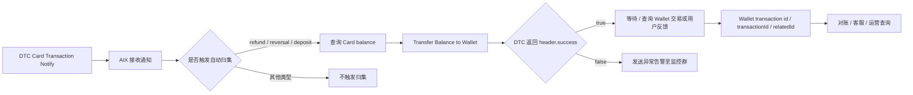

# Transaction Reconciliation 资金追踪与对账边界

## 1. 功能定位

Transaction Reconciliation 用于沉淀 AIX 中跨 Card / Wallet / Deposit 的资金追踪、ID 关联、Webhook 落库、入账发现和对账边界。

本文不是新的待确认表。所有不确定项统一引用 `knowledge-base/changelog/knowledge-gaps.md` 的 `ALL-GAP-XXX` 编号。

## 2. 当前已确认事实

| 事实 | 来源 | 边界 |
|---|---|---|
| DTC Card Transaction Notify 已明确 | Card Transaction Flow | 不代表 Card → Wallet 对账链路已闭环 |
| DTC Card Transaction ID 为 `data.id` | DTC Card Issuing / Card Transaction Flow | 不等同 Wallet `transactionId` |
| 重复推送时 Transaction ID 不变 | 用户确认 2026-05-01 | 去重实现仍见 ALL-GAP-023 |
| DTC 无独立 notification id | 用户确认 2026-05-01 | 不补 notification id |
| 自动归集关注 refund / reversal / deposit | 用户确认 2026-05-01 | 附加判断见 ALL-GAP-024 |
| `Transfer Balance to Wallet` 请求字段为 `cardId`、`amount` | DTC Card Issuing / Card Transaction Flow | 成功不返回归集业务流水 |
| DTC transfer 成功响应仅 `header.success=true` | DTC Card Issuing / 用户确认 | 不补 transferId / resultId |
| 归集失败不自动重试，发送异常告警至监控群 | 用户确认 2026-05-01 | 补偿入口见 ALL-GAP-026；责任分派见 ALL-GAP-039 |
| DTC transfer 成功但 Wallet 未到账当前主要靠用户反馈发现 | 用户确认 2026-05-01 | 系统对账 / 告警见 ALL-GAP-027 |
| Wallet 交易记录 / 详情出参有 `id` | DTC Wallet OpenAPI / 用户确认 | 与 Card / DTC / AIX ID 关联见 ALL-GAP-017、ALL-GAP-018 |
| Wallet 详情入参为 `transactionId` | DTC Wallet OpenAPI / 用户确认 | 与 Card `data.id` / `D-REQUEST-ID` 关联见 ALL-GAP-018 |

## 3. 当前追踪链路视图

说明：

- 上图只展示已确认主链路边界。
- `AIX 内部交易处理 ID`、`归集请求 ID`、`Wallet relatedId`、`D-REQUEST-ID` 是否串联，仍统一引用 ALL-GAP。

## 4. 资金链路 ALL-GAP 引用

| 编号 | 主题 | 为什么影响对账 |
|---|---|---|
| ALL-GAP-007 | `relatedId / transactionId / id` 如何串联 GTR / WalletConnect 入金 | 影响 Deposit 入金记录追踪 |
| ALL-GAP-014 | Wallet `relatedId` 在 Card / GTR / WC 场景取值 | 影响 Wallet History 关联 |
| ALL-GAP-017 | Card Transaction / refund / reversal / deposit 与 Wallet Transaction 是否一一对应 | 影响 Card → Wallet 是否可追踪 |
| ALL-GAP-018 | 如果存在关联，具体用哪个字段关联 | 影响对账字段组合 |
| ALL-GAP-019 | AIX 收到 DTC Card Transaction Notify 后是否生成内部交易处理 ID | 影响内部处理链路 |
| ALL-GAP-020 | AIX 发起 Transfer Balance to Wallet 前是否生成归集请求 ID | 影响归集请求追踪 |
| ALL-GAP-021 | `D-REQUEST-ID` 是否仅是请求唯一标识，还是也承担幂等 / 去重 | 影响请求幂等和重试设计 |
| ALL-GAP-022 | DTC Webhook 原始报文是否完整落库，是否可回放 / 查询 | 影响审计、排障、补偿 |
| ALL-GAP-023 | 重复通知实际如何去重，是否按 `event + data.id` | 影响重复通知处理 |
| ALL-GAP-024 | 自动归集触发是否只依赖 `type=refund/reversal/deposit`，还是还需判断 state / indicator / amount | 影响归集触发准确性 |
| ALL-GAP-025 | 查询 Card balance 失败后如何处理 | 影响资金遗漏风险 |
| ALL-GAP-026 | Transfer Balance to Wallet 失败后是否有后台人工补偿入口 | 影响异常闭环 |
| ALL-GAP-027 | DTC transfer 成功但 Wallet 未入账是否有系统对账 / 告警机制 | 影响资金可见性和风险发现 |
| ALL-GAP-028 | Card balance 转 Wallet 后入账币种是否与 card currency 完全一致 | 影响币种对账 |
| ALL-GAP-029 | 财务 / 运营最终使用哪些字段串起全链路 | 影响最终对账 SOP |
| ALL-GAP-036 | Webhook 原始报文落库规则 | 影响全局审计和排障 |
| ALL-GAP-039 | 告警规则、监控群、责任分派 | 影响异常响应和责任闭环 |

## 5. 不写入事实的内容

以下内容不得写成事实：

1. Card Transaction 与 Wallet Transaction 一一对应。
2. Card `data.id` 等同 Wallet `transactionId`。
3. Wallet `relatedId` 等同 Card `data.id`。
4. `D-REQUEST-ID` 是幂等键。
5. AIX 一定生成内部交易处理 ID。
6. AIX 一定生成归集请求 ID。
7. Webhook 原始报文一定完整落库。
8. DTC transfer 成功但 Wallet 未到账可被系统自动发现。
9. Transfer Balance to Wallet 失败一定有后台人工补偿入口。
10. 财务 / 运营对账字段组合已确认。
11. Card balance 转 Wallet 后入账币种一定与 card currency 完全一致。

## 6. 使用规则

1. 本文件只承接资金追踪和对账边界。
2. 新发现的不确定项必须追加到 `knowledge-gaps.md` 的 ALL-GAP 总表。
3. 本文件只能引用 ALL-GAP 编号，不维护新的 checklist。
4. 用户确认 ALL-GAP 后，再同步回填本文件。

## 7. 来源引用

- (Ref: IMPLEMENTATION_PLAN.md / v4.7)
- (Ref: knowledge-base/changelog/knowledge-gaps.md / ALL-GAP 总表)
- (Ref: knowledge-base/card/card-transaction-flow.md / v1.3)
- (Ref: knowledge-base/card/transaction-flow-traceability-checklist.md / v1.6 migrated-reference)
- (Ref: knowledge-base/transaction/history.md / v1.3)
- (Ref: knowledge-base/transaction/detail.md / v1.2)
- (Ref: knowledge-base/wallet/deposit.md / v1.6)
- (Ref: knowledge-base/common/dtc.md)
- (Ref: 用户确认结论 / 2026-05-01 / Card 归集相关事实)
- (Ref: 用户确认结论 / 2026-05-02 / ALL-GAP 唯一总表与无损迁移规则)
