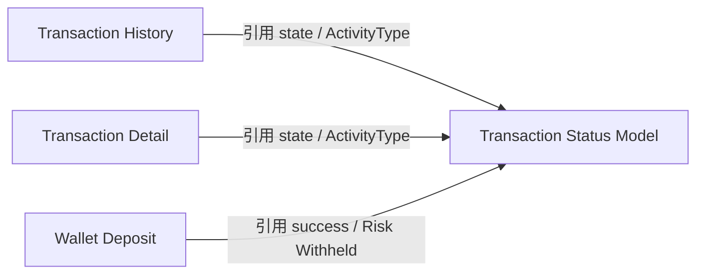

# Transaction Status Model 交易状态来源字典

> Source alignment note: 本文件已按 converted-prd 补齐全量交易类型 / 状态、Card REVERSAL 退款展示、Crypto / OTC / Card 状态来源边界。

> 本文件是对 Card / Wallet / Deposit 相关交易状态、外部结果、ActivityType 的 AI-readable 结构化转译稿。  
> 本文件定位为状态来源字典，不是新的统一状态机，不创建新状态，不合并 Card / Wallet / Deposit 状态。  
> 所有状态映射、进入 / 退出条件、前端展示文案、跨模块等价关系，统一进入 ALL-GAP。

---

## 1. 文档信息

| 项目 | 内容 |
|---|---|
| 功能名称 | Transaction Status Model 交易状态来源字典 |
| 所属模块 | Transaction |
| Owner | 吴忆锋 |
| 版本 | 2.1 |
| 状态 | active |
| 更新时间 | 2026-05-05 |
| 文档类型 | AI-readable PRD translation |
| 来源文档 | DTC Wallet OpenAPI Document20260126；卡交易&钱包交易状态梳理；Transaction History；Transaction Detail；Wallet Deposit；Card Transaction；Card Transaction Detail；ALL-GAP |

---

## 2. 需求背景、目标与范围

### 2.1 需求背景

Transaction History、Transaction Detail、Wallet Deposit、Wallet Balance 与 Card Transaction Flow 均会引用交易状态或交易分类。不同来源中的状态字段和状态含义并不等价，需要建立可读取的状态来源字典。

### 2.2 用户问题 / 业务问题

产品、开发、QA、业务和 AI 读取状态时，需要避免以下混淆：

1. Wallet `state` 与 Deposit `success` / Risk Withheld。
2. Wallet `state` 与 Card DTC transaction status / state。
3. ActivityType 与交易状态。
4. Card 成功 / 失败状态与 Wallet `COMPLETED` / `REJECTED`。
5. 后端状态与前端展示文案。

### 2.3 需求目标

将交易状态相关原始事实整理成 AI 可读取的结构化 Markdown，作为 History、Detail、Deposit、Balance 等文件的状态引用层。

### 2.4 涉及功能清单

| 功能点 | 本期范围 | 优先级 | 状态 | 说明 |
|---|---|---|---|---|
| Wallet `state` 枚举 | In Scope | P0 | Confirmed / Partial | 仅记录已确认状态值；进入 / 退出条件见 ALL-GAP-050 |
| Deposit 外部状态 | In Scope | P0 | Confirmed / Partial | Risk Withheld / success 只作为来源记录，不映射 Wallet state |
| ActivityType | In Scope | P1 | Confirmed / Referenced | ActivityType 是交易分类，不是状态机 |
| Card transaction status | In Scope | P1 | Confirmed / Referenced | 优先引用 `card/transaction-detail.md` 和 DTC 状态梳理嵌入 Excel |
| 跨模块状态对照 | In Scope | P1 | Boundary Only | 只做来源对照，不做语义等价映射 |
| 统一状态机 | Out of Scope | - | Not Applicable | 本文件不做统一状态流转设计 |

---

## 3. 业务流程与规则

### 3.1 业务主流程说明

Transaction Status Model 不承载业务流程，只作为状态来源引用层：

1. History / Detail 读取 Wallet `state` 时，引用本文件的 Wallet 状态字典。
2. Deposit 读取 Risk Withheld / success 时，引用本文件的外部状态来源边界。
3. Card 读取交易状态时，优先引用 `card/transaction-detail.md` 和 DTC 状态梳理嵌入 Excel，本文件只记录引用边界。
4. ActivityType 用于交易分类，不作为交易状态。

### 3.2 业务时序图

本文件不适用业务时序图。状态来源字典不描述业务流转。

### 3.3 流程步骤与业务规则

| 步骤 | 场景 / 规则 | 触发条件 | 责任方 | 系统处理 | 成功结果 | 失败 / 分支结果 | 来源 |
|---|---|---|---|---|---|---|---|
| 1 | Wallet 历史 / 详情读取 `state` | Wallet 交易记录或详情返回 state | App / Backend | 引用 Wallet `state` 字典 | 展示或处理状态 | 进入 / 退出条件见 ALL-GAP-050 | Transaction History / Detail |
| 2 | Deposit 读取 Risk Withheld | DTC Crypto Deposit 返回 `status=102` | DTC / Backend / App | 作为外部状态来源记录 | 详情展示 under review | 不映射 Wallet `REJECTED`；余额关系见 ALL-GAP-008 | DTC Crypto Deposit；用户确认 |
| 3 | Deposit 读取 success | Notification / payment_info success | DTC / Backend / App | 作为 Deposit success 来源记录 | 可触发资金流转账 | 不映射 Wallet `COMPLETED`；见 ALL-GAP-016 | Wallet Deposit / Notification |
| 4 | Card 读取交易状态 | Card transaction record / detail 返回状态 | Card / DTC / Backend | 引用 Card Transaction Detail 和 DTC 状态梳理 | 展示 Card 状态 | Declined / Denied 最终文案仍需确认 | Card Transaction Detail / DTC 状态梳理 |
| 5 | ActivityType 分类 | Wallet history 返回 activityType | DTC / Backend / App | 引用 ActivityType 枚举 | 分类交易历史 | 前端交易类型映射见 ALL-GAP-037 | DTC Wallet OpenAPI Appendix |

### 3.4 状态规则

#### 3.4.1 Wallet `state`

Wallet 当前已确认状态字段为 `state`。

| 状态 | 含义 | 触发条件 | 用户可见表现 | 系统处理 | 可迁移到 | 是否终态 | 来源 |
|---|---|---|---|---|---|---|---|
| `PENDING` | Wallet 交易状态值 | 原文未提供 | 前端文案见 ALL-GAP-051 | 只作为 Wallet 状态值记录 | 进入 / 退出条件见 ALL-GAP-050 | 未确认 | Transaction History / Detail |
| `PROCESSING` | Wallet 交易状态值 | 原文未提供 | 前端文案见 ALL-GAP-051 | 只作为 Wallet 状态值记录 | 进入 / 退出条件见 ALL-GAP-050 | 未确认 | Transaction History / Detail |
| `AUTHORIZED` | Wallet 交易状态值 | 原文未提供 | 前端文案见 ALL-GAP-051 | 只作为 Wallet 状态值记录 | 进入 / 退出条件见 ALL-GAP-050 | 未确认 | Transaction History / Detail |
| `COMPLETED` | Wallet 交易状态值 | 原文未提供 | 前端文案见 ALL-GAP-051 | 只作为 Wallet 状态值记录 | 与 Deposit success 映射见 ALL-GAP-016 | 未确认 | Transaction History / Detail |
| `REFUNDED` | Wallet 交易状态值 | DTC CryptoTransactionState；Deposit Refunded 映射 | 前端文案见 ALL-GAP-051 | 只作为 Wallet 状态值记录，不等同 Card Refunded | 退款进入 / 退出条件需以业务场景核验 | 未确认 | DTC Wallet OpenAPI Appendix C；reference-data/transaction/card-wallet-transaction-status-mapping.docx |
| `REJECTED` | Wallet 交易状态值 | 原文未提供 | 前端文案见 ALL-GAP-051 | 只作为 Wallet 状态值记录 | 失败原因和责任边界见 ALL-GAP-038、ALL-GAP-039 | 未确认 | Transaction History / Detail |
| `CLOSED` | Wallet 交易状态值 | 原文未提供 | 前端文案见 ALL-GAP-051 | 只作为 Wallet 状态值记录 | 关闭条件见 ALL-GAP-050 | 未确认 | Transaction History / Detail |

#### 3.4.2 Deposit / Crypto 外部状态

| 状态 | 含义 | 触发条件 | 用户可见表现 | 系统处理 | 可迁移到 | 是否终态 | 来源 |
|---|---|---|---|---|---|---|---|
| `Risk Withheld` / `status=102` | DTC Crypto Deposit 外部状态 | DTC Crypto Deposit 返回 | 用户确认不触发结果页；详情展示 under review | 不得等同 Wallet `REJECTED / PENDING / PROCESSING` | 余额关系见 ALL-GAP-008 | 未确认 | DTC Wallet OpenAPI / 3.4 Crypto Deposit；用户确认 |
| `success` | Deposit success 来源 | DTC Crypto Deposit / Notification / payment_info success | 可作为 Deposit success 通知来源 | payment_info success 会触发资金流转账但可能有短延迟 | 与 Wallet `COMPLETED` 映射见 ALL-GAP-016 | 未确认 | DTC Crypto Deposit；Notification；Wallet Deposit |

#### 3.4.3 Card 交易状态

Card 交易状态与类型优先引用 `card/transaction-detail.md` 和 DTC `reference-data/transaction/card-wallet-transaction-status-mapping.docx` 嵌入 Excel。

| AIX 交易类型 | DTC 交易类型 | AIX 展示状态 | DTC 状态 | 是否有详情页 | 说明 | 来源 |
|---|---|---|---|---|---|---|
| Payment | PURCHASE | Pending | PENDING / AUTHORIZED | 是 | 订单已收到，正在授权确认或审核 | DTC 状态梳理 |
| Payment | PURCHASE | Success | SUCCESS / CAPTURED | 是 | 订单交易完成，资金转移完成 | DTC 状态梳理 |
| Payment | PURCHASE | Refunded | REFUNDED | 是 | 商户退款，资金返回支付账户 | DTC 状态梳理 |
| Payment | PURCHASE | Declined | DENIED | 是 | 余额不足、账户异常或超额导致拒绝 | DTC 状态梳理 |
| Payment | PURCHASE | Cancelled | CANCELLED | 是 | 未确认订单或超时未支付等原因取消 | DTC 状态梳理 |
| Payment | PURCHASE | 待确认 | EXPIRED / REVERSED | 是 | Excel 中 AIX 状态列为空，展示口径待确认 | DTC 状态梳理 |
| Payment | INCREMENTAL AUTH | Pending | PENDING / AUTHORIZED | 是 | 同 Payment 授权中 | DTC 状态梳理 |
| Payment | INCREMENTAL AUTH | Success | SUCCESS / CAPTURED | 是 | 同 Payment 成功 | DTC 状态梳理 |
| Payment | INCREMENTAL AUTH | Refunded | REFUNDED | 是 | 同 Payment 退款 | DTC 状态梳理 |
| Payment | INCREMENTAL AUTH | Declined | DENIED | 是 | 同 Payment 拒绝 | DTC 状态梳理 |
| Payment | INCREMENTAL AUTH | Cancelled | CANCELLED | 是 | 同 Payment 取消 | DTC 状态梳理 |
| Payment | INCREMENTAL AUTH | 待确认 | EXPIRED / REVERSED | 是 | Excel 中 AIX 状态列为空，展示口径待确认 | DTC 状态梳理 |
| Cash withdrawal | CASH_WITHDRAWAL | Pending | PENDING / AUTHORIZED | 是 | 提现授权阶段 | DTC 状态梳理 |
| Cash withdrawal | CASH_WITHDRAWAL | Success | CAPTURED | 是 | 通常第二天 capture；type=8 状态变更为 CAPTURED | DTC 状态梳理 |
| Cash withdrawal | CASH_WITHDRAWAL | Refunded | REVERSED | 是 | 原为 cancelled，现为 Refunded；DTC 说明提现先扣钱成功但最终失败时会有 REVERSAL 数据 | DTC 状态梳理 |
| Cash withdrawal | CASH_WITHDRAWAL | Declined | DENIED | 是 | 交易拒绝 | DTC 状态梳理 |
| Refund | REFUND | Success | SUCCESS | 是 | 退款交易成功 | DTC 状态梳理 |

Card 状态不得与 Wallet `state` 合并。全局展示状态是否统一，仍由 ALL-GAP / PM 最终确认。

### 3.5 业务级异常与失败处理

本文件不定义新的异常流程。状态异常边界如下：

| 异常场景 | 触发条件 | 错误来源 | 错误码 / 原因 | 用户表现 | 系统处理 | 是否可重试 | 最终状态 |
|---|---|---|---|---|---|---|---|
| Wallet state 进入 / 退出条件缺失 | 需要解释 Wallet 状态流转 | 原文未提供 | 不适用 | 不补文案 | 引用 ALL-GAP-050 | 不适用 | 未确认 |
| Wallet 状态前端文案缺失 | 需要展示前端状态 | 原文未完整提供 | 不适用 | 不补文案 | 引用 ALL-GAP-051 | 不适用 | 未确认 |
| Risk Withheld 与余额 / Wallet state 关系缺失 | Risk Withheld 出现 | DTC Crypto Deposit | `status=102` | under review | 引用 ALL-GAP-008 | 不适用 | 未确认 |
| Card 状态映射待确认项 | Card 状态需要映射到 AIX 展示 | Card DTC status | EXPIRED / REVERSED 在部分类型下 AIX 状态列为空；Declined / Denied 前端文案不一致 | 不补最终文案 | 引用 card/transaction-detail.md 和 ALL-GAP-053 | 不适用 | 待确认 |

---

## 4. 页面与交互说明

### 4.1 页面关系总览图

本文件不定义页面关系图。状态展示发生在 History、Detail、Deposit Result 等对应页面中。

### 4.2 Wallet 状态展示引用

| 区块 | 内容 |
|---|---|
| 页面类型 | 引用说明 |
| 页面目标 | 说明 Wallet `state` 在 History / Detail 中如何引用 |
| 入口 / 触发 | History / Detail 返回 Wallet `state` |
| 展示内容 | `PENDING`、`PROCESSING`、`AUTHORIZED`、`COMPLETED`、`REJECTED`、`CLOSED` |
| 用户动作 | 查看历史或详情 |
| 系统处理 / 责任方 | App / Backend 引用状态字段 |
| 元素 / 状态 / 提示规则 | 前端文案见 ALL-GAP-051 |
| 成功流转 | 展示对应状态 |
| 失败 / 异常流转 | 进入 / 退出条件见 ALL-GAP-050 |
| 备注 / 边界 | 不补状态机，不补流转 |

### 4.3 Deposit 状态展示引用

| 区块 | 内容 |
|---|---|
| 页面类型 | 引用说明 |
| 页面目标 | 说明 Deposit success / Risk Withheld 的状态边界 |
| 入口 / 触发 | Deposit 结果、交易详情或异步状态返回 |
| 展示内容 | success；Risk Withheld / under review |
| 用户动作 | 查看 Deposit 结果或交易详情 |
| 系统处理 / 责任方 | App / Backend 引用 Deposit / DTC Crypto Deposit 事实 |
| 元素 / 状态 / 提示规则 | Risk Withheld 不触发充值结果页，详情展示 under review |
| 成功流转 | 展示已确认结果或详情状态 |
| 失败 / 异常流转 | 与余额、Wallet state 的映射见 ALL-GAP-008 / ALL-GAP-016 |
| 备注 / 边界 | 不等同 Wallet `COMPLETED` / `REJECTED` |

### 4.4 Card 状态展示引用

| 区块 | 内容 |
|---|---|
| 页面类型 | 引用说明 |
| 页面目标 | 说明 Card 状态来源 |
| 入口 / 触发 | Card History / Card Detail 返回状态 |
| 展示内容 | Payment、Cash withdrawal、Refund 对应的 AIX 展示状态和 DTC 状态 |
| 用户动作 | 查看 Card History / Detail |
| 系统处理 / 责任方 | App / Backend 引用 `card/transaction-detail.md` 和 DTC 状态梳理 |
| 元素 / 状态 / 提示规则 | EXPIRED / REVERSED 在部分交易类型下展示口径仍需确认；Declined / Denied 文案需统一 |
| 成功流转 | 展示 Card 状态 |
| 失败 / 异常流转 | 未确认状态不补写最终文案 |
| 备注 / 边界 | 不与 Wallet `state` 合并 |

---

## 5. 字段、接口与数据

### 5.1 Wallet `state`

| 类型 | 名称 | 所属系统 | 来源 | 用途 | 规则 / 输入输出 | 异常处理 |
|---|---|---|---|---|---|---|
| 字段 | `state` | Wallet / DTC | Transaction History；Transaction Detail | Wallet 交易状态字段 | 可取 `PENDING`、`PROCESSING`、`AUTHORIZED`、`COMPLETED`、`REJECTED`、`CLOSED` | 进入 / 退出条件见 ALL-GAP-050 |

### 5.2 Deposit / Crypto 外部结果

| 类型 | 名称 | 所属系统 | 来源 | 用途 | 规则 / 输入输出 | 异常处理 |
|---|---|---|---|---|---|---|
| 状态 / 结果 | `Risk Withheld` / `status=102` | DTC Crypto Deposit | DTC Wallet OpenAPI / 3.4 | 风控 / review 状态来源 | 不触发结果页，详情 under review | 与余额、Wallet state 关系见 ALL-GAP-008 |
| 状态 / 结果 | `success` | DTC Crypto Deposit / Notification | Wallet Deposit / Notification | Deposit success 来源 | payment_info success 会触发资金流转账但可能有短延迟 | 与 Wallet `COMPLETED` 映射见 ALL-GAP-016 |

### 5.3 ActivityType

ActivityType 是 Wallet balance / transaction history 的交易分类，不是完整状态机。

| 类型 | 名称 | 所属系统 | 来源 | 用途 | 规则 / 输入输出 | 异常处理 |
|---|---|---|---|---|---|---|
| 枚举 | `FIAT_DEPOSIT=6` | DTC Wallet OpenAPI | Appendix ActivityType | Fiat Deposit 分类 | 是否对应 GTR 见 ALL-GAP-001 | 不得直接映射 GTR |
| 枚举 | `CRYPTO_DEPOSIT=10` | DTC Wallet OpenAPI | Appendix ActivityType | Stablecoin Deposit 分类 | 是否对应 WalletConnect 见 ALL-GAP-002 | 不得直接映射 WC |
| 枚举 | `DTC_WALLET=13` | DTC Wallet OpenAPI | Appendix ActivityType | DTC Wallet Payment 分类 | 前端展示映射见 ALL-GAP-037 | 未确认 |
| 枚举 | `CARD_PAYMENT_REFUND=20` | DTC Wallet OpenAPI | Appendix ActivityType | Card Payment Refund 分类 | 与 Card 归集链路关联见 ALL-GAP-017、ALL-GAP-018 | 未确认 |

### 5.4 Card 状态与类型引用

| 类型 | 名称 | 所属系统 | 来源 | 用途 | 规则 / 输入输出 | 异常处理 |
|---|---|---|---|---|---|---|
| 状态来源 | DTC Card Transaction Status | Card / DTC | DTC 状态梳理 / Card Transaction Detail | Card 交易状态 | 可引用，但不与 Wallet state 合并 | 前端展示映射见 `card/transaction-detail.md` 与 ALL-GAP-053 |
| 字段 | `data.id` | Card / DTC | Card Transaction Flow | Card Transaction ID | 可引用 | 不等同 Wallet `transactionId` |
| 字段 | `originalId` | Card / DTC | Card Transaction Flow | Original Transaction ID | 选填 | 未确认 |
| 类型 | `refund` / `reversal` / `Top-up` / `deposit` | Card / DTC | Card Transaction | 资金回退触发类型 | 可引用；具体 type 枚举大小写仍需确认 | 未确认 |
| 类型 | PURCHASE / INCREMENTAL AUTH / CASH_WITHDRAWAL / REFUND | Card / DTC | DTC 状态梳理 / Card Transaction Detail | Card History / Detail 展示类型 | 可引用；与资金回退触发类型不是同一层概念 | 未确认 |

---

## 6. 通知规则

本文件不新增通知规则，只记录状态来源与通知来源的边界。

| 触发事件 | 通知渠道 | 通知对象 | 文案 / 模板 | 跳转目标 | 失败 / 补发规则 |
|---|---|---|---|---|---|
| Deposit success | Notification PRD / Deposit row | 用户 | Deposit success | 是否跳转详情未完整确认 | success 与 Wallet `COMPLETED` 映射见 ALL-GAP-016 |
| Risk Withheld / under review | DTC Crypto Deposit / Notification 口径 | 用户 | under review | 用户查询交易详情时可见 under review | 与 Wallet state / 余额关系见 ALL-GAP-008 |
| Card Transaction Notify | DTC Card Transaction Notify | 用户 / 系统 | 原文未在本文件展开 | Card detail / history 更新 | Card 前端展示状态映射见 ALL-GAP-053 |

---

## 7. 权限 / 合规 / 风控

| 类型 | 规则 | 影响 | 来源 |
|---|---|---|---|
| 状态边界 | Card、Wallet、Deposit 状态并列记录，不合并 | 避免跨模块误映射 | Transaction History / Detail / Card Flow |
| 风控 | Risk Withheld 是 DTC Crypto Deposit 外部状态 | 不得等同 Wallet `REJECTED`；余额关系见 ALL-GAP-008 | DTC Wallet OpenAPI / 3.4 |
| 合规 / Travel Rule | GTR / WalletConnect 的交易报备与白名单规则由 Deposit 承接 | Status Model 只引用结果来源 | Wallet Deposit |
| 数据边界 | ActivityType 是分类，不是状态机 | 避免把分类当状态 | DTC Wallet OpenAPI Appendix |

---

## 8. 待确认事项

| 问题 | 影响范围 | 当前处理 | 是否阻塞验收 | 建议确认人 |
|---|---|---|---|---|
| Wallet `state` 进入 / 退出条件 | History / Detail 状态解释 | 引用 ALL-GAP-050 | 否 | Backend / DTC / Product |
| Wallet 状态与前端展示文案映射 | History / Detail 前端展示 | 引用 ALL-GAP-051 | 否 | Product / UI |
| Deposit success 与 Wallet `state=COMPLETED` 映射 | Deposit / History / Balance | 引用 ALL-GAP-016 | 否 | Backend / DTC |
| Risk Withheld 与 Wallet `state` / 余额关系 | Deposit / Detail / Balance | 引用 ALL-GAP-008 | 否 | Backend / DTC / Product |
| GTR 与 `FIAT_DEPOSIT=6` 映射 | Deposit 分类 / History | 引用 ALL-GAP-001 | 否 | Backend / DTC / Product |
| WalletConnect 与 `CRYPTO_DEPOSIT=10` 映射 | Deposit 分类 / History | 引用 ALL-GAP-002 | 否 | Backend / DTC / Product |
| ActivityType 到 AIX 前端交易类型映射 | History / Detail 展示 | 引用 ALL-GAP-037 | 否 | Product / UI / Backend |
| Card DTC 状态与 AIX 前端展示状态映射 | Card History / Detail | 已补充主要映射；EXPIRED / REVERSED、Declined / Denied 文案仍需确认 | 否 | Product / UI / Backend |
| 跨模块最终展示状态是否需要统一文案 | Card / Wallet / Deposit 展示 | 引用 ALL-GAP-054 | 否 | Product / UI |

---

## 9. 验收标准 / 测试场景

### 9.1 验收标准

本文是历史 PRD / DTC 文档的 AI-readable 转译稿，不作为新迭代 PRD 直接验收依据。当前验收标准仅用于检查转译质量：

| 验收场景 | 验收标准 |
|---|---|
| 范围边界 | 只记录状态来源字典，不做状态机设计 |
| 来源一致性 | 所有状态、结果、分类均可追溯到原文档、已有主事实文件或 ALL-GAP |
| 未确认项处理 | 未确认映射、文案、进入 / 退出条件进入 ALL-GAP |
| 跨模块边界 | Card / Wallet / Deposit 状态并列记录，不做语义等价 |
| ActivityType 处理 | ActivityType 只作为交易分类，不作为状态 |

### 9.2 测试场景矩阵

本文不生成新产品测试用例。若基于本文发起新迭代，应另建符合 `standard-prd-template.md` 的 PRD，并补充真实验收场景。当前仅保留转译检查矩阵：

| 场景 | 前置条件 | 用户操作 | 预期页面表现 | 预期系统结果 | 是否必测 |
|---|---|---|---|---|---|
| Wallet state 字典检查 | Transaction History / Detail 可查 | 核对 Wallet `state` 枚举 | 与来源一致 | 不补流转 | 是 |
| Deposit 外部状态检查 | DTC Crypto Deposit / Deposit 可查 | 核对 success / Risk Withheld | 与来源一致 | 不映射 Wallet state | 是 |
| ActivityType 检查 | DTC Appendix 可查 | 核对 ActivityType 枚举 | 与来源一致 | 不作为状态机 | 是 |
| Card 状态引用检查 | Card Flow 可查 | 核对 Card 状态来源 | 与来源一致 | 不合并 Wallet state | 是 |
| ALL-GAP 检查 | ALL-GAP 可查 | 核对未确认项 | 不写成事实 | 正确引用 ALL-GAP | 是 |

---

## 10. 不写入事实的内容

以下内容当前不得写成事实：

1. Card 成功态等同于 Wallet `COMPLETED`。
2. Deposit `success` 等同于 Wallet `COMPLETED`。
3. Risk Withheld 等同于 Wallet `REJECTED`。
4. Card 失败态等同于 Wallet `REJECTED`。
5. Card `data.id` 等同于 Wallet `transactionId`。
6. Wallet `relatedId` 等同于 Card `data.id`。
7. Wallet `relatedId` 等同于 AIX 归集请求 ID。
8. `CRYPTO_DEPOSIT` 必然等同 WalletConnect。
9. `FIAT_DEPOSIT` 必然等同 GTR。
10. Deposit GTR / WalletConnect 状态机已完整闭环。
11. Card / Wallet / Deposit 前端展示状态已统一。

---

## Source alignment additions

### A. AIX 前端全量交易类型

| 前端类型 | 来源说明 | 方向 / 展示 |
|---|---|---|
| Crypto Deposit | 加密币充值 | 入金 `+` |
| Send | 转出 | 出金 `-` |
| Swap | OTC 兑换 | 兑换记录；列表不显示交易状态 |
| Refund | 卡退款 | 包括 `REFUND` 和 `REVERSAL / reversed / type=19` |
| Card Application | 申卡扣费 | 出金 `-` |
| Card Cancel | 申卡退费 | 入金 `+` |

### B. AIX 前端全量交易状态

| 状态 | 说明 |
|---|---|
| Pending | 待处理 |
| Success | 成功 |
| Refunded | 已退款 |
| Declined | 被拒绝 / 失败类展示，具体映射需按来源 |
| Under Review | 风控审核 / Risk Withheld 等场景可引用，但不得等同 Wallet `REJECTED` |
| Cancelled | 已取消 |

### C. 原始类型展示范围

| 来源 | 原始类型 | AIX 处理 |
|---|---|---|
| Crypto | `DEPOSIT`、`TRANSFER_IN`、`TRANSFER_OUT`、`CARD_FEE_DEBIT`、`CARD_FEE_REFUND` | 可进入全量交易展示 |
| Card | `PURCHASE`、`CASH_WITHDRAWAL`、`REFUND`、`INCREMENTAL_AUTH` | 可进入全量交易 / Card History 展示 |
| Card | `REVERSAL` / type=19 | 作为退款展示，前端与 `REFUND` 一样显示 `refund-商户名称` |
| OTC | 兑换记录 | 展示为 Swap；Swap 列表不显示交易状态 |

## 11. 来源引用

- (Ref: DTC Wallet OpenAPI Document20260126 / 3.4 Crypto Deposit)
- (Ref: DTC Wallet OpenAPI Document20260126 / Appendix ActivityType)
- (Ref: knowledge-base/transaction/history.md / Transaction History)
- (Ref: knowledge-base/transaction/detail.md / Transaction Detail)
- (Ref: knowledge-base/wallet/deposit.md / Wallet Deposit)
- (Ref: knowledge-base/card/transaction.md / Card Transaction)
- (Ref: knowledge-base/card/transaction-detail.md / Card Transaction Detail)
- (Ref: reference-data/transaction/card-wallet-transaction-status-mapping.docx / 嵌入 Excel hFgXns)
- (Ref: knowledge-base/changelog/knowledge-gaps.md / ALL-GAP 总表)
