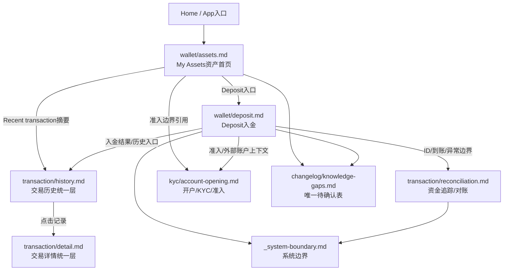

# Wallet 模块索引

> Source alignment note: Wallet 已按 converted-prd 做双向覆盖校验。本批将 wallet/assets 标 ALIGNED；wallet/deposit 只承接 Deposit/GTR/WalletConnect；Send 和 Swap 已拆分为 wallet/send.md、wallet/swap.md。

> 本文件是模块索引，不是功能 PRD；PRD 模板检查仅做弱校验，重点检查模块边界、读取规则和依赖关系。

## 1. 模块定位

Wallet 模块用于沉淀 AIX 钱包运行态事实。当前 Wallet 目录只维护两类 active 主事实：

1. Wallet Assets：钱包资产首页 / My Assets。
2. Wallet Deposit：钱包入金，包括 GTR / Exchange 地址充值与 WalletConnect / Self-custodial Wallet 充值。

Wallet 目录不承接开户 / KYC 主事实、不承接交易历史统一层、不承接资金追踪 / 对账主事实，也不维护外部供应商内部逻辑。

---

## 2. 当前文件

| 文件 | 状态 | 主事实目标 | 不承接内容 |
|---|---|---|---|
| `wallet/_index.md` | active | Wallet 模块边界、能力清单、读取规则与跨模块关系 | 具体页面字段、接口字段 |
| `wallet/assets.md` | active | My Assets 钱包资产首页、Total Asset、Stablecoin 列表、快捷入口、Recent transaction 摘要 | Wallet 全量交易历史、Card balance、对账链路 |
| `wallet/deposit.md` | active | Deposit 入口、GTR / Exchange 地址充值、WalletConnect 充值、白名单、结果页与异常边界 | Send / Withdraw / Swap 正文、交易历史正文、对账链路 |

---

## 3. Wallet 体系关系

---

## 4. 能力边界

| 能力域 | 主事实源 | 当前处理 | 不包含 |
|---|---|---|---|
| Assets / My Assets | `wallet/assets.md` | Wallet 目录维护 | Card balance、Wallet 全量交易历史、交易详情、对账链路 |
| Deposit | `wallet/deposit.md` | Wallet 目录维护 | Send / Withdraw / Swap 正文、独立 Receive 能力 |
| Wallet Transaction History | `transaction/history.md` | Transaction 目录维护 | Wallet 目录不维护交易历史正文 |
| Wallet Transaction Detail | `transaction/detail.md` | Transaction 目录维护 | Wallet 目录不维护交易详情字段正文 |
| Reconciliation / 资金追踪 / 对账 | `transaction/reconciliation.md` | Transaction 目录维护 | Wallet 目录不补 ID 串联结论 |
| Account Opening / KYC / 准入 | `kyc/account-opening.md` | KYC 目录维护 | Wallet 目录不维护开户 / KYC 主事实 |
| Notification | `common/notification.md` | Common 目录维护 | Wallet 目录不补通知模板 |
| Errors | `common/errors.md` | Common 目录维护 | Wallet 目录不补完整错误码表 |
| DTC / WalletConnect 外部依赖 | `integrations/dtc/_index.md`、`integrations/walletconnect/_index.md` | Integrations 目录维护 | Wallet 目录不维护供应商内部逻辑 |

---

## 5. Active / Deferred 能力

| 能力 | 当前状态 | 说明 |
|---|---|---|
| Wallet Assets / My Assets | active | 钱包资产首页，展示总资产、稳定币资产、快捷入口、最近交易摘要 |
| Wallet Deposit | active | 入金能力，包含 GTR / Exchange 与 WalletConnect 两条子路径 |
| GTR / Exchange 地址充值 | active | Deposit 子路径；当前支持 Binance / GTR 口径，实际范围以配置为准 |
| WalletConnect / Self-custodial Wallet 充值 | active | Deposit 子路径；Approved 后自动 add whitelist，send_payment 后轮询 payment_info |
| Wallet Transaction History | active | 主事实源为 `transaction/history.md` |
| Wallet Transaction Detail | active / partial | 主事实源为 `transaction/detail.md`，完整字段仍引用 ALL-GAP |
| Send | deferred | 当前不作为 Wallet active 能力维护 |
| Withdraw | deferred | 原始 PRD 说明因合规问题隐藏 / 不正常操作 |
| Swap | deferred | 当前不作为 Wallet active 能力维护 |
| Receive | deleted / not-maintained | 不作为独立能力维护；地址充值归入 Deposit |

---

## 6. 子路径读取规则

| 用户问题 | 必读文件 | 需要时再读 | 不应默认读 |
|---|---|---|---|
| 钱包首页 / My Assets / 总资产 / 稳定币列表 | `wallet/assets.md` | `transaction/history.md`、`kyc/account-opening.md`、`knowledge-gaps.md` | 旧 `wallet/balance.md` |
| 钱包当前余额接口 | `wallet/assets.md` | `integrations/dtc/_index.md`、`knowledge-gaps.md` | Card balance 文件 |
| 钱包最近交易摘要 | `wallet/assets.md` | `transaction/history.md` | `Search Balance History` 作为 My Assets 主数据源 |
| 钱包全量交易历史 | `transaction/history.md` | `wallet/assets.md`、`wallet/deposit.md`、`transaction/status-model.md` | Wallet 目录内新建 history 文件 |
| 钱包交易详情 | `transaction/detail.md` | `transaction/history.md`、`transaction/status-model.md`、`knowledge-gaps.md` | Card Detail 规则直接套用 |
| Deposit / 入金总逻辑 | `wallet/deposit.md` | `integrations/dtc/_index.md`、`integrations/walletconnect/_index.md`、`common/errors.md`、`common/notification.md`、`knowledge-gaps.md`、`_system-boundary.md` | Send / Swap 旧正文 |
| GTR / Exchange 地址充值 | `wallet/deposit.md` | `transaction/history.md`、`integrations/dtc/_index.md`、`knowledge-gaps.md`、`_system-boundary.md` | `integrations/walletconnect/_index.md` |
| WalletConnect 充值 / 白名单 / 授权 | `wallet/deposit.md`、`integrations/walletconnect/_index.md` | `integrations/dtc/_index.md`、`common/errors.md`、`common/notification.md`、`knowledge-gaps.md`、`_system-boundary.md` | DTC 完整供应商说明书 |
| 资金追踪 / ID 串联 / 对账 | `transaction/reconciliation.md` | `wallet/deposit.md`、`transaction/history.md`、`transaction/detail.md`、`knowledge-gaps.md`、`_system-boundary.md` | 在 Wallet 文件内补结论 |
| KYC / Sub Account / WalletAccount 准入 | `kyc/account-opening.md` | `integrations/dtc/_index.md`、`wallet/assets.md`、`wallet/deposit.md`、`knowledge-gaps.md` | 在 Wallet 文件内补开户事实 |

---

## 7. 已确认 Wallet 基础事实

| 字段 / 能力 | 结论 | 主事实源 | 备注 |
|---|---|---|---|
| Wallet Assets 页面 | My Assets 是钱包资产首页，不是单纯余额页 | `wallet/assets.md` | 原始 PRD 为 `AIX Wallet V1.0【Asset】` |
| Wallet balance 支撑接口 | `Get Wallet Account Balance`、`Get Balance` 支撑资产展示 | `wallet/assets.md` | 不维护为独立 `balance.md` 文件 |
| My Assets Recent transaction | 数据源为 `crypto-txn/search` 与 `otc/search` | `wallet/assets.md` | 不以 Search Balance History 作为主数据源 |
| Wallet Search Balance History | 用于 Wallet 全量交易 / 余额历史 | `transaction/history.md` | 与 My Assets 最近交易摘要区分 |
| Wallet 交易 `id` | 钱包交易记录 / 详情出参均包含 `id`，Long，交易 id | `transaction/history.md` | 关联规则见 ALL-GAP |
| Wallet 详情入参 `transactionId` | 单笔钱包交易详情入参为 `transactionId` | `transaction/detail.md` | 与 Card `data.id` / `D-REQUEST-ID` 关系见 ALL-GAP |
| Wallet 交易 `state` | 枚举为 `PENDING`、`PROCESSING`、`AUTHORIZED`、`COMPLETED`、`REJECTED`、`CLOSED` | `transaction/status-model.md` | 不等同 Deposit 外部状态 |
| Deposit 子路径 | GTR 与 WalletConnect 是两条不同路径 | `wallet/deposit.md` | 不共用白名单、状态、接口、结果页规则 |

---

## 8. 与 ALL-GAP 的关系

以下内容不得在 Wallet 文件中补写为事实，只能引用 ALL-GAP：

| ALL-GAP | 主题 |
|---|---|
| ALL-GAP-001 | GTR 是否使用 `FIAT_DEPOSIT=6` |
| ALL-GAP-002 | WalletConnect 是否使用 `CRYPTO_DEPOSIT=10` |
| ALL-GAP-007 | `relatedId / transactionId / id` 如何串联 GTR / WalletConnect 入金 |
| ALL-GAP-008 | Risk Withheld 与 Wallet `state` / 余额关系 |
| ALL-GAP-014 | Wallet `relatedId` 在 Card / GTR / WC 场景取值 |
| ALL-GAP-015 | Wallet `transactionId` 与 Wallet `id` 的关系 |
| ALL-GAP-016 | Deposit success 与 Wallet `state=COMPLETED` 的映射 |
| ALL-GAP-031 | Account Opening / KYC 是否为 GTR / WalletConnect Deposit 前置 |
| ALL-GAP-037 | ActivityType 到 AIX 前端交易类型映射 |
| ALL-GAP-048 | Wallet Transaction Detail 完整字段 |
| ALL-GAP-055 | Wallet balance 完整响应字段 |
| ALL-GAP-056 | 余额展示排序、小额 / 零余额规则 |
| ALL-GAP-057 | Wallet balance 查询失败处理 |
| ALL-GAP-058 | Search Balance History 完整字段表 |

---

## 9. 禁止事项

1. 不得恢复 `wallet/balance.md` 作为 active 主事实文件。
2. 不得把 My Assets 最近交易写成 Search Balance History 主数据源。
3. 不得把 Wallet Assets 写成单纯余额接口文档。
4. 不得把 GTR 与 WalletConnect 合并成同一条 Deposit 流程。
5. 不得把 Send / Withdraw / Swap 写成当前 active Wallet 能力。
6. 不得在 Wallet 目录补写交易历史正文、交易详情正文或对账链路。
7. 不得把 Card balance 写入 Wallet Assets 主事实。
8. 不得把 DTC Available Currency 直接等同 AIX 前端展示币种。
9. 不得把 Deposit success 写死为 Wallet `COMPLETED`。
10. 不得把 Risk Withheld 写死为 Wallet `REJECTED` / `PENDING` / `PROCESSING`。

---

## Source alignment additions

| 文件 | 状态 | 说明 |
|---|---|---|
| wallet/_index.md | ALIGNED | 已登记 Wallet Asset、Deposit/Send/Swap、KYC、Security、Transaction 的证据边界 |
| wallet/assets.md | ALIGNED | My Assets 资产、稳定币、Total Asset、Recent transaction、隐藏提现入口等已覆盖 |
| wallet/deposit.md | ALIGNED | 只承接 Deposit/GTR/WalletConnect；Send / Swap 已拆分 |
| wallet/send.md | ALIGNED | 承接 Send Crypto 完整流程、收款人校验、余额校验、Face Token、结果页 |
| wallet/swap.md | ALIGNED | 承接 Swap Crypto、OTC Rate、dtcQuoteId、汇率过期、结果页 |

## Wallet source gap register

| 缺口 | 来源 | 处理 |
|---|---|---|
| Send Crypto 完整流程 | wallet/deposit-send-swap / 6.1 | 已新增 wallet/send.md 承接 |
| Swap Crypto 完整流程 | wallet/deposit-send-swap / 6.2 | 已新增 wallet/swap.md 承接 |
| WalletConnect QR 过期 / Quick Deposit Check 细节 | wallet/deposit-send-swap / 6.4 | 已补入 deposit.md source alignment additions |

## 10. 来源引用

- (Ref: knowledge-base/wallet/assets.md)
- (Ref: knowledge-base/wallet/deposit.md)
- (Ref: knowledge-base/transaction/history.md)
- (Ref: knowledge-base/transaction/detail.md)
- (Ref: knowledge-base/transaction/reconciliation.md)
- (Ref: knowledge-base/kyc/account-opening.md)
- (Ref: knowledge-base/changelog/knowledge-gaps.md / ALL-GAP 总表)
- (Ref: knowledge-base/_system-boundary.md)
