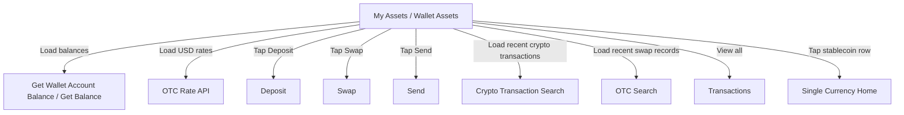

# Wallet Assets 钱包资产首页

> 本文件是对历史 PRD `AIX Wallet V1.0【Asset】` 的 AI-readable 结构化转译稿，并补充必要的 DTC Wallet OpenAPI 支撑接口事实。  
> 本文件主事实是 Wallet 首页 / My Assets 页面，而不是单纯余额接口文档。余额接口仅作为资产页展示的支撑能力。  
> 本文件不承接 Card balance、交易历史统一层、对账链路、KYC / 开户准入、Send / Swap 独立能力主事实。

---

## 1. 文档信息

| 项目 | 内容 |
|---|---|
| 功能名称 | Wallet Assets 钱包资产首页 |
| 所属模块 | Wallet |
| 原始 PRD | `历史prd/AIX Wallet V1.0【Asset】.docx` |
| 页面名称 | My Assets |
| 版本 | 3.0 |
| 状态 | active |
| 更新时间 | 2026-05-05 |
| 文档类型 | AI-readable PRD translation |

---

## 2. 业务定位与范围

### 2.1 业务定位

Wallet Assets 是已开通 AIX Wallet 用户查看钱包资产的首页。用户可以在该页面查看总资产、稳定币余额、最近交易记录，并进入 Deposit、Swap、Send 等操作入口。

当前钱包仅做稳定币业务，原始 PRD 明确涉及币种为：

| 币种 |
|---|
| FDUSD |
| USDC |
| USDT |
| WUSD |

### 2.2 用户问题 / 业务问题

用户进入 Wallet 后需要快速回答以下问题：

1. 当前钱包总资产是多少。
2. 每个稳定币资产余额是多少。
3. 最近发生了哪些钱包相关交易。
4. 如何进入 Deposit、Swap、Send 等操作。
5. 是否需要隐藏资产金额。

### 2.3 本文件范围

| 能力 | 是否在本文维护 | 说明 |
|---|---|---|
| My Assets 页面结构 | 是 | 本文件主事实 |
| Total Asset 总资产折算 | 是 | 使用稳定币余额和 OTC rate 计算 |
| Stablecoin 稳定币列表 | 是 | 展示 USDC、USDT、WUSD、FDUSD；排序与配置规则见本文 |
| Recent transaction 最近交易 | 是 | 原始 PRD 指向 crypto-txn/search 与 otc/search |
| Deposit 入口 | 引用 | 主事实见 `wallet/deposit.md` |
| Swap / Send 入口 | 仅保留原始入口事实 | 当前 Wallet 索引已标记独立 Send / Swap 不作为 active 能力维护 |
| Wallet balance 接口 | 支撑能力 | 只作为资产页余额数据来源 |
| Search Balance History | 非 My Assets 主线 | 不作为本页 Recent transaction 数据源；交易历史主事实见 `transaction/history.md` |
| Card balance | 否 | 不写入 Wallet Assets 主事实 |

---

## 3. 页面总览

### 3.1 页面结构

My Assets 页面包括以下区域：

| 区域 | 内容 |
|---|---|
| 顶部导航栏 | 标题 My Assets、返回、金额显示 / 隐藏开关 |
| 全局刷新 | 进入页面时静默刷新钱包资产、稳定币余额和最近交易记录 |
| 资产区 | Total Asset，总资产按默认法币 USD 估算 |
| 快捷功能入口 | Deposit、Swap、Send |
| 稳定币列表 | Stablecoin 列表，展示币种、图标、Crypto Balance、Fiat Balance |
| 最近交易 | Recent transaction，展示最近 6 条钱包相关交易 |

### 3.2 页面关系图



---

## 4. 进入页面与刷新规则

### 4.1 进入页面触发

用户进入 My Assets 页面时，系统需要静默刷新以下数据：

| 数据 | 来源 | 用途 |
|---|---|---|
| 钱包账户余额 | `[GET] /openapi/v1/wallet/balances` | 稳定币列表、Total Asset 计算 |
| 单币种余额 | `[GET] /openapi/v1/wallet/balance/{currency}` | 单币种首页或特定币种展示 |
| USD 汇率 | `/openapi/v1/otc/get-otc-rate` | Total Asset 与 Fiat Balance 估算 |
| 最近加密币交易 | `/openapi/v1/crypto-txn/search` | Recent transaction 中的 Crypto transaction |
| 最近兑换交易 | `/openapi/v1/otc/search` | Recent transaction 中的 Swap transaction |

### 4.2 金额显示 / 隐藏

顶部导航栏包含眼睛图标。用户点击后，全局显示或隐藏总资产和稳定币余额。

| 场景 | 展示规则 |
|---|---|
| 金额显示 | 展示 Total Asset、Crypto Balance、Fiat Balance |
| 金额隐藏 | 金额显示为 `****` |

---

## 5. Total Asset 总资产规则

### 5.1 展示目标

Total Asset 展示用户当前 Wallet 稳定币资产折算后的默认法币估算值。

| 项目 | 规则 |
|---|---|
| 标题 | Total Asset |
| 默认法币 | USD / `$` |
| 小数位 | 保留 2 位小数 |
| 展示示例 | `8.88 USD` |

### 5.2 计算规则

原始 PRD 规则：

```text
Total Asset = USDT余额 * Rate1 + USDC余额 * Rate2 + WUSD余额 * Rate3 + FDUSD余额 * Rate4
```

每个稳定币折算法币时，先按该币种余额乘以对应 USD 汇率，四舍五入并保留 2 位小数，再进行加总。

| 币种 | 汇率来源 | 计算项 |
|---|---|---|
| USDT | `/openapi/v1/otc/get-otc-rate` | USDT Balance * Rate1 |
| USDC | `/openapi/v1/otc/get-otc-rate` | USDC Balance * Rate2 |
| WUSD | `/openapi/v1/otc/get-otc-rate` | WUSD Balance * Rate3 |
| FDUSD | `/openapi/v1/otc/get-otc-rate` | FDUSD Balance * Rate4 |

### 5.3 汇率刷新与异常

| 规则 | 说明 |
|---|---|
| 进入页面时获取一次最新汇率 | 原始 PRD 说明 DTC 汇率 24h 有效 |
| 任一汇率获取异常 | 直接提示 `Network abnormality. Please try again later.` |
| 汇率用途 | Total Asset 与每个币种 Fiat Balance |

---

## 6. Stablecoin 稳定币列表

### 6.1 数据来源

用户进入钱包首页时，后端调用：

```http
GET /openapi/v1/wallet/balances
```

系统从全量币种余额中筛选稳定币并展示给用户。

### 6.2 展示币种与排序

原始 PRD 指定稳定币展示顺序：

| 排序 | 币种 |
|---:|---|
| 1 | USDC |
| 2 | USDT |
| 3 | WUSD |
| 4 | FDUSD |

规则：

1. 按 USDC、USDT、WUSD、FDUSD 固定排序。
2. 暂不按余额降序排序。
3. 后端可配置要展示的币种。
4. 币种及图标可配置。

### 6.3 单行展示字段

| 字段 | 规则 |
|---|---|
| Currency | 币种及图标 |
| Crypto Balance | 当前币种加密币余额；金额隐藏时显示 `****` |
| Fiat Balance | 当前币种折算法币余额，默认 USD |
| 跳转 | 点击 `>` 跳转到当前币种首页 |

### 6.4 Fiat Balance 计算

```text
Fiat Balance = Crypto Balance * Rate
```

每个币种按对应 USD 汇率计算，四舍五入并保留 2 位小数。

---

## 7. 快捷功能入口

My Assets 页面提供以下快捷入口：

| 入口 | 原始 PRD 说明 | 当前知识库处理 |
|---|---|---|
| Deposit | 加密币充值，点击进入 Deposit 页面 | active；主事实见 `wallet/deposit.md` |
| Swap | 兑换加密币，点击进入 Swap 页面 | 原始入口保留；当前 Wallet 索引不维护独立 Swap active 能力 |
| Send | P2P 转账，点击进入 Send 页面 | 原始入口保留；当前 Wallet 索引不维护独立 Send active 能力 |

> 注：原始 PRD 还说明因合规问题，充值用户无法正常操作 Withdraw，只能按退款走人工处理，因此先隐藏 Withdraw 入口。

---

## 8. Recent transaction 最近交易

### 8.1 数据来源

原始 PRD 明确：钱包资产页的最近钱包交易记录是聚合展示，来源包括加密币交易和兑换交易。

| 数据类型 | 接口 | 展示范围 |
|---|---|---|
| 加密币交易 | `/openapi/v1/crypto-txn/search` | 按原始交易类型过滤后展示 |
| OTC 兑换交易 | `/openapi/v1/otc/search` | 展示全部兑换记录 |

> 注意：My Assets 页 Recent transaction 不以 DTC `Search Balance History` 作为主数据源。`Search Balance History` 属于钱包余额历史 / 交易历史相关能力，主事实应放在 `transaction/history.md` 或相关交易文件中。

### 8.2 加密币交易过滤规则

加密币交易仅展示以下原始交易类型：

| 原始交易类型 | 用户展示类型 | 方向 |
|---|---|---|
| `DEPOSIT` | Crypto Deposit | `+` |
| `TRANSFER_IN` | Receive | `+` |
| `TRANSFER_OUT` | Send | `-` |
| `CARD_FEE_DEBIT` | Card Application | `-` |
| `CARD_FEE_REFUND` | Card Cancel | `+` |

### 8.3 兑换交易展示规则

兑换交易展示全部记录，不展示交易状态。

| 字段 | 规则 |
|---|---|
| Type | Swap |
| Buy currency | 买入币种 |
| Sell currency | 卖出币种 |
| Buy amount | 买入金额 |
| Sell amount | 卖出金额 |
| Transaction time | 年-月-日 时:分:秒 |
| Status | 不展示 |

方向规则：

| 兑换方向 | Indicator |
|---|---|
| Buy currency | `+` |
| Sell currency | `-` |

### 8.4 最近交易数量与排序

| 规则 | 说明 |
|---|---|
| 时间范围 | 当前用户近 1 年钱包交易 |
| 展示条数 | 最近 6 条 |
| 排序 | 按交易时间降序 |
| 进入页面 | 静默拉取最新交易记录 |
| 0 条记录 | 占位符显示 `No transaction data` |
| 1 ≤ X < 6 | 展示对应条数，页面自适应长度 |
| View all | 跳转全量交易记录页面 Transactions |

### 8.5 加密币交易状态

原始 PRD 中加密币交易状态可配置：

| 状态 |
|---|
| Pending |
| Success |
| Refunded |
| Declined |
| Under Review |
| Cancelled |

这些状态是 My Assets 最近交易展示文案层面的状态，不在本文重新定义 Wallet `state` 状态机。Wallet `state` 统一引用 `transaction/status-model.md`。

---

## 9. 接口与数据最小事实

### 9.1 Wallet balance 支撑接口

| 接口 | 用途 | 路径 | 备注 |
|---|---|---|---|
| Get Wallet Account Balance | 查询全量币种钱包余额 | `[GET] /openapi/v1/wallet/balances` | My Assets 稳定币列表主要余额来源 |
| Get Balance | 查询指定币种钱包余额 | `[GET] /openapi/v1/wallet/balance/{currency}` | 单币种首页或指定币种余额查询 |

### 9.2 汇率接口

| 接口 | 用途 | 路径 | 备注 |
|---|---|---|---|
| OTC Rate | 查询稳定币对默认法币 USD 的汇率 | `/openapi/v1/otc/get-otc-rate` | 用于 Total Asset 与 Fiat Balance；原始 PRD 未给出完整请求 / 响应字段 |

### 9.3 最近交易接口

| 接口 | 用途 | 路径 | 备注 |
|---|---|---|---|
| Crypto Transaction Search | 查询加密币交易记录 | `/openapi/v1/crypto-txn/search` | My Assets Recent transaction 使用，并按交易类型过滤 |
| OTC Search | 查询兑换交易记录 | `/openapi/v1/otc/search` | My Assets Recent transaction 使用，兑换记录全部展示 |

### 9.4 非 My Assets 主数据源

| 能力 | 路径 | 当前处理 |
|---|---|---|
| Search Balance History | `[GET] /openapi/v1/wallet/balance/history/search` | 不作为 My Assets Recent transaction 主数据源；保留在交易历史 / 余额历史相关文档中 |
| ActivityType | DTC Appendix ActivityType | 不直接用于 My Assets 最近交易展示映射，除非交易历史文件另行确认 |

---

## 10. 状态、异常与边界

### 10.1 异常处理

| 异常场景 | 用户表现 | 来源 |
|---|---|---|
| 任一汇率获取异常 | `Network abnormality. Please try again later.` | 原始 Asset PRD |
| Wallet balance 接口失败 | 原始 Asset PRD 未提供完整文案；不得补写 | DTC Wallet OpenAPI / ALL-GAP |
| 最近交易查询失败 | 原始 Asset PRD 未提供完整文案；不得补写 | Asset PRD |

### 10.2 边界规则

| 边界 | 规则 |
|---|---|
| Wallet Assets 与 Card balance | Card balance 不写入 Wallet Assets 主事实 |
| Wallet Assets 与 Transaction History | My Assets 只维护最近交易展示规则；全量交易历史主事实归 `transaction/history.md` |
| Wallet Assets 与 Deposit | Deposit 入口在本文保留，Deposit 业务主事实归 `wallet/deposit.md` |
| Wallet Assets 与 Send / Swap | 原始页面入口保留，但当前 Wallet 目录不维护独立 Send / Swap active 能力 |
| Wallet Assets 与 KYC / 开户 | 钱包开户准入归 `kyc/account-opening.md` |
| DTC Available Currency | 不得直接等同 AIX 前端展示币种列表 |
| Search Balance History | 不得误写为 My Assets Recent transaction 的主数据源 |

---

## 11. 待确认事项

| 问题 | 影响范围 | 当前处理 | 是否阻塞验收 | 建议确认人 |
|---|---|---|---|---|
| Get Wallet Account Balance 完整响应字段 | Stablecoin 列表 / 余额展示 | 引用 ALL-GAP-055 | 否 | Backend / DTC |
| 可用余额 / 冻结余额 / 总余额字段名 | 余额展示 | 引用 ALL-GAP-055 | 否 | Backend / Product |
| 稳定币列表后端配置规则 | Stablecoin 列表 | 原始 PRD 仅说明可配置 | 否 | Product / Backend |
| OTC rate 完整请求 / 响应字段 | Total Asset / Fiat Balance | 原始 PRD 未完整提供 | 否 | Backend / DTC |
| Recent transaction 聚合、排序、去重规则 | 最近交易 | 原始 PRD 明确来源与最近 6 条，但未说明跨接口合并细节 | 否 | Backend / Product |
| 点击单币种首页后的页面能力 | Single Currency Home | 原始 PRD 修订记录说明 MVP 不做单币种首页，后续再迭代 | 否 | Product |
| Swap / Send 当前是否上线 | 快捷入口 | Wallet 索引当前不维护独立 active 能力 | 否 | Product |
| Wallet balance 查询失败文案 | 异常展示 | 不补写，引用 ALL-GAP | 否 | Product / Backend |

---

## 12. 验收标准 / 测试场景

### 12.1 转译验收标准

| 验收场景 | 验收标准 |
|---|---|
| 文件定位 | 文件主线是 My Assets / Wallet Assets，不是单纯 Balance 接口 |
| 来源一致性 | Total Asset、Stablecoin、Recent transaction 规则均可追溯到原始 Asset PRD |
| 数据源正确性 | Recent transaction 使用 crypto-txn/search 与 otc/search，不误写为 Search Balance History |
| 余额接口定位 | Get Balance / Get Wallet Account Balance 仅作为资产页支撑能力 |
| 边界清晰 | 不写 Card balance、交易历史正文、对账链路、KYC 主事实 |

### 12.2 产品测试场景矩阵

| 场景 | 前置条件 | 用户操作 | 预期页面表现 | 预期系统结果 | 是否必测 |
|---|---|---|---|---|---|
| 进入 My Assets | 用户已开通 Wallet | 打开 Wallet / My Assets | 展示 Total Asset、Stablecoin、Recent transaction | 静默请求余额、汇率、最近交易 | 是 |
| 金额隐藏 | 页面已展示金额 | 点击眼睛图标 | Total Asset、Crypto Balance、Fiat Balance 显示 `****` | 隐藏状态生效 | 是 |
| 汇率异常 | 任一币种汇率获取失败 | 打开页面 | 提示 `Network abnormality. Please try again later.` | 不展示错误折算值 | 是 |
| 稳定币排序 | 钱包有多个稳定币 | 打开页面 | 按 USDC、USDT、WUSD、FDUSD 展示 | 不按余额降序 | 是 |
| Recent transaction 为空 | 近 1 年无记录 | 打开页面 | 显示 `No transaction data` | 不展示空列表异常 | 是 |
| Recent transaction 少于 6 条 | 近 1 年记录数 1-5 | 打开页面 | 展示实际条数 | 页面自适应长度 | 是 |
| Recent transaction 多于 6 条 | 近 1 年记录数大于 6 | 打开页面 | 展示最近 6 条 | 按交易时间降序 | 是 |
| View all | 有最近交易 | 点击 View all | 跳转 Transactions | 进入全量交易记录页面 | 是 |

---

## 13. 不写入事实的内容

以下内容当前不得写成已确认事实：

1. Wallet balance 中可用余额、冻结余额、总余额的完整字段名。
2. 将 DTC Available Currency 直接等同为 AIX 前端展示币种列表。
3. My Assets Recent transaction 使用 Search Balance History 作为主数据源。
4. Search Balance History 完整字段表已确认。
5. Card balance 自动归集到 Wallet 的完整链路。
6. Card balance 与 Wallet balance 的币种一定一致。
7. Wallet `transactionId` 等同 Card `data.id`。
8. Recent transaction 跨 `crypto-txn/search` 与 `otc/search` 的去重规则已确认。
9. Swap / Send 作为当前 active 独立 Wallet 能力。
10. Deposit success 必然代表 Wallet balance 立即可用。
11. Risk Withheld 必然进入冻结余额。

---

## 14. 来源引用

- (Ref: 历史prd/AIX Wallet V1.0【Asset】.docx / 4.1 钱包首页 My Assets)
- (Ref: 历史prd/AIX Wallet V1.0【Asset】.docx / 2.1 交易说明)
- (Ref: 历史prd/AIX Wallet V1.0【Asset】.docx / 2.2 接口范围)
- (Ref: DTC Wallet OpenAPI Document20260126 / Wallet balance)
- (Ref: knowledge-base/wallet/deposit.md / Wallet Deposit)
- (Ref: knowledge-base/transaction/history.md / Wallet Transaction History)
- (Ref: knowledge-base/transaction/status-model.md / Wallet state)
- (Ref: knowledge-base/changelog/knowledge-gaps.md / ALL-GAP 总表)
