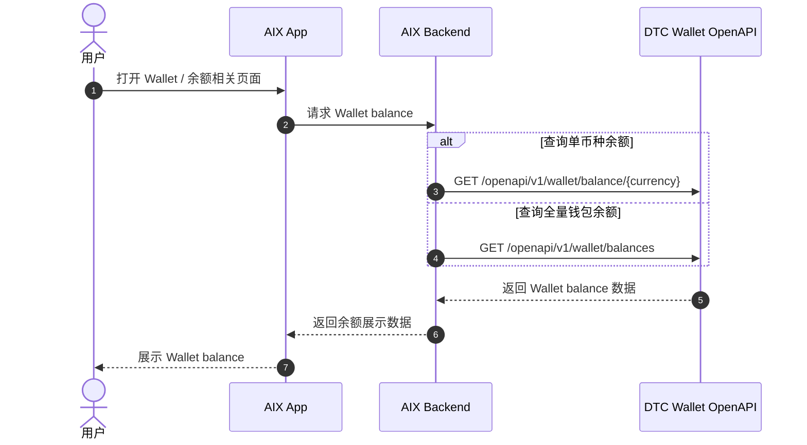
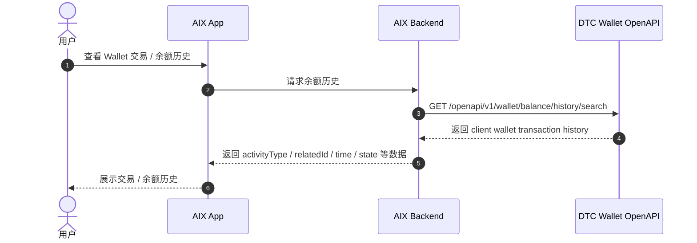
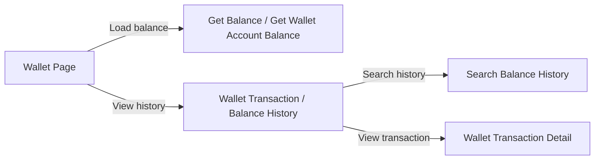

# Wallet Balance 钱包余额

> 本文件是对 DTC Wallet OpenAPI、交易历史、状态模型、Deposit 相关内容的 AI-readable 结构化转译稿。  
> 原始事实以附件 DTC 文档、历史 PRD、已有主事实文件和 ALL-GAP 为准；本文只调整结构，不新增原文档不存在的业务事实。  
> 本文件只覆盖 Wallet balance；不写 Card balance 主事实，也不补写 Card balance 自动归集到 Wallet 的未确认关联链路。

---

## 1. 文档信息

| 项目 | 内容 |
|---|---|
| 功能名称 | Wallet Balance 钱包余额 |
| 所属模块 | Wallet |
| Owner | 吴忆锋 |
| 版本 | 2.0 |
| 状态 | active |
| 更新时间 | 2026-05-04 |
| 文档类型 | AI-readable PRD translation |
| 来源文档 | DTC Wallet OpenAPI Documentation；DTC Wallet OpenAPI Document20260126；Transaction History；Wallet Deposit；Card Transaction Flow；ALL-GAP |

---

## 2. 需求背景、目标与范围

### 2.1 需求背景

AIX Wallet 需要展示和查询用户钱包余额，并支持查询钱包余额历史。DTC Wallet OpenAPI 中存在 Wallet balance、Wallet account balances、Search Balance History、ActivityType 等相关能力。

### 2.2 用户问题 / 业务问题

用户需要知道当前 Wallet 余额、余额历史和相关交易状态。产品、开发、QA 和 AI 读取时需要区分：

1. Wallet balance 与 Card balance。
2. 当前余额与余额历史。
3. ActivityType 与交易状态。
4. DTC 可用币种、接口返回币种与 AIX 前端展示币种。

### 2.3 需求目标

将 Wallet Balance 相关接口、字段、状态引用、ActivityType 和跨模块边界转译为 AI 可读取的结构化 Markdown，便于后续检索、评审和二次转译。

### 2.4 涉及功能清单

| 功能点 | 本期范围 | 优先级 | 状态 | 说明 |
|---|---|---|---|---|
| Wallet 当前余额查询 | In Scope | P0 | Confirmed / Partial | Get Balance、Get Wallet Account Balance 接口路径已确认；完整响应字段见 ALL-GAP-055 |
| Wallet 余额展示 | In Scope | P0 | Open | 展示排序、小额 / 零余额规则见 ALL-GAP-056 |
| Wallet 余额历史 | In Scope | P0 | Confirmed / Partial | Search Balance History 已确认；完整字段表见 ALL-GAP-058 |
| Wallet state 引用 | In Scope | P1 | Confirmed / Referenced | 引用 `transaction/status-model.md`，Balance 不重新定义状态机 |
| ActivityType | In Scope | P1 | Confirmed / Referenced | 引用 DTC Appendix ActivityType；业务映射见 ALL-GAP |
| Deposit 余额关系 | In Scope | P1 | Partial | 仅记录可引用事实；GTR / WC 映射和资金可用时点进 ALL-GAP |
| Card balance | Out of Scope | - | Out of Scope | Card balance 属于 Card Transaction Flow，不在本文定义 |
| Send / Swap 余额规则 | Out of Scope | - | Deferred | Send / Swap 当前 deferred，不纳入 active Balance 规则 |

---

## 3. 业务流程与规则

### 3.1 业务主流程说明

Wallet Balance 的主流程分为三类：

1. 当前余额查询：按单币种或全量账户查询 Wallet balance。
2. 余额历史查询：通过 Search Balance History 查询 client wallet transaction history。
3. 跨模块引用：交易状态引用 Transaction Status Model，Deposit 相关余额影响引用 Wallet Deposit 与 ALL-GAP。

本文不定义新的余额状态机，也不补写余额变动进入 / 退出条件。

### 3.2 业务时序图

#### 3.2.1 当前余额查询

#### 3.2.2 余额历史查询

### 3.3 流程步骤与业务规则

| 步骤 | 场景 / 规则 | 触发条件 | 责任方 | 系统处理 | 成功结果 | 失败 / 分支结果 | 来源 |
|---|---|---|---|---|---|---|---|
| 1 | 查询单币种 Wallet balance | 用户进入需要展示单币种余额的页面 | App / Backend / DTC | 调用 `[GET] /openapi/v1/wallet/balance/{currency}` | 返回单币种余额数据 | 失败处理见 ALL-GAP-057 | DTC Wallet OpenAPI |
| 2 | 查询全量 Wallet account balances | 用户进入 Wallet 余额页面 | App / Backend / DTC | 调用 `[GET] /openapi/v1/wallet/balances` | 返回全量钱包余额数据 | 失败处理见 ALL-GAP-057 | DTC Wallet OpenAPI |
| 3 | 查询余额历史 | 用户查看 Wallet 交易 / 余额历史 | App / Backend / DTC | 调用 `[GET] /openapi/v1/wallet/balance/history/search` | 返回 client wallet transaction history | 完整字段表见 ALL-GAP-058 | DTC Wallet OpenAPI / 4.2.4 |
| 4 | 展示 Wallet state | 余额历史或交易历史返回 state | App | 引用 Transaction Status Model | 展示 Wallet `state` 对应信息 | 展示文案和进入 / 退出条件见 ALL-GAP-050、ALL-GAP-051 | Transaction Status Model |
| 5 | 识别 ActivityType | 余额历史返回 activityType | App / Backend | 引用 ActivityType 枚举 | 展示或分类交易历史 | AIX 前端交易类型映射见 ALL-GAP-037 | DTC Wallet OpenAPI Appendix |

### 3.4 状态规则

Wallet Balance 不单独定义状态机。余额历史和交易详情中出现的 Wallet `state` 统一引用 `transaction/status-model.md`。

| 状态 | 含义 | 触发条件 | 用户可见表现 | 系统处理 | 可迁移到 | 是否终态 | 来源 |
|---|---|---|---|---|---|---|---|
| `PENDING` | Wallet 交易状态 | 来自 Wallet 交易记录 / 详情 | 前端文案见 ALL-GAP-051 | Balance 不重新定义 | 进入 / 退出条件见 ALL-GAP-050 | 未确认 | Transaction Status Model |
| `PROCESSING` | Wallet 交易状态 | 来自 Wallet 交易记录 / 详情 | 前端文案见 ALL-GAP-051 | Balance 不重新定义 | 进入 / 退出条件见 ALL-GAP-050 | 未确认 | Transaction Status Model |
| `AUTHORIZED` | Wallet 交易状态 | 来自 Wallet 交易记录 / 详情 | 前端文案见 ALL-GAP-051 | Balance 不重新定义 | 进入 / 退出条件见 ALL-GAP-050 | 未确认 | Transaction Status Model |
| `COMPLETED` | Wallet 交易状态 | 来自 Wallet 交易记录 / 详情 | 前端文案见 ALL-GAP-051 | Balance 不重新定义 | 进入 / 退出条件见 ALL-GAP-050 | 未确认 | Transaction Status Model |
| `REJECTED` | Wallet 交易状态 | 来自 Wallet 交易记录 / 详情 | 前端文案见 ALL-GAP-051 | Balance 不重新定义 | 进入 / 退出条件见 ALL-GAP-050 | 未确认 | Transaction Status Model |
| `CLOSED` | Wallet 交易状态 | 来自 Wallet 交易记录 / 详情 | 前端文案见 ALL-GAP-051 | Balance 不重新定义 | 进入 / 退出条件见 ALL-GAP-050 | 未确认 | Transaction Status Model |
| `status=102 Risk Withheld` | Deposit 外部状态来源 | DTC Crypto Deposit | 不得直接等同 Wallet `state` | 对余额影响待确认 | 不适用 | 未确认 | DTC Crypto Deposit；ALL-GAP-008 |

### 3.5 业务级异常与失败处理

| 异常场景 | 触发条件 | 错误来源 | 错误码 / 原因 | 用户表现 | 系统处理 | 是否可重试 | 最终状态 |
|---|---|---|---|---|---|---|---|
| 当前余额查询失败 | Get Balance / Get Wallet Account Balance 失败 | App / Backend / DTC | 原文未提供 | 原文未提供 | 见 ALL-GAP-057 | 未确认 | 未确认 |
| 余额历史查询失败 | Search Balance History 失败 | App / Backend / DTC | 原文未提供 | 原文未提供 | 见 ALL-GAP-058 | 未确认 | 未确认 |
| Risk Withheld 对余额影响未确认 | Deposit 进入 Risk Withheld | DTC Crypto Deposit | `status=102` | 是否展示冻结余额未确认 | 见 ALL-GAP-008 | 不适用 | 未确认 |
| Deposit success 后余额可用时点未确认 | payment_info success / Deposit success | DTC / WalletConnect / Backend | 原文未完整说明 | 理论立即可用但实际可能短延迟 | 见 ALL-GAP-005、ALL-GAP-016 | 不适用 | 未确认 |

---

## 4. 页面与交互说明

### 4.1 页面关系总览图

原始文档未提供完整 Wallet balance 页面跳转图。本文只按已确认能力表达读取关系，不补页面流转。

### 4.2 Wallet Balance Display

| 区块 | 内容 |
|---|---|
| 页面类型 | Wallet 余额展示区域 |
| 页面目标 | 展示用户 Wallet 当前余额 |
| 入口 / 触发 | 用户进入 Wallet 余额相关页面 |
| 展示内容 | Wallet balance；具体字段名、可用 / 冻结 / 总余额字段见 ALL-GAP-055 |
| 用户动作 | 查看余额；可能进入交易 / 余额历史 |
| 系统处理 / 责任方 | App / Backend 调用 Get Balance 或 Get Wallet Account Balance |
| 元素 / 状态 / 提示规则 | 展示排序、小额 / 零余额规则见 ALL-GAP-056 |
| 成功流转 | 展示余额数据 |
| 失败 / 异常流转 | 失败处理见 ALL-GAP-057 |
| 备注 / 边界 | 不将 DTC Available Currency 直接等同 AIX 前端展示币种 |

### 4.3 Wallet Balance History

| 区块 | 内容 |
|---|---|
| 页面类型 | 交易 / 余额历史列表 |
| 页面目标 | 展示 Wallet 余额历史 / client wallet transaction history |
| 入口 / 触发 | 用户查看 Wallet 历史 |
| 展示内容 | Search Balance History 返回的交易 / 余额历史；包含 activityType、relatedId、time、state 等字段 |
| 用户动作 | 查看列表、进入交易详情 |
| 系统处理 / 责任方 | App / Backend 调用 Search Balance History |
| 元素 / 状态 / 提示规则 | 完整字段表见 ALL-GAP-058；展示文案见 ALL-GAP-051 |
| 成功流转 | 展示历史记录 |
| 失败 / 异常流转 | 失败处理见 ALL-GAP-058 |
| 备注 / 边界 | ActivityType 是交易分类，不是状态机 |

### 4.4 Wallet Transaction Detail 引用

| 区块 | 内容 |
|---|---|
| 页面类型 | 交易详情页引用 |
| 页面目标 | 查看单笔 Wallet 交易详情 |
| 入口 / 触发 | 用户在交易 / 余额历史中点击某条记录 |
| 展示内容 | Wallet Transaction Detail；完整展示字段见 ALL-GAP-048 |
| 用户动作 | 查看详情；复制规则未完整确认 |
| 系统处理 / 责任方 | 通过 `transactionId` 查询详情 |
| 元素 / 状态 / 提示规则 | 完整请求 / 响应 / 页面展示 / 复制规则见 ALL-GAP-048 |
| 成功流转 | 展示交易详情 |
| 失败 / 异常流转 | 原文未提供 |
| 备注 / 边界 | `transactionId` 不等同 Card `data.id`；关联见 ALL-GAP-018 |

---

## 5. 字段、接口与数据

### 5.1 接口最小事实

| 类型 | 名称 | 所属系统 | 来源 | 用途 | 规则 / 输入输出 | 异常处理 |
|---|---|---|---|---|---|---|
| 接口 | Get Balance | DTC Wallet OpenAPI | DTC Wallet OpenAPI | 查询单币种 Wallet balance | `[GET] /openapi/v1/wallet/balance/{currency}`；路径参数包含 `currency` | 失败处理见 ALL-GAP-057 |
| 接口 | Get Wallet Account Balance | DTC Wallet OpenAPI | DTC Wallet OpenAPI | 查询全量 Wallet account balances | `[GET] /openapi/v1/wallet/balances`；用于钱包全量币种余额查询 | 返回字段完整结构、排序、零余额展示见 ALL-GAP-055、ALL-GAP-056 |
| 接口 | Search Balance History | DTC Wallet OpenAPI | DTC Wallet OpenAPI / 4.2.4 | 查询 client wallet transaction history | `[GET] /openapi/v1/wallet/balance/history/search`；返回字段包含 `activityType`、`relatedId`、`time`、`state` 等 | 完整字段表见 ALL-GAP-058 |
| 数据 | Wallet 交易 `id` | DTC / Wallet | DTC Wallet OpenAPI；用户确认 | 钱包交易记录 / 详情出参 | Long，交易 id | 与 `relatedId`、Card `data.id` 关系见 ALL-GAP-014、ALL-GAP-018 |
| 数据 | Wallet 详情入参 `transactionId` | DTC / Wallet | DTC Wallet OpenAPI；用户确认 | 查询单笔 Wallet 交易详情 | Unique transaction ID from DTC | 与 Card `data.id` / `D-REQUEST-ID` 的关系见 ALL-GAP-018 |
| 数据 | Wallet `state` | DTC / Wallet | DTC Wallet OpenAPI；用户确认 | 交易状态 | 枚举见 `transaction/status-model.md` | 进入 / 退出条件见 ALL-GAP-050 |
| 数据 | ActivityType | DTC / Wallet | DTC Wallet OpenAPI / Appendix ActivityType | 交易分类 | 见下表 | 前端交易类型映射见 ALL-GAP-037 |

### 5.2 币种口径分层

| 层级 | 含义 | 当前处理 |
|---|---|---|
| AIX 产品支持币种 | AIX PRD 中面向用户展示和操作的稳定币范围 | 当前 Wallet 产品口径主要为 USDC、USDT、WUSD、FDUSD；具体页面排序和展示规则见 ALL-GAP-056 |
| DTC Available Currency | DTC OpenAPI 附录中的可用币种枚举 | 可引用为接口枚举来源，但不得直接等同 AIX 前端展示范围 |
| 接口返回币种 | Get Balance / Get Wallet Account Balance 实际返回的币种 | 字段和过滤边界见 ALL-GAP-055 |
| 前端展示币种 | AIX App 在 Wallet 页面展示给用户的币种 | 以产品规则和配置为准；展示排序、小额 / 零余额规则见 ALL-GAP-056 |

### 5.3 ActivityType

| 枚举 | 值 | 含义 | Balance 处理 |
|---|---:|---|---|
| `FIAT_DEPOSIT` | 6 | Fiat Deposit | 可作为法币入金余额历史分类；是否对应 GTR 见 ALL-GAP-001 |
| `CRYPTO_DEPOSIT` | 10 | Stablecoin Deposit | 可作为稳定币 / Crypto 入金余额历史分类；是否对应 WalletConnect 见 ALL-GAP-002 |
| `DTC_WALLET` | 13 | DTC Wallet Payment | 可作为 DTC Wallet Payment 分类；前端展示映射见 ALL-GAP-037 |
| `CARD_PAYMENT_REFUND` | 20 | Card Payment Refund | 可作为卡退款入 Wallet 相关分类；对账关联见 ALL-GAP-017、ALL-GAP-018 |

---

## 6. 通知规则

Wallet Balance 原文未提供独立余额通知规则。余额相关通知不在本文补写。

| 触发事件 | 通知渠道 | 通知对象 | 文案 / 模板 | 跳转目标 | 失败 / 补发规则 |
|---|---|---|---|---|---|
| Deposit success 影响余额 | 引用 Notification / Deposit | 用户 | Deposit success | 原文未确认所有余额场景 | 见 `wallet/deposit.md` 与 ALL-GAP-010 |
| Risk Withheld / under review | 引用 Notification / Deposit | 用户 | under review / Risk Withheld | 与余额展示关系未确认 | 见 ALL-GAP-008 |
| Balance 查询失败 | 不适用 | 不适用 | 原文未提供 | 不适用 | 见 ALL-GAP-057 |

---

## 7. 权限 / 合规 / 风控

| 类型 | 规则 | 影响 | 来源 |
|---|---|---|---|
| 数据边界 | Wallet balance 与 Card balance 必须区分 | Card balance 不得写入 Wallet Balance 主事实 | Card Transaction Flow；ALL-GAP |
| 风控 | DTC Crypto Deposit 中的 `status=102 Risk Withheld` 是 Deposit 外部状态 | 不得直接等同 Wallet `state`；对余额展示影响见 ALL-GAP-008 | DTC Wallet OpenAPI / 3.4 |
| 合规 / Travel Rule | Deposit 中 GTR / WalletConnect 的交易报备和白名单规则由 Deposit 文件承接 | Balance 只引用，不补写规则 | `wallet/deposit.md` |
| 对账 | Card / Wallet / Deposit 关联依赖 `id`、`transactionId`、`relatedId` 等字段 | 具体组合见 ALL-GAP-014、ALL-GAP-018、ALL-GAP-029 | Transaction Reconciliation / ALL-GAP |

---

## 8. 待确认事项

| 问题 | 影响范围 | 当前处理 | 是否阻塞验收 | 建议确认人 |
|---|---|---|---|---|
| Wallet 当前余额完整请求 / 响应字段 | 余额展示 / 联调 / QA | 引用 ALL-GAP-055 | 否 | Backend / DTC |
| 可用余额 / 冻结余额 / 总余额字段名 | 余额展示 | 引用 ALL-GAP-055 | 否 | Backend / Product |
| 余额展示排序、小额 / 零余额规则 | 前端展示 | 引用 ALL-GAP-056 | 否 | Product / UI |
| 余额查询失败处理 | 异常展示 | 引用 ALL-GAP-057 | 否 | Product / Backend |
| Search Balance History 完整字段表 | 余额历史 / 交易历史 | 引用 ALL-GAP-058 | 否 | Backend / DTC |
| GTR 是否使用 `FIAT_DEPOSIT=6` | Deposit / 余额历史分类 | 引用 ALL-GAP-001 | 否 | Backend / DTC / Product |
| WalletConnect 是否使用 `CRYPTO_DEPOSIT=10` | Deposit / 余额历史分类 | 引用 ALL-GAP-002 | 否 | Backend / DTC / Product |
| payment_info success 后 Wallet balance 何时可用 | 充值后余额 | 引用 ALL-GAP-005 | 否 | Backend / DTC |
| Risk Withheld 与 Wallet `state` / 余额关系 | 状态 / 余额 / 冻结 | 引用 ALL-GAP-008 | 否 | Backend / DTC / Product |
| Card / Wallet 关联字段 | 对账 / 追踪 | 引用 ALL-GAP-014、ALL-GAP-017、ALL-GAP-018、ALL-GAP-029 | 否 | Finance / Backend / DTC |

---

## 9. 验收标准 / 测试场景

### 9.1 验收标准

本文是历史 PRD / DTC 文档的 AI-readable 转译稿，不作为新迭代 PRD 直接验收依据。当前验收标准仅用于检查转译质量：

| 验收场景 | 验收标准 |
|---|---|
| 范围边界 | 只覆盖 Wallet balance；不写 Card balance 主事实，不补 Card balance 自动归集链路 |
| 来源一致性 | 所有接口、字段、状态、ActivityType 均可追溯到 DTC 文档、已有主事实文件或 ALL-GAP |
| 未确认项处理 | 未确认内容进入 ALL-GAP，不写成已确认事实 |
| 状态处理 | 不新增 Balance 状态机；Wallet `state` 仅引用 Transaction Status Model |
| 币种口径 | AIX 产品币种、DTC Available Currency、接口返回币种、前端展示币种分层记录，不混用 |

### 9.2 测试场景矩阵

本文不生成新产品测试用例。若基于本文发起新迭代，应另建符合 `standard-prd-template.md` 的 PRD，并补充真实验收场景。当前仅保留转译检查矩阵：

| 场景 | 前置条件 | 用户操作 | 预期页面表现 | 预期系统结果 | 是否必测 |
|---|---|---|---|---|---|
| 当前余额接口事实检查 | DTC Wallet OpenAPI 可查 | 核对 Get Balance / Get Wallet Account Balance | 与原文一致 | 不新增字段 | 是 |
| Search Balance History 事实检查 | DTC Wallet OpenAPI 可查 | 核对 Search Balance History | 与原文一致 | 不新增完整字段表 | 是 |
| ActivityType 检查 | DTC Appendix 可查 | 核对 ActivityType 枚举 | 与原文一致 | 不直接映射具体产品路径 | 是 |
| GAP 处理检查 | ALL-GAP 可查 | 核对未确认项 | 未确认项不写成事实 | 正确引用 ALL-GAP | 是 |

---

## 10. 不写入事实的内容

以下内容当前不得写成事实：

1. Wallet balance 中可用余额字段名、冻结余额字段名、总余额字段名。
2. 将 DTC Available Currency 直接等同为 AIX 前端展示币种列表。
3. Wallet balance 与 Card balance 的币种一定一致。
4. Card balance 转 Wallet 后一定能通过 `relatedId` 关联到 Card `data.id`。
5. Wallet `transactionId` 等同于 Card `data.id`。
6. Wallet 余额变动的完整对账字段组合。
7. Wallet 余额查询失败后的用户提示文案。
8. `FIAT_DEPOSIT` 必然等同 GTR。
9. `CRYPTO_DEPOSIT` 必然等同 WalletConnect。
10. Deposit success 必然代表 Wallet balance 立即可用。
11. Risk Withheld 必然进入冻结余额。
12. Search Balance History 完整字段表已确认。

---

## 11. 来源引用

- (Ref: DTC Wallet OpenAPI Document20260126 / Wallet balance)
- (Ref: DTC Wallet OpenAPI Document20260126 / 4.2.4 Search Balance History)
- (Ref: DTC Wallet OpenAPI Document20260126 / Appendix ActivityType)
- (Ref: DTC Wallet OpenAPI Document20260126 / 3.4 Crypto Deposit)
- (Ref: knowledge-base/transaction/history.md / Wallet Transaction History)
- (Ref: knowledge-base/transaction/status-model.md / Wallet state)
- (Ref: knowledge-base/wallet/deposit.md / Wallet Deposit)
- (Ref: knowledge-base/card/card-transaction-flow.md / Card balance boundary)
- (Ref: knowledge-base/changelog/knowledge-gaps.md / ALL-GAP 总表)
- (Ref: 用户确认结论 / 2026-05-01)
- (Ref: 用户确认结论 / 2026-05-02 / ALL-GAP 唯一总表与无损迁移规则)
