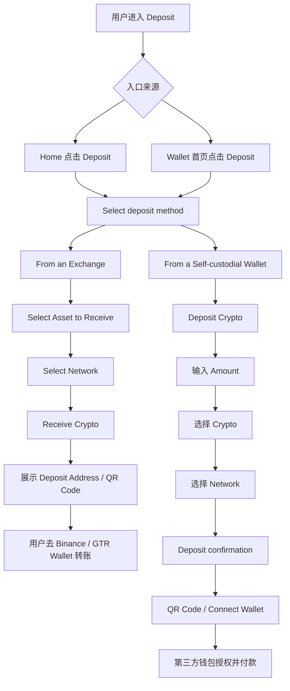
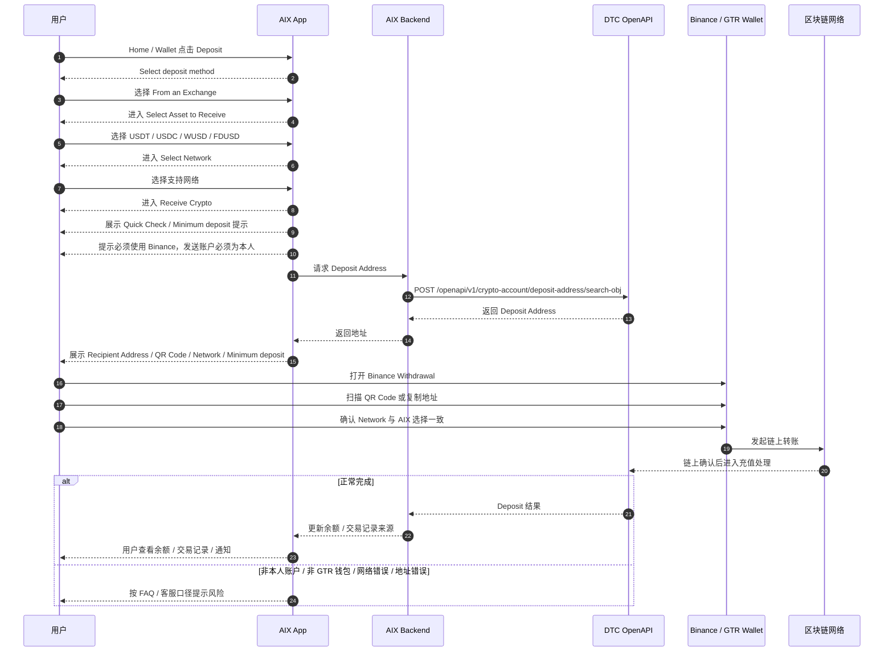
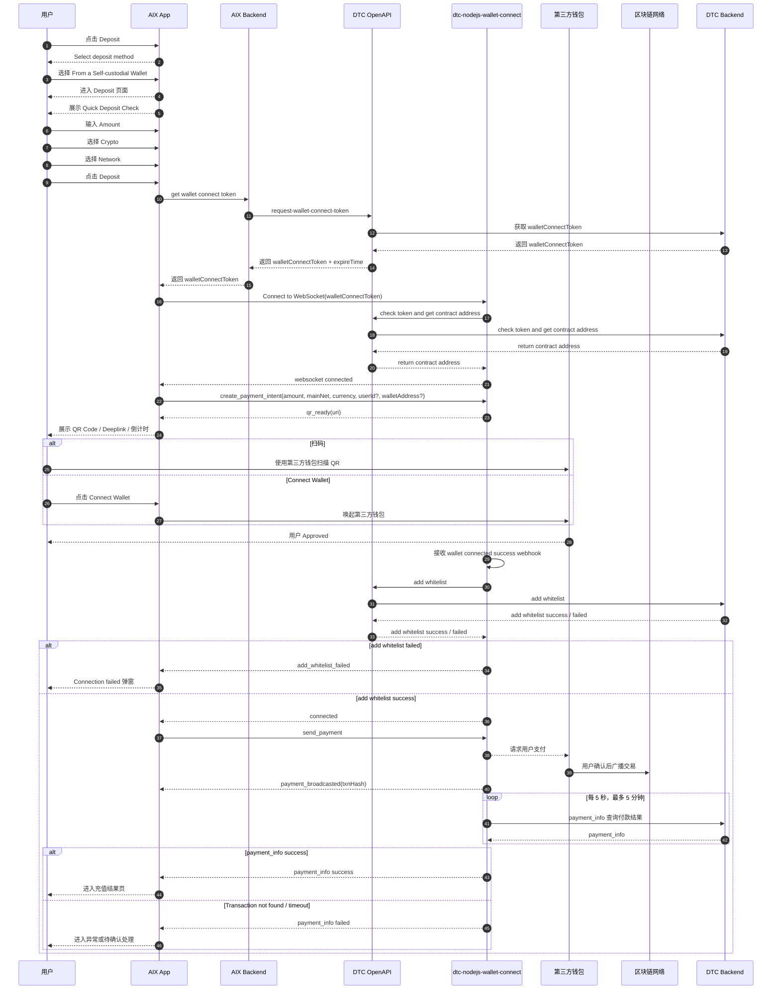
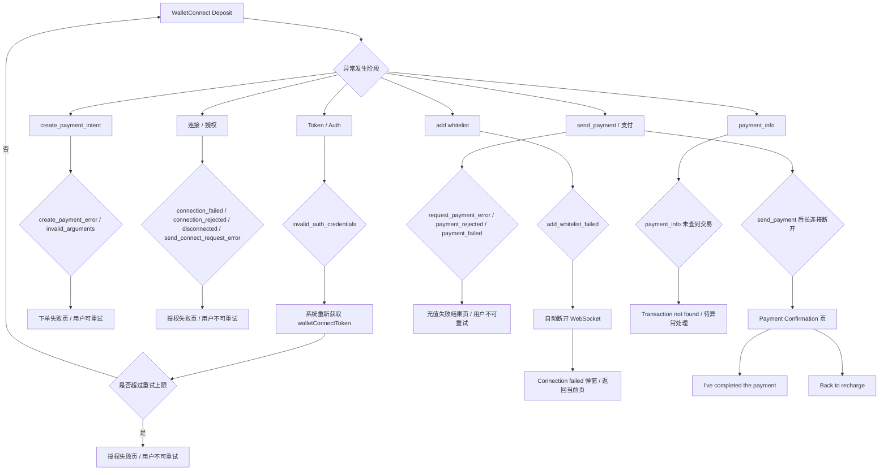
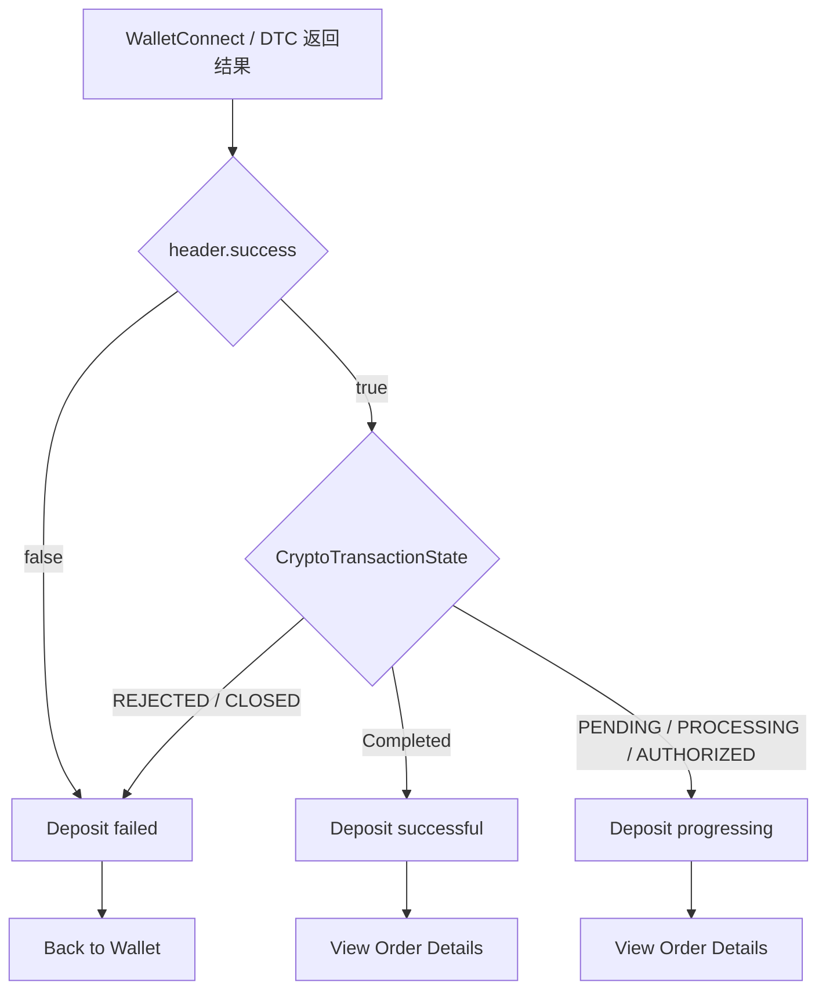

# Wallet Deposit 钱包充值

## 1. 当前状态

Wallet Deposit 当前状态为 `active`。

Deposit 当前包含两条已确认入金路径：

1. GTR / Exchange 地址充值。
2. WalletConnect / Self-custodial Wallet 充值。

GTR 与 WalletConnect 是两条不同产品路径，不得默认共用页面、接口、白名单、状态、异常或结果页规则。

Send / Withdrawal 与 Swap 因合规原因未上线或需重做，继续保持 `deferred`，不得作为当前 active Deposit 能力事实。

## 2. 模块定位

Wallet Deposit 用于沉淀 AIX Wallet 入金相关能力，包括：

1. Deposit 入口与充值方式分流。
2. GTR / Exchange 地址充值用户路径。
3. WalletConnect 充值用户路径、自动加白、支付与异常分流。
4. Deposit 状态展示、通知、错误处理和 ALL-GAP 引用边界。

DTC / WalletConnect 只作为外部依赖边界记录，不维护供应商完整接口说明书；只沉淀影响 AIX 页面、状态、通知、错误处理和用户路径的必要事实。

## 3. Deposit 总入口与路径分流

| 节点 | 已确认事实 | 来源 | 边界 |
|---|---|---|---|
| Deposit 入口 | AIX Home 点击 Deposit；Wallet 首页点击 Deposit | AIX Wallet PRD / 6.3.5、6.4.5 | 本次按用户确认去掉“单币种页”作为落库流程图入口 |
| 充值方式弹窗 | `Select deposit method` | AIX Wallet PRD / 6.3.5、6.4.5 | 不补未出现方式 |
| From an Exchange | 进入地址充值 / GTR 路径 | AIX Wallet PRD / 6.3 | 当前支持 Binance，列表可配置 |
| From a Self-custodial Wallet | 进入 WalletConnect 路径 | AIX Wallet PRD / 6.4 | 适用于用户自己掌握私钥的钱包 |

## 4. GTR / Exchange 地址充值

### 4.1 功能定位

GTR / Exchange 地址充值是地址充值路径。用户选择交易所 / 托管钱包来源后，选择币种和网络，AIX 生成收款地址和 QR Code，用户到 Binance / GTR Wallet 发起链上转账。

PRD 说明：GTR 钱包充值自动交易报备，不需要做交易声明，也不用校验地址白名单；当前支持 GTR's Wallet 的只有 Binance，后续 DTC 可更新支持列表。

### 4.2 GTR / Exchange 时序图

### 4.3 GTR 页面节点

| 页面 / 节点 | 已确认规则 | 来源 |
|---|---|---|
| 充值方式 | 选择 `From an Exchange` | AIX Wallet PRD / 6.3.5 |
| Select Asset to deposit | 展示 USDT、USDC、WUSD、FDUSD；按 USDC、USDT、WUSD、FDUSD 固定排序；展示余额 | AIX Wallet PRD / 6.3.5 |
| Select Network | 按所选币种筛选可用网络；网络清单后端可配置 | AIX Wallet PRD / 6.3.5 |
| Receive Crypto | 标题为 `Receive {Crypto}`；展示 FAQ 入口 | AIX Wallet PRD / 6.3.5 |
| Quick Check | 提示使用 Binance wallet、发送账户必须为本人 | AIX Wallet PRD / 6.3.5 |
| Minimum deposit 弹窗 | 提示低于最小充值金额不会入账；设备维度弹窗 | AIX Wallet PRD / 6.3.5 |
| Recipient Address | 进入页面调用 `/openapi/v1/crypto-account/deposit-address/search-obj` 获取 | AIX Wallet PRD / 6.3.5；7.3 |
| Copy | 点击复制地址，提示 `The information has been copied.` | AIX Wallet PRD / 6.3.5 |
| Share QR Code | 调用系统分享组件 | AIX Wallet PRD / 6.3.5 |
| Done | 返回 Wallet 首页 | AIX Wallet PRD / 6.3.5 |

### 4.4 GTR 资产与网络规则

| 币种 | 支持网络 | 最小充值 |
|---|---|---|
| USDC | BASE、BSC、ETHEREUM、SOLANA | 1.5 Crypto |
| USDT | BSC、ETHEREUM、SOLANA | 1.5 Crypto |
| WUSD | ETHEREUM | 0.01 Crypto |
| FDUSD | BSC、ETHEREUM、SOLANA | 0.01 Crypto |

页面底部警示文案：`Only use supported networks shown above. Using an unsupported network will result in permanent loss of funds.`

### 4.5 GTR's Wallet 列表

| 项目 | 规则 |
|---|---|
| 页面标题 | `GTR's Wallet` |
| 钱包列表 | 支持 Global Travel Rule 的托管钱包，列表可配置 |
| 当前钱包 | Binance Wallet |
| 文案 | `The above wallet supports Global Travel Rule. Recharge will be credited directly to your account.` |
| 业务说明 | GTR 钱包充值自动交易报备，不需要交易声明，也不用校验地址白名单 |

## 5. WalletConnect 充值

### 5.1 功能定位

WalletConnect 充值用于 Self-custodial Wallet 路径。用户输入金额、选择币种和网络后，AIX 获取 walletConnectToken 并连接 DTC WalletConnect WebSocket，生成 QR / deeplink。用户通过第三方钱包授权后，DTC 自动添加发送地址白名单；白名单成功后进入支付。

### 5.2 WalletConnect 主时序图（含自动加白）

### 5.3 WalletConnect 页面节点

| 页面 / 节点 | 已确认规则 | 来源 |
|---|---|---|
| 充值方式 | 选择 `From a Self-custodial Wallet` | AIX Wallet PRD / 6.4.5 |
| Deposit 页面 | 标题 `Deposit`；进入页面获取 walletConnectToken 并连接 WebSocket | AIX Wallet PRD / 6.4.5 |
| Quick Deposit Check | 进入页面设备维度弹窗，提示链、币种和 Gas | AIX Wallet PRD / 6.4.5 |
| Amount | 必填，纯数字，最小值 ≥ 0.01，最大值按币种配置 | AIX Wallet PRD / 6.4.5 |
| Crypto | USDT、USDC、WUSD、FDUSD；默认 USDC | AIX Wallet PRD / 6.4.5 |
| Network | 按币种筛选网络；默认 BSC，若币种不支持 BSC 则默认 ETH | AIX Wallet PRD / 6.4.5 |
| Deposit confirmation | 进入页面调用 `create_payment_intent`，WalletConnect 初始化连接 | AIX Wallet PRD / 6.4.5 |
| qr_ready | 返回 uri，前端生成带当前币种 logo 的 QR | DTC WalletConnect / 3.2.3 |
| QR 倒计时 | 展示 `Awaiting payment... 4:00 Min`，超过过期时间二维码置灰 | AIX Wallet PRD / 6.4.5 |
| Deeplink 有效期 | Deeplink 有效期 5 分钟 | AIX Wallet PRD / 6.4 知识点 |
| Connect Wallet | 若无可用第三方钱包，toast：`No wallets available. Please install a supported wallet app.` | AIX Wallet PRD / 6.4.5 |
| Complete Payment | 用户已授权但未支付即回到 AIX 时，按钮从 `Connect a Wallet` 更新为 `Complete Payment` | AIX Wallet PRD / 6.4.5 |

### 5.4 WalletConnect 白名单规则

| 规则 | 已确认事实 | 来源 | 边界 |
|---|---|---|---|
| 自动加白 | 用户 WalletConnect Approved 后，DTC 自动添加地址到白名单 | AIX Wallet PRD / 6.4.5；DTC WalletConnect / sequence diagram | 必须在主流程内体现 |
| connected 触发 | add whitelist 成功后，DTC 返回 `connected` | DTC WalletConnect / 5 sequence diagram | connected 之后才 `send_payment` |
| add_whitelist_failed | add whitelist 失败时返回 `add_whitelist_failed` | DTC WalletConnect / 3.2.13 | 会自动断开 WebSocket |
| 二次充值 | PRD 口径：当天使用同一发送地址二次充值无需再次 Approved | AIX Wallet PRD / 6.4.5 | AIX 对客授权有效期已确认按 1 天 |
| 7 天免连接 | DTC 文档存在 `userId + walletAddress` 下 7 天内不需要再次连接钱包的内部逻辑 | DTC WalletConnect / 4.1；用户确认 2026-05-02 | 用户确认 DTC 7 天是内部逻辑，不作为 AIX 对客有效期 |
| 授权有效期 | AIX 对客 WalletConnect 授权有效期按 1 天 | AIX Wallet PRD / 6.4 知识点；用户确认 2026-05-02 | 不再作为待确认项 |

### 5.5 WalletConnect 平台差异

| 平台 | 已确认规则 | 来源 |
|---|---|---|
| iOS | 默认唤起支持 WC 的第一个已安装 App；如果第一个 App 无余额，用户可能需要卸载或改用 QR | AIX Wallet PRD / 6.4.5 |
| Android | Native 唤起系统应用选择器；不同机型样式可能不同 | AIX Wallet PRD / 6.4.5 |
| QR | 第三方钱包扫码后跳转到钱包页面完成付款；QR 失效后无法唤起钱包充值 | AIX Wallet PRD / 6.4.5 |

## 6. WalletConnect 异常分流

| 分组 | 事件 | 页面处理 | 来源 |
|---|---|---|---|
| Token | `invalid_auth_credentials` | 自动重取 token；超过上限进入授权失败 | AIX Wallet PRD / 6.4.5；DTC WalletConnect / 3.2.11 |
| 下单 | `create_payment_error`、`invalid_arguments` | 下单失败页，可重试 | AIX Wallet PRD / 6.4.5；DTC WalletConnect / 3.2.12、3.2.14 |
| 连接 / 授权 | `connection_failed`、`connection_rejected`、`disconnected`、`send_connect_request_error` | 授权失败页，不可重试 | AIX Wallet PRD / 6.4.5；DTC WalletConnect / 3.2.8-3.2.10、3.2.15 |
| 白名单 | `add_whitelist_failed` | 自动断开 WebSocket，提示 `Connection failed，Unable to send connect request, Please try again.` | AIX Wallet PRD / 6.4.5；DTC WalletConnect / 3.2.13、3.3 |
| 支付 | `request_payment_error`、`payment_rejected`、`payment_failed` | 充值失败结果页，用户不可重试 | AIX Wallet PRD / 6.4.5；DTC WalletConnect / 3.2.2、3.2.6、3.2.7 |
| 支付后长连接断开 | send_payment 后长连接断开 | `Payment Confirmation` 页 | AIX Wallet PRD / 6.4.5 |
| 付款结果查询 | `payment_info` false / `Transaction not found` | 待异常处理 | DTC WalletConnect / 3.2.1；见 ALL-GAP-012 |

## 7. WalletConnect 结果状态

| 条件 | AIX 展示 | 操作 | 来源 |
|---|---|---|---|
| `success=true` + `Completed` | `Deposit successful!` | `View Order Details` | AIX Wallet PRD / 6.4.5 |
| `success=true` + `PENDING / PROCESSING / AUTHORIZED` | `Deposit progressing` | `View Order Details` | AIX Wallet PRD / 6.4.5 |
| `success=false` | `Deposit failed` | `Back to Wallet` | AIX Wallet PRD / 6.4.5 |
| `REJECTED / CLOSED` | `Deposit failed` | `Back to Wallet` | AIX Wallet PRD / 6.4.5 |

Risk Withheld 是异步返回，不触发充值结果页；用户查询交易详情时状态为 under review。该结论来自用户确认，后续与 Wallet `state` / 余额关系仍见 ALL-GAP-008。

Refunded 没有 AIX 对客结果页。该结论来自用户确认。

## 8. GTR 与 WalletConnect 差异表

| 维度 | GTR / Exchange 地址充值 | WalletConnect 充值 |
|---|---|---|
| 充值方式选择 | From an Exchange | From a Self-custodial Wallet |
| 钱包类型 | 托管钱包 / 交易所 | 自托管钱包 |
| 当前代表 | Binance | 支持 WalletConnect 的钱包 |
| 页面主链路 | Select Asset → Select Network → Receive Crypto | Deposit → Deposit confirmation → Result |
| 地址来源 | Get Deposit Address | create_payment_intent 后 qr_ready / deeplink |
| 是否自动加白 | 不校验地址白名单 | Approved 后自动 add whitelist |
| 是否交易声明 | 自动交易报备，不需要交易声明 | 自动交易报备，不需要交易声明 |
| 是否需要用户输入金额 | 地址充值页主要是选币种 / 网络 / 地址 | Deposit 页面必须输入 Amount |
| 最小金额 | USDT / USDC：1.5；WUSD / FDUSD：0.01 | 默认 0.01 |
| 网络默认 | Select Network 默认未选 | 默认 BSC；币种不支持 BSC 时默认 ETH |
| 主要异常 | 非 Binance / 非本人账户 / 网络错误 / 地址错误 / 低于最小充值 | 无可用钱包 / 授权失败 / 加白失败 / 支付失败 / 长连接断开 / payment_info 未查到 |
| 结果页 | PRD 未像 WalletConnect 一样定义明确结果页 | PRD 明确 success / progressing / failed 结果页；Risk Withheld 不触发结果页 |

## 9. Deposit 与 Balance / History 的关系

| 能力 | 当前可引用 | ALL-GAP 边界 |
|---|---|---|
| Deposit 收款地址 | GTR 路径通过 `/openapi/v1/crypto-account/deposit-address/search-obj` 获取 | 交易记录生成时机仍需以后端事实补齐 |
| WalletConnect 支付 | 通过 WalletConnect token、WebSocket、create_payment_intent、send_payment、payment_info | WalletConnect 与 Wallet `transactionId` / `relatedId` 关联见 ALL-GAP-007、ALL-GAP-014 |
| Deposit 记录 ID | Wallet 交易 `id` 存在 | GTR / WC 记录生成时机见 ALL-GAP-007 |
| Deposit 详情查询 | Wallet 详情入参 `transactionId` 存在；PRD 另有 `Get Crypto Transaction`、`Get Crypto Transaction By ReferenceNo` | GTR / WC transactionId 来源见 ALL-GAP-007 |
| Deposit 状态 | WC 结果页使用 Completed / PENDING / PROCESSING / AUTHORIZED / REJECTED / CLOSED；Risk Withheld 详情展示 under review | 与 Wallet `state`、ActivityType 的映射见 ALL-GAP-008、ALL-GAP-016 |
| Deposit 余额历史 | Search Balance History 存在，ActivityType 包含 `CRYPTO_DEPOSIT=10`、`FIAT_DEPOSIT=6` | GTR / WC `relatedId` 取值见 ALL-GAP-001、ALL-GAP-002、ALL-GAP-014 |

## 10. Deposit 通知边界

| 通知 | GTR | WalletConnect | 当前处理 |
|---|---|---|---|
| 入金成功通知 | Notification 表有 Deposit success 通用事实 | Notification 表有 Deposit success 通用事实 | 不写成覆盖所有子路径和所有状态恢复场景；见 ALL-GAP-010 |
| 入金冻结 / review 通知 | FAQ / Notification 有 under review 口径 | DTC Crypto Deposit / Notification 有 Risk Withheld 口径 | 不等同 Wallet `REJECTED / PENDING / PROCESSING`；见 ALL-GAP-008 |
| 入金失败通知 | 待来源确认 | PRD 有结果页，不代表已有通知 | 不写新通知；通知覆盖见 ALL-GAP-010 |
| Declare / Travel Rule 通知 | GTR 自动交易报备，不需要交易声明 | PRD 口径为自动交易报备，不需要交易声明 | 不新增 Declare 通知；合规边界见 ALL-GAP-044 |

## 11. 不写入事实的内容

以下内容当前不得写成事实：

1. GTR 与 WalletConnect 使用同一套字段、状态、白名单或异常处理。
2. GTR 等同 `FIAT_DEPOSIT=6`。
3. WalletConnect 等同 `CRYPTO_DEPOSIT=10`。
4. Deposit success 等同 Wallet `COMPLETED`。
5. Risk Withheld 等同 Wallet `REJECTED / PENDING / PROCESSING`。
6. payment_info success 等同 Wallet balance 永远同步无延迟。
7. WalletConnect 的 `transactionId`、`id`、`relatedId` 关联规则已确认。
8. GTR 地址充值一定有与 WalletConnect 相同的结果页。
9. Card balance 自动归集属于 Wallet Deposit。
10. Send / Withdrawal 或 Swap 属于当前 active Deposit 能力。
11. DTC 的 7 天免连接内部逻辑是 AIX 对客授权有效期。

## 12. ALL-GAP 引用

本文件不维护独立待确认表。Deposit 相关不确定项统一引用 ALL-GAP：

| 编号 | 主题 |
|---|---|
| ALL-GAP-001 | GTR 是否使用 `FIAT_DEPOSIT=6` |
| ALL-GAP-002 | WalletConnect 是否使用 `CRYPTO_DEPOSIT=10` |
| ALL-GAP-007 | `relatedId / transactionId / id` 如何串联 GTR / WalletConnect 入金 |
| ALL-GAP-008 | Risk Withheld 与 Wallet `state` / 余额关系 |
| ALL-GAP-009 | GTR 地址充值是否有与 WalletConnect 相同的结果页 |
| ALL-GAP-010 | GTR / WalletConnect 是否复用 Deposit success / under review 通知 |
| ALL-GAP-011 | GTR 异常处理和客服口径 |
| ALL-GAP-012 | WalletConnect `payment_info false / Transaction not found` 的后续处理 |
| ALL-GAP-013 | WalletConnect 失败是否需要告警 |
| ALL-GAP-014 | Wallet `relatedId` 在 Card / GTR / WC 场景取值 |
| ALL-GAP-016 | Deposit success 与 Wallet `state=COMPLETED` 的映射 |
| ALL-GAP-044 | WalletConnect Declare / Travel Rule / 白名单规则边界 |

## 13. 历史 DEP-GAP 到 ALL-GAP 映射

本表用于无损迁移历史问题，不作为新的模块级 checklist。后续只维护 ALL-GAP。

| 原编号 | 原问题 | 当前 ALL-GAP / 处理 |
|---|---|---|
| DEP-GAP-001 | WalletConnect 授权有效期：PRD 1 天 vs DTC 7 天免连接规则 | 用户已确认 AIX 按 1 天；对应 ALL-GAP-006 resolved-by-user |
| DEP-GAP-002 | GTR 是否等同 `FIAT_DEPOSIT=6` | ALL-GAP-001 |
| DEP-GAP-003 | WalletConnect 是否等同 `CRYPTO_DEPOSIT=10` | ALL-GAP-002 |
| DEP-GAP-004 | Risk Withheld 在 AIX 结果页中如何展示 | 用户已确认不触发结果页；详情 under review；对应 ALL-GAP-003 resolved-by-user，余额 / state 关系见 ALL-GAP-008 |
| DEP-GAP-005 | Refunded 状态是否有 AIX 对客结果页 | 用户已确认没有；对应 ALL-GAP-004 resolved-by-user |
| DEP-GAP-006 | payment_info success 与 Wallet balance 可用时点 | 用户已确认理论立即可用但实际可能短延迟；对应 ALL-GAP-005 resolved-by-user |
| DEP-GAP-007 | relatedId / transactionId / 对账字段 | ALL-GAP-007、ALL-GAP-014 |

## 14. 来源引用

- (Ref: 历史prd/AIX Wallet V1.0【Deposit & Send & Swap 】.docx / 3.1 交易说明)
- (Ref: 历史prd/AIX Wallet V1.0【Deposit & Send & Swap 】.docx / 6.3 钱包地址充值 Deposit（GTR's Wallet）)
- (Ref: 历史prd/AIX Wallet V1.0【Deposit & Send & Swap 】.docx / 6.4 钱包链接充值 Deposit（WalletConnect）)
- (Ref: 历史prd/AIX Wallet V1.0【Deposit & Send & Swap 】.docx / 7.4 钱包充值 Wallet Connect)
- (Ref: DTC接口文档/Documentation dtc-nodejs-wallet-connect (ARCHIVE).docx / 1 Request Access Token & Wallet Connect Token)
- (Ref: DTC接口文档/Documentation dtc-nodejs-wallet-connect (ARCHIVE).docx / 3 Server-Emitted Events)
- (Ref: DTC接口文档/Documentation dtc-nodejs-wallet-connect (ARCHIVE).docx / 4 Client-Emitted Events)
- (Ref: DTC接口文档/Documentation dtc-nodejs-wallet-connect (ARCHIVE).docx / 5 sequence diagram)
- (Ref: [2025-11-25] AIX+Notification / Deposit rows)
- (Ref: knowledge-base/changelog/knowledge-gaps.md / ALL-GAP 总表)
- (Ref: 用户确认结论 / 2026-05-02 / Deposit 流程图去掉单币种页入口)
- (Ref: 用户确认结论 / 2026-05-02 / WalletConnect 有效期、Risk Withheld、Refunded、payment_info success)
