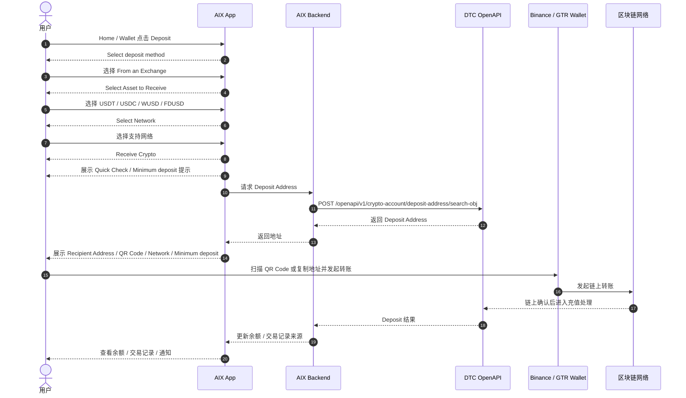
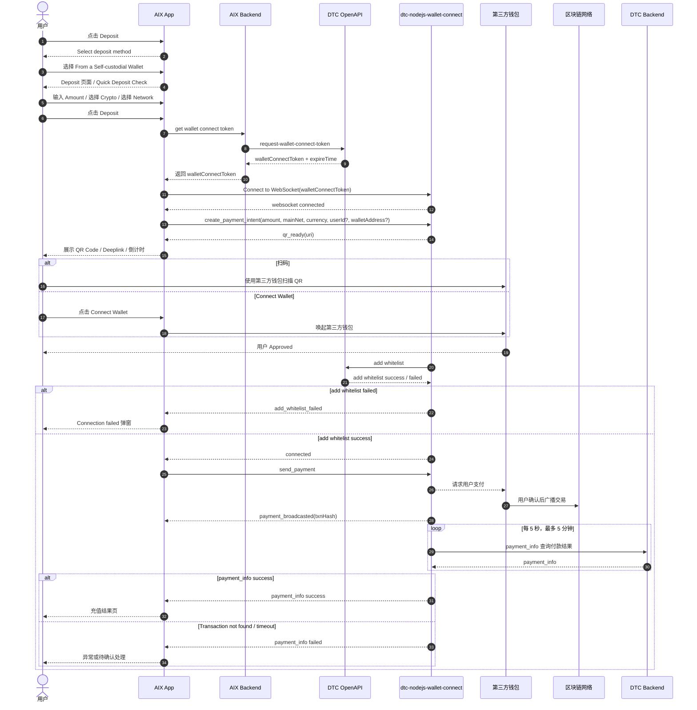
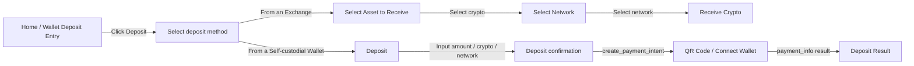

# Wallet Deposit 钱包充值

> 本文件是对历史 PRD / DTC 文档中 Wallet Deposit 相关内容的 AI-readable 结构化转译稿。  
> 原始事实以附件 PRD、DTC 文档、Notification 文档为准；本文只调整结构，不新增原文档不存在的业务事实。  
> 本文件只覆盖 GTR / Exchange 地址充值与 WalletConnect / Self-custodial Wallet 充值；Send / Withdraw / Swap 不纳入本文正文。

---

## 1. 文档信息

| 项目 | 内容 |
|---|---|
| 功能名称 | Wallet Deposit 钱包充值 |
| 所属模块 | Wallet |
| Owner | 吴忆锋 |
| 版本 | 2.0 |
| 状态 | active |
| 更新时间 | 2026-05-04 |
| 文档类型 | AI-readable PRD translation |
| 来源文档 | AIX Wallet V1.0【Deposit & Send & Swap】；Documentation dtc-nodejs-wallet-connect；DTC Wallet OpenAPI Documentation；AIX Notification |

---

## 2. 需求背景、目标与范围

### 2.1 需求背景

历史 PRD 中，AIX Wallet 支持用户进行稳定币入金。入金路径分为：

1. GTR / Exchange 地址充值。
2. WalletConnect / Self-custodial Wallet 充值。

### 2.2 用户问题 / 业务问题

用户需要从外部钱包或交易所向 AIX Wallet 充值稳定币。不同来源的钱包类型、地址来源、白名单规则、交易报备、页面路径、异常处理不同，需要拆分记录。

### 2.3 需求目标

将历史 PRD 与 DTC 文档中 Wallet Deposit 的已确认内容转译为 AI 可读取的结构化 Markdown，便于后续检索、评审和二次转译。

### 2.4 涉及功能清单

| 功能点 | 本期范围 | 优先级 | 状态 | 说明 |
|---|---|---|---|---|
| Deposit 入口与充值方式选择 | In Scope | P0 | Confirmed | Home / Wallet 首页点击 Deposit 后进入充值方式选择 |
| GTR / Exchange 地址充值 | In Scope | P0 | Confirmed | From an Exchange；当前 PRD 口径为 Binance，实际支持范围以 DTC / GTR 配置为准 |
| WalletConnect 充值 | In Scope | P0 | Confirmed | From a Self-custodial Wallet；支持 QR / deeplink / Connect Wallet |
| WalletConnect 自动加白 | In Scope | P0 | Confirmed | 用户 Approved 后 DTC 自动添加地址到白名单 |
| WalletConnect 结果页 | In Scope | P0 | Confirmed | success / progressing / failed |
| Send / Withdraw | Out of Scope | - | Deferred | 因合规原因未上线，不纳入本文正文 |
| Swap | Out of Scope | - | Deferred | 因合规原因未上线或需重做，不纳入本文正文 |

---

## 3. 业务流程与规则

### 3.1 业务主流程说明

用户从 Home 或 Wallet 首页点击 Deposit，选择充值方式：

- 选择 `From an Exchange` 时进入 GTR / Exchange 地址充值路径。用户选择币种和网络后，AIX 展示收款地址和 QR Code，用户到 Binance / GTR Wallet 发起转账。
- 选择 `From a Self-custodial Wallet` 时进入 WalletConnect 路径。用户输入金额、选择币种和网络，AIX 获取 walletConnectToken 并连接 WalletConnect，生成 QR / deeplink。用户通过第三方钱包授权并付款后，系统轮询 payment_info 并展示充值结果。

GTR 与 WalletConnect 是两条不同产品路径，不得默认共用页面、接口、白名单、状态、异常或结果页规则。

### 3.2 业务时序图

#### 3.2.1 GTR / Exchange 地址充值

#### 3.2.2 WalletConnect 充值

### 3.3 流程步骤与业务规则

| 步骤 | 场景 / 规则 | 触发条件 | 责任方 | 系统处理 | 成功结果 | 失败 / 分支结果 | 来源 |
|---|---|---|---|---|---|---|---|
| 1 | 进入 Deposit | Home / Wallet 点击 Deposit | App | 展示 `Select deposit method` | 用户选择充值方式 | 不适用 | AIX Wallet PRD / 6.3.5、6.4.5 |
| 2 | 选择 GTR 路径 | 选择 `From an Exchange` | App | 进入 Select Asset to Receive | 用户选择币种 | 不适用 | AIX Wallet PRD / 6.3 |
| 3 | GTR 选择币种 | 进入 Select Asset to Receive | App | 展示 USDT、USDC、WUSD、FDUSD | 用户选择币种 | 不适用 | AIX Wallet PRD / 6.3.5 |
| 4 | GTR 选择网络 | 用户已选择币种 | App / Backend | 按币种筛选可用网络 | 用户选择网络 | 不支持网络提示风险 | AIX Wallet PRD / 6.3.5 |
| 5 | GTR 获取地址 | 进入 Receive Crypto | App / Backend / DTC | 调用 deposit address 接口 | 展示地址和 QR Code | 地址获取失败处理未完整确认 | AIX Wallet PRD / 6.3.5；7.3 |
| 6 | GTR 外部转账 | 用户复制地址或扫描 QR | 用户 / Exchange | 用户在 Binance / GTR Wallet 发起转账 | DTC 链上确认后处理入金 | 非本人账户 / 非 GTR 钱包 / 网络错误 / 地址错误按 FAQ / 客服口径提示风险 | AIX Wallet PRD / 6.3；ALL-GAP-011 |
| 7 | 选择 WalletConnect 路径 | 选择 `From a Self-custodial Wallet` | App | 进入 Deposit 页面 | 用户输入金额、币种、网络 | 不适用 | AIX Wallet PRD / 6.4 |
| 8 | WC 获取 token | 进入 Deposit 页面或提交 Deposit | App / Backend / DTC | 获取 walletConnectToken 并连接 WebSocket | 连接成功 | token / auth 异常进入异常分流 | AIX Wallet PRD / 6.4.5；DTC WalletConnect |
| 9 | WC 创建支付意图 | 输入金额、币种、网络后点击 Deposit | App / WC | create_payment_intent | 返回 qr_ready(uri) | create_payment_error / invalid_arguments | AIX Wallet PRD / 6.4.5；DTC WalletConnect |
| 10 | WC 授权和加白 | 用户扫码或 Connect Wallet | Wallet / WC / DTC | 用户 Approved 后 DTC 自动 add whitelist | connected 后进入 send_payment | add_whitelist_failed 弹窗 | AIX Wallet PRD / 6.4.5；DTC WalletConnect |
| 11 | WC 支付与查询 | add whitelist success | WC / Wallet / Chain / DTC | send_payment 后轮询 payment_info | 进入结果页 | Transaction not found / timeout 待异常处理 | AIX Wallet PRD / 6.4.5；DTC WalletConnect |

### 3.4 状态规则

| 状态 | 含义 | 触发条件 | 用户可见表现 | 系统处理 | 可迁移到 | 是否终态 | 来源 |
|---|---|---|---|---|---|---|---|
| `success=true + Completed` | WalletConnect 充值成功 | DTC / WalletConnect 返回成功且状态为 Completed | `Deposit successful!` | 展示结果页，操作为 `View Order Details` | 不适用 | 是 | AIX Wallet PRD / 6.4.5 |
| `success=true + PENDING / PROCESSING / AUTHORIZED` | WalletConnect 充值处理中 | DTC / WalletConnect 返回成功但状态未完成 | `Deposit progressing` | 展示结果页，操作为 `View Order Details` | Completed / REJECTED / CLOSED | 否 | AIX Wallet PRD / 6.4.5 |
| `success=false` | WalletConnect 充值失败 | DTC / WalletConnect header.success=false | `Deposit failed` | 展示结果页，操作为 `Back to Wallet` | 不适用 | 是 | AIX Wallet PRD / 6.4.5 |
| `REJECTED / CLOSED` | WalletConnect 充值失败 | CryptoTransactionState 为 REJECTED / CLOSED | `Deposit failed` | 展示结果页，操作为 `Back to Wallet` | 不适用 | 是 | AIX Wallet PRD / 6.4.5 |
| Risk Withheld / `status=102` | DTC Crypto Deposit 异步风控状态 | DTC 异步返回 Risk Withheld | 不触发充值结果页；交易详情展示 under review | 与 Wallet `state` / 余额关系待确认 | 不适用 | 未确认 | DTC Wallet OpenAPI / 3.4；用户确认；ALL-GAP-008 |
| Refunded | 退款状态 | DTC / 交易详情来源 | 没有 AIX 对客结果页 | 不展示独立结果页 | 不适用 | 是 | 用户确认 |

> 注意：本节只记录历史 PRD / DTC 文档出现的状态展示规则，不建立新的统一状态机。Deposit success、Risk Withheld 与 Wallet `state` 的精确映射仍引用 ALL-GAP。

### 3.5 业务级异常与失败处理

| 异常场景 | 触发条件 | 错误来源 | 错误码 / 原因 | 用户表现 | 系统处理 | 是否可重试 | 最终状态 |
|---|---|---|---|---|---|---|---|
| GTR 非 Binance / 非本人账户 | 用户用不符合 PRD 要求的钱包或账户转账 | 用户 / Exchange | 原文未给错误码 | 按 FAQ / 客服口径提示风险 | 原文未给完整系统处理 | 未确认 | ALL-GAP-011 |
| GTR 网络错误 / 地址错误 | 用户选择或使用错误网络 / 地址 | 用户 / Chain / Exchange | 原文未给错误码 | 风险提示 | 原文未给完整系统处理 | 未确认 | ALL-GAP-011 |
| GTR 低于最小充值金额 | 用户充值金额低于页面提示 | 用户 / Chain / DTC | 原文未给错误码 | Minimum deposit 弹窗提示低于最小金额不会入账 | 原文未给完整系统处理 | 未确认 | AIX Wallet PRD / 6.3.5 |
| WC token / auth 异常 | invalid_auth_credentials | DTC WalletConnect | `invalid_auth_credentials` | 授权失败页 / 用户不可重试 | 系统重新获取 token；超过上限进入授权失败 | 否 | 授权失败 |
| WC 下单失败 | create_payment_error / invalid_arguments | DTC WalletConnect | `create_payment_error` / `invalid_arguments` | 下单失败页 | 用户可重试 | 是 | 下单失败 |
| WC 连接 / 授权失败 | connection_failed / connection_rejected / disconnected / send_connect_request_error | DTC WalletConnect / Wallet | 对应事件 | 授权失败页 | 用户不可重试 | 否 | 授权失败 |
| WC 加白失败 | add_whitelist_failed | DTC WalletConnect | `add_whitelist_failed` | `Connection failed，Unable to send connect request, Please try again.` | 自动断开 WebSocket，返回当前页 | 未明确 | 连接失败 |
| WC 支付失败 | request_payment_error / payment_rejected / payment_failed | Wallet / DTC WalletConnect | 对应事件 | 充值失败结果页 | 用户不可重试 | 否 | Deposit failed |
| WC 支付后长连接断开 | send_payment 后断开 | 网络 / WalletConnect | 原文未给错误码 | Payment Confirmation 页 | 用户选择 `I've completed the payment` 或 `Back to recharge` | 未确认 | 待确认 |
| WC payment_info 未查到交易 | payment_info false / Transaction not found | DTC WalletConnect | Transaction not found | 待异常处理 | 后续处理待确认 | 未确认 | ALL-GAP-012 |

---

## 4. 页面与交互说明

### 4.1 页面关系总览图

### 4.2 Select deposit method

| 区块 | 内容 |
|---|---|
| 页面类型 | 弹窗 / 方式选择 |
| 页面目标 | 让用户选择充值路径 |
| 入口 / 触发 | Home 或 Wallet 首页点击 Deposit |
| 展示内容 | `From an Exchange`；`From a Self-custodial Wallet` |
| 用户动作 | 选择充值方式 |
| 系统处理 / 责任方 | App 根据选择跳转 GTR 或 WalletConnect 路径 |
| 元素 / 状态 / 提示规则 | 原文未补完整样式 |
| 成功流转 | GTR：进入 Select Asset to Receive；WC：进入 Deposit 页面 |
| 失败 / 异常流转 | 不适用 |
| 备注 / 边界 | 不补原文未出现的充值方式 |

### 4.3 GTR - Select Asset to Receive

| 区块 | 内容 |
|---|---|
| 页面类型 | 选择页 |
| 页面目标 | 选择要充值的稳定币 |
| 入口 / 触发 | Select deposit method 选择 `From an Exchange` |
| 展示内容 | USDC、USDT、WUSD、FDUSD；按 USDC、USDT、WUSD、FDUSD 固定排序；展示余额 |
| 用户动作 | 选择币种 |
| 系统处理 / 责任方 | App 进入 Select Network |
| 元素 / 状态 / 提示规则 | 币种及图标可配置 |
| 成功流转 | Select Network |
| 失败 / 异常流转 | 不适用 |
| 备注 / 边界 | 仅记录 PRD 已写币种；不推导其他币种 |

### 4.4 GTR - Select Network

| 区块 | 内容 |
|---|---|
| 页面类型 | 选择页 |
| 页面目标 | 选择充值网络 |
| 入口 / 触发 | 用户已选择 GTR 币种 |
| 展示内容 | 按所选币种展示可用网络 |
| 用户动作 | 选择网络 |
| 系统处理 / 责任方 | App 进入 Receive Crypto |
| 元素 / 状态 / 提示规则 | 网络清单后端可配置 |
| 成功流转 | Receive Crypto |
| 失败 / 异常流转 | 不支持网络会导致资金永久损失风险 |
| 备注 / 边界 | Select Network 默认未选 |

| 币种 | 支持网络 | 最小充值 |
|---|---|---|
| USDC | BASE、BSC、ETHEREUM、SOLANA | 1.5 Crypto |
| USDT | BSC、ETHEREUM、SOLANA | 1.5 Crypto |
| WUSD | ETHEREUM | 0.01 Crypto |
| FDUSD | BSC、ETHEREUM、SOLANA | 0.01 Crypto |

页面底部警示文案：`Only use supported networks shown above. Using an unsupported network will result in permanent loss of funds.`

### 4.5 GTR - Receive Crypto

| 区块 | 内容 |
|---|---|
| 页面类型 | 地址展示页 |
| 页面目标 | 展示收款地址和 QR Code |
| 入口 / 触发 | 用户选择币种和网络后进入 |
| 展示内容 | `Receive {Crypto}`；FAQ 入口；Quick Check；Minimum deposit；Recipient Address；QR Code；Network |
| 用户动作 | 复制地址、分享 QR Code、点击 Done、去 Binance / GTR Wallet 转账 |
| 系统处理 / 责任方 | 进入页面调用 `/openapi/v1/crypto-account/deposit-address/search-obj` 获取地址 |
| 元素 / 状态 / 提示规则 | Quick Check 提示使用 Binance wallet、发送账户必须为本人 |
| 成功流转 | 用户完成外部转账后，可查看余额 / 交易记录 / 通知 |
| 失败 / 异常流转 | 非本人账户 / 非 GTR 钱包 / 网络错误 / 地址错误按 FAQ / 客服口径提示风险 |
| 备注 / 边界 | PRD 未定义与 WalletConnect 相同的明确结果页 |

| 元素 / 状态 / 提示 | 类型 | 触发 / 展示条件 | 交互 / 校验规则 | 成功结果 | 失败 / 提示 | 后续流转 | 文案来源 |
|---|---|---|---|---|---|---|---|
| Copy | Button | 地址展示后 | 点击复制地址 | 提示复制成功 | 不适用 | 留在当前页 | `The information has been copied.` |
| Share QR Code | Button | QR Code 展示后 | 调用系统分享组件 | 系统分享 | 不适用 | 留在当前页 | AIX Wallet PRD / 6.3.5 |
| Done | Button | 页面展示后 | 点击返回 | 返回 Wallet 首页 | 不适用 | Wallet 首页 | AIX Wallet PRD / 6.3.5 |
| Minimum deposit 弹窗 | Popup | 设备维度弹窗 | 提示低于最小充值金额不会入账 | 用户知悉 | 低于最小金额不会入账 | 留在当前页 | AIX Wallet PRD / 6.3.5 |

### 4.6 WalletConnect - Deposit

| 区块 | 内容 |
|---|---|
| 页面类型 | 主页面 |
| 页面目标 | 输入 WalletConnect 充值金额并选择币种 / 网络 |
| 入口 / 触发 | Select deposit method 选择 `From a Self-custodial Wallet` |
| 展示内容 | Quick Deposit Check；Amount；Crypto；Network |
| 用户动作 | 输入 Amount，选择 Crypto，选择 Network，点击 Deposit |
| 系统处理 / 责任方 | 获取 walletConnectToken 并连接 WebSocket；后续进入 Deposit confirmation |
| 元素 / 状态 / 提示规则 | Amount 必填，纯数字，最小值 ≥ 0.01，最大值按币种配置；Crypto 默认 USDC；Network 默认 BSC，若币种不支持 BSC 则默认 ETH |
| 成功流转 | Deposit confirmation |
| 失败 / 异常流转 | token / auth、下单、连接异常进入异常分流 |
| 备注 / 边界 | Quick Deposit Check 进入页面设备维度弹窗，提示链、币种和 Gas |

### 4.7 WalletConnect - Deposit confirmation / QR Code / Connect Wallet

| 区块 | 内容 |
|---|---|
| 页面类型 | 确认页 / 支付页 |
| 页面目标 | 创建支付意图并引导用户通过第三方钱包授权付款 |
| 入口 / 触发 | 用户在 Deposit 页面点击 Deposit |
| 展示内容 | QR Code / Deeplink / 倒计时 / Connect Wallet |
| 用户动作 | 扫码、点击 Connect Wallet、完成授权和支付 |
| 系统处理 / 责任方 | 调用 `create_payment_intent`；接收 `qr_ready(uri)`；用户 Approved 后 DTC 自动 add whitelist；connected 后 send_payment；轮询 payment_info |
| 元素 / 状态 / 提示规则 | QR 倒计时展示 `Awaiting payment... 4:00 Min`；Deeplink 有效期 5 分钟 |
| 成功流转 | payment_info success 后进入充值结果页 |
| 失败 / 异常流转 | 无可用钱包、授权失败、加白失败、支付失败、长连接断开、payment_info 未查到 |
| 备注 / 边界 | 若无可用第三方钱包，toast：`No wallets available. Please install a supported wallet app.` |

### 4.8 WalletConnect - Deposit Result

| 区块 | 内容 |
|---|---|
| 页面类型 | 成功页 / 处理中页 / 失败页 |
| 页面目标 | 展示 WalletConnect 充值处理结果 |
| 入口 / 触发 | WalletConnect payment_info / DTC 返回结果 |
| 展示内容 | `Deposit successful!` / `Deposit progressing` / `Deposit failed` |
| 用户动作 | View Order Details / Back to Wallet |
| 系统处理 / 责任方 | 根据 header.success 与 CryptoTransactionState 展示结果 |
| 元素 / 状态 / 提示规则 | Risk Withheld 不触发充值结果页；详情展示 under review |
| 成功流转 | View Order Details |
| 失败 / 异常流转 | Back to Wallet |
| 备注 / 边界 | Refunded 没有 AIX 对客结果页 |

---

## 5. 字段、接口与数据

| 类型 | 名称 | 所属系统 | 来源 | 用途 | 规则 / 输入输出 | 异常处理 |
|---|---|---|---|---|---|---|
| 接口 | Get Deposit Address | DTC OpenAPI | AIX Wallet PRD / 6.3.5；7.3 | GTR 地址充值获取收款地址 | `POST /openapi/v1/crypto-account/deposit-address/search-obj`；返回 Deposit Address | 地址获取失败处理未完整确认 |
| 接口 | Request Wallet Connect Token | DTC OpenAPI | DTC WalletConnect 文档 / 1 | 获取 WalletConnect 会话 token | 返回 walletConnectToken + expireTime | invalid_auth_credentials 自动重取 token；超过上限进入授权失败 |
| WebSocket 事件 | `qr_ready(uri)` | WalletConnect | DTC WalletConnect / 3.2.3 | 返回 QR / deeplink uri | 前端生成带当前币种 logo 的 QR | 未确认 |
| WebSocket 事件 | `connected` | WalletConnect | DTC WalletConnect / sequence diagram | add whitelist 成功后触发 | connected 后才 `send_payment` | 未确认 |
| WebSocket 事件 | `add_whitelist_failed` | WalletConnect | DTC WalletConnect / 3.2.13 | 白名单添加失败 | 自动断开 WebSocket | 提示 Connection failed |
| WebSocket 行为 | `create_payment_intent` | WalletConnect | DTC WalletConnect / sequence diagram | 创建支付意图 | 参数包含 amount、mainNet、currency、userId?、walletAddress? | create_payment_error / invalid_arguments |
| WebSocket 行为 | `send_payment` | WalletConnect | DTC WalletConnect / sequence diagram | 请求第三方钱包支付 | connected 后触发 | request_payment_error / payment_rejected / payment_failed |
| 查询 | `payment_info` | WalletConnect / DTC Backend | DTC WalletConnect / sequence diagram | 轮询付款结果 | 每 5 秒，最多 5 分钟 | false / Transaction not found 后续处理见 ALL-GAP-012 |
| 数据 | Wallet 交易 `id` | DTC / Wallet | DTC Wallet OpenAPI | Deposit 记录关联 | Wallet 交易 `id` 存在 | GTR / WC 记录生成时机见 ALL-GAP-007 |
| 数据 | Wallet `transactionId` | DTC / Wallet | DTC Wallet OpenAPI | Wallet 交易详情查询入参 | PRD 另有 Get Crypto Transaction / Get Crypto Transaction By ReferenceNo | GTR / WC transactionId 来源见 ALL-GAP-007 |
| 数据 | ActivityType | DTC / Wallet | DTC Wallet OpenAPI | 余额历史分类 | 包含 `CRYPTO_DEPOSIT=10`、`FIAT_DEPOSIT=6` | GTR / WC 是否对应见 ALL-GAP-001、ALL-GAP-002 |

---

## 6. 通知规则

| 触发事件 | 通知渠道 | 通知对象 | 文案 / 模板 | 跳转目标 | 失败 / 补发规则 |
|---|---|---|---|---|---|
| 入金成功 | Notification 表存在 Deposit success 通用事实 | 用户 | Deposit success | 原文未确认所有子路径和所有状态恢复场景 | 见 ALL-GAP-010 |
| 入金冻结 / review | FAQ / Notification / DTC Crypto Deposit 有 under review / Risk Withheld 口径 | 用户 | under review / Risk Withheld 相关口径 | 原文未确认与 Wallet `state` 的关系 | 见 ALL-GAP-008、ALL-GAP-010 |
| 入金失败 | 原文未确认通知；WalletConnect PRD 有失败结果页 | 用户 | 不新增通知事实 | 不适用 | 见 ALL-GAP-010 |
| Declare / Travel Rule | GTR 与 WalletConnect PRD 口径均为自动交易报备，不需要交易声明 | 用户 | 不新增 Declare 通知 | 不适用 | 见 ALL-GAP-044 |

---

## 7. 权限 / 合规 / 风控

| 类型 | 规则 | 影响 | 来源 |
|---|---|---|---|
| 合规 / Travel Rule | GTR 钱包充值自动交易报备，不需要交易声明 | 用户无需做交易声明 | AIX Wallet PRD / 3.1、6.3 |
| 白名单 | GTR 地址充值不校验地址白名单 | 不走 WalletConnect 自动加白逻辑 | AIX Wallet PRD / 3.1、6.3 |
| 白名单 | WalletConnect 用户 Approved 后，DTC 自动添加发送地址到白名单 | add whitelist 成功后才进入 send_payment | AIX Wallet PRD / 6.4.5；DTC WalletConnect |
| 授权有效期 | AIX 对客 WalletConnect 授权有效期按 1 天 | 当天使用同一发送地址二次充值无需再次 Approved | AIX Wallet PRD / 6.4.5；用户确认 2026-05-02 |
| DTC 内部逻辑 | DTC 文档存在 `userId + walletAddress` 下 7 天内不需要再次连接钱包的内部逻辑 | 不作为 AIX 对客授权有效期 | DTC WalletConnect / 4.1；用户确认 2026-05-02 |
| 风控 | Risk Withheld 是异步返回，不触发充值结果页；详情展示 under review | 与 Wallet `state` / 余额关系未完全确认 | DTC Wallet OpenAPI / 3.4；用户确认；ALL-GAP-008 |

---

## 8. 待确认事项

| 问题 | 影响范围 | 当前处理 | 是否阻塞验收 | 建议确认人 |
|---|---|---|---|---|
| GTR 是否使用 `FIAT_DEPOSIT=6` | 余额历史 / 交易分类 | 引用 ALL-GAP-001 | 否 | DTC / Backend / Product |
| WalletConnect 是否使用 `CRYPTO_DEPOSIT=10` | 余额历史 / 交易分类 | 引用 ALL-GAP-002 | 否 | DTC / Backend / Product |
| `relatedId / transactionId / id` 如何串联 GTR / WC 入金 | 交易详情 / 对账 | 引用 ALL-GAP-007、ALL-GAP-014 | 否 | Backend / Finance / DTC |
| Risk Withheld 与 Wallet `state` / 余额关系 | 状态展示 / 余额 | 引用 ALL-GAP-008 | 否 | DTC / Backend / Product |
| GTR 地址充值是否有与 WalletConnect 相同的结果页 | 页面展示 | 引用 ALL-GAP-009 | 否 | Product / UI |
| GTR / WalletConnect 是否复用 Deposit success / under review 通知 | 通知覆盖 | 引用 ALL-GAP-010 | 否 | Product / Notification |
| GTR 异常处理和客服口径 | 客服 / 风险提示 | 引用 ALL-GAP-011 | 否 | Operation / CS / Product |
| WalletConnect `payment_info false / Transaction not found` 后续处理 | 异常处理 | 引用 ALL-GAP-012 | 否 | Backend / Product |
| WalletConnect 失败是否需要告警 | 运营 / 监控 | 引用 ALL-GAP-013 | 否 | Backend / Operation |
| Deposit success 与 Wallet `state=COMPLETED` 的映射 | 状态展示 / 余额 | 引用 ALL-GAP-016 | 否 | DTC / Backend |
| WalletConnect Declare / Travel Rule / 白名单规则边界 | 合规 / 白名单 | 引用 ALL-GAP-044 | 否 | Compliance / DTC / Product |

---

## 9. 验收标准 / 测试场景

### 9.1 验收标准

本文是历史 PRD 的 AI-readable 转译稿，不作为新迭代 PRD 直接验收依据。当前验收标准仅用于检查转译质量：

| 验收场景 | 验收标准 |
|---|---|
| 范围边界 | 只覆盖 GTR / Exchange 地址充值与 WalletConnect 充值；不写 Send / Withdraw / Swap 正文 |
| 来源一致性 | 所有业务事实均可追溯到原始 PRD、DTC 文档、Notification 文档或 ALL-GAP |
| 未确认项处理 | 未确认内容进入 ALL-GAP，不写成已确认事实 |
| 状态处理 | 不新增统一状态机；只记录原文出现的结果页状态和已确认边界 |
| 页面结构 | 页面信息按标准 PRD 模板章节组织，缺失内容不补推测 |

### 9.2 测试场景矩阵

本文不生成新产品测试用例。若基于本文发起新迭代，应另建符合 `standard-prd-template.md` 的 PRD，并补充真实验收场景。当前仅保留转译检查矩阵：

| 场景 | 前置条件 | 用户操作 | 预期页面表现 | 预期系统结果 | 是否必测 |
|---|---|---|---|---|---|
| GTR 路径完整性检查 | 原始 PRD 可查 | 核对 GTR 页面、币种、网络、地址、提示 | 与原文一致 | 不新增事实 | 是 |
| WalletConnect 路径完整性检查 | 原始 PRD / DTC WC 文档可查 | 核对 token、WebSocket、QR、加白、支付、payment_info | 与原文一致 | 不新增事实 | 是 |
| GAP 处理检查 | ALL-GAP 可查 | 核对未确认项 | 未确认项不写成事实 | 正确引用 ALL-GAP | 是 |

---

## 10. 来源引用

- (Ref: 历史prd/AIX Wallet V1.0【Deposit & Send & Swap 】.docx / 3.1 交易说明)
- (Ref: 历史prd/AIX Wallet V1.0【Deposit & Send & Swap 】.docx / 3.2 接口范围)
- (Ref: 历史prd/AIX Wallet V1.0【Deposit & Send & Swap 】.docx / 6.3 钱包地址充值 Deposit（GTR's Wallet）)
- (Ref: 历史prd/AIX Wallet V1.0【Deposit & Send & Swap 】.docx / 6.4 钱包链接充值 Deposit（WalletConnect）)
- (Ref: 历史prd/AIX Wallet V1.0【Deposit & Send & Swap 】.docx / 7.4 钱包充值 Wallet Connect)
- (Ref: DTC接口文档/Documentation dtc-nodejs-wallet-connect (ARCHIVE).docx / 1 Request Access Token & Wallet Connect Token)
- (Ref: DTC接口文档/Documentation dtc-nodejs-wallet-connect (ARCHIVE).docx / 3 Server-Emitted Events)
- (Ref: DTC接口文档/Documentation dtc-nodejs-wallet-connect (ARCHIVE).docx / 4 Client-Emitted Events)
- (Ref: DTC接口文档/Documentation dtc-nodejs-wallet-connect (ARCHIVE).docx / 5 sequence diagram)
- (Ref: DTC Wallet OpenAPI Documentation / 3.4 Crypto Deposit)
- (Ref: [2025-11-25] AIX+Notification / Deposit rows)
- (Ref: knowledge-base/changelog/knowledge-gaps.md / ALL-GAP 总表)
- (Ref: 用户确认结论 / 2026-05-02 / Deposit 流程图去掉单币种页入口)
- (Ref: 用户确认结论 / 2026-05-02 / WalletConnect 有效期、Risk Withheld、Refunded、payment_info success)
