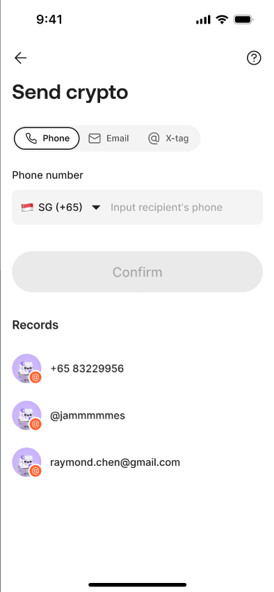
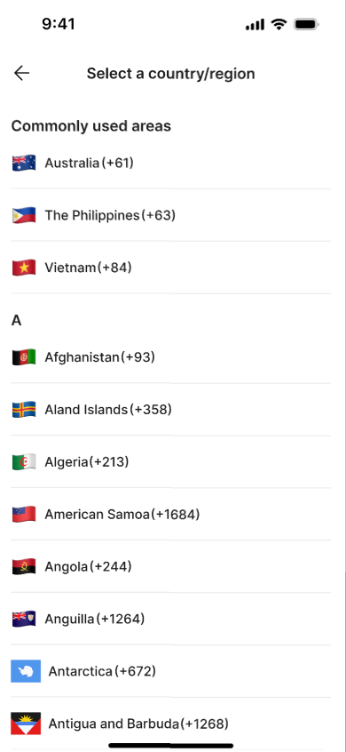
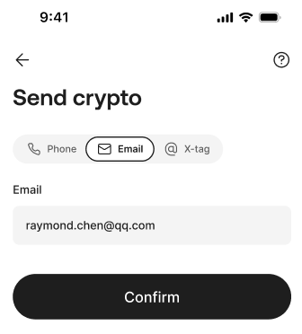
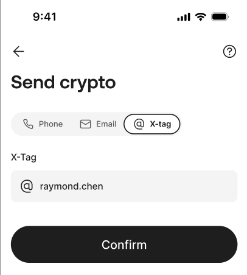

# Wallet Send Crypto 钱包转账

## 1. 功能定位

Send Crypto 允许用户向他人发送稳定币，支持通过手机号、Email、AIX Tag 等方式向指定收款人发送同一币种稳定币，例如 USDT、USDC 等。

## 2. Source alignment status

本文件用于收口原 `wallet/deposit.md` 的 SOURCE_GAP。规则来自 `archive/converted-prd/wallet/deposit-send-swap/README.md` 的 6.1 钱包转账 Send Crypto，并同步引用 Security Face Auth 与 Transaction Details 作为支撑证据。

## 3. 页面与流程

| 页面 / 阶段 | 规则 |
|---|---|
| Send Crypto | 标题为 “Send Crypto” |
| New Recipient | 当前所选页签必填；支持 Phone、Email、AIX Tag 三种录入方式 |
| 输入互斥 | 三种输入方式互斥，只读取当前页签所选择的输入 |
| 精准搜索 | 输入 Phone / Email / X-Tag 后，精准搜索接收方 |
| 最近收款人 | 按转账时间降序展示收款人 Phone / Email / X-Tag 及头像，未设置头像时使用默认头像 |
| Confirm | 校验接收方是否 AIX 平台存量用户，以及是否转给当前转账人本人 |
| Select Crypto | 用户选择币种和金额 |
| Send to Recipient | 展示转账确认信息，点击 Send Now 后触发刷脸 Token 校验 |
| Result | 根据结果展示 Send successful / Send processing / Send failure |

## 4. 币种与余额

| 项目 | 规则 |
|---|---|
| 支持币种 | 从全量钱包余额中筛选稳定币：USDC、USDT、WUSD、FDUSD |
| 全量余额接口 | 用户进入选择币种页面时，后端调用 `[GET] /openapi/v1/wallet/balances` 获取全量币种最新钱包账户余额 |
| 单币种余额接口 | 用户选择币种后，后端调用 `/openapi/v1/wallet/balance/{currency}` 查询当前币种可用余额 |
| Available Balance | 用户选择币种后展示当前币种可用余额 |
| 余额不足 | 提示 “Insufficient balance” / “Your available balance is not enough to complete this send.” |
| 余额足够 | 跳转至转账信息确认页 Send to Recipient |

## 5. Send to Recipient 确认页

| 字段 | 规则 |
|---|---|
| Recipient amount | 接收金额 |
| Recipient crypto | 接收币种 |
| Recipient | 基于用户填写的 Phone、Email 或 X-Tag 展示 |
| Send Now | 点击后触发刷脸 Token 校验 |

## 6. 身份验证

| 项目 | 规则 |
|---|---|
| Face Token | 点击 Send Now 后触发刷脸 Token 校验 |
| Token 无效 | 应进入 Security Face Auth 能力完成验证 |
| 支撑证据 | Face Auth 锁定、有效期、失败文案等由 `security/face-authentication.md` 和 `security/global-rules.md` 维护 |

## 7. 结果页

| 结果 | 文案 / 行为 |
|---|---|
| Send successful | 状态说明：“Send successful!”；点击 “View Order Details” 跳转 Transaction Details |
| Send processing | 状态说明：“Send processing!”；状态描述：“We’re processing your transfer. This may take a few moments.”；点击 “View Order Details” 跳转 Transaction Details |
| Send failure | 状态说明：“Send failure!” |

## 8. 交易记录边界

Send 结果页和列表记录应进入 Transaction Details；全量交易中 Send 对应 Wallet / Crypto 交易来源，具体交易详情字段由 `transaction/detail.md` 维护。

## 9. 不得推导

1. 不得把 Send 写成支持非稳定币，源 PRD 当前只明确稳定币范围。
2. 不得把 Phone / Email / X-Tag 以外的收款方式写成 confirmed fact。
3. 不得自行扩展 Send 的手续费、到账时间或失败原因；源 PRD 未完整沉淀的内容需回查原文。
4. 不得把 Face Auth 规则复制到 Send；只引用 Security 作为支撑证据。

## 10. Sources

- (Ref: archive/converted-prd/wallet/deposit-send-swap/README.md / 6.1 钱包转账 Send Crypto)
- (Ref: archive/converted-prd/security/identity-verification/README.md / Face Auth)
- (Ref: archive/converted-prd/app/transaction-history/README.md / Transaction Details)

## Page Visuals 页面图索引

> 本节绑定 converted-prd 中与本文件页面规则相关的页面截图 / 页面组图片，方便查看规则时同步查看页面长什么样。图片仍引用 `archive/converted-prd` 原始资产，避免重复复制。

### Send Crypto

_Source: archive/converted-prd/wallet/deposit-send-swap/README.md:321_

_Source: archive/converted-prd/wallet/deposit-send-swap/README.md:322_

_Source: archive/converted-prd/wallet/deposit-send-swap/README.md:323_

_Source: archive/converted-prd/wallet/deposit-send-swap/README.md:324_
