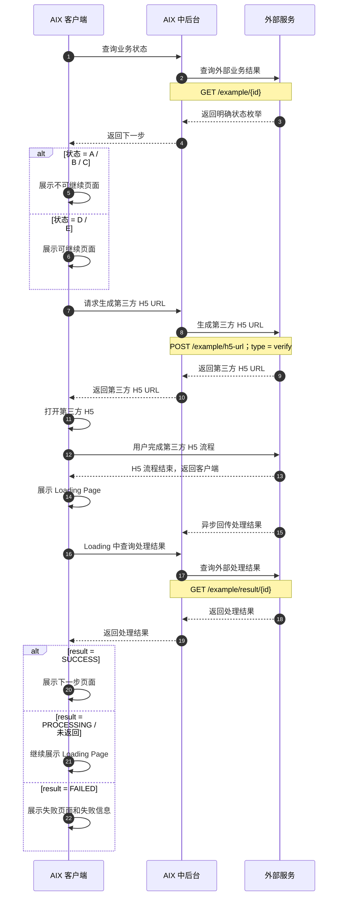
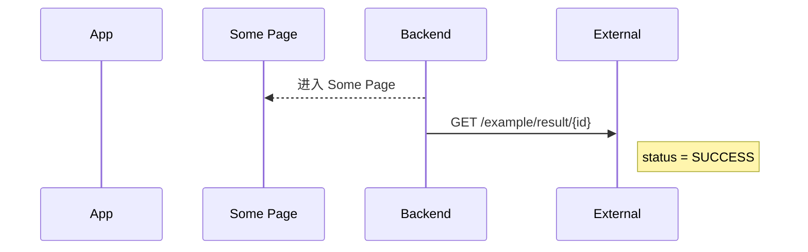
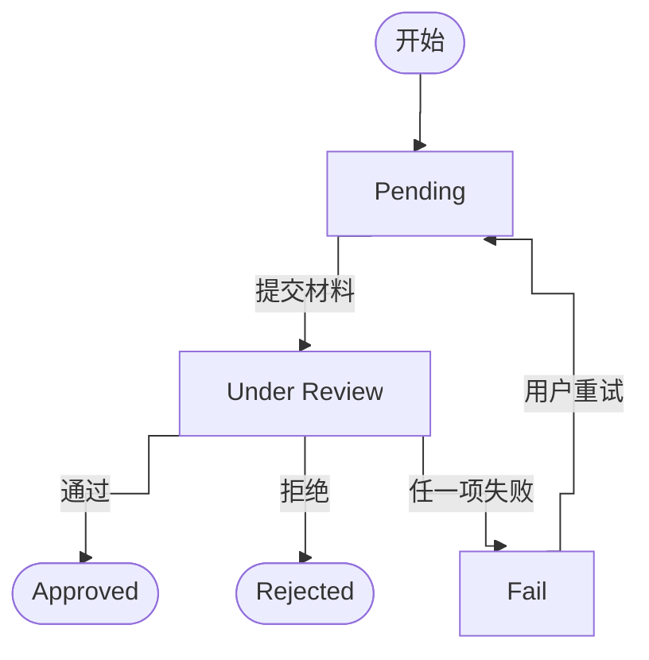
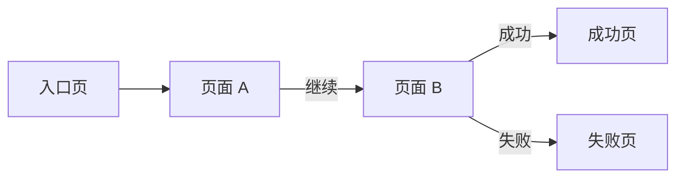

# Standard PRD Template 标准 PRD 模板

> 适用对象：前端、后端、测试、设计、产品。  
> 写作原则：页面能看出来的不写；公共能力已有的不重复写；不能开发和测试的不写；每条规则都要能判断对错；章节按需保留，不为模板完整而补废话；页面级别保持同层，页面内复杂弹窗 / 拦截 / 组件按需拆下级章节；事实未明确的内容显式标"待 X 确认"，不得猜测写入。  
> 使用方式：先在 Canvas 中生成 PRD 草稿并完成用户修改与落地评审；用户确认后，再写入 Git。  
> 流程规则：PRD 写作必须遵守 `workflow/prd-workflow.md` 中定义的多 Agent 闸门式流程。

---

## Workflow v2.0 对齐规则

所有 PRD 必须遵守以下规则：

- 新 PRD / 迭代 PRD 必须先生成 Canvas Brief。
- Brief 未经用户确认，不得生成正式 PRD 文件。
- 用户未明确确认"更新到 Git"，不得修改仓库。
- PRD 写完后必须经过 Fact Review、Template Review、UX Review、Tech Review。
- Fact Review 不通过，不得提交 Git。
- Template Review 不通过，不得标记完成。
- UX Review 存在 P0 / P1 问题，必须修正后再进入最终确认。
- 调研资料不得直接混入 Brief 主体。
- 默认不新增一级目录。
- 模板或流程修改必须先询问用户确认。

---

## PRD 文件建议 front matter

```yaml
---
type: prd
feature: <feature>
module: <module>
status: draft
version: "0.1"
brief_path:
brief_status:
source_files:
  - knowledge-base/...
research_refs: []
external_sources: []
user_confirmation_refs: []
open_gap_refs: []
depends_on:
  - <module>/_index
  - common/notification
  - integrations/<external>
review_status:
  fact_review:
  template_review:
  ux_review:
  tech_review:
last_updated: YYYY-MM-DD
owner: TBD
readers: [product, ui, dev, qa, business, ai]
---
```

说明：

- `brief_path` 可以为空；Brief 不强制写入 Git。
- `research_refs` 用于记录调研资料，不应把原始调研过程直接塞入 PRD 正文。
- 新 PRD 优先使用 `source_files` 记录仓库内来源；旧字段 `source_doc` 仅作兼容。
- 外部网页、竞品、安全参考放入 `external_sources` 或正文来源引用，不要伪装成仓库路径。
- 关键用户确认可以放入 `user_confirmation_refs` 或正文来源引用。
- `depends_on` 列出本 PRD 依赖的其他 knowledge-base 模块或公共能力，便于跨模块影响追溯。
- `review_status` 用于记录当前评审状态，可按需保留。

---

## 1. 文档信息

| 项目 | 内容 |
|---|---|
| 功能名称 |  |
| 所属模块 |  |
| PRD 版本 | v1.0 |
| 状态 | Draft / Review / Approved / Deprecated |
| Owner |  |
| 创建时间 |  |
| 更新时间 |  |
| 来源文档 | 例如：原 PRD 章节、外部接口文档、用户确认结论；多个用 `；` 分隔 |
| 适用读者 | Product / UI / Dev / QA / Business / AI |
| 文档定位 | 说明本文是事实源、模板沉淀，还是临时迭代；如"既作为 X 运行时事实源，也按标准 PRD 模板沉淀产品范围、流程、页面、接口、异常、待确认事项"。 |
| 关联 Brief | 无 / `requirements/YYYY-MM/<module>/_brief-<feature>.md` |
| 关联原型 | 无 / `requirements/YYYY-MM/<module>/assets/<feature>/` |
| 调研资料 | 无 / `references/research-notes/...` / `_research-<feature>.md` |
| 依赖公共能力 | 例如：Email OTP Verification、Login Passcode、Notification；没有则写"无" |

---

## 2. 需求背景、目标与范围

本章节用于让读者快速理解：为什么要做这个需求、这个需求的核心目标是什么、涉及哪些系统和模块。

要求：
- 本章节只写背景、目标和范围，不展开详细流程、页面规则、接口规则、异常规则和测试场景。
- 表达必须精简，假设读者没有耐心阅读长篇内容。
- 能一句话说明的，不写两句话；能两句话说明的，不写三句话。
- 不写空话、套话、泛泛价值，例如"提升用户体验""提升效率""统一事实源"等，除非能明确说明对应业务含义。
- 不写与正文事实不一致的系统、模块或能力；正文没有涉及的内容，不应在本章节强行加入。
- 如果现有模板中已有"本期做什么 / 本期不做什么 / 关键产品规则"，应避免与本章节重复；本章节只负责背景、目标和范围，具体功能结论放到后续功能结论或主流程章节。

### 2.1 背景

写清楚为什么需要做这个功能。

要求：
- 用最短表达说明需求产生的业务背景。
- 不写流程细节。
- 不写系统协作细节。
- 不写页面、接口、状态、异常等后文才展开的内容。
- 重点回答：为什么现在需要这个能力？

推荐写法：

> 为了支持【业务能力 / 产品能力】，需要建设【功能 / 机制】，以解决【核心业务前置条件 / 风险 / 准入要求】。

示例：

> AIX 钱包要接入发卡、法币出入金、支付网络和托管账户等金融能力，必须通过 KYC 确认用户身份、居住地和地址证明符合准入要求。

### 2.2 目标

写清楚这个需求的核心目标。

要求：
- 目标要站在业务和产品层，不写执行细节。
- 不拆成过细的问题清单。
- 不写过多泛化价值。
- 可以说明该需求为哪些后续能力提供基础。
- 通常 1～2 句话即可。

推荐写法：

> 【功能】的核心目标是帮助【产品 / 业务】获得【关键业务能力 / 外部接入许可 / 合规准入 / 风控能力】，并规避【核心风险】。  
> 本需求用于建立【机制 / 流程 / 能力】，为【后续业务模块】提供统一基础。

示例：

> KYC 的核心目标是帮助 AIX 获得传统金融体系的接入许可，例如发卡机构、法币出入金通道、托管账户和支付网络等，并规避身份不明、地区限制、协议缺失、地址证明不完整等系统性合规风险。  
> 本需求用于建立 AIX 钱包开户的 KYC 准入机制，为 Wallet、Deposit、Card、法币出入金等后续金融能力提供统一的合规准入基础。

### 2.3 涉及系统与模块范围

写清楚本需求涉及哪些系统、哪些模块。

要求：
- 必须分层级写，不要把系统和模块堆在一起。
- 先写涉及系统，再写涉及模块。
- 涉及系统按"谁负责什么"说明。
- 涉及模块按用户使用链路或业务主链路拆分。
- 只说明范围边界，不写详细规则。
- 表格建议保持两列，避免信息过碎。
- 如果"主要职责"较长，采用"主句 + 子段落"的方式：
  - 主句：说明主要做什么。
  - 子段落：用"主要包括：xxx、xxx、xxx。"拆分功能点。
- 不建议使用过多 bullet，避免章节显得很长。
- 正文没有展开的系统或模块，不要写入本节。

#### 2.3.1 涉及系统

用一两句话概括本需求涉及的系统协作关系。

| 系统 | 主要职责 |
|---|---|
| 【系统 A】 | 【主句：说明该系统主要做什么。】<br><br>主要包括：【功能点 1】、【功能点 2】、【功能点 3】。 |
| 【系统 B】 | 【主句：说明该系统主要做什么。】<br><br>主要包括：【功能点 1】、【功能点 2】、【功能点 3】。 |
| 【系统 C】 | 【主句：说明该系统主要做什么。】<br><br>主要包括：【功能点 1】、【功能点 2】、【功能点 3】。 |

#### 2.3.2 按用户链路拆分的模块

模块应按用户完成该需求的顺序拆分，用来说明本文覆盖哪些产品能力。

| 模块 | 主要说明 |
|---|---|
| 【模块 1】 | 【主句：说明该模块主要做什么。】<br><br>主要包括：【功能点 1】、【功能点 2】、【功能点 3】。 |
| 【模块 2】 | 【主句：说明该模块主要做什么。】<br><br>主要包括：【功能点 1】、【功能点 2】、【功能点 3】。 |
| 【模块 3】 | 【主句：说明该模块主要做什么。】<br><br>主要包括：【功能点 1】、【功能点 2】、【功能点 3】。 |

---

## 3. 业务流程

> 本章只描述跨系统流程、状态流转与关键业务规则；页面展示、按钮、弹窗、toast、跳转等页面级交互统一见第 4 章。  
> 章节起首建议用一句话声明本章的内容边界，避免与第 4 章页面规则重复。  
> 如本需求没有复杂业务链路，本章可以简化，但必须能让开发、测试和产品理解用户从入口到业务结果的主链路。

### 3.1 业务时序图

> 推荐使用 Mermaid `sequenceDiagram`。  
> 本图关注业务流程、责任边界、跨系统协作和业务结果，不是技术时序图。  
> 参与方按业务责任边界设置，例如客户端、中后台、外部服务；页面只作为客户端展示动作表达，不作为默认参与方。  
> 箭头文案写业务动作；接口路径、`verifyType` 等关键参数放在紧跟动作下方的 `Note over 发起方,接收方` 中。  
> 后端不写"进入页面"，只写"返回下一步 / 返回结果"；页面展示由客户端自循环表达。  
> 第三方 H5 / 外部服务流程必须拆清楚：生成 URL、用户完成 H5、返回客户端、客户端展示 Loading、异步结果回传、Loading 查询 / 等待结果、按结果分流。  
> 原文已有明确状态值、错误码、渠道条件、接口参数、结果枚举时，必须保留，不得抽象压缩。  
> 流程图主干未展示的弹窗、waitlist、异常页、toast、页面细节，不在本图强行补充，应放到页面章节、异常章节或状态章节说明。  
> 如果事实来源是图片流程图，必须先完成节点 / 连线 / 分支识别；无法可靠识别的内容标待确认，不得猜测写入。

**写法要求**

| 规则 | 要求 |
|---|---|
| 参与方 | 按业务责任边界设置，例如客户端 / 中后台 / 外部服务；页面只作为客户端展示动作表达。 |
| 箭头文案 | 写业务动作，例如"查询业务状态""请求生成 H5 URL""返回下一步"。 |
| 接口信息 | 不放在主箭头上；放在紧跟箭头后的 `Note over 发起方,接收方` 中。 |
| 页面展示 | 后端只返回结果或下一步；客户端用 `APP->>APP` 表达展示页面。 |
| 状态枚举 | 原文有什么枚举就保留什么枚举，不得改成"可继续 / 不可继续"等抽象词后丢失事实。 |
| 第三方 H5 | 必须拆出"生成 URL → 进入 H5 → 完成 H5 → 返回客户端 → Loading → 异步回传 / 查询 → 按结果分流"。 |
| 未展示细节 | 流程图主干没画的弹窗、拦截、toast、错误页，不强行放入时序图。 |

**推荐示例**



**不推荐写法**



问题：页面被当成参与方；后端"进入页面"；接口路径抢占主箭头；Note 放右侧，容易被误解成另一条动作。

### 3.2 关键校验与失败处理

只写本功能新增或有差异的校验。公共能力失败只引用公共规则。没有新增校验时，本节可删除。

校验颗粒度建议覆盖：

- 空值 / 必填 / 必选项缺失。
- 格式（邮箱、手机号、数字、文件类型）。
- 长度上下限（含字符数和字节数）。
- 数值范围（金额、文件大小、数量）。
- 业务前提（黑白名单、状态、权限、有效期）。
- 服务异常（网络异常、后端异常、超时）。

| 场景 | 处理规则 | 用户提示 / 结果 | 来源 |
|---|---|---|---|
|  |  |  |  |

### 3.3 状态机 / 状态流（复杂流程必须保留）

> 当需求包含多步骤验证、支付 / 资金、安全项变更、身份认证、审核、异步处理、跨端继续、可重试失败、并发占用或最终数据变更时，本节必须保留。  
> 状态机必须覆盖成功、失败、取消、返回、超时、重试、更新失败、公共能力成功但最终业务失败等分支。  
> 页面关系图不能替代状态机；页面图只说明页面跳转，状态机说明业务状态和数据结果。

**状态图**

可选用 Mermaid `stateDiagram-v2`（适合纯状态流转）或 `flowchart`（适合带外部系统驱动的业务状态）。任选其一即可，不需要画两遍。



**状态定义表**

> 必备列：状态、进入条件 / 触发、退出条件 / 后续、用户表现 / 数据结果。  
> 可选列：**外部系统来源**——状态由外部系统驱动（如 `clientStatus`、webhook、`verifyStatus`）时加上；纯内部流转去掉这一列即可。  
> 列名可按业务措辞调整，不强制照抄。

| 状态 | 外部系统来源（如有） | 进入条件 / 触发 | 退出条件 / 后续 | 用户表现 / 数据结果 |
|---|---|---|---|---|
| `Pending` | - | 未完成或中断后可继续 | 提交材料后进入 Under review | 进入对应节点 |
| `Under review` | `clientStatus = PENDING_X` | 已提交，等待审核 | 通过 / 拒绝 / 任一失败 | 等待结果，不可重复提交 |
| `Approved` | `clientStatus = ACTIVATED` | 审核通过 | - | 流程完成 |
| `Rejected` | `clientStatus = REJECTED` | 审核拒绝 | - | 流程终止 |
| `Failed` | `verifyStatus = VERIFY_FAILURE` | 任一验证项失败 | 用户重试 → Pending | 展示原因，可重试 |

**必须说明的状态规则**

- 公共能力成功后，最终业务变更失败时如何处理。
- 验证成功态、处理中态、失败态的有效期和重试条件。
- 用户返回、关闭页面、重新进入、跨设备继续时状态是否保留。
- 并发提交、重复点击、目标资源被占用时的结果。
- 成功前不得产生半更新状态；成功后必须明确数据、会话、缓存、通知、日志影响。

---

## 4. 页面与交互说明

> 页面相关需求保留本章；纯后端、配置、数据类需求可删除本章。

### 4.0 颗粒度与写法规则（通用）

**章节组织**

- 页面章节按"**同层页面同层表达**"组织，不为单个页面再建"主页面"子章节。
- 页面内能一两句话说明的内容，写在当前页面说明中；只有复杂弹窗 / 拦截 / 组件 / 状态才拆下级章节。
- 页面拥有多个状态（Loading / 不可用 / 异常）可放在同一节内，按"**状态分块**"分别写，不强行拆下级章节。

**写作粒度**

- 不复述截图可直接看出的静态信息（纯文案、静态布局、装饰元素）。
- 每条规则都应可被开发实现、可被测试验证，避免抽象描述。
- 页面说明优先写四类信息：进入条件、默认展示、用户操作、异常 / 边界。

**硬规则必须写明数值**

写到以下任何一项时，必须把数值、单位和口径写清，不允许只写"较大""一段时间""多次"等模糊词：

- 文件大小、文件类型（如 16MB；JPG / JPEG / PNG / PDF）。
- Token / URL 有效期（如 5 分钟）。
- 失败计数与锁定（如 24 小时内失败 5 次锁 20 分钟、10 次锁 24 小时、接口层 20 次锁 20 分钟）。
- 输入长度上下限（如 Email 最长 103 字符）。
- 超时阈值（如 Loading 30 秒）。
- 接口频控、重试次数、并发上限。

**事实边界声明**

- 源文档未明确的内容必须显式写"源文档未明确，需以最新 UI / 产品 / 后端确认为准"，不得猜测写入。
- 历史变更（旧版有但已废弃 / 删除线 / deprecated）不沉淀为 confirmed fact。
- 调研、竞品、推测内容不写入正文。

**章节末尾标记**

- 每个页面级章节末尾建议加一行：`关联：<CASE-ID 区间>；Source：<原文档章节>。`
- 用例 ID 形如 `KYC-LOADING-001 ~ KYC-LOADING-010`，方便测试回溯。

**跨章节引用**

- 同一 PRD 内的引用使用锚点：`<a href="#46-identity-verify-page">4.6 Identity Verify Page</a>`。
- 跨文件的引用使用相对路径：`knowledge-base/common/notification.md`。
- 错误码引用单独写"错误码细则见 5.x"，不在正文展开错误码全表。

### 4.1 页面关系总览图（如有）

> 本图只表达页面间跳转关系，不放接口细节和内部实现。



### 4.2 页面：新增 / 改造页面名称

一句话说明本页定位：在主链路中的作用、前置来源、后续去向。

> 多状态合一页：同一页面有 Loading / 不可用 / 异常等多个状态时，在右侧 td 内按"**状态名 + 子说明**"分块；不强行拆下级章节。  
> 多张图：同一页面有多张参考图（不同状态 / 不同终态）时，左侧 td 内用 `<br><br>` 纵向叠加多张 ``。

<table>
  <tr>
    <th width="48%">页面</th>
    <th width="52%">说明</th>
  </tr>
  <tr>
    <td valign="top">
      
      <br><br>
      
    </td>
    <td valign="top">
      <p><strong>状态 / 区域 A</strong></p>
      <ul>
        <li><strong>进入前提</strong>：从哪里来，何种状态进入。</li>
        <li><strong>默认展示</strong>：默认值、默认态、来源。</li>
        <li><strong>用户操作</strong>：点击 / 输入 / 选择后的结果和跳转。</li>
        <li><strong>规则</strong>：需要判断对错的业务规则。</li>
      </ul>
      <p><strong>状态 / 区域 B</strong></p>
      <ul>
        <li>写清触发条件、处理结果、后续节点。</li>
      </ul>
      <p><strong>异常 / 边界</strong></p>
      <ul>
        <li>网络异常、服务异常、超时的去向。</li>
      </ul>
    </td>
  </tr>
</table>

关联：`CASE-ID-001 ~ CASE-ID-00X`；Source：xxx。

### 4.3 页面内下级章节（按需）

页面内某部分写在当前页面会过长或不易读时，拆下级章节。常见类型：弹窗 / 拦截 / H5 子页 / 错误页 / Toast 集合。

#### 4.3.1 弹窗：弹窗名称

<table>
  <tr>
    <th width="48%">页面</th>
    <th width="52%">说明</th>
  </tr>
  <tr>
    <td valign="top">
      
    </td>
    <td valign="top">
      <p><strong>触发方式</strong></p>
      <ul>
        <li>在页面 A 执行某操作后触发。</li>
      </ul>
      <p><strong>操作结果</strong></p>
      <ul>
        <li>确认：xxx。</li>
        <li>取消 / 关闭：xxx。</li>
      </ul>
      <p><strong>异常 / 边界</strong></p>
      <ul>
        <li>无法完成时的提示和去向。</li>
      </ul>
    </td>
  </tr>
</table>

关联：`CASE-ID-XXX ~ CASE-ID-XXY`；Source：xxx。

#### 4.3.2 拦截：拦截名称

> 拦截分两类：硬性拦截（不可继续，必须返回 / 切换路径）、软性提示（可关闭后继续）。两类都需要写清触发条件和后续路径。

<table>
  <tr>
    <th width="48%">页面</th>
    <th width="52%">说明</th>
  </tr>
  <tr>
    <td valign="top">
      
    </td>
    <td valign="top">
      <p><strong>触发方式</strong></p>
      <ul>
        <li>命中条件后触发拦截。</li>
      </ul>
      <p><strong>处理结果</strong></p>
      <ul>
        <li>硬拦截：阻断当前流程，给出唯一可选路径（如返回入口、加入 waitlist）。</li>
        <li>软提示：允许关闭后继续，但需保留提示状态。</li>
      </ul>
      <p><strong>展示边界</strong></p>
      <ul>
        <li>历史版本中的形态变化（如"由弹窗改为页面拦截"）需声明。</li>
      </ul>
    </td>
  </tr>
</table>

关联：`CASE-ID-XXX ~ CASE-ID-XXY`；Source：xxx。

#### 4.3.3 H5：第三方 H5 子页（如有）

> 当本页面调起第三方 H5（如证件扫描、活体识别、支付）时，必须为 H5 单独建下级章节，写清进入前提、用户操作、处理结果、URL 失效与异常处理。

<table>
  <tr>
    <th width="48%">页面</th>
    <th width="52%">说明</th>
  </tr>
  <tr>
    <td valign="top">
      
    </td>
    <td valign="top">
      <p><strong>H5 状态</strong></p>
      <ul>
        <li><strong>进入前提</strong>：上一页成功获取 H5 URL。</li>
        <li><strong>用户操作</strong>：在外部 H5 完成操作（如扫描、采集、支付）。</li>
        <li><strong>处理结果</strong>：
          <ul>
            <li>用户完成：返回 App，进入下一页。</li>
            <li>用户取消 / 返回：返回上一页或源文档约定页。</li>
            <li>处理成功 / 失败：按结果分流；错误码映射见 5.3。</li>
            <li>URL 过期 / 不可用：源文档未明确的，标"需以后端接口约定为准"。</li>
            <li>同一签名 / sessionId 重试上限（如 3 次）后需重新生成。</li>
          </ul>
        </li>
        <li><strong>异常</strong>：网络 / 服务异常按 App 统一错误处理；不写死错误页或 toast。</li>
      </ul>
    </td>
  </tr>
</table>

关联：`<对应接口名(<TYPE>)>`、`requestId`、`url`、`expireTime`；Source：xxx。

#### 4.3.4 错误 / 超时 / 空态页（如有）

> Loading 超时、加载失败、网络异常、空数据等独立页面，建议作为同级页面（4.x）展开；如果是某主页面专属，则作为下级章节。  
> 必须写清：进入前提、用户操作（Retry / Leave / 关闭）、重试后的结果分流（再次失败、查询返回失败、查询返回异常）。

### 4.4 复用页面（无改造）

> 复用公共页面时，只写本需求相关流转，不重写公共页面规则。

<table>
  <tr>
    <th width="48%">页面</th>
    <th width="52%">说明</th>
  </tr>
  <tr>
    <td valign="top">
      
    </td>
    <td valign="top">
      <p><strong>复用说明</strong></p>
      <ul>
        <li>本需求复用该页面，不改造页面结构和交互规则。</li>
        <li>仅定义本需求下的进入条件、退出条件和结果回传。</li>
      </ul>
      <p><strong>本需求下的流转</strong></p>
      <ul>
        <li>从哪些页面 / 拦截进入本页。</li>
        <li>提交成功 / 失败 / 关闭后的去向。</li>
      </ul>
    </td>
  </tr>
</table>

关联：`CASE-ID-XXX ~ CASE-ID-XXY`；Source：xxx。

### 4.5 成功页（结果页）

<table>
  <tr>
    <th width="48%">页面</th>
    <th width="52%">说明</th>
  </tr>
  <tr>
    <td valign="top">
      
    </td>
    <td valign="top">
      <p><strong>展示内容</strong></p>
      <ul>
        <li>仅说明本流程结果，不外推为其他能力状态。</li>
      </ul>
      <p><strong>用户操作</strong></p>
      <ul>
        <li>主按钮后续流转、关闭后的返回路径。</li>
      </ul>
      <p><strong>状态边界</strong></p>
      <ul>
        <li>本成功页代表的事实（如"资料已提交"）和不代表的事实（如"已审核通过""可立即使用对应能力"）必须分清。</li>
        <li>后续状态变化通过通知或入口状态感知；通知规则见第 6 章。</li>
      </ul>
    </td>
  </tr>
</table>

关联：`CASE-ID-XXX ~ CASE-ID-XXY`；Source：xxx。

---

## 5. 字段、接口与数据

> 仅当本需求涉及外部系统、第三方接口、跨模块数据同步、对外字段、新增数据口径、错误码或会影响产品验收的数据变更时保留。  
> 纯内部字段、内部接口、技术实现细节不写；由技术方案承接。  
> 写作原则：**字段、接口、数据、日志埋点、协议留痕** 统一在 5.1 一张大表中分类列出；接口错误码按接口拆 5.2；错误码 → 前端文案映射按业务模块拆 5.3。

### 5.1 字段 / 接口 / 数据总表

> 类型枚举：`字段`、`接口`、`数据`、`日志 / 埋点`、`协议留痕`。  
> 来源指事实出处（如外部接口、用户输入、外部回传、协议勾选）。  
> 异常处理写"失败时的处理动作"或引用"见 5.2 / 5.3"。  
> 已沉淀在公共能力的字段（如 Token、Session）只引用，不重写规则。

| 类型 | 名称 | 所属系统 | 来源 | 用途 | 规则 / 输入输出 | 异常处理 |
|---|---|---|---|---|---|---|
| 字段 | `externalId` | 本系统 / 外部 | 本系统生成 / 外部接口 | 关联用户结果 | 用于 URL 生成、结果查询、文件上传 | 格式错误返回外部 `50004` |
| 字段 | `clientStatus` | 外部 | 查询结果 / webhook | 表示外部客户状态 | 枚举见 3.3 状态机 | 与本系统状态映射见 3.3 |
| 字段 | `verifyStatus` | 外部 | 查询结果 / webhook | 表示验证项状态 | 使用通用状态枚举 | 失败时看对应 `verifyCode` |
| 接口 | `POST /openapi/v1/example/get-url` | 外部 | 接口文档 | 获取 H5 URL | 入参：externalId、type、country；出参：url、expireTime | 错误码见 5.2.1 |
| 接口 | `GET /openapi/v1/example/result/{id}` | 外部 | 接口文档 | 查询结果 | 出参：clientStatus、verifyStatus、code | 查询失败按系统异常处理 |
| 接口 | `EXAMPLE_RESULT` webhook | 外部 | 接口文档 | 异步同步结果 | 出参：externalId、status、code | webhook 延迟时 query 兜底 |
| 接口 | `POST /openapi/v1/file/upload-file` | 外部 | 接口文档 | 文件上传 | 入参：token、fileContent、country；token 5 分钟有效，只能用一次 | 错误码见 5.2.2 |
| 数据 | 协议同意时间 | 本系统 | 用户勾选 | 合规留痕 | ToS / Privacy / Declaration 均需保存同意并提交时间 | 保存失败应阻止继续 |
| 数据 | 协议快照 | 本系统 | 提交成功 | 合规留痕 | 生成不可更改快照并与用户账户绑定 | 保存失败待后端确认 |
| 数据 | 设备指纹 ID | 本系统 | App / 设备 | 落库和数仓分析 | 与 userId、邮箱、来源、提交时间一并记录 | 获取失败策略待确认 |
| 协议留痕 | 协议内容 | 本系统 | 用户阅读并同意 | 合规留痕 | 保存协议内容、版本号和同意时间 | 保存失败应阻止继续 |
| 日志 / 埋点 | 关键页面曝光与错误 | 本系统 | 待确认 | QA / 运营 / 风控分析 | 待确认是否需要埋点 | GAP 待补 |

### 5.2 接口错误码

> 多个接口各自有错误码时，按"接口名"拆子节（如 `5.2.1 get-verification-url`、`5.2.2 upload-file`）。  
> 每条错误码必须给出处理建议（前端动作、后端动作、提示文案归属）。  
> 已经在 5.3 给出文案的，本节只引用，不重复文案。

#### 5.2.1 `<接口名>` 错误码

| errCode | 含义 | 处理建议 |
|---|---|---|
| `00010` | Invalid parameters | 参数错误，阻止继续 |
| `00025` | Services unavailable in country or region | 国家 / 地区不可用，进入 waitlist 或提示 |
| `01005` | Email already in use | Toast：`The email address is in use.` |
| `01009` | Mobile number already exists | Toast：`Mobile number already exists.` |
| `50004` | externalId format invalid | 参数错误 |
| `50013` | Reverse solicitation not declared | 阻止继续，要求补声明 |
| `59999` | Internal error | 系统错误 |

#### 5.2.2 `<接口名>` 错误码

| errCode | 含义 | 处理建议 |
|---|---|---|
|  |  |  |

### 5.3 错误码与前端文案映射

> 当不同验证项 / 子模块（如 Passport、Face、POA、Payment）有各自的 code → 文案映射时，按业务模块拆子节。  
> 文案以 UI / Localization 已签确版本为准；本表只承载映射关系，不承担多语言副本。  
> 同一前端页面如果有"原因优先级"（如 Passport 与 Face 同时失败时优先展示 Passport），需在对应页面章节明确，并在本节末尾备注。

#### 5.3.1 `<子模块 A>`

| code | 前端提示文案 |
|---|---|
| `EXAMPLE_FAILED_A` | 文案 A |
| `LOW_QUALITY` | 文案 B |
| `DEFAULT` | 兜底文案 |

#### 5.3.2 `<子模块 B>`

| code | 前端提示文案 |
|---|---|
| `EXAMPLE_FAILED_B` | 文案 B |
| `DEFAULT` | 兜底文案 |

**优先级备注（如有）**

- 当多个失败原因同时存在时的展示优先级（如 Passport > Face > POA），在此声明。
- 源文档未明确优先级的部分，标"需产品 / 后端确认"。

---

## 6. 通知（如有）

> 本章按需保留。没有新增通知规则时可删除。  
> 已有公共通知能力只引用，不重复定义。  
> 通知章节只承载触发事件、对象、模板引用、跳转目标、失败补发；多语言文案归 Localization。

| 触发事件 | 渠道 | 对象 | 文案 / 模板 | 跳转目标 | 失败 / 补发规则 |
|---|---|---|---|---|---|
|  |  |  |  |  |  |

边界声明：

- 通知发送成功 ≠ 通知触达；触达由 `common/notification` 统一边界。
- 业务结果通知不等同于业务能力立即可用；后续可用性以业务事件为准。

---

## 7. 跨模块边界 / 历史规则确认（如有）

> 当本 PRD 与其他模块（如 Home、Card、Wallet、Notification）有状态映射、入口联动或前置依赖时保留本章。  
> 本章承载三类内容：历史规则的"确认结论"、跨模块状态映射、文档边界声明。  
> 没有跨模块影响时整章删除。

### 7.1 历史规则确认（如有）

> 用于沉淀历史 PRD / changelog 中分散但已确认的规则，按"规则 / 结论 / 来源"三列固化。  
> 本节不放未确认事项；未确认事项进第 8 章。

| 规则 | 结论 | 来源 |
|---|---|---|
| <规则点 1> | <已确认的结论> | <原文档章节 / changelog> |
| <规则点 2> | <已确认的结论> | <原文档章节 / changelog> |

### 7.2 跨模块状态映射（如有）

> 当本 PRD 的业务状态会驱动其他模块的入口或展示（如 Home 钱包面板、申卡入口、Wallet 资产页）时使用。

| 本系统状态 | 下游模块 | 下游展示 | 下游行为 | 来源 |
|---|---|---|---|---|
| <状态 A> | <模块名> | <展示形态> | <可点击 / 不可点击 / 跳转目标> | <原文档章节> |
| <状态 B> | <模块名> | <展示形态> | <可点击 / 不可点击 / 跳转目标> | <原文档章节> |

### 7.3 文档边界声明（如有）

- 本 PRD 只维护 <X> 事实源；与本 PRD 相关但归属其他模块的能力（如卡申请、风控、通知模板）不在本文展开。
- 历史 PRD 中已删除 / 标删除线 / 标 deprecated 的内容不沉淀为 confirmed fact。
- 调研、竞品、推测内容不写入正文；放入 `research_refs` / `external_sources`。

---

## 8. 待确认项

只保留真正影响产品范围、开发、测试、接口、风控、上线验收的问题。  
不会影响本期开发的问题不放这里。  
技术实现细节、内部幂等方案、内部接口设计细节，不放 PRD 待确认项，由技术方案承接。

| 编号 | 问题 | 影响范围 | 当前建议 / 默认处理 | 是否阻塞 | 负责人 |
|---|---|---|---|---|---|
| TBD-001 |  |  |  | 是 / 否 |  |

---

## 9. 来源引用

- Brief：无 / `requirements/YYYY-MM/<module>/_brief-<feature>.md`
- 原型：
- 知识库引用：
- 用户确认：
- 调研资料：
- 竞品 / 安全参考：
- 外部接口文档：
- 跨模块依赖：列出 `depends_on` 中各项的事实出处。

---

## 附录：写作与落地评审检查清单

提交 PRD 前逐项检查：

- [ ] 文档信息完整，PRD 状态值合法，包含来源文档、适用读者、文档定位三行。
- [ ] front matter 中的 `depends_on` 已列出本 PRD 依赖的其他模块。
- [ ] 章节起首有边界声明（"本章只描述 X，Y 见第 Z 章"），避免与其他章节重复。
- [ ] 本期做什么、不做什么清楚，没有混入另一个独立功能。
- [ ] 主流程能从入口跑到业务结果，失败、取消、返回、重试有合理结果。
- [ ] 复杂流程已保留状态机 / 状态流，覆盖公共能力成功但最终业务失败、更新失败、超时、重试、返回、并发等分支；状态由外部系统驱动时，状态定义表中已给出外部来源列。
- [ ] 页面关系图使用 Mermaid `flowchart`（如适用）。
- [ ] 业务时序图使用 Mermaid `sequenceDiagram`（如适用），且参与方按业务责任边界设置；箭头写业务动作；接口放箭头下方 `Note over 发起方,接收方`；后端只返回结果或下一步；页面由客户端展示；第三方 H5 拆出返回客户端、Loading、异步回传 / 查询和结果分流；状态枚举不压缩。
- [ ] 每个新增 / 改造页面有低保真原型或明确页面结构。
- [ ] 用户体验顺畅：用户知道当前步骤、操作反馈、失败下一步、成功结果和后续影响。
- [ ] 页面能看出来的内容，没有重复写成规则。
- [ ] 多状态合一页用"状态分块"表达，多张图用 `<br><br>` 纵向叠加。
- [ ] 第三方 H5 已拆下级章节（4.3.3），并写清进入前提、用户操作、处理结果、URL 失效。
- [ ] 每个页面级章节末尾有"关联 + Source"标记。
- [ ] 跨章节引用使用锚点；跨文件引用使用相对路径。
- [ ] 硬规则（文件大小 / 类型 / Token 有效期 / 锁定计数 / 输入长度 / 超时阈值）写明数值、单位、口径。
- [ ] 源文档未明确的内容已显式标"需以最新 UI / 产品 / 后端确认为准"，没有猜测写入。
- [ ] 公共能力已有规则只引用，不重复定义。
- [ ] 每条规则都能被开发实现、被测试验证。
- [ ] 输入页已写校验规则（空值 / 格式 / 长度 / 范围 / 业务前提 / 服务异常分级），错误结果和成功流转。
- [ ] 成功页已写数据变化、会话刷新、返回后展示，并明确"代表什么"和"不代表什么"。
- [ ] 第 5 章字段 / 接口 / 数据总表覆盖字段、接口、数据、日志埋点、协议留痕；接口错误码按接口拆；错误码 → 前端文案映射按业务模块拆。
- [ ] 通知章节只保留本需求新增或差异内容。
- [ ] 跨模块边界章节覆盖历史规则确认、跨模块状态映射、文档边界声明三类内容（如适用）。
- [ ] 待确认项只保留真正阻塞或影响实现的问题，不放内部技术实现细节。
- [ ] 来源引用覆盖关键事实，调研 / 竞品 / 推测未被写成确认事实。
- [ ] PRD 已经过 Fact Review、Template Review、UX Review、Tech Review。
- [ ] 用户已明确确认允许更新 Git。
