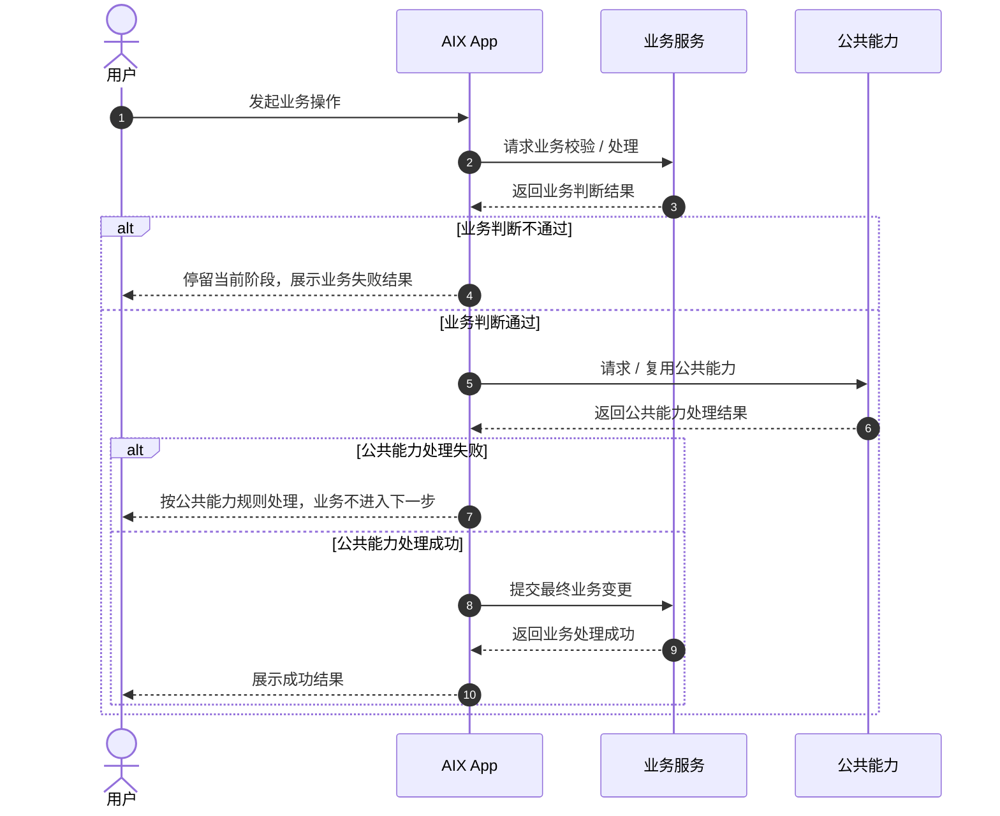

# Standard PRD Template 标准 PRD 模板

> 适用对象：前端、后端、测试、设计。  
> 写作原则：页面能看出来的不写；公共能力已有的不重复写；不能开发和测试的不写；每条规则都要能判断对错。

---

## 0. 文档信息

| 项目 | 内容 |
|---|---|
| 功能名称 |  |
| 所属模块 |  |
| PRD 版本 | v1.0 |
| 状态 | Draft / Confirmed / In Development / Done |
| Owner |  |
| 创建时间 |  |
| 更新时间 |  |
| 关联 Brief |  |
| 关联原型 |  |
| 依赖公共能力 | 例如：Email OTP Verification、Login Passcode、Notification |

---

## 1. 功能结论

### 1.1 本期做什么

用 3～5 条说明本期交付范围，只写明确要做的功能。

- 
- 
- 

### 1.2 本期不做什么

只写容易被误解、或需要明确排除的内容。不要为了凑数写无意义的“不做”。

- 
- 

### 1.3 关键产品规则

只写影响开发、测试、接口、数据、风控的规则。公共能力已有的规则不在这里复写，只在对应页面或流程中引用。

| 规则 | 说明 | 来源 |
|---|---|---|
|  |  |  |

---

## 2. 主流程

### 2.1 业务时序图

> 必须使用 Mermaid `sequenceDiagram`。  
> 本图关注业务流程、责任边界和业务结果，不是技术时序图。  
> 不写接口名、请求参数、Header、返回码、幂等 key、技术实现细节。  
> 不承载页面元素、普通文案、输入框实时校验、按钮禁用、Toast / Popup 具体文案。  
> 如果流程中调用公共能力，只表达“请求 / 复用某公共能力”和成功失败后的业务流转，不展开公共能力内部规则。

### 2.2 关键校验与失败处理

只写本功能新增或有差异的校验。公共能力失败只引用公共规则。

| 场景 | 处理规则 | 用户提示 / 结果 | 来源 |
|---|---|---|---|
|  |  |  |  |

---

## 3. 页面与交互

### 3.1 页面关系图

> 必须使用 Mermaid `flowchart`。  
> 本图只表达页面之间的跳转关系。  
> 页面节点必须是页面，不要把接口、校验、Toast、通知、外部系统放进页面关系图。

---

### 3.2 页面：页面名称

> 每个页面都必须有低保真原型。  
> 原型用于表达页面结构、关键控件、状态入口和主按钮，不要求最终 UI 视觉。

**页面目的**  
一句话说明页面用途。不要写用户教育型描述。

**展示规则**
- 只写开发和测试需要验证、且不能仅从原型看出来的规则。
- 页面上已经直观看到的布局、按钮、普通文案不写。

**交互与校验规则**

| 场景 / 元素 | 规则 | 不满足时提示 / 结果 | 后续流转 |
|---|---|---|---|
| 点击主按钮 |  |  |  |
| 输入为空 |  |  |  |
| 输入格式错误 |  |  |  |
| 后端校验失败 |  |  |  |
| 成功 |  |  |  |

---

### 3.3 复用页面：公共能力页面名称

> 每个页面都必须有低保真原型。  
> 该页面复用 `公共能力文件路径`，本文不重复定义公共页面规则。

**场景参数与流转**

| 项目 | 值 / 规则 |
|---|---|
| 业务场景 |  |
| 目标对象 / 接收对象 |  |
| 展示字段 |  |
| 成功后流转 |  |
| 失败后处理 | 按公共能力规则处理 |

**本功能差异**

无差异时写：无。  
有差异时只写差异，不复写公共规则。

- 

---

### 3.4 成功页：页面名称

> 每个页面都必须有低保真原型。

**页面目的**  
展示最终处理结果。

**展示规则**
- 只写结果字段、掩码规则、状态展示等需要测试验证的内容。

**交互与成功后处理**

| 场景 / 处理项 | 规则 | 结果 |
|---|---|---|
| 点击主按钮 |  |  |
| 数据变更 |  |  |
| 会话 / 缓存刷新 |  |  |
| 通知触发 |  |  |
| 审计日志 |  |  |

---

## 4. 字段、接口与数据

### 4.1 字段规则

| 字段 | 所属系统 | 读/写 | 用途 | 规则 | 异常处理 |
|---|---|---|---|---|---|
|  |  |  |  |  |  |

### 4.2 传参与数据处理

| 场景 | 参数 / 数据 | 必填 | 来源 | 规则 |
|---|---|---|---|---|
|  |  |  |  |  |

### 4.3 后端校验与状态变更

| 动作 | 校验规则 | 成功状态变更 | 失败处理 |
|---|---|---|---|
|  |  |  |  |

### 4.4 并发与幂等

有并发风险、重复提交风险、二次点击风险时必须写；没有则写“无特殊要求”。

| 场景 | 规则 |
|---|---|
| 重复点击 |  |
| 并发提交 |  |
| 幂等处理 |  |

---

## 5. 通知、风控、权限

### 5.1 通知

无通知时写“无”。有通知时写触发事件、对象和失败处理。模板、文案如已有公共模块，只引用。

| 触发事件 | 渠道 | 对象 | 模板 / 文案 | 失败处理 |
|---|---|---|---|---|
|  |  |  |  |  |

### 5.2 权限与账户状态

| 场景 | 规则 | 不满足时处理 |
|---|---|---|
| 登录状态 |  |  |
| 账户状态 |  |  |
| 角色 / 权限 |  |  |

### 5.3 风控规则

只写本功能新增或差异规则。已有风控能力只引用。

| 风控项 | 规则 | 影响 |
|---|---|---|
|  |  |  |

---

## 6. 验收标准 / 测试场景

验收标准必须能直接转成测试用例。避免写“页面正常展示”“用户体验良好”这类不可判定描述。

| 场景 | 前置条件 | 操作 | 预期页面表现 | 预期后端 / 数据结果 | 是否必测 |
|---|---|---|---|---|---|
| 正常流程 |  |  |  |  | 是 |
| 输入校验 |  |  |  |  | 是 |
| 后端校验 |  |  |  |  | 是 |
| 公共能力失败 |  |  |  |  | 是 |
| 并发 / 重复提交 |  |  |  |  | 视情况 |
| 成功后刷新 |  |  |  |  | 是 |

---

## 7. 待确认项

只保留真正影响开发、测试、接口、风控、上线验收的问题。  
不会影响本期开发的，不放这里。

| 编号 | 问题 | 影响范围 | 当前默认处理 | 是否阻塞 | 负责人 |
|---|---|---|---|---|---|
| TBD-001 |  |  |  | 是 / 否 |  |

---

## 8. 来源引用

- Brief：
- 原型：
- 知识库引用：
- 用户确认：
- 竞品 / 安全参考：

---

## 附录：写作检查清单

提交 PRD 前逐项检查：

- [ ] 文档标题仍为 `Standard PRD Template 标准 PRD 模板`，避免破坏已有引用。
- [ ] 页面关系图使用 Mermaid `flowchart`。
- [ ] 业务时序图使用 Mermaid `sequenceDiagram`，且关注业务流程和结果，不写技术时序。
- [ ] 每个页面都有低保真原型。
- [ ] 页面能看出来的内容，没有重复写成规则。
- [ ] 公共能力已有规则，只引用，不重复定义。
- [ ] 每条规则都能被开发实现、被测试验证。
- [ ] 输入页已写校验规则、错误结果和成功流转。
- [ ] 成功页已写数据变化、会话刷新、返回后展示。
- [ ] 异常处理只写本功能新增或差异。
- [ ] 验收标准能直接转成测试用例。
- [ ] 待确认项只保留真正阻塞或影响实现的问题。
