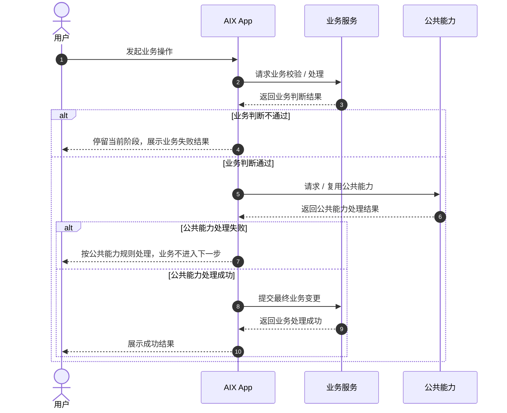
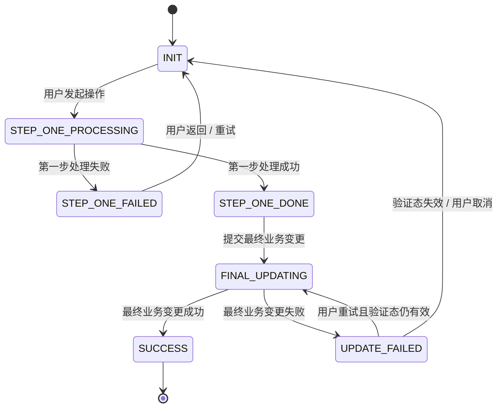

# Standard PRD Template 标准 PRD 模板

> 适用对象：前端、后端、测试、设计、产品。  
> 写作原则：页面能看出来的不写；公共能力已有的不重复写；不能开发和测试的不写；每条规则都要能判断对错；章节按需保留，不为模板完整而补废话。  
> 使用方式：先在 Canvas 中生成 PRD 草稿并完成用户修改与落地评审；用户确认后，再写入 Git。  
> 流程规则：PRD 写作必须遵守 `workflow/prd-workflow.md` 中定义的多 Agent 闸门式流程。

---

## Workflow v2.0 对齐规则

所有 PRD 必须遵守以下规则：

- 新 PRD / 迭代 PRD 必须先生成 Canvas Brief。
- Brief 未经用户确认，不得生成正式 PRD 文件。
- 用户未明确确认“更新到 Git”，不得修改仓库。
- PRD 写完后必须经过 Fact Review、Template Review、UX Review、Tech Review。
- Fact Review 不通过，不得提交 Git。
- Template Review 不通过，不得标记完成。
- UX Review 存在 P0 / P1 问题，必须修正后再进入最终确认。
- 调研资料不得直接混入 Brief 主体。
- 默认不新增一级目录。
- 模板或流程修改必须先询问用户确认。

---

## PRD 文件建议 front matter

```yaml
---
type: prd
feature: <feature>
module: <module>
status: draft
version: "0.1"
brief_path:
brief_status:
source_files:
  - knowledge-base/...
research_refs: []
external_sources: []
user_confirmation_refs: []
open_gap_refs: []
review_status:
  fact_review:
  template_review:
  ux_review:
  tech_review:
last_updated: YYYY-MM-DD
owner: TBD
readers: [product, ui, dev, qa, business, ai]
---
```

说明：

- `brief_path` 可以为空；Brief 不强制写入 Git。
- `research_refs` 用于记录调研资料，不应把原始调研过程直接塞入 PRD 正文。
- 新 PRD 优先使用 `source_files` 记录仓库内来源；旧字段 `source_doc` 仅作兼容。
- 外部网页、竞品、安全参考放入 `external_sources` 或正文来源引用，不要伪装成仓库路径。
- 关键用户确认可以放入 `user_confirmation_refs` 或正文来源引用。
- `review_status` 用于记录当前评审状态，可按需保留。

---

## 0. 文档信息

| 项目 | 内容 |
|---|---|
| 功能名称 |  |
| 所属模块 |  |
| PRD 版本 | v1.0 |
| 状态 | Draft / Review / Approved / Deprecated |
| Owner |  |
| 创建时间 |  |
| 更新时间 |  |
| 关联 Brief | 无 / `requirements/YYYY-MM/<module>/_brief-<feature>.md` |
| 关联原型 | 无 / `requirements/YYYY-MM/<module>/assets/<feature>/` |
| 调研资料 | 无 / `references/research-notes/...` / `_research-<feature>.md` |
| 依赖公共能力 | 例如：Email OTP Verification、Login Passcode、Notification；没有则写“无” |

---

## 1. 功能结论

### 1.1 本期做什么

用 3～5 条说明本期交付范围，只写明确要做的功能。

- 
- 
- 

### 1.2 本期不做什么

只写容易被误解、或需要明确排除的内容。不要为了凑数写无意义的“不做”。

- 
- 

### 1.3 关键产品规则

只写影响开发、测试、接口、数据、风控的规则。公共能力已有的规则不在这里复写，只在对应页面或流程中引用。

| 规则 | 说明 | 来源 |
|---|---|---|
|  |  |  |

---

## 2. 主流程

> 如本需求没有复杂业务链路，本章可以简化，但必须能让开发、测试和产品理解用户从入口到业务结果的主链路。

### 2.1 业务时序图

> 推荐使用 Mermaid `sequenceDiagram`。  
> 本图关注业务流程、责任边界和业务结果，不是技术时序图。  
> 不写接口名、请求参数、Header、返回码、幂等 key、技术实现细节。  
> 如果流程中调用公共能力，只表达“请求 / 复用某公共能力”和成功失败后的业务流转，不展开公共能力内部规则。



### 2.2 关键校验与失败处理

只写本功能新增或有差异的校验。公共能力失败只引用公共规则。没有新增校验时，本节可删除。

| 场景 | 处理规则 | 用户提示 / 结果 | 来源 |
|---|---|---|---|
|  |  |  |  |

### 2.3 状态机 / 状态流（复杂流程必须保留）

> 当需求包含多步骤验证、支付 / 资金、安全项变更、身份认证、审核、异步处理、跨端继续、可重试失败、并发占用或最终数据变更时，本节必须保留。  
> 状态机必须覆盖成功、失败、取消、返回、超时、重试、更新失败、公共能力成功但最终业务失败等分支。  
> 页面关系图不能替代状态机；页面图只说明页面跳转，状态机说明业务状态和数据结果。

**状态流示例**



**状态定义**

| 状态 | 进入条件 | 允许操作 | 退出条件 | 失败 / 超时 / 返回处理 | 数据结果 |
|---|---|---|---|---|---|
| INIT |  |  |  |  |  |
| PROCESSING |  |  |  |  |  |
| SUCCESS |  |  |  |  |  |
| FAILED |  |  |  |  |  |

**必须说明的状态规则**

- 公共能力成功后，最终业务变更失败时如何处理。
- 验证成功态、处理中态、失败态的有效期和重试条件。
- 用户返回、关闭页面、重新进入、跨设备继续时状态是否保留。
- 并发提交、重复点击、目标资源被占用时的结果。
- 成功前不得产生半更新状态；成功后必须明确数据、会话、缓存、通知、日志影响。

---

## 3. 页面与交互

> 页面相关需求保留本章；纯后端、配置、数据或非页面型需求可删除或改为“入口与操作方式”。

### 3.1 页面关系图

> 推荐使用 Mermaid `flowchart`。  
> 本图只表达页面之间的跳转关系。  
> 页面节点必须是页面，不要把接口、校验、Toast、通知、外部系统放进页面关系图。


---

### 3.2 页面：新增 / 改造页面名称


> 每个新增或改造页面建议有低保真原型。原型用于表达页面结构、关键控件、状态入口和主按钮，不要求最终 UI 视觉。  
> 如果暂时没有原型，应在页面目的和交互规则中写清关键结构，不要编造已存在的图片路径。

**页面目的**  
一句话说明页面用途。不要写用户教育型描述。

**用户体验要点**
- 用户是否能理解当前步骤、为什么要做这一步、下一步会发生什么。
- 关键操作是否有明确反馈，例如发送成功、验证失败、保存成功、处理中、失败可重试。
- 失败、锁定、过期、不可用等场景是否给用户可理解的下一步。
- 用户是否知道当前状态、是否还能继续、失败后如何恢复。
- 是否存在重复提交、误操作、返回后状态丢失等体验风险。

**展示规则**
- 只写开发和测试需要验证、且不能仅从原型看出来的规则。
- 页面上已经直观看到的布局、按钮、普通文案不写。

**交互与校验规则**

| 场景 / 元素 | 规则 | 不满足时提示 / 结果 | 后续流转 |
|---|---|---|---|
| 点击主按钮 |  |  |  |
| 输入为空 |  |  |  |
| 输入格式错误 |  |  |  |
| 后端校验失败 |  |  |  |
| 成功 |  |  |  |

---

### 3.3 复用页面：公共能力页面名称


> 复用 `公共能力文件路径`，本需求不改造该页面。  
> 复用页面只写流转去向，不写场景参数、展示字段、内部规则，避免被误解为需要改造公共页面。

**流转规则**

| 场景 | 后续流转 |
|---|---|
| 成功 |  |
| 失败 / 锁定 / 过期 / 重发超限 | 按公共能力规则处理 |

---

### 3.4 成功页：页面名称


> 每个成功页建议有低保真原型，或至少写清成功结果、返回路径和数据影响。

**页面目的**  
展示最终处理结果。

**展示规则**
- 只写结果字段、掩码规则、状态展示等需要测试验证的内容。

**交互与成功后处理**

| 场景 / 处理项 | 规则 | 结果 |
|---|---|---|
| 点击主按钮 |  |  |
| 数据变更 |  |  |
| 会话 / 缓存刷新 |  |  |
| 通知触发 |  |  |
| 操作日志 | 如需要，仅用一句话说明；不写内部日志字段 |  |

---

## 4. 外部系统、接口与数据变更（如有）

> 仅当本需求涉及外部系统、第三方接口、跨模块数据同步、对外字段、新增数据口径或会影响产品验收的数据变更时保留。  
> 纯内部字段、内部接口、技术实现细节不写；由技术方案承接。

### 4.1 外部系统 / 跨模块影响

| 对象 | 影响 | 处理规则 |
|---|---|---|
|  |  |  |

### 4.2 对外字段 / 数据口径

| 字段 / 数据 | 所属系统 | 用途 | 规则 |
|---|---|---|---|
|  |  |  |  |

---

## 5. 通知、权限、风控（如有）

> 本章按需保留。没有新增规则的小节直接删除。  
> 已有公共能力只引用，不重复定义。

### 5.1 通知（如有）

无通知时删除本节。有通知时写触发事件、对象和失败处理。模板、文案如已有公共模块，只引用。

| 触发事件 | 渠道 | 对象 | 说明 / 模板 | 失败处理 |
|---|---|---|---|---|
|  |  |  |  |  |

### 5.2 权限与账户状态（如有）

仅当本需求新增权限、账户状态限制、角色限制时保留。

| 场景 | 规则 | 不满足时处理 |
|---|---|---|
|  |  |  |

### 5.3 风控规则（如有）

仅当本需求新增风控规则或与已有风控规则存在差异时保留。

| 风控项 | 规则 | 影响 |
|---|---|---|
|  |  |  |

---

## 6. 验收点 / 测试场景（如需要）

> 当需求复杂、跨系统、状态较多、容易遗漏时保留。  
> 简单页面型需求如果页面规则和校验规则已足够清晰，可不单独写测试场景。  
> 不要为了模板完整性强行补测试表。

| 场景 | 前置条件 | 操作 | 预期页面表现 | 预期后端 / 数据结果 | 是否必测 |
|---|---|---|---|---|---|
| 正常流程 |  |  |  |  | 是 |
| 输入校验 |  |  |  |  | 是 |
| 公共能力失败 |  |  |  |  | 是 |
| 成功后刷新 |  |  |  |  | 是 |

---

## 7. 待确认项

只保留真正影响产品范围、开发、测试、接口、风控、上线验收的问题。  
不会影响本期开发的问题不放这里。  
技术实现细节、内部幂等方案、内部接口设计细节，不放 PRD 待确认项，由技术方案承接。

| 编号 | 问题 | 影响范围 | 当前建议 / 默认处理 | 是否阻塞 | 负责人 |
|---|---|---|---|---|---|
| TBD-001 |  |  |  | 是 / 否 |  |

---

## 8. 来源引用

- Brief：无 / `requirements/YYYY-MM/<module>/_brief-<feature>.md`
- 原型：
- 知识库引用：
- 用户确认：
- 调研资料：
- 竞品 / 安全参考：

---

## 附录：写作与落地评审检查清单

提交 PRD 前逐项检查：

- [ ] 文档信息完整，PRD 状态值合法。
- [ ] 本期做什么、不做什么清楚，没有混入另一个独立功能。
- [ ] 主流程能从入口跑到业务结果，失败、取消、返回、重试有合理结果。
- [ ] 复杂流程已保留状态机 / 状态流，且覆盖公共能力成功但最终业务失败、更新失败、超时、重试、返回、并发等分支。
- [ ] 页面关系图使用 Mermaid `flowchart`（如适用）。
- [ ] 业务时序图使用 Mermaid `sequenceDiagram`（如适用），且关注业务流程和结果，不写技术时序。
- [ ] 每个新增 / 改造页面有低保真原型或明确页面结构。
- [ ] 用户体验顺畅：用户知道当前步骤、操作反馈、失败下一步、成功结果和后续影响。
- [ ] 页面能看出来的内容，没有重复写成规则。
- [ ] 公共能力已有规则只引用，不重复定义。
- [ ] 每条规则都能被开发实现、被测试验证。
- [ ] 输入页已写校验规则、错误结果和成功流转。
- [ ] 成功页已写数据变化、会话刷新、返回后展示。
- [ ] 外部系统、接口与数据变更章节只在有外部或跨模块影响时保留。
- [ ] 通知、权限、风控只保留本需求新增或差异内容。
- [ ] 验收点 / 测试场景只在确有需要时保留。
- [ ] 待确认项只保留真正阻塞或影响实现的问题，不放内部技术实现细节。
- [ ] 来源引用覆盖关键事实，调研 / 竞品 / 推测未被写成确认事实。
- [ ] PRD 已经过 Fact Review、Template Review、UX Review、Tech Review。
- [ ] 用户已明确确认允许更新 Git。
