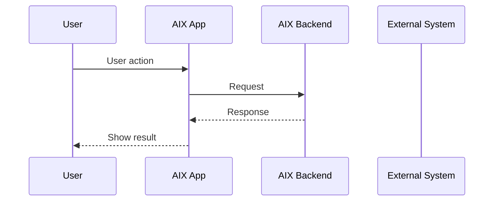
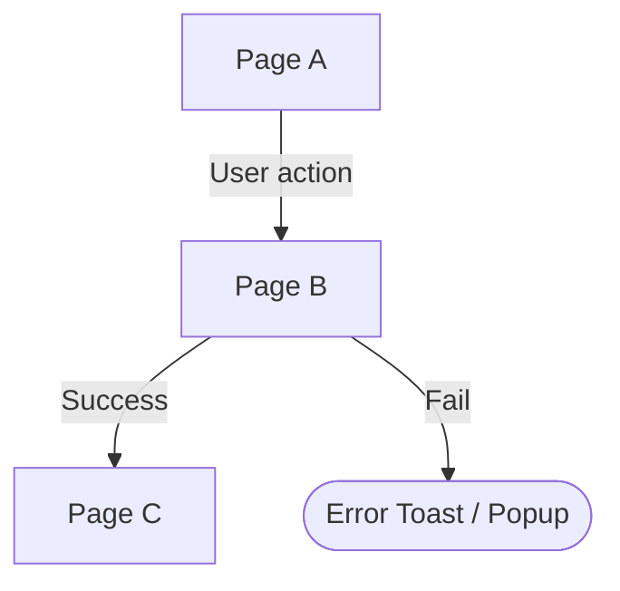

# Standard PRD Template 标准 PRD 模板

## 1. 文档信息

| 项目 | 内容 |
|---|---|
| 功能名称 | TBD |
| 所属模块 | TBD |
| Owner | TBD |
| 版本 | TBD |
| 状态 | Draft / Review / Approved |
| 更新时间 | TBD |
| 来源文档 | TBD |

---

## 2. 需求背景、目标与范围

### 2.1 需求背景

说明为什么要做这个需求。只写已确认背景，不写推测。

### 2.2 用户问题 / 业务问题

说明当前用户、业务、合规、运营或系统上存在什么问题。

### 2.3 需求目标

说明本次需求要达成什么结果。

### 2.4 涉及功能清单

| 功能点 | 本期范围 | 优先级 | 状态 | 说明 |
|---|---|---|---|---|
| TBD | In Scope / Deferred / Out of Scope | P0 / P1 / P2 | Confirmed / Open | TBD |

---

## 3. 业务流程与规则

> 本章节说明功能如何运转。  
> 业务规则写系统如何判断和流转；页面规则写用户看到什么、如何操作、如何反馈。  
> 同一规则不要在业务章节和页面章节重复写，页面章节只承接业务规则的用户表现。

### 3.1 业务主流程说明

用自然语言简要说明主流程。

### 3.2 业务时序图

### 3.3 流程步骤与业务规则

> 主流程、分支、前置条件、责任方、成功 / 失败结果统一放在这里。  
> 不要再额外拆成“前置条件”“分支规则”“主规则”多个重复章节。

| 步骤 | 场景 / 规则 | 触发条件 | 责任方 | 系统处理 | 成功结果 | 失败 / 分支结果 | 来源 |
|---|---|---|---|---|---|---|---|
| 1 | TBD | TBD | User / App / Backend / External | TBD | TBD | TBD | TBD |

### 3.4 状态规则

> 只放有明确状态枚举或状态流转的内容。  
> 如果没有状态机，本节可写“不适用”。

| 状态 | 含义 | 触发条件 | 用户可见表现 | 系统处理 | 可迁移到 | 是否终态 | 来源 |
|---|---|---|---|---|---|---|---|
| TBD | TBD | TBD | TBD | TBD | TBD | 是 / 否 | TBD |

### 3.5 业务级异常与失败处理

> 只放跨页面、跨系统、业务级异常。  
> 页面内输入错误、Toast、按钮禁用、权限提示放到对应 Page 下。

| 异常场景 | 触发条件 | 错误来源 | 错误码 / 原因 | 用户表现 | 系统处理 | 是否可重试 | 最终状态 |
|---|---|---|---|---|---|---|---|
| TBD | TBD | App / Backend / External | TBD | TBD | TBD | 是 / 否 | TBD |

---

## 4. 页面与交互说明

> 本章节说明用户看到什么、怎么操作、页面如何流转。  
> 页面流程图只表达页面跳转。  
> 每个 Page 下面聚合：截图、页面目标、展示内容、用户动作、系统处理、元素规则、状态、提示、异常分支。  
> 不单独做页面截图索引。

### 4.1 页面流程图

> 主节点必须是 Page；用户动作写在线条上；弹窗 / Toast / 权限提示用非 Page 形状；后端动作、通知、外部账户模型不混入页面主流程。

### 4.2 Page Name

| 区块 | 内容 |
|---|---|
| 页面类型 | 主页面 / 状态页 / 错误页 / 成功页 / 外部 H5 |
| 页面目标 | TBD |
| 入口 / 触发 | TBD |
| 展示内容 | TBD |
| 用户动作 | TBD |
| 系统处理 / 责任方 | TBD |
| 元素 / 状态 / 提示规则 | TBD |
| 成功流转 | TBD |
| 失败 / 异常流转 | TBD |
| 备注 / 边界 | TBD |

#### 元素明细（复杂页面才需要）

> 简单页面不要强行补元素明细。  
> 只有页面元素多、状态多、校验多、提示多时才补。

| 元素 / 状态 / 提示 | 类型 | 触发 / 展示条件 | 交互 / 校验规则 | 成功结果 | 失败 / 提示 | 后续流转 | 文案来源 |
|---|---|---|---|---|---|---|---|
| TBD | Button / Input / Selector / Link / Text / Toast / Popup / Permission Prompt / State | TBD | TBD | TBD | TBD | TBD | TBD |

---

## 5. 字段、接口与数据

> 只写实现、联调、测试必须知道的字段、接口和数据。没有则写“不适用”。

| 类型 | 名称 | 所属系统 | 来源 | 用途 | 规则 / 输入输出 | 异常处理 |
|---|---|---|---|---|---|---|
| 字段 / 接口 / 数据 / 埋点 / 日志 | TBD | AIX / DTC / AAI / KUN / WalletConnect / OS | 用户输入 / 后端返回 / 外部系统 | TBD | TBD | TBD |

---

## 6. 通知规则（如适用）

> 没有通知则写“不适用”。

| 触发事件 | 通知渠道 | 通知对象 | 文案 / 模板 | 跳转目标 | 失败 / 补发规则 |
|---|---|---|---|---|---|
| TBD | Email / Push / In-app | TBD | TBD | TBD | TBD |

---

## 7. 权限 / 合规 / 风控（如适用）

> 只写与本需求直接相关的权限、合规、风控要求。没有则写“不适用”。

| 类型 | 规则 | 影响 | 来源 |
|---|---|---|---|
| 用户权限 / 系统权限 / 合规 / 风控 / 隐私 | TBD | TBD | TBD |

---

## 8. 待确认事项

| 问题 | 影响范围 | 当前处理 | 是否阻塞验收 | 建议确认人 |
|---|---|---|---|---|
| TBD | TBD | 不阻塞 / 阻塞 / Deferred | 是 / 否 | TBD |

---

## 9. 验收标准 / 测试场景

### 9.1 验收标准

| 验收场景 | 验收标准 |
|---|---|
| 正常流程 | TBD |
| 异常流程 | TBD |
| 页面展示 | TBD |
| 系统交互 | TBD |
| 通知 | TBD |
| 数据 / 埋点 | TBD |

### 9.2 测试场景矩阵

| 场景 | 前置条件 | 用户操作 | 预期页面表现 | 预期系统结果 | 是否必测 |
|---|---|---|---|---|---|
| TBD | TBD | TBD | TBD | TBD | 是 / 否 |

---

## 10. 来源引用

- (Ref: TBD)
