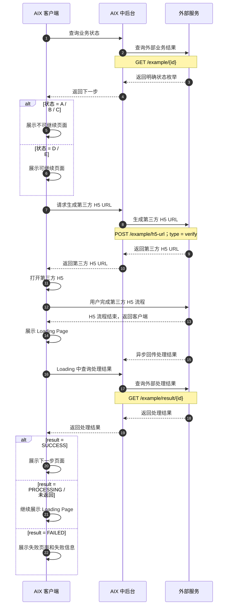
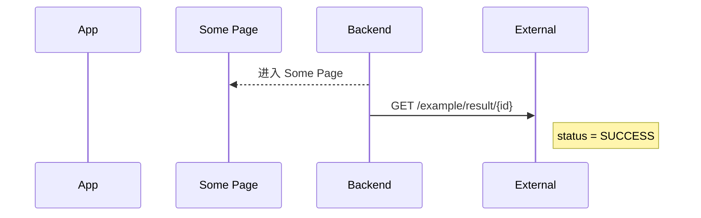
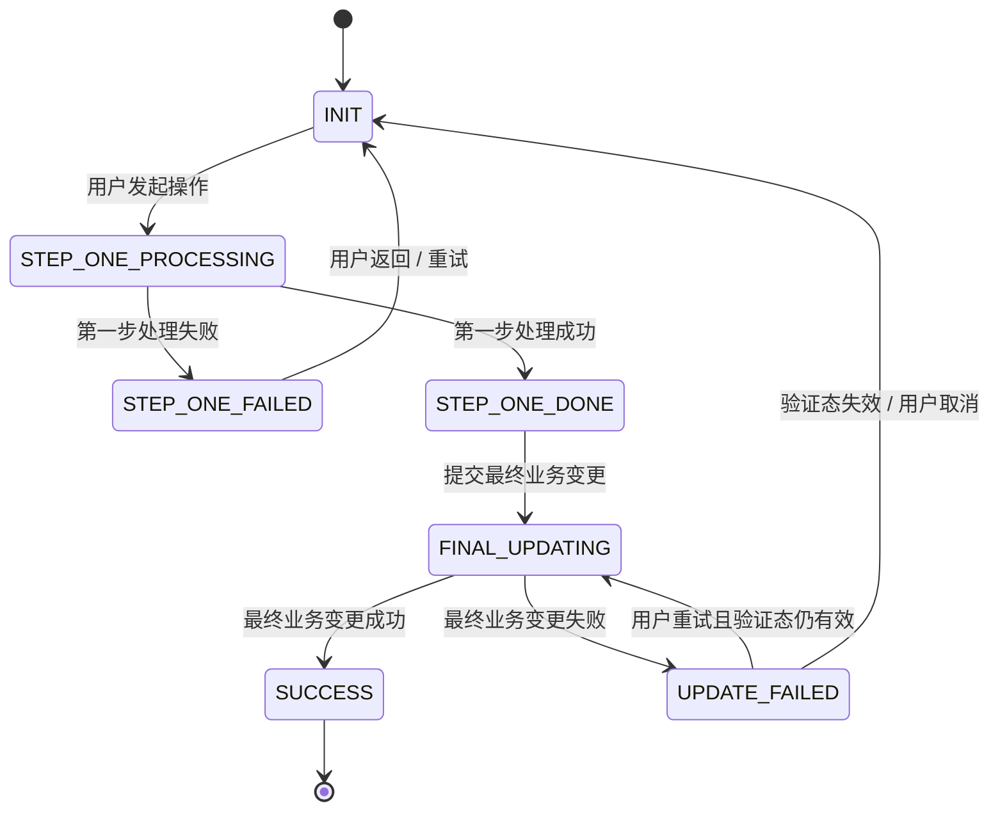

# Standard PRD Template 标准 PRD 模板

> 适用对象：前端、后端、测试、设计、产品。  
> 写作原则：页面能看出来的不写；公共能力已有的不重复写；不能开发和测试的不写；每条规则都要能判断对错；章节按需保留，不为模板完整而补废话；页面级别保持同层，页面内复杂弹窗 / 拦截 / 组件按需拆下级章节。  
> 使用方式：先在 Canvas 中生成 PRD 草稿并完成用户修改与落地评审；用户确认后，再写入 Git。  
> 流程规则：PRD 写作必须遵守 `workflow/prd-workflow.md` 中定义的多 Agent 闸门式流程。

---

## Workflow v2.0 对齐规则

所有 PRD 必须遵守以下规则：

- 新 PRD / 迭代 PRD 必须先生成 Canvas Brief。
- Brief 未经用户确认，不得生成正式 PRD 文件。
- 用户未明确确认“更新到 Git”，不得修改仓库。
- PRD 写完后必须经过 Fact Review、Template Review、UX Review、Tech Review。
- Fact Review 不通过，不得提交 Git。
- Template Review 不通过，不得标记完成。
- UX Review 存在 P0 / P1 问题，必须修正后再进入最终确认。
- 调研资料不得直接混入 Brief 主体。
- 默认不新增一级目录。
- 模板或流程修改必须先询问用户确认。

---

## PRD 文件建议 front matter

```yaml
---
type: prd
feature: <feature>
module: <module>
status: draft
version: "0.1"
brief_path:
brief_status:
source_files:
  - knowledge-base/...
research_refs: []
external_sources: []
user_confirmation_refs: []
open_gap_refs: []
review_status:
  fact_review:
  template_review:
  ux_review:
  tech_review:
last_updated: YYYY-MM-DD
owner: TBD
readers: [product, ui, dev, qa, business, ai]
---
```

说明：

- `brief_path` 可以为空；Brief 不强制写入 Git。
- `research_refs` 用于记录调研资料，不应把原始调研过程直接塞入 PRD 正文。
- 新 PRD 优先使用 `source_files` 记录仓库内来源；旧字段 `source_doc` 仅作兼容。
- 外部网页、竞品、安全参考放入 `external_sources` 或正文来源引用，不要伪装成仓库路径。
- 关键用户确认可以放入 `user_confirmation_refs` 或正文来源引用。
- `review_status` 用于记录当前评审状态，可按需保留。

---

## 0. 文档信息

| 项目 | 内容 |
|---|---|
| 功能名称 |  |
| 所属模块 |  |
| PRD 版本 | v1.0 |
| 状态 | Draft / Review / Approved / Deprecated |
| Owner |  |
| 创建时间 |  |
| 更新时间 |  |
| 关联 Brief | 无 / `requirements/YYYY-MM/<module>/_brief-<feature>.md` |
| 关联原型 | 无 / `requirements/YYYY-MM/<module>/assets/<feature>/` |
| 调研资料 | 无 / `references/research-notes/...` / `_research-<feature>.md` |
| 依赖公共能力 | 例如：Email OTP Verification、Login Passcode、Notification；没有则写“无” |

---

## 1. 需求背景、目标与范围

本章节用于让读者快速理解：为什么要做这个需求、这个需求的核心目标是什么、涉及哪些系统和模块。

要求：
- 本章节只写背景、目标和范围，不展开详细流程、页面规则、接口规则、异常规则和测试场景。
- 表达必须精简，假设读者没有耐心阅读长篇内容。
- 能一句话说明的，不写两句话；能两句话说明的，不写三句话。
- 不写空话、套话、泛泛价值，例如“提升用户体验”“提升效率”“统一事实源”等，除非能明确说明对应业务含义。
- 不写与正文事实不一致的系统、模块或能力；正文没有涉及的内容，不应在本章节强行加入。
- 如果现有模板中已有“本期做什么 / 本期不做什么 / 关键产品规则”，应避免与本章节重复；本章节只负责背景、目标和范围，具体功能结论放到后续功能结论或主流程章节。

### 1.1 背景

写清楚为什么需要做这个功能。

要求：
- 用最短表达说明需求产生的业务背景。
- 不写流程细节。
- 不写系统协作细节。
- 不写页面、接口、状态、异常等后文才展开的内容。
- 重点回答：为什么现在需要这个能力？

推荐写法：

> 为了支持【业务能力 / 产品能力】，需要建设【功能 / 机制】，以解决【核心业务前置条件 / 风险 / 准入要求】。

示例：

> AIX 钱包要接入发卡、法币出入金、支付网络和托管账户等金融能力，必须通过 KYC 确认用户身份、居住地和地址证明符合准入要求。

### 1.2 目标

写清楚这个需求的核心目标。

要求：
- 目标要站在业务和产品层，不写执行细节。
- 不拆成过细的问题清单。
- 不写过多泛化价值。
- 可以说明该需求为哪些后续能力提供基础。
- 通常 1～2 句话即可。

推荐写法：

> 【功能】的核心目标是帮助【产品 / 业务】获得【关键业务能力 / 外部接入许可 / 合规准入 / 风控能力】，并规避【核心风险】。  
> 本需求用于建立【机制 / 流程 / 能力】，为【后续业务模块】提供统一基础。

示例：

> KYC 的核心目标是帮助 AIX 获得传统金融体系的接入许可，例如发卡机构、法币出入金通道、托管账户和支付网络等，并规避身份不明、地区限制、协议缺失、地址证明不完整等系统性合规风险。  
> 本需求用于建立 AIX 钱包开户的 KYC 准入机制，为 Wallet、Deposit、Card、法币出入金等后续金融能力提供统一的合规准入基础。

### 1.3 涉及系统与模块范围

写清楚本需求涉及哪些系统、哪些模块。

要求：
- 必须分层级写，不要把系统和模块堆在一起。
- 先写涉及系统，再写涉及模块。
- 涉及系统按“谁负责什么”说明。
- 涉及模块按用户使用链路或业务主链路拆分。
- 只说明范围边界，不写详细规则。
- 表格建议保持两列，避免信息过碎。
- 如果“主要职责”较长，采用“主句 + 子段落”的方式：
  - 主句：说明主要做什么。
  - 子段落：用“主要包括：xxx、xxx、xxx。”拆分功能点。
- 不建议使用过多 bullet，避免章节显得很长。
- 正文没有展开的系统或模块，不要写入本节。

#### 1.3.1 涉及系统

用一两句话概括本需求涉及的系统协作关系。

| 系统 | 主要职责 |
|---|---|
| 【系统 A】 | 【主句：说明该系统主要做什么。】<br><br>主要包括：【功能点 1】、【功能点 2】、【功能点 3】。 |
| 【系统 B】 | 【主句：说明该系统主要做什么。】<br><br>主要包括：【功能点 1】、【功能点 2】、【功能点 3】。 |
| 【系统 C】 | 【主句：说明该系统主要做什么。】<br><br>主要包括：【功能点 1】、【功能点 2】、【功能点 3】。 |

#### 1.3.2 按用户链路拆分的模块

模块应按用户完成该需求的顺序拆分，用来说明本文覆盖哪些产品能力。

| 模块 | 主要说明 |
|---|---|
| 【模块 1】 | 【主句：说明该模块主要做什么。】<br><br>主要包括：【功能点 1】、【功能点 2】、【功能点 3】。 |
| 【模块 2】 | 【主句：说明该模块主要做什么。】<br><br>主要包括：【功能点 1】、【功能点 2】、【功能点 3】。 |
| 【模块 3】 | 【主句：说明该模块主要做什么。】<br><br>主要包括：【功能点 1】、【功能点 2】、【功能点 3】。 |

---

## 2. 主流程

> 如本需求没有复杂业务链路，本章可以简化，但必须能让开发、测试和产品理解用户从入口到业务结果的主链路。

### 2.1 业务时序图

> 推荐使用 Mermaid `sequenceDiagram`。  
> 本图关注业务流程、责任边界、跨系统协作和业务结果，不是技术时序图。  
> 参与方按业务责任边界设置，例如客户端、中后台、外部服务；页面只作为客户端展示动作表达，不作为默认参与方。  
> 箭头文案写业务动作；接口路径、`verifyType` 等关键参数放在紧跟动作下方的 `Note over 发起方,接收方` 中。  
> 后端不写“进入页面”，只写“返回下一步 / 返回结果”；页面展示由客户端自循环表达。  
> 第三方 H5 / 外部服务流程必须拆清楚：生成 URL、用户完成 H5、返回客户端、客户端展示 Loading、异步结果回传、Loading 查询 / 等待结果、按结果分流。  
> 原文已有明确状态值、错误码、渠道条件、接口参数、结果枚举时，必须保留，不得抽象压缩。  
> 流程图主干未展示的弹窗、waitlist、异常页、toast、页面细节，不在本图强行补充，应放到页面章节、异常章节或状态章节说明。  
> 如果事实来源是图片流程图，必须先完成节点 / 连线 / 分支识别；无法可靠识别的内容标待确认，不得猜测写入。

**写法要求**

| 规则 | 要求 |
|---|---|
| 参与方 | 按业务责任边界设置，例如客户端 / 中后台 / 外部服务；页面只作为客户端展示动作表达。 |
| 箭头文案 | 写业务动作，例如“查询业务状态”“请求生成 H5 URL”“返回下一步”。 |
| 接口信息 | 不放在主箭头上；放在紧跟箭头后的 `Note over 发起方,接收方` 中。 |
| 页面展示 | 后端只返回结果或下一步；客户端用 `APP->>APP` 表达展示页面。 |
| 状态枚举 | 原文有什么枚举就保留什么枚举，不得改成“可继续 / 不可继续”等抽象词后丢失事实。 |
| 第三方 H5 | 必须拆出“生成 URL → 进入 H5 → 完成 H5 → 返回客户端 → Loading → 异步回传 / 查询 → 按结果分流”。 |
| 未展示细节 | 流程图主干没画的弹窗、拦截、toast、错误页，不强行放入时序图。 |

**推荐示例**



**不推荐写法**



问题：页面被当成参与方；后端“进入页面”；接口路径抢占主箭头；Note 放右侧，容易被误解成另一条动作。

### 2.2 关键校验与失败处理

只写本功能新增或有差异的校验。公共能力失败只引用公共规则。没有新增校验时，本节可删除。

| 场景 | 处理规则 | 用户提示 / 结果 | 来源 |
|---|---|---|---|
|  |  |  |  |

### 2.3 状态机 / 状态流（复杂流程必须保留）

> 当需求包含多步骤验证、支付 / 资金、安全项变更、身份认证、审核、异步处理、跨端继续、可重试失败、并发占用或最终数据变更时，本节必须保留。  
> 状态机必须覆盖成功、失败、取消、返回、超时、重试、更新失败、公共能力成功但最终业务失败等分支。  
> 页面关系图不能替代状态机；页面图只说明页面跳转，状态机说明业务状态和数据结果。

**状态流示例**



**状态定义**

| 状态 | 进入条件 | 允许操作 | 退出条件 | 失败 / 超时 / 返回处理 | 数据结果 |
|---|---|---|---|---|---|
| INIT |  |  |  |  |  |
| PROCESSING |  |  |  |  |  |
| SUCCESS |  |  |  |  |  |
| FAILED |  |  |  |  |  |

**必须说明的状态规则**

- 公共能力成功后，最终业务变更失败时如何处理。
- 验证成功态、处理中态、失败态的有效期和重试条件。
- 用户返回、关闭页面、重新进入、跨设备继续时状态是否保留。
- 并发提交、重复点击、目标资源被占用时的结果。
- 成功前不得产生半更新状态；成功后必须明确数据、会话、缓存、通知、日志影响。

---

## 3. 页面与交互

> 知识库入库前，需按 [知识库入库 Agent 检查规则](./kb-ingestion-agent-rules.md) 执行 Fact Guard、Consistency Guard、Template Compliance Guard 三类检查。

> 页面相关需求保留本章；纯后端、配置、数据或非页面型需求可删除或改为“入口与操作方式”。

### 3.0 页面章节分层规范

**页面级别内容保持同一层级。** 每个页面使用一个页面章节承载，不要再为页面本身创建“主页面”子章节。

错误示例：

```md
### 4.3 KYC Start Page

#### 4.3.1 主页面
```

正确示例：

```md
### 4.3 KYC Start Page

页面截图 + 页面说明

#### 4.3.1 弹窗：Declaration of Reverse Solicitation

#### 4.3.2 拦截：Waitlist
```

页面内的区域、控件、按钮、toast、简单弹窗、简单状态，优先写在当前页面的左图右说明中。

如果页面内某个弹窗、拦截态、复杂组件或复杂状态在当前页面说明中无法简洁讲清楚，或会导致右侧说明过长、阅读困难，则在当前页面下创建子章节。子章节标题应带类型前缀，例如：

- `弹窗：xxx`
- `拦截：xxx`
- `组件：xxx`
- `状态：xxx`

子章节仍归属于当前页面，不作为新的页面级章节。

**拆分判断：**

| 情况 | 处理 |
|---|---|
| 一两句话能讲清楚 | 放在当前页面说明里 |
| Toast / 简单提示 | 放在当前页面说明里 |
| 按钮置灰 / 小状态变化 | 放在当前页面说明里 |
| 有独立截图 | 倾向拆下级章节 |
| 有多个按钮 / 多种操作结果 | 倾向拆下级章节 |
| 有保存规则 / 接口参数影响 | 倾向拆下级章节 |
| 写在右侧说明里会显得很长很乱 | 拆下级章节 |
| QA 需要单独测 | 拆下级章节 |

**异常与边界放置规则：** 异常、边界、Gap 跟随它影响的页面区域 / 弹窗 / 拦截态，不单独汇总。只有确实无法归属到某个展示单元时，才放在页面末尾备注。

---

### 3.1 页面关系图

> 推荐使用 Mermaid `flowchart`。  
> 本图只表达页面之间的跳转关系。  
> 页面节点必须是页面，不要把接口、校验、Toast、通知、外部系统放进页面关系图。


---

### 3.2 页面：新增 / 改造页面名称

> 页面级章节直接承载该页面本身，不要再创建“主页面”子章节。  
> 优先采用左图右说明，让产品、设计、开发、QA 在大屏上可以对照页面阅读。  
> 页面上已经直观看到的普通布局和静态文案不复述；右侧说明只写区域如何工作、触发后去哪、异常怎么处理、哪些规则需要测试。

<table>
  <tr>
    <th width="48%">页面</th>
    <th width="52%">说明</th>
  </tr>
  <tr>
    <td valign="top">
      
    </td>
    <td valign="top">
      <p><strong>页面区域 / 功能点 A</strong></p>
      <ul>
        <li><strong>默认展示</strong>：写默认状态、默认值来源、必要边界。</li>
        <li><strong>用户操作</strong>：写点击 / 输入 / 选择后的结果；如跳到其他页面，应给章节指引。</li>
        <li><strong>处理规则</strong>：写开发和测试需要判断的条件，不复述截图能直接看出的静态内容。</li>
        <li><strong>异常 / 边界</strong>：直接写在影响该区域的位置，不单独挪到页面末尾。</li>
      </ul>

      <p><strong>页面区域 / 功能点 B</strong></p>
      <ul>
        <li>...</li>
      </ul>
    </td>
  </tr>
</table>

**写作要求**

- 图片放左侧，说明放右侧，图片使用 `valign="top"`，建议宽度 `480`。
- 说明可以使用 `<p>`、`<ul>` 分段，不要用大量 `<br>` 堆叠。
- 当动作会进入另一个页面 / 弹窗 / 拦截态时，要写清层级，并给出章节指引。
- 当前页面直接发生的事写一级；点击后进入的新页面 / 弹窗 / 选择结果写下一级。
- 不要写无效信息，例如“页面区域：按钮、标题、输入框”。这些截图已经能看出来。

**层级示例**

```md
- 点击国家区域：进入 Select Residence Country Page；细则见 4.4 Select Residence Country Page。
  - 选择结果按国家 Type 判断：
    - Type = Phase 1：返回本页；协议完成后可继续。
    - Type = phase 2 - waitlist：返回本页；点击底部按钮后触发 waitlist 拦截；见 4.3.2 拦截：Waitlist。
    - Type = Forbiden：国家列表隐藏，不可选择。
```

**页面内复杂展示的下级章节示例**

当弹窗、拦截态、复杂组件或复杂状态在当前页面说明中写不清楚时，在当前页面下创建子章节。

```md
#### 3.2.1 弹窗：弹窗名称

<table>
  <tr>
    <th width="48%">页面</th>
    <th width="52%">说明</th>
  </tr>
  <tr>
    <td valign="top">
      
    </td>
    <td valign="top">
      <p><strong>触发方式</strong></p>
      <ul>
        <li>...</li>
      </ul>

      <p><strong>完成条件 / 操作结果</strong></p>
      <ul>
        <li>...</li>
      </ul>

      <p><strong>异常 / 边界</strong></p>
      <ul>
        <li>...</li>
      </ul>
    </td>
  </tr>
</table>

#### 3.2.2 拦截：拦截名称

左图右说明，写触发条件、处理结果、返回路径和后续页面指引。
```

**跳转指引要求**

当说明中提到其他页面、弹窗、拦截态、错误码或公共能力时，应直接写“见 x.x 章节”。

错误示例：

```md
触发 waitlist 拦截。
```

正确示例：

```md
触发 waitlist 拦截；见 4.3.2 拦截：Waitlist。提交页细则见 4.5 Waitlist Page。
```

---

### 3.3 复用页面：公共能力页面名称


> 复用 `公共能力文件路径`，本需求不改造该页面。  
> 复用页面只写流转去向，不写场景参数、展示字段、内部规则，避免被误解为需要改造公共页面。

**流转规则**

| 场景 | 后续流转 |
|---|---|
| 成功 |  |
| 失败 / 锁定 / 过期 / 重发超限 | 按公共能力规则处理 |

---

### 3.4 成功页：页面名称


> 每个成功页建议有低保真原型，或至少写清成功结果、返回路径和数据影响。

**页面目的**  
展示最终处理结果。

**展示规则**
- 只写结果字段、掩码规则、状态展示等需要测试验证的内容。

**交互与成功后处理**

| 场景 / 处理项 | 规则 | 结果 |
|---|---|---|
| 点击主按钮 |  |  |
| 数据变更 |  |  |
| 会话 / 缓存刷新 |  |  |
| 通知触发 |  |  |
| 操作日志 | 如需要，仅用一句话说明；不写内部日志字段 |  |

---

## 4. 外部系统、接口与数据变更（如有）

> 仅当本需求涉及外部系统、第三方接口、跨模块数据同步、对外字段、新增数据口径或会影响产品验收的数据变更时保留。  
> 纯内部字段、内部接口、技术实现细节不写；由技术方案承接。

### 4.1 外部系统 / 跨模块影响

| 对象 | 影响 | 处理规则 |
|---|---|---|
|  |  |  |

### 4.2 对外字段 / 数据口径

| 字段 / 数据 | 所属系统 | 用途 | 规则 |
|---|---|---|---|
|  |  |  |  |

---

## 5. 通知（如有）

> 本章按需保留。没有新增通知规则时可删除。  
> 已有公共通知能力只引用，不重复定义。

### 5.1 通知（如有）

无通知时删除本节。有通知时写触发事件、对象和失败处理。模板、文案如已有公共模块，只引用。

| 触发事件 | 渠道 | 对象 | 说明 / 模板 | 失败处理 |
|---|---|---|---|---|
|  |  |  |  |  |

---

## 6. 待确认项

只保留真正影响产品范围、开发、测试、接口、风控、上线验收的问题。  
不会影响本期开发的问题不放这里。  
技术实现细节、内部幂等方案、内部接口设计细节，不放 PRD 待确认项，由技术方案承接。

| 编号 | 问题 | 影响范围 | 当前建议 / 默认处理 | 是否阻塞 | 负责人 |
|---|---|---|---|---|---|
| TBD-001 |  |  |  | 是 / 否 |  |

---

## 7. 来源引用

- Brief：无 / `requirements/YYYY-MM/<module>/_brief-<feature>.md`
- 原型：
- 知识库引用：
- 用户确认：
- 调研资料：
- 竞品 / 安全参考：

---

## 附录：写作与落地评审检查清单

提交 PRD 前逐项检查：

- [ ] 文档信息完整，PRD 状态值合法。
- [ ] 本期做什么、不做什么清楚，没有混入另一个独立功能。
- [ ] 主流程能从入口跑到业务结果，失败、取消、返回、重试有合理结果。
- [ ] 复杂流程已保留状态机 / 状态流，且覆盖公共能力成功但最终业务失败、更新失败、超时、重试、返回、并发等分支。
- [ ] 页面关系图使用 Mermaid `flowchart`（如适用）。
- [ ] 业务时序图使用 Mermaid `sequenceDiagram`（如适用），且参与方按业务责任边界设置；箭头写业务动作；接口放箭头下方 `Note over 发起方,接收方`；后端只返回结果或下一步；页面由客户端展示；第三方 H5 拆出返回客户端、Loading、异步回传 / 查询和结果分流；状态枚举不压缩。
- [ ] 每个新增 / 改造页面有低保真原型或明确页面结构。
- [ ] 用户体验顺畅：用户知道当前步骤、操作反馈、失败下一步、成功结果和后续影响。
- [ ] 页面能看出来的内容，没有重复写成规则。
- [ ] 公共能力已有规则只引用，不重复定义。
- [ ] 每条规则都能被开发实现、被测试验证。
- [ ] 输入页已写校验规则、错误结果和成功流转。
- [ ] 成功页已写数据变化、会话刷新、返回后展示。
- [ ] 外部系统、接口与数据变更章节只在有外部或跨模块影响时保留。
- [ ] 通知章节只保留本需求新增或差异内容。
- [ ] 待确认项只保留真正阻塞或影响实现的问题，不放内部技术实现细节。
- [ ] 来源引用覆盖关键事实，调研 / 竞品 / 推测未被写成确认事实。
- [ ] PRD 已经过 Fact Review、Template Review、UX Review、Tech Review。
- [ ] 用户已明确确认允许更新 Git。
