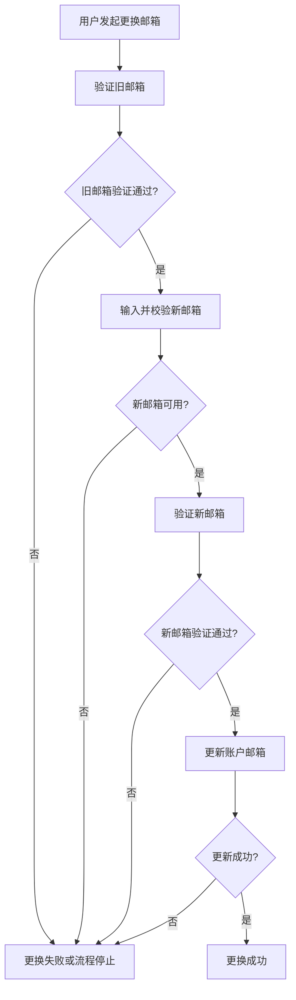
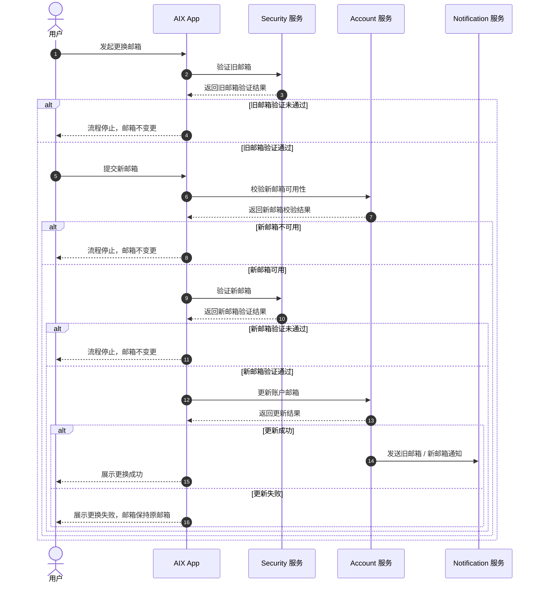
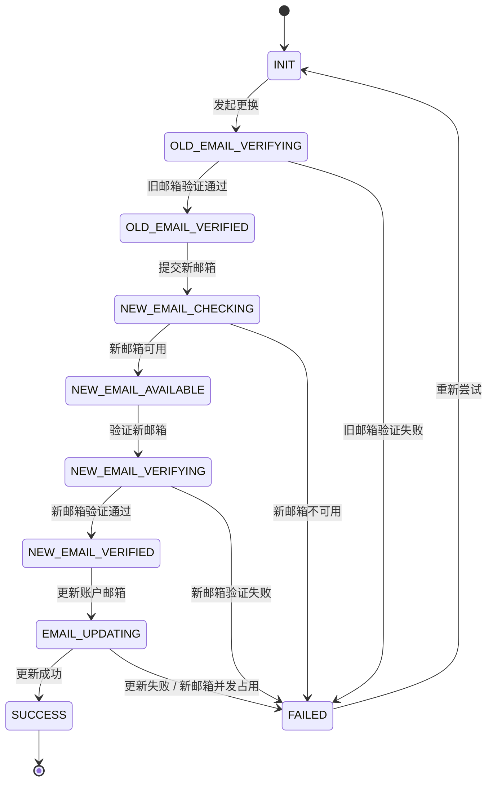
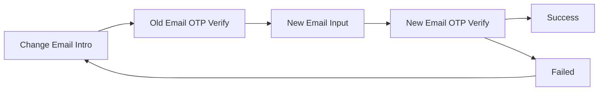

# Change Email 更换邮箱 PRD（业务流程弱交互版）

> 本版本用于和 `change-email.md` 交互细节版对比。  
> 旧版不删除、不覆盖。本文尽量弱化按钮、页面控件和交互细节，只保留业务流程、关键状态、业务规则和结果定义。

---

## 0. 文档信息

| 项目 | 内容 |
|---|---|
| 功能名称 | Change Email 更换邮箱 |
| 所属模块 | Account |
| PRD 版本 | v1.0-business-flow |
| 状态 | Draft |
| Owner | TBD |
| 创建时间 | 2026-05-08 |
| 更新时间 | 2026-05-08 |
| 对照版本 | `requirements/2026-05/account/change-email.md` v1.8 |
| 关联 Brief | `requirements/2026-05/account/_brief-change-email.md` |
| 关联原型 | `requirements/2026-05/account/assets/change-email/` |
| 依赖公共能力 | Email OTP Verification、Notification |

---

## 1. 功能结论

### 1.1 本期做什么

- 用户可在个人中心 Security 区域发起更换邮箱。
- 更换邮箱必须先验证旧邮箱，再验证新邮箱。
- 新邮箱必须符合格式要求，且不能与当前邮箱相同，也不能被其他账户使用。
- 新邮箱验证成功后，Account 服务更新账户邮箱。
- 邮箱更新成功后，当前账户的登录邮箱、找回密码邮箱和后续 Email OTP 接收邮箱均使用新邮箱。

### 1.2 本期不做什么

- 不提供旧邮箱不可用入口。
- 不提供跳过旧邮箱验证的自助流程。
- 不新增密码 / BIO 当前账户验证页。
- 不影响 DTC / AAI / KUN 等外部账户上下文。
- 不在本文重复定义 Email OTP 位数、有效期、重发、锁定、设备限制等公共规则。

### 1.3 业务原则

| 原则 | 说明 |
|---|---|
| 先验证旧邮箱 | 用户证明仍可访问当前账户邮箱后，才可进入新邮箱绑定流程。 |
| 再验证新邮箱 | 用户证明可访问目标新邮箱后，Account 才能更新账户邮箱。 |
| 成功前不更新 | 新邮箱 OTP 通过但 Account 更新未成功时，账户邮箱必须保持原邮箱。 |
| 成功后统一生效 | Account 更新成功后，新邮箱成为登录、找回密码、Email OTP 的账户邮箱。 |
| 失败不半更新 | 任一失败场景都不得出现部分系统为新邮箱、部分系统为旧邮箱的状态。 |

---

## 2. 业务流程

### 2.1 业务流程概览

### 2.2 业务时序图

### 2.3 业务状态

| 状态 | 业务含义 | 数据结果 |
|---|---|---|
| INIT | 用户尚未完成本次更换邮箱流程 | Account 邮箱不变 |
| OLD_EMAIL_VERIFYING | 正在验证旧邮箱控制权 | Account 邮箱不变 |
| OLD_EMAIL_VERIFIED | 旧邮箱已验证，可进入新邮箱校验 | Account 邮箱不变 |
| NEW_EMAIL_CHECKING | 正在校验新邮箱格式、是否当前邮箱、是否已被使用 | Account 邮箱不变 |
| NEW_EMAIL_AVAILABLE | 新邮箱可用，可进入新邮箱验证 | Account 邮箱不变 |
| NEW_EMAIL_VERIFYING | 正在验证新邮箱控制权 | Account 邮箱不变 |
| NEW_EMAIL_VERIFIED | 新邮箱已验证，可提交账户邮箱更新 | Account 邮箱不变 |
| EMAIL_UPDATING | Account 正在更新账户邮箱 | 成功前 Account 邮箱不变 |
| SUCCESS | 邮箱更换成功 | Account 邮箱更新为新邮箱 |
| FAILED | 更换失败或流程停止 | Account 邮箱保持原邮箱 |

---

## 3. 关键业务规则

### 3.1 旧邮箱验证

- 旧邮箱验证通过前，不允许提交新邮箱作为账户邮箱。
- 旧邮箱 OTP 失败、锁定、过期、重发超限等情况，按 Email OTP Verification 公共规则处理。
- 旧邮箱验证失败时，账户邮箱不得更新。

### 3.2 新邮箱校验

| 场景 | 业务规则 | 结果 |
|---|---|---|
| 新邮箱为空 | 不允许继续 | 邮箱不变更 |
| 新邮箱格式错误 | 不允许继续 | 邮箱不变更 |
| 新邮箱超过长度限制 | 不允许继续 | 邮箱不变更 |
| 新邮箱与当前邮箱相同 | 不允许继续 | 邮箱不变更 |
| 新邮箱已被其他账户使用 | 不允许继续 | 邮箱不变更 |
| 新邮箱可用 | 允许进入新邮箱验证 | 邮箱暂不更新 |

### 3.3 新邮箱验证

- 新邮箱验证成功前，不得更新账户邮箱。
- 新邮箱 OTP 必须绑定当前账户、目标新邮箱和 `change_email` 场景。
- 用户修改目标新邮箱后，之前发送的新邮箱 OTP 不得用于新的目标邮箱。
- 新邮箱 OTP 失败、锁定、过期、重发超限等情况，按 Email OTP Verification 公共规则处理。

### 3.4 邮箱更新

- Account 更新成功前，不得刷新当前会话 email。
- Account 更新成功前，不得触发更换成功通知。
- Account 更新成功后，新邮箱成为账户邮箱。
- Account 更新失败、服务异常或新邮箱被并发占用时，账户邮箱必须保持原邮箱。
- 更新失败后展示失败结果；用户重新尝试时，从更换邮箱入口重新开始流程，并重新验证旧邮箱。

---

## 4. 页面承载关系（弱交互版）

> 本章只说明业务阶段由哪些页面承载，不展开按钮、控件和逐项交互细节。详细交互见 `change-email.md`。

| 业务阶段 | 页面 / 承载位置 | 业务目的 |
|---|---|---|
| 发起更换 | Personal Center - Security Email Row / Change Email Intro | 让用户进入更换邮箱流程 |
| 验证旧邮箱 | Old Email OTP Verify Page | 验证用户仍可访问当前邮箱 |
| 提交新邮箱 | New Email Input | 收集并校验目标新邮箱 |
| 验证新邮箱 | New Email OTP Verify Page | 验证用户可访问目标新邮箱 |
| 更换成功 | Change Email Success | 告知邮箱已更新，并刷新账户邮箱展示 |
| 更换失败 | Change Email Failed | 告知邮箱未更新，账户邮箱保持原邮箱 |

---

## 5. 业务结果

### 5.1 成功结果

| 项目 | 结果 |
|---|---|
| Account 邮箱 | 更新为新邮箱 |
| 当前会话 email | 刷新为新邮箱 |
| 后续登录账号 | 使用新邮箱 |
| 找回密码邮箱 | 使用新邮箱 |
| Email OTP 接收邮箱 | 使用新邮箱 |
| 当前设备登录状态 | 不强制登出 |
| BIO | 不清除 |
| 通知 | 发送旧邮箱 / 新邮箱 Email 通知 |

### 5.2 失败结果

| 场景 | 结果 |
|---|---|
| 旧邮箱验证失败 | 账户邮箱保持原邮箱 |
| 新邮箱不可用 | 账户邮箱保持原邮箱 |
| 新邮箱验证失败 | 账户邮箱保持原邮箱 |
| Account 更新失败 | 账户邮箱保持原邮箱 |
| 新邮箱被并发占用 | 账户邮箱保持原邮箱 |
| 通知发送失败 | 不影响已成功的邮箱更新结果 |

---

## 6. 通知

| 触发事件 | 渠道 | 对象 | 说明 | 失败处理 |
|---|---|---|---|---|
| 邮箱更换成功 | Email | 旧邮箱 | 通知用户账户邮箱已被更换 | 通知失败不回滚邮箱更新 |
| 邮箱更换成功 | Email | 新邮箱 | 通知用户该邮箱已绑定为账户邮箱 | 通知失败不回滚邮箱更新 |

---

## 7. 待确认项

| 编号 | 问题 | 影响范围 | 当前建议 | 是否阻塞 | 负责人 |
|---|---|---|---|---|---|
| CE-TBD-003 | 更换邮箱成功后是否增加资金敏感操作限制？ | 资金安全与风控 | 建议更换成功后 24 小时内限制出金类高风险操作，例如提现、转账、兑换；不影响登录、查看和入金。 | 否 | 产品 / Security / 风控 |

---

## 8. 来源引用

- 原 PRD：`requirements/2026-05/account/change-email.md`
- Brief：`requirements/2026-05/account/_brief-change-email.md`
- 原型目录：`requirements/2026-05/account/assets/change-email/`
- 知识库：`knowledge-base/account/_index.md`
- 知识库：`knowledge-base/account/registration.md`
- 知识库：`knowledge-base/security/email-otp-verification.md`
- 知识库：`knowledge-base/common/notification.md`
- 参考：OWASP Email Validation and Verification Cheat Sheet / Email Change Workflows
- 参考：OWASP Changing A User's Registered Email Address
