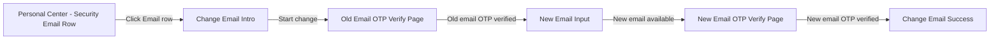

# Change Email 更换邮箱 PRD

## 0. 文档信息

| 项目 | 内容 |
|---|---|
| 功能名称 | Change Email 更换邮箱 |
| 所属模块 | Account |
| PRD 版本 | v1.2 |
| 状态 | Draft |
| Owner | TBD |
| 创建时间 | 2026-05-05 |
| 更新时间 | 2026-05-05 |
| 关联 Brief | `requirements/2026-05/account/_brief-change-email.md` |
| 关联原型 | `requirements/2026-05/account/assets/change-email/` |
| 依赖公共能力 | Email OTP Verification、Notification |

---

## 1. 功能结论

### 1.1 本期做什么

- 在个人中心 Security 区域的 Email 行提供更换邮箱入口，Email 行右侧展示向右箭头。
- 用户通过旧邮箱 Email OTP 验证后，才可输入新邮箱。
- 用户输入新邮箱后，系统在发送新邮箱 Email OTP 前完成邮箱格式、非当前邮箱、全局唯一性校验。
- 用户通过新邮箱 Email OTP 验证后，Account 服务将账户邮箱更新为新邮箱。
- 更换成功后，当前会话 email 刷新为新邮箱；后续登录账号、找回密码邮箱和 Email OTP 接收邮箱使用新邮箱。

### 1.2 本期不做什么

- 不单独增加密码 / BIO 当前账户验证页。
- 不提供旧邮箱不可用入口，不提供自助跳过旧邮箱 OTP 验证。
- 不影响 DTC / AAI / KUN 等外部账户上下文。
- 不在本文重复定义 Email OTP 位数、有效期、重发、锁定、设备限制等公共规则。
- 不在本文确认资金敏感操作限制；如需限制提现 / 转账 / 兑换，另行确认风控规则。

### 1.3 关键产品规则

| 规则 | 说明 | 来源 |
|---|---|---|
| 邮箱入口位置 | Email 行位于个人中心 Security 区域，不放在 Account 区域 | 用户最新确认 |
| Email 行可点击 | Email 行右侧必须展示向右箭头 | 用户最新确认 |
| 邮箱掩码 | 当前邮箱、新邮箱展示均按 Email OTP Verification 掩码规则处理：`@` 前首位和末位明文，邮箱后缀明文，中间字符按同位数展示 `*`；例如 `test43500@gmail.com` → `t*******0@gmail.com` | `knowledge-base/security/email-otp-verification.md` |
| 邮箱唯一性 | 邮箱全局唯一，不允许重复注册或绑定 | `knowledge-base/account/_index.md` |
| 旧邮箱验证 | 旧邮箱 OTP 验证通过前，不允许进入新邮箱输入 | 用户确认；OWASP |
| 新邮箱验证 | 新邮箱 OTP 验证成功前，不得更新账户邮箱 | 用户确认；OWASP |
| Email OTP 公共规则 | Old Email OTP / New Email OTP 均复用 Email OTP Verification | `knowledge-base/security/email-otp-verification.md` |
| 成功后会话 | 更换成功后刷新当前会话 email，不强制登出当前设备，不清除 BIO | 用户确认 |

---

## 2. 主流程

### 2.1 业务时序图

> 本图关注业务流程、责任边界和业务结果，不是技术时序图。  
> 发送 OTP 的含义是 AIX App 请求 Security 发送；邮件投递由 Security 对接通知通道完成。  
> Email OTP 内部规则不在本图展开，统一复用 `knowledge-base/security/email-otp-verification.md`。

### 2.2 关键校验与失败处理

| 场景 | 处理规则 | 用户提示 / 结果 | 来源 |
|---|---|---|---|
| 旧邮箱 OTP 失败 / 锁定 / 过期 / 重发超限 | 复用 Email OTP Verification | 按 Email OTP 公共规则处理；账户邮箱不得更新 | `knowledge-base/security/email-otp-verification.md` |
| 新邮箱为空 | 不发送新邮箱 OTP | `Email should not be empty` | `knowledge-base/account/registration.md` |
| 新邮箱超过长度限制 | 最长 103 字符，超出不可继续输入；后端收到超长值时按格式错误处理 | 前端限制输入；必要时提示 `Email format is invalid` | `knowledge-base/account/registration.md` |
| 新邮箱格式错误 | 不发送新邮箱 OTP | `Email format is invalid` | `knowledge-base/account/registration.md` |
| 新邮箱与当前邮箱相同 | 不发送新邮箱 OTP；后端兜底校验 | `This is already your current email` | 本 PRD |
| 新邮箱已被其他账户使用 | 不发送新邮箱 OTP；后端按邮箱全局唯一性校验 | `This email has been used` | `knowledge-base/account/registration.md` |
| 新邮箱可用性校验通过 | 请求发送新邮箱 OTP，不更新账户邮箱 | 进入 New Email OTP Verify Page | 本 PRD |
| 新邮箱 OTP 失败 / 锁定 / 过期 / 重发超限 | 复用 Email OTP Verification | 按 Email OTP 公共规则处理；账户邮箱不得更新 | `knowledge-base/security/email-otp-verification.md` |
| 邮箱更新时发现新邮箱已不可用 | 更新前再次校验邮箱全局唯一性，避免并发占用 | 不更新账户邮箱，提示 `This email has been used` | 本 PRD |
| 账户邮箱更新失败 | 保持原邮箱，不产生半更新状态 | `Something went wrong. Please try again later` | 本 PRD |
| 通知发送失败 | 不影响成功页展示；补发 / 重试规则待 Notification 确认 | 邮箱更换结果保持成功 | 本 PRD |

---

## 3. 页面与交互

### 3.1 页面关系图

---

### 3.2 页面：Personal Center - Security Email Row

**页面目的**  
提供更换邮箱入口。

**展示规则**
- Email 行位于 Security 区域，不放在 Account 区域。
- Email 行展示当前邮箱掩码。
- Email 行右侧展示向右箭头。

**交互与校验规则**

| 场景 / 元素 | 规则 | 不满足时提示 / 结果 | 后续流转 |
|---|---|---|---|
| 点击 Email 行 | 用户必须处于已登录状态 | 未登录用户无法进入个人中心 | 进入 Change Email Intro |

---

### 3.3 页面：Change Email Intro

**页面目的**  
展示当前邮箱并发起更换流程。

**展示规则**
- 当前邮箱按 Email OTP Verification 掩码规则展示。

**交互与校验规则**

| 场景 / 元素 | 规则 | 不满足时提示 / 结果 | 后续流转 |
|---|---|---|---|
| 点击开始更换 | 请求发送旧邮箱 Email OTP | 按 Email OTP 发送失败规则处理 | 进入 Old Email OTP Verify Page |
| 点击返回 | 返回上一页 | 不变更任何数据 | 返回个人中心 |

---

### 3.4 复用页面：Old Email OTP Verify Page

> 该页面复用 `knowledge-base/security/email-otp-verification.md`，本文不重复定义公共页面规则。

**场景参数与流转**

| 项目 | 值 / 规则 |
|---|---|
| 业务场景 | Change Email - Old Email OTP |
| 目标对象 / 接收对象 | 当前账户旧邮箱 `currentEmail` |
| 展示字段 | 旧邮箱按 Email OTP Verification 掩码规则展示 |
| 成功后流转 | 进入 New Email Input |
| 失败后处理 | 按 Email OTP Verification 处理；账户邮箱不得更新 |

**本功能差异**

无。

---

### 3.5 页面：New Email Input

**页面目的**  
收集新邮箱，并在发送新邮箱 OTP 前完成校验。

**展示规则**
- 新邮箱校验提示按原型展示；具体通过 / 不通过状态以输入和后端校验结果为准。

**交互与校验规则**

| 场景 / 元素 | 规则 | 不满足时提示 / 结果 | 后续流转 |
|---|---|---|---|
| 新邮箱为空 | 必填 | `Email should not be empty` | 停留当前页，不发送新邮箱 OTP |
| 新邮箱长度 | 最长 103 字符；超出不可继续输入 | 必要时按格式错误处理 | 停留当前页，不发送新邮箱 OTP |
| 新邮箱格式 | 与 Registration Email 输入规则保持一致 | `Email format is invalid` | 停留当前页，不发送新邮箱 OTP |
| 新邮箱与当前邮箱相同 | 前端拦截；后端需兜底校验 | `This is already your current email` | 停留当前页，不发送新邮箱 OTP |
| 点击发送验证码 | 前端校验通过后可点击 | 前端校验不通过时不可继续 | 请求 Account 校验新邮箱可用性 |
| 后端校验新邮箱唯一性 | 新邮箱不得被其他账户使用 | `This email has been used` | 停留当前页，不发送新邮箱 OTP |
| 后端校验通过 | 只发送新邮箱 OTP，不更新账户邮箱 | 不适用 | 进入 New Email OTP Verify Page |

---

### 3.6 复用页面：New Email OTP Verify Page

> 该页面复用 `knowledge-base/security/email-otp-verification.md`，本文不重复定义公共页面规则。

**场景参数与流转**

| 项目 | 值 / 规则 |
|---|---|
| 业务场景 | Change Email - New Email OTP |
| 目标对象 / 接收对象 | 用户输入且通过可用性校验的新邮箱 `newEmail` |
| 展示字段 | 新邮箱按 Email OTP Verification 掩码规则展示 |
| 成功后流转 | Account 服务更新账户邮箱 |
| 失败后处理 | 按 Email OTP Verification 处理；账户邮箱不得更新 |

**本功能差异**

- 新邮箱 OTP 未验证成功前，不得更新账户邮箱。

---

### 3.7 成功页：Change Email Success

**页面目的**  
展示邮箱更换结果。

**展示规则**
- 新邮箱按 Email OTP Verification 掩码规则展示。

**交互与成功后处理**

| 场景 / 处理项 | 规则 | 结果 |
|---|---|---|
| 点击返回个人中心 | 返回个人中心 | 个人中心 Security 区域 Email 行展示新邮箱 |
| 数据变更 | Account 邮箱更新为新邮箱 | 后续登录账号、找回密码邮箱、Email OTP 接收邮箱使用新邮箱 |
| 会话 / 缓存刷新 | 当前会话中的 email 信息刷新为新邮箱 | 不强制登出当前设备，不清除 BIO |
| 通知触发 | 触发旧邮箱 / 新邮箱安全通知 | 通知失败不影响邮箱更换成功结果 |
| 审计日志 | 推荐记录 UID、旧邮箱、新邮箱、设备、IP、时间、结果、失败原因 | 字段细节待后端 / Security 确认 |

---

## 4. 字段、接口与数据

### 4.1 字段规则

| 字段 | 所属系统 | 读/写 | 用途 | 规则 | 异常处理 |
|---|---|---|---|---|---|
| currentEmail | Account | 读 | 展示当前邮箱、发送旧邮箱 OTP、判断新邮箱是否相同 | 页面展示时按 Email OTP Verification 掩码规则展示 | 获取失败时无法进入更换邮箱流程 |
| newEmail | Account | 读 / 写 | 新邮箱地址 | 最长 103 字符；满足邮箱格式；不得等于 currentEmail；不得与其他账户邮箱冲突 | 格式错误 / 冲突时停留 New Email Input |
| accountEmailUpdatedAt | Account | 写 | 记录邮箱更新时间 | 邮箱更新成功后写入 | 不影响主流程展示 |
| changeEmailAuditLog | Account / Security | 写 | 排障与风险追踪 | 推荐记录 UID、旧邮箱、新邮箱、设备、IP、时间、结果、失败原因 | 字段细节待后端 / Security 确认 |

### 4.2 传参与数据处理

| 场景 | 参数 / 数据 | 必填 | 来源 | 规则 |
|---|---|---|---|---|
| 请求发送旧邮箱 OTP | currentEmail | 是 | Account | 使用当前账户旧邮箱，不允许用户手动修改 |
| 校验旧邮箱 OTP | oldEmailOtp | 是 | 用户输入 / Security | 复用 Email OTP Verification |
| 校验新邮箱可用性 | newEmail | 是 | 用户输入 | 发送新邮箱 OTP 前完成格式、非当前邮箱、全局唯一性校验 |
| 请求发送新邮箱 OTP | newEmail | 是 | 用户输入 + Account 校验结果 | 仅通过可用性校验后可发送 |
| 校验新邮箱 OTP | newEmailOtp | 是 | 用户输入 / Security | 复用 Email OTP Verification |
| 更新账户邮箱 | currentEmail、newEmail、OTP 验证结果 | 是 | Account / Security | 旧邮箱 OTP 与新邮箱 OTP 均验证成功后执行 |

### 4.3 后端校验与状态变更

| 动作 | 校验规则 | 成功状态变更 | 失败处理 |
|---|---|---|---|
| Check email availability | 校验 newEmail 格式、非 currentEmail、全局唯一性 | 无状态变更 | 返回对应错误，不发送新邮箱 OTP |
| Send new email OTP | 仅在 newEmail 可用性校验通过后允许 | 无账户邮箱变更 | 发送失败按 Email OTP Verification 处理 |
| Update account email | 校验旧邮箱 OTP 与新邮箱 OTP 均通过；更新前再次校验邮箱全局唯一性 | 账户邮箱更新为 newEmail；写入 accountEmailUpdatedAt | 保持原邮箱，不产生半更新状态 |
| Trigger notification | 邮箱更新成功后触发 | 旧邮箱 / 新邮箱收到安全通知 | 通知失败不回滚邮箱更新 |

### 4.4 并发与幂等

| 场景 | 规则 |
|---|---|
| 重复点击发送验证码 | 复用 Email OTP Verification 重发与冷却规则 |
| 重复提交 OTP | 复用 Email OTP Verification 校验规则 |
| 并发占用新邮箱 | 更新账户邮箱前再次校验邮箱全局唯一性；如新邮箱已不可用，不更新账户邮箱 |
| 重复提交邮箱更新 | 以后端邮箱更新结果为准，不产生半更新状态；已成功更新后再次提交应返回当前账户邮箱已更新或等效成功状态，具体实现待后端确认 |

---

## 5. 通知、风控、权限

### 5.1 通知

| 触发事件 | 渠道 | 对象 | 模板 / 文案 | 失败处理 |
|---|---|---|---|---|
| 邮箱更换成功 | Email | 旧邮箱 | 安全通知：账户邮箱已被更换 | 补发 / 重试规则待 Notification 确认 |
| 邮箱更换成功 | Email | 新邮箱 | 确认通知：该邮箱已绑定为账户邮箱 | 补发 / 重试规则待 Notification 确认 |
| 邮箱更换成功 | In-app / Push | 当前账户 | 如 Notification 支持安全事件模板，则发送站内信 / Push | 无模板不阻塞 V1 |

### 5.2 权限与账户状态

| 场景 | 规则 | 不满足时处理 |
|---|---|---|
| 登录状态 | 用户必须处于已登录状态才能发起更换邮箱 | 未登录用户不能进入个人中心自助更换邮箱流程 |
| 账户状态 | 仅 Active 账户可自助更换邮箱 | Locked / Banned / Closed 等状态按账户状态规则拦截 |
| 外部账户上下文 | 更换邮箱不影响 DTC / AAI / KUN 等外部账户上下文 | 不触发外部账户上下文同步 |

### 5.3 风控规则

| 风控项 | 规则 | 影响 |
|---|---|---|
| 旧邮箱控制权 | 必须完成旧邮箱 Email OTP 验证 | 防止攻击者绕过旧邮箱直接换绑 |
| 新邮箱控制权 | 必须完成新邮箱 Email OTP 验证 | 确认用户可接收新邮箱邮件 |
| 旧邮箱不可用 | 页面内不提供旧邮箱不可用入口，不提供自助跳过验证 | 降低账号接管风险 |
| Email OTP 公共风控 | 失败、过期、重发、锁定均复用 Email OTP Verification | 防止重复定义和规则分裂 |
| 邮箱掩码 | 当前邮箱、新邮箱均按掩码规则展示 | 减少邮箱泄露风险 |
| 资金敏感操作限制 | 竞品常见更换邮箱后限制资金敏感操作，但本期未确认 | 暂不作为本 PRD 规则 |

---

## 6. 验收标准 / 测试场景

| 场景 | 前置条件 | 操作 | 预期页面表现 | 预期后端 / 数据结果 | 是否必测 |
|---|---|---|---|---|---|
| 正常流程 | 用户已登录，旧邮箱可接收邮件，新邮箱未被使用 | 完成旧邮箱 OTP、新邮箱输入、新邮箱 OTP | 展示更换成功 | 账户邮箱更新为新邮箱，当前会话 email 刷新 | 是 |
| 入口位置 | 用户进入个人中心 | 查看 Security 区域 | Security 区域存在 Email 行，展示掩码邮箱，且有右箭头 | 点击 Email 行进入 Change Email Intro | 是 |
| 掩码规则 | 用户有当前邮箱或新邮箱 | 查看个人中心、说明页、OTP 页、成功页 | 邮箱按 Email OTP Verification 掩码规则展示 | 不影响后端数据 | 是 |
| 旧邮箱 OTP 错误 | 用户进入旧邮箱 OTP 页 | 输入错误旧邮箱 OTP | 按 Email OTP Verification 展示失败状态 | 不进入 New Email Input，不更新邮箱 | 是 |
| 旧邮箱 OTP 过期 / 锁定 / 重发超限 | 用户进入旧邮箱 OTP 页 | 触发对应 OTP 状态 | 按 Email OTP Verification 展示 | 不进入 New Email Input，不更新邮箱 | 是 |
| 新邮箱为空 | 旧邮箱 OTP 已通过 | 不输入邮箱并尝试发送验证码 | 展示 `Email should not be empty` | 不发送新邮箱 OTP | 是 |
| 新邮箱超长 | 旧邮箱 OTP 已通过 | 输入超过 103 字符邮箱 | 超出部分不可继续输入 | 不发送新邮箱 OTP | 是 |
| 新邮箱格式错误 | 旧邮箱 OTP 已通过 | 输入非法邮箱 | 展示 `Email format is invalid` | 不发送新邮箱 OTP | 是 |
| 新邮箱与当前邮箱相同 | 旧邮箱 OTP 已通过 | 输入当前邮箱 | 展示 `This is already your current email` | 不发送新邮箱 OTP | 是 |
| 新邮箱已被使用 | 旧邮箱 OTP 已通过 | 输入已存在邮箱 | 展示 `This email has been used` | 不发送新邮箱 OTP | 是 |
| 新邮箱可用 | 旧邮箱 OTP 已通过，新邮箱未被使用 | 输入新邮箱并点击发送验证码 | 进入新邮箱 OTP 页 | 发送新邮箱 OTP，不更新账户邮箱 | 是 |
| 新邮箱 OTP 错误 | 新邮箱可用且已发送 OTP | 输入错误新邮箱 OTP | 按 Email OTP Verification 展示失败状态 | 不更新邮箱 | 是 |
| 新邮箱 OTP 过期 / 锁定 / 重发超限 | 新邮箱 OTP 页 | 触发对应 OTP 状态 | 按 Email OTP Verification 展示 | 不更新邮箱 | 是 |
| 并发占用新邮箱 | 新邮箱 OTP 验证成功前，新邮箱被其他账户占用 | 提交确认更换 | 展示 `This email has been used` | 更新前再次校验失败，不更新账户邮箱 | 是 |
| 更新邮箱失败 | 旧邮箱与新邮箱 OTP 均通过 | 系统更新失败 | 展示 `Something went wrong. Please try again later` | 保持原邮箱，不产生半更新状态 | 是 |
| 成功后刷新 | 邮箱更新成功 | 返回个人中心 | Security 区域 Email 行展示新邮箱掩码 | 当前会话 email 刷新为新邮箱 | 是 |
| 成功后安全处理 | 邮箱更新成功 | 检查当前设备状态 | 不强制登出，不清除 BIO | 当前登录态保持有效 | 是 |
| 成功通知 | 邮箱更新成功 | 完成流程 | 成功页展示 | 触发旧邮箱和新邮箱安全通知 | 是 |
| 外部账户上下文 | 邮箱更新成功 | 检查外部账户上下文 | 页面无外部同步提示 | 不影响 DTC / AAI / KUN 上下文 | 是 |

---

## 7. 待确认项

| 编号 | 问题 | 影响范围 | 当前默认处理 | 是否阻塞 | 负责人 |
|---|---|---|---|---|---|
| CE-TBD-001 | 站内信 / Push 安全通知模板是否已存在？ | 通知渠道完整性 | Email 通知必做建议；站内信 / Push 有模板则纳入，无模板不阻塞 V1 | 否 | 产品 / Notification |
| CE-TBD-002 | 操作日志 / 审计日志字段是否需要固化？ | 排障与风险追踪 | 推荐记录 UID、旧邮箱、新邮箱、设备、IP、时间、结果、失败原因 | 否 | 后端 / Security / 风控 |
| CE-TBD-003 | 更换邮箱成功后是否需要增加资金敏感操作限制，例如 24 小时禁止提现 / 转账 / 兑换？ | 资金安全与风控 | 暂不写成已确认规则 | 否 | 产品 / Security / 风控 |
| CE-TBD-004 | 重复提交邮箱更新的幂等返回如何定义？ | 后端幂等与测试断言 | 以后端邮箱更新结果为准，不产生半更新状态 | 否 | 后端 |

---

## 8. 来源引用

- Brief: `requirements/2026-05/account/_brief-change-email.md`
- Prototype: `requirements/2026-05/account/assets/change-email/personal-center-security-email-row.svg`
- Prototype: `requirements/2026-05/account/assets/change-email/change-email-intro.svg`
- Prototype: `requirements/2026-05/account/assets/change-email/old-email-otp-verify.svg`
- Prototype: `requirements/2026-05/account/assets/change-email/new-email-input.svg`
- Prototype: `requirements/2026-05/account/assets/change-email/new-email-otp-verify.svg`
- Prototype: `requirements/2026-05/account/assets/change-email/change-email-success.svg`
- (Ref: 用户需求 / 2026-05-05 / “我希望增加一个更换邮箱的功能”)
- (Ref: 用户补充确认 / 2026-05-05 / 入口放在个人中心邮箱展示位置；需要验证旧邮箱；外部账户上下文不影响)
- (Ref: 用户确认 brief / 2026-05-05)
- (Ref: 用户最新确认 / 2026-05-05 / Email 位于 Security 区域且有右箭头；移除密码或 BIO 当前账户验证页；移除旧邮箱不可用页；精简流程规则与状态规则)
- (Ref: prd-template/standard-prd-template.md / v1.6)
- (Ref: knowledge-base/account/_index.md)
- (Ref: knowledge-base/account/registration.md)
- (Ref: knowledge-base/security/email-otp-verification.md)
- (Ref: knowledge-base/_system-boundary.md)
- (Ref: Atome SG Help / How do I change the email address for my account)
- (Ref: Atome MY Help / How do I change the email address for my account)
- (Ref: Atome SG Help / How do I change the mobile number for my account)
- (Ref: Atome PH Help / How do I update my account details)
- (Ref: OWASP Email Validation and Verification Cheat Sheet / Email Change Workflows)
- (Ref: OWASP Changing A User's Registered Email Address)
