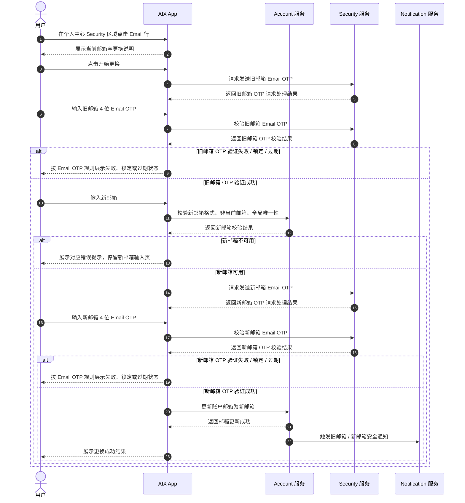
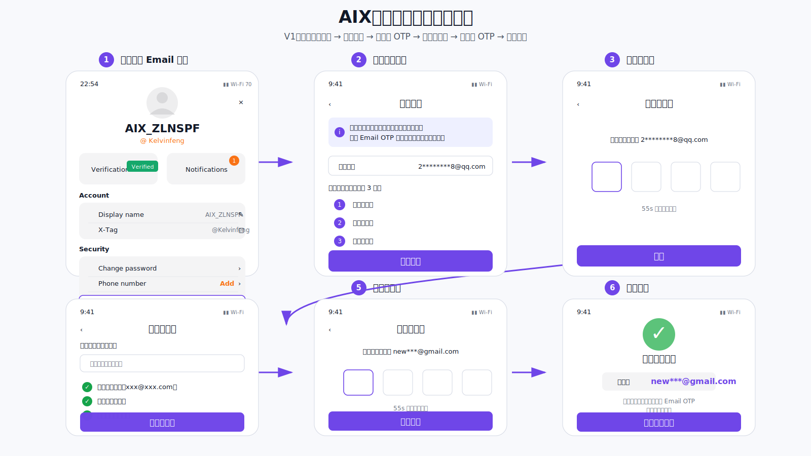
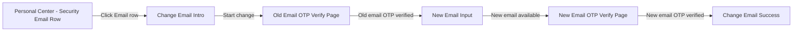

# Change Email 更换邮箱 PRD

## 0. 功能粒度判断

更换邮箱是一个独立功能，原因如下：

| 判断维度 | 结论 |
|---|---|
| 目标 | 允许已登录用户将账户邮箱从旧邮箱更新为新邮箱 |
| 入口 | 从个人中心 Security 区域的 Email 行进入，Email 行需要右箭头表示可点击 |
| 页面 | 包含邮箱入口、更换说明、旧邮箱 OTP、新邮箱输入、新邮箱 OTP、成功提示等独立页面 / 节点 |
| 业务结果 | 成功结果为账户邮箱更新；失败结果为账户邮箱保持不变 |
| 依赖 | 引用 Security / Email OTP Verification 公共认证能力，不重复定义验证码公共规则 |
| 验收 | 可用独立验收标准覆盖，不应混入注册、登录、密码重置或通知中心 PRD |

---

## 1. 文档信息

| 项目 | 内容 |
|---|---|
| 功能名称 | Change Email 更换邮箱 |
| 所属模块 | Account |
| Owner | TBD |
| 版本 | 1.1 |
| 状态 | Draft |
| 更新时间 | 2026-05-05 |
| 来源文档 | 用户需求 2026-05-05；用户补充确认 2026-05-05；用户最新确认 2026-05-05；Atome / OWASP 公开参考；Account / Security 知识库 |
| Brief | `requirements/2026-05/account/_brief-change-email.md` |
| Prototype | `requirements/2026-05/account/assets/change-email/change-email-mid-fi-prototype.svg` |
| Research | 不单独建 research 文件；调研结论已沉淀于 brief 与本文第 3 章 |

---

## 2. 需求背景、目标与范围

### 2.1 需求背景

用户希望在 AIX 内增加“更换邮箱”功能，使已注册用户可以在个人中心将账户邮箱更新为新的邮箱地址。

当前 Account 知识库已确认邮箱全局唯一，不允许重复注册或绑定；Security 知识库已沉淀 Email OTP 规则、验证码有效期、失败锁定、重发规则和设备限制。

### 2.2 用户问题 / 业务问题

1. 用户邮箱发生变更后，需要有自助更新账户邮箱的路径。
2. 邮箱会影响登录账号、找回密码和 Email OTP 接收，不能采用无验证保存模式。
3. 本版以旧邮箱 OTP 和新邮箱 OTP 完成邮箱控制权验证，不额外设计密码 / BIO 当前账户验证页。

### 2.3 需求目标

1. 在个人中心 Security 区域提供 Email 行入口，并展示向右箭头表示可点击。
2. 用户必须通过旧邮箱 Email OTP 验证，证明仍控制当前邮箱。
3. 用户必须通过新邮箱 Email OTP 验证，证明新邮箱可接收邮件。
4. 更换成功后，账户邮箱更新为新邮箱，后续登录账号、找回密码邮箱和 Email OTP 接收邮箱使用新邮箱。
5. 更换失败、取消、验证码失败、锁定、过期或重发超限时，不得更新账户邮箱。

### 2.4 涉及功能清单

| 功能点 | 本期范围 | 优先级 | 状态 | 说明 |
|---|---|---|---|---|
| 更换邮箱入口 | In Scope | P0 | Confirmed | 放在个人中心 Security 区域的 Email 行，Email 行有右箭头 |
| 更换邮箱说明 | In Scope | P0 | Confirmed | 说明更换邮箱影响登录、找回密码和 Email OTP 接收 |
| 旧邮箱 Email OTP 验证 | In Scope | P0 | Confirmed | 用户已确认需要验证旧邮箱 |
| 新邮箱输入与校验 | In Scope | P0 | Confirmed | 校验格式、非当前邮箱、全局唯一性 |
| 新邮箱 Email OTP 验证 | In Scope | P0 | Confirmed | 验证新邮箱可接收邮件 |
| 账户邮箱更新 | In Scope | P0 | Confirmed | 旧邮箱 OTP 与新邮箱 OTP 均通过后更新 |
| 成功提示与会话刷新 | In Scope | P1 | Confirmed | 不强制登出当前设备；不清除 BIO；刷新当前会话 email |
| 安全通知 | In Scope | P1 | Open | 旧邮箱、新邮箱 Email 通知必做建议；站内信 / Push 取决于模板支持 |
| 密码 / BIO 当前账户验证页 | Out of Scope | P1 | Confirmed | 用户已确认不单独设计该步骤 |
| 旧邮箱不可用页 / 客服入口 | Out of Scope | P1 | Confirmed | 页面内不提供入口；既有客服处理路径不在本文展开 |
| 外部账户上下文同步 | Out of Scope | P1 | Confirmed | 用户确认不影响 DTC / AAI / KUN 等外部账户上下文 |

### 2.5 功能边界与拆分结论

| 相关能力 | 与本文关系 | 当前处理 | 对应文件 / 位置 |
|---|---|---|---|
| Account | 主功能 | 本文展开 | 本文 |
| Email OTP Verification | OTP 公共页面与规则 | 只引用，不重复定义验证码失败、过期、重发、锁定规则 | `knowledge-base/security/email-otp-verification.md` |
| Notification | 通知能力 | 只写触发和对象，模板细节待 Notification 支持 | `knowledge-base/common/notification.md` 如适用 |
| DTC / AAI / KUN | 外部账户上下文 | Out of Scope | 用户确认不影响 |
| 资金敏感操作限制 | 风控增强建议 | 本文暂不写成已确认规则；如需要可另行确认 | 待确认项 |

---

## 3. 竞品参考与安全参考

### 3.1 Atome 调研结论

| 对象 | 公开说明 | 对 AIX 的启发 |
|---|---|---|
| Atome SG / MY 更换邮箱 | 从 `Me` 页进入资料编辑，点击邮箱地址编辑并保存；公开文档未提到邮箱 OTP。 | 入口可参考个人中心已有邮箱展示位置；但 AIX 不照搬无验证保存，因为 AIX 邮箱影响登录、找回密码和 Email OTP 接收。 |
| Atome SG 更换手机号 | 区分仍可访问旧手机号与不可访问旧手机号；不可访问时走恢复入口。 | AIX 更换邮箱 V1 采用旧邮箱可访问则验证旧邮箱的思路；不可访问场景不在自助页面内展开。 |
| Atome PH 账户资料更新 | 部分资料因安全原因不允许直接修改；手机号更新可联系支持并提供所有权证明。 | 旧邮箱不可用时，不建议 V1 做无验证自助绕过。 |

### 3.2 安全参考结论

| 来源 | 结论 | 对 AIX 的启发 |
|---|---|---|
| OWASP Email Validation and Verification Cheat Sheet | 邮箱是身份标识和账号恢复链路的一部分，邮箱变更可能被攻击者用于账号接管。 | 更换邮箱必须验证邮箱控制权。 |
| OWASP Changing A User's Registered Email Address | 若没有更强 MFA，推荐同时确认当前邮箱与新邮箱；当前邮箱不可访问时建议走管理员 / Help Desk 等站外人工路径。 | AIX V1 采用旧邮箱 OTP + 新邮箱 OTP；不提供旧邮箱不可用的自助跳过入口。 |

---

## 4. 业务流程与规则

### 4.1 业务主流程说明

用户从个人中心 Security 区域的 Email 行进入更换邮箱流程。AIX 先展示当前邮箱与更换说明，用户点击开始更换后，AIX App 请求 Security 发送旧邮箱 Email OTP。Security 负责 OTP 生成、有效期、重发失效、锁定等认证规则，并由其对接通知通道完成邮件投递。用户完成旧邮箱 OTP 验证后，才允许输入新邮箱。

AIX 校验新邮箱格式、非当前邮箱、全局唯一性后，请求 Security 发送新邮箱 Email OTP。新邮箱 OTP 验证成功后，AIX 更新账户邮箱，并展示更换成功结果。

本流程不额外设计密码 / BIO 当前账户验证页；旧邮箱 OTP 是本功能内对当前邮箱控制权的验证。

验证码相关规则不在本文重复定义，直接引用 `knowledge-base/security/email-otp-verification.md`。

### 4.2 业务时序图

### 4.3 关键异常处理

| 异常场景 | 处理规则 |
|---|---|
| 旧邮箱 OTP 失败 / 锁定 / 过期 / 重发超限 | 直接引用 Email OTP 既有规则；账户邮箱不得更新 |
| 用户无法接收旧邮箱 OTP | 页面内不提供“无法访问旧邮箱”入口，不提供自助跳过旧邮箱验证；用户无法继续自助更换 |
| 新邮箱格式错误 | 停留新邮箱输入页，提示格式错误，不发送新邮箱 OTP |
| 新邮箱与当前邮箱相同 | 停留新邮箱输入页，提示不可与当前邮箱相同，不发送新邮箱 OTP |
| 新邮箱已被其他账户使用 | 停留新邮箱输入页，提示邮箱不可用，不发送新邮箱 OTP |
| 新邮箱 OTP 失败 / 锁定 / 过期 / 重发超限 | 直接引用 Email OTP 既有规则；账户邮箱不得更新 |
| 账户邮箱更新失败 | 提示稍后重试；账户邮箱不得产生半更新状态 |
| 通知发送失败 | 不影响邮箱更换成功结果；补发 / 重试规则待 Notification 确认 |

---

## 5. 页面与交互说明

### 5.1 中保真原型

### 5.2 页面关系总览图

### 5.3 Personal Center - Security Email Row

| 区块 | 内容 |
|---|---|
| 页面类型 | 入口节点 |
| 页面目标 | 在个人中心 Security 区域承载 Email 更换入口 |
| 入口 / 触发 | 用户进入个人中心 |
| 展示内容 | Account 区域展示 Display name、X-Tag；Security 区域展示 Change password、Phone number、Email |
| 用户动作 | 点击 Security 区域的 Email 行 |
| 系统处理 / 责任方 | AIX App 进入 Change Email Intro |
| 元素 / 状态 / 提示规则 | Email 行展示当前邮箱掩码；Email 行必须有向右箭头，表示可点击 |
| 成功流转 | 进入 Change Email Intro |
| 失败 / 异常流转 | 不适用 |
| 备注 / 边界 | Email 不放在 Account 区域，放在 Security 区域 |

### 5.4 Change Email Intro

| 区块 | 内容 |
|---|---|
| 页面类型 | 主页面 / 说明页 |
| 页面目标 | 告知用户将进行邮箱更换及需要完成的验证步骤 |
| 入口 / 触发 | 用户点击 Security 区域 Email 行 |
| 展示内容 | 当前邮箱掩码；更换影响说明；三步流程：验证旧邮箱、输入新邮箱、验证新邮箱 |
| 用户动作 | 点击“开始更换”；点击返回 |
| 系统处理 / 责任方 | 点击开始更换后，AIX App 请求 Security 发送旧邮箱 Email OTP |
| 元素 / 状态 / 提示规则 | 文案需说明：更换邮箱会影响登录、找回密码和 Email OTP 接收 |
| 成功流转 | 进入 Old Email OTP Verify Page |
| 失败 / 异常流转 | 用户返回个人中心 |
| 备注 / 边界 | 本页不展示密码 / BIO 验证入口，不展示旧邮箱不可用入口 |

### 5.5 Old Email OTP Verify Page

| 区块 | 内容 |
|---|---|
| 页面类型 | 认证页 |
| 页面目标 | 验证用户仍可访问当前旧邮箱 |
| 入口 / 触发 | 用户在 Change Email Intro 点击“开始更换” |
| 展示内容 | 旧邮箱掩码、4 位 Email OTP 输入框、重发倒计时、返回入口 |
| 用户动作 | 输入旧邮箱收到的 4 位 OTP；重发 OTP；返回 |
| 系统处理 / 责任方 | Security 负责旧邮箱 Email OTP 的生成、发送请求处理与校验；邮件投递由 Security 对接通知通道完成 |
| 元素 / 状态 / 提示规则 | 复用 Email OTP 规则：4 位数字、5 分钟有效、输入满 4 位自动提交、重发后旧 OTP 立即失效、仅最新一次 OTP 有效、仅发起请求设备可用 |
| 成功流转 | 进入 New Email Input |
| 失败 / 异常流转 | 按 Email OTP 失败、锁定、过期、重发超限规则处理 |
| 备注 / 边界 | 页面内不提供“无法访问旧邮箱”或“联系客服”入口 |

### 5.6 New Email Input

| 区块 | 内容 |
|---|---|
| 页面类型 | 主页面 / 表单页 |
| 页面目标 | 收集并校验新邮箱地址 |
| 入口 / 触发 | 旧邮箱 OTP 验证成功 |
| 展示内容 | 新邮箱输入框、校验提示、发送验证码按钮、返回入口 |
| 用户动作 | 输入新邮箱并点击发送验证码 |
| 系统处理 / 责任方 | AIX App / Account 服务校验邮箱格式、非当前邮箱、全局唯一性 |
| 元素 / 状态 / 提示规则 | 发送新邮箱 OTP 前完成唯一性校验，避免向不可用邮箱发送验证码 |
| 成功流转 | 新邮箱可用后进入 New Email OTP Verify Page |
| 失败 / 异常流转 | 格式错误、与当前邮箱相同、已存在邮箱冲突时停留当前页并提示 |
| 备注 / 边界 | 新邮箱已被使用的具体文案待 UX / Security 确认 |

### 5.7 New Email OTP Verify Page

| 区块 | 内容 |
|---|---|
| 页面类型 | 认证页 |
| 页面目标 | 验证新邮箱可接收邮件 |
| 入口 / 触发 | 新邮箱格式与唯一性校验通过 |
| 展示内容 | 新邮箱掩码、4 位 Email OTP 输入框、重发倒计时、返回入口 |
| 用户动作 | 输入新邮箱收到的 4 位 OTP；重发 OTP；返回 |
| 系统处理 / 责任方 | Security 负责新邮箱 Email OTP 的生成、发送请求处理与校验；邮件投递由 Security 对接通知通道完成 |
| 元素 / 状态 / 提示规则 | 复用 Email OTP 规则：4 位数字、5 分钟有效、输入满 4 位自动提交、重发后旧 OTP 立即失效、仅最新一次 OTP 有效、仅发起请求设备可用 |
| 成功流转 | Account 服务更新账户邮箱 |
| 失败 / 异常流转 | 按 Email OTP 失败、锁定、过期、重发超限规则处理 |
| 备注 / 边界 | 新邮箱 OTP 未验证成功前不得更新账户邮箱 |

### 5.8 Change Email Success

| 区块 | 内容 |
|---|---|
| 页面类型 | 成功页 / 成功提示 |
| 页面目标 | 告知用户邮箱已更换成功 |
| 入口 / 触发 | 旧邮箱 OTP 与新邮箱 OTP 均验证成功，账户邮箱更新成功 |
| 展示内容 | 更换成功提示；新邮箱展示；返回个人中心入口 |
| 用户动作 | 点击返回个人中心 |
| 系统处理 / 责任方 | AIX App 刷新当前会话 email 信息；Account 服务保留更新结果 |
| 元素 / 状态 / 提示规则 | 不强制登出当前设备；不清除 BIO |
| 成功流转 | 返回个人中心，Security 区域 Email 行展示新邮箱 |
| 失败 / 异常流转 | 如页面刷新失败，重新拉取账户信息 |
| 备注 / 边界 | 更换成功后后续登录账号、找回密码邮箱、Email OTP 接收邮箱使用新邮箱 |

---

## 6. 字段、接口与数据

| 类型 | 名称 | 所属系统 | 来源 | 用途 | 规则 / 输入输出 | 异常处理 |
|---|---|---|---|---|---|---|
| 字段 | currentEmail | Account | 账户信息 | 展示当前邮箱、发送旧邮箱 OTP、判断新邮箱是否相同 | 只读；页面展示时建议掩码 | 获取失败时无法进入更换邮箱流程 |
| 字段 | newEmail | Account | 用户输入 | 新邮箱地址 | 需满足邮箱格式；不得等于 currentEmail；不得与其他账户邮箱冲突 | 格式错误 / 冲突时停留输入页 |
| 能力 | Old Email OTP | Security | Email OTP Verification | 验证旧邮箱控制权 | 4 位数字；5 分钟有效；重发后旧 OTP 失效；仅最新 OTP 有效；仅发起请求设备可用 | 按 Email OTP 规则处理 |
| 能力 | New Email OTP | Security | Email OTP Verification | 验证新邮箱可接收邮件 | 同 Email OTP 规则 | 按 Email OTP 规则处理 |
| 接口 / 能力 | Check email availability | Account | Account 知识库 / 本 PRD | 校验新邮箱是否可用 | 发送新邮箱 OTP 前完成 | 不可用时不发送 OTP |
| 接口 / 能力 | Update account email | Account | 本 PRD | 将账户邮箱更新为新邮箱 | 必须在旧邮箱 OTP、新邮箱 OTP 均通过后执行 | 更新失败时不得变更邮箱 |
| 数据 | accountEmailUpdatedAt | Account | 本 PRD | 记录邮箱更新时间 | 推荐记录 | 不影响主流程 |
| 日志 | Change Email audit log | Account / Security | 本 PRD | 排障与风险追踪 | 推荐记录 UID、旧邮箱、新邮箱、设备、IP、时间、结果、失败原因 | 字段细节待后端 / Security 确认 |

---

## 7. 通知规则

| 触发事件 | 通知渠道 | 通知对象 | 文案 / 模板 | 跳转目标 | 失败 / 补发规则 |
|---|---|---|---|---|---|
| 邮箱更换成功 | Email | 旧邮箱 | 安全通知：账户邮箱已被更换 | 不强制要求；可跳转安全设置 | 待 Notification 确认 |
| 邮箱更换成功 | Email | 新邮箱 | 确认通知：该邮箱已绑定为账户邮箱 | 可跳转个人中心 / 安全设置 | 待 Notification 确认 |
| 邮箱更换成功 | In-app / Push | 当前账户 | 如 Notification 支持安全事件模板，则发送站内信 / Push | 个人中心 / 安全设置 | 无模板不阻塞 V1 |

---

## 8. 权限 / 合规 / 风控

| 类型 | 规则 | 影响 | 来源 |
|---|---|---|---|
| 权限 | 用户必须处于已登录状态才能发起更换邮箱 | 未登录用户不能进入自助更换邮箱流程 | brief |
| 风控 | 旧邮箱必须完成 Email OTP 验证 | 防止攻击者绕过旧邮箱控制权直接换绑 | 用户确认；OWASP |
| 风控 | 新邮箱必须完成 Email OTP 验证 | 确认用户可接收新邮箱邮件 | brief |
| 风控 | 页面内不提供旧邮箱不可用入口，不提供自助跳过验证 | 降低账号接管风险 | 用户最新确认；竞品参考 |
| 风控 | Email OTP 失败、过期、重发、锁定均引用 Security / Email OTP 既有规则 | 防止重复定义和规则分裂 | Security / Email OTP 知识库 |
| 隐私 | 页面展示邮箱时建议使用掩码 | 减少邮箱泄露风险 | Email OTP Verification 邮箱掩码规则 |
| 外部依赖边界 | 更换邮箱不影响 DTC / AAI / KUN 等外部账户上下文 | 避免把外部系统同步写成 AIX 事实 | 用户确认；系统边界 |

---

## 9. 待确认事项

| 问题 | 影响范围 | 当前处理 | 是否阻塞验收 | 建议确认人 |
|---|---|---|---|---|
| 新邮箱已被使用时，是否复用注册文案 `This email has been used`？ | 文案一致性与防枚举 | 推荐在已完成旧邮箱验证后可复用；若风控要求更强防枚举，可改为 `This email is unavailable` | 否 | 产品 / UX / Security |
| 站内信 / Push 安全通知模板是否已存在？ | 通知渠道完整性 | Email 通知必做建议；站内信 / Push 有模板则纳入，无模板不阻塞 V1 | 否 | 产品 / Notification |
| 操作日志 / 审计日志字段是否需要在正式 PRD 中要求？ | 排障与风险追踪 | 推荐记录 UID、旧邮箱、新邮箱、设备、IP、时间、结果、失败原因 | 否 | 后端 / Security / 风控 |
| 更换邮箱成功后是否需要增加资金敏感操作限制，例如 24 小时禁止提现 / 转账 / 兑换？ | 资金安全与风控 | 竞品常见做法，但尚未用户确认；本文不写成已确认规则 | 否 | 产品 / Security / 风控 |

---

## 10. 验收标准 / 测试场景

### 10.1 验收标准

| 验收场景 | 验收标准 |
|---|---|
| 页面入口 | 用户可从个人中心 Security 区域的 Email 行发起更换邮箱流程 |
| 页面入口 | Email 行展示当前邮箱掩码，并带向右箭头 |
| 流程说明 | 更换说明页展示当前邮箱、影响说明，以及 3 步流程：验证旧邮箱、输入新邮箱、验证新邮箱 |
| 旧邮箱验证 | AIX App 请求 Security 发送旧邮箱 Email OTP，并按 Email OTP 规则完成验证 |
| 旧邮箱验证 | 旧邮箱 OTP 未验证通过时，用户不能继续输入新邮箱 |
| 新邮箱输入 | 新邮箱必须满足邮箱格式要求，且不能与当前账户邮箱相同 |
| 新邮箱输入 | 新邮箱不能与其他账户已注册 / 已绑定邮箱冲突 |
| 新邮箱输入 | 系统在发送新邮箱 OTP 前完成新邮箱可用性校验 |
| 新邮箱验证 | AIX App 请求 Security 发送新邮箱 Email OTP，并按 Email OTP 规则完成验证 |
| 邮箱更新 | 旧邮箱 OTP 与新邮箱 OTP 均验证成功后，账户邮箱更新为新邮箱 |
| 成功处理 | 更换成功后，当前会话中的 email 信息刷新为新邮箱 |
| 成功处理 | 更换成功后，不强制登出当前设备，不清除 BIO |
| 成功处理 | 更换成功后，后续登录账号、找回密码邮箱、Email OTP 接收邮箱使用新邮箱 |
| 通知 | 更换成功后，系统向旧邮箱和新邮箱发送安全通知；站内信 / Push 视 Notification 模板支持情况执行 |
| 异常流程 | 页面内不提供旧邮箱不可用入口，不提供自助跳过旧邮箱验证 |
| 异常流程 | 更换失败、取消、OTP 失败、锁定、过期、重发超限时，不得更新账户邮箱 |
| 规则引用 | Email OTP 失效规则直接引用现有 Email OTP 规则：5 分钟有效、重新发送后旧验证码立即失效、仅最新一次验证码有效、验证码仅限发起请求设备使用 |
| 外部边界 | 更换邮箱不影响 DTC / AAI / KUN 等外部账户上下文 |

### 10.2 测试场景矩阵

| 场景 | 前置条件 | 用户操作 | 预期页面表现 | 预期系统结果 | 是否必测 |
|---|---|---|---|---|---|
| 正常更换邮箱 | 用户已登录，旧邮箱可接收邮件，新邮箱未被使用 | 完成旧邮箱 OTP、新邮箱输入、新邮箱 OTP | 展示更换成功 | 账户邮箱更新为新邮箱，当前会话 email 刷新 | 是 |
| 入口位置 | 用户进入个人中心 | 查看 Security 区域 | Security 区域存在 Email 行，且有右箭头 | 点击 Email 行进入更换说明页 | 是 |
| 旧邮箱 OTP 错误 | 用户进入旧邮箱 OTP 页 | 输入错误旧邮箱 OTP | 展示 Invalid OTP / 剩余次数提示 | 不进入新邮箱输入页，不更新邮箱 | 是 |
| 旧邮箱不可用入口 | 用户进入更换说明页或旧邮箱 OTP 页 | 查找旧邮箱不可用 / 联系客服入口 | 页面不展示该入口 | 自助流程不允许跳过旧邮箱 OTP | 是 |
| 新邮箱格式错误 | 旧邮箱 OTP 已通过 | 输入非法邮箱 | 输入页展示错误 | 不发送新邮箱 OTP | 是 |
| 新邮箱与当前邮箱相同 | 旧邮箱 OTP 已通过 | 输入当前邮箱 | 输入页展示错误 | 不发送新邮箱 OTP | 是 |
| 新邮箱已被使用 | 旧邮箱 OTP 已通过 | 输入已存在邮箱 | 输入页展示邮箱不可用提示 | 不发送新邮箱 OTP | 是 |
| 新邮箱 OTP 错误 | 新邮箱可用且已发送 OTP | 输入错误新邮箱 OTP | 展示 Invalid OTP / 剩余次数提示 | 不更新邮箱 | 是 |
| OTP 过期 | 旧邮箱或新邮箱 OTP 超过有效期 | 输入过期 OTP | 展示过期 / 重试提示 | 不更新邮箱，需重新发送 OTP | 是 |
| 重发 OTP | OTP 页面倒计时结束 | 点击重新发送 | 展示新 OTP 已发送状态 | 旧 OTP 立即失效，仅最新 OTP 有效 | 是 |
| 更新邮箱失败 | 旧邮箱与新邮箱 OTP 均通过 | 系统更新失败 | 展示稍后重试提示 | 不应产生半更新状态 | 是 |
| 成功通知 | 邮箱更新成功 | 完成流程 | 成功页展示 | 旧邮箱和新邮箱触发安全通知 | 是 |
| 外部账户上下文 | 邮箱更新成功 | 检查外部账户上下文 | 页面无外部同步提示 | 不影响 DTC / AAI / KUN 上下文 | 是 |

---

## 11. 来源引用

- Brief: `requirements/2026-05/account/_brief-change-email.md`
- Prototype: `requirements/2026-05/account/assets/change-email/change-email-mid-fi-prototype.svg`
- (Ref: 用户需求 / 2026-05-05 / “我希望增加一个更换邮箱的功能”)
- (Ref: 用户补充确认 / 2026-05-05 / 入口放在个人中心邮箱展示位置；需要验证旧邮箱；外部账户上下文不影响)
- (Ref: 用户确认 brief / 2026-05-05)
- (Ref: 用户最新确认 / 2026-05-05 / Email 位于 Security 区域且有右箭头；移除密码或 BIO 当前账户验证页；移除旧邮箱不可用页；精简流程规则与状态规则)
- (Ref: Atome SG Help / How do I change the email address for my account)
- (Ref: Atome MY Help / How do I change the email address for my account)
- (Ref: Atome SG Help / How do I change the mobile number for my account)
- (Ref: Atome PH Help / How do I update my account details)
- (Ref: knowledge-base/account/_index.md)
- (Ref: knowledge-base/security/_index.md)
- (Ref: knowledge-base/security/email-otp-verification.md)
- (Ref: knowledge-base/_system-boundary.md)
- (Ref: OWASP Email Validation and Verification Cheat Sheet / Email Change Workflows)
- (Ref: OWASP Changing A User's Registered Email Address)
