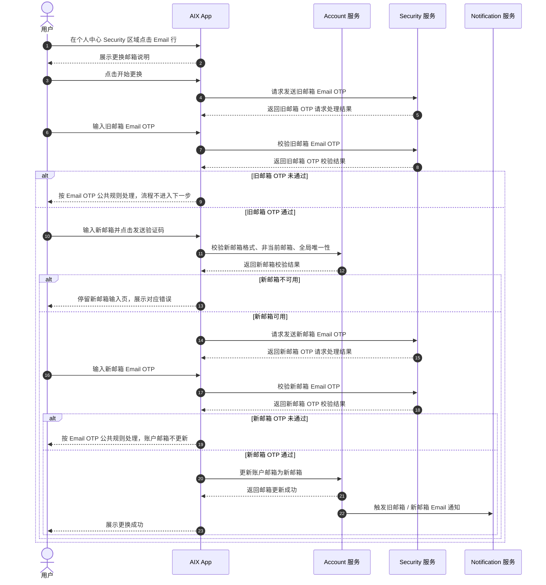
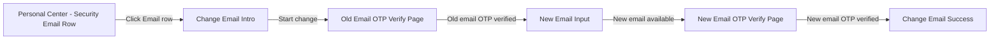
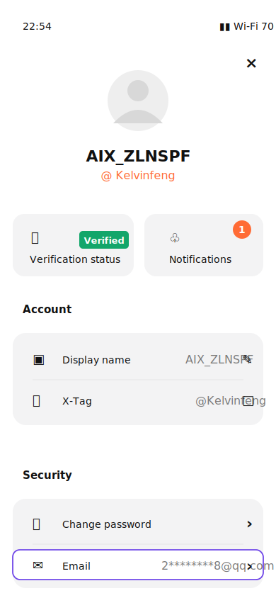
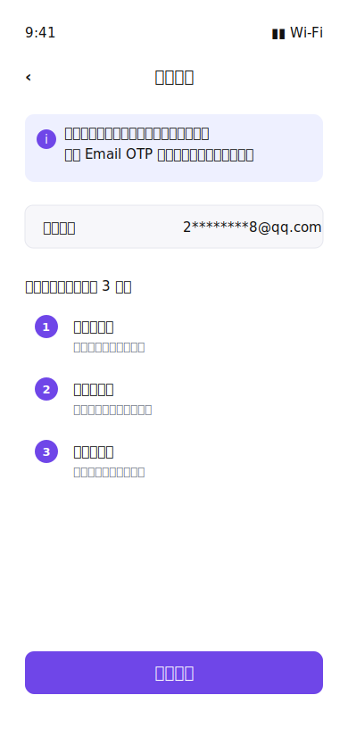
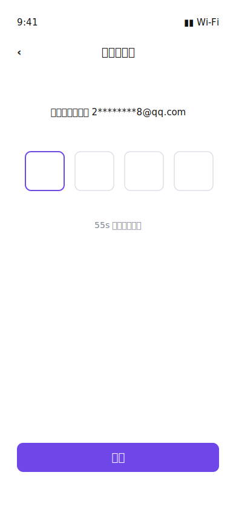
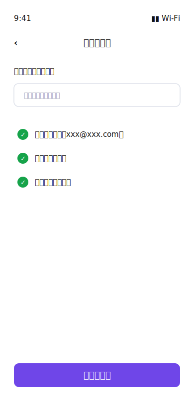
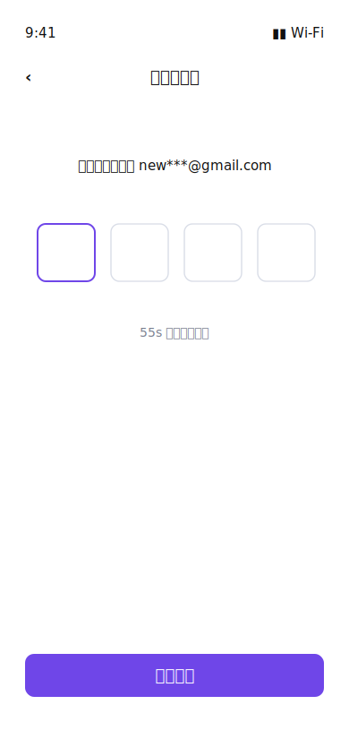
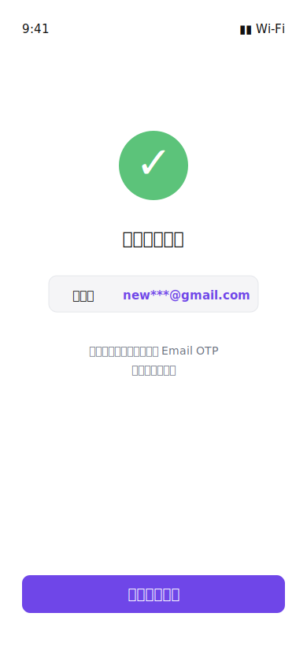

# Change Email 更换邮箱 PRD

## 0. 文档信息

| 项目 | 内容 |
|---|---|
| 功能名称 | Change Email 更换邮箱 |
| 所属模块 | Account |
| PRD 版本 | v1.3 |
| 状态 | Draft |
| Owner | TBD |
| 创建时间 | 2026-05-05 |
| 更新时间 | 2026-05-06 |
| 关联 Brief | `requirements/2026-05/account/_brief-change-email.md` |
| 关联原型 | `requirements/2026-05/account/assets/change-email/` |
| 依赖公共能力 | Email OTP Verification、Notification |

---

## 1. 功能结论

### 1.1 本期做什么

- 在个人中心 Security 区域的 Email 行提供更换邮箱入口，Email 行右侧展示向右箭头。
- 用户通过旧邮箱 Email OTP 验证后，才可输入新邮箱。
- 用户输入新邮箱后，系统在发送新邮箱 Email OTP 前完成邮箱格式、非当前邮箱、全局唯一性校验。
- 用户通过新邮箱 Email OTP 验证后，Account 服务将账户邮箱更新为新邮箱。
- 更换成功后，当前会话 email 刷新为新邮箱；后续登录账号、找回密码邮箱和 Email OTP 接收邮箱使用新邮箱。

### 1.2 本期不做什么

- 不单独增加密码 / BIO 当前账户验证页。
- 不提供旧邮箱不可用入口，不提供自助跳过旧邮箱 OTP 验证。
- 不影响 DTC / AAI / KUN 等外部账户上下文。
- 不在本文重复定义 Email OTP 位数、有效期、重发、锁定、设备限制等公共规则。
- 资金敏感操作限制按 CE-TBD-003 待确认；未确认前不作为开发范围。

### 1.3 关键产品规则

| 规则 | 说明 | 来源 |
|---|---|---|
| 邮箱入口位置 | Email 行位于个人中心 Security 区域，不放在 Account 区域 | 用户最新确认 |
| Email 行可点击 | Email 行右侧必须展示向右箭头 | 用户最新确认 |
| 邮箱掩码 | 当前邮箱、新邮箱展示均按 Email OTP Verification 掩码规则处理：`@` 前首位和末位明文，邮箱后缀明文，中间字符按同位数展示 `*`；例如 `test43500@gmail.com` → `t*******0@gmail.com` | `knowledge-base/security/email-otp-verification.md` |
| 邮箱唯一性 | 邮箱全局唯一，不允许重复注册或绑定 | `knowledge-base/account/_index.md` |
| 旧邮箱验证 | 旧邮箱 OTP 验证通过前，不允许进入新邮箱输入 | 用户确认；OWASP |
| 新邮箱验证 | 新邮箱 OTP 验证成功前，不得更新账户邮箱 | 用户确认；OWASP |
| Email OTP 公共规则 | Old Email OTP / New Email OTP 均复用 Email OTP Verification | `knowledge-base/security/email-otp-verification.md` |
| 成功后会话 | 更换成功后刷新当前会话 email，不强制登出当前设备，不清除 BIO | 用户确认 |

---

## 2. 主流程

### 2.1 业务时序图

### 2.2 关键校验与失败处理

| 场景 | 处理规则 | 用户提示 / 结果 | 来源 |
|---|---|---|---|
| 旧邮箱 OTP 失败 / 锁定 / 过期 / 重发超限 | 复用 Email OTP Verification | 按 Email OTP 公共规则处理；账户邮箱不得更新 | `knowledge-base/security/email-otp-verification.md` |
| 新邮箱为空 | 不发送新邮箱 OTP | `Email should not be empty` | `knowledge-base/account/registration.md` |
| 新邮箱超过长度限制 | 最长 103 字符，超出不可继续输入；后端收到超长值时按格式错误处理 | 前端限制输入；必要时提示 `Email format is invalid` | `knowledge-base/account/registration.md` |
| 新邮箱格式错误 | 不发送新邮箱 OTP | `Email format is invalid` | `knowledge-base/account/registration.md` |
| 新邮箱与当前邮箱相同 | 不发送新邮箱 OTP；后端兜底校验 | `This is already your current email` | 本 PRD |
| 新邮箱已被其他账户使用 | 不发送新邮箱 OTP；后端按邮箱全局唯一性校验 | `This email has been used` | `knowledge-base/account/registration.md` |
| 新邮箱可用性校验通过 | 请求发送新邮箱 OTP，不更新账户邮箱 | 进入 New Email OTP Verify Page | 本 PRD |
| 新邮箱 OTP 失败 / 锁定 / 过期 / 重发超限 | 复用 Email OTP Verification | 按 Email OTP 公共规则处理；账户邮箱不得更新 | `knowledge-base/security/email-otp-verification.md` |
| 邮箱更新时发现新邮箱已不可用 | 更新前再次校验邮箱全局唯一性，避免并发占用 | 不更新账户邮箱，提示 `This email has been used` | 本 PRD |
| 账户邮箱更新失败 | 保持原邮箱，不产生半更新状态 | `Something went wrong. Please try again later` | 本 PRD |
| 通知发送失败 | 不影响成功页展示 | 邮箱更换结果保持成功 | 本 PRD |

---

## 3. 页面与交互

### 3.1 页面关系图

---

### 3.2 页面：Personal Center - Security Email Row

**页面目的**  
提供更换邮箱入口。

**展示规则**
- Email 行位于 Security 区域，不放在 Account 区域。
- Email 行展示当前邮箱掩码。
- Email 行右侧展示向右箭头。

**交互与校验规则**

| 场景 / 元素 | 规则 | 不满足时提示 / 结果 | 后续流转 |
|---|---|---|---|
| 点击 Email 行 | 用户必须处于已登录状态 | 未登录用户无法进入个人中心 | 进入 Change Email Intro |

---

### 3.3 页面：Change Email Intro

**页面目的**  
展示当前邮箱并发起更换流程。

**展示规则**
- 当前邮箱按 Email OTP Verification 掩码规则展示。

**交互与校验规则**

| 场景 / 元素 | 规则 | 不满足时提示 / 结果 | 后续流转 |
|---|---|---|---|
| 点击开始更换 | 请求发送旧邮箱 Email OTP | 按 Email OTP 发送失败规则处理 | 进入 Old Email OTP Verify Page |
| 点击返回 | 返回上一页 | 不变更任何数据 | 返回个人中心 |

---

### 3.4 复用页面：Old Email OTP Verify Page

> 复用 `knowledge-base/security/email-otp-verification.md`，本需求不改造该页面。

**流转规则**

| 场景 | 后续流转 |
|---|---|
| 旧邮箱 OTP 验证成功 | 进入 New Email Input |
| 旧邮箱 OTP 验证失败 / 锁定 / 过期 / 重发超限 | 按 Email OTP 公共规则处理；账户邮箱不更新 |

---

### 3.5 页面：New Email Input

**页面目的**  
收集新邮箱，并在发送新邮箱 OTP 前完成校验。

**展示规则**
- 新邮箱校验提示按原型展示；具体通过 / 不通过状态以输入和后端校验结果为准。

**交互与校验规则**

| 场景 / 元素 | 规则 | 不满足时提示 / 结果 | 后续流转 |
|---|---|---|---|
| 新邮箱为空 | 必填 | `Email should not be empty` | 停留当前页，不发送新邮箱 OTP |
| 新邮箱长度 | 最长 103 字符；超出不可继续输入 | 必要时按格式错误处理 | 停留当前页，不发送新邮箱 OTP |
| 新邮箱格式 | 与 Registration Email 输入规则保持一致 | `Email format is invalid` | 停留当前页，不发送新邮箱 OTP |
| 新邮箱与当前邮箱相同 | 前端拦截；后端需兜底校验 | `This is already your current email` | 停留当前页，不发送新邮箱 OTP |
| 点击发送验证码 | 前端校验通过后可点击 | 前端校验不通过时不可继续 | 请求 Account 校验新邮箱可用性 |
| 后端校验新邮箱唯一性 | 新邮箱不得被其他账户使用 | `This email has been used` | 停留当前页，不发送新邮箱 OTP |
| 后端校验通过 | 只发送新邮箱 OTP，不更新账户邮箱 | 不适用 | 进入 New Email OTP Verify Page |

---

### 3.6 复用页面：New Email OTP Verify Page

> 复用 `knowledge-base/security/email-otp-verification.md`，本需求不改造该页面。

**流转规则**

| 场景 | 后续流转 |
|---|---|
| 新邮箱 OTP 验证成功 | 更新账户邮箱，进入 Change Email Success |
| 新邮箱 OTP 验证失败 / 锁定 / 过期 / 重发超限 | 按 Email OTP 公共规则处理；账户邮箱不更新 |

---

### 3.7 成功页：Change Email Success

**页面目的**  
展示邮箱更换结果。

**展示规则**
- 新邮箱按 Email OTP Verification 掩码规则展示。

**交互与成功后处理**

| 场景 / 处理项 | 规则 | 结果 |
|---|---|---|
| 点击返回个人中心 | 返回个人中心 | 个人中心 Security 区域 Email 行展示新邮箱 |
| 数据变更 | Account 邮箱更新为新邮箱 | 后续登录账号、找回密码邮箱、Email OTP 接收邮箱使用新邮箱 |
| 会话 / 缓存刷新 | 当前会话中的 email 信息刷新为新邮箱 | 不强制登出当前设备，不清除 BIO |
| 通知触发 | 触发旧邮箱 / 新邮箱 Email 通知 | 通知失败不影响邮箱更换成功结果 |
| 操作日志 | 记录邮箱更换操作日志，用于问题排查和风控追踪 | 不影响用户前台流程 |

---

## 4. 通知

### 4.1 通知

已查 `knowledge-base/common/notification.md` 和 `reference-data/notification/system-notification-content.xlsx`：当前未发现 Change Email 成功对应的站内信 / Push 模板。本期只要求发送 Email 通知；站内信 / Push 不纳入 V1。

| 触发事件 | 渠道 | 对象 | 说明 | 失败处理 |
|---|---|---|---|---|
| 邮箱更换成功 | Email | 旧邮箱 | 通知用户账户邮箱已被更换 | 通知失败不回滚邮箱更新 |
| 邮箱更换成功 | Email | 新邮箱 | 通知用户该邮箱已绑定为账户邮箱 | 通知失败不回滚邮箱更新 |

---

## 5. 待确认项

| 编号 | 问题 | 影响范围 | 当前建议 | 是否阻塞 | 负责人 |
|---|---|---|---|---|---|
| CE-TBD-003 | 更换邮箱成功后是否增加资金敏感操作限制？ | 资金安全与风控 | 建议更换成功后 24 小时内限制出金类高风险操作，例如提现、转账、兑换；不影响登录、查看和入金。行业常见做法是安全项变更后临时限制资金敏感操作，RedotPay、Bybit、Binance 均有类似限制。 | 否 | 产品 / Security / 风控 |

---

## 6. 来源引用

- Brief: `requirements/2026-05/account/_brief-change-email.md`
- Prototype: `requirements/2026-05/account/assets/change-email/personal-center-security-email-row.svg`
- Prototype: `requirements/2026-05/account/assets/change-email/change-email-intro.svg`
- Prototype: `requirements/2026-05/account/assets/change-email/old-email-otp-verify.svg`
- Prototype: `requirements/2026-05/account/assets/change-email/new-email-input.svg`
- Prototype: `requirements/2026-05/account/assets/change-email/new-email-otp-verify.svg`
- Prototype: `requirements/2026-05/account/assets/change-email/change-email-success.svg`
- (Ref: 用户需求 / 2026-05-05 / “我希望增加一个更换邮箱的功能”)
- (Ref: 用户补充确认 / 2026-05-05 / 入口放在个人中心邮箱展示位置；需要验证旧邮箱；外部账户上下文不影响)
- (Ref: 用户确认 brief / 2026-05-05)
- (Ref: 用户最新确认 / 2026-05-05 / Email 位于 Security 区域且有右箭头；移除密码或 BIO 当前账户验证页；移除旧邮箱不可用页；精简流程规则与状态规则)
- (Ref: 用户评审调整 / 2026-05-06 / 复用页仅写流转；内部字段接口不写；移除权限、风控、验收场景；待确认项只保留资金敏感操作限制)
- (Ref: prd-template/standard-prd-template.md / v1.6)
- (Ref: knowledge-base/account/_index.md)
- (Ref: knowledge-base/account/registration.md)
- (Ref: knowledge-base/security/email-otp-verification.md)
- (Ref: knowledge-base/common/notification.md)
- (Ref: reference-data/notification/system-notification-content.xlsx)
- (Ref: knowledge-base/_system-boundary.md)
- (Ref: Atome SG Help / How do I change the email address for my account)
- (Ref: Atome MY Help / How do I change the email address for my account)
- (Ref: Atome SG Help / How do I change the mobile number for my account)
- (Ref: Atome PH Help / How do I update my account details)
- (Ref: RedotPay Help / Changing Your Phone Number or Email)
- (Ref: RedotPay Help / Why is my card limit temporarily reduced for security)
- (Ref: Bybit Help / How to Update Your Registered Email Address)
- (Ref: Binance Support / How to Change My Binance Account Email)
- (Ref: OWASP Email Validation and Verification Cheat Sheet / Email Change Workflows)
- (Ref: OWASP Changing A User's Registered Email Address)
